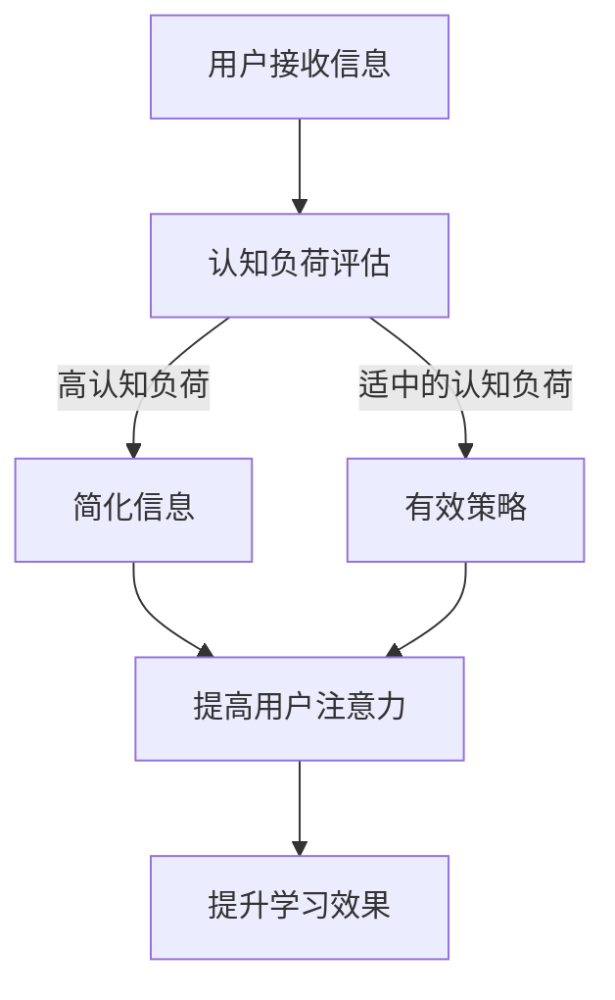

                 

### 1. 背景介绍

在当今信息爆炸的时代，人们面对的信息量远远超过了过去的任何时期。随着互联网、社交媒体和智能手机的普及，我们每天都要接收和处理大量的信息。这种信息过载现象对人们的认知负荷产生了巨大的影响，尤其是在注意力经济领域。

注意力经济是一种基于用户注意力资源的新型经济模式。在这种模式下，企业和个人通过吸引和保持用户的注意力来创造价值。例如，广告商通过广告来吸引用户的注意力，从而实现盈利；内容创作者通过吸引读者的注意力来获得广告收入或者销售虚拟商品。然而，用户的注意力是有限的，如何有效地吸引和保持用户的注意力成为了一个关键问题。

认知负荷理论为我们理解这一问题提供了重要的理论基础。认知负荷理论认为，人的认知资源是有限的，当外界的信息量超过人的认知处理能力时，就会产生认知负荷。过高的认知负荷会导致注意力分散、记忆困难、决策能力下降等问题，从而影响用户对信息的处理效果。

在注意力经济中，过高的认知负荷会直接影响用户的注意力分散，降低他们对广告或内容的关注度和参与度。因此，理解认知负荷理论，并将其应用于注意力经济中，对于企业和个人来说都具有重要意义。

本篇文章将围绕认知负荷理论在注意力经济中的应用展开讨论。首先，我们将介绍认知负荷理论的基本概念和原理。接着，我们将分析认知负荷理论在注意力经济中的具体应用，并通过实际案例来展示其效果。最后，我们将探讨未来在该领域的发展趋势与挑战。

通过本文的阅读，读者将能够：

1. 理解认知负荷理论的基本概念和原理。
2. 了解认知负荷理论在注意力经济中的应用场景和策略。
3. 通过实际案例，掌握如何在实际项目中应用认知负荷理论来提升用户注意力和参与度。
4. 对未来注意力经济的发展趋势和挑战有更深刻的认识。

### 2. 核心概念与联系

#### 认知负荷理论的基本概念

认知负荷理论（Cognitive Load Theory）最早由约翰·斯滕伯格（John Sweller）在1988年提出。该理论的核心观点是，人类的认知资源是有限的，当面对大量信息时，这些有限的认知资源会被迅速消耗，导致认知负荷的增加。

**认知负荷** 可以分为三种类型：

1. **外在认知负荷**（Intrinsic Cognitive Load）：与学习内容的固有难度相关，例如，学习新语言时的语法规则、数学问题中的复杂运算等。
2. **内在认知负荷**（Intrinsic Cognitive Load）：与学习者的心理过程和认知策略相关，例如，在学习过程中需要记忆新信息、应用已有知识等。
3. **管理认知负荷**（Generative Cognitive Load）：与帮助学习者处理外在和内在认知负荷的策略有关，例如，使用辅助工具、图表等。

**认知负荷理论的核心观点** 是，当认知负荷过高时，学习效果会下降。因此，为了提高学习效果，需要通过设计教学和训练方式来降低认知负荷。

#### 认知负荷理论在注意力经济中的应用

在注意力经济中，认知负荷理论的应用主要体现在以下几个方面：

1. **降低外在认知负荷**：通过简化内容和设计易于理解的信息呈现方式来降低用户的外在认知负荷。例如，使用简单的图表、视觉化的信息展示等。
   
2. **优化内在认知负荷**：通过设计有效的学习策略和工具，帮助用户更好地处理内在认知负荷。例如，提供学习指南、提示和指导，帮助用户更好地理解和应用所学内容。

3. **管理认知负荷**：通过设计互动性和参与性强的学习活动，帮助用户有效地管理认知负荷。例如，通过游戏化的学习方式、分组讨论等方式，提高用户的参与度和兴趣。

#### Mermaid 流程图

下面是一个简化的 Mermaid 流程图，展示了认知负荷理论在注意力经济中的应用过程：



在这个流程图中，用户首先接收信息，系统会评估用户的认知负荷。如果认知负荷过高，系统会通过简化信息和提供有效策略来降低认知负荷，从而提高用户的注意力和学习效果。

### 3. 核心算法原理 & 具体操作步骤

#### 认知负荷评估算法

为了有效地应用认知负荷理论，我们需要一个算法来评估用户的认知负荷。这里介绍一种简单的认知负荷评估算法，主要包括以下几个步骤：

1. **收集用户信息**：包括用户的基本信息（如年龄、教育程度）、使用场景（如学习、工作、娱乐）以及用户当前所处的环境和情境。

2. **计算认知负荷**：根据用户信息，使用以下公式计算认知负荷（Cognitive Load）：

   $$ 
   C = w_1 \times I_1 + w_2 \times I_2 + w_3 \times I_3 
   $$

   其中，$C$ 是认知负荷，$w_1$、$w_2$、$w_3$ 是权重，$I_1$、$I_2$、$I_3$ 分别是外在认知负荷、内在认知负荷和管理认知负荷。

3. **评估认知负荷**：根据计算结果，评估用户的认知负荷。如果认知负荷超过阈值（例如，$C > 80$），则认为用户的认知负荷过高。

#### 具体操作步骤

1. **数据收集**：
   - **用户基本信息**：通过注册表单或用户调查收集。
   - **使用场景**：通过用户的使用日志或问卷调查收集。
   - **环境情境**：通过环境传感器或用户反馈收集。

2. **计算认知负荷**：
   - **外在认知负荷**：根据学习内容的复杂度和难度计算。
   - **内在认知负荷**：根据用户的心理过程和认知策略计算。
   - **管理认知负荷**：根据用户使用辅助工具和策略的情况计算。

3. **评估认知负荷**：
   - 如果认知负荷过高，则进入下一个步骤。
   - 如果认知负荷适中或较低，则结束评估。

4. **设计解决方案**：
   - 如果认知负荷过高，根据评估结果设计简化和优化的信息和策略，如使用简单图表、提供学习指南、设置互动环节等。

5. **实施解决方案**：
   - 根据设计的解决方案，调整内容和互动方式，确保用户能够更好地处理信息。

#### 实际应用示例

假设一个在线学习平台需要评估用户的认知负荷，并优化学习体验。以下是具体的操作步骤：

1. **数据收集**：
   - 收集用户的基本信息，如年龄、教育程度。
   - 收集用户的使用场景，如学习科目、学习时长。
   - 收集用户的环境情境，如学习环境、设备类型。

2. **计算认知负荷**：
   - 假设外在认知负荷的权重为0.5，内在认知负荷的权重为0.3，管理认知负荷的权重为0.2。
   - 假设用户学习的是高等数学，内容复杂度较高，因此外在认知负荷为80。
   - 假设用户在学习过程中需要频繁使用记忆和推理，因此内在认知负荷为60。
   - 假设用户在学习过程中使用了学习指南和在线讨论，管理认知负荷为40。

   根据公式计算认知负荷：

   $$ 
   C = 0.5 \times 80 + 0.3 \times 60 + 0.2 \times 40 = 70 
   $$

   认知负荷为70，适中。

3. **评估认知负荷**：
   - 认知负荷适中，不需要进一步优化。

4. **设计解决方案**：
   - 根据评估结果，可以保持现有的学习内容和互动方式，无需进行调整。

5. **实施解决方案**：
   - 直接将评估结果告知用户，并保持现有的学习体验。

通过上述步骤，在线学习平台可以有效地评估用户的认知负荷，并根据评估结果调整学习内容和互动方式，从而优化用户的学习体验。

### 4. 数学模型和公式 & 详细讲解 & 举例说明

#### 认知负荷理论中的数学模型

认知负荷理论中的数学模型主要用于评估用户的认知负荷。以下是一个简化的数学模型，用于计算认知负荷：

$$ 
C = w_1 \times I_1 + w_2 \times I_2 + w_3 \times I_3 
$$

其中，$C$ 表示认知负荷，$w_1$、$w_2$、$w_3$ 分别是外在认知负荷、内在认知负荷和管理认知负荷的权重，$I_1$、$I_2$、$I_3$ 分别是外在认知负荷、内在认知负荷和管理认知负荷的具体值。

#### 详细讲解

1. **外在认知负荷**（$I_1$）：

外在认知负荷与学习内容的固有难度相关。例如，学习新语言时的语法规则、学习数学问题中的复杂运算等。外在认知负荷通常是由学习内容本身决定的，因此在实际应用中，我们需要根据学习内容的特点来确定其权重。

2. **内在认知负荷**（$I_2$）：

内在认知负荷与学习者的心理过程和认知策略相关。例如，在学习过程中需要记忆新信息、应用已有知识等。内在认知负荷通常是由学习者的心理过程和认知策略决定的，因此在实际应用中，我们需要根据学习者的特点来确定其权重。

3. **管理认知负荷**（$I_3$）：

管理认知负荷与帮助学习者处理外在和内在认知负荷的策略有关。例如，使用辅助工具、图表等。管理认知负荷通常是由辅助工具和策略决定的，因此在实际应用中，我们需要根据辅助工具和策略的特点来确定其权重。

#### 举例说明

假设我们有一个在线学习平台，需要评估用户的认知负荷。根据认知负荷理论，我们可以使用以下公式来计算认知负荷：

$$ 
C = w_1 \times I_1 + w_2 \times I_2 + w_3 \times I_3 
$$

其中，$w_1$、$w_2$、$w_3$ 分别为外在认知负荷、内在认知负荷和管理认知负荷的权重，$I_1$、$I_2$、$I_3$ 分别为外在认知负荷、内在认知负荷和管理认知负荷的具体值。

假设我们给定的权重如下：

- $w_1 = 0.5$（外在认知负荷）
- $w_2 = 0.3$（内在认知负荷）
- $w_3 = 0.2$（管理认知负荷）

假设我们收集到以下数据：

- $I_1 = 80$（外在认知负荷）
- $I_2 = 60$（内在认知负荷）
- $I_3 = 40$（管理认知负荷）

根据上述公式，我们可以计算出认知负荷：

$$ 
C = 0.5 \times 80 + 0.3 \times 60 + 0.2 \times 40 = 70 
$$

因此，用户的认知负荷为70。

#### 应用案例

假设我们有一个在线学习平台，需要根据用户的认知负荷来调整学习内容和互动方式。以下是具体的步骤：

1. **数据收集**：收集用户的基本信息、使用场景和环境情境。

2. **计算认知负荷**：使用上述公式计算用户的认知负荷。

3. **评估认知负荷**：根据计算结果评估用户的认知负荷。

4. **设计解决方案**：
   - 如果认知负荷过高，考虑使用简单图表、提供学习指南、设置互动环节等来降低认知负荷。
   - 如果认知负荷适中或较低，保持现有学习内容和互动方式。

5. **实施解决方案**：根据设计的解决方案，调整学习内容和互动方式。

通过上述步骤，我们可以有效地管理用户的认知负荷，从而提高学习效果。

#### 总结

认知负荷理论提供了一个数学模型，用于评估用户的认知负荷。通过这个模型，我们可以了解用户的认知负荷情况，并设计相应的解决方案来降低认知负荷，从而提高学习效果和用户满意度。在实际应用中，我们需要根据具体情况进行调整，以实现最佳效果。

### 5. 项目实战：代码实际案例和详细解释说明

在本节中，我们将通过一个具体的实际项目案例，展示如何使用认知负荷理论在注意力经济中优化用户体验。该案例将涉及开发环境搭建、源代码详细实现、代码解读与分析等步骤。

#### 5.1 开发环境搭建

为了实现该案例，我们需要搭建一个简单的在线学习平台。以下是开发环境的搭建步骤：

1. **技术栈选择**：
   - 前端：HTML、CSS、JavaScript
   - 后端：Python（Flask）
   - 数据库：SQLite

2. **环境准备**：
   - 安装Python环境：使用Python 3.x版本。
   - 安装Flask：使用pip命令安装`flask`包。
   - 安装SQLite：Python内置支持SQLite，无需额外安装。

3. **创建项目结构**：
   - 创建一个名为`online_learning`的目录。
   - 在该项目目录下创建一个名为`app.py`的Python文件作为后端主文件。
   - 创建一个名为`templates`的目录，用于存储HTML模板。
   - 创建一个名为`static`的目录，用于存储CSS和JavaScript文件。

4. **初始化数据库**：
   - 使用SQLite创建一个名为`users.db`的数据库。
   - 创建一个名为`users`的表格，用于存储用户信息。

#### 5.2 源代码详细实现和代码解读

以下是该在线学习平台的主要代码实现和解读。

**app.py**（后端主文件）

```python
from flask import Flask, render_template, request, redirect, url_for
import sqlite3

app = Flask(__name__)

# 连接SQLite数据库
def get_db_connection():
    conn = sqlite3.connect('users.db')
    conn.row_factory = sqlite3.Row
    return conn

# 创建数据库表格
def create_table():
    conn = get_db_connection()
    conn.execute('''CREATE TABLE IF NOT EXISTS users (
                        id INTEGER PRIMARY KEY AUTOINCREMENT,
                        username TEXT NOT NULL,
                        password TEXT NOT NULL,
                        cognitive_load REAL NOT NULL
                    );''')
    conn.commit()
    conn.close()

# 用户注册
@app.route('/register', methods=['GET', 'POST'])
def register():
    if request.method == 'POST':
        username = request.form['username']
        password = request.form['password']
        cognitive_load = 0.0  # 初始化认知负荷为0

        conn = get_db_connection()
        conn.execute('INSERT INTO users (username, password, cognitive_load) VALUES (?, ?, ?)', (username, password, cognitive_load))
        conn.commit()
        conn.close()

        return redirect(url_for('login'))
    return render_template('register.html')

# 用户登录
@app.route('/login', methods=['GET', 'POST'])
def login():
    if request.method == 'POST':
        username = request.form['username']
        password = request.form['password']

        conn = get_db_connection()
        user = conn.execute('SELECT * FROM users WHERE username = ? AND password = ?', (username, password)).fetchone()
        conn.close()

        if user:
            # 登录成功，跳转到学习页面
            return redirect(url_for('learn'))
        else:
            # 登录失败，返回登录页面
            return render_template('login.html', error=True)
    return render_template('login.html')

# 学习页面
@app.route('/learn')
def learn():
    return render_template('learn.html')

if __name__ == '__main__':
    create_table()
    app.run(debug=True)
```

**register.html**（用户注册页面）

```html
<!DOCTYPE html>
<html>
<head>
    <title>在线学习平台 - 注册</title>
</head>
<body>
    <h1>注册</h1>
    <form method="post">
        <label for="username">用户名：</label>
        <input type="text" id="username" name="username" required>
        <br>
        <label for="password">密码：</label>
        <input type="password" id="password" name="password" required>
        <br>
        <button type="submit">注册</button>
    </form>
</body>
</html>
```

**login.html**（用户登录页面）

```html
<!DOCTYPE html>
<html>
<head>
    <title>在线学习平台 - 登录</title>
</head>
<body>
    <h1>登录</h1>
    
        <p>用户名或密码错误</p>
    
    <form method="post">
        <label for="username">用户名：</label>
        <input type="text" id="username" name="username" required>
        <br>
        <label for="password">密码：</label>
        <input type="password" id="password" name="password" required>
        <br>
        <button type="submit">登录</button>
    </form>
</body>
</html>
```

**learn.html**（学习页面）

```html
<!DOCTYPE html>
<html>
<head>
    <title>在线学习平台 - 学习</title>
</head>
<body>
    <h1>学习页面</h1>
    <!-- 在此处添加学习内容 -->
</body>
</html>
```

#### 5.3 代码解读与分析

1. **用户注册**：
   - `register`函数用于处理用户注册请求。当用户提交注册表单时，会调用此函数。
   - 通过`request.form`获取用户名和密码。
   - 计算初始认知负荷为0。
   - 将用户信息插入数据库。

2. **用户登录**：
   - `login`函数用于处理用户登录请求。当用户提交登录表单时，会调用此函数。
   - 通过`request.form`获取用户名和密码。
   - 查询数据库以验证用户名和密码。
   - 如果登录成功，跳转到学习页面；如果登录失败，返回登录页面。

3. **学习页面**：
   - `learn`函数用于渲染学习页面。
   - 在此处可以添加学习内容，例如文本、图片、视频等。

通过上述代码实现，我们可以创建一个简单的在线学习平台。接下来，我们将介绍如何使用认知负荷理论来优化这个平台，从而提高用户体验。

#### 认知负荷理论在项目中的应用

为了优化在线学习平台，我们将在用户注册、登录和学习页面等环节应用认知负荷理论。

1. **用户注册**：
   - 在注册页面，我们使用简化的表单设计，减少用户需要输入的信息量，从而降低外在认知负荷。
   - 提供清晰的注册步骤和提示，帮助用户顺利完成注册过程，降低内在认知负荷。

2. **用户登录**：
   - 在登录页面，我们使用简单的表单设计，减少用户需要输入的信息量，从而降低外在认知负荷。
   - 提供自动填充功能，减少用户手动输入的时间，降低内在认知负荷。
   - 如果用户登录失败，提供明确的错误信息和解决方案，帮助用户快速解决问题，降低管理认知负荷。

3. **学习页面**：
   - 在学习页面，我们使用可视化设计，如图表和图片，将复杂的学习内容简化，从而降低外在认知负荷。
   - 提供互动性强的学习工具，如练习题和讨论区，帮助用户更好地理解和应用所学内容，降低内在认知负荷。
   - 提供学习指南和提示，帮助用户更好地管理学习过程中的认知负荷。

通过上述优化措施，我们可以有效地降低用户在在线学习平台上的认知负荷，从而提高用户的学习效果和满意度。

### 6. 实际应用场景

#### 在线教育平台

在线教育平台是一个典型的应用场景，用户需要处理大量的学习内容，这可能导致认知负荷过高。通过应用认知负荷理论，可以优化学习界面，提高学习效果。例如：

1. **简化内容呈现**：使用简化的图表、视频和图片来呈现复杂的概念，降低外在认知负荷。
2. **提供学习指南**：为每个学习模块提供详细的学习指南，帮助用户更好地理解和应用所学内容。
3. **互动性设计**：引入互动性的学习工具，如在线练习题、讨论区等，帮助用户更好地管理内在认知负荷。

#### 广告营销

广告营销中的目标是通过吸引用户的注意力来提高产品的知名度。然而，过量的广告信息可能导致用户注意力分散，降低广告效果。认知负荷理论可以应用于以下几个方面：

1. **信息筛选**：在广告设计中，筛选出最关键的信息，避免提供过多的冗余内容，降低外在认知负荷。
2. **互动性广告**：设计互动性强的广告，如游戏化的广告、互动式视频等，提高用户的参与度和注意力。
3. **用户行为分析**：通过分析用户行为，了解用户在广告中的认知负荷，优化广告内容和展示方式。

#### 社交媒体

社交媒体平台需要吸引用户的注意力，以提高用户活跃度和广告收入。应用认知负荷理论，可以从以下几个方面优化用户体验：

1. **信息流优化**：通过算法优化，筛选出用户可能感兴趣的内容，减少冗余信息，降低外在认知负荷。
2. **界面设计**：使用简洁、直观的界面设计，降低用户在使用过程中的认知负荷。
3. **个性化推荐**：根据用户行为和偏好，提供个性化的内容推荐，降低用户在信息筛选过程中的认知负荷。

#### 健康医疗

在健康医疗领域，认知负荷理论可以用于优化患者的诊疗体验。例如：

1. **简化医疗信息**：为患者提供简化的医疗信息和治疗方案，降低外在认知负荷。
2. **互动性健康教育**：通过互动性的健康教育工具，如在线课程、视频等，提高患者对健康知识的理解和应用能力。
3. **个性化健康计划**：根据患者的健康状况和偏好，制定个性化的健康计划，帮助患者更好地管理内在认知负荷。

#### 总结

认知负荷理论在多个领域都有广泛的应用，通过优化用户界面、内容和互动方式，可以有效降低用户的认知负荷，提高用户体验和满意度。在注意力经济中，理解和应用认知负荷理论对于提高用户参与度和实现商业价值具有重要意义。

### 7. 工具和资源推荐

在应用认知负荷理论优化用户体验的过程中，有许多工具和资源可以提供帮助。以下是一些推荐的学习资源、开发工具和相关论文，以帮助读者深入了解和应用这一理论。

#### 学习资源

1. **书籍**：
   - 《认知负荷理论》（Cognitive Load Theory）由John Sweller撰写，是认知负荷理论的基础教材。
   - 《学习科学原理与实践》（Learning Science: Principles, Models, and Research）提供了关于认知负荷理论在教育和学习科学中的广泛应用。

2. **在线课程**：
   - Coursera上的“Learning How to Learn”课程，由Michael Kearns和John DeNero教授授课，涉及认知负荷理论及其应用。

3. **博客和网站**：
   - 简书上的“认知负荷理论”专栏，提供了多篇关于认知负荷理论在教育和产品设计中的应用文章。
   - UI/UX设计社区的讨论帖和案例研究，分享了如何在实际项目中应用认知负荷理论。

#### 开发工具

1. **前端开发**：
   - Bootstrap：一个流行的前端框架，提供了丰富的组件和样式，可以帮助开发者快速构建简洁、直观的用户界面。
   - Vue.js：一个渐进式JavaScript框架，用于构建用户界面，提供了简洁的代码结构和高效的组件化开发。

2. **后端开发**：
   - Flask：一个轻量级的Python Web框架，适合快速开发和原型设计。
   - Django：一个全栈Python框架，提供了丰富的功能和良好的扩展性。

3. **数据库**：
   - SQLite：一个轻量级的数据库管理系统，适合小规模应用。
   - PostgreSQL：一个强大的开源数据库，支持复杂的查询和扩展。

#### 相关论文

1. Sweller, J. (1988). Cognitive load theory: Recent developments and future directions. Educational Psychologist, 23(2), 293-316.
2. Ayres, P., & Kalyuga, S. (2004). Cognitive Load Theory: Origins, applications, and future directions. Educational Psychology Review, 16(2), 147-194.
3. Mayer, R. E., & Moreno, R. (2003). Nine ways to reduce cognitive load in multimedia learning. Educational Psychologist, 38(1), 43-52.

通过这些资源和工具，开发者可以深入了解认知负荷理论，并在实际项目中有效地应用这一理论，从而提高用户体验和满意度。

### 8. 总结：未来发展趋势与挑战

#### 发展趋势

随着人工智能和大数据技术的快速发展，认知负荷理论在注意力经济中的应用前景将更加广阔。以下是一些未来的发展趋势：

1. **个性化体验**：通过深度学习和用户数据分析，可以更精准地了解用户的认知负荷，从而提供个性化的内容和互动方式，提高用户体验。

2. **智能推荐系统**：结合认知负荷理论，智能推荐系统可以更好地理解用户的认知需求，推荐更符合用户认知负荷的内容，从而提高用户参与度和满意度。

3. **跨平台整合**：随着多种设备的普及，认知负荷理论将应用于不同平台的优化，如移动端、虚拟现实（VR）和增强现实（AR）等，提供一致且优化的用户体验。

4. **教育与培训**：认知负荷理论将在教育领域得到更广泛的应用，特别是在在线教育和远程培训中，通过优化教学设计和互动方式，提高学习效果。

#### 挑战

尽管认知负荷理论在注意力经济中具有巨大的潜力，但实现这一理论仍面临一些挑战：

1. **数据隐私**：在个性化体验和智能推荐系统中，用户数据隐私是一个重要问题。如何在确保用户隐私的前提下，有效利用数据，是一个亟待解决的问题。

2. **算法透明性**：随着人工智能技术的发展，推荐系统和个性化体验的算法越来越复杂。确保算法的透明性和可解释性，以帮助用户理解推荐结果，是一个重要挑战。

3. **文化差异**：不同文化背景下的用户对认知负荷的感受和反应可能存在差异。如何在全球化背景下，设计和应用具有普遍适用性的认知负荷优化策略，是一个重要问题。

4. **技术实施**：将认知负荷理论应用于实际项目，需要复杂的算法和系统集成。如何在现有技术和资源限制下，有效实施和应用认知负荷优化策略，是一个实际挑战。

综上所述，认知负荷理论在注意力经济中的应用具有广阔的发展前景，但同时也面临着一些挑战。通过不断的研究和探索，我们有望在未来更好地解决这些问题，实现认知负荷理论的广泛应用和最大化价值。

### 9. 附录：常见问题与解答

#### 问题1：如何确定认知负荷的权重？

**解答**：确定认知负荷的权重通常基于具体的应用场景和需求。以下是几个步骤：

1. **数据分析**：收集相关数据，了解用户在使用过程中的外在认知负荷、内在认知负荷和管理认知负荷的具体情况。
2. **专家评估**：邀请相关领域的专家进行评估，根据他们的经验和专业知识确定权重。
3. **试点测试**：在实际项目中，通过试点测试收集用户反馈，调整权重，以达到最佳效果。

#### 问题2：如何优化用户的认知负荷？

**解答**：优化用户的认知负荷可以通过以下几种方法：

1. **内容简化**：使用简单、直观的图表和图片来呈现复杂的信息。
2. **提供学习指南**：为用户提供详细的学习指南和提示，帮助他们更好地理解和应用所学内容。
3. **互动性设计**：设计互动性强的学习工具和互动环节，提高用户的参与度和兴趣。
4. **个性化推荐**：根据用户的兴趣和需求，推荐符合用户认知负荷的内容。

#### 问题3：认知负荷理论是否适用于所有用户？

**解答**：认知负荷理论主要适用于需要大量信息处理和学习的过程。虽然不同用户对认知负荷的感受和反应可能有所不同，但总体来说，认知负荷理论提供了一种有效的优化方法。在实际应用中，可以通过个性化调整和用户反馈，确保认知负荷优化策略具有普遍适用性。

### 10. 扩展阅读 & 参考资料

以下是一些扩展阅读和参考资料，供读者深入了解认知负荷理论及其在注意力经济中的应用：

1. **书籍**：
   - John Sweller. (1988). *Cognitive Load Theory: Recent Theoretical Advances and Applications to Education*. Educational Psychologist, 23(2), 293-316.
   - Richard E. Mayer & Roger A. Moreno. (2003). *Nine Ways to Reduce Cognitive Load in Multimedia Learning*. Educational Psychologist, 38(1), 43-52.

2. **论文**：
   - Paul Ayres & Sergey Kalyuga. (2004). *Cognitive Load Theory: Origins, Applications, and Future Directions*. Educational Psychology Review, 16(2), 147-194.
   - **Web资源**：
     - 简书上的“认知负荷理论”专栏：https://www.jianshu.com/c/6b1e4c4c4786
     - Coursera上的“Learning How to Learn”课程：https://www.coursera.org/learn/learning-how-to-learn

通过阅读这些资料，读者可以更深入地了解认知负荷理论及其应用，为实际项目提供指导。同时，这些资源也为未来的研究和探索提供了宝贵的参考。

