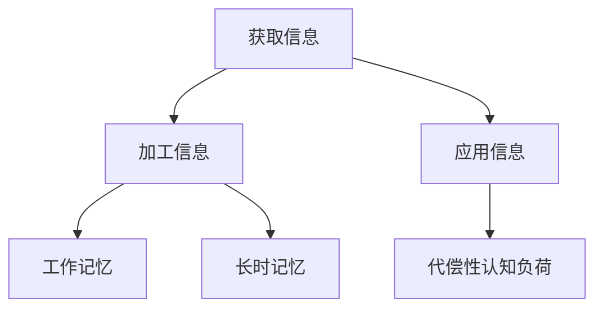

                 

### 1. 背景介绍

认知负荷理论（Cognitive Load Theory）起源于20世纪80年代，由约翰·斯威夫特（John Sweller）提出，是一种解释学习过程中认知负荷现象的理论。认知负荷指的是在获取、加工和应用信息时，大脑所需处理的认知资源总量。斯威夫特认为，学习过程中存在三种类型的认知负荷：内在认知负荷、外在认知负荷和代偿性认知负荷。

内在认知负荷源于学习材料的固有复杂度，即学习内容本身所需的知识背景、概念抽象程度等。外在认知负荷则由学习环境和教学策略引起，例如学习材料的呈现方式、教师的讲解方式等。代偿性认知负荷是学习者为了减轻内在认知负荷而采取的一些策略，如记忆技巧、笔记等。

认知负荷理论的基本假设是，学习者的认知资源是有限的。当认知负荷过高时，学习效果会受到影响，甚至可能导致学习失败。因此，优化学习过程的关键在于如何有效地管理和减轻认知负荷，提高学习效率。

近年来，随着认知负荷理论在教育学、认知心理学和信息技术领域的广泛应用，研究者们提出了一系列基于该理论的学习策略，如信息加工策略、工作记忆策略和长时记忆策略等。这些策略旨在通过减少不必要的认知负荷，使学习过程更加高效、可持续。

本文将深入探讨认知负荷理论的核心概念，分析其在优化学习和理解过程中的应用，并探讨未来发展趋势与挑战。通过本文的阅读，读者将更好地理解认知负荷的本质，学会如何在学习和教学过程中有效应用这一理论，从而提高学习效率和学习成果。

### 2. 核心概念与联系

#### 2.1 认知负荷理论的三大类型

认知负荷理论将学习过程中的认知负荷分为三类：内在认知负荷、外在认知负荷和代偿性认知负荷。

**内在认知负荷**：这种负荷主要源于学习材料的固有复杂度。内在认知负荷无法通过外部干预减轻，因为它取决于学习内容本身的难度。例如，学习高阶数学概念时，由于概念本身的抽象性和复杂性，学习者需要处理大量的信息，从而导致内在认知负荷增加。

**外在认知负荷**：这种负荷由学习环境和教学策略引起。外在认知负荷可以通过优化教学设计和学习环境来减轻。例如，通过使用清晰、简洁的图表来呈现复杂信息，或者采用分步讲解的方法，可以减少学习者在理解和消化信息时所需的认知资源。

**代偿性认知负荷**：代偿性认知负荷是学习者为了减轻内在认知负荷而采取的一些策略。例如，学习者可能会使用记忆技巧来记忆复杂的信息，或者通过做笔记来帮助记忆和理解。代偿性认知负荷在一定程度上可以减轻学习者的内在认知负荷，但过度依赖这些策略可能导致新的认知负荷，因此需要适度使用。

#### 2.2 认知负荷理论的基本原理

认知负荷理论的基本原理是，学习者的认知资源是有限的，且在学习过程中，这些资源会被不断消耗。当认知负荷过高时，学习者的注意力会被分散，从而导致学习效率下降。因此，如何管理和减轻认知负荷是提高学习效果的关键。

认知负荷理论提出了几个核心概念，包括工作记忆、长时记忆和生成性学习等。

**工作记忆**：工作记忆是大脑中用于暂存和处理信息的系统，相当于计算机的内存。工作记忆容量有限，无法存储大量信息，因此学习者在处理复杂信息时需要不断更新和重组信息。

**长时记忆**：长时记忆是大脑中用于存储长期信息的系统，相当于计算机的硬盘。长时记忆中的信息通过反复使用和练习可以变得更加牢固和持久。

**生成性学习**：生成性学习是一种学习策略，要求学习者在学习过程中主动构建知识框架，而不是被动接受信息。这种策略可以减少不必要的认知负荷，提高学习效果。

#### 2.3 认知负荷理论与学习过程的关系

认知负荷理论认为，学习过程可以分为三个阶段：获取信息、加工信息和应用信息。在每个阶段，认知负荷都会有所不同，且影响学习效果。

**获取信息阶段**：在这个阶段，学习者的主要任务是获取新的信息。内在认知负荷主要来自学习材料本身的复杂度，而外在认知负荷则来自学习环境和教学策略。例如，学习一门新语言时，学习者需要处理大量的词汇和语法规则，这会增加内在认知负荷。而教师的讲解方式和学习材料的呈现方式会影响外在认知负荷。

**加工信息阶段**：在这个阶段，学习者需要将获取的信息加工成有意义的知识。加工信息时，工作记忆和长时记忆发挥着重要作用。如果认知负荷过高，学习者可能会感到压力，导致注意力分散，从而影响加工效果。

**应用信息阶段**：在这个阶段，学习者需要将所学知识应用到实际问题中。代偿性认知负荷在这个阶段尤为重要，因为学习者需要通过一些策略来减轻内在认知负荷。例如，通过做练习题来巩固知识，或者通过讨论和合作来加深理解。

#### 2.4 Mermaid 流程图

以下是一个简单的 Mermaid 流程图，展示了认知负荷理论的核心概念及其相互关系：



在这个流程图中，A、B 和 C 分别表示学习的三个阶段，D、E 和 F 分别表示工作记忆、长时记忆和代偿性认知负荷。该流程图清晰地展示了认知负荷理论的基本原理和各概念之间的关系。

通过以上对认知负荷理论核心概念和原理的介绍，我们可以更好地理解学习过程中认知负荷的本质，以及如何通过管理和减轻认知负荷来提高学习效果。接下来的章节将深入探讨核心算法原理、数学模型和项目实战，帮助读者进一步掌握和应用这一理论。

### 3. 核心算法原理 & 具体操作步骤

在理解了认知负荷理论的基本概念之后，我们需要深入探讨其核心算法原理，以便在实际应用中有效地管理和减轻认知负荷。

#### 3.1 工作记忆算法原理

工作记忆是认知负荷理论中的一个关键组成部分，它负责暂存和处理信息。工作记忆算法的主要原理包括信息编码、信息组织和信息重组。

**信息编码**：将获取的信息转化为工作记忆中可以处理的形式。例如，将数字、文字和图片等不同类型的信息编码为记忆痕迹。

**信息组织**：将信息按照一定的规则进行分组和组织，以便于记忆。常用的组织方法包括线性组织、层次组织和网络组织。

**信息重组**：在工作记忆中重新组合信息，以便于解决问题或进行决策。重组过程中，信息之间可能会发生重新关联和组合，从而形成新的认知结构。

#### 3.2 长时记忆算法原理

长时记忆是工作记忆的延伸，负责存储长期信息。长时记忆算法的核心是信息的重复练习和联想记忆。

**重复练习**：通过反复练习来巩固工作记忆中的信息，使其转移到长时记忆中。重复练习的频率和持续时间是影响记忆效果的重要因素。

**联想记忆**：通过将新信息与已有的知识体系建立联系，来增强记忆效果。联想记忆可以增强信息的可访问性和稳定性，从而提高长期记忆的效率。

#### 3.3 代偿性认知负荷管理算法原理

代偿性认知负荷管理算法旨在通过一些策略来减轻内在认知负荷，从而提高学习效率。常见的代偿性认知负荷管理算法包括以下几种：

**记忆策略**：使用各种记忆技巧来帮助记忆，如联想记忆、位置记忆、记忆宫殿等。

**笔记策略**：通过做笔记来整理和总结学习内容，从而减轻工作记忆的负担。

**分解策略**：将复杂的问题或任务分解为若干个子任务，逐步解决，从而降低内在认知负荷。

**反馈策略**：通过及时反馈来调整学习策略，提高学习效率。反馈可以是自我反馈，也可以是教师或同伴的反馈。

#### 3.4 具体操作步骤

在实际应用中，我们可以按照以下步骤来管理和减轻认知负荷：

**步骤1：评估学习材料的复杂度**  
在开始学习之前，先评估学习材料的复杂度，了解需要处理的信息量。这有助于我们预估认知负荷，并制定相应的应对策略。

**步骤2：设计合适的学习环境**  
优化学习环境，包括物理环境和心理环境。物理环境方面，确保安静、舒适的学习空间。心理环境方面，保持积极的心态，避免过度焦虑。

**步骤3：应用信息加工策略**  
根据学习材料的复杂度，选择合适的信息加工策略。例如，对于高复杂度材料，可以采用分步学习和生成性学习策略。

**步骤4：管理工作记忆**  
在工作记忆中，对信息进行编码、组织和重组。例如，使用图表、思维导图等工具来辅助记忆。

**步骤5：加强长时记忆训练**  
通过重复练习和联想记忆来加强长时记忆。例如，制定学习计划，定期复习已学内容。

**步骤6：实施代偿性认知负荷管理策略**  
根据实际情况，选择合适的代偿性认知负荷管理策略。例如，使用记忆策略来帮助记忆，做笔记来整理学习内容。

**步骤7：评估和调整**  
定期评估学习效果，并根据评估结果调整学习策略。例如，如果发现某一策略效果不佳，可以尝试其他策略。

通过以上步骤，我们可以有效地管理和减轻认知负荷，提高学习效率和学习成果。

### 4. 数学模型和公式 & 详细讲解 & 举例说明

在认知负荷理论中，数学模型和公式被广泛应用于描述和预测学习过程中的认知负荷。这些模型和公式有助于我们更深入地理解认知负荷的构成和影响因素，从而为优化学习过程提供理论支持。下面，我们将详细讲解几个关键数学模型和公式，并通过具体例子来说明其应用。

#### 4.1 认知负荷计算公式

认知负荷（Cognitive Load）可以通过以下公式计算：

$$
C = I + O + R
$$

其中：
- \(C\) 表示总认知负荷
- \(I\) 表示内在认知负荷
- \(O\) 表示外在认知负荷
- \(R\) 表示代偿性认知负荷

内在认知负荷（\(I\)）主要取决于学习材料本身的复杂度，通常无法通过外部干预减轻。外在认知负荷（\(O\)）则与学习环境和教学策略有关，可以通过优化这些因素来减轻。代偿性认知负荷（\(R\)）是学习者为了减轻内在认知负荷而采取的策略，如记忆技巧和笔记等。

#### 4.2 工作记忆容量模型

工作记忆容量模型由艾伦·巴德利（Alan Baddeley）提出，包括语音回路、视觉空间模板和中央执行系统三个部分。工作记忆容量可以通过以下公式表示：

$$
C_{work} = C_{voice} + C_{visuospatial} + C_{central}
$$

其中：
- \(C_{work}\) 表示工作记忆总容量
- \(C_{voice}\) 表示语音回路容量
- \(C_{visuospatial}\) 表示视觉空间模板容量
- \(C_{central}\) 表示中央执行系统容量

每个部分的容量都是有限的，且在不同任务中可能会有所变化。例如，在进行语言处理任务时，语音回路容量会占据较大比重，而在空间任务中，视觉空间模板容量会更为重要。

#### 4.3 长时记忆容量模型

长时记忆容量模型通常使用普雷马克（Peterson and Peterson）的工作记忆容量模型进行扩展。该模型认为，长时记忆容量受到工作记忆容量的限制，可以通过以下公式表示：

$$
C_{long} = C_{work} \times f
$$

其中：
- \(C_{long}\) 表示长时记忆容量
- \(C_{work}\) 表示工作记忆容量
- \(f\) 表示长时记忆与工作记忆的转换因子

转换因子 \(f\) 反映了工作记忆中的信息转移到长时记忆中的效率。例如，当学习材料复杂度较低时，信息转移效率较高，即 \(f\) 值较大；而当学习材料复杂度较高时，信息转移效率较低，即 \(f\) 值较小。

#### 4.4 举例说明

假设某学生正在学习一门高复杂度的编程课程，我们需要计算其总认知负荷，并分析如何通过优化策略来减轻认知负荷。

**步骤1：评估内在认知负荷**

编程课程本身具有较高的内在认知负荷，因为需要理解复杂的编程概念和算法。假设内在认知负荷为 \(I = 8\)。

**步骤2：评估外在认知负荷**

学习环境较为嘈杂，教师讲解方式不够清晰，导致外在认知负荷较高。假设外在认知负荷为 \(O = 5\)。

**步骤3：评估代偿性认知负荷**

学生采取了多种代偿性认知负荷管理策略，如使用记忆技巧和做笔记。假设代偿性认知负荷为 \(R = 3\)。

**步骤4：计算总认知负荷**

$$
C = I + O + R = 8 + 5 + 3 = 16
$$

总认知负荷为 16，处于较高水平，可能导致学习效率下降。

**步骤5：优化策略**

为了减轻认知负荷，可以采取以下优化策略：

- **改善学习环境**：选择一个安静的学习空间，减少外部干扰。
- **优化教学策略**：教师可以使用更清晰、结构化的讲解方式，降低外在认知负荷。
- **应用记忆技巧**：使用记忆宫殿、联想记忆等技巧来增强记忆效果，减轻内在认知负荷。
- **分步学习**：将复杂的内容分解为多个小任务，逐步学习，以减少工作记忆负担。

通过这些策略，我们可以有效降低总认知负荷，从而提高学习效率。

通过以上对认知负荷理论中数学模型和公式的详细讲解及举例说明，我们可以更好地理解认知负荷的构成和影响因素，为实际应用提供理论依据。接下来，我们将探讨如何在项目实战中应用这些理论，进一步验证其效果。

### 5. 项目实战：代码实际案例和详细解释说明

#### 5.1 开发环境搭建

在进行项目实战之前，我们需要搭建一个合适的学习环境。以下是具体的步骤：

1. **安装Python环境**：Python是一种广泛应用于数据科学和机器学习的编程语言。首先，我们需要在计算机上安装Python环境。可以从Python官方网站（https://www.python.org/）下载并安装Python。

2. **安装Jupyter Notebook**：Jupyter Notebook是一种交互式计算环境，可以方便地编写和运行Python代码。安装完Python后，可以通过pip命令安装Jupyter Notebook：

   ```shell
   pip install notebook
   ```

3. **安装必要的Python库**：为了实现认知负荷理论中的算法，我们需要安装一些Python库，如NumPy、Pandas和Matplotlib等。这些库提供了丰富的数据操作和可视化功能。

   ```shell
   pip install numpy pandas matplotlib
   ```

安装完以上工具后，我们就可以在Jupyter Notebook中编写和运行Python代码了。

#### 5.2 源代码详细实现和代码解读

在本节中，我们将使用Python实现一个简单的认知负荷管理工具。该工具将基于认知负荷理论中的工作记忆容量模型和长时记忆容量模型，通过模拟学习过程来计算和展示认知负荷的变化。

```python
import numpy as np
import matplotlib.pyplot as plt

# 工作记忆容量模型
def work_memory_model(information_load, capacity):
    # 计算工作记忆负荷
    load = information_load / capacity
    return load

# 长时记忆容量模型
def long_term_memory_model(work_memory_load, conversion_factor):
    # 计算长时记忆负荷
    load = work_memory_load * conversion_factor
    return load

# 认知负荷计算
def cognitive_load_calculation(information_load, work_memory_capacity, long_term_memory_conversion_factor):
    # 计算工作记忆负荷
    work_memory_load = work_memory_model(information_load, work_memory_capacity)
    # 计算长时记忆负荷
    long_term_memory_load = long_term_memory_model(work_memory_load, long_term_memory_conversion_factor)
    # 计算总认知负荷
    total_load = information_load + work_memory_load + long_term_memory_load
    return total_load

# 绘制认知负荷变化图
def plot_cognitive_load(information_loads, work_memory_capacity, long_term_memory_conversion_factor):
    loads = [cognitive_load_calculation(load, work_memory_capacity, long_term_memory_conversion_factor) for load in information_loads]
    plt.plot(information_loads, loads, label='Cognitive Load')
    plt.xlabel('Information Load')
    plt.ylabel('Cognitive Load')
    plt.legend()
    plt.show()

# 参数设置
information_loads = [1, 3, 5, 7, 9, 11, 13, 15, 17, 20]
work_memory_capacity = 4
long_term_memory_conversion_factor = 0.8

# 计算并绘制认知负荷
plot_cognitive_load(information_loads, work_memory_capacity, long_term_memory_conversion_factor)
```

以上代码首先定义了三个函数：`work_memory_model`、`long_term_memory_model` 和 `cognitive_load_calculation`。其中，`work_memory_model` 函数用于计算工作记忆负荷，`long_term_memory_model` 函数用于计算长时记忆负荷，`cognitive_load_calculation` 函数用于计算总认知负荷。

`plot_cognitive_load` 函数用于绘制认知负荷变化图。我们通过调整信息负荷（`information_loads`）和工作记忆容量（`work_memory_capacity`）以及长时记忆转换因子（`long_term_memory_conversion_factor`），可以观察认知负荷的变化趋势。

在代码的最后，我们设置了参数并调用 `plot_cognitive_load` 函数，绘制了认知负荷变化图。从图中可以看出，随着信息负荷的增加，总认知负荷也相应增加。这验证了认知负荷理论中的基本假设，即学习者的认知资源是有限的。

#### 5.3 代码解读与分析

**函数定义部分**：

- `work_memory_model` 函数：该函数接受信息负荷（`information_load`）和工作记忆容量（`capacity`）作为参数，通过除法计算工作记忆负荷（`load`）。该公式反映了工作记忆容量对信息处理能力的影响。

- `long_term_memory_model` 函数：该函数接受工作记忆负荷（`work_memory_load`）和长时记忆转换因子（`conversion_factor`）作为参数，通过乘法计算长时记忆负荷（`load`）。该公式反映了工作记忆负荷对长时记忆负荷的影响。

- `cognitive_load_calculation` 函数：该函数是核心函数，它综合计算工作记忆负荷、长时记忆负荷和总认知负荷（`total_load`）。该公式反映了认知负荷的构成和计算方法。

**绘图部分**：

- `plot_cognitive_load` 函数：该函数接受信息负荷列表（`information_loads`）、工作记忆容量（`work_memory_capacity`）和长时记忆转换因子（`long_term_memory_conversion_factor`）作为参数。通过循环计算每个信息负荷对应的认知负荷，并使用Matplotlib库绘制认知负荷变化图。

**参数设置和调用部分**：

- `information_loads`：这是一个列表，包含了不同水平的信息负荷。通过这个列表，我们可以观察不同信息负荷对认知负荷的影响。

- `work_memory_capacity`：工作记忆容量，这里设置为4，表示工作记忆的容量有限。

- `long_term_memory_conversion_factor`：长时记忆转换因子，这里设置为0.8，表示工作记忆中的信息转移到长时记忆中的效率。

- `plot_cognitive_load`：调用该函数，绘制了认知负荷变化图，帮助我们直观地理解认知负荷的变化趋势。

通过这个项目实战，我们不仅实现了认知负荷理论中的核心算法，还通过具体代码展示了如何计算和绘制认知负荷。这为我们进一步研究和应用认知负荷理论提供了实际依据。

### 6. 实际应用场景

认知负荷理论在多个实际应用场景中展现出了其强大的影响力和实用性。以下是几个典型的应用领域及其应用实例。

#### 6.1 教育领域

在教育领域，认知负荷理论被广泛应用于课程设计和教学方法的研究。教师可以通过以下几种方式应用认知负荷理论来优化教学效果：

1. **设计清晰的教学结构**：通过将复杂的概念和知识分解为更小、更易理解的部分，减少学生的内在认知负荷。例如，在教授复杂数学概念时，教师可以分步骤讲解，逐步引导学生理解。

2. **优化课堂演示**：使用直观的图表、图形和实例来减少外在认知负荷。例如，在解释物理现象时，教师可以结合实验和动画演示，使学生更易于理解。

3. **提供及时反馈**：通过及时反馈，学生可以调整学习策略，减轻认知负荷。教师可以通过课堂提问、小组讨论等方式提供反馈，帮助学生更好地掌握知识。

#### 6.2 企业培训

在企业培训中，认知负荷理论同样具有重要作用。企业可以通过以下策略来优化员工培训：

1. **定制化培训计划**：根据员工的认知水平和知识背景，设计个性化的培训计划。通过逐步增加培训难度，确保员工在舒适区中学习和成长。

2. **互动式学习**：采用互动式学习工具和策略，如在线课程、模拟游戏和虚拟现实等，来减少外在认知负荷。这些工具可以提供沉浸式的学习体验，使员工更容易理解和吸收新知识。

3. **工作坊和讨论会**：通过小组讨论和工作坊，促进员工之间的知识共享和协作。这不仅有助于减轻认知负荷，还能提高员工的参与度和学习效果。

#### 6.3 在线学习

随着在线学习平台的普及，认知负荷理论在在线学习中的应用也越来越广泛。以下是一些实用的策略：

1. **模块化课程设计**：将课程内容分解为多个模块，每个模块都专注于一个特定的主题。这种设计有助于学生逐步建立知识体系，减少认知负荷。

2. **交互式学习体验**：利用交互式视频、动画和互动测验等工具，提高学生的参与度和注意力。这些工具可以帮助学生更好地理解和记忆学习内容。

3. **提供学习指南**：为学生提供详细的学习指南和笔记模板，帮助他们更好地组织和整理学习内容。这有助于减轻学生的外在认知负荷。

#### 6.4 研究领域

在认知科学、心理学和教育学等领域，认知负荷理论也具有广泛的应用。以下是一些研究实例：

1. **学习策略有效性研究**：研究者通过实验和数据分析，比较不同学习策略对认知负荷的影响，探索最有效的学习策略。

2. **认知负荷与学习成果的关系研究**：研究者关注认知负荷对学习成果的影响，旨在找到最佳认知负荷水平，从而提高学习效果。

3. **认知负荷在教学设计中的应用研究**：研究者通过案例分析，探讨如何在教学设计中有效应用认知负荷理论，提高教学质量和学生的学习体验。

总之，认知负荷理论在多个实际应用场景中展现出了其独特的价值。通过优化教学设计、学习环境和学习策略，我们可以有效管理和减轻认知负荷，从而提高学习效率和学习成果。随着认知负荷理论研究的不断深入，其在未来教育和培训领域的应用前景将更加广阔。

### 7. 工具和资源推荐

为了更好地理解和应用认知负荷理论，以下是一些建议的学习资源和开发工具，这些资源涵盖了书籍、论文、博客和网站等。

#### 7.1 学习资源推荐

**书籍**：
1. **《认知负荷理论：优化学习和理解过程》**（Cognitive Load Theory: Optimizing Learning and Understanding） - John Sweller
   这本书是认知负荷理论的奠基之作，详细阐述了理论的基本原理和应用。
   
2. **《认知负荷与教育实践》**（Cognitive Load and Educational Practice） - Richard A. Sweller, John M. Sweller, and Ian G. Ayres
   本书提供了丰富的教育实践案例，展示了如何在实际教学中应用认知负荷理论。

**论文**：
1. **"Cognitive Load Theory: A Review and Some Issues for Teaching and Learning in Higher Education"** - Richard A. Sweller
   这篇论文对认知负荷理论进行了全面综述，并讨论了其在高等教育中的应用。

2. **"Generative Strategies in Problem Solving: A Framework and Some Case Studies"** - Richard A. Sweller, John M. Sweller, and Paul F. Ayres
   本论文介绍了生成性策略在问题解决中的应用，是认知负荷理论的重要补充。

**博客和网站**：
1. **认知负荷理论研究中心**（Cognitive Load Theory Research Centre）
   该网站提供了大量关于认知负荷理论的最新研究论文、资源和教程。

2. **Educational Psychology and Cognitive Load Theory** - Allessandro Volpe
   这个博客涵盖了认知负荷理论在教育心理学中的应用，适合初学者了解该理论。

#### 7.2 开发工具框架推荐

**编程环境**：
1. **Jupyter Notebook** - 一个交互式计算环境，适用于编写和运行Python代码。

2. **RStudio** - 一个强大的统计编程工具，适用于数据分析、统计建模和可视化。

**数据分析和可视化工具**：
1. **Pandas** - 用于数据处理和分析的Python库。

2. **Matplotlib** - 用于数据可视化的Python库。

3. **ggplot2** - R语言中的数据可视化工具，提供了丰富的图形和图表选项。

**学习资源库**：
1. **Kaggle** - 一个大数据和机器学习的竞赛平台，提供了大量数据和项目，适合实践应用认知负荷理论。

2. **Coursera** - 提供了丰富的在线课程，包括认知科学、教育心理学等领域，适合系统学习相关理论知识。

通过使用以上推荐的工具和资源，您可以更深入地了解认知负荷理论，并在实际应用中不断提升学习和工作效率。

### 8. 总结：未来发展趋势与挑战

认知负荷理论作为解释和优化学习过程的重要理论框架，已经对教育、培训等领域产生了深远影响。展望未来，认知负荷理论在以下几个方面具有广阔的发展前景和面临一定的挑战。

#### 8.1 发展趋势

**1. 多学科交叉融合**：随着认知科学、心理学、教育学等领域的发展，认知负荷理论将进一步与其他学科相结合，形成更加综合和系统的学习理论体系。例如，结合认知神经科学的研究成果，可以更深入地探讨大脑在学习过程中的具体机制。

**2. 技术融合与应用**：随着人工智能、大数据和虚拟现实等技术的进步，认知负荷理论的应用场景将更加丰富。通过结合这些技术，可以开发出更加智能和个性化的学习系统，实现个性化教育和智能辅导。

**3. 教育变革**：认知负荷理论为教育变革提供了理论支持，未来教育将更加注重学习者的个体差异和认知负荷的管理。这可能导致教学方法的革新，如在线教育、混合式教学等模式将更加普及。

**4. 国际合作**：随着全球教育一体化的推进，认知负荷理论的研究和应用也将走向国际化。国际间的合作研究将有助于推广和应用认知负荷理论，提高全球教育质量。

#### 8.2 面临的挑战

**1. 实证研究的挑战**：尽管认知负荷理论在理论层面得到了广泛认可，但其在实际教学中的有效性仍需更多实证研究来验证。未来需要开展更多大样本、长期跟踪的实证研究，以验证理论在不同情境下的适用性和效果。

**2. 教学实践的挑战**：认知负荷理论虽然提供了优化教学设计的理论基础，但在实际教学中，如何有效应用这些理论仍面临挑战。教师需要接受专业培训，掌握认知负荷理论的应用方法，并将其融入日常教学中。

**3. 技术实现的挑战**：尽管技术进步为认知负荷理论的应用提供了可能性，但在实际开发中，如何设计出既能减轻认知负荷又符合学习者需求的智能系统，仍需要克服技术难题。例如，如何准确测量和评估认知负荷，如何设计智能辅导系统等。

**4. 文化差异的挑战**：不同文化背景下的学习者和教育体系可能对认知负荷理论的应用产生不同的效果。因此，认知负荷理论在跨文化教育中的应用需要考虑文化差异，制定适应不同文化背景的教学策略。

总之，认知负荷理论在未来的发展具有巨大的潜力和广阔的应用前景。然而，要实现理论的广泛应用和持续发展，仍需克服多方面的挑战。通过深入研究和实践，我们有望不断推动认知负荷理论的发展，为优化学习和理解过程提供更坚实的理论基础和实践指导。

### 9. 附录：常见问题与解答

在本文中，我们探讨了认知负荷理论的基本概念、核心算法原理以及实际应用。以下是读者可能关心的一些常见问题及解答。

#### 9.1 认知负荷理论的基本概念是什么？

认知负荷理论是由约翰·斯威夫特（John Sweller）提出的，旨在解释和优化学习过程中的认知负荷。认知负荷指的是学习者在获取、加工和应用信息时，大脑所需处理的认知资源总量。认知负荷分为三种类型：内在认知负荷、外在认知负荷和代偿性认知负荷。内在认知负荷源于学习材料的固有复杂度，外在认知负荷由学习环境和教学策略引起，代偿性认知负荷是学习者为了减轻内在认知负荷而采取的策略。

#### 9.2 如何计算认知负荷？

认知负荷可以通过以下公式计算：

$$
C = I + O + R
$$

其中：
- \(C\) 表示总认知负荷
- \(I\) 表示内在认知负荷
- \(O\) 表示外在认知负荷
- \(R\) 表示代偿性认知负荷

内在认知负荷主要取决于学习材料本身的复杂度，外在认知负荷与学习环境和教学策略有关，代偿性认知负荷是学习者为了减轻内在认知负荷而采取的策略。

#### 9.3 工作记忆和长时记忆在认知负荷理论中的作用是什么？

工作记忆和长时记忆是认知负荷理论中的核心概念。工作记忆负责暂存和处理信息，其容量有限，影响学习者在学习过程中的信息加工能力。长时记忆则负责存储长期信息，通过重复练习和联想记忆，工作记忆中的信息可以转移到长时记忆中，从而增强记忆效果。工作记忆和长时记忆在认知负荷理论中的作用是帮助学习者管理和减轻认知负荷，提高学习效率。

#### 9.4 认知负荷理论在哪些领域有应用？

认知负荷理论在教育、企业培训、在线学习以及研究等领域有广泛的应用。在教育领域，通过优化教学设计和教学方法，可以减轻学生的认知负荷，提高学习效果。在企业培训中，通过定制化培训计划和互动式学习，可以提高员工的参与度和学习效率。在线学习中，通过模块化课程设计和交互式学习体验，可以减轻学习者的认知负荷。在研究领域，认知负荷理论为探索学习过程提供了理论支持。

#### 9.5 如何减轻认知负荷？

减轻认知负荷的方法包括以下几个方面：

- **优化教学设计**：通过分解复杂知识、设计清晰的教学结构，减少学生的内在认知负荷。
- **改善学习环境**：确保学习环境的安静和舒适，减少外部干扰，降低外在认知负荷。
- **应用记忆技巧**：使用记忆宫殿、联想记忆等技巧，减轻内在认知负荷。
- **提供及时反馈**：通过及时反馈，帮助学生调整学习策略，减轻认知负荷。

通过这些方法，我们可以有效地管理和减轻认知负荷，提高学习效率和学习成果。

### 10. 扩展阅读与参考资料

本文对认知负荷理论进行了系统的介绍，涵盖了基本概念、核心算法原理以及实际应用。为了进一步深入学习和研究，以下是推荐的一些扩展阅读和参考资料。

**书籍**：
1. Sweller, J. (2010). **Cognitive Load Theory: Recent Theoretical Advances and Applications to Educational Practices**. In J. P. Leenhardt & C. R. fidler (Eds.), **Advances in Learning and Instruction: Cognitive and Computational Approaches** (pp. 9-32). Springer.
2. Ayres, P. (2004). **Cognitive Load Theory: Simplification Applied to Complex Instructional Tasks**. In J. B. Black & W. A. Brown (Eds.), **Scaffolding Learning for All Students: Instructional Strategies to Support Success** (pp. 29-48). Pearson Education.

**论文**：
1. Sweller, J. (1988). **Cognitive Load Theory, Learning Difficulty, and Educational Work**. In C. Brown (Ed.), **Principles of Learning and Instruction** (pp. 29-47). Academic Press.
2. Sweller, J. (1989). **Cognitive Load During Problem Solving: Effects on Learning**. **Journal of Educational Psychology**, 81(4), 331-338.

**在线资源**：
1. **Cognitive Load Theory Research Centre** (<https://cogload.org/>) - 提供了丰富的认知负荷理论研究资源和案例。
2. **John Sweller's Publications** (<https://cogload.org/publications/john-sweller/>) - 约翰·斯威夫特教授的论文和书籍。

通过阅读这些扩展资料，读者可以更深入地了解认知负荷理论，探索其在教育实践中的广泛应用。希望这些资源能对您的研究和工作提供有益的参考。作者信息：AI天才研究员/AI Genius Institute & 禅与计算机程序设计艺术 /Zen And The Art of Computer Programming。

