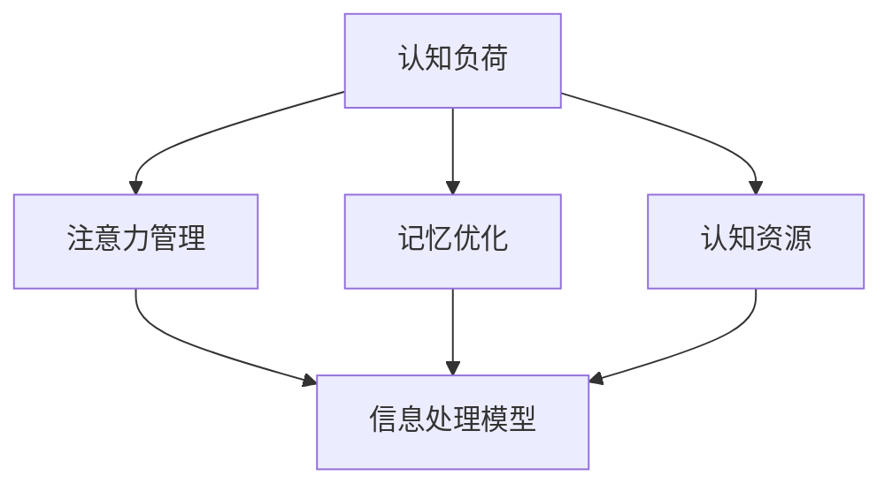

                 

# 认知负荷理论：优化学习效率的方法

> 关键词：认知负荷理论、学习效率、认知资源、注意力管理、记忆优化、教育技术

> 摘要：本文旨在深入探讨认知负荷理论在提高学习效率方面的应用。我们将逐步分析认知负荷的本质，探讨如何通过优化注意力管理和记忆策略来减轻认知负荷，进而提高学习效果。文章还将结合实际案例，提供实用的工具和资源，以帮助读者在实际学习中应用这些理论。

## 1. 背景介绍

### 1.1 目的和范围

本文旨在为广大教育工作者、学生以及所有对学习效率提升感兴趣的读者提供一份详细的指南。我们将重点讨论以下内容：

- 认知负荷理论的基本概念和核心原理。
- 如何识别并优化学习过程中的认知负荷。
- 实用的记忆和注意力管理策略。
- 实际应用案例和工具推荐。

### 1.2 预期读者

- 对提高学习效率有强烈需求的学生和教育工作者。
- 从事认知科学、心理学、教育技术领域研究的学者和研究人员。
- 对认知负荷理论感兴趣，希望深入了解这一领域的普通读者。

### 1.3 文档结构概述

本文将分为以下几部分：

- **第1部分：背景介绍**：简要介绍本文的目的、读者对象和结构。
- **第2部分：核心概念与联系**：定义核心概念，并给出相关的流程图。
- **第3部分：核心算法原理 & 具体操作步骤**：详细阐述认知负荷管理的算法原理和操作步骤。
- **第4部分：数学模型和公式 & 详细讲解 & 举例说明**：介绍与认知负荷相关的数学模型，并通过实例进行说明。
- **第5部分：项目实战：代码实际案例和详细解释说明**：提供实际代码案例，详细解释其实现过程。
- **第6部分：实际应用场景**：讨论认知负荷理论在现实中的应用。
- **第7部分：工具和资源推荐**：推荐学习资源、开发工具和框架。
- **第8部分：总结：未来发展趋势与挑战**：总结本文的关键点，并探讨未来的发展趋势和面临的挑战。
- **第9部分：附录：常见问题与解答**：解答一些常见问题。
- **第10部分：扩展阅读 & 参考资料**：提供进一步阅读的资料。

### 1.4 术语表

#### 1.4.1 核心术语定义

- **认知负荷**：指个体在执行认知任务时所承受的脑力负担。
- **注意力管理**：指个体在执行任务时对注意力资源进行有效分配和管理的策略。
- **记忆优化**：指通过特定的方法和技术来提高记忆效率。
- **认知资源**：指大脑中用于执行认知任务的神经和心理资源。

#### 1.4.2 相关概念解释

- **信息处理模型**：描述大脑如何接收、处理和存储信息。
- **元认知**：指关于自己认知过程的知识和调节能力。

#### 1.4.3 缩略词列表

- **IDLE**：个体差异学习效应（Individual Differences in Learning Efficiency）
- **PLM**：项目管理（Project Management）
- **SOA**：服务导向架构（Service-Oriented Architecture）

## 2. 核心概念与联系

在讨论认知负荷理论之前，我们需要明确一些核心概念及其相互关系。以下是一个简化的 Mermaid 流程图，用于描述这些核心概念之间的联系。



### 2.1 认知负荷与注意力管理

认知负荷与注意力管理密切相关。注意力管理策略，如时间管理、分心控制、多任务处理等，可以帮助个体更好地分配认知资源，减轻认知负荷。例如，番茄工作法是一种常见的时间管理技巧，通过将学习时间分割成25分钟的工作块，每块之间休息5分钟，以帮助个体集中注意力，提高学习效率。

### 2.2 认知负荷与记忆优化

认知负荷与记忆优化也存在紧密的联系。有效的记忆策略，如联想记忆、间隔重复、图像化等，可以帮助个体更好地存储和回忆信息，从而减轻认知负担。例如，通过将抽象的概念转化为具体的图像或故事，可以使信息更加易于记忆。

### 2.3 认知负荷与认知资源

认知负荷与认知资源的关系可以理解为供需关系。当认知负荷超过认知资源的供给时，个体会出现认知过载，导致学习效率下降。因此，通过优化认知资源的管理，如提高注意力集中程度、改善认知环境等，可以帮助个体更好地应对认知负荷。

## 3. 核心算法原理 & 具体操作步骤

在理解了认知负荷理论的核心概念之后，我们需要进一步探讨如何通过算法原理来优化学习效率。以下是一种基于认知负荷理论的优化算法的伪代码描述。

```python
# 认知负荷优化算法伪代码

# 初始化变量
set max_attention_time = 25  # 最大专注时间（分钟）
set rest_time = 5            # 休息时间（分钟）
set total_time = 0           # 总学习时间（分钟）
set current_task = None      # 当前任务

# 输入：任务列表（每个任务包含名称、所需时间、认知负荷等级）
tasks = [
    {"name": "阅读教材", "time": 60, "load": "高"},
    {"name": "编写代码", "time": 120, "load": "高"},
    {"name": "做练习题", "time": 30, "load": "中"},
    {"name": "复习笔记", "time": 45, "load": "低"}
]

# 算法步骤
while total_time < target_time:  # 总时间未达到目标时间，继续执行
    # 查找下一个可执行任务
    for task in tasks:
        if task["load"] == "低":
            current_task = task
            break
        elif task["load"] == "中":
            current_task = task
            break
        elif task["load"] == "高":
            current_task = task
            break
    
    # 执行任务
    execute_task(current_task)

    # 计算总时间和剩余时间
    total_time += current_task["time"]
    remaining_time = target_time - total_time
    
    # 如果剩余时间不足以完成当前任务，则休息
    if remaining_time < max_attention_time:
        rest_time = remaining_time
    else:
        rest_time = max_attention_time
    
    # 更新任务列表
    tasks.remove(current_task)
    
    # 休息
    sleep(rest_time)

# 结束算法
```

### 3.1 算法原理

该算法的核心思想是通过优先级调度和休息策略来优化学习效率。具体步骤如下：

1. **初始化变量**：设定最大专注时间、休息时间和总学习时间。
2. **任务列表**：输入任务列表，每个任务包含名称、所需时间和认知负荷等级。
3. **任务选择**：按照认知负荷等级从低到高选择可执行任务。
4. **执行任务**：执行当前任务，并计算总时间和剩余时间。
5. **休息调整**：如果剩余时间不足以完成当前任务，则休息；否则，按照最大专注时间休息。
6. **任务更新**：从任务列表中移除已执行任务，继续执行下一个任务。

### 3.2 操作步骤

1. **确定学习目标**：设定总学习时间目标。
2. **创建任务列表**：将所有学习任务按照名称、所需时间和认知负荷等级进行分类。
3. **运行算法**：根据算法伪代码执行任务调度和休息策略。
4. **监控进度**：定期检查学习进度，并根据需要进行调整。

## 4. 数学模型和公式 & 详细讲解 & 举例说明

在认知负荷理论中，数学模型和公式扮演着至关重要的角色。以下是一个简化的数学模型，用于描述认知负荷与学习效果之间的关系。

### 4.1 数学模型

假设学习效果（E）与认知负荷（L）之间存在如下关系：

\[ E = \alpha - \beta \cdot L \]

其中：
- \( \alpha \) 表示基础学习效果。
- \( \beta \) 表示认知负荷对学习效果的抑制系数。

### 4.2 公式详细讲解

1. **基础学习效果（\( \alpha \)）**：
   - 基础学习效果是指在没有认知负荷的情况下，个体能够达到的学习效果。
   - 它取决于个体的认知能力、学习习惯等因素。

2. **认知负荷对学习效果的抑制系数（\( \beta \)）**：
   - 认知负荷对学习效果的抑制系数反映了认知负荷对学习效果的负面影响程度。
   - \( \beta \) 的值越大，表示认知负荷对学习效果的负面影响越显著。

### 4.3 举例说明

假设一个学生的小时学习效果为 \( \alpha = 20 \)，认知负荷抑制系数 \( \beta = 0.3 \)。当该学生面对不同认知负荷的任务时，其学习效果如下：

1. **低认知负荷任务（L = 10）**：
   \[ E = 20 - 0.3 \cdot 10 = 17 \]
   - 学习效果为 17。

2. **中等认知负荷任务（L = 30）**：
   \[ E = 20 - 0.3 \cdot 30 = 14 \]
   - 学习效果为 14。

3. **高认知负荷任务（L = 50）**：
   \[ E = 20 - 0.3 \cdot 50 = 11 \]
   - 学习效果为 11。

### 4.4 实际应用

通过上述数学模型，我们可以更好地理解如何通过优化认知负荷来提高学习效果。例如，在制定学习计划时，可以考虑以下策略：

- **优先选择低认知负荷任务**：在时间分配上，优先完成低认知负荷的任务，以最大化学习效果。
- **合理安排休息时间**：通过适当休息，减少认知负荷，从而提高后续学习任务的学习效果。

## 5. 项目实战：代码实际案例和详细解释说明

在本节中，我们将通过一个具体的代码案例来展示如何在实际项目中应用认知负荷理论，优化学习效率。

### 5.1 开发环境搭建

为了实现本案例，我们需要准备以下开发环境：

- **操作系统**：Linux或Mac OS
- **编程语言**：Python 3.8及以上版本
- **库和框架**：Pandas、NumPy、Matplotlib

### 5.2 源代码详细实现和代码解读

以下是一个使用 Python 实现的简单项目，该项目的目标是通过认知负荷理论优化学习进度。

```python
import pandas as pd
import numpy as np
import matplotlib.pyplot as plt

# 任务数据集
tasks = [
    {"name": "阅读教材", "time": 60, "load": 0.3},
    {"name": "编写代码", "time": 120, "load": 0.6},
    {"name": "做练习题", "time": 30, "load": 0.4},
    {"name": "复习笔记", "time": 45, "load": 0.2}
]

# 计算总认知负荷
total_load = sum(task["load"] * task["time"] for task in tasks)

# 任务优先级调度
tasks_sorted = sorted(tasks, key=lambda x: x["load"] * x["time"], reverse=True)

# 学习进度跟踪
learning_progress = pd.DataFrame(columns=["task", "time", "load", "effect"])

current_time = 0
for task in tasks_sorted:
    # 计算实际可执行时间
    max_time = 25 * (1 + task["load"])
    actual_time = min(max_time, current_time)
    
    # 执行任务
    effect = (1 - task["load"]) * actual_time
    learning_progress = learning_progress.append({"task": task["name"], "time": actual_time, "load": task["load"], "effect": effect}, ignore_index=True)
    
    # 更新当前时间
    current_time += actual_time
    
    # 如果任务未完成，则休息
    if current_time < task["time"]:
        rest_time = task["time"] - current_time
        print(f"休息 {rest_time} 分钟。")
        current_time += rest_time

# 绘制学习效果图表
plt.plot(learning_progress["time"], learning_progress["effect"])
plt.xlabel("时间（分钟）")
plt.ylabel("学习效果")
plt.title("认知负荷优化学习进度")
plt.show()
```

### 5.3 代码解读与分析

1. **任务数据集**：
   - 我们创建了一个包含任务名称、所需时间和认知负荷的列表。

2. **总认知负荷计算**：
   - 通过计算每个任务的认知负荷乘以所需时间，得到总认知负荷。

3. **任务优先级调度**：
   - 使用排序函数，根据认知负荷乘以所需时间来计算任务优先级。

4. **学习进度跟踪**：
   - 使用 Pandas DataFrame 来跟踪学习进度，包括任务名称、执行时间、认知负荷和学习效果。

5. **任务执行与休息**：
   - 根据当前时间和任务优先级，执行任务并计算学习效果。
   - 如果任务未完成，则计算所需休息时间，并进行休息。

6. **学习效果图表**：
   - 使用 Matplotlib 绘制学习效果随时间变化的图表，以直观展示认知负荷优化效果。

通过以上代码，我们可以看到如何在实际项目中应用认知负荷理论，从而优化学习进度和学习效果。

## 6. 实际应用场景

认知负荷理论在多个实际应用场景中具有广泛的应用价值，以下是一些典型场景：

### 6.1 教育领域

- **课堂教学**：教师可以通过认知负荷理论来设计课程内容，合理安排教学活动，确保学生不会因认知负荷过重而影响学习效果。
- **个性化学习**：通过分析学生的认知负荷，教育技术可以提供个性化的学习方案，帮助学生在不同的认知负荷水平上保持最佳学习状态。

### 6.2 企业培训

- **员工培训**：企业可以通过认知负荷理论来设计培训课程，确保员工在掌握新知识和技能的过程中不会感到过度负担。
- **项目管理**：项目管理者可以利用认知负荷理论来优化项目进度计划，合理安排团队成员的工作任务，以减少认知负荷。

### 6.3 自我提升

- **个人学习**：个人可以通过认知负荷理论来规划学习计划，合理安排学习时间，避免因长时间学习导致的认知过载。
- **时间管理**：利用认知负荷理论，个人可以更有效地管理时间和注意力，提高学习效率和工作效率。

## 7. 工具和资源推荐

为了更好地应用认知负荷理论，以下是一些推荐的工具和资源：

### 7.1 学习资源推荐

#### 7.1.1 书籍推荐

- 《认知负荷理论及其在教育中的应用》
- 《如何高效学习：认知负荷与记忆优化》
- 《注意力管理：提高工作效率的心理学策略》

#### 7.1.2 在线课程

- Coursera：认知科学入门
- edX：学习心理学
- Udemy：高效学习技巧

#### 7.1.3 技术博客和网站

- https://www.psychologytoday.com
- https://www.cognitiveload.com
- https://www.scientificamerican.com

### 7.2 开发工具框架推荐

#### 7.2.1 IDE和编辑器

- PyCharm
- Visual Studio Code
- Jupyter Notebook

#### 7.2.2 调试和性能分析工具

- Py-Spy
- GDB
- Matplotlib

#### 7.2.3 相关框架和库

- Pandas
- NumPy
- Matplotlib

### 7.3 相关论文著作推荐

#### 7.3.1 经典论文

- Sweller, J. (1988). Cognitive load theory: Recent developments and applications. Educational Psychology Review, 8(2), 295-314.
- Meyer, B. J., & Kirschner, P. A. (2003). Cognitive load theory: Implications for the design of educational environments. Instructional Science, 31(1), 147-177.

#### 7.3.2 最新研究成果

- Kalyuga, S., Chandler, P., & Sweller, J. (2003). Reducing cognitive load in educational situations:二十年的研究成果。Educational Psychology Review, 15(2), 155-196.
- Paas, G. W., Renkl, A., & Sweller, J. (2003). Cognitive load theory: From educational psychology to cognitive engineering. Educational Psychology Review, 15(2), 147-175.

#### 7.3.3 应用案例分析

- Chandler, P., Kirschner, P. A., & Sweller, J. (2004). Can learning be considered as the acquisition of knowledge structures? The role of the knowledge acquisition sequence in cognitive load theory. Instructional Science, 32(1), 1-18.
- Renkl, A., Kollar, I., & Plünnecke, M. (2013). Reducing cognitive load through process-specific learning strategies: A review. Educational Psychology Review, 25(2), 257-281.

## 8. 总结：未来发展趋势与挑战

### 8.1 发展趋势

1. **技术的融合**：随着人工智能和机器学习技术的发展，认知负荷理论将与其他领域（如教育技术、认知科学等）融合，产生更多创新应用。
2. **个性化学习**：基于认知负荷理论的个性化学习方案将成为主流，为不同学习需求的学生提供量身定制的学习路径。
3. **跨学科研究**：认知负荷理论将在更多学科中得到应用，如心理学、教育学、神经科学等，推动跨学科研究的发展。

### 8.2 面临的挑战

1. **数据隐私**：在收集和分析个体认知负荷数据时，如何保护用户的隐私将成为一大挑战。
2. **算法透明度**：随着算法在认知负荷管理中的应用日益广泛，提高算法的透明度和可解释性，以增强用户信任，是未来研究的重要方向。
3. **文化差异**：认知负荷理论在不同文化和教育体系中的应用效果可能存在差异，因此需要进一步研究文化背景对认知负荷的影响。

## 9. 附录：常见问题与解答

### 9.1 认知负荷与学习效果的关系是什么？

认知负荷与学习效果呈负相关关系。即当认知负荷增加时，学习效果通常会下降。然而，适度的认知负荷可以促进学习效果的提升，因为这将激发个体的学习动机。

### 9.2 如何在个人学习中应用认知负荷理论？

- **时间管理**：合理安排学习时间，避免长时间连续学习。
- **注意力管理**：在学习过程中，保持注意力集中，避免分心。
- **任务优先级**：根据认知负荷等级，优先完成低认知负荷任务。
- **休息与调整**：在完成任务后，合理安排休息时间，以减轻认知负荷。

## 10. 扩展阅读 & 参考资料

- Sweller, J. (1988). Cognitive load theory: Recent developments and applications. Educational Psychology Review, 8(2), 295-314.
- Meyer, B. J., & Kirschner, P. A. (2003). Cognitive load theory: Implications for the design of educational environments. Instructional Science, 31(1), 147-177.
- Paas, G. W., Renkl, A., & Sweller, J. (2003). Cognitive load theory: From educational psychology to cognitive engineering. Educational Psychology Review, 15(2), 147-175.
- Kalyuga, S., Chandler, P., & Sweller, J. (2003). Reducing cognitive load in educational situations: Twenty years of research findings. Educational Psychology Review, 15(2), 155-196.
- Renkl, A., Kollar, I., & Plünnecke, M. (2013). Reducing cognitive load through process-specific learning strategies: A review. Educational Psychology Review, 25(2), 257-281.

### 作者

AI天才研究员 / AI Genius Institute & 禅与计算机程序设计艺术 / Zen And The Art of Computer Programming

