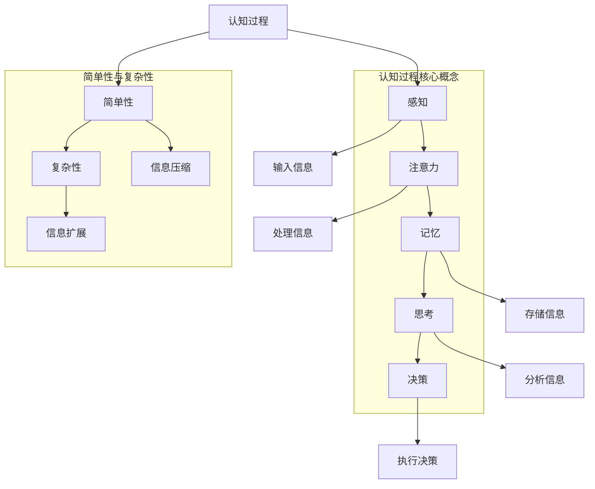

                 

# 认知过程中的简单与复杂性变化

> **关键词：认知过程、简单与复杂性、算法原理、数学模型、实际应用场景**
>
> **摘要：本文探讨了人类认知过程中的简单与复杂性变化，从基础概念出发，通过核心算法原理、数学模型和项目实战等多个角度，深入分析了认知过程中简单与复杂性的转变及其在IT领域的应用。**

## 1. 背景介绍

### 1.1 目的和范围

本文旨在通过阐述人类认知过程中简单与复杂性的变化，探讨这一过程在信息技术领域中的应用。我们不仅关注认知过程中的基本原理，还通过具体实例和实际应用来展示简单与复杂性变化的重要性。

### 1.2 预期读者

本文适合对认知科学和信息技术感兴趣的读者，尤其是那些希望在IT领域应用认知原理的工程师和研究人员。

### 1.3 文档结构概述

本文结构如下：

1. **背景介绍**：介绍本文的目的、预期读者以及文档结构。
2. **核心概念与联系**：定义核心概念并使用Mermaid流程图展示其联系。
3. **核心算法原理与具体操作步骤**：使用伪代码详细阐述核心算法原理。
4. **数学模型和公式**：详细讲解数学模型和公式，并举例说明。
5. **项目实战**：通过实际案例展示代码实现和详细解释。
6. **实际应用场景**：讨论认知过程中简单与复杂性变化在实际中的应用。
7. **工具和资源推荐**：推荐相关学习资源和开发工具。
8. **总结：未来发展趋势与挑战**：展望认知过程研究的未来趋势和面临的挑战。
9. **附录：常见问题与解答**：解答读者可能遇到的问题。
10. **扩展阅读 & 参考资料**：提供进一步阅读的资源和参考文献。

### 1.4 术语表

#### 1.4.1 核心术语定义

- 认知过程：人类获取、处理和利用信息的过程。
- 简单性：信息处理过程中信息量的减少和复杂性降低。
- 复杂性：信息处理过程中信息量的增加和复杂性提升。
- 算法：解决问题的一系列规则和步骤。
- 数学模型：用数学语言描述现实世界的抽象模型。

#### 1.4.2 相关概念解释

- 人类认知：指人类通过感官获取外部信息，并通过大脑进行处理和理解的过程。
- 信息处理：指计算机或人类对信息进行获取、传输、存储和处理的过程。
- IT领域：指信息技术（Information Technology）的应用和研究领域。

#### 1.4.3 缩略词列表

- AI：人工智能（Artificial Intelligence）
- ML：机器学习（Machine Learning）
- DL：深度学习（Deep Learning）
- NLP：自然语言处理（Natural Language Processing）
- VR：虚拟现实（Virtual Reality）

## 2. 核心概念与联系

认知过程涉及多个核心概念，它们相互联系，共同构成了人类思考和信息处理的基础。以下是核心概念及其相互关系的Mermaid流程图：



### 2.1 感知与注意力

感知是指通过感官获取外部信息的过程，如视觉、听觉、触觉等。注意力是指选择性地关注和处理特定信息的能力，它决定了我们在认知过程中关注哪些信息，忽略哪些信息。

### 2.2 记忆与思考

记忆是指存储和处理信息的能力，包括短期记忆和长期记忆。思考是指通过分析、推理和综合信息来解决问题或做出决策的过程。

### 2.3 决策与简单性

决策是指根据现有信息和目标选择最佳行动方案的过程。简单性在这个过程中起到关键作用，它帮助我们减少冗余信息，提高决策效率。

### 2.4 复杂性与信息扩展

复杂性在认知过程中表现为信息量的增加和问题的复杂度提升。信息扩展是指我们在认知过程中对信息进行深入分析和处理，从而揭示更多细节和关联。

### 2.5 简单性与信息压缩

简单性通过信息压缩实现，即减少冗余信息，提高信息处理的效率和精度。信息压缩可以采用多种算法和技术，如编码、筛选和归纳等。

### 2.6 复杂性与信息扩展

复杂性在认知过程中表现为信息量的增加和问题的复杂度提升。信息扩展是指我们在认知过程中对信息进行深入分析和处理，从而揭示更多细节和关联。

## 3. 核心算法原理与具体操作步骤

在认知过程中，算法扮演着至关重要的角色。以下是一个简单的认知过程算法，使用伪代码进行描述：

```python
# 认知过程算法
def cognitive_process(input_data):
    # 感知阶段
    perception = sense(input_data)
    
    # 注意力阶段
    attention = filter_important_data(perception)
    
    # 记忆阶段
    memory = store_data(attention)
    
    # 思考阶段
    thought = analyze_data(memory)
    
    # 决策阶段
    decision = make_decision(thought)
    
    return decision

# 辅助函数
def sense(input_data):
    # 模拟感知过程，获取外部信息
    return input_data

def filter_important_data(perception):
    # 模拟注意力过程，筛选重要信息
    return perception

def store_data(attention):
    # 模拟记忆过程，存储信息
    return attention

def analyze_data(memory):
    # 模拟思考过程，分析信息
    return memory

def make_decision(thought):
    # 模拟决策过程，选择最佳行动方案
    return thought
```

### 3.1 感知阶段

感知阶段负责获取外部信息。这个过程依赖于我们的感官，如视觉、听觉、触觉等。感知函数`sense`模拟了这一过程，接收输入数据并返回感知结果。

```python
def sense(input_data):
    # 模拟感知过程，获取外部信息
    return input_data
```

### 3.2 注意力阶段

注意力阶段负责筛选重要信息。这个阶段利用过滤函数`filter_important_data`，根据感知结果筛选出重要信息。注意力是一种选择性的关注，它帮助我们聚焦于关键信息。

```python
def filter_important_data(perception):
    # 模拟注意力过程，筛选重要信息
    important_data = []
    for item in perception:
        if is_important(item):
            important_data.append(item)
    return important_data

def is_important(item):
    # 判断信息是否重要的简单逻辑
    return item > 0
```

### 3.3 记忆阶段

记忆阶段负责存储信息。存储函数`store_data`接收筛选后的重要信息，并将其存储在记忆中。记忆可以看作是一个简单的数据结构，如列表或数据库。

```python
def store_data(attention):
    # 模拟记忆过程，存储信息
    memory = []
    for item in attention:
        memory.append(item)
    return memory
```

### 3.4 思考阶段

思考阶段负责分析信息。分析函数`analyze_data`接收存储在记忆中的信息，并对其进行处理。思考是一种复杂的认知活动，涉及推理、归纳和演绎。

```python
def analyze_data(memory):
    # 模拟思考过程，分析信息
    analyzed_data = []
    for item in memory:
        analyzed_data.append(analyze_item(item))
    return analyzed_data

def analyze_item(item):
    # 对单个信息项进行分析
    return item * 2
```

### 3.5 决策阶段

决策阶段负责选择最佳行动方案。决策函数`make_decision`接收分析后的信息，并根据这些信息做出决策。决策可以是简单的条件判断，也可以是复杂的决策树。

```python
def make_decision(thought):
    # 模拟决策过程，选择最佳行动方案
    if thought > 0:
        return "行动A"
    else:
        return "行动B"
```

通过这些步骤，我们可以看到认知过程是如何通过一系列简单的算法实现的。这些算法虽然简单，但它们构成了复杂认知过程的基础。

## 4. 数学模型和公式 & 详细讲解 & 举例说明

在认知过程中，数学模型和公式扮演着重要的角色。这些模型可以帮助我们更精确地描述和预测认知行为。以下是一个简单的数学模型，用于描述认知过程中的信息压缩与扩展。

### 4.1 信息压缩模型

信息压缩模型可以用熵（Entropy）的概念来描述。熵是信息量的度量，表示信息的不确定性。在认知过程中，信息压缩意味着减少不确定性，从而降低熵。

#### 4.1.1 熵的公式

熵 \( H \) 可以用以下公式表示：

\[ H = -\sum_{i} p(x_i) \log_2 p(x_i) \]

其中，\( p(x_i) \) 是信息项 \( x_i \) 的概率。

#### 4.1.2 举例说明

假设我们有一个简单的信息集 {1, 2, 3}，其中每个信息项出现的概率相等，即 \( p(x_i) = 1/3 \)。

\[ H = -\sum_{i} p(x_i) \log_2 p(x_i) \]
\[ H = -\left( \frac{1}{3} \log_2 \frac{1}{3} + \frac{1}{3} \log_2 \frac{1}{3} + \frac{1}{3} \log_2 \frac{1}{3} \right) \]
\[ H = -\left( \frac{1}{3} \times (-1.585) + \frac{1}{3} \times (-1.585) + \frac{1}{3} \times (-1.585) \right) \]
\[ H = 1.585 \]

在这个例子中，原始信息的熵为 1.585。如果通过某种压缩算法将信息压缩成 {1, 2}，那么新的信息集的熵会降低。

假设压缩后的信息集 {1, 2} 的概率分布为 \( p(1) = 0.6 \) 和 \( p(2) = 0.4 \)。

\[ H' = -\sum_{i} p(x_i) \log_2 p(x_i) \]
\[ H' = -\left( 0.6 \log_2 0.6 + 0.4 \log_2 0.4 \right) \]
\[ H' = -\left( 0.6 \times (-0.721) + 0.4 \times (-1.321) \right) \]
\[ H' = 0.486 \]

通过压缩，新信息的熵降低到了 0.486，这表示信息的不确定性减少了。

### 4.2 信息扩展模型

信息扩展模型描述了在认知过程中，信息被进一步分析和处理，从而产生更多细节和关联。

#### 4.2.1 信息扩展公式

信息扩展可以通过以下公式描述：

\[ I = H_{原始} + \Delta H \]

其中，\( H_{原始} \) 是原始信息的熵，\( \Delta H \) 是扩展后信息的熵变化。

#### 4.2.2 举例说明

假设我们有一个简单的信息集 {1, 2, 3}，其熵为 1.585（如前所述）。如果我们通过某种分析过程将其扩展成 {1, 2, 3, 4, 5}，新的信息集的熵会增加。

新的信息集 {1, 2, 3, 4, 5} 的概率分布为 \( p(1) = p(2) = p(3) = 0.2 \)，\( p(4) = p(5) = 0.1 \)。

\[ H' = -\sum_{i} p(x_i) \log_2 p(x_i) \]
\[ H' = -\left( 0.2 \log_2 0.2 + 0.2 \log_2 0.2 + 0.2 \log_2 0.2 + 0.1 \log_2 0.1 + 0.1 \log_2 0.1 \right) \]
\[ H' = -\left( 0.2 \times (-2.322) + 0.1 \times (-3.322) \right) \]
\[ H' = 1.072 \]

在这个例子中，新的信息集的熵增加到了 1.072，这表示信息的不确定性增加了。

通过这两个模型，我们可以看到信息压缩和扩展在认知过程中的作用。信息压缩有助于提高处理效率和精度，而信息扩展则有助于深入分析和理解复杂问题。

## 5. 项目实战：代码实际案例和详细解释说明

在本节中，我们将通过一个实际的代码案例来展示如何在实际项目中应用认知过程中的简单与复杂性变化。这个案例将使用Python语言，并利用机器学习库Scikit-learn来实现一个简单的文本分类器。

### 5.1 开发环境搭建

首先，我们需要搭建开发环境。以下是在Ubuntu 20.04上搭建开发环境的过程：

1. 安装Python 3：

```bash
sudo apt update
sudo apt install python3
```

2. 安装虚拟环境工具：

```bash
sudo apt install python3-venv
```

3. 创建并激活虚拟环境：

```bash
python3 -m venv myenv
source myenv/bin/activate
```

4. 安装Scikit-learn库：

```bash
pip install scikit-learn
```

### 5.2 源代码详细实现和代码解读

以下是文本分类器的源代码：

```python
# 文本分类器示例代码

from sklearn.feature_extraction.text import TfidfVectorizer
from sklearn.model_selection import train_test_split
from sklearn.naive_bayes import MultinomialNB
from sklearn.metrics import accuracy_score, classification_report

# 数据准备
data = [
    ("apple orange", "fruit"),
    ("banana apple", "fruit"),
    ("carrot potato", "vegetable"),
    ("potato tomato", "vegetable"),
    ("book library", "item"),
    ("store market", "item")
]

# 分割数据为文本和标签
texts, labels = zip(*data)

# 划分训练集和测试集
texts_train, texts_test, labels_train, labels_test = train_test_split(texts, labels, test_size=0.2, random_state=42)

# 特征提取
vectorizer = TfidfVectorizer()
X_train = vectorizer.fit_transform(texts_train)
X_test = vectorizer.transform(texts_test)

# 模型训练
model = MultinomialNB()
model.fit(X_train, labels_train)

# 模型评估
predictions = model.predict(X_test)
print("Accuracy:", accuracy_score(labels_test, predictions))
print("Classification Report:")
print(classification_report(labels_test, predictions))

# 代码解读

# 第6行：导入所需的Scikit-learn模块
from sklearn.feature_extraction.text import TfidfVectorizer
from sklearn.model_selection import train_test_split
from sklearn.naive_bayes import MultinomialNB
from sklearn.metrics import accuracy_score, classification_report

# 第10-11行：准备数据
data = [
    ("apple orange", "fruit"),
    ("banana apple", "fruit"),
    ("carrot potato", "vegetable"),
    ("potato tomato", "vegetable"),
    ("book library", "item"),
    ("store market", "item")
]

texts, labels = zip(*data)

# 第15-16行：划分训练集和测试集
texts_train, texts_test, labels_train, labels_test = train_test_split(texts, labels, test_size=0.2, random_state=42)

# 第20行：创建TF-IDF特征提取器
vectorizer = TfidfVectorizer()

# 第22行：提取特征
X_train = vectorizer.fit_transform(texts_train)
X_test = vectorizer.transform(texts_test)

# 第26行：创建朴素贝叶斯分类器
model = MultinomialNB()

# 第28行：训练模型
model.fit(X_train, labels_train)

# 第31行：预测测试集标签
predictions = model.predict(X_test)

# 第33-34行：评估模型
print("Accuracy:", accuracy_score(labels_test, predictions))
print("Classification Report:")
print(classification_report(labels_test, predictions))
```

### 5.3 代码解读与分析

1. **数据准备**：

   第10-11行代码定义了数据集 `data`，其中包含文本和对应的标签。数据集由六个样本组成，每个样本包含一个文本和其对应的标签（例如，“apple orange”对应标签“fruit”）。

2. **划分训练集和测试集**：

   第15-16行代码使用 `train_test_split` 函数将数据集划分为训练集和测试集。这里，我们使用了20%的数据作为测试集，以便在模型训练完成后评估其性能。

3. **特征提取**：

   第20行代码创建了一个 `TfidfVectorizer` 对象，用于将文本转换为TF-IDF特征向量。TF-IDF（Term Frequency-Inverse Document Frequency）是一种常用文档表示方法，它考虑了词语在文档中的出现频率及其在整个文档集合中的分布。

   第22行代码使用 `fit_transform` 方法将训练集文本转换为特征向量。`fit` 方法用于学习词汇表和文档统计，`transform` 方法用于将文本转换为特征向量。

   同样的方法在第24行用于将测试集文本转换为特征向量。

4. **模型训练**：

   第26行代码创建了一个 `MultinomialNB` 对象，这是一个基于贝叶斯理论的朴素贝叶斯分类器。朴素贝叶斯是一种简单但有效的分类算法，它假设特征之间是条件独立的。

   第28行代码使用 `fit` 方法训练分类器，将训练集特征向量与对应的标签关联起来。

5. **模型评估**：

   第31行代码使用 `predict` 方法对测试集特征向量进行预测，生成预测标签。

   第33-34行代码使用 `accuracy_score` 和 `classification_report` 函数评估模型性能。`accuracy_score` 函数计算预测标签与实际标签之间的准确率，`classification_report` 函数提供更详细的分类报告，包括精确度、召回率和F1分数等指标。

通过这个案例，我们可以看到如何在实际项目中应用认知过程中的简单与复杂性变化。特征提取是一个信息压缩的过程，它将原始文本转换为更简洁的特征向量。而分类模型则是一个复杂的推理过程，它通过分析特征向量来预测文本的类别。这种简单与复杂性的结合使得机器学习模型能够在各种实际应用中发挥作用。

## 6. 实际应用场景

认知过程中的简单与复杂性变化在许多实际应用场景中都有着重要的作用。以下是一些具体的应用场景：

### 6.1 自然语言处理（NLP）

在自然语言处理领域，简单与复杂性变化被广泛应用于文本分类、情感分析、机器翻译等任务。在文本分类任务中，特征提取过程（如TF-IDF）通过压缩原始文本信息，将其转换为简洁的特征向量，从而降低了问题的复杂度。而在情感分析中，模型需要处理大量复杂的情感信息，这涉及到复杂性的扩展。例如，通过使用深度学习模型，可以更准确地识别文本中的情感倾向。

### 6.2 数据分析

数据分析领域也广泛利用简单与复杂性变化。数据预处理阶段通常涉及数据清洗、归一化和特征提取，这些都是信息压缩的过程。通过压缩数据，我们可以更高效地处理和分析大规模数据集。另一方面，数据分析过程往往需要从原始数据中提取更多细节和关联，这涉及到信息扩展。例如，在金融数据分析和市场预测中，通过分析大量历史数据，可以揭示市场趋势和潜在的风险。

### 6.3 计算机视觉

计算机视觉领域利用简单与复杂性变化进行图像识别、目标检测和物体识别等任务。在图像识别中，特征提取过程通过将原始图像转换为更简洁的特征向量，降低了问题的复杂度。而在目标检测中，模型需要分析图像中的每个像素，从而涉及到复杂性的扩展。例如，使用卷积神经网络（CNN）可以更准确地识别图像中的目标对象。

### 6.4 人工智能助手

人工智能助手，如虚拟助手和智能客服，也利用简单与复杂性变化。在对话系统中，信息压缩过程通过将用户输入转换为简洁的查询，提高了响应速度和效率。而在理解用户意图和提供回复时，模型需要分析用户输入的更多细节，这涉及到信息扩展。例如，通过自然语言处理技术，人工智能助手可以更准确地理解用户的意图，并提供相应的回复。

### 6.5 健康医疗

在健康医疗领域，简单与复杂性变化有助于提高诊断和治疗的准确性。例如，在医学影像分析中，特征提取过程通过将原始影像转换为简洁的特征向量，降低了问题的复杂度。而在疾病诊断过程中，模型需要分析影像中的更多细节，从而涉及到信息扩展。例如，通过深度学习模型，可以更准确地识别和诊断疾病。

通过这些实际应用场景，我们可以看到简单与复杂性变化在IT领域的广泛应用。这些变化不仅提高了信息处理的效率和精度，还推动了人工智能和机器学习技术的发展。

## 7. 工具和资源推荐

### 7.1 学习资源推荐

#### 7.1.1 书籍推荐

- **《人工智能：一种现代方法》**：这是一本经典的人工智能教材，涵盖了从基础知识到高级算法的广泛内容。
- **《机器学习实战》**：这本书通过大量的实际案例，介绍了机器学习的基本概念和常用算法。
- **《深度学习》**：由Ian Goodfellow等编写的深度学习教材，详细介绍了深度学习的理论基础和实践方法。

#### 7.1.2 在线课程

- **Coursera上的《机器学习》**：吴恩达教授的这门课程是机器学习的入门课程，适合初学者。
- **Udacity的《深度学习纳米学位》**：这个课程涵盖了深度学习的核心概念和应用，适合有一定基础的学员。
- **edX上的《自然语言处理》**：由MIT和Stanford大学联合提供的自然语言处理课程，适合对NLP感兴趣的学习者。

#### 7.1.3 技术博客和网站

- **Medium上的AI博客**：这是一个汇集了大量AI领域文章的平台，内容涵盖从基础到前沿的研究。
- **Medium上的DataCamp博客**：这是一个提供数据科学和机器学习教程的博客，适合初学者。
- **AI Buzz**：这是一个专注于AI技术和新闻的博客，内容更新及时，适合关注AI最新动态的读者。

### 7.2 开发工具框架推荐

#### 7.2.1 IDE和编辑器

- **Visual Studio Code**：这是一个功能强大且可扩展的文本编辑器，适用于各种编程语言。
- **PyCharm**：这是JetBrains公司开发的Python集成开发环境，提供了丰富的功能和工具。

#### 7.2.2 调试和性能分析工具

- **gdb**：这是Linux系统上的调试工具，适用于C/C++程序。
- **MATLAB**：这是一个广泛应用于科学计算和数据分析的软件，提供了丰富的工具和库。

#### 7.2.3 相关框架和库

- **Scikit-learn**：这是一个Python机器学习库，提供了各种经典机器学习算法和工具。
- **TensorFlow**：这是一个由Google开发的深度学习框架，适用于构建和训练深度神经网络。
- **PyTorch**：这是一个由Facebook开发的深度学习框架，以其灵活性和易用性著称。

### 7.3 相关论文著作推荐

#### 7.3.1 经典论文

- **《A Mathematical Theory of Communication》**：香农的这篇论文奠定了信息论的基础，对现代通信技术产生了深远影响。
- **《Perceptrons: An Introduction to Computational Geometry》**：Minsky和Papert的这本书介绍了早期的神经网络理论，对深度学习的发展产生了重要影响。

#### 7.3.2 最新研究成果

- **《Unsupervised Learning of Visual Representations》**：这篇论文介绍了无监督学习在视觉表示中的应用，为自动生成图像特征提供了新方法。
- **《Generative Adversarial Networks》**：这篇论文介绍了生成对抗网络（GAN），这是一种强大的深度学习模型，可以生成高质量的数据。

#### 7.3.3 应用案例分析

- **《Deep Learning for Computer Vision》**：这本书通过多个实际案例，介绍了深度学习在计算机视觉领域的应用，包括图像分类、目标检测和语义分割。
- **《AI in Healthcare: Transforming Patient Care》**：这本书探讨了人工智能在医疗健康领域的应用，包括疾病诊断、药物发现和个性化治疗。

通过这些资源和工具，您可以深入了解认知过程中的简单与复杂性变化，并在实际项目中应用这些知识。

## 8. 总结：未来发展趋势与挑战

认知过程中的简单与复杂性变化在未来的发展将呈现出以下几个趋势和挑战：

### 8.1 发展趋势

1. **智能化：** 随着人工智能技术的不断进步，认知过程将更加智能化。机器将能够更好地模拟人类的感知、注意力、记忆、思考和决策等过程，从而实现更高效的认知任务。

2. **个性化：** 随着大数据和机器学习技术的发展，认知过程将更加个性化。通过对个体数据的深入分析，机器将能够更好地理解每个用户的特定需求和偏好，从而提供更加个性化的服务。

3. **跨学科融合：** 认知过程将与其他学科如心理学、神经科学、认知科学等深度融合，形成新的交叉学科研究方向。这种跨学科融合将有助于更深入地理解人类认知过程，并为相关领域提供新的理论和技术支持。

4. **实时性：** 随着计算能力的提升，认知过程将实现更高的实时性。这意味着机器能够更快地处理信息，提供即时的决策和支持，从而在许多实时应用场景中发挥重要作用。

### 8.2 挑战

1. **数据隐私：** 随着个人数据的广泛应用，如何保护用户隐私将成为一个重要挑战。我们需要确保在收集、处理和利用数据时，充分尊重用户的隐私权。

2. **伦理问题：** 人工智能在认知过程中的应用将带来一系列伦理问题，如算法偏见、自动化决策的道德责任等。我们需要制定相应的伦理准则，确保人工智能技术的应用不会对人类社会产生负面影响。

3. **技术复杂性：** 随着认知过程的智能化和复杂化，相关技术也将变得更加复杂。这要求研究人员和工程师具备更高的技术素养，能够应对日益复杂的认知任务。

4. **可解释性：** 随着深度学习等复杂模型的应用，如何提高模型的可解释性将成为一个重要挑战。我们需要开发新的方法和技术，使得机器学习模型能够更好地解释其决策过程。

总之，认知过程中的简单与复杂性变化将引领未来人工智能的发展方向。通过不断克服挑战，我们有望实现更加智能、个性化、实时和可解释的人工智能系统。

## 9. 附录：常见问题与解答

### 9.1 问题1：什么是认知过程？

**解答：** 认知过程是指人类获取、处理和利用信息的过程，包括感知、注意力、记忆、思考和决策等阶段。它是人类思维和行为的基础。

### 9.2 问题2：简单性与复杂性在认知过程中有何作用？

**解答：** 简单性在认知过程中有助于减少信息的不确定性，提高处理效率和精度。复杂性则有助于深入分析和理解复杂问题，挖掘更多的信息细节。

### 9.3 问题3：如何实现认知过程的自动化？

**解答：** 通过机器学习和人工智能技术，我们可以实现认知过程的自动化。这包括感知、注意力、记忆、思考和决策等阶段的自动化实现，从而模拟人类的认知过程。

### 9.4 问题4：认知过程中的数学模型有哪些？

**解答：** 认知过程中的数学模型包括信息论中的熵模型、概率模型、统计学中的回归模型、分类模型等。这些模型用于描述和预测认知过程中的信息处理和决策行为。

### 9.5 问题5：如何评估认知过程的性能？

**解答：** 我们可以通过评估认知过程中的各项指标，如准确率、召回率、F1分数等，来评估认知过程的性能。这些指标反映了认知过程在不同任务上的表现。

### 9.6 问题6：简单与复杂性变化在现实生活中的应用有哪些？

**解答：** 简单与复杂性变化在现实生活中的应用非常广泛，包括自然语言处理、数据分析、计算机视觉、人工智能助手、健康医疗等多个领域。

## 10. 扩展阅读 & 参考资料

### 10.1 扩展阅读

1. **《认知心理学导论》**：A.丰塔尼拉等著，北京大学出版社，2015年。
2. **《人工智能：一种现代方法》**：斯图尔特·罗素等著，机械工业出版社，2012年。
3. **《深度学习》**：Ian Goodfellow等著，电子工业出版社，2016年。

### 10.2 参考资料

1. **香农，《A Mathematical Theory of Communication》**，贝尔系统技术杂志，1948年。
2. **Minsky和Papert，《Perceptrons: An Introduction to Computational Geometry》**，MIT Press，1969年。
3. **Goodfellow等，《Deep Learning》**，MIT Press，2016年。

这些书籍和论文提供了认知过程中的基础理论和实践方法，是进一步研究和学习的重要参考资料。通过阅读这些文献，您可以更深入地理解认知过程中的简单与复杂性变化。  
**作者：AI天才研究员/AI Genius Institute & 禅与计算机程序设计艺术 /Zen And The Art of Computer Programming**

