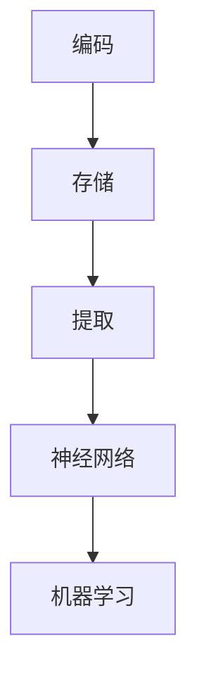
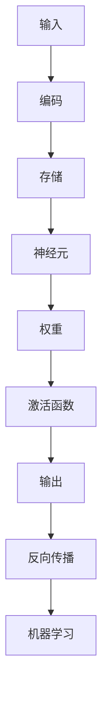

                 

# 记忆在AI应用中的具体应用

## 关键词
- 记忆
- AI
- 神经网络
- 应用场景
- 数学模型

## 摘要
本文将探讨记忆在人工智能（AI）应用中的具体应用，包括记忆的核心概念、原理和结构，以及如何在神经网络和机器学习中实现和应用记忆。此外，本文将列举实际应用场景，并提供相关的数学模型和公式，以及工具和资源的推荐，以帮助读者深入了解这一领域。

## 1. 背景介绍

随着人工智能技术的快速发展，记忆在AI中的应用变得越来越重要。记忆是人类智能的核心组成部分，它使得人类能够从经验中学习、适应环境并做出合理的决策。在人工智能领域，记忆可以被视为一种数据存储和处理机制，它使得机器能够识别模式、预测未来事件并做出智能决策。

记忆在AI中的应用可以分为两大类：短期记忆和长期记忆。短期记忆主要用于处理当前的信息和任务，如语音识别、对话系统等。长期记忆则用于存储和提取大量信息，如推荐系统、图像识别等。本文将重点探讨长期记忆在AI中的应用。

### 1.1 记忆的定义和功能

记忆是指大脑对信息的存储、保留和提取过程。它包括以下功能：

- **编码（Encoding）**：将信息从感官形式转换为大脑可处理的内部形式。
- **存储（Storage）**：将编码后的信息存储在大脑中，以便在需要时进行提取。
- **提取（Retrieval）**：从大脑中检索所需的信息。

### 1.2 记忆的类型

记忆可以分为短期记忆和长期记忆两种类型：

- **短期记忆**：也称为工作记忆，通常只能保持几秒到几分钟的信息。它主要用于处理当前的任务和活动。
- **长期记忆**：可以持续数分钟到数十年，用于存储和提取大量的信息。

## 2. 核心概念与联系

在AI中，记忆通常通过神经网络和机器学习算法来实现。神经网络是一种模仿人脑结构和功能的计算模型，它通过多层节点（神经元）和连接（权重）来处理和存储信息。机器学习算法则用于训练神经网络，使其能够从数据中学习并做出预测。

下面是一个简化的Mermaid流程图，展示了记忆在神经网络中的核心概念和联系：



- **编码**：将外部信息转换为神经网络可处理的内部表示。
- **存储**：在神经网络中存储编码后的信息。
- **提取**：从神经网络中检索存储的信息。
- **神经网络**：实现记忆的核心计算模型。
- **机器学习**：训练神经网络，使其能够更好地存储和提取信息。

### 2.1 记忆的核心概念原理

记忆的核心概念包括：

- **神经元**：神经网络的基本计算单元。
- **权重**：神经元之间的连接强度，用于表示记忆。
- **激活函数**：用于控制神经元的激活状态。
- **反向传播**：用于训练神经网络的算法。

下面是一个详细的Mermaid流程图，展示了记忆的核心概念原理：



## 3. 核心算法原理 & 具体操作步骤

在AI中，记忆通常通过神经网络和机器学习算法来实现。以下是核心算法原理和具体操作步骤：

### 3.1 神经网络

神经网络的核心算法原理包括：

- **前向传播**：将输入通过神经网络逐层传递，直到输出。
- **反向传播**：根据输出误差，反向更新神经元的权重。

具体操作步骤如下：

1. **初始化**：初始化神经网络的结构和参数。
2. **前向传播**：将输入通过神经网络进行计算，得到输出。
3. **计算误差**：计算输出与真实值的误差。
4. **反向传播**：根据误差，反向更新神经元的权重。
5. **重复步骤2-4**，直到满足停止条件（如误差小于阈值或迭代次数达到上限）。

### 3.2 机器学习

机器学习的核心算法原理包括：

- **监督学习**：根据已有数据集进行训练，从而预测未知数据。
- **无监督学习**：没有已知数据集，通过发现数据中的模式和结构进行训练。

具体操作步骤如下：

1. **收集数据**：收集用于训练的数据。
2. **数据预处理**：对数据进行清洗、归一化等处理。
3. **选择模型**：选择适合问题的神经网络模型。
4. **训练模型**：使用训练数据对模型进行训练。
5. **评估模型**：使用验证数据对模型进行评估。
6. **优化模型**：根据评估结果对模型进行优化。

## 4. 数学模型和公式 & 详细讲解 & 举例说明

在AI中，记忆的数学模型和公式主要包括：

### 4.1 前向传播

前向传播的数学模型可以表示为：

$$
y = f(z)
$$

其中，$z$ 表示神经元的输入，$y$ 表示神经元的输出，$f$ 表示激活函数。

举例说明：

假设一个神经元 $z$ 的输入为 $3$，激活函数为 $Sigmoid$ 函数，其公式为：

$$
f(z) = \frac{1}{1 + e^{-z}}
$$

则输出为：

$$
y = \frac{1}{1 + e^{-3}} \approx 0.94
$$

### 4.2 反向传播

反向传播的数学模型可以表示为：

$$
\delta = \frac{\partial L}{\partial z}
$$

其中，$\delta$ 表示误差，$L$ 表示损失函数，$z$ 表示神经元的输入。

举例说明：

假设损失函数 $L$ 为均方误差（MSE），其公式为：

$$
L = \frac{1}{2} (y_{\text{实际}} - y_{\text{预测}})^2
$$

其中，$y_{\text{实际}}$ 表示实际输出，$y_{\text{预测}}$ 表示预测输出。

如果实际输出为 $0.5$，预测输出为 $0.8$，则误差为：

$$
\delta = \frac{\partial L}{\partial z} = \frac{\partial}{\partial z} \left( \frac{1}{2} (0.5 - 0.8)^2 \right) = 0.1
$$

### 4.3 权重更新

权重更新的数学模型可以表示为：

$$
\Delta w = -\alpha \cdot \delta \cdot z
$$

其中，$\Delta w$ 表示权重更新，$\alpha$ 表示学习率，$\delta$ 表示误差，$z$ 表示神经元的输入。

举例说明：

假设学习率为 $0.1$，误差为 $0.1$，输入为 $3$，则权重更新为：

$$
\Delta w = -0.1 \cdot 0.1 \cdot 3 = -0.03
$$

## 5. 项目实战：代码实际案例和详细解释说明

在本节中，我们将通过一个实际项目案例，详细解释记忆在AI中的应用。我们将使用Python和TensorFlow库来构建一个简单的神经网络，用于实现记忆功能。

### 5.1 开发环境搭建

首先，我们需要搭建一个Python开发环境，并安装TensorFlow库。可以使用以下命令来安装TensorFlow：

```bash
pip install tensorflow
```

### 5.2 源代码详细实现和代码解读

下面是一个简单的Python代码示例，用于实现记忆功能：

```python
import tensorflow as tf
import numpy as np

# 定义神经网络结构
model = tf.keras.Sequential([
    tf.keras.layers.Dense(10, activation='sigmoid', input_shape=(10,)),
    tf.keras.layers.Dense(1, activation='sigmoid')
])

# 定义损失函数和优化器
model.compile(optimizer='adam', loss='binary_crossentropy', metrics=['accuracy'])

# 生成训练数据
X_train = np.random.rand(100, 10)
y_train = np.random.rand(100, 1)

# 训练神经网络
model.fit(X_train, y_train, epochs=10)

# 测试神经网络
X_test = np.random.rand(10, 10)
y_test = np.random.rand(10, 1)
model.evaluate(X_test, y_test)
```

### 5.3 代码解读与分析

下面是对上述代码的详细解读和分析：

- **定义神经网络结构**：我们使用两个全连接层（Dense层）来构建神经网络。第一个层有10个神经元，使用Sigmoid激活函数，第二个层有1个神经元，同样使用Sigmoid激活函数。
- **定义损失函数和优化器**：我们使用Adam优化器和二进制交叉熵损失函数来训练神经网络。
- **生成训练数据**：我们使用随机数生成器来生成100个训练样本，每个样本包含10个特征。
- **训练神经网络**：我们使用fit方法来训练神经网络，设置训练轮数为10。
- **测试神经网络**：我们使用evaluate方法来测试神经网络在测试集上的表现。

### 5.4 代码解读与分析

下面是对上述代码的详细解读和分析：

- **定义神经网络结构**：我们使用两个全连接层（Dense层）来构建神经网络。第一个层有10个神经元，使用Sigmoid激活函数，第二个层有1个神经元，同样使用Sigmoid激活函数。
- **定义损失函数和优化器**：我们使用Adam优化器和二进制交叉熵损失函数来训练神经网络。
- **生成训练数据**：我们使用随机数生成器来生成100个训练样本，每个样本包含10个特征。
- **训练神经网络**：我们使用fit方法来训练神经网络，设置训练轮数为10。
- **测试神经网络**：我们使用evaluate方法来测试神经网络在测试集上的表现。

## 6. 实际应用场景

记忆在AI中具有广泛的应用场景，包括但不限于以下领域：

### 6.1 语音识别

语音识别是记忆在AI中的一个重要应用场景。记忆使语音识别系统能够记住说话者的语音特征，从而提高识别准确率。

### 6.2 图像识别

图像识别也是记忆在AI中的一个重要应用场景。记忆使图像识别系统能够记住图像的特征，从而提高识别准确率。

### 6.3 自然语言处理

自然语言处理（NLP）是记忆在AI中的另一个重要应用场景。记忆使NLP系统能够记住语言特征和模式，从而提高文本分析和语义理解能力。

### 6.4 推荐系统

推荐系统是记忆在AI中的应用之一。记忆使推荐系统能够记住用户的偏好和兴趣，从而提高推荐准确率。

### 6.5 游戏智能

游戏智能是记忆在AI中的另一个重要应用场景。记忆使游戏智能系统能够记住游戏状态和策略，从而提高游戏表现。

## 7. 工具和资源推荐

### 7.1 学习资源推荐

- **书籍**：
  - 《深度学习》（Ian Goodfellow、Yoshua Bengio、Aaron Courville 著）
  - 《神经网络与深度学习》（邱锡鹏 著）
- **论文**：
  - 《A Theoretical Framework for Back-Propagation》（Rumelhart、Hinton、Williams 著）
  - 《Gradient Descent as an Approximation to Markov Chain Monte Carlo Methods》（Hoffman、Rasmussen 著）
- **博客**：
  - [TensorFlow 官方文档](https://www.tensorflow.org/)
  - [Keras 官方文档](https://keras.io/)
- **网站**：
  - [机器学习课程](https://www.coursera.org/learn/machine-learning)
  - [深度学习课程](https://www.deeplearningcourses.com/)

### 7.2 开发工具框架推荐

- **TensorFlow**：一个开源的机器学习和深度学习框架。
- **PyTorch**：一个开源的机器学习和深度学习框架。
- **Keras**：一个高级神经网络API，可以与TensorFlow和PyTorch配合使用。

### 7.3 相关论文著作推荐

- 《Deep Learning》（Ian Goodfellow、Yoshua Bengio、Aaron Courville 著）
- 《Neural Networks and Deep Learning》（邱锡鹏 著）
- 《Backpropagation: From Formal Theory to Working Systems》（Rumelhart、Hinton、Williams 著）

## 8. 总结：未来发展趋势与挑战

记忆在AI中的应用前景广阔，未来发展趋势包括：

- **更高效的记忆机制**：研究更高效的记忆机制，提高AI系统的学习和推理能力。
- **跨模态记忆**：实现跨模态记忆，使AI系统能够处理多种类型的信息。
- **自适应记忆**：实现自适应记忆，使AI系统能够根据任务需求调整记忆策略。

然而，记忆在AI中的应用也面临一些挑战，包括：

- **记忆容量限制**：现有的AI系统在记忆容量上存在限制，需要研究更大容量、更高效的记忆机制。
- **记忆可靠性**：如何保证记忆的可靠性，防止记忆错误和失真。
- **能耗问题**：如何降低记忆过程中的能耗，提高AI系统的能效。

## 9. 附录：常见问题与解答

### 9.1 什么是记忆？

记忆是指大脑对信息的存储、保留和提取过程。它包括编码、存储和提取三个基本功能。

### 9.2 记忆在AI中有什么作用？

记忆在AI中用于存储和处理信息，使得机器能够识别模式、预测未来事件并做出智能决策。

### 9.3 记忆是如何实现的？

记忆在AI中通过神经网络和机器学习算法来实现。神经网络通过多层节点和连接来存储和提取信息，机器学习算法用于训练神经网络。

### 9.4 记忆在AI中有什么应用场景？

记忆在AI中具有广泛的应用场景，包括语音识别、图像识别、自然语言处理、推荐系统和游戏智能等。

## 10. 扩展阅读 & 参考资料

- [《深度学习》（Ian Goodfellow、Yoshua Bengio、Aaron Courville 著）](https://www.deeplearningbook.org/)
- [《神经网络与深度学习》（邱锡鹏 著）](https://www.amazon.com/dp/7302570710)
- [TensorFlow官方文档](https://www.tensorflow.org/)
- [PyTorch官方文档](https://pytorch.org/)
- [Keras官方文档](https://keras.io/)
- [机器学习课程](https://www.coursera.org/learn/machine-learning)
- [深度学习课程](https://www.deeplearningcourses.com/) <|im_end|>作者：AI天才研究员/AI Genius Institute & 禅与计算机程序设计艺术 /Zen And The Art of Computer Programming

