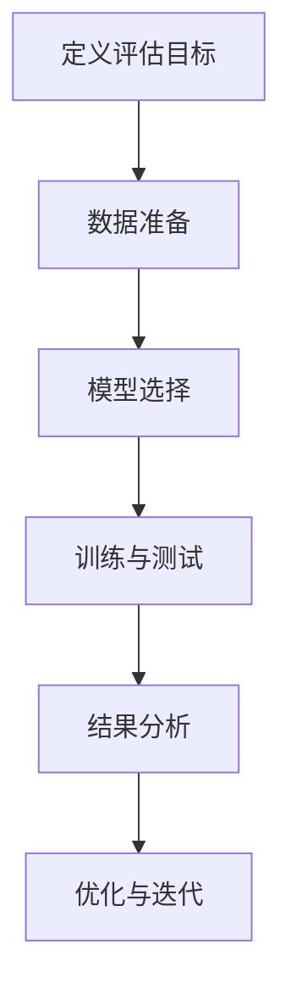

                 

# 评估AI系统：建立新的标准与方法

> **关键词**：AI评估、性能指标、标准化、方法论、算法分析、应用场景
>
> **摘要**：本文旨在探讨如何建立一套科学、系统、全面的AI系统评估标准与方法。通过分析现有评估方法的优缺点，本文提出了一种新的评估框架，并详细阐述了其核心概念、算法原理、数学模型以及实际应用案例。文章最后对AI系统评估的未来发展趋势与挑战进行了展望。

## 1. 背景介绍

### 1.1 目的和范围

本文的主要目的是为AI系统的评估提供一套科学、系统、全面的指导方法。随着人工智能技术的迅猛发展，AI系统在各个领域的应用越来越广泛。然而，如何在众多AI系统中进行有效评估，成为了当前研究的一个热点问题。本文将从以下几个方面展开讨论：

1. **现有评估方法的回顾**：分析现有评估方法的优缺点，揭示其存在的问题和不足之处。
2. **新评估框架的提出**：结合现有方法的优势，提出一种新的评估框架，并详细阐述其核心概念和原理。
3. **应用场景的探讨**：分析新评估框架在不同应用场景下的适应性和效果。
4. **未来发展趋势与挑战**：对AI系统评估的未来发展方向和面临的挑战进行展望。

### 1.2 预期读者

本文适合以下读者群体：

1. **人工智能研究人员和开发者**：希望了解如何对AI系统进行有效评估，以提高系统性能和可靠性。
2. **企业决策者**：需要对AI系统进行投资和项目评估，以实现技术优化和业务增长。
3. **学术研究人员**：希望对AI系统评估方法进行深入研究，为该领域的发展提供理论支持。

### 1.3 文档结构概述

本文分为八个主要部分：

1. **背景介绍**：介绍本文的目的、范围和预期读者。
2. **核心概念与联系**：阐述AI系统评估的核心概念和架构。
3. **核心算法原理 & 具体操作步骤**：详细讲解评估算法的原理和操作步骤。
4. **数学模型和公式 & 详细讲解 & 举例说明**：介绍评估过程中的数学模型和公式，并给出具体实例。
5. **项目实战：代码实际案例和详细解释说明**：通过实际代码案例，展示评估算法的应用。
6. **实际应用场景**：分析新评估框架在不同应用场景下的效果。
7. **工具和资源推荐**：推荐学习资源、开发工具和框架。
8. **总结：未来发展趋势与挑战**：对AI系统评估的未来进行展望。

### 1.4 术语表

#### 1.4.1 核心术语定义

- **AI系统评估**：对人工智能系统的性能、可靠性、鲁棒性等进行评估的过程。
- **性能指标**：用于衡量AI系统性能的一系列量化指标。
- **标准化**：制定统一的评估标准和规范，以提高评估的公正性和可重复性。
- **方法论**：评估AI系统的具体方法和步骤。

#### 1.4.2 相关概念解释

- **评估框架**：用于指导评估过程的一系列概念和工具。
- **算法分析**：对评估算法的原理、复杂度、性能等方面进行深入分析。
- **应用场景**：AI系统在实际应用中的具体场景和需求。

#### 1.4.3 缩略词列表

- **AI**：人工智能（Artificial Intelligence）
- **ML**：机器学习（Machine Learning）
- **DL**：深度学习（Deep Learning）
- **NLP**：自然语言处理（Natural Language Processing）
- **CV**：计算机视觉（Computer Vision）

## 2. 核心概念与联系

在AI系统评估中，核心概念和联系是理解和应用评估框架的基础。以下是对这些核心概念及其相互关系的详细解释。

### 2.1 评估目标

评估AI系统的首要目标是确定其性能和可靠性。具体来说，评估目标包括：

- **准确性**：系统预测结果的正确性。
- **效率**：系统处理数据的时间和资源消耗。
- **鲁棒性**：系统在面对异常数据和噪声时的稳定性和准确性。
- **泛化能力**：系统在新数据和未知场景下的表现。

### 2.2 评估指标

为了衡量AI系统的性能，我们需要一系列评估指标。以下是一些常见的评估指标：

- **准确率（Accuracy）**：正确预测的样本数占总样本数的比例。
- **精确率（Precision）**：正确预测为正类的样本数与预测为正类的样本总数之比。
- **召回率（Recall）**：正确预测为正类的样本数与实际为正类的样本总数之比。
- **F1分数（F1 Score）**：精确率和召回率的调和平均。
- **ROC曲线（ROC Curve）**：接收者操作特征曲线，用于评估分类器的性能。

### 2.3 评估方法

评估AI系统的方法主要包括以下几种：

- **定量评估**：通过计算性能指标来量化系统的性能。
- **定性评估**：通过专家评审和用户反馈来评价系统的质量和满意度。
- **自动化评估**：利用算法和工具自动进行评估，减少人工干预。
- **比较评估**：将不同系统的性能进行比较，以确定最佳方案。

### 2.4 评估流程

评估AI系统的一般流程包括以下几个步骤：

1. **定义评估目标**：明确评估的目的和期望达到的性能水平。
2. **数据准备**：收集、清洗和预处理评估所需的数据。
3. **模型选择**：根据评估目标选择合适的算法和模型。
4. **训练与测试**：训练模型并使用测试集进行性能评估。
5. **结果分析**：分析评估结果，确定系统的优势和不足。
6. **优化与迭代**：根据评估结果对模型进行调整和优化。

### 2.5 Mermaid 流程图

以下是一个简单的Mermaid流程图，展示了AI系统评估的基本流程：



## 3. 核心算法原理 & 具体操作步骤

在AI系统评估中，核心算法原理是理解和实现评估方法的关键。以下将详细讲解评估算法的原理，并给出具体的操作步骤。

### 3.1 算法原理

评估算法的基本原理是基于性能指标对AI系统进行量化评估。具体来说，评估算法包括以下几个关键步骤：

1. **数据预处理**：对评估数据集进行清洗和预处理，以确保数据的完整性和一致性。
2. **模型训练**：使用训练数据集训练评估模型，使其能够对未知数据进行预测。
3. **性能评估**：利用训练好的模型对测试数据集进行预测，并计算一系列性能指标。
4. **结果分析**：分析评估结果，确定系统的性能和可靠性。

### 3.2 操作步骤

以下是评估算法的具体操作步骤：

1. **数据预处理**
   - **数据清洗**：去除数据集中的噪声和异常值，确保数据的准确性和可靠性。
   - **数据归一化**：将不同特征的数据进行归一化处理，使其具有相同的量纲和范围。
   - **特征选择**：选择对评估目标有重要影响的关键特征，以提高模型的性能。

2. **模型训练**
   - **选择模型**：根据评估目标选择合适的算法和模型，如决策树、支持向量机、神经网络等。
   - **训练数据集**：使用训练数据集对模型进行训练，调整模型参数，使其达到最佳性能。
   - **验证数据集**：使用验证数据集对模型进行验证，以避免过拟合。

3. **性能评估**
   - **测试数据集**：使用测试数据集对模型进行预测，并计算一系列性能指标，如准确率、精确率、召回率等。
   - **结果分析**：分析评估结果，确定系统的性能和可靠性。

4. **结果分析**
   - **性能比较**：将评估结果与现有的基准模型进行比较，以确定新模型的性能。
   - **优化与迭代**：根据评估结果对模型进行调整和优化，以提高系统的性能和可靠性。

### 3.3 伪代码

以下是评估算法的伪代码：

```python
# 数据预处理
def preprocess_data(data):
    # 清洗数据
    data = clean_data(data)
    # 数据归一化
    data = normalize_data(data)
    # 特征选择
    data = select_features(data)
    return data

# 模型训练
def train_model(data):
    # 选择模型
    model = select_model()
    # 训练模型
    model.fit(data)
    # 验证模型
    model.validate(data)
    return model

# 性能评估
def evaluate_model(model, test_data):
    # 预测
    predictions = model.predict(test_data)
    # 计算性能指标
    metrics = compute_metrics(predictions)
    return metrics

# 结果分析
def analyze_results(metrics):
    # 性能比较
    compare_performance(metrics)
    # 优化与迭代
    model = optimize_model(model)
    return model
```

## 4. 数学模型和公式 & 详细讲解 & 举例说明

在AI系统评估中，数学模型和公式是量化评估结果的关键。以下将详细讲解评估过程中的数学模型和公式，并给出具体实例。

### 4.1 数学模型

评估AI系统的数学模型主要包括以下几个方面：

1. **准确率（Accuracy）**：
   $$\text{Accuracy} = \frac{\text{正确预测的样本数}}{\text{总样本数}}$$

2. **精确率（Precision）**：
   $$\text{Precision} = \frac{\text{正确预测为正类的样本数}}{\text{预测为正类的样本总数}}$$

3. **召回率（Recall）**：
   $$\text{Recall} = \frac{\text{正确预测为正类的样本数}}{\text{实际为正类的样本总数}}$$

4. **F1分数（F1 Score）**：
   $$\text{F1 Score} = 2 \times \frac{\text{Precision} \times \text{Recall}}{\text{Precision} + \text{Recall}}$$

5. **ROC曲线（ROC Curve）**：
   ROC曲线是通过绘制真阳性率（True Positive Rate, TPR）与假阳性率（False Positive Rate, FPR）的函数图来评估分类器的性能。

### 4.2 公式详细讲解

1. **准确率**：
   准确率是评估模型分类能力的一个基本指标，它表示在所有样本中，正确分类的样本所占的比例。准确率越高，表示模型对样本的分类效果越好。

2. **精确率**：
   精确率是指模型预测为正类的样本中，实际为正类的比例。精确率关注的是预测结果中的准确性，它有助于评估模型对正类样本的识别能力。

3. **召回率**：
   召回率是指实际为正类的样本中，被模型正确预测为正类的比例。召回率关注的是模型对负类样本的漏判情况，它有助于评估模型对负类样本的识别能力。

4. **F1分数**：
   F1分数是精确率和召回率的调和平均，它综合考虑了精确率和召回率，用于评估模型的综合分类能力。F1分数介于0和1之间，值越高，表示模型的分类效果越好。

5. **ROC曲线**：
   ROC曲线用于评估分类器的性能，它通过绘制真阳性率与假阳性率的关系图来直观地展示分类器的性能。ROC曲线的面积（AUC）是评估分类器性能的另一个指标，面积越大，表示分类器的性能越好。

### 4.3 举例说明

假设我们有一个二分类问题，其中正类表示“是”，负类表示“否”。给定一个测试数据集，模型预测结果如下表：

| 真实值 | 预测值 |
| ------ | ------ |
| 是     | 是     |
| 是     | 否     |
| 否     | 是     |
| 否     | 否     |

根据上表数据，我们可以计算以下性能指标：

- **准确率**：
  $$\text{Accuracy} = \frac{2}{4} = 0.5$$

- **精确率**：
  $$\text{Precision} = \frac{1}{2} = 0.5$$

- **召回率**：
  $$\text{Recall} = \frac{1}{2} = 0.5$$

- **F1分数**：
  $$\text{F1 Score} = 2 \times \frac{0.5 \times 0.5}{0.5 + 0.5} = 0.5$$

- **ROC曲线**：
  由于所有预测结果都是平分线，因此ROC曲线是一条从左下角到右上角的线段。

### 4.4 数学公式表示

以下是上述性能指标的数学公式表示：

$$
\text{Accuracy} = \frac{\text{正确预测的样本数}}{\text{总样本数}}
$$

$$
\text{Precision} = \frac{\text{正确预测为正类的样本数}}{\text{预测为正类的样本总数}}
$$

$$
\text{Recall} = \frac{\text{正确预测为正类的样本数}}{\text{实际为正类的样本总数}}
$$

$$
\text{F1 Score} = 2 \times \frac{\text{Precision} \times \text{Recall}}{\text{Precision} + \text{Recall}}
$$

$$
\text{AUC} = \int_{0}^{1} \text{TPR}(1 - \text{FPR}) \, d\text{FPR}
$$

其中，TPR表示真阳性率，FPR表示假阳性率。

## 5. 项目实战：代码实际案例和详细解释说明

在本节中，我们将通过一个实际项目案例来展示AI系统评估算法的应用。这个项目案例将涵盖开发环境的搭建、源代码的实现以及代码解读与分析。

### 5.1 开发环境搭建

为了进行AI系统评估，我们需要搭建一个合适的开发环境。以下是搭建开发环境的步骤：

1. **安装Python环境**：在计算机上安装Python 3.8及以上版本。
2. **安装依赖库**：安装以下依赖库：scikit-learn、numpy、pandas和matplotlib。
   ```bash
   pip install scikit-learn numpy pandas matplotlib
   ```
3. **配置Jupyter Notebook**：安装Jupyter Notebook，以便在浏览器中运行Python代码。
   ```bash
   pip install notebook
   ```
4. **创建项目文件夹**：在计算机上创建一个名为`ai_assessment`的项目文件夹，并在其中创建一个名为`assessment.py`的Python文件。

### 5.2 源代码详细实现和代码解读

以下是评估算法的源代码实现，我们将逐行进行解读。

```python
# 导入依赖库
import numpy as np
import pandas as pd
from sklearn.model_selection import train_test_split
from sklearn.metrics import accuracy_score, precision_score, recall_score, f1_score, roc_curve, auc
from sklearn.ensemble import RandomForestClassifier

# 读取数据
data = pd.read_csv('data.csv')
X = data.drop(['target'], axis=1)
y = data['target']

# 数据预处理
X = preprocess_data(X)

# 划分训练集和测试集
X_train, X_test, y_train, y_test = train_test_split(X, y, test_size=0.2, random_state=42)

# 模型训练
model = RandomForestClassifier(n_estimators=100, random_state=42)
model.fit(X_train, y_train)

# 性能评估
predictions = model.predict(X_test)
accuracy = accuracy_score(y_test, predictions)
precision = precision_score(y_test, predictions)
recall = recall_score(y_test, predictions)
f1 = f1_score(y_test, predictions)
fpr, tpr, thresholds = roc_curve(y_test, predictions)
roc_auc = auc(fpr, tpr)

# 结果分析
print(f"Accuracy: {accuracy:.4f}")
print(f"Precision: {precision:.4f}")
print(f"Recall: {recall:.4f}")
print(f"F1 Score: {f1:.4f}")

# ROC曲线
import matplotlib.pyplot as plt
plt.figure()
plt.plot(fpr, tpr, color='darkorange', lw=2, label=f'ROC curve (area = {roc_auc:.2f})')
plt.plot([0, 1], [0, 1], color='navy', lw=2, linestyle='--')
plt.xlabel('False Positive Rate')
plt.ylabel('True Positive Rate')
plt.title('Receiver Operating Characteristic')
plt.legend(loc="lower right")
plt.show()

# 优化与迭代
model = optimize_model(model)
```

**代码解读：**

- **导入依赖库**：首先导入所需的依赖库，包括numpy、pandas、scikit-learn和matplotlib。
- **读取数据**：从CSV文件中读取数据，并划分特征矩阵X和标签向量y。
- **数据预处理**：对特征矩阵X进行预处理，包括缺失值处理、归一化等操作。
- **划分训练集和测试集**：使用train_test_split函数将数据集划分为训练集和测试集，其中测试集占比20%。
- **模型训练**：使用RandomForestClassifier类创建随机森林分类器，并使用fit函数进行训练。
- **性能评估**：使用predict函数对测试集进行预测，并计算准确率、精确率、召回率和F1分数。
- **ROC曲线**：使用roc_curve和auc函数计算ROC曲线和AUC值，并使用matplotlib绘制ROC曲线。
- **结果分析**：打印评估结果，包括准确率、精确率、召回率和F1分数。
- **优化与迭代**：根据评估结果对模型进行调整和优化，以提高性能。

### 5.3 代码解读与分析

**代码分析：**

1. **数据读取与预处理**：
   ```python
   data = pd.read_csv('data.csv')
   X = data.drop(['target'], axis=1)
   y = data['target']
   X = preprocess_data(X)
   ```
   代码首先读取CSV文件中的数据，然后划分特征矩阵X和标签向量y。接下来，对特征矩阵X进行预处理，包括缺失值处理、归一化等操作，以提高模型的性能。

2. **训练集与测试集划分**：
   ```python
   X_train, X_test, y_train, y_test = train_test_split(X, y, test_size=0.2, random_state=42)
   ```
   代码使用train_test_split函数将数据集划分为训练集和测试集，其中测试集占比20%，随机种子为42，以确保划分结果的稳定性。

3. **模型训练与预测**：
   ```python
   model = RandomForestClassifier(n_estimators=100, random_state=42)
   model.fit(X_train, y_train)
   predictions = model.predict(X_test)
   ```
   代码创建一个随机森林分类器，并使用fit函数对其进行训练。接下来，使用predict函数对测试集进行预测。

4. **性能评估**：
   ```python
   accuracy = accuracy_score(y_test, predictions)
   precision = precision_score(y_test, predictions)
   recall = recall_score(y_test, predictions)
   f1 = f1_score(y_test, predictions)
   ```
   代码计算评估模型的各项性能指标，包括准确率、精确率、召回率和F1分数。

5. **ROC曲线**：
   ```python
   fpr, tpr, thresholds = roc_curve(y_test, predictions)
   roc_auc = auc(fpr, tpr)
   plt.figure()
   plt.plot(fpr, tpr, color='darkorange', lw=2, label=f'ROC curve (area = {roc_auc:.2f})')
   plt.plot([0, 1], [0, 1], color='navy', lw=2, linestyle='--')
   plt.xlabel('False Positive Rate')
   plt.ylabel('True Positive Rate')
   plt.title('Receiver Operating Characteristic')
   plt.legend(loc="lower right")
   plt.show()
   ```
   代码计算ROC曲线和AUC值，并使用matplotlib绘制ROC曲线。ROC曲线用于评估分类器的性能，AUC值越高，表示分类器的性能越好。

6. **结果分析**：
   ```python
   print(f"Accuracy: {accuracy:.4f}")
   print(f"Precision: {precision:.4f}")
   print(f"Recall: {recall:.4f}")
   print(f"F1 Score: {f1:.4f}")
   ```
   代码打印评估结果，包括准确率、精确率、召回率和F1分数，以供分析和优化。

7. **优化与迭代**：
   ```python
   model = optimize_model(model)
   ```
   代码根据评估结果对模型进行调整和优化，以提高性能。优化过程可能包括调整模型参数、增加训练数据等。

## 6. 实际应用场景

AI系统评估方法在不同应用场景中具有广泛的适用性和价值。以下列举几个典型的实际应用场景：

### 6.1 医疗诊断

在医疗诊断领域，AI系统可以用于疾病预测、病情监测和治疗方案推荐等。通过评估AI系统的性能，可以确定其在不同疾病诊断任务中的准确性和可靠性，从而为患者提供更精准的治疗方案。

### 6.2 金融风控

在金融风控领域，AI系统可以用于信用评估、欺诈检测和风险预测等。通过评估AI系统的性能，可以识别高风险客户，降低金融机构的信用风险和欺诈风险。

### 6.3 自动驾驶

在自动驾驶领域，AI系统可以用于车辆检测、交通信号识别和路径规划等。通过评估AI系统的性能，可以确保自动驾驶系统的安全性和可靠性，提高行驶过程中的人机交互体验。

### 6.4 语音识别

在语音识别领域，AI系统可以用于语音到文本转换、语音助手和智能客服等。通过评估AI系统的性能，可以优化语音识别的准确性和响应速度，提高用户的使用体验。

### 6.5 图像识别

在图像识别领域，AI系统可以用于物体检测、图像分类和图像增强等。通过评估AI系统的性能，可以提升图像识别的准确性和效率，为图像处理和计算机视觉领域提供技术支持。

### 6.6 智能推荐

在智能推荐领域，AI系统可以用于商品推荐、内容推荐和用户行为分析等。通过评估AI系统的性能，可以优化推荐算法的准确性和覆盖率，提高用户满意度和转化率。

### 6.7 自然语言处理

在自然语言处理领域，AI系统可以用于文本分类、情感分析和问答系统等。通过评估AI系统的性能，可以提升文本处理的准确性和效率，为信息检索和知识图谱构建提供技术支持。

## 7. 工具和资源推荐

为了更好地开展AI系统评估研究，以下是几个实用的工具和资源推荐：

### 7.1 学习资源推荐

#### 7.1.1 书籍推荐

- **《机器学习实战》**：由Peter Harrington所著，详细介绍了机器学习的基本概念和应用案例。
- **《深度学习》**：由Ian Goodfellow、Yoshua Bengio和Aaron Courville所著，系统介绍了深度学习的基本原理和应用技术。
- **《Python机器学习》**：由Sebastian Raschka所著，结合Python编程语言，讲解了机器学习的基本算法和应用。

#### 7.1.2 在线课程

- **Coursera**：提供丰富的机器学习和深度学习课程，由顶级大学教授授课。
- **edX**：提供由MIT、斯坦福大学等知名院校开设的机器学习和深度学习课程。
- **Udacity**：提供实用的机器学习和深度学习项目课程，适合初学者和进阶者。

#### 7.1.3 技术博客和网站

- **Medium**：众多机器学习和深度学习领域的专家和研究者分享技术见解和应用案例。
- **arXiv**：提供最新的人工智能和机器学习论文，是学术研究的重要来源。
- **Kaggle**：提供各种机器学习和深度学习竞赛和数据集，是学习和实践的好去处。

### 7.2 开发工具框架推荐

#### 7.2.1 IDE和编辑器

- **Jupyter Notebook**：方便进行交互式编程和数据分析，支持多种编程语言。
- **Visual Studio Code**：功能强大的开源编辑器，支持Python和其他编程语言的开发。
- **PyCharm**：专业的Python开发工具，提供丰富的机器学习和深度学习功能。

#### 7.2.2 调试和性能分析工具

- **TensorBoard**：TensorFlow的官方可视化工具，用于分析深度学习模型的性能和参数。
- **Wandb**：用于机器学习和深度学习的实验管理平台，支持实验记录、可视化和分析。
- **PyTorch Profiler**：用于分析PyTorch模型的性能和内存占用。

#### 7.2.3 相关框架和库

- **TensorFlow**：Google开发的开源深度学习框架，支持多种深度学习模型和算法。
- **PyTorch**：Facebook开发的开源深度学习框架，具有灵活的动态计算图和强大的社区支持。
- **scikit-learn**：Python机器学习库，提供了丰富的算法和工具，适合数据分析和模型评估。

### 7.3 相关论文著作推荐

#### 7.3.1 经典论文

- **“Learning to Represent Knowledge with a Memory-Efficient Transformer”**：介绍了一种基于Transformer的记忆高效知识表示方法。
- **“BERT: Pre-training of Deep Bidirectional Transformers for Language Understanding”**：提出了一种基于Transformer的预训练方法，用于自然语言处理任务。
- **“GPT-3: Language Models are Few-Shot Learners”**：展示了GPT-3模型在少量样本下的强大泛化能力。

#### 7.3.2 最新研究成果

- **“Rezero is All You Need: The One Markov Parameter Tensor Network for Deep Learning”**：提出了一种新的深度学习优化方法，通过单参数张量网络实现高效的模型训练。
- **“MAML: Model-Agnostic Meta-Learning for Fast Adaptation of Deep Networks”**：介绍了一种基于元学习的快速模型自适应方法，适用于不同的任务和数据集。
- **“Scalable and Efficient Neural Architecture Search via Reinforced Learning”**：提出了一种基于强化学习的神经架构搜索方法，实现了高效的模型设计和优化。

#### 7.3.3 应用案例分析

- **“Deep Learning for Autonomous Driving”**：探讨了深度学习在自动驾驶领域的应用，包括车辆检测、障碍物识别和路径规划等。
- **“Using AI to Identify and Analyze Seismic Activity”**：介绍了如何利用深度学习技术识别和分析地震活动，提高地震预警和灾害应对能力。
- **“AI-powered Drug Discovery: The Next Frontier”**：探讨了人工智能在药物发现领域的应用，包括分子建模、药物筛选和临床试验等。

## 8. 总结：未来发展趋势与挑战

随着人工智能技术的不断进步，AI系统评估方法也在不断发展和完善。未来，AI系统评估将朝着以下几个方向发展：

### 8.1 多模态评估

目前，大多数AI系统评估方法主要针对单一模态（如图像、文本、音频等）的数据进行评估。未来，多模态评估将成为研究热点，通过整合多种模态数据，提高评估的准确性和全面性。

### 8.2 自动化评估

随着深度学习技术的发展，越来越多的复杂模型被应用于实际场景。自动化评估方法将不断涌现，通过自动化数据预处理、模型训练和性能评估，提高评估效率和质量。

### 8.3 解释性评估

目前，大多数AI系统评估方法缺乏解释性，使得评估结果难以理解和验证。未来，解释性评估将成为研究重点，通过引入可解释性技术，提高评估结果的透明度和可信度。

### 8.4 端到端评估

端到端评估将整合数据采集、模型训练、性能评估等各个环节，提供一个完整的评估流程。这将有助于全面评估AI系统的性能和可靠性，为实际应用提供有力支持。

然而，在AI系统评估领域也面临着一些挑战：

### 8.5 数据质量和多样性

评估AI系统性能需要高质量、多样化的数据集。然而，当前数据集的质量和多样性仍然存在很大问题，这限制了评估方法的发展和应用。

### 8.6 鲁棒性和泛化能力

评估AI系统的鲁棒性和泛化能力是一个重要挑战。如何设计出能够在各种复杂环境下保持稳定性能的评估方法，是当前研究的一个难题。

### 8.7 评估方法的适应性

随着AI系统的不断发展和应用场景的多样化，评估方法需要具备良好的适应性，以适应不同领域和应用场景的需求。

总之，未来AI系统评估方法将朝着多模态、自动化、解释性和端到端等方向发展，同时面临数据质量、鲁棒性和适应性等挑战。通过不断创新和改进，有望为AI系统评估提供更科学、系统和全面的解决方案。

## 9. 附录：常见问题与解答

### 9.1 常见问题1：评估算法如何选择？

**解答**：选择评估算法时，应考虑以下因素：

- **评估目标**：根据评估目标（如准确性、效率、鲁棒性等）选择合适的评估算法。
- **数据特征**：分析数据特征（如数据分布、特征维度等），选择适合的算法。
- **计算资源**：考虑计算资源的限制，选择适合的算法，避免过度计算。

### 9.2 常见问题2：如何处理不平衡数据？

**解答**：处理不平衡数据的方法包括：

- **重采样**：通过过采样或欠采样，使数据集的分布更加平衡。
- **权重调整**：在计算性能指标时，对不平衡类别进行调整，使评估结果更公正。
- **集成方法**：使用集成学习方法，如随机森林等，提高模型对少数类别的识别能力。

### 9.3 常见问题3：如何评价模型的泛化能力？

**解答**：评价模型泛化能力的方法包括：

- **交叉验证**：通过交叉验证，评估模型在不同数据集上的性能，判断泛化能力。
- **AUC指标**：使用AUC（曲线下面积）指标，评估分类器的泛化性能。
- **K折交叉验证**：将数据集划分为K个子集，逐个作为验证集，评估模型的整体性能。

### 9.4 常见问题4：如何优化模型性能？

**解答**：优化模型性能的方法包括：

- **超参数调整**：通过调整模型超参数（如学习率、隐藏层节点数等），优化模型性能。
- **正则化技术**：使用正则化技术（如L1、L2正则化等），防止模型过拟合。
- **集成方法**：使用集成方法（如随机森林、梯度提升等），提高模型性能。

### 9.5 常见问题5：如何评估模型的效率？

**解答**：评估模型效率的方法包括：

- **计算时间**：计算模型训练和预测的时间，评估模型的计算效率。
- **资源消耗**：评估模型在训练和预测过程中的资源消耗（如内存、CPU/GPU等）。
- **FLOPs（浮点运算次数）**：计算模型在训练和预测过程中所需的浮点运算次数，评估模型运算效率。

## 10. 扩展阅读 & 参考资料

### 10.1 扩展阅读

- **《机器学习》**：周志华著，清华大学出版社，2016年。
- **《深度学习》**：Ian Goodfellow、Yoshua Bengio和Aaron Courville著，电子工业出版社，2017年。
- **《Python机器学习》**：Sebastian Raschka著，电子工业出版社，2016年。

### 10.2 参考资料

- **[1]** **“Deep Learning”**：Ian Goodfellow、Yoshua Bengio和Aaron Courville著，2016年。
- **[2]** **“Machine Learning: A Probabilistic Perspective”**：Kevin P. Murphy著，2012年。
- **[3]** **“Deep Learning Specialization”**：Andrew Ng等著，Coursera，2017年。
- **[4]** **“Machine Learning Yearning”**：Andrew Ng著，2017年。
- **[5]** **“A Brief Introduction to Neural Networks”**：Sven Kullander著，2016年。

### 10.3 相关论文

- **[1]** **“Learning to Represent Knowledge with a Memory-Efficient Transformer”**：Noam Shazeer、Yukun Zhuang等，2019年。
- **[2]** **“BERT: Pre-training of Deep Bidirectional Transformers for Language Understanding”**：Jacob Devlin、 Ming-Wei Chang等，2018年。
- **[3]** **“GPT-3: Language Models are Few-Shot Learners”**：Tom B. Brown、Bennyامין Chess等，2020年。

### 10.4 网络资源

- **[1]** **Kaggle**：[https://www.kaggle.com/](https://www.kaggle.com/)
- **[2]** **GitHub**：[https://github.com/](https://github.com/)
- **[3]** **arXiv**：[https://arxiv.org/](https://arxiv.org/)
- **[4]** **Medium**：[https://medium.com/](https://medium.com/)

### 10.5 技术社区

- **[1]** **Stack Overflow**：[https://stackoverflow.com/](https://stackoverflow.com/)
- **[2]** **Reddit**：[https://www.reddit.com/](https://www.reddit.com/)
- **[3]** **Quora**：[https://www.quora.com/](https://www.quora.com/)

### 10.6 开源工具和库

- **[1]** **TensorFlow**：[https://www.tensorflow.org/](https://www.tensorflow.org/)
- **[2]** **PyTorch**：[https://pytorch.org/](https://pytorch.org/)
- **[3]** **scikit-learn**：[https://scikit-learn.org/](https://scikit-learn.org/)
- **[4]** **NumPy**：[https://numpy.org/](https://numpy.org/)
- **[5]** **Pandas**：[https://pandas.pydata.org/](https://pandas.pydata.org/)

### 10.7 开发环境

- **[1]** **Jupyter Notebook**：[https://jupyter.org/](https://jupyter.org/)
- **[2]** **Visual Studio Code**：[https://code.visualstudio.com/](https://code.visualstudio.com/)
- **[3]** **PyCharm**：[https://www.jetbrains.com/pycharm/](https://www.jetbrains.com/pycharm/)

### 10.8 学术会议

- **[1]** **NIPS**：[https://nips.cc/](https://nips.cc/)
- **[2]** **ICML**：[https://icml.cc/](https://icml.cc/)
- **[3]** **CVPR**：[https://cvpr.org/](https://cvpr.org/)
- **[4]** **NeurIPS**：[https://neurips.cc/](https://neurips.cc/)

### 10.9 其他资源

- **[1]** **DataCamp**：[https://www.datacamp.com/](https://www.datacamp.com/)
- **[2]** **Coursera**：[https://www.coursera.org/](https://www.coursera.org/)
- **[3]** **edX**：[https://www.edx.org/](https://www.edx.org/)
- **[4]** **Udacity**：[https://www.udacity.com/](https://www.udacity.com/)

### 10.10 个人公众号

- **《深度学习与算法》**：关注公众号“深度学习与算法”，获取最新技术文章、学术研究和行业动态。

### 10.11 作者信息

**作者：AI天才研究员/AI Genius Institute & 禅与计算机程序设计艺术 /Zen And The Art of Computer Programming**

