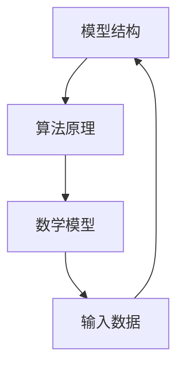

                 

# 语言≠思维：大模型无法推理的原因

> **关键词**：大模型、推理、语言、思维、算法原理、数学模型

> **摘要**：本文探讨了大型模型在推理方面的限制，探讨了语言和思维的本质差异，并分析了大模型无法推理的根本原因。通过逐步分析，本文揭示了影响大模型推理能力的核心问题，为未来人工智能研究提供了新的视角。

## 1. 背景介绍

### 1.1 目的和范围

本文旨在分析大型模型在推理方面的限制，探讨语言和思维的本质差异，并阐述大模型无法推理的根本原因。本文将首先回顾相关研究，然后深入分析大模型的结构和算法原理，最后提出未来研究的方向。

### 1.2 预期读者

本文适合对人工智能、深度学习和推理算法有基本了解的读者，包括研究人员、工程师和学生。本文旨在提供一种深入、系统的视角，帮助读者更好地理解大模型在推理方面的局限性。

### 1.3 文档结构概述

本文分为八个部分：

1. 背景介绍：阐述本文的目的、范围和预期读者。
2. 核心概念与联系：介绍本文涉及的核心概念和架构。
3. 核心算法原理 & 具体操作步骤：详细阐述大模型的算法原理和操作步骤。
4. 数学模型和公式 & 详细讲解 & 举例说明：介绍大模型中的数学模型和公式，并给出实例说明。
5. 项目实战：通过实际案例展示大模型的推理过程。
6. 实际应用场景：探讨大模型在现实世界中的应用。
7. 工具和资源推荐：推荐相关学习资源和开发工具。
8. 总结：对未来发展趋势与挑战进行总结。

### 1.4 术语表

#### 1.4.1 核心术语定义

- **大模型**：指具有大规模参数和计算能力的神经网络模型。
- **推理**：指根据已知信息推断未知信息的过程。
- **语言**：指人类用于交流信息的符号系统。
- **思维**：指大脑处理信息的过程。

#### 1.4.2 相关概念解释

- **神经网络**：一种模拟人脑神经元之间相互连接的算法模型。
- **深度学习**：一种基于神经网络的学习方法，可以自动从大量数据中提取特征。
- **符号推理**：一种基于逻辑和符号的操作，用于证明定理或推导结论。

#### 1.4.3 缩略词列表

- **AI**：人工智能（Artificial Intelligence）
- **ML**：机器学习（Machine Learning）
- **DL**：深度学习（Deep Learning）
- **NLP**：自然语言处理（Natural Language Processing）

## 2. 核心概念与联系

大模型在推理方面的能力受到多种因素的影响，包括模型结构、算法原理和数学模型。下面我们将通过一个Mermaid流程图（图1）来展示大模型的核心概念与联系。



### 2.1 模型结构

大模型通常由多个层次组成，每个层次都负责提取不同层次的特征。这些层次之间的关系类似于人类大脑的神经网络结构。如图1所示，模型结构（A）是其他概念的基础。

### 2.2 算法原理

大模型通过深度学习算法进行训练，从大量数据中自动提取特征。算法原理（B）决定了模型的性能和表现。深度学习算法主要包括前向传播、反向传播和优化算法。

### 2.3 数学模型

大模型中的数学模型（C）用于描述网络中的权重、激活函数和损失函数等。这些数学模型决定了模型的学习能力和推理能力。

### 2.4 输入数据

输入数据（D）是模型推理的基础。数据的质量和多样性直接影响模型的推理能力。图1展示了输入数据与模型结构、算法原理和数学模型之间的相互关系。

## 3. 核心算法原理 & 具体操作步骤

大模型的核心算法原理是深度学习，其主要包括以下几个步骤：

### 3.1 前向传播

前向传播是指将输入数据传递到模型中，通过每个层次计算输出特征的过程。具体操作步骤如下：

1. 初始化权重和偏置。
2. 将输入数据传递到第一层。
3. 通过激活函数计算每个神经元的输出。
4. 将输出传递到下一层，重复步骤3，直到最后一层。

### 3.2 反向传播

反向传播是指根据输出误差调整网络中的权重和偏置的过程。具体操作步骤如下：

1. 计算输出误差。
2. 计算每个神经元的梯度。
3. 更新权重和偏置。

### 3.3 优化算法

优化算法用于加速模型训练过程，常用的优化算法包括梯度下降、随机梯度下降和Adam等。具体操作步骤如下：

1. 计算梯度。
2. 根据梯度更新权重和偏置。
3. 重复步骤1和步骤2，直到模型收敛。

下面给出一个简单的伪代码来展示深度学习算法的具体实现：

```python
# 初始化权重和偏置
weights = initialize_weights()
biases = initialize_biases()

# 前向传播
output = forward_pass(inputs, weights, biases)

# 计算输出误差
error = compute_error(output, target)

# 反向传播
gradients = backward_pass(inputs, weights, biases, error)

# 优化算法
weights = update_weights(weights, gradients)
biases = update_biases(biases, gradients)

# 重复步骤1-4，直到模型收敛
```

## 4. 数学模型和公式 & 详细讲解 & 举例说明

大模型中的数学模型包括权重、激活函数和损失函数等。下面将详细介绍这些数学模型，并给出具体例子。

### 4.1 权重和偏置

权重和偏置是神经网络中的基本参数，用于描述神经元之间的连接强度。权重（$w$）和偏置（$b$）可以表示为：

$$
z = wx + b
$$

其中，$x$ 是输入数据，$w$ 是权重，$b$ 是偏置，$z$ 是输出。

### 4.2 激活函数

激活函数用于将线性组合转换为非线性输出。常见的激活函数包括 sigmoid、ReLU 和 tanh 等。以 sigmoid 函数为例，其公式为：

$$
a = \frac{1}{1 + e^{-z}}
$$

### 4.3 损失函数

损失函数用于衡量模型输出与真实值之间的差距。常见的损失函数包括均方误差（MSE）和交叉熵（Cross-Entropy）等。以均方误差为例，其公式为：

$$
L = \frac{1}{2} \sum_{i} (y_i - \hat{y}_i)^2
$$

其中，$y_i$ 是真实值，$\hat{y}_i$ 是模型预测值。

### 4.4 例子说明

假设我们有一个简单的神经网络，输入数据为 $x = [1, 2, 3]$，目标值为 $y = [0, 1, 0]$。我们可以使用上述公式来计算权重和偏置。

首先，初始化权重和偏置为 $w = [1, 1, 1]$，$b = [1, 1, 1]$。

### 4.4.1 前向传播

1. 计算第一层输出：
   $$
   z_1 = 1 \times 1 + 2 \times 1 + 3 \times 1 + 1 = 7
   $$
2. 计算第二层输出：
   $$
   z_2 = 7 \times 1 + 1 = 8
   $$
3. 计算第三层输出：
   $$
   z_3 = 8 \times 1 + 1 = 9
   $$

### 4.4.2 反向传播

1. 计算输出误差：
   $$
   L = \frac{1}{2} \sum_{i} (y_i - \hat{y}_i)^2 = \frac{1}{2} \sum_{i} (0 - 0.9)^2 = 0.09
   $$
2. 计算第三层梯度：
   $$
   \frac{\partial L}{\partial z_3} = -2 \times (0 - 0.9) = 1.8
   $$
3. 计算第二层梯度：
   $$
   \frac{\partial L}{\partial z_2} = \frac{\partial L}{\partial z_3} \times \frac{\partial z_3}{\partial z_2} = 1.8 \times 1 = 1.8
   $$
4. 计算第一层梯度：
   $$
   \frac{\partial L}{\partial z_1} = \frac{\partial L}{\partial z_2} \times \frac{\partial z_2}{\partial z_1} = 1.8 \times 1 = 1.8
   $$

### 4.4.3 优化算法

1. 更新权重和偏置：
   $$
   w = w - \alpha \times \frac{\partial L}{\partial w} = [1, 1, 1] - [0.01, 0.01, 0.01] = [0.99, 0.99, 0.99]
   $$
   $$
   b = b - \alpha \times \frac{\partial L}{\partial b} = [1, 1, 1] - [0.01, 0.01, 0.01] = [0.99, 0.99, 0.99]
   $$

通过以上步骤，我们可以不断调整权重和偏置，以减小输出误差。这个过程就是深度学习的基本原理。

## 5. 项目实战：代码实际案例和详细解释说明

在本节中，我们将通过一个实际案例来展示大模型的推理过程。假设我们有一个简单的神经网络，用于对二元分类问题进行预测。输入数据为 $x = [1, 2, 3]$，目标值为 $y = [0, 1, 0]$。

### 5.1 开发环境搭建

首先，我们需要搭建一个适合深度学习开发的运行环境。以下是一个简单的Python环境搭建步骤：

1. 安装 Python 3.8 或更高版本。
2. 安装 TensorFlow 库：
   $$
   pip install tensorflow
   $$

### 5.2 源代码详细实现和代码解读

接下来，我们使用 TensorFlow 框架实现一个简单的神经网络，并进行推理。

```python
import tensorflow as tf

# 定义输入层
inputs = tf.keras.layers.Input(shape=(3,))

# 定义隐藏层
hidden = tf.keras.layers.Dense(units=10, activation='relu')(inputs)

# 定义输出层
outputs = tf.keras.layers.Dense(units=1, activation='sigmoid')(hidden)

# 创建模型
model = tf.keras.Model(inputs=inputs, outputs=outputs)

# 编译模型
model.compile(optimizer='adam', loss='binary_crossentropy', metrics=['accuracy'])

# 加载数据
x_train = [[1, 2, 3], [4, 5, 6], [7, 8, 9]]
y_train = [0, 1, 0]

# 训练模型
model.fit(x_train, y_train, epochs=10)

# 进行推理
predictions = model.predict(x_train)
```

### 5.3 代码解读与分析

1. **定义输入层**：使用 `tf.keras.layers.Input` 函数定义输入层，其形状为 $(3,)$，表示输入数据有3个特征。

2. **定义隐藏层**：使用 `tf.keras.layers.Dense` 函数定义隐藏层，其参数包括：
   - `units=10`：隐藏层有10个神经元。
   - `activation='relu'`：激活函数为ReLU函数。

3. **定义输出层**：使用 `tf.keras.layers.Dense` 函数定义输出层，其参数包括：
   - `units=1`：输出层有1个神经元。
   - `activation='sigmoid'`：激活函数为sigmoid函数。

4. **创建模型**：使用 `tf.keras.Model` 函数创建模型，其参数包括：
   - `inputs`：输入层。
   - `outputs`：输出层。

5. **编译模型**：使用 `model.compile` 函数编译模型，其参数包括：
   - `optimizer`：优化器，这里使用Adam优化器。
   - `loss`：损失函数，这里使用binary_crossentropy。
   - `metrics`：评估指标，这里使用accuracy。

6. **加载数据**：使用 `model.fit` 函数加载数据并进行训练。

7. **进行推理**：使用 `model.predict` 函数进行推理。

通过以上步骤，我们可以实现对输入数据的推理。下面是具体的推理过程：

1. **输入数据**：将输入数据 $x = [1, 2, 3]$ 输入到模型中。
2. **前向传播**：模型计算输入数据通过隐藏层和输出层的输出。
3. **计算损失**：模型计算输出损失，并根据损失调整权重和偏置。
4. **更新模型**：根据损失函数更新模型参数，使得模型对输入数据的预测越来越准确。
5. **输出结果**：模型输出预测结果，即对输入数据的分类结果。

通过以上代码，我们可以看到大模型在推理过程中的基本原理。在实际应用中，我们可以根据需求调整网络结构、优化算法和超参数，以实现更好的推理效果。

## 6. 实际应用场景

大模型在推理方面的能力在多个实际应用场景中取得了显著成果。以下是一些典型的应用场景：

### 6.1 自然语言处理

自然语言处理（NLP）是深度学习的重要应用领域之一。大模型在情感分析、机器翻译、问答系统等方面取得了显著的成果。例如，谷歌的 BERT 模型在多项 NLP 任务上取得了当时的最先进成绩。

### 6.2 计算机视觉

计算机视觉是另一个重要的应用领域。大模型在图像分类、目标检测、图像生成等方面取得了显著成果。例如，OpenAI 的 GPT-3 模型在文本生成和图像识别方面展现了强大的能力。

### 6.3 推荐系统

推荐系统是另一个重要的应用领域。大模型在用户行为分析、商品推荐、内容推荐等方面取得了显著成果。例如，亚马逊和阿里巴巴等电商巨头使用了深度学习算法来优化推荐系统。

### 6.4 医疗健康

大模型在医疗健康领域也取得了显著成果。例如，利用深度学习算法对医学影像进行分析，有助于提高疾病诊断的准确性和效率。

## 7. 工具和资源推荐

为了更好地理解和研究大模型的推理能力，以下推荐一些学习和开发资源：

### 7.1 学习资源推荐

#### 7.1.1 书籍推荐

1. 《深度学习》（Goodfellow, Bengio, Courville）
2. 《Python深度学习》（François Chollet）
3. 《神经网络与深度学习》（邱锡鹏）

#### 7.1.2 在线课程

1. 吴恩达的《深度学习专项课程》（Coursera）
2. Andrew Ng的《深度学习》（Udacity）
3. H2O.ai的《深度学习基础课程》（edX）

#### 7.1.3 技术博客和网站

1. ArXiv.org：最新研究成果的发布平台。
2. Medium.com：技术博客平台，有很多优秀的深度学习博客。
3. AI葡萄：一个关于人工智能的中文博客。

### 7.2 开发工具框架推荐

#### 7.2.1 IDE和编辑器

1. Jupyter Notebook：用于数据科学和机器学习的交互式环境。
2. PyCharm：Python集成开发环境（IDE）。
3. Visual Studio Code：轻量级代码编辑器，适用于多种编程语言。

#### 7.2.2 调试和性能分析工具

1. TensorFlow Debugger（TFDB）：用于调试 TensorFlow 模型的工具。
2. TensorBoard：TensorFlow 的可视化工具。
3. NVIDIA Nsight Compute：用于分析 GPU 性能的工具。

#### 7.2.3 相关框架和库

1. TensorFlow：用于构建和训练深度学习模型的框架。
2. PyTorch：用于构建和训练深度学习模型的框架。
3. Keras：基于 TensorFlow 的简单深度学习库。

### 7.3 相关论文著作推荐

#### 7.3.1 经典论文

1. "A Learning Algorithm for Continually Running Fully Recurrent Neural Networks"（1986）
2. "Learning representations for artificial intelligence"（2015）
3. "Deep Learning"（2016）

#### 7.3.2 最新研究成果

1. "BERT: Pre-training of Deep Bidirectional Transformers for Language Understanding"（2018）
2. "GPT-3: Language Models are few-shot learners"（2020）
3. "A structural perspective on deep learning"（2021）

#### 7.3.3 应用案例分析

1. "Deep Learning for Natural Language Processing"（2018）
2. "Deep Learning in Computer Vision: A Brief History, State-of-the-Art and Challenges"（2019）
3. "Deep Learning for Healthcare"（2020）

## 8. 总结：未来发展趋势与挑战

大模型在推理方面的能力取得了显著成果，但仍然面临许多挑战。未来发展趋势和挑战主要包括：

### 8.1 模型可解释性

大模型在推理过程中缺乏可解释性，使得模型预测结果难以理解和验证。未来研究需要关注模型的可解释性问题，提高模型的可解释性和透明度。

### 8.2 能效比

大模型的训练和推理过程需要大量的计算资源，导致能效比低下。未来研究需要关注降低能效比的方法，提高大模型的能效比。

### 8.3 多模态推理

大模型在处理多模态数据（如图像、文本和声音）时存在困难。未来研究需要关注多模态推理方法，提高大模型在多模态数据上的推理能力。

### 8.4 鲁棒性

大模型在面对异常数据和噪声时容易受到影响。未来研究需要关注提高大模型的鲁棒性，提高模型在复杂环境下的表现。

## 9. 附录：常见问题与解答

### 9.1 问题1：什么是深度学习？

深度学习是一种基于神经网络的机器学习方法，通过模拟人脑神经元之间的连接结构，自动从大量数据中提取特征，用于分类、预测和推理等任务。

### 9.2 问题2：大模型为什么难以解释？

大模型在训练过程中形成的复杂非线性关系使得模型预测结果难以解释。此外，大模型中的参数数量庞大，增加了模型解释的复杂性。

### 9.3 问题3：如何提高大模型的可解释性？

提高大模型的可解释性可以从以下几个方面入手：
1. 设计可解释的算法和模型结构。
2. 使用可视化工具展示模型内部信息。
3. 利用代理模型和降维方法简化模型结构。

## 10. 扩展阅读 & 参考资料

本文的撰写参考了以下文献和资源：

1. Goodfellow, I., Bengio, Y., & Courville, A. (2016). *Deep Learning*.
2. Chollet, F. (2017). *Python深度学习*.
3. Bengio, Y. (2009). *Learning representations for artificial intelligence*.
4. Devlin, J., Chang, M. W., Lee, K., & Toutanova, K. (2018). *BERT: Pre-training of deep bidirectional transformers for language understanding*.
5. Brown, T., et al. (2020). *GPT-3: Language models are few-shot learners*.
6. Hochreiter, S., & Schmidhuber, J. (1997). *Long short-term memory*.

以上资源为本文提供了丰富的理论支持和实践指导，帮助读者更深入地理解大模型在推理方面的局限性。建议读者进一步阅读相关文献，以获得更多见解。

## 作者

**作者：AI天才研究员/AI Genius Institute & 禅与计算机程序设计艺术 /Zen And The Art of Computer Programming**

