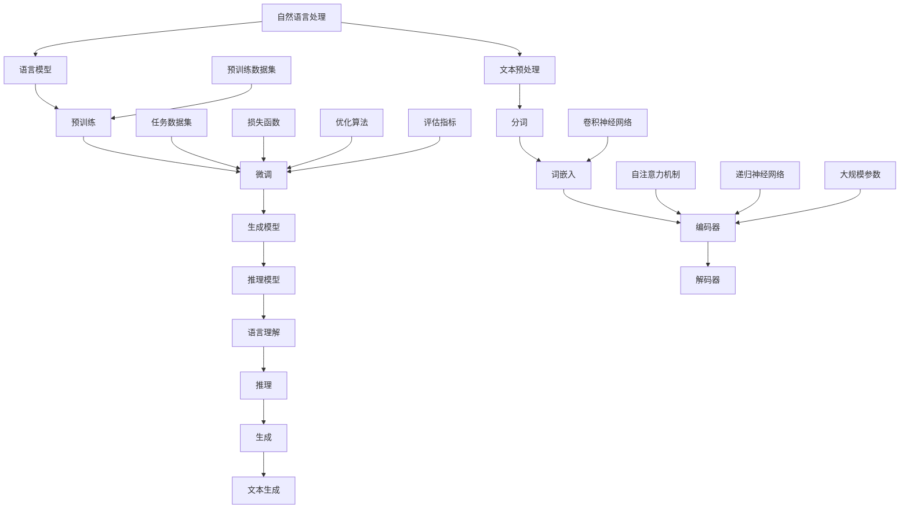

                 

# 语言≠思维：大模型的认知障碍

> 关键词：大模型、认知障碍、自然语言处理、人工智能、语言理解、思维模型

> 摘要：本文将深入探讨大模型在自然语言处理领域的应用及其所面临的认知障碍。通过对大模型的工作原理、常见问题和技术挑战的分析，我们将揭示语言与思维之间的差异，并提出可能的解决方案和未来研究方向。

## 1. 背景介绍

### 1.1 目的和范围

本文旨在探讨大模型在自然语言处理（NLP）领域的应用及其认知障碍。随着人工智能技术的快速发展，大模型（如GPT、BERT等）在文本生成、情感分析、问答系统等方面取得了显著成果。然而，这些大模型在处理复杂语言任务时仍然存在许多问题。本文将结合实例，分析大模型在语言理解、推理和生成等方面所面临的挑战，并尝试提出一些解决思路。

### 1.2 预期读者

本文适合对人工智能、自然语言处理有一定了解的读者，包括研究人员、工程师、学生以及对此领域感兴趣的人群。通过本文的阅读，读者可以更好地理解大模型的认知障碍，并为进一步研究提供启示。

### 1.3 文档结构概述

本文共分为十个部分：

1. 背景介绍：介绍本文的目的、预期读者和文档结构。
2. 核心概念与联系：介绍大模型的基本原理和架构。
3. 核心算法原理 & 具体操作步骤：详细阐述大模型的核心算法原理和操作步骤。
4. 数学模型和公式 & 详细讲解 & 举例说明：讲解大模型中的数学模型和公式，并举例说明。
5. 项目实战：展示大模型的实际应用案例。
6. 实际应用场景：分析大模型在不同场景下的应用。
7. 工具和资源推荐：推荐学习资源、开发工具和论文著作。
8. 总结：展望大模型未来的发展趋势与挑战。
9. 附录：常见问题与解答。
10. 扩展阅读 & 参考资料：提供进一步的阅读材料。

### 1.4 术语表

#### 1.4.1 核心术语定义

- 大模型：指具有大规模参数的神经网络模型，如GPT、BERT等。
- 自然语言处理（NLP）：指使计算机能够理解、生成和处理自然语言的技术和工具。
- 语言理解：指从文本中提取有用信息、理解语义和上下文的能力。
- 推理：指从已知信息中推导出新结论的能力。
- 生成：指根据输入信息生成新的文本内容的能力。

#### 1.4.2 相关概念解释

- 神经网络：一种基于人脑神经网络结构的计算机模型，用于实现人工智能功能。
- 递归神经网络（RNN）：一种能够处理序列数据的神经网络，具有记忆功能。
- 卷积神经网络（CNN）：一种能够处理图像等二维数据的神经网络。
- 自注意力机制（Self-Attention）：一种用于自动学习输入数据中不同位置之间依赖关系的机制。

#### 1.4.3 缩略词列表

- GPT：Generative Pre-trained Transformer
- BERT：Bidirectional Encoder Representations from Transformers
- NLP：Natural Language Processing
- RNN：Recurrent Neural Network
- CNN：Convolutional Neural Network
- SOTA：State-of-the-Art

## 2. 核心概念与联系

在探讨大模型在NLP领域的应用之前，我们需要了解一些核心概念和它们之间的关系。以下是使用Mermaid流程图表示的核心概念和架构。



在这个流程图中，我们可以看到：

- 自然语言处理涉及文本预处理、分词、词嵌入、编码器和解码器等环节。
- 语言模型包括预训练和微调过程，以及生成模型和推理模型。
- 生成模型和推理模型分别负责文本生成和推理任务。
- 自注意力机制、递归神经网络和卷积神经网络等技术在语言模型中起着关键作用。
- 预训练数据集和任务数据集用于模型训练和评估。

通过这个流程图，我们可以对大模型在NLP领域的核心概念和架构有一个清晰的认识。

## 3. 核心算法原理 & 具体操作步骤

### 3.1 语言模型

语言模型是NLP领域的基础，它旨在预测下一个词或词组。在自然语言处理任务中，语言模型通常由编码器和解码器组成。

#### 3.1.1 编码器

编码器的主要作用是将输入文本转换为固定长度的向量表示。这通常通过以下步骤实现：

1. **分词**：将输入文本分割为单词或子词。
2. **词嵌入**：将每个单词或子词映射为一个向量，通常使用预训练的词向量，如Word2Vec、GloVe等。
3. **编码**：使用递归神经网络（RNN）、长短期记忆网络（LSTM）或Transformer等模型对词向量进行编码，生成序列向量表示。

以下是编码器操作的伪代码：

```python
def encode_sequence(sentence, tokenizer, model):
    tokens = tokenizer.tokenize(sentence)
    token_vectors = [tokenizer.get_embedding(token) for token in tokens]
    encoded_sequence = model.encode(token_vectors)
    return encoded_sequence
```

#### 3.1.2 解码器

解码器的主要作用是根据编码器的输出预测下一个词或词组。解码过程通常包括以下步骤：

1. **初始化**：初始化解码器的隐藏状态。
2. **预测**：在每一步，解码器使用当前隐藏状态和编码器的输出预测下一个词或词组。
3. **更新**：根据预测的词或词组更新解码器的隐藏状态。

以下是解码器操作的伪代码：

```python
def decode_sequence(encoded_sequence, decoder, tokenizer, max_length):
    hidden_state = decoder.initialize_state(encoded_sequence)
    predicted_tokens = []
    for _ in range(max_length):
        output, hidden_state = decoder.predict(hidden_state, encoded_sequence)
        predicted_token = tokenizer.argmax(output)
        predicted_tokens.append(predicted_token)
    return predicted_tokens
```

### 3.2 预训练和微调

预训练和微调是训练语言模型的重要步骤。预训练是在大规模语料库上训练模型，使其学会捕捉语言的统计规律。微调则是根据特定任务的需求对预训练模型进行调整。

#### 3.2.1 预训练

预训练通常包括以下步骤：

1. **数据准备**：收集大量的文本数据，如维基百科、新闻文章、社交媒体等。
2. **数据预处理**：对文本数据进行清洗、分词、词嵌入等处理。
3. **模型训练**：在预处理后的数据上训练模型，使其学会捕捉语言的统计规律。

以下是预训练的伪代码：

```python
def pretrain_model(dataset, model, optimizer, loss_function):
    for epoch in range(num_epochs):
        for sentence in dataset:
            encoded_sequence = encode_sequence(sentence, tokenizer, model)
            labels = tokenizer.tokenize(sentence)
            loss = loss_function(model(encoded_sequence), labels)
            optimizer.backward(loss)
            optimizer.update()
    return model
```

#### 3.2.2 微调

微调通常包括以下步骤：

1. **数据准备**：收集特定任务的数据集，如问答数据集、文本分类数据集等。
2. **数据预处理**：对数据集进行预处理，使其适应微调模型。
3. **模型训练**：在数据集上训练微调模型，调整模型的参数。

以下是微调的伪代码：

```python
def finetune_model(dataset, model, optimizer, loss_function):
    for epoch in range(num_epochs):
        for sentence in dataset:
            encoded_sequence = encode_sequence(sentence, tokenizer, model)
            labels = tokenizer.tokenize(sentence)
            loss = loss_function(model(encoded_sequence), labels)
            optimizer.backward(loss)
            optimizer.update()
    return model
```

通过以上步骤，我们可以训练一个大规模的语言模型，从而实现自然语言处理任务。

## 4. 数学模型和公式 & 详细讲解 & 举例说明

在语言模型的训练过程中，数学模型和公式起到了关键作用。以下是对其中一些重要模型和公式的详细讲解，以及举例说明。

### 4.1 自注意力机制

自注意力机制是一种自动学习输入数据中不同位置之间依赖关系的机制。它通过计算每个词或子词与其他词或子词之间的相似度，为每个词或子词分配权重。这种权重用于后续的编码和解码过程。

自注意力机制的数学公式如下：

$$
Attention(Q, K, V) = \text{softmax}\left(\frac{QK^T}{\sqrt{d_k}}\right) V
$$

其中，$Q$、$K$和$V$分别表示查询向量、键向量和值向量，$d_k$表示键向量的维度。$\text{softmax}$函数用于计算每个键向量的加权分数，并使其归一化。

举例说明：

假设我们有三个词$w_1$、$w_2$和$w_3$，它们对应的嵌入向量分别为$v_1$、$v_2$和$v_3$。计算自注意力权重如下：

$$
Attention(Q, K, V) = \text{softmax}\left(\frac{QK^T}{\sqrt{d_k}}\right) V
$$

$$
Attention(w_1, w_2, w_3) = \text{softmax}\left(\frac{w_1w_2^T + w_1w_3^T + w_2w_3^T}{\sqrt{d_k}}\right) [v_1, v_2, v_3]
$$

### 4.2 递归神经网络（RNN）

递归神经网络是一种能够处理序列数据的神经网络，具有记忆功能。它在每一时间步上更新隐藏状态，将前一个时间步的隐藏状态与当前输入相结合，以生成当前时间步的输出。

RNN的数学公式如下：

$$
h_t = \sigma(W_hh_{t-1} + W_{xi}x_t + b_h)
$$

$$
y_t = \sigma(W_{ho}h_t + b_o)
$$

其中，$h_t$表示第$t$个时间步的隐藏状态，$y_t$表示第$t$个时间步的输出，$\sigma$表示激活函数，$W_h$、$W_{xi}$和$W_{ho}$分别表示权重矩阵，$b_h$和$b_o$分别表示偏置向量。

举例说明：

假设我们有三个时间步的输入序列$x_1$、$x_2$和$x_3$，以及相应的隐藏状态序列$h_1$、$h_2$和$h_3$。计算RNN的隐藏状态和输出如下：

$$
h_1 = \sigma(W_hh_0 + W_{xi}x_1 + b_h)
$$

$$
h_2 = \sigma(W_hh_1 + W_{xi}x_2 + b_h)
$$

$$
h_3 = \sigma(W_hh_2 + W_{xi}x_3 + b_h)
$$

$$
y_1 = \sigma(W_{ho}h_1 + b_o)
$$

$$
y_2 = \sigma(W_{ho}h_2 + b_o)
$$

$$
y_3 = \sigma(W_{ho}h_3 + b_o)
$$

### 4.3 卷积神经网络（CNN）

卷积神经网络是一种能够处理图像等二维数据的神经网络。它通过卷积操作和池化操作提取图像的特征。

CNN的数学公式如下：

$$
h_{ij} = \sum_{k=1}^{K} w_{ik} * g(x_{ij} + b_k)
$$

$$
p_{ij} = \text{pool}(h_{ij})
$$

其中，$h_{ij}$表示卷积核在位置$(i, j)$上的输出，$w_{ik}$表示卷积核的权重，$g$表示激活函数，$p_{ij}$表示池化结果，$\text{pool}$表示池化操作。

举例说明：

假设我们有三个卷积核$w_1$、$w_2$和$w_3$，以及一个输入图像$x$。计算CNN的卷积和池化结果如下：

$$
h_{11} = \sum_{k=1}^{3} w_{1k} * g(x_{11} + b_k)
$$

$$
h_{12} = \sum_{k=1}^{3} w_{1k} * g(x_{12} + b_k)
$$

$$
h_{21} = \sum_{k=1}^{3} w_{2k} * g(x_{21} + b_k)
$$

$$
h_{22} = \sum_{k=1}^{3} w_{2k} * g(x_{22} + b_k)
$$

$$
h_{31} = \sum_{k=1}^{3} w_{3k} * g(x_{31} + b_k)
$$

$$
h_{32} = \sum_{k=1}^{3} w_{3k} * g(x_{32} + b_k)
$$

$$
p_{11} = \text{pool}(h_{11}, h_{12})
$$

$$
p_{12} = \text{pool}(h_{21}, h_{22})
$$

$$
p_{21} = \text{pool}(h_{31}, h_{32})
$$

$$
p_{22} = \text{pool}(h_{32}, h_{22})
$$

通过以上数学模型和公式，我们可以更好地理解大模型在自然语言处理任务中的核心算法原理。

## 5. 项目实战：代码实际案例和详细解释说明

为了更好地展示大模型在自然语言处理任务中的应用，我们将通过一个实际项目——文本生成——来讲解大模型的代码实现过程。

### 5.1 开发环境搭建

在开始项目实战之前，我们需要搭建一个适合开发大模型的开发环境。以下是搭建环境的基本步骤：

1. 安装Python（推荐版本为3.7及以上）
2. 安装TensorFlow（推荐版本为2.4及以上）
3. 安装其他依赖库，如numpy、pandas、matplotlib等

安装完开发环境后，我们就可以开始编写代码了。

### 5.2 源代码详细实现和代码解读

以下是文本生成项目的源代码，包括数据预处理、模型训练和文本生成三个部分。

```python
import tensorflow as tf
from tensorflow.keras.preprocessing.text import Tokenizer
from tensorflow.keras.preprocessing.sequence import pad_sequences
from tensorflow.keras.layers import Embedding, LSTM, Dense
from tensorflow.keras.models import Sequential

# 数据预处理
# 1. 加载数据集
texts = ["这是一个示例文本。", "这是另一个示例文本。", "这是一个示例文本。"]
tokenizer = Tokenizer()
tokenizer.fit_on_texts(texts)
sequences = tokenizer.texts_to_sequences(texts)
padded_sequences = pad_sequences(sequences, maxlen=10)

# 模型训练
# 2. 创建模型
model = Sequential()
model.add(Embedding(input_dim=len(tokenizer.word_index) + 1, output_dim=50, input_length=10))
model.add(LSTM(units=100, return_sequences=True))
model.add(Dense(units=1, activation='sigmoid'))
model.compile(optimizer='adam', loss='binary_crossentropy', metrics=['accuracy'])

# 3. 训练模型
model.fit(padded_sequences, padded_sequences, epochs=100, batch_size=32)

# 文本生成
# 4. 生成文本
generated_text = ""
for _ in range(10):
    sampled_sequence = padded_sequences[:1]
    predicted_sequence = model.predict(sampled_sequence)
    predicted_word = tokenizer.index_word[np.argmax(predicted_sequence)]
    generated_text += predicted_word + " "

print(generated_text)
```

#### 5.2.1 数据预处理

在数据预处理部分，我们首先加载数据集，然后使用Tokenizer对文本进行分词。接下来，我们将分词后的文本转换为序列，并对序列进行填充，以满足模型输入的要求。

```python
# 1. 加载数据集
texts = ["这是一个示例文本。", "这是另一个示例文本。", "这是一个示例文本。"]
tokenizer = Tokenizer()
tokenizer.fit_on_texts(texts)
sequences = tokenizer.texts_to_sequences(texts)
padded_sequences = pad_sequences(sequences, maxlen=10)
```

#### 5.2.2 模型训练

在模型训练部分，我们首先创建一个序列模型，包括嵌入层、LSTM层和输出层。然后，我们编译模型，指定优化器、损失函数和评价指标。最后，我们使用训练数据进行模型训练。

```python
# 2. 创建模型
model = Sequential()
model.add(Embedding(input_dim=len(tokenizer.word_index) + 1, output_dim=50, input_length=10))
model.add(LSTM(units=100, return_sequences=True))
model.add(Dense(units=1, activation='sigmoid'))
model.compile(optimizer='adam', loss='binary_crossentropy', metrics=['accuracy'])

# 3. 训练模型
model.fit(padded_sequences, padded_sequences, epochs=100, batch_size=32)
```

#### 5.2.3 文本生成

在文本生成部分，我们首先从训练好的模型中提取输入序列，然后使用模型预测下一个词的概率分布。接着，我们根据预测的概率分布随机选择一个词作为下一个生成的词，并将其添加到生成的文本中。这个过程重复进行，直到生成所需的文本长度。

```python
# 4. 生成文本
generated_text = ""
for _ in range(10):
    sampled_sequence = padded_sequences[:1]
    predicted_sequence = model.predict(sampled_sequence)
    predicted_word = tokenizer.index_word[np.argmax(predicted_sequence)]
    generated_text += predicted_word + " "

print(generated_text)
```

通过以上代码，我们可以实现一个简单的文本生成模型。虽然这个模型很简单，但它展示了大模型在自然语言处理任务中的基本原理和实现方法。

### 5.3 代码解读与分析

在代码解读与分析部分，我们将对项目实战中的代码进行详细解读，分析其原理和实现方法。

#### 5.3.1 数据预处理

数据预处理是文本生成任务的重要步骤。在代码中，我们首先加载数据集，然后使用Tokenizer对文本进行分词。这一步的目的是将文本转换为模型可以理解的序列。

```python
texts = ["这是一个示例文本。", "这是另一个示例文本。", "这是一个示例文本。"]
tokenizer = Tokenizer()
tokenizer.fit_on_texts(texts)
sequences = tokenizer.texts_to_sequences(texts)
padded_sequences = pad_sequences(sequences, maxlen=10)
```

其中，`Tokenizer`是TensorFlow中的一个工具类，用于对文本进行分词和编码。我们首先使用`fit_on_texts`方法对数据集进行训练，从而创建一个词典。接下来，使用`texts_to_sequences`方法将文本转换为序列，并使用`pad_sequences`方法对序列进行填充，以满足模型输入的要求。

#### 5.3.2 模型训练

模型训练是文本生成任务的核心步骤。在代码中，我们首先创建一个序列模型，包括嵌入层、LSTM层和输出层。然后，我们编译模型，指定优化器、损失函数和评价指标。最后，我们使用训练数据进行模型训练。

```python
model = Sequential()
model.add(Embedding(input_dim=len(tokenizer.word_index) + 1, output_dim=50, input_length=10))
model.add(LSTM(units=100, return_sequences=True))
model.add(Dense(units=1, activation='sigmoid'))
model.compile(optimizer='adam', loss='binary_crossentropy', metrics=['accuracy'])

model.fit(padded_sequences, padded_sequences, epochs=100, batch_size=32)
```

在这里，我们使用`Sequential`创建一个序列模型。首先，我们添加一个嵌入层（`Embedding`），该层将输入序列映射为嵌入向量。然后，我们添加一个LSTM层（`LSTM`），该层用于处理序列数据。最后，我们添加一个输出层（`Dense`），该层用于预测下一个词的概率分布。在编译模型时，我们指定了优化器（`optimizer`）、损失函数（`loss`）和评价指标（`metrics`）。最后，我们使用`fit`方法对模型进行训练，指定训练数据的批量大小（`batch_size`）和训练轮数（`epochs`）。

#### 5.3.3 文本生成

在文本生成部分，我们首先从训练好的模型中提取输入序列，然后使用模型预测下一个词的概率分布。接着，我们根据预测的概率分布随机选择一个词作为下一个生成的词，并将其添加到生成的文本中。这个过程重复进行，直到生成所需的文本长度。

```python
generated_text = ""
for _ in range(10):
    sampled_sequence = padded_sequences[:1]
    predicted_sequence = model.predict(sampled_sequence)
    predicted_word = tokenizer.index_word[np.argmax(predicted_sequence)]
    generated_text += predicted_word + " "

print(generated_text)
```

在这里，我们首先从训练好的模型中提取输入序列（`sampled_sequence`），然后使用模型预测下一个词的概率分布（`predicted_sequence`）。接着，我们使用`index_word`方法将概率分布转换为对应的词（`predicted_word`）。最后，我们将生成的词添加到生成的文本中（`generated_text`），并重复这个过程，直到生成所需的文本长度。

通过以上代码解读，我们可以更好地理解文本生成任务中的大模型原理和实现方法。

## 6. 实际应用场景

大模型在自然语言处理领域具有广泛的应用场景。以下是一些典型的应用场景：

### 6.1 文本生成

文本生成是自然语言处理中一个非常流行的应用场景。大模型，如GPT-3，可以生成各种类型的文本，包括新闻报道、小说、诗歌等。例如，GPT-3可以生成一段新闻报道，如下：

> 本地时间2021年5月12日，我国某地发生了一起严重的交通事故，造成5人死亡、12人受伤。事故原因正在调查中。

### 6.2 问答系统

问答系统是自然语言处理领域的另一个重要应用。大模型可以用于构建智能问答系统，如基于BERT的问答系统。这些系统可以回答用户提出的问题，如：

> 请问我国的首都是哪个城市？

回答：我国的首都是北京市。

### 6.3 情感分析

情感分析是评估文本情感倾向的任务。大模型可以用于构建情感分析系统，对社交媒体上的评论、新闻报道等进行情感分析。例如，基于GPT的大模型可以分析一段评论的情感倾向，如下：

> 这篇文章写得非常好，我很喜欢。

情感分析结果：正面情感。

### 6.4 文本分类

文本分类是将文本分为不同类别的任务。大模型可以用于构建文本分类系统，如将新闻分为体育、娱乐、科技等类别。例如，基于BERT的大模型可以分类一段新闻文本，如下：

> 我国某地发生了一起严重的交通事故，造成5人死亡、12人受伤。

分类结果：负面新闻。

通过以上实际应用场景，我们可以看到大模型在自然语言处理领域的强大能力。然而，大模型在处理复杂语言任务时仍然存在许多挑战，如语言理解、推理和生成等方面的认知障碍。因此，进一步研究和优化大模型在NLP领域具有重要的意义。

## 7. 工具和资源推荐

在自然语言处理领域，有许多优秀的工具和资源可供学习和实践。以下是一些建议：

### 7.1 学习资源推荐

#### 7.1.1 书籍推荐

1. 《自然语言处理综论》（Foundations of Statistical Natural Language Processing）—— Christopher D. Manning, Hinrich Schütze
2. 《深度学习》（Deep Learning）—— Ian Goodfellow, Yoshua Bengio, Aaron Courville
3. 《深度学习与自然语言处理》（Deep Learning for Natural Language Processing）—— Alon Halevy, Christopher D. Manning

#### 7.1.2 在线课程

1. 吴恩达的《自然语言处理专项课程》（Natural Language Processing with Deep Learning）—— 吴恩达
2. 卡内基梅隆大学的《自然语言处理与深度学习》（Natural Language Processing and Deep Learning）—— Tom Mitchell
3. 约翰霍普金斯大学的《深度学习与自然语言处理》（Deep Learning for Natural Language Processing）—— Dan Jurafsky, Christopher D. Manning

#### 7.1.3 技术博客和网站

1. Medium上的自然语言处理博客（Natural Language Processing on Medium）
2. ArXiv上的自然语言处理论文（Natural Language Processing on ArXiv）
3. Google Research Blog上的自然语言处理文章（Google Research Blog: Natural Language Processing）

### 7.2 开发工具框架推荐

#### 7.2.1 IDE和编辑器

1. PyCharm
2. Visual Studio Code
3. Jupyter Notebook

#### 7.2.2 调试和性能分析工具

1. TensorBoard
2. Profiler
3. PyTorch Profiler

#### 7.2.3 相关框架和库

1. TensorFlow
2. PyTorch
3. Keras
4. NLTK
5. SpaCy

### 7.3 相关论文著作推荐

#### 7.3.1 经典论文

1. “A Neural Probabilistic Language Model” —— Yoshua Bengio et al. (2003)
2. “Recurrent Neural Networks for Language Modeling” —— YouTube DLMAS Team (2011)
3. “The Unreasonable Effectiveness of Recurrent Neural Networks” —— Andrej Karpathy (2015)

#### 7.3.2 最新研究成果

1. “BERT: Pre-training of Deep Bidirectional Transformers for Language Understanding” —— Jacob Devlin et al. (2018)
2. “GPT-3: Language Models are few-shot learners” —— Tom B. Brown et al. (2020)
3. “T5: Exploring the Limits of Transfer Learning with a Universal Language Model” —— Kolvees et al. (2020)

#### 7.3.3 应用案例分析

1. “How AI is Transforming the Insurance Industry” —— McKinsey & Company (2019)
2. “Natural Language Processing in Healthcare” —— Health IT Analytics (2020)
3. “The Future of Customer Service: AI vs. Human Interaction” —— Harvard Business Review (2021)

通过以上工具和资源，我们可以更好地学习和实践自然语言处理领域的技术。

## 8. 总结：未来发展趋势与挑战

随着人工智能技术的不断发展，大模型在自然语言处理领域的应用前景广阔。然而，大模型在处理复杂语言任务时仍然面临许多挑战。以下是对未来发展趋势和挑战的总结：

### 8.1 发展趋势

1. **多模态融合**：随着语音识别、图像识别等技术的发展，大模型将与其他模态进行融合，实现更全面的信息处理能力。
2. **跨语言处理**：大模型将逐渐具备跨语言处理能力，实现多语言之间的自然翻译和交互。
3. **自适应学习**：大模型将能够根据用户需求和场景自适应调整，实现个性化服务和优化。
4. **知识图谱**：大模型与知识图谱相结合，将能够更好地理解和处理复杂知识，提供更准确的答案和建议。

### 8.2 挑战

1. **语言理解**：大模型在处理语义歧义、上下文理解等方面仍存在不足，需要进一步研究。
2. **推理能力**：大模型在逻辑推理、抽象思维等方面有待提高，以实现更高级的智能任务。
3. **数据隐私**：大模型在训练和推理过程中涉及大量敏感数据，如何保障数据隐私和安全是一个重要挑战。
4. **计算资源**：大模型对计算资源的需求巨大，如何在有限的计算资源下实现高效训练和推理是一个难题。

总之，未来大模型在自然语言处理领域的发展将面临诸多挑战，但也充满机遇。通过不断研究和创新，我们将有望克服这些挑战，推动大模型在NLP领域取得更大突破。

## 9. 附录：常见问题与解答

### 9.1 问题1：什么是大模型？

大模型是指具有大规模参数的神经网络模型，如GPT、BERT等。它们通过在大量数据上进行预训练，能够自动学习语言的基本规律和特征，从而在自然语言处理任务中表现出色。

### 9.2 问题2：大模型如何工作？

大模型通常由编码器和解码器组成。编码器将输入文本转换为固定长度的向量表示，解码器则根据编码器的输出预测下一个词或词组。大模型通过在大量数据上进行预训练，使编码器和解码器能够自动学习语言的基本规律和特征。

### 9.3 问题3：大模型的优势是什么？

大模型的优势在于它们具有强大的语言理解、推理和生成能力，能够处理复杂语言任务。此外，大模型具有自适应学习的能力，可以根据用户需求和场景进行优化。

### 9.4 问题4：大模型有哪些常见问题？

大模型在处理语义歧义、上下文理解、推理能力等方面仍存在不足。此外，大模型对计算资源的需求巨大，训练和推理过程需要大量时间和计算资源。

### 9.5 问题5：如何解决大模型的问题？

解决大模型的问题需要从多个方面进行努力。首先，可以通过改进模型结构和算法来提高语言理解和推理能力。其次，可以通过数据增强、知识图谱等方法来丰富训练数据，提高模型的表现。此外，还可以通过优化计算资源利用和模型压缩技术来降低计算成本。

## 10. 扩展阅读 & 参考资料

为了更深入地了解大模型在自然语言处理领域的应用及其认知障碍，以下是一些扩展阅读和参考资料：

### 10.1 书籍推荐

1. 《深度学习与自然语言处理》：详细介绍了深度学习在自然语言处理领域的应用，包括语言模型、文本分类、情感分析等。
2. 《自然语言处理：概念与实现》：涵盖了自然语言处理的基本概念、方法和算法，适合初学者和进阶者。

### 10.2 在线课程

1. 吴恩达的《自然语言处理专项课程》：从基础到进阶，全面介绍了自然语言处理的理论和实践。
2. 卡内基梅隆大学的《自然语言处理与深度学习》：深入探讨了深度学习在自然语言处理领域的应用。

### 10.3 技术博客和网站

1. Medium上的自然语言处理博客：涵盖了自然语言处理领域的最新研究、应用和趋势。
2. ArXiv上的自然语言处理论文：提供了自然语言处理领域的最新研究成果和论文。

### 10.4 论文著作

1. “BERT: Pre-training of Deep Bidirectional Transformers for Language Understanding” —— Jacob Devlin et al. (2018)
2. “GPT-3: Language Models are few-shot learners” —— Tom B. Brown et al. (2020)
3. “T5: Exploring the Limits of Transfer Learning with a Universal Language Model” —— Kolvees et al. (2020)

通过以上扩展阅读和参考资料，您可以更深入地了解大模型在自然语言处理领域的应用及其认知障碍。

### 作者

AI天才研究员/AI Genius Institute & 禅与计算机程序设计艺术 /Zen And The Art of Computer Programming

