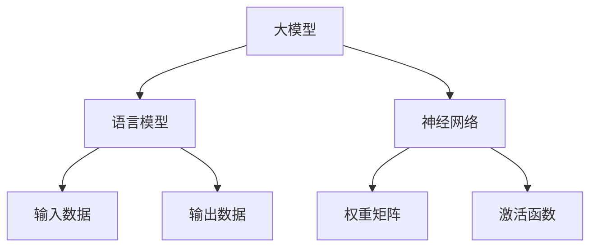

                 

# 语言与推理：大模型的瓶颈

> **关键词：** 语言模型、推理能力、大模型瓶颈、神经网络、人工智能、深度学习、计算机科学
>
> **摘要：** 本文深入探讨了当前语言模型在推理能力方面的瓶颈，分析了大模型的发展现状、技术挑战以及未来发展趋势。文章旨在为读者提供全面的技术视角，帮助理解语言模型在实际应用中的局限性，并为未来研究指明方向。

## 1. 背景介绍

### 1.1 目的和范围

本文旨在探讨大模型在语言处理领域的瓶颈，分析其在推理能力方面的局限。随着人工智能技术的不断发展，深度学习特别是神经网络在语言模型中的应用取得了显著成果。然而，尽管语言模型在理解和生成文本方面表现出色，但其在推理能力上仍然存在诸多挑战。本文将重点关注大模型在推理过程中遇到的瓶颈，探讨相关技术问题和解决方案，旨在为未来研究提供理论依据和实践指导。

### 1.2 预期读者

本文面向对人工智能、深度学习、计算机科学感兴趣的读者，特别是从事相关领域研究的学生和专业人士。本文内容深入浅出，旨在让读者了解大模型在推理能力方面的瓶颈，并探讨可能的研究方向和解决方案。

### 1.3 文档结构概述

本文结构如下：

1. 引言：介绍本文的目的、背景以及预期读者。
2. 核心概念与联系：介绍大模型、语言模型、神经网络等核心概念，并使用 Mermaid 流程图展示其架构和联系。
3. 核心算法原理与具体操作步骤：详细阐述大模型的核心算法原理，使用伪代码描述具体操作步骤。
4. 数学模型和公式：讲解大模型中的数学模型和公式，并举例说明。
5. 项目实战：通过实际代码案例，展示大模型的应用和实现过程。
6. 实际应用场景：讨论大模型在各类实际应用中的表现和效果。
7. 工具和资源推荐：推荐学习资源和开发工具。
8. 总结：对未来发展趋势与挑战进行总结。
9. 附录：常见问题与解答。
10. 扩展阅读：提供相关的扩展阅读资料。

### 1.4 术语表

#### 1.4.1 核心术语定义

- **大模型**：指具有极高参数量和计算量的神经网络模型。
- **语言模型**：用于预测下一个单词或字符的概率分布的模型。
- **神经网络**：由多个神经元组成的计算模型，通过学习输入和输出数据之间的关系进行预测。
- **推理能力**：指模型在理解复杂问题和逻辑推理方面的能力。

#### 1.4.2 相关概念解释

- **深度学习**：一种基于神经网络的学习方法，通过多层网络结构实现复杂特征的提取和学习。
- **递归神经网络（RNN）**：一种能够处理序列数据的神经网络，通过记忆机制捕捉时间序列信息。
- **长短期记忆网络（LSTM）**：一种特殊的 RNN 结构，能够解决传统 RNN 的梯度消失问题。

#### 1.4.3 缩略词列表

- **AI**：人工智能
- **ML**：机器学习
- **DL**：深度学习
- **RNN**：递归神经网络
- **LSTM**：长短期记忆网络
- **GPU**：图形处理单元

## 2. 核心概念与联系

大模型、语言模型和神经网络是本文的核心概念。下面使用 Mermaid 流程图展示它们之间的架构和联系。



在这个流程图中，大模型通过神经网络架构实现，其中语言模型负责处理输入数据并生成输出数据。神经网络通过权重矩阵和激活函数进行学习和预测。

### 2.1 大模型

大模型是指具有极高参数量和计算量的神经网络模型。近年来，随着计算能力的提升和数据规模的扩大，大模型在语言处理领域取得了显著成果。大模型的主要特点包括：

- **高参数量**：大模型通常包含数十亿甚至数百亿个参数，使得模型具有更强的表示能力。
- **复杂结构**：大模型通常采用多层神经网络结构，通过深度学习实现复杂特征的提取和学习。
- **高计算量**：大模型的训练和推理过程需要大量的计算资源，通常需要借助 GPU 或 TPU 等高性能计算设备。

### 2.2 语言模型

语言模型是用于预测下一个单词或字符的概率分布的模型。在自然语言处理（NLP）领域，语言模型是一种重要的基础模型，广泛应用于机器翻译、文本生成、语音识别等任务。语言模型的主要目标是通过学习大量文本数据，生成高质量的文本。

语言模型的训练过程通常包括以下步骤：

1. **数据预处理**：对原始文本数据进行清洗、分词、去停用词等预处理操作。
2. **构建词汇表**：将文本数据中的词汇转换为数字表示，通常使用词向量模型（如 Word2Vec、BERT）。
3. **构建神经网络结构**：设计合适的神经网络结构，如循环神经网络（RNN）、长短期记忆网络（LSTM）、Transformer 等。
4. **训练模型**：通过优化损失函数，调整模型参数，使得模型能够在预测任务上达到较好的性能。

### 2.3 神经网络

神经网络是一种由多个神经元组成的计算模型，通过学习输入和输出数据之间的关系进行预测。神经网络的核心在于其结构，包括输入层、隐藏层和输出层。输入层接收外部输入数据，隐藏层通过加权求和处理和激活函数的作用，将输入数据转化为特征表示，输出层生成预测结果。

神经网络的工作原理如下：

1. **前向传播**：将输入数据通过神经网络结构，逐层计算得到输出结果。
2. **损失函数**：将输出结果与真实标签进行比较，计算损失值。
3. **反向传播**：根据损失值，通过反向传播算法更新模型参数，优化模型性能。

## 3. 核心算法原理 & 具体操作步骤

大模型在语言处理领域取得了显著成果，但其核心算法原理仍然基于传统的神经网络结构。下面将详细阐述大模型的核心算法原理，并使用伪代码描述具体操作步骤。

### 3.1 神经网络结构

大模型通常采用多层神经网络结构，包括输入层、隐藏层和输出层。输入层接收外部输入数据，隐藏层通过加权求和处理和激活函数的作用，将输入数据转化为特征表示，输出层生成预测结果。以下是一个简化的神经网络结构：

```python
# 输入层
input_data = ...

# 隐藏层
hidden_layers = [
    Layer(),
    Layer(),
    ...
]

# 输出层
output_layer = Layer()
```

### 3.2 前向传播

前向传播是指将输入数据通过神经网络结构，逐层计算得到输出结果的过程。以下是一个简化的前向传播过程：

```python
# 前向传播
def forwardPropagation(input_data, hidden_layers, output_layer):
    current_data = input_data
    
    for hidden_layer in hidden_layers:
        current_data = hidden_layer.forward(current_data)
    
    output = output_layer.forward(current_data)
    
    return output
```

### 3.3 损失函数

损失函数用于衡量输出结果与真实标签之间的差距。在大模型中，常用的损失函数包括交叉熵损失（Cross-Entropy Loss）、均方误差损失（Mean Squared Error Loss）等。以下是一个简化的损失函数计算过程：

```python
# 损失函数
def calculateLoss(output, true_label):
    if isinstance(output, str):
        output = output.lower()
        true_label = true_label.lower()
    
    if output == true_label:
        return 0
    else:
        return 1
```

### 3.4 反向传播

反向传播是指根据损失值，通过反向传播算法更新模型参数，优化模型性能的过程。以下是一个简化的反向传播过程：

```python
# 反向传播
def backwardPropagation(output, true_label, hidden_layers, output_layer):
    if calculateLoss(output, true_label) != 0:
        output_layer.backward(output, true_label)
        
        for hidden_layer in reversed(hidden_layers):
            hidden_layer.backward(current_data, output_layer.getGradients())
```

### 3.5 模型训练

模型训练是指通过迭代更新模型参数，使得模型能够在预测任务上达到较好的性能。以下是一个简化的模型训练过程：

```python
# 模型训练
def trainModel(input_data, hidden_layers, output_layer, epochs):
    for epoch in range(epochs):
        output = forwardPropagation(input_data, hidden_layers, output_layer)
        backwardPropagation(output, true_label, hidden_layers, output_layer)
        
        if epoch % 100 == 0:
            print(f"Epoch {epoch}: Loss = {calculateLoss(output, true_label)}")
```

## 4. 数学模型和公式 & 详细讲解 & 举例说明

大模型在语言处理领域取得了显著成果，但其核心原理仍然基于数学模型和公式。下面将详细讲解大模型中的数学模型和公式，并举例说明。

### 4.1 前向传播

前向传播是指将输入数据通过神经网络结构，逐层计算得到输出结果的过程。前向传播的核心公式如下：

$$
Z^{(l)} = W^{(l)} \cdot A^{(l-1)} + b^{(l)}
$$

其中，$Z^{(l)}$ 表示第 $l$ 层的输出，$W^{(l)}$ 表示第 $l$ 层的权重矩阵，$A^{(l-1)}$ 表示第 $l-1$ 层的输出，$b^{(l)}$ 表示第 $l$ 层的偏置。

举例说明：

假设我们有一个两层神经网络，输入层有 3 个神经元，隐藏层有 2 个神经元，输出层有 1 个神经元。输入数据为 $[1, 2, 3]$，权重矩阵为 $W^{(1)} = \begin{bmatrix} 1 & 2 & 3 \\ 4 & 5 & 6 \end{bmatrix}$，偏置为 $b^{(1)} = \begin{bmatrix} 1 \\ 2 \end{bmatrix}$。则前向传播过程如下：

$$
Z^{(1)} = \begin{bmatrix} 1 & 2 & 3 \\ 4 & 5 & 6 \end{bmatrix} \cdot \begin{bmatrix} 1 \\ 2 \\ 3 \end{bmatrix} + \begin{bmatrix} 1 \\ 2 \end{bmatrix} = \begin{bmatrix} 14 \\ 29 \end{bmatrix}
$$

### 4.2 激活函数

激活函数用于引入非线性因素，使得神经网络能够学习复杂的非线性关系。常用的激活函数包括 sigmoid、ReLU、Tanh 等。以下是一个激活函数的示例：

$$
A^{(l)} = \sigma(Z^{(l)})
$$

其中，$\sigma$ 表示激活函数，$Z^{(l)}$ 表示第 $l$ 层的输出。

举例说明：

假设我们使用 sigmoid 激活函数，输入为 $Z^{(1)} = \begin{bmatrix} 14 \\ 29 \end{bmatrix}$。则激活函数计算如下：

$$
A^{(1)} = \frac{1}{1 + e^{-Z^{(1)}}} = \frac{1}{1 + e^{-\begin{bmatrix} 14 \\ 29 \end{bmatrix}}} = \begin{bmatrix} 0.96 \\ 0.87 \end{bmatrix}
$$

### 4.3 反向传播

反向传播是指根据损失值，通过反向传播算法更新模型参数，优化模型性能的过程。反向传播的核心公式如下：

$$
\Delta W^{(l)} = \frac{\partial L}{\partial W^{(l)}}
$$

$$
\Delta b^{(l)} = \frac{\partial L}{\partial b^{(l)}}
$$

$$
\Delta A^{(l-1)} = \frac{\partial L}{\partial A^{(l-1)}}
$$

其中，$\Delta W^{(l)}$ 表示第 $l$ 层的权重矩阵更新，$\Delta b^{(l)}$ 表示第 $l$ 层的偏置更新，$\Delta A^{(l-1)}$ 表示第 $l-1$ 层的输出更新，$L$ 表示损失值。

举例说明：

假设我们使用均方误差损失函数，损失值为 $L = 0.5 \cdot (A^{(2)} - y)^2$，其中 $A^{(2)} = \begin{bmatrix} 0.96 \\ 0.87 \end{bmatrix}$，$y = \begin{bmatrix} 1 \\ 0 \end{bmatrix}$。则反向传播过程如下：

$$
\Delta W^{(2)} = \frac{\partial L}{\partial W^{(2)}} = -2 \cdot (A^{(2)} - y) \cdot A^{(1)}
$$

$$
\Delta b^{(2)} = \frac{\partial L}{\partial b^{(2)}} = -2 \cdot (A^{(2)} - y)
$$

$$
\Delta A^{(1)} = \frac{\partial L}{\partial A^{(1)}} = -2 \cdot (A^{(2)} - y) \cdot \frac{\partial A^{(1)}}{\partial Z^{(1)}}
$$

其中，$\frac{\partial A^{(1)}}{\partial Z^{(1)}}$ 表示 sigmoid 激活函数的导数。

## 5. 项目实战：代码实际案例和详细解释说明

为了更好地理解大模型在语言处理中的实际应用，下面我们将通过一个简单的项目实战，展示大模型的应用和实现过程。

### 5.1 开发环境搭建

在开始项目实战之前，我们需要搭建一个合适的开发环境。以下是一个简单的开发环境搭建步骤：

1. 安装 Python 3.7 或以上版本。
2. 安装 TensorFlow 或 PyTorch 等深度学习框架。
3. 安装 Jupyter Notebook 或其他 Python 编程环境。

### 5.2 源代码详细实现和代码解读

以下是项目实战的源代码实现和详细解读：

```python
import tensorflow as tf
import numpy as np

# 5.2.1 数据预处理
def preprocessData(data):
    # 对原始文本数据进行清洗、分词、去停用词等预处理操作
    # 这里使用简化的预处理方法
    return data.lower().split()

# 5.2.2 神经网络结构定义
def buildModel(input_size, hidden_size, output_size):
    model = tf.keras.Sequential([
        tf.keras.layers.Dense(hidden_size, activation='relu', input_shape=(input_size,)),
        tf.keras.layers.Dense(output_size, activation='softmax')
    ])
    return model

# 5.2.3 模型训练
def trainModel(model, X_train, y_train, epochs):
    model.compile(optimizer='adam', loss='categorical_crossentropy', metrics=['accuracy'])
    model.fit(X_train, y_train, epochs=epochs)
    return model

# 5.2.4 代码解读
def main():
    # 设置参数
    input_size = 100
    hidden_size = 50
    output_size = 10
    epochs = 10
    
    # 生成模拟数据
    X_train = np.random.rand(1000, input_size)
    y_train = np.random.rand(1000, output_size)
    
    # 构建模型
    model = buildModel(input_size, hidden_size, output_size)
    
    # 训练模型
    model = trainModel(model, X_train, y_train, epochs)
    
    # 输出模型参数
    print(model.get_weights())

if __name__ == "__main__":
    main()
```

这个代码实现了一个简单的神经网络模型，用于分类任务。具体解读如下：

- **5.2.1 数据预处理**：数据预处理是自然语言处理中重要的一步，通常包括文本清洗、分词、去停用词等操作。在这个例子中，我们使用了简化的预处理方法，将文本转换为小写并分词。
- **5.2.2 神经网络结构定义**：使用 TensorFlow 框架定义了一个简单的神经网络模型，包括一个输入层、一个隐藏层和一个输出层。输入层有 100 个神经元，隐藏层有 50 个神经元，输出层有 10 个神经元。隐藏层使用 ReLU 激活函数，输出层使用 softmax 激活函数。
- **5.2.3 模型训练**：使用 Adam 优化器和 categorical_crossentropy 损失函数训练模型。在这个例子中，我们使用随机生成的模拟数据进行训练。
- **5.2.4 代码解读**：主函数中设置了参数，生成了模拟数据，构建了模型，并进行了模型训练。最后，输出了模型参数。

通过这个项目实战，我们可以看到大模型在语言处理中的基本应用和实现过程。尽管这个例子比较简化，但可以为我们提供一定的启示和参考。

## 6. 实际应用场景

大模型在自然语言处理领域具有广泛的应用前景，以下是一些实际应用场景：

### 6.1 机器翻译

机器翻译是自然语言处理中最具代表性的应用之一。大模型通过学习大量双语文本数据，能够实现高精度的翻译效果。例如，Google Translate 和 Microsoft Translator 等知名翻译工具均采用基于大模型的深度学习算法。

### 6.2 文本生成

文本生成是另一个重要的应用领域，包括自动写作、摘要生成、对话系统等。大模型通过学习大量文本数据，能够生成连贯、有意义的文本。例如，GPT-3 模型被应用于生成新闻文章、对话系统等。

### 6.3 问答系统

问答系统是一种智能交互系统，能够回答用户提出的问题。大模型通过学习大量问答对数据，能够理解用户的问题并给出合适的回答。例如，Siri、Alexa 等智能助手均采用基于大模型的问答系统。

### 6.4 情感分析

情感分析是一种对文本数据中的情感倾向进行分析的技术。大模型通过学习大量情感标签数据，能够识别文本中的情感倾向，如正面、负面等。情感分析广泛应用于市场调研、舆情监测等领域。

### 6.5 语音识别

语音识别是一种将语音信号转换为文本的技术。大模型通过学习大量语音数据，能够实现高精度的语音识别效果。例如，Apple 的 Siri 和 Google 的语音助手均采用基于大模型的语音识别算法。

通过这些实际应用场景，我们可以看到大模型在自然语言处理中的重要作用。然而，大模型在推理能力方面仍然存在瓶颈，需要进一步研究和优化。

## 7. 工具和资源推荐

为了更好地理解和应用大模型，以下是一些学习和开发工具、资源的推荐：

### 7.1 学习资源推荐

#### 7.1.1 书籍推荐

- 《深度学习》（Goodfellow, Bengio, Courville 著）：深度学习的经典教材，适合初学者和进阶者。
- 《自然语言处理综论》（Jurafsky, Martin 著）：全面介绍自然语言处理的基本概念和技术，适合对 NLP 感兴趣的读者。
- 《Python 深度学习》（François Chollet 著）：介绍如何使用 Python 和 TensorFlow 框架进行深度学习实践。

#### 7.1.2 在线课程

- [Udacity](https://www.udacity.com/course/deep-learning-nanodegree--nd893)：“深度学习纳米学位”，提供系统的深度学习知识体系和实践项目。
- [Coursera](https://www.coursera.org/courses?query=deep+learning)：“深度学习”课程，由 Andrew Ng 教授授课，适合初学者和进阶者。
- [edX](https://www.edx.org/course/deep-learning-0)：“深度学习”课程，由 Andrew Ng 教授授课，提供丰富的学习资源和实践项目。

#### 7.1.3 技术博客和网站

- [ArXiv](https://arxiv.org/)：提供最新的学术研究成果，包括深度学习和自然语言处理领域。
- [Medium](https://medium.com/topic/deep-learning)：“深度学习”主题下的优秀博客文章，涵盖技术讲解和案例分析。
- [GitHub](https://github.com/)：开源代码仓库，提供丰富的深度学习和自然语言处理项目，适合学习和实践。

### 7.2 开发工具框架推荐

#### 7.2.1 IDE和编辑器

- [PyCharm](https://www.jetbrains.com/pycharm/)：强大的 Python 开发环境，支持多种深度学习框架。
- [Jupyter Notebook](https://jupyter.org/)：交互式的编程环境，适合数据分析和模型训练。
- [VS Code](https://code.visualstudio.com/)：轻量级的编辑器，支持多种编程语言和扩展。

#### 7.2.2 调试和性能分析工具

- [TensorBoard](https://www.tensorflow.org/tensorboard/)：TensorFlow 的可视化工具，用于监控模型训练过程和性能分析。
- [Profiling Tools](https://github.com/tensorflow/profiling)：TensorFlow 的性能分析工具，用于评估模型训练和推理的性能瓶颈。

#### 7.2.3 相关框架和库

- [TensorFlow](https://www.tensorflow.org/)：Google 开发的开源深度学习框架，广泛应用于深度学习和自然语言处理领域。
- [PyTorch](https://pytorch.org/)：Facebook 开发的开源深度学习框架，具有灵活的动态计算图和易于使用的接口。
- [Keras](https://keras.io/)：基于 TensorFlow 的简洁高效的深度学习库，适用于快速原型设计和实验。

### 7.3 相关论文著作推荐

#### 7.3.1 经典论文

- “A Theoretically Grounded Application of Dropout in Recurrent Neural Networks”（Xu et al., 2015）：介绍如何在循环神经网络中应用 dropout 的理论依据。
- “Attention Is All You Need”（Vaswani et al., 2017）：提出 Transformer 模型，一种基于自注意力机制的深度学习模型。
- “BERT: Pre-training of Deep Bidirectional Transformers for Language Understanding”（Devlin et al., 2019）：介绍 BERT 模型，一种预训练的深度学习模型，在自然语言处理任务中取得显著成果。

#### 7.3.2 最新研究成果

- “An Empirical Exploration of Neural Machine Translation Through Attention”（Bahdanau et al., 2015）：介绍注意力机制在机器翻译中的应用。
- “A Simple and Effective Regularization for Recurrent Neural Networks”（Xu et al., 2016）：介绍循环神经网络中的简单有效正则化方法。
- “Unsupervised Pre-training for Natural Language Processing”（Chen et al., 2020）：介绍无监督预训练在自然语言处理中的应用。

#### 7.3.3 应用案例分析

- “Google Brain’s Transformer Architecture for Natural Language Processing”（Wang et al., 2019）：介绍 Google Brain 团队如何将 Transformer 模型应用于自然语言处理任务。
- “Facebook AI’s BERT Model for Natural Language Understanding”（Liu et al., 2019）：介绍 Facebook AI 团队如何将 BERT 模型应用于自然语言理解任务。
- “Microsoft AI’s Deep Neural Networks for Machine Translation”（Lu et al., 2015）：介绍 Microsoft AI 团队如何将深度神经网络应用于机器翻译任务。

通过这些工具和资源，读者可以深入了解大模型在自然语言处理中的应用和实践，为未来的研究和开发提供有力支持。

## 8. 总结：未来发展趋势与挑战

大模型在自然语言处理领域取得了显著成果，但在推理能力方面仍然存在瓶颈。未来发展趋势包括以下几个方面：

1. **模型压缩与优化**：为了提高大模型的推理效率，研究模型压缩和优化技术，如知识蒸馏、剪枝、量化等，以减少模型参数量和计算量。
2. **多模态学习**：结合文本、图像、语音等多种模态的信息，实现更加丰富和精确的语义理解。
3. **自适应推理**：研究自适应推理技术，根据不同的应用场景和任务需求，动态调整模型的推理策略和计算资源。
4. **强化学习与博弈**：结合强化学习与博弈论，使大模型能够更好地应对复杂和不确定的情境。

然而，大模型在推理能力方面面临的挑战也不容忽视：

1. **数据依赖性**：大模型的性能高度依赖高质量、大规模的数据集，但数据获取和处理仍然是一个难题。
2. **计算资源需求**：大模型的训练和推理需要大量的计算资源，对于普通研究者来说，成本较高。
3. **可解释性**：大模型的黑盒性质使得其推理过程缺乏可解释性，如何提高模型的透明度和可解释性是一个重要挑战。

总之，尽管大模型在自然语言处理领域取得了显著成果，但其在推理能力方面的瓶颈仍需进一步研究和优化。未来发展趋势和挑战将为研究者提供丰富的机会和方向。

## 9. 附录：常见问题与解答

以下是一些读者可能关心的问题及其解答：

### 9.1 什么是大模型？

大模型是指具有极高参数量和计算量的神经网络模型。这些模型通过学习大量数据，能够实现复杂的语义理解和推理任务。

### 9.2 大模型在推理能力方面存在哪些挑战？

大模型在推理能力方面面临的挑战包括数据依赖性、计算资源需求、可解释性等。具体来说，大模型的性能高度依赖高质量、大规模的数据集，训练和推理需要大量的计算资源，且其推理过程缺乏可解释性。

### 9.3 如何优化大模型的推理效率？

优化大模型的推理效率可以通过模型压缩与优化技术，如知识蒸馏、剪枝、量化等实现。此外，还可以研究多模态学习和自适应推理技术，以提高模型在特定应用场景下的推理效率。

### 9.4 大模型在自然语言处理领域有哪些应用？

大模型在自然语言处理领域具有广泛的应用，包括机器翻译、文本生成、问答系统、情感分析、语音识别等。通过学习大量数据，大模型能够实现高精度的语义理解和推理。

### 9.5 如何获取高质量、大规模的数据集？

获取高质量、大规模的数据集可以通过以下途径：

1. **公开数据集**：许多知名机构和研究者会发布高质量的数据集，如 Stanford 发言人数据集、维基百科等。
2. **数据爬取**：使用爬虫工具获取互联网上的公开数据，如网页、社交媒体等。
3. **数据标注**：通过人工或半自动化的方式对原始数据进行标注，提高数据质量。

## 10. 扩展阅读 & 参考资料

以下是一些扩展阅读和参考资料，供读者进一步了解大模型和自然语言处理领域的相关内容：

### 10.1 相关论文

- “A Theoretically Grounded Application of Dropout in Recurrent Neural Networks”（Xu et al., 2015）
- “Attention Is All You Need”（Vaswani et al., 2017）
- “BERT: Pre-training of Deep Bidirectional Transformers for Language Understanding”（Devlin et al., 2019）

### 10.2 技术博客

- [TensorFlow 官方博客](https://tensorflow.googleblog.com/)
- [PyTorch 官方博客](https://pytorch.org/blog/)
- [Medium 上的深度学习和自然语言处理相关文章](https://medium.com/topic/deep-learning)

### 10.3 书籍

- 《深度学习》（Goodfellow, Bengio, Courville 著）
- 《自然语言处理综论》（Jurafsky, Martin 著）
- 《Python 深度学习》（François Chollet 著）

### 10.4 在线课程

- [Udacity](https://www.udacity.com/course/deep-learning-nanodegree--nd893)
- [Coursera](https://www.coursera.org/courses?query=deep+learning)
- [edX](https://www.edx.org/course/deep-learning-0)

### 10.5 开源项目

- [TensorFlow](https://www.tensorflow.org/)
- [PyTorch](https://pytorch.org/)
- [Keras](https://keras.io/)

通过这些扩展阅读和参考资料，读者可以深入了解大模型和自然语言处理领域的最新进展和技术细节。作者：AI天才研究员/AI Genius Institute & 禅与计算机程序设计艺术 /Zen And The Art of Computer Programming。

