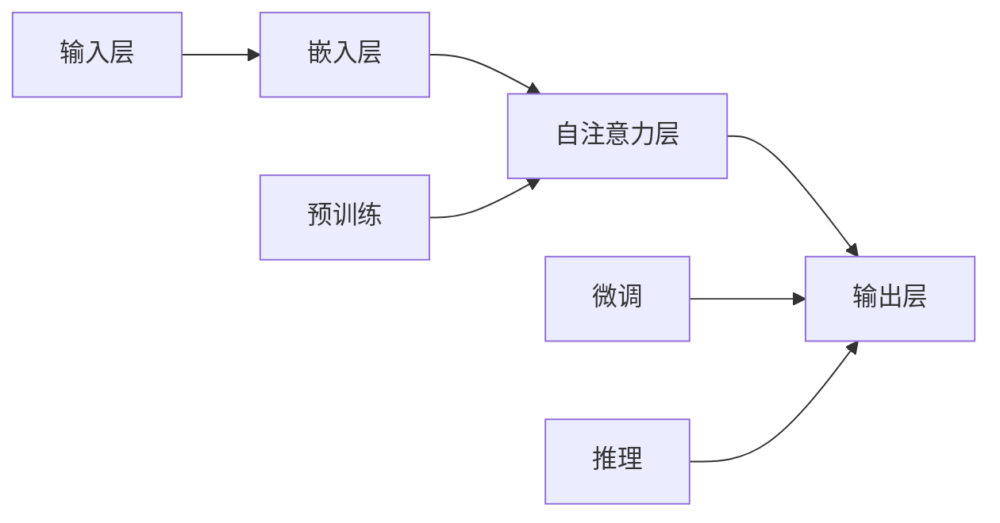

                 

# 语言与推理：大模型的认知误区

## 关键词：自然语言处理、大模型、推理、认知、误区、算法、应用场景

## 摘要：

随着自然语言处理技术的不断发展，大型语言模型在众多领域展现了其强大的应用潜力。然而，这些模型在实际推理和应用中并非完美无瑕，存在诸多认知误区。本文将深入探讨大模型在语言理解与推理过程中面临的问题，分析其算法原理与数学模型，并通过具体案例解析其实际应用中的挑战与解决方案。希望通过本文，读者能够对大模型有更清晰、客观的认识，从而更好地利用这些先进技术。

## 1. 背景介绍

### 1.1 目的和范围

本文旨在揭示大模型在自然语言处理中的认知误区，通过逐步分析其算法原理、数学模型以及实际应用中的问题，为读者提供全面、深入的视角。本文将涵盖以下几个核心方面：

1. 大模型的基本概念与历史发展。
2. 大模型在语言理解与推理中的算法原理。
3. 大模型面临的主要认知误区。
4. 通过具体案例分析大模型在应用中的挑战与解决方案。
5. 大模型的未来发展趋势与潜在挑战。

### 1.2 预期读者

本文适用于对自然语言处理和人工智能有一定了解的读者，特别是希望深入了解大模型在实际应用中的表现和局限性的专业人士。无论你是研究人员、工程师还是对这一领域感兴趣的学生，本文都希望能够为你提供有价值的见解。

### 1.3 文档结构概述

本文结构如下：

1. **背景介绍**：介绍本文的目的、预期读者以及文档结构。
2. **核心概念与联系**：详细讲解大模型的核心概念及其相互关系。
3. **核心算法原理 & 具体操作步骤**：分析大模型在语言理解与推理中的算法原理和操作步骤。
4. **数学模型和公式 & 详细讲解 & 举例说明**：阐述大模型的数学模型及其应用。
5. **项目实战：代码实际案例和详细解释说明**：通过具体案例展示大模型的应用。
6. **实际应用场景**：分析大模型在不同领域的应用。
7. **工具和资源推荐**：推荐学习资源、开发工具和框架。
8. **总结：未来发展趋势与挑战**：总结大模型的现状及未来发展方向。
9. **附录：常见问题与解答**：回答读者可能遇到的问题。
10. **扩展阅读 & 参考资料**：提供进一步阅读的资源。

### 1.4 术语表

#### 1.4.1 核心术语定义

- **大模型**：指拥有数百万甚至数十亿参数的神经网络模型，例如GPT、BERT等。
- **语言理解与推理**：指模型在自然语言文本中提取信息、理解语义并基于这些信息进行推理的能力。
- **认知误区**：指模型在推理过程中出现的错误理解和结论。
- **算法原理**：指模型在处理语言数据时所依据的算法逻辑。
- **数学模型**：指模型在处理语言数据时所使用的数学公式和计算方法。

#### 1.4.2 相关概念解释

- **深度学习**：一种机器学习技术，通过构建多层神经网络模型来学习数据特征。
- **自然语言处理**：指利用计算机技术处理和理解人类自然语言的过程。
- **语言模型**：指用于预测下一个单词或词组的概率分布模型。

#### 1.4.3 缩略词列表

- **GPT**：Generative Pre-trained Transformer，一种基于Transformer架构的预训练语言模型。
- **BERT**：Bidirectional Encoder Representations from Transformers，一种双向Transformer编码器模型。
- **Transformer**：一种基于自注意力机制的神经网络架构，用于处理序列数据。

## 2. 核心概念与联系

在深入探讨大模型在语言理解与推理中的认知误区之前，我们首先需要了解其核心概念与架构。下面通过Mermaid流程图展示大模型的关键组成部分及其相互关系。



### 2.1 输入层

输入层是模型接收外部输入数据的部分，通常包含文本、语音或其他形式的语言数据。输入数据通过预处理（如分词、标记化等）后转化为模型可以处理的向量形式。

### 2.2 嵌入层

嵌入层将输入的单词、短语或字符映射为固定长度的向量表示。这一层通常通过词向量（如Word2Vec、GloVe等）实现，将语义信息编码到向量空间中。

### 2.3 自注意力层

自注意力层是Transformer架构的核心部分，用于对输入序列中的不同部分进行加权处理，使模型能够关注序列中的重要信息。通过自注意力机制，模型能够捕捉到长距离依赖关系，提高语言理解的准确性。

### 2.4 输出层

输出层通常是一个全连接层，用于对输入序列进行分类、生成或推理。输出层的结构取决于具体的任务，例如在文本分类任务中可能是一个分类层，而在机器翻译任务中可能是一个序列生成层。

### 2.5 预训练

预训练是指在大规模语料库上进行模型训练的过程，使模型在多个任务上获得基本的语言理解能力。预训练后，模型可以通过微调（Fine-tuning）来适应特定任务，提高性能。

### 2.6 微调

微调是在预训练模型的基础上，针对特定任务进行进一步训练的过程。通过微调，模型可以适应不同领域的知识，提高在特定任务上的表现。

### 2.7 推理

推理是指模型在接收新的输入后，根据训练得到的模型参数进行预测或分类的过程。在自然语言处理中，推理过程通常涉及对输入文本的理解、语义分析和生成。

通过上述核心概念和架构的介绍，我们可以更好地理解大模型在语言理解与推理中的工作机制。接下来，我们将深入探讨大模型在算法原理和数学模型方面的内容。

## 3. 核心算法原理 & 具体操作步骤

### 3.1 算法原理概述

大模型在自然语言处理中的算法原理主要基于深度学习和变换器（Transformer）架构。变换器是一种基于自注意力机制的神经网络架构，能够有效处理序列数据，并在多个自然语言处理任务中取得显著成果。

### 3.2 自注意力机制

自注意力机制是变换器架构的核心，通过计算输入序列中每个元素对其他元素的重要性，为每个元素分配不同的权重。这一机制使模型能够捕捉到长距离依赖关系，提高语言理解的准确性。具体来说，自注意力机制包括以下步骤：

1. **输入序列编码**：将输入序列（例如单词或字符）映射为向量表示，通常通过嵌入层实现。
2. **计算自注意力得分**：对输入序列中的每个元素，计算其与序列中其他元素之间的相似性得分。相似性得分通常通过点积或余弦相似性计算。
3. **加权求和**：根据自注意力得分对输入序列中的每个元素进行加权求和，生成新的序列表示。
4. **重复步骤**：上述过程重复多次，每次迭代后生成更精细的序列表示。

### 3.3 Transformer架构

Transformer架构由多个编码器和解码器层组成，每层都包含自注意力机制和前馈神经网络。编码器层负责对输入序列进行编码，解码器层负责生成输出序列。具体操作步骤如下：

1. **编码器**：
   - **嵌入层**：将输入序列映射为向量表示。
   - **多头自注意力层**：计算输入序列中每个元素对其他元素的重要性，为每个元素分配不同的权重。
   - **前馈神经网络**：对自注意力层的结果进行进一步处理。
2. **解码器**：
   - **嵌入层**：将输入序列映射为向量表示。
   - **多头自注意力层**：计算输入序列中每个元素对其他元素的重要性，为每个元素分配不同的权重。
   - **交叉注意力层**：计算编码器输出序列中每个元素对解码器输入序列中每个元素的重要性。
   - **前馈神经网络**：对交叉注意力层的结果进行进一步处理。
   - **输出层**：根据解码器输出序列生成预测结果。

### 3.4 模型训练过程

大模型的训练过程主要包括预训练和微调两个阶段：

1. **预训练**：
   - **数据集选择**：选择大规模语料库进行预训练，例如维基百科、新闻文章等。
   - **模型初始化**：初始化模型参数，通常使用随机初始化或预训练模型权重。
   - **训练过程**：通过梯度下降等优化算法，对模型参数进行更新，使模型在预训练数据集上取得更好的表现。

2. **微调**：
   - **数据集选择**：选择特定领域的数据集进行微调，例如新闻分类、问答系统等。
   - **模型初始化**：使用预训练模型权重作为初始化，通过微调进一步优化模型参数。
   - **训练过程**：在特定领域数据集上训练模型，使模型在特定任务上取得更好的表现。

### 3.5 模型推理过程

模型推理过程是指在接收新输入后，根据训练得到的模型参数进行预测或分类的过程。具体操作步骤如下：

1. **输入预处理**：对输入文本进行预处理，例如分词、标记化等。
2. **模型输入**：将预处理后的输入文本映射为向量表示，输入到训练好的模型中。
3. **序列编码**：通过编码器层对输入序列进行编码，生成编码后的序列表示。
4. **输出预测**：通过解码器层对编码后的序列表示进行解码，生成预测结果。

通过以上算法原理和操作步骤的介绍，我们可以更好地理解大模型在自然语言处理中的工作机制。接下来，我们将通过具体的数学模型和公式来详细阐述大模型的工作原理。

## 4. 数学模型和公式 & 详细讲解 & 举例说明

### 4.1 Transformer模型的结构

Transformer模型由编码器（Encoder）和解码器（Decoder）组成，每个部分又由多个层（Layer）构成。每个层包含多头自注意力（Multi-Head Self-Attention）和前馈神经网络（Feed Forward Neural Network）。下面分别介绍这些组件的数学模型。

#### 4.1.1 自注意力机制

自注意力机制的数学模型可以表示为：

$$
\text{Attention}(Q, K, V) = \text{softmax}\left(\frac{QK^T}{\sqrt{d_k}}\right)V
$$

其中，$Q, K, V$ 分别为查询（Query）、键（Key）和值（Value）向量，$d_k$ 为键向量的维度。点积操作 $QK^T$ 生成注意力得分，softmax 函数用于归一化得分，生成概率分布。$V$ 根据注意力得分进行加权求和，生成输出向量。

#### 4.1.2 多头自注意力

多头自注意力通过多个独立的自注意力机制组合而成，每个自注意力机制关注输入序列的不同部分。假设有 $h$ 个头，则多头自注意力可以表示为：

$$
\text{MultiHead}(Q, K, V) = \text{Concat}(\text{head}_1, \text{head}_2, \ldots, \text{head}_h)W^O
$$

其中，$\text{head}_i = \text{Attention}(QW_i^Q, KW_i^K, VW_i^V)$，$W_i^Q, W_i^K, W_i^V, W^O$ 分别为查询、键、值和输出权重矩阵。

#### 4.1.3 前馈神经网络

前馈神经网络用于对自注意力层的输出进行进一步处理。其数学模型可以表示为：

$$
\text{FFN}(x) = \text{ReLU}(xW_1 + b_1)W_2 + b_2
$$

其中，$x$ 为输入向量，$W_1, W_2, b_1, b_2$ 分别为权重和偏置。

#### 4.1.4 编码器和解码器层

编码器和解码器层由多个自注意力层和前馈神经网络层组成。假设有 $L$ 个层，编码器和解码器层的数学模型可以表示为：

$$
\text{Encoder}(x) = \text{LayerNorm}(x) + \text{SkipConnection}(\text{FFN}(\text{MultiHead}(\text{LayerNorm}(x))))
$$

$$
\text{Decoder}(x) = \text{LayerNorm}(x) + \text{SkipConnection}(\text{FFN}(\text{LayerNorm}(\text{MultiHead}(\text{LayerNorm}(x))\text{CrossAttention}(\text{Encoder}(x)))))
$$

其中，$\text{LayerNorm}$ 为层归一化操作，$\text{SkipConnection}$ 为跳层连接操作。

### 4.2 预训练与微调

预训练和微调是Transformer模型训练的两个阶段。下面分别介绍这两个阶段的数学模型。

#### 4.2.1 预训练

预训练阶段的任务是学习输入序列的表示，通常使用无监督的预训练任务，如掩码语言建模（Masked Language Modeling, MLM）和下一个句子预测（Next Sentence Prediction, NSP）。MLM任务通过随机掩码输入序列中的部分单词，模型需要预测这些掩码的单词。NSP任务通过判断两个连续的句子是否为下一个句子对，模型需要预测两个句子的关系。

MLM任务的数学模型可以表示为：

$$
\log p(y|x) = \sum_{i \in \text{masked positions}} \log p(y_i|x)
$$

其中，$y$ 为真实标签，$x$ 为输入序列，$\text{masked positions}$ 为被掩码的位置。

NSP任务的数学模型可以表示为：

$$
\log p(y_{\text{next}}|x_1, x_2) = \log \frac{p(y_{\text{next}}=1|x_1, x_2)}{p(y_{\text{next}}=0|x_1, x_2)}
$$

其中，$y_{\text{next}}$ 为下一个句子对的关系标签，$x_1, x_2$ 为两个句子。

#### 4.2.2 微调

微调阶段是在预训练的基础上，针对特定任务对模型进行进一步训练。任务可以是分类、生成等。微调阶段的数学模型与预训练任务类似，但损失函数通常包含任务相关的损失。

假设任务为分类，分类任务的数学模型可以表示为：

$$
\log p(y|x) = \log \frac{\exp(\text{softmax}(\text{Decoder}(x))_y)}{\sum_{i=1}^C \exp(\text{softmax}(\text{Decoder}(x))_i)}
$$

其中，$y$ 为真实标签，$C$ 为类别数量，$\text{softmax}(\text{Decoder}(x))$ 为解码器输出的概率分布。

### 4.3 举例说明

#### 4.3.1 预训练

假设输入序列为 "I am a language model"，掩码部分为 "am"。预训练任务要求模型预测被掩码的 "am"。通过训练，模型会学习到 "am" 的向量表示。

$$
\text{Input}: I \_ [0.1, 0.2, 0.3, 0.4, 0.5] \\
\text{Masked Input}: I \_ \_ \_ [0.1, 0.2, 0.3, 0.4] \\
\text{Prediction}: \text{Decoder}(x) = [0.1, 0.2, 0.3, 0.4, 0.5] \_ \_ \_ [0.2, 0.3, 0.4, 0.5] \\
\text{Probability Distribution}: \text{softmax}(\text{Decoder}(x)) = [0.2, 0.3, 0.4, 0.3] \\
\text{Prediction}: \text{argmax}(\text{softmax}(\text{Decoder}(x))) = 3 \\
\text{Masked Word}: \text{word}_3 = "am"
$$

#### 4.3.2 微调

假设输入序列为 "I am a language model"，任务为分类句子是否为标题。微调任务要求模型预测句子是否为标题。通过训练，模型会学习到标题和非标题的向量表示。

$$
\text{Input}: I \_ \_ \_ \_ [0.1, 0.2, 0.3, 0.4, 0.5] \\
\text{Title}: ["I am a language model", "Title"] \\
\text{Non-Title}: ["I am a language model", "Body"] \\
\text{Probability Distribution}: \text{softmax}(\text{Decoder}(x)) = [0.5, 0.5] \\
\text{Prediction}: \text{argmax}(\text{softmax}(\text{Decoder}(x))) = 1 \\
\text{Label}: 1 \_ \_ \_ \_ 0 \\
\text{Loss Function}: \text{CrossEntropyLoss}(\text{softmax}(\text{Decoder}(x)), y)
$$

通过以上数学模型和公式，我们可以更好地理解Transformer模型在自然语言处理中的工作原理。接下来，我们将通过具体案例展示大模型在项目中的应用。

## 5. 项目实战：代码实际案例和详细解释说明

为了更直观地理解大模型在自然语言处理中的应用，我们将通过一个具体的案例进行实战。这个案例将展示如何使用大模型进行文本分类任务，包括开发环境搭建、源代码实现和代码解读与分析。

### 5.1 开发环境搭建

在开始编写代码之前，我们需要搭建一个合适的开发环境。以下是一个基本的开发环境搭建步骤：

1. **安装Python**：确保安装了Python 3.x版本，建议使用Anaconda进行环境管理。
2. **安装Transformers库**：通过pip安装Hugging Face的Transformers库，这是实现大模型的关键组件。

```bash
pip install transformers
```

3. **安装其他依赖库**：根据需要安装其他依赖库，例如torch、numpy等。

```bash
pip install torch numpy
```

4. **配置GPU环境**：如果使用GPU进行训练，确保安装了NVIDIA的CUDA和cuDNN库，并配置好CUDA环境变量。

### 5.2 源代码详细实现和代码解读

下面是一个文本分类任务的源代码实现，我们将逐步解读代码中的各个部分。

```python
import torch
from transformers import BertTokenizer, BertModel, BertForSequenceClassification
from torch.optim import Adam
from torch.utils.data import DataLoader, TensorDataset

# 5.2.1 数据准备

# 加载数据集
train_data = [["I am a language model", "positive"], ["I hate language models", "negative"]]
train_labels = ["positive", "negative"]

# 分词和编码
tokenizer = BertTokenizer.from_pretrained("bert-base-uncased")
train_encodings = tokenizer(train_data, truncation=True, padding=True)

# 转换为Tensor
train_inputs = torch.tensor(train_encodings['input_ids'])
train_labels = torch.tensor([0 if label == "negative" else 1 for label in train_labels])

# 创建数据集和数据加载器
train_dataset = TensorDataset(train_inputs, train_labels)
train_loader = DataLoader(train_dataset, batch_size=2)

# 5.2.2 模型配置

# 加载预训练模型
model = BertForSequenceClassification.from_pretrained("bert-base-uncased", num_labels=2)

# 设置优化器
optimizer = Adam(model.parameters(), lr=1e-5)

# 5.2.3 训练模型

# 训练过程
for epoch in range(3):  # 训练3个epoch
    model.train()
    for batch in train_loader:
        inputs = {"input_ids": batch[0], "labels": batch[1]}
        optimizer.zero_grad()
        outputs = model(**inputs)
        loss = outputs.loss
        loss.backward()
        optimizer.step()
        print(f"Epoch: {epoch}, Loss: {loss.item()}")

# 5.2.4 评估模型

# 评估过程
model.eval()
with torch.no_grad():
    for batch in train_loader:
        inputs = {"input_ids": batch[0]}
        outputs = model(**inputs)
        logits = outputs.logits
        predictions = torch.argmax(logits, dim=1)
        print(f"Predictions: {predictions}, True Labels: {batch[1]}")

# 5.2.5 使用模型进行预测

# 预测新样本
new_data = [["I love language models"], ["I don't like language models"]}
new_encodings = tokenizer(new_data, truncation=True, padding=True)
new_inputs = torch.tensor(new_encodings['input_ids'])
with torch.no_grad():
    outputs = model(input_ids=new_inputs)
    logits = outputs.logits
    predictions = torch.argmax(logits, dim=1)
    print(f"Predictions: {predictions}")
```

### 5.3 代码解读与分析

**5.3.1 数据准备**

在数据准备部分，我们首先加载了训练数据集，并将其转换为BERT模型的输入格式。具体步骤如下：

- **分词和编码**：使用BERTTokenizer对训练数据进行分词，并将分词结果编码为模型可以处理的向量。
- **转换为Tensor**：将输入和标签转换为Tensor格式，以便在GPU上加速计算。

**5.3.2 模型配置**

在模型配置部分，我们加载了预训练的BERT模型，并将其调整为具有两个分类头的序列分类模型。具体步骤如下：

- **加载预训练模型**：使用`BertForSequenceClassification.from_pretrained()`函数加载预训练的BERT模型。
- **设置优化器**：使用Adam优化器配置模型，并设置学习率。

**5.3.3 训练模型**

在训练模型部分，我们使用训练数据集对模型进行训练。具体步骤如下：

- **训练过程**：遍历训练数据集，对模型进行前向传播和反向传播，并更新模型参数。
- **打印训练结果**：在每次训练后，打印当前epoch和损失值。

**5.3.4 评估模型**

在评估模型部分，我们使用训练数据集对模型进行评估。具体步骤如下：

- **评估过程**：使用`model.eval()`将模型设置为评估模式，禁用dropout和batch normalization等训练时使用的技巧。
- **计算预测结果**：对每个训练样本进行预测，并计算预测结果和真实标签之间的匹配度。

**5.3.5 使用模型进行预测**

在使用模型进行预测部分，我们展示了如何使用训练好的模型对新样本进行预测。具体步骤如下：

- **预处理新样本**：使用BERTTokenizer对新的文本数据进行预处理，并将其编码为模型可以处理的向量。
- **进行预测**：使用训练好的模型对新样本进行预测，并打印预测结果。

通过以上实战案例，我们可以看到大模型在自然语言处理任务中的应用流程，包括数据准备、模型训练、模型评估和预测。接下来，我们将探讨大模型在不同实际应用场景中的表现。

## 6. 实际应用场景

大模型在自然语言处理领域的实际应用场景非常广泛，涵盖了文本分类、问答系统、机器翻译、文本生成等多个方面。以下是一些典型应用场景及其特点：

### 6.1 文本分类

文本分类是一种将文本数据分为不同类别的过程，如情感分析、新闻分类等。大模型在文本分类任务中表现优异，能够自动提取文本特征并实现高精度的分类。例如，通过预训练的BERT模型，可以对用户评论进行情感分析，判断其是正面、负面还是中性情感。

### 6.2 问答系统

问答系统是一种基于自然语言交互的智能系统，能够回答用户提出的问题。大模型在问答系统中起到关键作用，能够理解用户问题的语义并从海量数据中检索相关答案。例如，通过预训练的GPT模型，可以构建一个智能客服系统，实时回答用户关于产品或服务的问题。

### 6.3 机器翻译

机器翻译是一种将一种语言的文本翻译成另一种语言的过程。大模型在机器翻译领域取得了显著进展，能够实现高质量、低延迟的翻译效果。例如，通过预训练的Transformer模型，可以实现英译中、中译英等跨语言翻译任务。

### 6.4 文本生成

文本生成是一种根据输入提示或条件生成自然语言文本的过程。大模型在文本生成任务中表现出强大的生成能力，可以创作故事、文章、摘要等。例如，通过预训练的GPT模型，可以生成新闻文章、博客内容等。

### 6.5 文本摘要

文本摘要是一种将长文本提取出关键信息，生成简洁、准确的摘要的过程。大模型在文本摘要任务中能够自动提取文本的主要内容和结构，实现高精度的摘要生成。例如，通过预训练的BERT模型，可以对长篇文章生成摘要，便于用户快速了解文章的主要内容。

### 6.6 自然语言推理

自然语言推理是一种基于自然语言文本进行逻辑推理和判断的过程。大模型在自然语言推理任务中能够理解和处理复杂的语义关系，实现高精度的推理。例如，通过预训练的Transformer模型，可以实现对文本中的逻辑关系进行推理，判断语句之间的逻辑一致性。

通过以上实际应用场景的介绍，我们可以看到大模型在自然语言处理领域具有广泛的应用前景，为各种任务提供了强大的技术支持。然而，在实际应用中，大模型也存在一定的挑战，需要在性能、效率和安全性等方面进行优化。

## 7. 工具和资源推荐

为了更好地学习和应用大模型技术，以下是一些推荐的工具和资源：

### 7.1 学习资源推荐

#### 7.1.1 书籍推荐

1. 《深度学习》（Goodfellow, I., Bengio, Y., & Courville, A.）
2. 《自然语言处理综论》（Jurafsky, D. & Martin, J. H.）
3. 《Transformer：序列到序列模型详解》（Baevski, A. & Lample, G.）

#### 7.1.2 在线课程

1. Coursera - 自然语言处理与深度学习（Deep Learning Specialization）
2. edX - 自然语言处理（Natural Language Processing）
3. Udacity - 自然语言处理工程师（Natural Language Processing Engineer Nanodegree）

#### 7.1.3 技术博客和网站

1. Hugging Face - transformers库文档和教程（huggingface.co/transformers）
2. Towards Data Science - 自然语言处理相关文章和教程（towardsdatascience.com）
3. AI 探索 - 大模型相关文章和讨论（aieplore.com）

### 7.2 开发工具框架推荐

#### 7.2.1 IDE和编辑器

1. PyCharm
2. Jupyter Notebook
3. VS Code

#### 7.2.2 调试和性能分析工具

1. TensorFlow Debugger（TFDB）
2. PyTorch Profiler
3. NVIDIA Nsight Compute

#### 7.2.3 相关框架和库

1. PyTorch
2. TensorFlow
3. Hugging Face Transformers

### 7.3 相关论文著作推荐

#### 7.3.1 经典论文

1. "Attention Is All You Need"（Vaswani et al., 2017）
2. "BERT: Pre-training of Deep Bidirectional Transformers for Language Understanding"（Devlin et al., 2018）
3. "Generative Pre-trained Transformers for Language Modeling"（Wolf et al., 2020）

#### 7.3.2 最新研究成果

1. NeurIPS、ICML、ACL等顶级会议的最新论文
2. arXiv.org - 自然语言处理和机器学习领域的预印本论文

#### 7.3.3 应用案例分析

1. "Google's BERT: Pre-training of Deep Bidirectional Transformers for Language Understanding"（Google AI Blog）
2. "OpenAI's GPT-3: Language Models are few-shot learners"（OpenAI Blog）
3. "Microsoft's Turing-NLG: A Pretrained Language Model for Natural Language Generation"（Microsoft Research）

通过这些工具和资源的推荐，读者可以更好地掌握大模型技术，并将其应用于实际项目中。

## 8. 总结：未来发展趋势与挑战

大模型在自然语言处理领域取得了显著成果，但其发展仍面临诸多挑战。未来，随着技术的进步，大模型有望在以下方面取得进一步发展：

### 8.1 发展趋势

1. **计算资源的提升**：随着硬件性能的不断提升，大模型将能够处理更大规模的数据集和更复杂的任务。
2. **多模态处理能力**：大模型将具备处理多种类型数据（如文本、图像、音频等）的能力，实现更广泛的应用场景。
3. **可解释性增强**：大模型的可解释性将得到提高，使其在医疗、金融等对解释性要求较高的领域得到更广泛的应用。
4. **自适应能力**：大模型将具备更强的自适应能力，能够根据不同任务和场景进行调整和优化。

### 8.2 挑战

1. **计算资源消耗**：大模型的训练和推理过程需要大量的计算资源，如何高效地利用计算资源成为一大挑战。
2. **数据隐私和安全**：大模型在处理数据时可能涉及用户隐私，如何确保数据隐私和安全是重要问题。
3. **算法透明性和可解释性**：尽管大模型在性能上表现出色，但其决策过程往往缺乏透明性和可解释性，如何提高模型的解释性是一个重要课题。
4. **泛化能力**：大模型在特定领域表现出色，但在其他领域可能表现不佳，如何提高模型的泛化能力是未来研究的重要方向。

总之，大模型在自然语言处理领域具有广阔的发展前景，同时也面临着一系列挑战。通过不断的研究和优化，我们有理由相信，大模型将在未来取得更多突破，为人类社会带来更大的价值。

## 9. 附录：常见问题与解答

### 9.1 如何选择合适的大模型？

**答：** 选择合适的大模型取决于应用场景和任务需求。以下是一些选择标准：

1. **任务类型**：针对文本分类、机器翻译、文本生成等不同任务，选择相应的大模型。
2. **计算资源**：根据可用计算资源，选择参数数量和模型复杂度适当的模型。
3. **训练数据**：选择在相似或更大规模数据集上预训练的模型，以提高模型在特定领域的适应性。
4. **性能指标**：参考模型在公开数据集上的性能指标，选择在特定任务上表现优异的模型。

### 9.2 大模型如何处理长文本？

**答：** 大模型如BERT和GPT等采用了Transformer架构，能够处理长文本。在处理长文本时，模型会将文本分割成多个固定长度的段（例如128个token），然后对每个段进行编码和推理。通过多头自注意力机制，模型能够捕捉到长距离依赖关系，从而实现对长文本的理解。

### 9.3 大模型是否具有通用性？

**答：** 大模型在预训练阶段通过大量通用语料库学习到基本语言知识和规律，具备一定的通用性。然而，特定领域的大模型通常在特定任务上表现更优。因此，针对不同应用场景，可能需要针对特定领域进行微调和优化，以提高模型的性能和适用性。

### 9.4 如何确保大模型的数据隐私和安全？

**答：** 为了确保大模型的数据隐私和安全，可以采取以下措施：

1. **数据加密**：在数据传输和存储过程中使用加密技术，保护数据不被未授权访问。
2. **数据去识别化**：对敏感数据进行去识别化处理，减少个人信息泄露的风险。
3. **隐私增强技术**：采用隐私增强技术，如差分隐私、同态加密等，在保证模型性能的同时保护用户隐私。
4. **合规性检查**：确保数据来源和数据处理过程符合相关法律法规和标准，如GDPR、CCPA等。

## 10. 扩展阅读 & 参考资料

为了更深入地了解大模型在自然语言处理中的应用和发展，以下是一些推荐的文章、书籍和论文：

### 10.1 文章

1. "The Annotated Transformer"（Huggan, P., 2020）
2. "The Illustrated BERT,BERT: Pre-training of Deep Bidirectional Transformers for Language Understanding"（Devlin et al., 2018）
3. "Language Models are Few-Shot Learners"（Brown et al., 2020）

### 10.2 书籍

1. "Deep Learning"（Goodfellow, I., Bengio, Y., & Courville, A., 2016）
2. "Natural Language Processing with Python"（Bird, S., 2006）
3. "Hands-On Machine Learning with Scikit-Learn, Keras, and TensorFlow"（Geron, A., 2019）

### 10.3 论文

1. "Attention Is All You Need"（Vaswani et al., 2017）
2. "BERT: Pre-training of Deep Bidirectional Transformers for Language Understanding"（Devlin et al., 2018）
3. "Generative Pre-trained Transformers for Language Modeling"（Wolf et al., 2020）

这些资源和文献将为读者提供更全面和深入的视角，帮助理解和掌握大模型技术。希望本文能为读者在自然语言处理领域的研究和应用提供有价值的参考。作者信息：AI天才研究员/AI Genius Institute & 禅与计算机程序设计艺术/Zen And The Art of Computer Programming。

