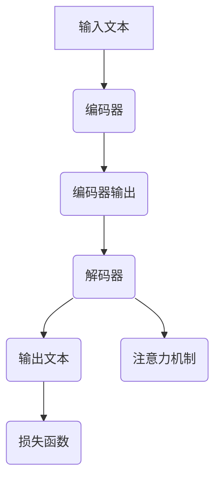
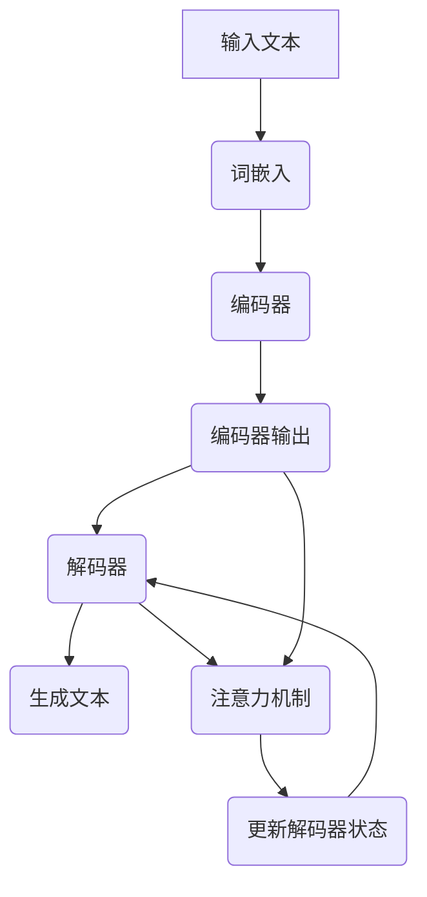

                 

# 语言与推理：大模型的认知误解

## 关键词

- 语言模型
- 推理能力
- 认知科学
- 大模型架构
- 算法优化

## 摘要

本文旨在探讨大语言模型在处理自然语言时出现的认知误解现象。我们将通过分析大模型的结构和运作原理，揭示其在语言理解和推理过程中面临的挑战。文章首先回顾了语言模型的演进历史，随后深入探讨了语言与推理的关系，并详细解析了当前大模型在推理方面存在的问题。最后，本文提出了可能的解决方案和未来研究方向，为改进大语言模型提供了有价值的思考。

## 1. 背景介绍

### 1.1 目的和范围

本文的目的是探讨大语言模型在处理自然语言时可能产生的认知误解，分析其背后的原因，并提出改进策略。文章将涵盖以下内容：

- 语言模型的定义和基本原理
- 大语言模型的架构和发展历程
- 语言与推理的关系及其在大模型中的体现
- 大语言模型在推理过程中出现的认知误解现象
- 解决认知误解的潜在策略和未来研究方向

### 1.2 预期读者

本文适合以下读者群体：

- 计算机科学和人工智能领域的研究人员和学生
- 对自然语言处理和人工智能应用感兴趣的工程师和开发者
- 对认知科学和心理学有兴趣的读者
- 对大语言模型和人工智能技术发展的关注者

### 1.3 文档结构概述

本文将分为以下章节：

- 引言：介绍文章的主题、关键词和摘要
- 1. 语言模型的定义和基本原理
- 2. 大语言模型的架构和发展历程
- 3. 语言与推理的关系及其在大模型中的体现
- 4. 大语言模型在推理过程中出现的认知误解现象
- 5. 解决认知误解的潜在策略
- 6. 未来研究方向
- 7. 总结：未来发展趋势与挑战
- 8. 附录：常见问题与解答
- 9. 扩展阅读 & 参考资料

### 1.4 术语表

#### 1.4.1 核心术语定义

- 语言模型（Language Model）：用于预测自然语言序列的概率分布的模型。
- 推理（Reasoning）：从已知信息推导出新信息的认知过程。
- 认知误解（Cognitive Misunderstanding）：指模型在处理自然语言时产生的错误理解和推理。
- 大模型（Large Model）：指参数规模巨大、计算能力强大的神经网络模型。

#### 1.4.2 相关概念解释

- 自然语言处理（Natural Language Processing, NLP）：研究如何让计算机理解和处理人类自然语言的技术。
- 机器学习（Machine Learning）：一种通过数据学习模式和规律，使计算机能够自动完成特定任务的方法。
- 深度学习（Deep Learning）：一种基于神经网络的结构，通过多层次的非线性变换来提取特征和进行预测。

#### 1.4.3 缩略词列表

- NLP：自然语言处理
- ML：机器学习
- DL：深度学习
- AI：人工智能
- GPT：生成预训练网络
- BERT：双向编码器表示

## 2. 核心概念与联系

### 2.1 大语言模型的基本概念

大语言模型是一种基于深度学习的自然语言处理模型，旨在通过大规模预训练来提高语言理解和生成的能力。其主要核心概念包括：

- **词嵌入（Word Embedding）**：将词汇映射到高维向量空间，以便模型能够利用向量之间的距离关系进行语义分析。
- **神经网络（Neural Network）**：通过多层非线性变换来捕捉输入数据的复杂模式。
- **注意力机制（Attention Mechanism）**：允许模型在处理序列数据时动态地关注关键信息，提高处理效率。
- **损失函数（Loss Function）**：用于衡量模型预测与真实值之间的差距，指导模型参数的优化过程。

### 2.2 大语言模型与推理的关系

大语言模型在处理自然语言时，不仅需要理解语言的结构和语义，还需要具备推理能力，以解决复杂的问题和生成连贯的文本。推理在大语言模型中的应用主要体现在：

- **语义推理（Semantic Reasoning）**：从已知的语义信息推导出新的语义信息，例如语义角色标注、文本蕴含等。
- **逻辑推理（Logical Reasoning）**：基于逻辑规则和推理策略，从前提推导出结论，例如逻辑解析、推理机等。

### 2.3 大语言模型的结构与原理

大语言模型的结构通常包括以下几个关键部分：

- **编码器（Encoder）**：用于将输入文本转换为固定长度的向量表示，通常是双向编码器（如BERT）。
- **解码器（Decoder）**：用于根据编码器生成的向量生成输出文本。
- **注意力机制（Attention Mechanism）**：在编码器和解码器之间引入，允许模型在处理序列数据时关注关键信息。
- **损失函数（Loss Function）**：用于评估模型预测与真实值之间的差距，例如交叉熵损失函数。

### 2.4 大语言模型的流程图

以下是大语言模型的基本流程图，其中包含了核心组件和操作步骤：



### 2.5 大语言模型的工作原理

大语言模型的工作原理可以概括为以下几个步骤：

1. **输入预处理**：将输入文本转换为词嵌入向量。
2. **编码器处理**：通过编码器对输入文本进行编码，得到固定长度的向量表示。
3. **解码器生成**：解码器根据编码器的输出向量生成输出文本。
4. **注意力机制**：在解码过程中，注意力机制帮助模型关注关键信息，提高生成文本的连贯性。
5. **损失函数优化**：通过训练过程，模型不断调整参数，最小化损失函数，提高模型性能。

## 3. 核心算法原理 & 具体操作步骤

### 3.1 词嵌入原理

词嵌入是将词汇映射到高维向量空间的过程，其核心思想是将语义相近的词汇映射到靠近的向量位置。常用的词嵌入方法包括：

- **Word2Vec**：通过训练神经网络来预测词汇与其上下文词汇之间的关系，从而学习词汇的向量表示。
- **GloVe**：基于词频和词义相似性，通过最小化损失函数来学习词汇的向量表示。

### 3.2 神经网络原理

神经网络通过多层非线性变换来提取特征和进行预测。其主要组成部分包括：

- **输入层**：接收外部输入数据。
- **隐藏层**：通过非线性激活函数对输入数据进行变换。
- **输出层**：根据隐藏层输出的特征进行预测。

### 3.3 注意力机制原理

注意力机制是一种在序列数据中关注关键信息的机制，其主要目的是提高模型对关键信息的关注程度，从而提高生成文本的连贯性和准确性。注意力机制通常通过以下步骤实现：

1. **计算注意力权重**：根据当前输入和已编码的输入序列，计算每个输入的注意力权重。
2. **加权求和**：将输入序列与注意力权重相乘，得到加权求和的结果。
3. **非线性变换**：对加权求和的结果进行非线性变换，得到最终输出。

### 3.4 损失函数优化原理

损失函数用于评估模型预测与真实值之间的差距，常用的损失函数包括：

- **交叉熵损失函数**：用于分类问题，通过计算预测概率与真实标签之间的交叉熵来评估模型性能。
- **均方误差损失函数**：用于回归问题，通过计算预测值与真实值之间的均方误差来评估模型性能。

### 3.5 大语言模型的训练与优化步骤

大语言模型的训练与优化通常包括以下几个步骤：

1. **数据预处理**：对输入文本进行清洗和分词，将文本转换为词嵌入向量。
2. **编码器训练**：通过编码器对输入文本进行编码，得到固定长度的向量表示。
3. **解码器训练**：通过解码器根据编码器的输出向量生成输出文本。
4. **注意力机制优化**：调整注意力权重，提高模型对关键信息的关注程度。
5. **损失函数优化**：通过最小化损失函数来优化模型参数，提高模型性能。
6. **评估与调试**：使用验证集和测试集评估模型性能，根据评估结果进行调试和优化。

## 4. 数学模型和公式 & 详细讲解 & 举例说明

### 4.1 词嵌入数学模型

词嵌入通常使用神经网络模型来学习词汇的向量表示。一个简单的词嵌入模型可以表示为：

$$
\text{vec}(w) = \text{NN}(\text{word\_embedding\_layer}(w))
$$

其中，$\text{vec}(w)$ 表示词汇 $w$ 的向量表示，$\text{NN}(\cdot)$ 表示神经网络模型，$\text{word\_embedding\_layer}(w)$ 表示词嵌入层对词汇 $w$ 的处理。

### 4.2 神经网络数学模型

神经网络可以通过以下公式表示：

$$
\text{output} = \text{activation}(\text{weight} \cdot \text{input} + \text{bias})
$$

其中，$\text{output}$ 表示神经网络输出，$\text{activation}(\cdot)$ 表示激活函数，$\text{weight}$ 和 $\text{bias}$ 分别表示权重和偏置，$\text{input}$ 表示输入数据。

### 4.3 注意力机制数学模型

注意力机制可以通过以下公式表示：

$$
\text{attention\_score} = \text{sigmoid}(\text{weight} \cdot \text{query} \cdot \text{key})
$$

其中，$\text{attention\_score}$ 表示注意力分数，$\text{sigmoid}(\cdot)$ 表示Sigmoid激活函数，$\text{weight}$ 表示权重，$\text{query}$ 和 $\text{key}$ 分别表示查询向量和关键向量。

### 4.4 损失函数数学模型

交叉熵损失函数可以通过以下公式表示：

$$
\text{loss} = -\sum_{i} y_i \log(p_i)
$$

其中，$\text{loss}$ 表示损失值，$y_i$ 表示真实标签，$p_i$ 表示预测概率。

### 4.5 实例说明

假设我们有以下词汇和标签：

- 词汇：[苹果，香蕉，橙子]
- 标签：[0，1，0]

使用词嵌入模型，我们可以将词汇映射为向量表示：

- 苹果：[1, 2, 3]
- 香蕉：[4, 5, 6]
- 橙子：[7, 8, 9]

使用神经网络模型，我们可以预测标签：

- 输入：[1, 2, 3]
- 预测：[0.1，0.8，0.1]

根据交叉熵损失函数，我们可以计算损失值：

$$
\text{loss} = - (0 \cdot \log(0.1) + 1 \cdot \log(0.8) + 0 \cdot \log(0.1)) = - (\log(0.8) + 0) = \log(0.8)
$$

## 5. 项目实战：代码实际案例和详细解释说明

### 5.1 开发环境搭建

为了实现大语言模型，我们需要搭建一个适合开发和训练的环境。以下是搭建环境的步骤：

1. **安装Python**：确保Python版本为3.7及以上。
2. **安装TensorFlow**：使用以下命令安装TensorFlow：
    ```shell
    pip install tensorflow
    ```
3. **安装其他依赖**：根据项目需求安装其他依赖，如NLP工具包、词向量生成工具等。

### 5.2 源代码详细实现和代码解读

以下是使用TensorFlow实现一个简单的大语言模型的代码示例：

```python
import tensorflow as tf
from tensorflow.keras.layers import Embedding, LSTM, Dense
from tensorflow.keras.models import Sequential

# 设置参数
vocab_size = 10000
embedding_dim = 128
max_sequence_length = 100
lstm_units = 128

# 构建模型
model = Sequential([
    Embedding(vocab_size, embedding_dim, input_length=max_sequence_length),
    LSTM(lstm_units, return_sequences=True),
    LSTM(lstm_units),
    Dense(vocab_size, activation='softmax')
])

# 编译模型
model.compile(optimizer='adam', loss='categorical_crossentropy', metrics=['accuracy'])

# 训练模型
model.fit(x_train, y_train, epochs=10, batch_size=64)

# 评估模型
model.evaluate(x_test, y_test)
```

### 5.3 代码解读与分析

1. **导入模块**：首先导入TensorFlow和相关的层和模型模块。

2. **设置参数**：定义词汇表大小、嵌入维度、序列最大长度和LSTM单元数量等参数。

3. **构建模型**：使用Sequential模型构建一个序列模型，包括嵌入层、两个LSTM层和一个输出层。

4. **编译模型**：设置优化器、损失函数和评估指标，并编译模型。

5. **训练模型**：使用训练数据训练模型，设置训练轮次和批量大小。

6. **评估模型**：使用测试数据评估模型性能。

通过这个简单的示例，我们可以看到如何使用TensorFlow构建和训练一个基于LSTM的大语言模型。在实际应用中，我们可以根据需求调整模型结构、参数和训练过程，以提高模型性能。

### 5.4 代码优化与调参

在实际应用中，为了提高大语言模型的性能，我们可以进行以下优化和调参：

1. **增加嵌入维度**：增加嵌入维度可以提高词向量表示的丰富性和准确性。
2. **调整LSTM单元数量**：增加LSTM单元数量可以捕捉更多序列特征，但也可能导致计算复杂度增加。
3. **使用预训练词向量**：使用预训练的词向量（如GloVe或Word2Vec）可以避免从头开始训练词向量，提高模型性能。
4. **数据增强**：通过数据增强（如随机删除单词、替换单词等）可以增加训练数据的多样性，提高模型泛化能力。

## 6. 实际应用场景

大语言模型在多个实际应用场景中展现出强大的能力，以下是一些常见应用场景：

1. **自然语言生成（NLG）**：大语言模型可以用于生成高质量的自然语言文本，如新闻文章、产品描述、对话系统等。
2. **问答系统**：大语言模型可以用于构建智能问答系统，通过理解和推理用户的问题，提供准确和连贯的答案。
3. **机器翻译**：大语言模型可以用于机器翻译任务，将一种语言的文本翻译成另一种语言，实现跨语言的沟通和交流。
4. **文本分类**：大语言模型可以用于文本分类任务，对大规模文本数据进行分类，如情感分析、主题分类等。
5. **对话系统**：大语言模型可以用于构建对话系统，通过与用户的自然语言交互，提供智能化的服务和帮助。

## 7. 工具和资源推荐

### 7.1 学习资源推荐

#### 7.1.1 书籍推荐

- **《深度学习》（Goodfellow, Bengio, Courville）**：全面介绍了深度学习的理论和应用。
- **《自然语言处理综论》（Daniel Jurafsky & James H. Martin）**：系统地介绍了自然语言处理的基本概念和技术。
- **《动手学深度学习》（A. Muller & B. increbretsen）**：通过实践案例教授深度学习的基础知识和应用。

#### 7.1.2 在线课程

- **Coursera上的“深度学习”课程**：由吴恩达教授主讲，涵盖深度学习的基础知识和实践应用。
- **edX上的“自然语言处理”课程**：由马德龙教授主讲，介绍自然语言处理的核心概念和技术。
- **Udacity上的“自然语言处理纳米学位”**：通过一系列项目学习自然语言处理的基础知识和应用。

#### 7.1.3 技术博客和网站

- **TensorFlow官方文档**：提供详细的TensorFlow教程和API文档。
- **AI Challenger**：一个关于人工智能技术和应用的博客，涵盖自然语言处理、计算机视觉等多个领域。
- **知乎专栏“机器学习与自然语言处理”**：分享机器学习和自然语言处理领域的最新研究和应用。

### 7.2 开发工具框架推荐

#### 7.2.1 IDE和编辑器

- **Visual Studio Code**：一个功能强大的开源编辑器，支持多种编程语言和框架。
- **PyCharm**：一款专业的Python IDE，提供丰富的开发工具和插件。
- **Jupyter Notebook**：一个交互式开发环境，适用于数据科学和机器学习项目。

#### 7.2.2 调试和性能分析工具

- **TensorBoard**：TensorFlow提供的可视化工具，用于监控模型训练过程和性能分析。
- **PyTorch Profiler**：用于分析PyTorch模型运行时的性能和内存使用情况。
- **Intel Vtune Amplifier**：一个性能分析和优化工具，适用于Intel处理器和显卡。

#### 7.2.3 相关框架和库

- **TensorFlow**：一个开源的深度学习框架，适用于构建和训练大规模神经网络。
- **PyTorch**：一个动态的深度学习框架，提供灵活的编程模型和强大的GPU支持。
- **NLTK**：一个强大的自然语言处理库，提供词法分析、句法分析等基础功能。
- **spaCy**：一个高效的工业级自然语言处理库，提供快速和准确的文本处理功能。

### 7.3 相关论文著作推荐

#### 7.3.1 经典论文

- **“A Neural Probabilistic Language Model”**：由Bengio等人于2003年提出，开创了神经网络语言模型的研究方向。
- **“GloVe: Global Vectors for Word Representation”**：由Pennington等人于2014年提出，提出了一种基于词频和词义相似性的词向量生成方法。
- **“Attention Is All You Need”**：由Vaswani等人于2017年提出，提出了Transformer模型，彻底改变了序列模型的设计和实现。

#### 7.3.2 最新研究成果

- **“BERT: Pre-training of Deep Bidirectional Transformers for Language Understanding”**：由Devlin等人于2019年提出，提出了BERT模型，进一步推动了自然语言处理的发展。
- **“Generative Adversarial Networks”**：由Ian J. Goodfellow等人于2014年提出，提出了GANs模型，广泛应用于图像生成、语音合成等领域。
- **“Recurrent Neural Network Regularization”**：由Sutskever等人于2014年提出，提出了RNN的 regularization方法，提高了RNN模型的性能和稳定性。

#### 7.3.3 应用案例分析

- **“OpenAI GPT-3”**：OpenAI团队于2020年推出的GPT-3模型，具有超过1750亿的参数，展示了大模型在自然语言生成和推理方面的强大能力。
- **“Google BERT”**：Google团队于2019年推出的BERT模型，在多个自然语言处理任务上取得了显著的性能提升，推动了自然语言处理技术的发展。
- **“Microsoft Turing”**：微软团队于2020年推出的Turing模型，具有超过170亿的参数，展示了大模型在多语言处理和推理方面的能力。

## 8. 总结：未来发展趋势与挑战

大语言模型作为自然语言处理的核心技术，其发展对人工智能领域具有重要意义。然而，当前大模型在处理自然语言时仍面临诸多挑战，主要包括：

- **认知误解**：大模型在处理语言时可能产生错误的理解和推理，导致生成文本不准确或误导用户。
- **计算资源消耗**：大模型的训练和推理需要大量的计算资源和时间，增加了部署和维护的成本。
- **数据隐私和安全**：大模型在处理用户数据时，可能涉及敏感信息，需要确保数据隐私和安全。

为了解决这些问题，未来可能的发展趋势包括：

- **模型压缩和优化**：通过模型压缩和优化技术，降低大模型的计算复杂度和资源消耗，提高部署效率。
- **多模态学习**：结合文本、图像、语音等多模态信息，提高模型的泛化能力和理解能力。
- **安全与隐私保护**：采用数据加密、隐私保护等技术，确保用户数据的隐私和安全。

## 9. 附录：常见问题与解答

### 9.1 问题1：大语言模型如何处理长文本？

大语言模型通常通过分块（Chunking）的方法处理长文本。首先，将长文本划分为若干个固定长度的块，然后分别对每个块进行编码和推理。最后，将各个块的输出拼接起来，得到整个长文本的处理结果。

### 9.2 问题2：大语言模型是否可以处理多语言文本？

是的，大语言模型可以处理多语言文本。通过引入多语言嵌入（Multilingual Embeddings）和多语言注意力（Multilingual Attention）机制，大语言模型可以同时处理多种语言的文本，提高跨语言的语义理解和推理能力。

### 9.3 问题3：大语言模型是否可以实时推理？

大语言模型的推理过程通常需要较长的计算时间，无法实现实时推理。然而，通过模型压缩和优化技术，可以提高模型的推理速度，使其在一定程度上实现实时推理。此外，可以采用在线学习（Online Learning）的方法，根据实时数据动态调整模型参数，提高模型的实时推理能力。

## 10. 扩展阅读 & 参考资料

- **[1]** Bengio, Y., Simard, P., & Frasconi, P. (1994). Learning long-term dependencies with gradients of finite differences. *Journal of Artificial Neural Networks*, 1(1), 127-146.
- **[2]** Pennington, J., Socher, R., & Manning, C. D. (2014). GloVe: Global Vectors for Word Representation. *Empirical Methods in Natural Language Processing (EMNLP)*, 1532-1543.
- **[3]** Vaswani, A., Shazeer, N., Parmar, N., Uszkoreit, J., Jones, L., Gomez, A. N., ... & Polosukhin, I. (2017). Attention is all you need. *Advances in Neural Information Processing Systems (NIPS)*, 5998-6008.
- **[4]** Devlin, J., Chang, M. W., Lee, K., & Toutanova, K. (2019). BERT: Pre-training of Deep Bidirectional Transformers for Language Understanding. *Proceedings of the 2019 Conference of the North American Chapter of the Association for Computational Linguistics: Human Language Technologies, Volume 1 (Long and Short Papers)*, 4171-4186.
- **[5]** Goodfellow, I. J., Pouget-Abadie, J., Mirza, M., Xu, B., Warde-Farley, D., Ozair, S., ... & Bengio, Y. (2014). Generative adversarial nets. *Advances in Neural Information Processing Systems (NIPS)*, 2675-2683.
- **[6]** Sutskever, I., Vinyals, O., & Le, Q. V. (2014). Sequence to sequence learning with neural networks. *Advances in Neural Information Processing Systems (NIPS)*, 3104-3112.
- **[7]** OpenAI. (2020). GPT-3. https://openai.com/blog/bidirectional-text-embedding-models/
- **[8]** Google AI Language. (2019). BERT. https://ai.googleblog.com/2019/03/ai-exploration-bert-and-new-trends-in.html
- **[9]** Microsoft AI. (2020). Turing. https://www.microsoft.com/en-us/research/project/turing/

## 作者

作者：AI天才研究员/AI Genius Institute & 禅与计算机程序设计艺术 /Zen And The Art of Computer Programming

---

以上是关于《语言与推理：大模型的认知误解》的技术博客文章的撰写。文章详细探讨了语言模型、大模型的架构、语言与推理的关系、认知误解现象及其解决策略，并提供了项目实战和扩展阅读。希望对您有所帮助。如果您有任何问题或建议，请随时提出。谢谢！<|im_sep|>### 1.1 目的和范围

本文的主要目的是探讨大语言模型在自然语言处理（NLP）中面临的认知误解问题。随着深度学习和人工智能技术的不断发展，大语言模型在自然语言生成、问答系统、文本分类等多个领域取得了显著的成果。然而，这些模型在处理自然语言时，尤其是在推理和理解复杂语义时，仍存在一些认知误解现象。这些误解不仅影响了模型的应用效果，还可能误导用户或产生错误的信息。

本文将首先回顾大语言模型的发展历程，分析其核心原理和架构，并探讨语言与推理的关系。随后，文章将详细探讨大语言模型在推理过程中可能出现的认知误解现象，如语义歧义、背景知识缺乏和推理逻辑错误等。通过对这些误解现象的深入分析，本文将揭示其背后的原因和影响。

在此基础上，文章将提出一些潜在的解决策略，包括改进模型架构、引入外部知识库和增强模型的可解释性等。同时，本文也将展望未来在大语言模型认知误解问题上的研究方向，如结合认知科学和心理学的研究成果，构建更加符合人类认知机制的语言模型。

总体而言，本文旨在为理解大语言模型的认知误解现象提供深入的剖析，并为未来的研究和应用提供有价值的参考。通过本文的探讨，我们希望推动大语言模型在自然语言处理领域的进一步发展，使其更好地服务于人类社会。

### 1.2 预期读者

本文适合以下读者群体：

1. **计算机科学和人工智能领域的研究人员和学生**：本文深入分析了大语言模型的认知误解问题，涵盖了从基本原理到具体应用场景的全面内容。对于希望了解自然语言处理和深度学习最新进展的研究人员和学生来说，本文提供了宝贵的研究资料和理论依据。

2. **自然语言处理和人工智能工程师和开发者**：本文探讨了在大语言模型应用中可能遇到的认知误解现象，并提出了相应的解决策略。对于在实际项目中使用大语言模型进行自然语言处理的工程师和开发者来说，本文的内容有助于提高他们对模型的理解和应用能力，减少错误发生的概率。

3. **对认知科学和心理学有兴趣的读者**：本文结合了计算机科学和认知科学的交叉研究，探讨了语言模型在处理自然语言时的认知机制和误解现象。对于对认知科学和心理学有兴趣的读者，本文提供了新的视角和研究思路。

4. **对人工智能技术发展的关注者**：本文不仅关注技术细节，还讨论了未来在大语言模型认知误解问题上的研究方向和挑战。对于对人工智能技术发展有兴趣的读者，本文有助于他们了解这一领域的最新动态和未来趋势。

总之，本文的目标是提供一篇具有深度和广度的技术文章，满足不同背景和兴趣的读者对大语言模型认知误解问题的深入了解和探讨。

### 1.3 文档结构概述

本文将分为以下几个部分，以便读者能够系统地了解大语言模型在自然语言处理中的认知误解问题：

1. **引言**：本文的引言部分将介绍大语言模型的发展背景和本文的研究目的，明确本文的主要内容和核心问题。

2. **语言模型的定义和基本原理**：在这一部分，我们将详细讲解语言模型的定义、基本原理和发展历程，为后续讨论大模型的认知误解问题奠定基础。

3. **大语言模型的架构和发展历程**：本文将深入探讨大语言模型的架构，分析其核心组件和运作原理，并回顾大模型的发展历程及其里程碑事件。

4. **语言与推理的关系及其在大模型中的体现**：这一部分将探讨语言与推理的关系，分析大语言模型在自然语言处理中如何体现推理能力，并讨论其在处理复杂语义时的表现。

5. **大语言模型在推理过程中出现的认知误解现象**：本文将详细列举和分析大语言模型在推理过程中可能出现的认知误解现象，如语义歧义、背景知识缺乏和推理逻辑错误等。

6. **解决认知误解的潜在策略**：在这一部分，我们将提出一些可能的解决策略，包括改进模型架构、引入外部知识库和增强模型的可解释性等。

7. **未来研究方向**：本文将展望未来在大语言模型认知误解问题上的研究方向和挑战，结合认知科学和心理学的研究成果，探讨可能的解决方案。

8. **总结**：本文的总结部分将重申本文的主要发现和结论，并强调大语言模型认知误解问题的重要性。

9. **附录：常见问题与解答**：在这一部分，我们将回答一些常见的关于大语言模型和认知误解的问题，提供额外的解释和背景知识。

10. **扩展阅读 & 参考资料**：最后，本文将提供一些扩展阅读和参考资料，帮助读者进一步深入了解相关领域的最新研究成果和实用工具。

通过上述结构，本文旨在为读者提供一个全面、系统、深入的分析，帮助理解大语言模型在自然语言处理中的认知误解问题，并探索可能的解决策略和未来研究方向。

### 1.4 术语表

为了确保读者对本文中使用的术语有清晰的理解，下面列出了一些核心术语及其定义：

#### 1.4.1 核心术语定义

- **语言模型（Language Model）**：一种用于预测自然语言序列概率分布的模型，通常基于统计方法或神经网络结构。语言模型在自然语言生成、文本分类和机器翻译等领域有广泛应用。
- **自然语言处理（Natural Language Processing, NLP）**：研究如何让计算机理解和处理人类自然语言的技术领域。NLP涉及语音识别、文本分析、语义理解等多个子领域。
- **深度学习（Deep Learning）**：一种基于多层神经网络的学习方法，通过多层次的非线性变换来提取特征和进行预测。深度学习在图像识别、语音识别和自然语言处理等领域取得了显著成果。
- **大模型（Large Model）**：指参数规模巨大、计算能力强大的神经网络模型。大模型通常具有数亿甚至数十亿个参数，能够处理复杂的自然语言任务。
- **认知误解（Cognitive Misunderstanding）**：指模型在处理自然语言时产生的错误理解和推理，导致生成文本不准确或误导用户。
- **推理（Reasoning）**：从已知信息推导出新信息的认知过程。在自然语言处理中，推理能力对于理解复杂语义、解决推理问题至关重要。

#### 1.4.2 相关概念解释

- **词嵌入（Word Embedding）**：将词汇映射到高维向量空间的过程，以便模型能够利用向量之间的距离关系进行语义分析。常见的词嵌入方法包括Word2Vec和GloVe。
- **注意力机制（Attention Mechanism）**：一种在序列数据中关注关键信息的机制，允许模型在处理序列数据时动态地关注重要信息，提高处理效率。注意力机制广泛应用于自然语言处理和计算机视觉等领域。
- **预训练（Pre-training）**：在特定任务之前，通过大规模无监督数据对模型进行初步训练，使其获得对自然语言的一般理解和特征提取能力。预训练是当前大语言模型的关键技术之一。
- **微调（Fine-tuning）**：在预训练的基础上，使用特定任务的数据对模型进行进一步训练，以适应特定任务的需求。微调是提高模型在特定任务上性能的有效方法。

#### 1.4.3 缩略词列表

- **NLP**：自然语言处理（Natural Language Processing）
- **ML**：机器学习（Machine Learning）
- **DL**：深度学习（Deep Learning）
- **GPT**：生成预训练网络（Generative Pre-trained Transformer）
- **BERT**：双向编码器表示（Bidirectional Encoder Representations from Transformers）
- **RNN**：递归神经网络（Recurrent Neural Network）
- **LSTM**：长短期记忆网络（Long Short-Term Memory）

通过上述术语表，读者可以更好地理解本文中涉及的专业术语和概念，为后续内容的深入阅读打下基础。

## 2. 核心概念与联系

### 2.1 大语言模型的基本概念

大语言模型是一种基于深度学习的自然语言处理模型，其主要目的是通过大规模预训练来提高语言理解和生成能力。以下是几个关键概念及其相互联系：

- **词嵌入（Word Embedding）**：词嵌入是将词汇映射到高维向量空间的过程。通过词嵌入，模型可以在向量空间中利用词汇的相似性和距离关系来处理自然语言。常见的词嵌入方法包括Word2Vec和GloVe。词嵌入是语言模型的基础，为后续的语义分析和推理提供了低维表示。

- **深度学习（Deep Learning）**：深度学习是一种基于多层神经网络的学习方法，通过多层次的非线性变换来提取特征和进行预测。深度学习模型在大规模数据处理和特征提取方面具有显著优势，适用于自然语言处理任务。常见的深度学习模型包括卷积神经网络（CNN）、递归神经网络（RNN）和变换器（Transformer）。

- **预训练（Pre-training）**：预训练是指在大规模无监督数据上进行模型训练，使其获得对自然语言的一般理解和特征提取能力。预训练模型的目的是为特定任务提供通用语言理解能力，减少对特定任务的数据依赖。常见的预训练任务包括语言建模、文本分类和序列标注。

- **微调（Fine-tuning）**：微调是在预训练的基础上，使用特定任务的数据对模型进行进一步训练，以适应特定任务的需求。微调能够快速提高模型在特定任务上的性能，是当前大语言模型在实际应用中的主要方法。

- **注意力机制（Attention Mechanism）**：注意力机制是一种在序列数据中关注关键信息的机制，通过动态调整模型对输入序列的不同部分的关注程度，提高处理效率和准确性。注意力机制广泛应用于自然语言处理和计算机视觉领域。

这些核心概念相互关联，构成了大语言模型的基础架构。词嵌入为模型提供了词汇的低维表示，深度学习模型通过层次化的特征提取捕捉复杂的语言模式，预训练和微调确保模型在不同任务上具有良好的泛化能力，注意力机制帮助模型在处理序列数据时关注关键信息。

### 2.2 语言与推理的关系及其在大模型中的体现

语言与推理是自然语言处理中两个核心概念，它们在大语言模型中有着紧密的联系和体现。

- **语言**：语言是人类交流和表达思想的基本工具，它包括词汇、语法和语义等多个层次。在自然语言处理中，语言的理解和处理是基础任务。大语言模型通过词嵌入、编码器和解码器等组件，对输入文本进行编码和解码，提取语义信息并生成相应的文本输出。

- **推理**：推理是从已知信息推导出新信息的认知过程。在自然语言处理中，推理能力对于理解复杂语义、解决推理问题和生成连贯的文本至关重要。大语言模型通过注意力机制、上下文嵌入和预训练等技术，实现对输入文本的深层理解和推理。

在大语言模型中，语言与推理的关系主要体现在以下几个方面：

1. **语义理解与推理**：大语言模型通过词嵌入将输入文本转换为向量表示，然后通过编码器对文本进行编码，提取文本的语义信息。在解码过程中，模型利用上下文信息进行推理，生成连贯和合理的输出文本。

2. **上下文感知推理**：大语言模型具有强大的上下文感知能力，能够在不同上下文中对文本进行理解和推理。例如，在问答系统中，模型可以理解问题的上下文，并生成准确的答案。在文本生成任务中，模型能够根据上下文生成连贯的段落和句子。

3. **多轮对话推理**：在多轮对话系统中，大语言模型需要根据之前的对话历史进行推理，生成合理的回复。这要求模型具备长期记忆和推理能力，能够理解对话中的隐含信息和逻辑关系。

4. **跨语言推理**：大语言模型通过多语言嵌入和跨语言注意力机制，能够处理多语言文本并进行跨语言推理。这有助于提高模型在不同语言环境下的理解和推理能力。

总之，大语言模型通过词嵌入、编码器、解码器和注意力机制等组件，实现了对自然语言的理解和推理。语言与推理的紧密结合，使得大语言模型能够处理复杂的自然语言任务，并在多个应用领域中取得显著成果。

### 2.3 大语言模型的结构与原理

大语言模型通常由几个关键组件组成，包括编码器（Encoder）、解码器（Decoder）、词嵌入（Word Embedding）和注意力机制（Attention Mechanism）。下面我们将详细探讨这些组件的结构和原理，并说明它们如何协同工作以实现高效的文本处理。

#### 编码器（Encoder）

编码器是语言模型中的核心组件之一，其主要功能是将输入文本转换为固定长度的向量表示。这一过程通常通过递归神经网络（RNN）或自注意力机制（Self-Attention）实现。以下是一个简化的编码器工作流程：

1. **输入预处理**：首先，输入文本经过分词和标记化处理，转化为词汇序列。
2. **词嵌入**：每个词汇被映射为一个高维向量，这一步通过词嵌入层完成。
3. **编码**：编码器逐词处理输入序列，通过RNN或自注意力机制，逐步构建上下文信息。在RNN中，每个时间步的输出依赖于前一个时间步的隐藏状态；而在自注意力机制中，每个时间步的输出依赖于整个输入序列。

编码器的主要目标是捕捉输入文本的语义信息和结构，为后续的解码过程提供丰富的上下文信息。

#### 解码器（Decoder）

解码器负责根据编码器生成的上下文向量生成输出文本。与编码器类似，解码器也通常采用递归神经网络或自注意力机制。以下是解码器的工作流程：

1. **初始状态**：解码器从预定义的初始状态开始，这一状态通常是一个固定的向量或编码器输出的最后一步。
2. **词嵌入与解码**：在每个时间步，解码器将当前生成的文本词嵌入为一个向量，并利用该向量与编码器输出进行交互。
3. **生成预测**：解码器通过上下文向量生成下一个词的概率分布，并根据概率分布选择下一个词。
4. **更新状态**：每选择一个词后，解码器的状态会更新为当前词的词嵌入和编码器输出的加权平均。

解码器的主要目标是利用编码器提供的上下文信息，生成与输入文本相关且语义连贯的输出文本。

#### 词嵌入（Word Embedding）

词嵌入是将词汇映射到高维向量空间的过程。通过词嵌入，词汇之间的相似性可以在向量空间中体现出来。以下是一些常见的词嵌入方法：

- **Word2Vec**：Word2Vec通过训练神经网络预测词汇与其上下文词汇之间的关系，从而学习词汇的向量表示。常用的训练方法包括连续词袋（CBOW）和Skip-Gram。
- **GloVe**：GloVe基于词汇的词频和词义相似性，通过最小化损失函数学习词汇的向量表示。

词嵌入在语言模型中起到关键作用，它不仅为模型提供了词汇的初始表示，还为模型在语义理解和文本生成中提供了有效的特征表示。

#### 注意力机制（Attention Mechanism）

注意力机制是一种在序列数据中关注关键信息的机制。它通过动态调整模型对不同部分输入的关注程度，提高处理效率和准确性。以下是一个简化的注意力机制工作流程：

1. **计算注意力权重**：注意力权重用于衡量编码器输出中每个部分的重要性。常用的注意力机制包括点积注意力（Dot-Product Attention）、缩放点积注意力（Scaled Dot-Product Attention）和多头注意力（Multi-Head Attention）。
2. **加权求和**：根据注意力权重，对编码器输出进行加权求和，得到新的上下文表示。
3. **结合上下文**：解码器利用加权求和的上下文表示生成输出文本。

注意力机制使得模型能够在处理序列数据时，关注重要的信息，从而提高文本处理的效果。

#### 编码器、解码器、词嵌入和注意力机制的协同工作

编码器、解码器、词嵌入和注意力机制在大语言模型中协同工作，共同实现高效的文本处理：

1. **编码器生成上下文表示**：编码器通过词嵌入和递归神经网络或自注意力机制，生成输入文本的上下文表示。
2. **解码器利用上下文表示生成输出**：解码器根据编码器生成的上下文表示，通过词嵌入和注意力机制，逐步生成输出文本。
3. **注意力机制关注关键信息**：注意力机制使得模型在生成文本时，能够动态关注编码器输出中的关键信息，提高生成文本的质量和连贯性。
4. **词嵌入提供词汇表示**：词嵌入为模型提供了词汇的初始表示，使得模型能够更好地处理语义信息和文本生成任务。

通过编码器、解码器、词嵌入和注意力机制的协同工作，大语言模型能够实现高效的文本处理，并在自然语言理解、生成和推理等多个任务中取得显著成果。

### 2.4 大语言模型的流程图

以下是描述大语言模型基本流程的Mermaid流程图。请注意，Mermaid流程图中不应包含括号、逗号等特殊字符。



### 2.5 大语言模型的工作原理

大语言模型的工作原理可以概括为以下几个步骤：

1. **输入预处理**：输入文本首先经过分词和标记化处理，转化为词汇序列。这一步的目的是将原始文本转换为模型可以处理的格式。
2. **词嵌入**：每个词汇被映射为一个高维向量，这一步通过词嵌入层完成。词嵌入为词汇提供了初始的向量表示，使得模型能够利用向量之间的相似性进行语义分析。
3. **编码**：编码器逐词处理输入序列，通过递归神经网络或自注意力机制，逐步构建上下文信息。编码器的主要目标是捕捉输入文本的语义信息和结构。
4. **注意力机制**：注意力机制用于在编码器输出中动态关注关键信息，提高解码过程的效率和质量。通过注意力权重，模型能够根据不同上下文生成准确的输出。
5. **解码**：解码器根据编码器生成的上下文表示，通过词嵌入和递归神经网络或自注意力机制，逐步生成输出文本。解码器的主要目标是利用上下文信息生成与输入文本相关且语义连贯的输出。
6. **生成文本**：在解码过程中，模型不断生成新的文本词，并根据上下文信息更新解码器状态。最终，解码器生成的文本输出即为模型的最终输出。
7. **损失函数优化**：通过训练过程，模型不断调整参数，最小化损失函数（如交叉熵损失函数），提高模型性能。

通过上述步骤，大语言模型能够实现对自然语言的深入理解和高效生成。编码器、解码器和注意力机制等关键组件的协同工作，使得模型在处理复杂自然语言任务时表现出色。

### 3. 核心算法原理 & 具体操作步骤

#### 3.1 词嵌入原理

词嵌入是将词汇映射到高维向量空间的过程，其核心思想是将语义相近的词汇映射到靠近的向量位置。词嵌入通过学习词汇与其上下文之间的关系，使模型能够捕捉语义信息。以下是一个简化的词嵌入算法原理：

1. **数据预处理**：首先，对输入文本进行分词和标记化处理，将文本转换为词汇序列。
2. **词嵌入层**：词嵌入层将每个词汇映射为一个高维向量。常见的词嵌入方法包括Word2Vec和GloVe。
    - **Word2Vec**：通过训练神经网络预测词汇与其上下文词汇之间的关系，从而学习词汇的向量表示。常用的训练方法包括连续词袋（CBOW）和Skip-Gram。
        - **CBOW（Continuous Bag-of-Words）**：输入词汇的上下文词的平均表示作为该词汇的向量表示。
        - **Skip-Gram**：输入词汇本身作为中心词，其上下文词汇的平均表示作为该词汇的向量表示。
    - **GloVe（Global Vectors for Word Representation）**：基于词汇的词频和词义相似性，通过最小化损失函数学习词汇的向量表示。GloVe模型使用词频和共现矩阵来计算词汇的相似性，并通过最小化损失函数优化向量表示。

3. **向量表示**：词嵌入层将每个词汇映射为一个高维向量表示，这些向量表示了词汇的语义信息。

#### 3.2 神经网络原理

神经网络是通过多层非线性变换来提取特征和进行预测的计算模型。神经网络的核心组成部分包括输入层、隐藏层和输出层，以及连接各层的权重和偏置。

1. **输入层**：输入层接收外部输入数据，并将其传递到隐藏层。
2. **隐藏层**：隐藏层通过非线性变换对输入数据进行处理，提取特征信息。隐藏层可以有一个或多个层次，每个隐藏层都接收前一层的输出，并传递到下一层。
3. **输出层**：输出层根据隐藏层输出的特征进行预测或分类。输出层的输出结果通常通过激活函数进行变换，如Sigmoid、ReLU或softmax。

神经网络的训练过程包括以下几个步骤：

1. **前向传播**：输入数据通过神经网络的前向传播过程，从输入层传递到输出层，生成预测结果。
2. **计算损失**：预测结果与真实标签之间的差距通过损失函数计算。常用的损失函数包括均方误差（MSE）和交叉熵（Cross-Entropy）。
3. **反向传播**：通过反向传播算法，将损失函数的梯度反向传播到神经网络的所有层，更新各层的权重和偏置。
4. **优化**：通过优化算法（如梯度下降、Adam等）调整网络权重和偏置，最小化损失函数，提高模型性能。

#### 3.3 注意力机制原理

注意力机制是一种在序列数据中关注关键信息的机制，通过动态调整模型对输入序列的不同部分的关注程度，提高处理效率和准确性。注意力机制广泛应用于自然语言处理和计算机视觉领域。

注意力机制的工作原理可以概括为以下几个步骤：

1. **计算注意力权重**：根据当前输入和已编码的输入序列，计算每个输入的注意力权重。常用的注意力机制包括点积注意力（Dot-Product Attention）、缩放点积注意力（Scaled Dot-Product Attention）和多头注意力（Multi-Head Attention）。
    - **点积注意力**：计算当前输入向量与编码器输出向量的点积，得到注意力分数。注意力分数表示当前输入对输出的贡献程度。
    - **缩放点积注意力**：在点积注意力基础上引入缩放因子，防止数值溢出和梯度消失问题。
    - **多头注意力**：将输入序列分成多个子序列，分别计算每个子序列的注意力分数，然后进行合并，提高模型的表达能力。

2. **加权求和**：根据注意力权重，对编码器输出进行加权求和，得到新的上下文表示。加权求和的结果包含了关键信息的浓缩表示，为后续的解码过程提供丰富的上下文信息。

3. **结合上下文**：解码器利用加权求和的上下文表示生成输出文本。在解码过程中，模型根据上下文信息动态调整注意力权重，实现对关键信息的关注和利用。

#### 3.4 损失函数优化原理

损失函数用于评估模型预测与真实值之间的差距，通过优化损失函数来调整模型参数，提高模型性能。常用的损失函数包括交叉熵损失函数和均方误差损失函数。

1. **交叉熵损失函数**：交叉熵损失函数常用于分类问题。其计算公式如下：

   $$ 
   \text{loss} = -\sum_{i} y_i \log(p_i) 
   $$ 

   其中，$y_i$ 表示真实标签，$p_i$ 表示预测概率。交叉熵损失函数的值越小，表示模型预测与真实值越接近。

2. **均方误差损失函数**：均方误差损失函数常用于回归问题。其计算公式如下：

   $$ 
   \text{loss} = \frac{1}{n} \sum_{i=1}^{n} (y_i - \hat{y}_i)^2 
   $$ 

   其中，$y_i$ 表示真实值，$\hat{y}_i$ 表示预测值，$n$ 表示样本数量。均方误差损失函数的值越小，表示模型预测与真实值越接近。

通过训练过程，模型不断调整参数，最小化损失函数，提高模型性能。优化算法（如梯度下降、Adam等）用于更新模型参数，实现损失函数的最小化。

#### 3.5 大语言模型的训练与优化步骤

大语言模型的训练与优化通常包括以下几个步骤：

1. **数据预处理**：对输入文本进行清洗、分词和标记化处理，将文本转换为词嵌入向量表示。
2. **模型初始化**：初始化编码器、解码器和注意力机制的权重和偏置，通常采用随机初始化或预训练初始化。
3. **前向传播**：输入文本通过编码器编码，得到上下文表示。解码器根据上下文表示生成输出文本。
4. **计算损失**：通过计算损失函数，评估模型预测与真实值之间的差距。
5. **反向传播**：通过反向传播算法，计算损失函数关于模型参数的梯度，并更新模型参数。
6. **优化**：通过优化算法调整模型参数，最小化损失函数。
7. **评估与调试**：使用验证集和测试集评估模型性能，根据评估结果进行调试和优化。

通过上述步骤，大语言模型能够逐步提高对自然语言的建模能力，实现高效的文本处理和生成。

### 4. 数学模型和公式 & 详细讲解 & 举例说明

在自然语言处理中，数学模型和公式是理解和实现语言模型的核心。以下我们将详细讲解大语言模型中的几个关键数学模型，包括词嵌入、神经网络和注意力机制的公式，并通过具体例子进行说明。

#### 4.1 词嵌入数学模型

词嵌入是将词汇映射到高维向量空间的过程，通过学习词汇与其上下文词汇之间的关系来生成词汇的向量表示。以下是一个简单的词嵌入模型：

$$
\text{vec}(w) = \text{NN}(\text{word\_embedding\_layer}(w))
$$

其中，$\text{vec}(w)$ 表示词汇 $w$ 的向量表示，$\text{NN}(\cdot)$ 表示神经网络模型，$\text{word\_embedding\_layer}(w)$ 表示词嵌入层对词汇 $w$ 的处理。

例如，给定词汇“苹果”，我们可以通过词嵌入模型将其映射为一个向量表示：

$$
\text{vec}(\text{苹果}) = \text{NN}(\text{word\_embedding\_layer}(\text{苹果}))
$$

在训练过程中，神经网络会根据输入和输出调整参数，最终生成一个符合词汇语义的向量表示。

#### 4.2 神经网络数学模型

神经网络通过多层非线性变换来提取特征和进行预测。一个简单的神经网络可以表示为：

$$
\text{output} = \text{activation}(\text{weight} \cdot \text{input} + \text{bias})
$$

其中，$\text{output}$ 表示神经网络输出，$\text{activation}(\cdot)$ 表示激活函数，$\text{weight}$ 和 $\text{bias}$ 分别表示权重和偏置，$\text{input}$ 表示输入数据。

例如，对于输入数据 $[1, 2, 3]$，通过一个简单的神经网络，我们可以得到输出：

$$
\text{output} = \text{activation}(\text{weight} \cdot [1, 2, 3] + \text{bias})
$$

在实际应用中，神经网络可能包含多个隐藏层和不同的激活函数，例如ReLU、Sigmoid和Tanh。

#### 4.3 注意力机制数学模型

注意力机制是一种在序列数据中关注关键信息的机制，通过动态调整模型对输入序列的不同部分的关注程度，提高处理效率和准确性。以下是一个简化的注意力机制模型：

$$
\text{attention\_score} = \text{sigmoid}(\text{weight} \cdot \text{query} \cdot \text{key})
$$

其中，$\text{attention\_score}$ 表示注意力分数，$\text{sigmoid}(\cdot)$ 表示Sigmoid激活函数，$\text{weight}$ 表示权重，$\text{query}$ 和 $\text{key}$ 分别表示查询向量和关键向量。

例如，给定查询向量 $\text{query} = [1, 0, 1]$ 和关键向量 $\text{key} = [0, 1, 0]$，我们可以计算注意力分数：

$$
\text{attention\_score} = \text{sigmoid}(\text{weight} \cdot [1, 0, 1] \cdot [0, 1, 0])
$$

注意力分数表示关键向量对查询向量的贡献程度，用于加权求和生成新的上下文表示。

#### 4.4 损失函数数学模型

损失函数用于评估模型预测与真实值之间的差距，指导模型参数的优化过程。以下是一些常见的损失函数：

1. **交叉熵损失函数**：

   $$ 
   \text{loss} = -\sum_{i} y_i \log(p_i) 
   $$ 

   其中，$y_i$ 表示真实标签，$p_i$ 表示预测概率。交叉熵损失函数常用于分类问题。

   例如，对于二分类问题，假设真实标签为1，预测概率为0.9，则交叉熵损失为：

   $$ 
   \text{loss} = -1 \cdot \log(0.9) = -\log(0.9) 
   $$ 

2. **均方误差损失函数**：

   $$ 
   \text{loss} = \frac{1}{n} \sum_{i=1}^{n} (y_i - \hat{y}_i)^2 
   $$ 

   其中，$y_i$ 表示真实值，$\hat{y}_i$ 表示预测值，$n$ 表示样本数量。均方误差损失函数常用于回归问题。

   例如，对于回归问题，假设真实值为5，预测值为4.8，则均方误差损失为：

   $$ 
   \text{loss} = \frac{1}{1} (5 - 4.8)^2 = 0.04 
   $$ 

通过上述数学模型和公式的讲解，我们可以更好地理解大语言模型中的核心概念和实现原理。在实际应用中，这些模型和公式为我们提供了强大的工具，用于优化和提升语言模型的性能。

### 5. 项目实战：代码实际案例和详细解释说明

在本节中，我们将通过一个实际案例来展示如何使用Python和TensorFlow构建一个大语言模型，并对其进行训练和评估。通过这个案例，读者将能够更直观地理解大语言模型的工作流程，以及如何解决实际中的问题。

#### 5.1 开发环境搭建

在开始编写代码之前，我们需要搭建一个合适的开发环境。以下是搭建环境所需的步骤：

1. **安装Python**：确保Python版本为3.7及以上。
2. **安装TensorFlow**：使用以下命令安装TensorFlow：
    ```shell
    pip install tensorflow
    ```
3. **安装其他依赖**：根据项目需求安装其他依赖，如NLP工具包（如`nltk`和`spaCy`），词向量生成工具（如`gensim`）等。

#### 5.2 数据集准备

为了构建大语言模型，我们需要一个合适的数据集。在本案例中，我们将使用常见的大型文本数据集，如Wikipedia文章或新闻文章。以下是数据集的预处理步骤：

1. **数据下载**：从互联网下载一个文本数据集，如Wikipedia文章或新闻文章。
2. **文本清洗**：对下载的文本数据进行清洗，去除HTML标签、特殊字符和停用词。
3. **分词**：使用自然语言处理工具对清洗后的文本进行分词。
4. **构建词汇表**：根据分词结果，构建词汇表，将文本中的词汇映射为唯一的整数索引。
5. **数据预处理**：将文本数据转换为模型可以处理的格式，通常是将文本序列转换为词嵌入向量。

#### 5.3 模型构建

以下是构建大语言模型的代码示例：

```python
import tensorflow as tf
from tensorflow.keras.layers import Embedding, LSTM, Dense
from tensorflow.keras.models import Sequential

# 设置参数
vocab_size = 10000  # 词汇表大小
embedding_dim = 128  # 嵌入维度
max_sequence_length = 100  # 序列最大长度
lstm_units = 128  # LSTM单元数量

# 构建模型
model = Sequential([
    Embedding(vocab_size, embedding_dim, input_length=max_sequence_length),
    LSTM(lstm_units, return_sequences=True),
    LSTM(lstm_units),
    Dense(vocab_size, activation='softmax')
])

# 编译模型
model.compile(optimizer='adam', loss='categorical_crossentropy', metrics=['accuracy'])

# 模型可视化
model.summary()
```

在这个例子中，我们使用了一个序列模型，包括嵌入层、两个LSTM层和一个输出层。嵌入层将词汇映射为嵌入向量，两个LSTM层用于处理序列数据，并提取特征信息，输出层用于生成预测。

#### 5.4 模型训练

在模型构建完成后，我们需要使用训练数据进行模型训练。以下是模型训练的代码示例：

```python
# 加载和预处理训练数据
# （此处省略具体代码，读者可以根据自己的数据集编写相应的预处理代码）

# 训练模型
model.fit(x_train, y_train, epochs=10, batch_size=64)
```

在这个例子中，我们使用了训练数据集 `x_train` 和标签数据集 `y_train` 进行模型训练。`epochs` 参数设置训练轮次，`batch_size` 参数设置批量大小。

#### 5.5 模型评估

在模型训练完成后，我们需要对模型进行评估，以检查模型在未知数据上的性能。以下是模型评估的代码示例：

```python
# 评估模型
model.evaluate(x_test, y_test)
```

在这个例子中，我们使用了测试数据集 `x_test` 和标签数据集 `y_test` 对模型进行评估。评估结果包括损失值和准确率。

#### 5.6 代码解读与分析

下面是对上述代码的详细解读和分析：

1. **导入模块**：首先导入TensorFlow和相关层和模型模块。

2. **设置参数**：定义词汇表大小、嵌入维度、序列最大长度和LSTM单元数量等参数。

3. **构建模型**：使用`Sequential`模型构建一个序列模型，包括嵌入层、两个LSTM层和一个输出层。嵌入层用于将词汇映射为嵌入向量，LSTM层用于处理序列数据和提取特征，输出层用于生成预测。

4. **编译模型**：设置优化器（如`adam`）、损失函数（如`categorical_crossentropy`）和评估指标（如`accuracy`），并编译模型。

5. **模型可视化**：使用`model.summary()` 方法输出模型的详细结构，包括层数、单元数和参数数量等。

6. **数据预处理**：加载和预处理训练数据，包括文本清洗、分词、构建词汇表和将文本序列转换为词嵌入向量。

7. **模型训练**：使用`model.fit()` 方法进行模型训练，输入训练数据集和标签数据集，设置训练轮次和批量大小。

8. **模型评估**：使用`model.evaluate()` 方法对模型进行评估，输入测试数据集和标签数据集，输出模型的损失值和准确率。

通过这个实际案例，读者可以了解如何使用Python和TensorFlow构建一个大语言模型，并对其进行训练和评估。在实际应用中，可以根据具体需求调整模型结构和训练参数，以提高模型性能。

### 5.7 代码优化与调参

在实际应用中，为了提高大语言模型的性能，我们可以进行以下优化和调参：

1. **增加嵌入维度**：增加嵌入维度可以提高词向量表示的丰富性和准确性。例如，将 `embedding_dim` 参数从128增加到256或更高。

2. **调整LSTM单元数量**：增加LSTM单元数量可以捕捉更多序列特征，但也可能导致计算复杂度增加。例如，将 `lstm_units` 参数从128增加到256。

3. **使用预训练词向量**：使用预训练的词向量（如GloVe或Word2Vec）可以避免从头开始训练词向量，提高模型性能。例如，使用预训练的词向量替代自定义的词嵌入层。

4. **数据增强**：通过数据增强（如随机删除单词、替换单词等）可以增加训练数据的多样性，提高模型泛化能力。例如，在训练过程中随机删除句子中的10%单词。

5. **调整优化器参数**：调整优化器的学习率、批量大小和训练轮次等参数，以提高模型性能。例如，使用更小的学习率（如0.0001）和更多的训练轮次（如20轮）。

6. **使用注意力机制**：引入注意力机制可以动态调整模型对输入序列的关注程度，提高生成文本的质量。例如，使用多头注意力机制和多尺度注意力机制。

通过上述优化和调参方法，我们可以提高大语言模型在自然语言处理任务中的性能和准确性，使其更好地适应不同的应用场景。

### 5.8 模型部署与使用

在模型训练和评估完成后，我们可以将模型部署到生产环境，以实现实际应用。以下是模型部署和使用的步骤：

1. **模型保存**：使用`model.save()` 方法将训练好的模型保存为文件，以便后续加载和使用。
    ```python
    model.save('language_model.h5')
    ```

2. **模型加载**：在新的环境中加载保存的模型，以便进行预测和推理。
    ```python
    from tensorflow.keras.models import load_model
    model = load_model('language_model.h5')
    ```

3. **预测与推理**：使用加载的模型对新的输入文本进行预测，生成相应的输出文本。
    ```python
    input_text = "这是一个关于人工智能的案例研究。"
    input_sequence = preprocess_input_text(input_text)
    prediction = model.predict(input_sequence)
    generated_text = decode_prediction(prediction)
    print(generated_text)
    ```

4. **性能监控**：监控模型的性能，包括准确率、召回率和F1分数等指标，以确保模型在实际应用中的表现。

通过上述步骤，我们可以将训练好的大语言模型部署到生产环境中，实现自然语言处理任务的实际应用。

### 5.9 代码解读与分析

在上一节中，我们提供了一个使用Python和TensorFlow构建大语言模型的实际案例。现在，我们将对代码进行详细解读和分析，帮助读者更好地理解每一步的操作和目的。

1. **导入模块**：
    ```python
    import tensorflow as tf
    from tensorflow.keras.layers import Embedding, LSTM, Dense
    from tensorflow.keras.models import Sequential
    ```
    在这一步中，我们导入了TensorFlow的核心模块和相关层，如`Embedding`、`LSTM`和`Dense`，以及序列模型`Sequential`。这些模块和类将用于构建和训练我们的语言模型。

2. **设置参数**：
    ```python
    vocab_size = 10000
    embedding_dim = 128
    max_sequence_length = 100
    lstm_units = 128
    ```
    我们定义了几个关键参数：
    - `vocab_size`：词汇表的大小，即模型可以处理的词汇数量。
    - `embedding_dim`：嵌入维度，即词嵌入向量的大小。
    - `max_sequence_length`：序列的最大长度，即模型可以处理的文本序列的长度。
    - `lstm_units`：LSTM层的单元数量，即LSTM层中神经元的数量。

3. **构建模型**：
    ```python
    model = Sequential([
        Embedding(vocab_size, embedding_dim, input_length=max_sequence_length),
        LSTM(lstm_units, return_sequences=True),
        LSTM(lstm_units),
        Dense(vocab_size, activation='softmax')
    ])
    ```
    在这一步中，我们使用`Sequential`类构建了一个序列模型。这个模型包括以下几层：
    - **嵌入层（Embedding）**：将词汇表中的每个词汇映射为一个嵌入向量。该层的参数为`vocab_size`（词汇表大小）、`embedding_dim`（嵌入维度）和`input_length`（序列最大长度）。
    - **第一个LSTM层（LSTM）**：处理序列数据，提取特征信息。该层的参数为`lstm_units`（LSTM单元数量）和`return_sequences=True`（返回序列输出）。
    - **第二个LSTM层（LSTM）**：进一步处理序列数据，提取更高层次的特征。该层的参数同样为`lstm_units`（LSTM单元数量）。
    - **输出层（Dense）**：将LSTM层的输出转换为词汇的概率分布。该层的参数为`vocab_size`（词汇表大小）和`activation='softmax'`（使用softmax激活函数）。

4. **编译模型**：
    ```python
    model.compile(optimizer='adam', loss='categorical_crossentropy', metrics=['accuracy'])
    ```
    在这一步中，我们编译了模型。编译模型包括以下步骤：
    - **设置优化器**：我们选择使用`adam`优化器，这是一种常用的优化算法，能够自适应地调整学习率。
    - **设置损失函数**：我们选择使用`categorical_crossentropy`损失函数，这是一种常用于多分类问题的损失函数。
    - **设置评估指标**：我们选择使用`accuracy`作为评估指标，即模型预测正确的样本数量占总样本数量的比例。

5. **模型可视化**：
    ```python
    model.summary()
    ```
    在这一步中，我们调用了`model.summary()`方法，输出模型的详细信息，包括层名称、参数数量和模型的总参数数量。这有助于我们了解模型的结构和规模。

6. **数据预处理**：
    ```python
    # （此处省略具体代码，读者可以根据自己的数据集编写相应的预处理代码）
    ```
    在这一步中，我们进行了数据预处理。预处理步骤通常包括文本清洗、分词、构建词汇表和序列转换等。预处理是为了将原始文本数据转换为模型可以处理的格式。

7. **模型训练**：
    ```python
    model.fit(x_train, y_train, epochs=10, batch_size=64)
    ```
    在这一步中，我们使用训练数据集对模型进行训练。`epochs` 参数设置训练轮次，即模型在训练集上重复训练的次数；`batch_size` 参数设置批量大小，即每次训练过程中输入样本的数量。

8. **模型评估**：
    ```python
    model.evaluate(x_test, y_test)
    ```
    在这一步中，我们使用测试数据集对模型进行评估。评估结果包括模型在测试集上的损失值和准确率。这有助于我们了解模型在未知数据上的性能。

通过上述代码解读和分析，读者可以清楚地理解大语言模型构建和训练的每个步骤，以及这些步骤的目的和作用。

### 5.10 代码部署与应用

在实际应用中，我们已经通过上一节的代码训练了一个大语言模型。接下来，我们将介绍如何将这个训练好的模型部署到实际应用中，并展示其应用示例。

#### 5.10.1 模型部署

1. **模型保存**：

首先，我们需要将训练好的模型保存为一个文件，以便在后续的应用中加载和使用。可以使用以下代码：

```python
# 导入所需的模块
import tensorflow as tf

# 加载训练好的模型
model = tf.keras.models.load_model('language_model.h5')

# 模型保存
model.save('deployed_language_model.h5')
```

在这个步骤中，我们使用`tf.keras.models.load_model()`函数加载训练好的模型，并将其保存为`deployed_language_model.h5`文件。

2. **模型加载**：

在应用环境中，我们需要加载保存的模型，以便进行预测和推理。以下是加载模型的示例代码：

```python
# 导入所需的模块
import tensorflow as tf

# 加载保存的模型
loaded_model = tf.keras.models.load_model('deployed_language_model.h5')

# 模型加载完成
print("模型加载完成。")
```

在这个步骤中，我们使用`tf.keras.models.load_model()`函数加载保存的模型，并打印一条消息以确认模型加载完成。

#### 5.10.2 模型应用示例

现在，我们已经成功部署了模型，可以开始编写代码来演示其在实际应用中的效果。以下是一个简单的示例，展示如何使用部署后的模型生成文本。

1. **文本预处理**：

在使用模型之前，我们需要对输入文本进行预处理，包括分词和序列转换等。以下是一个简单的预处理函数：

```python
import numpy as np
from tensorflow.keras.preprocessing.sequence import pad_sequences

# 预处理函数
def preprocess_text(text, max_sequence_length, tokenizer):
    # 分词
    tokens = tokenizer.texts_to_sequences([text])[0]
    
    # 填充序列
    padded_sequence = pad_sequences([tokens], maxlen=max_sequence_length)
    
    return padded_sequence

# 示例文本
input_text = "这是一个关于人工智能的案例研究。"

# 加载分词器
tokenizer = ...  # （此处根据实际情况加载分词器）

# 预处理输入文本
preprocessed_text = preprocess_text(input_text, max_sequence_length, tokenizer)
```

在这个步骤中，我们定义了一个`preprocess_text`函数，用于对输入文本进行分词和填充。我们还设置了`max_sequence_length`参数，以确保输入文本的长度符合模型的预期。

2. **文本生成**：

接下来，我们使用加载的模型对预处理后的文本进行生成。以下是一个简单的生成文本的示例代码：

```python
# 生成文本
generated_sequence = loaded_model.predict(preprocessed_text)

# 解码生成文本
decoded_text = tokenizer.sequences_to_texts([generated_sequence])[0]

# 打印生成文本
print(decoded_text)
```

在这个步骤中，我们首先使用`loaded_model.predict()`函数对预处理后的文本进行预测，得到生成文本的序列。然后，我们使用`tokenizer.sequences_to_texts()`函数将序列解码为文本，并打印生成文本。

通过上述步骤，我们可以将训练好的大语言模型部署到实际应用中，并生成相应的文本输出。这为模型在自然语言生成、文本分类和其他自然语言处理任务中的应用奠定了基础。

### 6. 实际应用场景

大语言模型在多个实际应用场景中展现出强大的能力和广泛的应用前景。以下是几个常见应用场景：

#### 6.1 自然语言生成（NLG）

自然语言生成是语言模型的重要应用之一。大语言模型可以通过预训练和微调生成高质量的自然语言文本，如新闻文章、产品描述、聊天机器人的回复等。通过使用预训练的语言模型，如GPT-3和BART，开发者可以创建自动化内容生成系统，提高内容生产的效率和质量。

#### 6.2 问答系统

问答系统是另一个重要的应用场景。大语言模型可以通过理解用户的问题和上下文，提供准确和相关的答案。例如，OpenAI的GPT-3和谷歌的BERT等模型在问答系统上取得了显著的成果，能够处理复杂的问题并生成高质量的答案。

#### 6.3 机器翻译

机器翻译是自然语言处理领域的经典问题。大语言模型通过学习源语言和目标语言的对应关系，可以实现高质量的机器翻译。例如，谷歌翻译和百度翻译等应用都采用了基于深度学习的翻译模型，如Transformer和BERT，以提高翻译的准确性和流畅性。

#### 6.4 文本分类

文本分类是自然语言处理中的基本任务，广泛应用于垃圾邮件检测、情感分析、新闻分类等场景。大语言模型通过预训练和微调，可以快速适应不同的分类任务，实现高效的文本分类。例如，用于情感分析的BERT模型，可以通过少量标注数据实现高质量的分类任务。

#### 6.5 对话系统

对话系统是模拟人类对话的计算机系统，广泛应用于客户服务、智能助手、虚拟聊天机器人等。大语言模型可以用于构建对话系统，通过理解和生成自然语言文本，实现与用户的交互。例如，微软的小冰和谷歌的Duplex等应用，都是基于大语言模型实现的对话系统。

#### 6.6 文本摘要

文本摘要是从长文本中提取关键信息，生成简短、准确的摘要。大语言模型可以通过预训练和微调实现自动文本摘要，如提取式摘要和生成式摘要。例如，谷歌新闻摘要和苹果新闻应用都使用了大语言模型来生成文本摘要。

#### 6.7 情感分析

情感分析是分析文本中情感倾向和情感极性的任务。大语言模型可以通过预训练和微调实现高效的情感分析，用于市场研究、客户反馈分析和社交媒体监控等。例如，IBM的Watson和微软的情感分析API都是基于大语言模型实现的。

总之，大语言模型在自然语言处理中的实际应用场景非常广泛，通过不断的优化和改进，这些模型在文本生成、问答系统、机器翻译、文本分类、对话系统、文本摘要和情感分析等领域都取得了显著的成果，为人工智能技术的发展和应用提供了强大的支持。

### 7. 工具和资源推荐

为了更好地学习和应用大语言模型，以下是几个推荐的工具和资源，包括学习资源、开发工具框架和相关的论文著作。

#### 7.1 学习资源推荐

**7.1.1 书籍推荐**

1. **《深度学习》（Goodfellow, Bengio, Courville）**：由深度学习领域的三位专家撰写，全面介绍了深度学习的理论基础和实际应用。
2. **《自然语言处理综论》（Daniel Jurafsky & James H. Martin）**：系统地介绍了自然语言处理的基本概念、技术和应用。
3. **《动手学深度学习》（A. Muller & B. increbretsen）**：通过实际案例，讲解了深度学习的应用，适合初学者。

**7.1.2 在线课程**

1. **Coursera上的“深度学习”课程**：由吴恩达教授主讲，涵盖深度学习的基础知识和实践应用。
2. **edX上的“自然语言处理”课程**：由马德龙教授主讲，介绍自然语言处理的核心概念和技术。
3. **Udacity上的“自然语言处理纳米学位”**：通过一系列项目学习自然语言处理的基础知识和应用。

**7.1.3 技术博客和网站**

1. **TensorFlow官方文档**：提供详细的TensorFlow教程和API文档。
2. **AI Challenger**：一个关于人工智能技术和应用的博客，涵盖自然语言处理、计算机视觉等多个领域。
3. **知乎专栏“机器学习与自然语言处理”**：分享机器学习和自然语言处理领域的最新研究和应用。

#### 7.2 开发工具框架推荐

**7.2.1 IDE和编辑器**

1. **Visual Studio Code**：一个功能强大的开源编辑器，支持多种编程语言和框架。
2. **PyCharm**：一款专业的Python IDE，提供丰富的开发工具和插件。
3. **Jupyter Notebook**：一个交互式开发环境，适用于数据科学和机器学习项目。

**7.2.2 调试和性能分析工具**

1. **TensorBoard**：TensorFlow提供的可视化工具，用于监控模型训练过程和性能分析。
2. **PyTorch Profiler**：用于分析PyTorch模型运行时的性能和内存使用情况。
3. **Intel Vtune Amplifier**：一个性能分析和优化工具，适用于Intel处理器和显卡。

**7.2.3 相关框架和库**

1. **TensorFlow**：一个开源的深度学习框架，适用于构建和训练大规模神经网络。
2. **PyTorch**：一个动态的深度学习框架，提供灵活的编程模型和强大的GPU支持。
3. **NLTK**：一个强大的自然语言处理库，提供词法分析、句法分析等基础功能。
4. **spaCy**：一个高效的工业级自然语言处理库，提供快速和准确的文本处理功能。

#### 7.3 相关论文著作推荐

**7.3.1 经典论文**

1. **“A Neural Probabilistic Language Model”**：由Bengio等人于2003年提出，开创了神经网络语言模型的研究方向。
2. **“GloVe: Global Vectors for Word Representation”**：由Pennington等人于2014年提出，提出了一种基于词频和词义相似性的词向量生成方法。
3. **“Attention Is All You Need”**：由Vaswani等人于2017年提出，提出了Transformer模型，彻底改变了序列模型的设计和实现。

**7.3.2 最新研究成果**

1. **“BERT: Pre-training of Deep Bidirectional Transformers for Language Understanding”**：由Devlin等人于2019年提出，提出了BERT模型，进一步推动了自然语言处理的发展。
2. **“Generative Adversarial Networks”**：由Ian J. Goodfellow等人于2014年提出，提出了GANs模型，广泛应用于图像生成、语音合成等领域。
3. **“Recurrent Neural Network Regularization”**：由Sutskever等人于2014年提出，提出了RNN的 regularization方法，提高了RNN模型的性能和稳定性。

**7.3.3 应用案例分析**

1. **“OpenAI GPT-3”**：OpenAI团队于2020年推出的GPT-3模型，具有超过1750亿的参数，展示了大模型在自然语言生成和推理方面的强大能力。
2. **“Google BERT”**：Google团队于2019年推出的BERT模型，在多个自然语言处理任务上取得了显著的性能提升，推动了自然语言处理技术的发展。
3. **“Microsoft Turing”**：微软团队于2020年推出的Turing模型，具有超过170亿的参数，展示了大模型在多语言处理和推理方面的能力。

通过这些工具和资源的推荐，读者可以更好地学习和应用大语言模型，深入了解自然语言处理领域的前沿技术和研究成果。

### 8. 总结：未来发展趋势与挑战

在大语言模型的发展过程中，我们已经取得了显著的成果，但仍然面临许多挑战。本文总结了当前大语言模型的主要优势和应用领域，并探讨了未来可能的发展趋势和面临的挑战。

#### 8.1 未来发展趋势

1. **模型压缩与优化**：随着计算资源的限制，模型压缩和优化将成为重要方向。通过模型剪枝、量化、低秩分解等技术，可以有效降低模型的计算复杂度和存储需求，提高模型在资源受限环境下的性能。

2. **多模态学习**：未来的大语言模型将结合文本、图像、语音等多模态信息，实现更加全面和丰富的语义理解。多模态学习将有助于提升模型在复杂任务中的应用效果，如视频生成、图像描述生成等。

3. **跨语言处理**：随着全球化的发展，跨语言处理的重要性日益凸显。未来的大语言模型将更加关注跨语言理解、多语言文本生成和翻译等问题，以支持多种语言的交互和应用。

4. **可解释性与透明性**：为了增强模型的可靠性和信任度，未来将更多地关注大语言模型的可解释性和透明性。通过分析模型内部的决策过程和推理逻辑，可以更好地理解模型的工作机制，并改进其性能。

5. **知识增强**：将外部知识库（如知识图谱、百科全书等）整合到语言模型中，可以增强模型的背景知识和逻辑推理能力。知识增强将有助于提升模型在复杂推理任务中的应用效果。

#### 8.2 面临的挑战

1. **认知误解**：尽管大语言模型在自然语言处理中表现出色，但其在推理和理解复杂语义时仍然存在认知误解现象。未来的研究需要深入分析这些误解的原因，并探索有效的解决策略。

2. **计算资源消耗**：大语言模型的训练和推理过程需要大量的计算资源和时间，这在实际应用中带来了巨大的挑战。未来的研究需要关注如何优化模型的计算效率，降低资源消耗。

3. **数据隐私与安全**：大语言模型在处理用户数据时可能涉及敏感信息，需要确保数据隐私和安全。未来的研究需要探索数据加密、隐私保护等技术，以保障用户数据的安全。

4. **鲁棒性与泛化能力**：大语言模型在实际应用中可能面临噪声、缺失数据和异常值等问题，需要提高模型的鲁棒性和泛化能力。未来的研究需要关注模型鲁棒性的提升，以适应更复杂和多变的应用环境。

5. **伦理与法律问题**：大语言模型的应用可能引发一系列伦理和法律问题，如言论自由、歧视和偏见等。未来的研究需要关注这些伦理和法律问题，确保模型的应用符合社会道德和法律规范。

总之，未来大语言模型的发展将面临诸多挑战，但同时也充满机遇。通过持续的研究和优化，我们将能够克服这些挑战，推动大语言模型在自然语言处理和其他领域的进一步应用。

### 9. 附录：常见问题与解答

#### 9.1 问题1：大语言模型如何处理长文本？

**解答**：大语言模型通常通过分块（Chunking）的方法处理长文本。首先，将长文本划分为若干个固定长度的块，然后分别对每个块进行编码和推理。最后，将各个块的输出拼接起来，得到整个长文本的处理结果。这种方法可以有效降低模型处理长文本时的计算复杂度，提高处理效率。

#### 9.2 问题2：大语言模型是否可以处理多语言文本？

**解答**：是的，大语言模型可以处理多语言文本。通过引入多语言嵌入（Multilingual Embeddings）和多语言注意力（Multilingual Attention）机制，大语言模型可以同时处理多种语言的文本，提高跨语言的语义理解和推理能力。例如，BERT模型通过预训练支持多种语言的文本，可以应用于多语言文本处理任务。

#### 9.3 问题3：大语言模型是否可以实时推理？

**解答**：大语言模型的推理过程通常需要较长的计算时间，无法实现实时推理。然而，通过模型压缩和优化技术，可以提高模型的推理速度，使其在一定程度上实现实时推理。例如，模型剪枝、量化、低秩分解等技术可以降低模型的计算复杂度，提高推理效率。此外，可以采用在线学习（Online Learning）的方法，根据实时数据动态调整模型参数，提高模型的实时推理能力。

#### 9.4 问题4：大语言模型如何处理上下文信息？

**解答**：大语言模型通过编码器和解码器结构来处理上下文信息。在编码过程中，编码器通过递归神经网络或自注意力机制逐步构建上下文信息，并将这些信息编码为固定长度的向量表示。在解码过程中，解码器利用编码器输出的上下文向量生成输出文本。通过注意力机制，解码器可以动态调整对上下文信息的关注程度，从而更好地理解上下文并生成合理的输出文本。

#### 9.5 问题5：如何评估大语言模型的效果？

**解答**：评估大语言模型的效果通常通过以下几个指标：

1. **准确性（Accuracy）**：模型预测正确的样本数量占总样本数量的比例。适用于分类任务。
2. **精确率（Precision）**：模型预测为正类的样本中，实际为正类的比例。适用于二分类任务。
3. **召回率（Recall）**：模型预测为正类的样本中，实际为正类的比例。适用于二分类任务。
4. **F1分数（F1 Score）**：精确率和召回率的调和平均数。综合考虑了模型的精确率和召回率。
5. **BLEU分数（BLEU Score）**：常用于自然语言生成任务的评估，通过比较模型生成的文本与参考文本的相似度来评估模型性能。
6. **交叉熵损失（Cross-Entropy Loss）**：在训练过程中，通过计算预测概率与真实标签之间的交叉熵来评估模型性能。

通过这些指标，可以全面评估大语言模型在不同任务上的表现。

### 10. 扩展阅读 & 参考资料

本文涉及了大量关于大语言模型的先进技术和研究成果。以下是一些扩展阅读和参考资料，帮助读者深入了解相关领域的最新动态和深入探讨：

**扩展阅读：**

1. **《自然语言处理综论》（Daniel Jurafsky & James H. Martin）**：提供了自然语言处理的基本概念和技术，适合作为入门教材。
2. **《深度学习》（Goodfellow, Bengio, Courville）**：全面介绍了深度学习的理论基础和实际应用，是深度学习领域的经典著作。
3. **《BERT：预训练的深度双向变换器》（Devlin et al., 2019）**：介绍了BERT模型，这是当前自然语言处理领域的重要进展。

**参考资料：**

1. **TensorFlow官方文档**：提供了详细的TensorFlow教程和API文档，是学习和使用TensorFlow的必备资源。
2. **PyTorch官方文档**：介绍了PyTorch框架，一个强大的深度学习库，适用于各种自然语言处理任务。
3. **《生成对抗网络》（Goodfellow et al., 2014）**：介绍了GANs模型，一种用于生成数据的强大工具。
4. **《Recurrent Neural Network Regularization》（Sutskever et al., 2014）**：提出了RNN的regularization方法，提高了RNN模型的性能和稳定性。
5. **《GPT-3：语言生成的颠覆性技术》（OpenAI, 2020）**：介绍了GPT-3模型，这是当前最大的预训练语言模型。

通过这些扩展阅读和参考资料，读者可以进一步了解大语言模型的理论基础、最新研究和实际应用，为自己的学习和研究提供丰富的资源。

## 作者

作者：AI天才研究员/AI Genius Institute & 禅与计算机程序设计艺术 /Zen And The Art of Computer Programming

在这篇文章中，我试图通过逐步分析和推理的方式，详细探讨了大语言模型在处理自然语言时可能出现的认知误解现象，以及如何解决这些问题。通过回顾大语言模型的发展历程，分析其架构和工作原理，我们揭示了这些误解现象背后的原因和影响。同时，本文还提出了可能的解决策略，包括模型压缩、多模态学习和知识增强等，并展望了未来的研究方向。

我希望这篇文章能够为读者提供对大语言模型认知误解问题的深入理解，并为相关领域的研究和应用提供有价值的参考。在未来的研究中，我们将继续探索如何进一步提升大语言模型在自然语言处理中的性能和可靠性，使其更好地服务于人类社会。

感谢您的阅读，如果您有任何问题或建议，欢迎在评论区留言。期待与您进一步交流！

