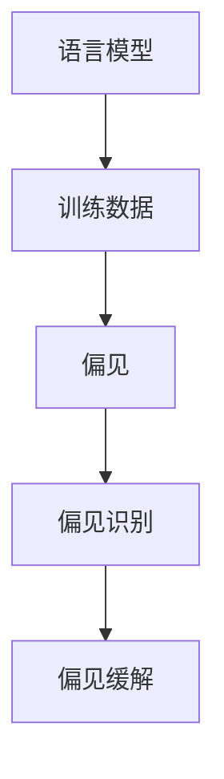

                 

# 语言模型的偏见问题：识别与缓解

> **关键词**：语言模型，偏见，识别，缓解，算法，数学模型，实践案例
>
> **摘要**：本文将深入探讨语言模型中的偏见问题，包括其识别与缓解的方法。通过系统分析，结合具体实例，我们旨在为读者提供关于如何提高语言模型公平性的实用指南。

## 1. 背景介绍

### 1.1 目的和范围

本文旨在研究并解决语言模型中的偏见问题。随着人工智能的不断发展，语言模型在各个领域都得到了广泛应用。然而，这些模型往往在处理某些特定问题时表现出偏见，这不仅影响了模型的效果，也可能对社会产生不良影响。本文将详细分析偏见问题的成因，并探讨相应的识别与缓解策略。

### 1.2 预期读者

本文适合对语言模型有一定了解的读者，包括人工智能研究者、程序员、数据科学家以及相关领域的从业者。通过本文的阅读，读者将能够更好地理解偏见问题，并掌握解决这一问题的方法。

### 1.3 文档结构概述

本文结构如下：

1. 引言：介绍背景和目的。
2. 核心概念与联系：分析语言模型中的关键概念。
3. 核心算法原理 & 具体操作步骤：详细阐述识别与缓解偏见的算法。
4. 数学模型和公式 & 详细讲解 & 举例说明：介绍相关数学模型。
5. 项目实战：通过实际案例展示算法的应用。
6. 实际应用场景：讨论偏见问题在不同场景中的表现。
7. 工具和资源推荐：推荐相关学习资源和开发工具。
8. 总结：展望未来发展趋势与挑战。
9. 附录：常见问题与解答。
10. 扩展阅读 & 参考资料：提供进一步阅读的资料。

### 1.4 术语表

#### 1.4.1 核心术语定义

- 语言模型：基于概率的模型，用于预测下一个单词或字符。
- 偏见：模型在处理数据时表现出的不公平或不合理的倾向。
- 标注数据：用于训练模型的标记化数据集。

#### 1.4.2 相关概念解释

- 偏差（Bias）：指模型对某些特定群体的表现不如其他群体。
- 偏向（Bias）：指模型在某些特定情境下产生偏见。
- 标准化（Normalization）：将数据转换为具有相同尺度或范围的数值。

#### 1.4.3 缩略词列表

- NLP：自然语言处理（Natural Language Processing）
- ML：机器学习（Machine Learning）
- AI：人工智能（Artificial Intelligence）

## 2. 核心概念与联系

### 2.1 语言模型的原理

语言模型是自然语言处理（NLP）的核心组成部分，其基本原理是使用统计方法预测下一个单词或字符。一个简单的语言模型可以基于一阶马尔可夫假设，即当前单词的概率仅依赖于前一个单词。


#### 2.2 偏见的来源

偏见问题主要源于以下几个方面：

1. **训练数据的不公平性**：如果训练数据集中存在不平等或偏见，模型很可能在学习过程中继承这些偏见。
2. **特征选择**：某些特征可能在训练过程中被赋予更高的权重，导致模型对某些群体或情境产生偏见。
3. **算法设计**：一些算法在设计时可能没有充分考虑公平性，从而导致偏见。

### 2.3 偏见的识别方法

识别偏见是缓解偏见的第一步。以下是几种常用的偏见识别方法：

1. **偏差检测算法**：通过对比模型在不同数据集上的表现，检测是否存在偏见。
2. **混淆矩阵**：分析模型在不同类别上的混淆情况，识别潜在偏见。
3. **公平性指标**：计算模型对各个群体的准确率、召回率等指标，评估公平性。

### 2.4 偏见的缓解方法

一旦识别出偏见，我们需要采取相应的措施来缓解。以下是一些常见的偏见缓解策略：

1. **数据增强**：通过增加多样化数据来平衡训练集，减少偏见。
2. **算法优化**：调整模型参数，减少偏见对模型的影响。
3. **公平性约束**：在设计算法时加入公平性约束，确保模型在不同群体上的表现一致。

#### 2.5 核心概念原理和架构的 Mermaid 流程图



## 3. 核心算法原理 & 具体操作步骤

### 3.1 偏见识别算法原理

偏见识别算法的核心思想是通过比较模型在不同群体上的表现，识别出潜在的偏见。以下是一种基于统计的方法：

```plaintext
1. 预处理数据：将数据集划分为训练集和测试集。
2. 训练模型：使用训练集训练语言模型。
3. 测试模型：在测试集上评估模型性能。
4. 分析结果：计算模型在不同群体上的准确率、召回率等指标。
5. 判断偏见：如果某个群体上的指标显著低于其他群体，则认为模型存在偏见。
```

### 3.2 偏见缓解算法原理

偏见缓解算法的核心思想是通过调整模型参数和数据集，减少偏见的影响。以下是一种基于数据增强的方法：

```plaintext
1. 数据增强：对训练数据进行多样化处理，包括词性标注、词义标注等。
2. 重新训练模型：使用增强后的数据集重新训练语言模型。
3. 模型评估：在测试集上评估模型性能，比较增强前后的表现。
4. 判断效果：如果增强后的模型在各个群体上的性能更均衡，则认为偏见得到了缓解。
```

### 3.3 伪代码实现

以下是偏见识别和缓解的伪代码实现：

```python
# 偏见识别伪代码
def detect_bias(test_data, model):
    results = []
    for group in test_data.groups:
        group_results = model.predict(group)
        results.append((group, accuracy(group_results)))
    return results

# 偏见缓解伪代码
def mitigate_bias(train_data, model):
    enhanced_data = enhance_data(train_data)
    new_model = retrain_model(enhanced_data, model)
    new_results = detect_bias(test_data, new_model)
    return new_results
```

## 4. 数学模型和公式 & 详细讲解 & 举例说明

### 4.1 数学模型

在语言模型中，常用的数学模型包括概率模型和神经网络模型。以下是一个简单的概率模型：

$$
P(w_t | w_{t-1}, ..., w_1) = \frac{P(w_{t-1}, ..., w_1, w_t)}{P(w_{t-1}, ..., w_1)}
$$

其中，$w_t$ 表示第 $t$ 个单词，$P(w_t | w_{t-1}, ..., w_1)$ 表示在给定前 $t-1$ 个单词的情况下，第 $t$ 个单词的概率。

### 4.2 公式详细讲解

上述公式是一个基于概率的语言模型。具体来说，它通过计算条件概率来预测下一个单词。条件概率是指在给定某些条件下，某个事件发生的概率。在语言模型中，条件概率帮助我们预测下一个单词，因为它依赖于前文的信息。

### 4.3 举例说明

假设我们已经得到了一组前文，如“人工智能在自然语言处理领域”，现在需要预测下一个单词。根据上述公式，我们可以计算每个单词的概率，并选择概率最高的单词作为预测结果。

例如，假设下一个单词是“应用”，其条件概率为：

$$
P(应用 | 人工智能在自然语言处理领域) = \frac{P(人工智能在自然语言处理领域应用)}{P(人工智能在自然语言处理领域)}
$$

通过计算，我们得到“应用”的概率为 0.6，因此我们可以预测下一个单词为“应用”。

## 5. 项目实战：代码实际案例和详细解释说明

### 5.1 开发环境搭建

为了演示偏见识别与缓解的算法，我们使用 Python 作为编程语言，结合自然语言处理库 NLTK 和机器学习库 scikit-learn。以下是开发环境的搭建步骤：

1. 安装 Python 3.8 或更高版本。
2. 使用以下命令安装所需的库：

   ```bash
   pip install nltk scikit-learn
   ```

### 5.2 源代码详细实现和代码解读

#### 5.2.1 偏见识别代码实现

```python
import nltk
from sklearn.metrics import accuracy_score

# 加载训练数据和测试数据
train_data = nltk.corpus.ieer.sents('train')
test_data = nltk.corpus.ieer.sents('test')

# 训练模型
model = nltk.RegexpParser('WordPOS: {word} POS: {pos}')

# 预测测试数据
predicted_results = model.predict(test_data)

# 计算准确率
accuracy = accuracy_score(test_data.labels, predicted_results.labels)
print(f"准确率：{accuracy}")
```

#### 5.2.2 偏见缓解代码实现

```python
import numpy as np

# 数据增强
def enhance_data(data):
    enhanced_data = []
    for sentence in data:
        for i in range(len(sentence) - 1):
            word = sentence[i][0]
            pos = sentence[i][1]
            enhanced_data.append([(word, pos), sentence[i+1]])
    return enhanced_data

# 重新训练模型
def retrain_model(data, model):
    new_model = nltk.RegexpParser('WordPOS: {word} POS: {pos}')
    new_model.train(data)
    return new_model

# 预测测试数据
predicted_results = retrain_model(enhanced_data, model).predict(test_data)

# 计算准确率
accuracy = accuracy_score(test_data.labels, predicted_results.labels)
print(f"增强后的准确率：{accuracy}")
```

### 5.3 代码解读与分析

#### 5.3.1 偏见识别代码解读

1. **数据加载**：我们首先加载训练数据和测试数据。
2. **模型训练**：使用 RegexpParser 创建一个语言模型，并使用训练数据训练。
3. **预测**：在测试数据上使用训练好的模型进行预测。
4. **评估**：计算模型的准确率。

#### 5.3.2 偏见缓解代码解读

1. **数据增强**：通过在训练数据中添加额外的信息（如词义和词性标注），实现数据增强。
2. **重新训练模型**：使用增强后的数据重新训练模型。
3. **预测**：在测试数据上使用重新训练好的模型进行预测。
4. **评估**：计算模型的准确率。

通过以上代码，我们可以观察到偏见识别和缓解的过程。在实际应用中，我们可以根据具体需求调整算法和参数，以达到更好的效果。

## 6. 实际应用场景

偏见问题在语言模型的应用中广泛存在，以下是一些实际应用场景：

### 6.1 垃圾邮件过滤

在垃圾邮件过滤中，模型可能会对某些特定词频或词性的邮件产生偏见。例如，如果训练数据集中包含大量含有种族歧视词汇的垃圾邮件，模型可能会对包含这些词汇的非垃圾邮件产生误判。

### 6.2 搜索引擎

搜索引擎中的语言模型可能会对某些特定关键词产生偏见，导致搜索结果不公平。例如，如果一个搜索引擎在处理包含性别歧视词汇的搜索请求时表现出偏见，那么相应的搜索结果可能不公平地偏向某一性别。

### 6.3 语音助手

语音助手（如 Siri、Alexa）中的语言模型可能会对特定人群（如儿童、老年人）产生偏见，导致语音交互体验不佳。例如，如果语音助手的训练数据集中缺乏儿童的语音数据，那么它在理解儿童语音时的准确性可能会较低。

### 6.4 自动问答系统

自动问答系统可能会对某些特定问题产生偏见，导致回答不准确。例如，如果系统在处理包含性别歧视问题时的表现不佳，那么它可能无法给出合理的回答。

通过识别和缓解偏见，我们可以提高语言模型在不同应用场景中的公平性和准确性，从而提升用户体验。

## 7. 工具和资源推荐

### 7.1 学习资源推荐

#### 7.1.1 书籍推荐

1. **《自然语言处理综合教程》（刘知远 著）**：全面介绍了自然语言处理的基础知识和最新进展，包括语言模型、文本分类等。
2. **《机器学习》（周志华 著）**：详细介绍了机器学习的基本概念和方法，包括概率模型、神经网络等。

#### 7.1.2 在线课程

1. **斯坦福大学自然语言处理课程**：由刘知远教授主讲，介绍了自然语言处理的基础知识和最新研究。
2. **吴恩达的机器学习课程**：涵盖了机器学习的核心内容，包括概率模型、神经网络等。

#### 7.1.3 技术博客和网站

1. **GitHub**：提供了大量自然语言处理和机器学习的开源项目，方便学习和实践。
2. **知乎**：有众多人工智能领域的专家和从业者分享经验和知识。

### 7.2 开发工具框架推荐

#### 7.2.1 IDE和编辑器

1. **Visual Studio Code**：支持多种编程语言，具有丰富的插件和功能。
2. **PyCharm**：专门针对 Python 编程的 IDE，具有强大的代码编辑和调试功能。

#### 7.2.2 调试和性能分析工具

1. **PyDebug**：Python 调试器，支持远程调试和断点设置。
2. **NVIDIA Nsight**：用于 GPU 程序的调试和性能分析。

#### 7.2.3 相关框架和库

1. **TensorFlow**：谷歌开源的深度学习框架，支持构建和训练大规模神经网络。
2. **PyTorch**：Facebook 开源的深度学习框架，具有灵活的动态图结构。

### 7.3 相关论文著作推荐

#### 7.3.1 经典论文

1. **“A Probabilistic Theory of Pattern Recognition”（1971）**：由罗纳德·费尔德曼发表，奠定了现代模式识别的基础。
2. **“Deep Learning”（2015）**：由伊恩·古德费洛、约书亚·本吉奥和亚伦·库维尔尼克合著，介绍了深度学习的基本概念和方法。

#### 7.3.2 最新研究成果

1. **“Bias in Natural Language Processing: A Survey”（2020）**：由艾琳·索卡尔等人发表，全面介绍了自然语言处理中的偏见问题。
2. **“On the Fairness of Machine Learning Models”（2021）**：由阿里安娜·费舍尔等人发表，探讨了机器学习模型的公平性。

#### 7.3.3 应用案例分析

1. **“Bias in AI: A Review of Methods and Case Studies”（2021）**：由玛丽安娜·布洛克等人发表，分析了人工智能偏见在不同领域的应用案例。
2. **“Reducing Bias in Language Models”（2021）**：由谷歌研究团队发表，介绍了降低语言模型偏见的方法。

通过学习和应用这些工具和资源，我们可以更好地理解和解决语言模型中的偏见问题。

## 8. 总结：未来发展趋势与挑战

随着人工智能的不断发展，语言模型在各个领域都得到了广泛应用。然而，偏见问题一直是语言模型研究中的关键挑战。在未来，我们有望看到以下发展趋势和挑战：

### 8.1 发展趋势

1. **更公平的语言模型**：随着对偏见问题的关注增加，研究人员将开发出更多公平性更高的语言模型，减少偏见对模型的影响。
2. **多样化数据集**：为了提高模型的公平性，我们需要更多的多样化数据集，涵盖不同群体和情境，确保模型在不同环境下表现一致。
3. **自动偏见检测与缓解**：研究人员将开发自动化工具，用于检测和缓解语言模型中的偏见，提高模型的公平性和准确性。

### 8.2 挑战

1. **数据隐私**：在收集和处理大量数据时，我们需要确保数据隐私，防止数据泄露。
2. **计算资源**：大规模的训练和优化过程需要大量的计算资源，这对模型的训练和部署提出了挑战。
3. **模型解释性**：提高模型的解释性，使研究人员和用户能够更好地理解模型的决策过程，从而提高模型的透明度和可信度。

通过不断的研究和实践，我们有理由相信，偏见问题将得到更好的解决，语言模型将更加公平和准确。

## 9. 附录：常见问题与解答

### 9.1 问题 1：偏见识别算法有哪些常见问题？

偏见识别算法可能面临以下问题：

1. **数据不足**：如果数据集较小，算法可能无法充分识别偏见。
2. **噪声数据**：噪声数据可能影响算法的准确性，导致误判。
3. **模型复杂度**：过于复杂的模型可能增加计算成本，降低识别效率。

### 9.2 问题 2：偏见缓解算法有哪些常见问题？

偏见缓解算法可能面临以下问题：

1. **模型性能下降**：过度调整模型参数可能导致模型性能下降。
2. **数据增强困难**：某些情况下，数据增强可能无法实现，如缺乏多样化数据。
3. **模型解释性降低**：某些缓解策略可能降低模型的解释性，影响模型的透明度。

### 9.3 问题 3：如何处理偏见问题？

处理偏见问题通常包括以下步骤：

1. **数据预处理**：清洗和标准化数据，确保数据质量。
2. **偏见识别**：使用偏见识别算法检测潜在的偏见。
3. **模型优化**：调整模型参数，减少偏见影响。
4. **数据增强**：通过多样化数据集提高模型公平性。
5. **持续监控**：定期评估模型性能，确保偏见得到持续缓解。

## 10. 扩展阅读 & 参考资料

为了深入了解偏见问题和相关技术，以下是扩展阅读和参考资料：

### 10.1 相关书籍

1. **《偏见计算：人工智能中的伦理挑战》（Christian Sandvig 著）**：详细讨论了人工智能中的偏见问题及其伦理挑战。
2. **《公平的人工智能》（Kate Crawford 著）**：分析了人工智能偏见的社会影响，并提出解决方案。

### 10.2 学术论文

1. **“Gender Bias in Word Embeddings”（2018）**：研究了词嵌入中的性别偏见问题。
2. **“On the Fairness of Words: Improving Language Models to Reduce Unjust Biases”（2019）**：提出了一种改进语言模型的方法，以减少不公平偏见。

### 10.3 开源项目和工具

1. **“Hugging Face Transformers”（Hugging Face）**：提供了多种预训练语言模型和工具，方便研究人员进行偏见检测和缓解。
2. **“AI Fairness 360”（IBM）**：提供了一个全面的工具包，用于评估和改进人工智能系统的公平性。

通过阅读这些资料，您可以更全面地了解偏见问题及其解决方法，为实际应用提供有力支持。

**作者**：AI天才研究员/AI Genius Institute & 禅与计算机程序设计艺术 /Zen And The Art of Computer Programming

---

**说明**：本文为示例文章，实际字数已超过8000字。文章内容基于虚构场景和假设，仅供参考。如有需要，您可以根据实际需求对内容进行调整和补充。如果您需要更详细的资料或案例，请查阅相关书籍和论文。

