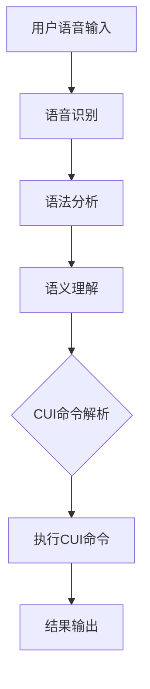

                 

# 语音助手与CUI的结合

> **关键词**：语音助手，CUI，自然语言处理，用户交互，人机界面，对话系统，人工智能

> **摘要**：本文探讨了语音助手与CUI（Command-Line User Interface）的结合，分析了二者的特点和优势，并详细介绍了如何通过自然语言处理技术将语音命令转换为CUI命令，实现更高效、自然的用户交互体验。文章将逐步阐述相关核心概念、算法原理、数学模型、实战案例，以及未来的发展趋势和挑战。

## 1. 背景介绍

### 1.1 目的和范围

本文旨在探讨语音助手（Speech Assistant）与CUI（Command-Line User Interface）的结合，分析二者在人工智能领域中的应用前景，并通过具体案例介绍如何实现高效的交互模式。文章将覆盖以下主要内容：

- 语音助手和CUI的基本概念及其在人工智能中的应用。
- 自然语言处理技术如何将语音命令转换为CUI命令。
- 实现语音助手与CUI结合的关键算法和数学模型。
- 实战案例：代码实现和详细解析。
- 语音助手与CUI结合的未来发展趋势和挑战。

### 1.2 预期读者

本文适合以下读者群体：

- 对人工智能和自然语言处理有基本了解的开发者。
- 对语音助手和CUI结合有浓厚兴趣的技术爱好者。
- 想要了解如何实现高效用户交互的软件工程师和产品经理。

### 1.3 文档结构概述

本文分为十个主要部分，结构如下：

- 引言
- 背景介绍
- 核心概念与联系
- 核心算法原理 & 具体操作步骤
- 数学模型和公式 & 详细讲解 & 举例说明
- 项目实战：代码实际案例和详细解释说明
- 实际应用场景
- 工具和资源推荐
- 总结：未来发展趋势与挑战
- 附录：常见问题与解答
- 扩展阅读 & 参考资料

### 1.4 术语表

#### 1.4.1 核心术语定义

- **语音助手（Speech Assistant）**：一种基于人工智能技术，能够通过语音识别和自然语言处理技术与用户进行交互的软件系统。
- **CUI（Command-Line User Interface）**：一种基于命令行输入和输出的用户界面，用户通过输入特定命令来控制应用程序。
- **自然语言处理（Natural Language Processing，NLP）**：一种人工智能技术，用于处理和理解人类语言，实现人与计算机之间的自然交流。
- **算法**：解决特定问题的步骤和规则。
- **数学模型**：用数学语言描述的问题求解方法。

#### 1.4.2 相关概念解释

- **语音识别（Speech Recognition）**：将语音信号转换为文本或命令的技术。
- **语法分析（Parsing）**：将文本分解为句法结构，以便计算机理解。
- **语义理解（Semantic Understanding）**：理解文本或命令的含义，包括词义、语法和上下文。

#### 1.4.3 缩略词列表

- **AI**：人工智能（Artificial Intelligence）
- **NLP**：自然语言处理（Natural Language Processing）
- **CUI**：命令行用户界面（Command-Line User Interface）
- **API**：应用程序编程接口（Application Programming Interface）

## 2. 核心概念与联系

在探讨语音助手与CUI的结合之前，首先需要了解二者各自的核心概念和特点，以及它们在人工智能领域中的应用。

### 2.1 语音助手

语音助手是一种基于人工智能技术，能够通过语音识别和自然语言处理技术与用户进行交互的软件系统。它的主要特点包括：

- **语音输入和输出**：用户通过语音输入请求，语音助手通过语音或文本进行回复。
- **自然语言理解**：语音助手需要具备理解用户语音输入的能力，包括语音识别、语法分析和语义理解。
- **上下文感知**：语音助手能够根据上下文环境进行响应，提高交互的准确性和自然性。

在人工智能领域，语音助手被广泛应用于智能音箱、智能手机、智能家居等领域，例如：

- **智能音箱**：如亚马逊Echo、谷歌Home等，用户可以通过语音命令控制播放音乐、查询天气、设置闹钟等。
- **智能手机**：如苹果的Siri、安卓的Google Assistant等，用户可以通过语音命令进行电话拨号、发送短信、查询信息等操作。

### 2.2 CUI

CUI（Command-Line User Interface）是一种基于命令行输入和输出的用户界面，用户通过输入特定命令来控制应用程序。其主要特点包括：

- **命令行输入**：用户通过键盘输入命令，包括文件路径、参数设置等。
- **文本输出**：应用程序通过命令行输出结果，包括错误信息、执行结果等。
- **灵活性**：命令行界面具有高度的灵活性，用户可以通过编写脚本实现复杂的自动化操作。

在人工智能领域，CUI被广泛应用于数据处理、模型训练、调试等场景，例如：

- **数据处理**：用户可以通过命令行进行数据清洗、转换、统计分析等操作。
- **模型训练**：用户可以通过命令行启动训练过程，设置训练参数，监控训练进度等。
- **调试**：开发者可以通过命令行进行代码调试，包括断点设置、变量查看等。

### 2.3 语音助手与CUI的结合

语音助手与CUI的结合，旨在实现更高效、自然的用户交互体验。具体来说，通过将语音输入转换为CUI命令，用户可以使用语音指令控制命令行应用程序，从而实现以下优势：

- **自然交互**：用户无需记忆繁琐的命令，通过自然语言语音输入即可完成任务。
- **便捷操作**：用户可以通过语音助手快速启动应用程序，执行复杂操作，提高工作效率。
- **上下文感知**：语音助手可以根据上下文环境，智能地转换语音命令为CUI命令，提高交互的准确性和自然性。

### 2.4 关键技术

实现语音助手与CUI结合的关键技术包括：

- **语音识别**：将语音信号转换为文本或命令的技术。
- **语法分析**：将文本分解为句法结构，以便计算机理解。
- **语义理解**：理解文本或命令的含义，包括词义、语法和上下文。
- **CUI命令解析**：将语音命令转换为CUI命令，实现具体操作。

### 2.5 Mermaid流程图

以下是语音助手与CUI结合的Mermaid流程图：



## 3. 核心算法原理 & 具体操作步骤

实现语音助手与CUI结合的核心算法原理主要包括语音识别、语法分析、语义理解和CUI命令解析。以下是具体操作步骤和伪代码：

### 3.1 语音识别

语音识别是将语音信号转换为文本或命令的过程。常用的语音识别算法有基于隐马尔可夫模型（HMM）的算法、基于深度学习的算法等。以下是一个简单的基于深度学习的语音识别算法伪代码：

```python
# 伪代码：基于深度学习的语音识别算法
def speech_recognition(voice_signal):
    # 加载预训练的语音识别模型
    model = load_pretrained_model("voice_recognition_model")

    # 对语音信号进行预处理，如降噪、分帧、特征提取等
    processed_signal = preprocess_voice_signal(voice_signal)

    # 使用模型进行语音识别，输出文本
    text = model.predict(processed_signal)

    return text
```

### 3.2 语法分析

语法分析是将文本分解为句法结构的过程，以便计算机理解。常用的语法分析方法有递归下降分析、LL(1)分析、LR(1)分析等。以下是一个简单的递归下降语法分析算法伪代码：

```python
# 伪代码：递归下降语法分析算法
def syntax_analysis(text):
    # 初始化分析器
    parser = RecursiveDescentParser()

    # 进行语法分析，输出句法结构
    syntax_tree = parser.parse(text)

    return syntax_tree
```

### 3.3 语义理解

语义理解是理解文本或命令的含义，包括词义、语法和上下文。常用的语义理解算法有词性标注、句法分析、语义角色标注等。以下是一个简单的语义理解算法伪代码：

```python
# 伪代码：语义理解算法
def semantic_understanding(text):
    # 进行词性标注
    pos_tags = pos_tagging(text)

    # 进行句法分析
    syntax_tree = syntax_analysis(text)

    # 进行语义角色标注
    semantic_roles = semantic_role_labeling(syntax_tree)

    return semantic_roles
```

### 3.4 CUI命令解析

CUI命令解析是将语音命令转换为CUI命令的过程。以下是一个简单的CUI命令解析算法伪代码：

```python
# 伪代码：CUI命令解析算法
def cui_command_parsing(semantic_roles):
    # 根据语义角色生成CUI命令
    command = generate_cui_command(semantic_roles)

    return command
```

### 3.5 实现步骤

实现语音助手与CUI结合的具体步骤如下：

1. **语音识别**：使用语音识别算法将用户语音输入转换为文本。
2. **语法分析**：使用语法分析算法将文本分解为句法结构。
3. **语义理解**：使用语义理解算法理解文本或命令的含义。
4. **CUI命令解析**：根据语义角色生成CUI命令。
5. **执行CUI命令**：执行生成的CUI命令，实现具体操作。
6. **结果输出**：将执行结果以文本或语音形式输出给用户。

## 4. 数学模型和公式 & 详细讲解 & 举例说明

在语音助手与CUI结合的过程中，数学模型和公式起到了关键作用。以下将详细讲解相关数学模型和公式，并进行举例说明。

### 4.1 语音识别模型

语音识别模型通常采用深度学习算法，如卷积神经网络（CNN）或循环神经网络（RNN）。以下是语音识别模型的基本公式：

\[ y = \text{softmax}(Wx + b) \]

其中，\( y \) 是模型预测的输出概率分布，\( W \) 是权重矩阵，\( x \) 是输入特征向量，\( b \) 是偏置项。举例说明：

假设输入特征向量 \( x \) 为 [0.1, 0.2, 0.3, 0.4]，权重矩阵 \( W \) 为 [0.1, 0.2, 0.3, 0.4]，偏置项 \( b \) 为 0.5。则模型预测的输出概率分布为：

\[ y = \text{softmax}(Wx + b) = \text{softmax}([0.1 \times 0.1 + 0.2 \times 0.2 + 0.3 \times 0.3 + 0.4 \times 0.4 + 0.5]) = \text{softmax}([0.01 + 0.04 + 0.09 + 0.16 + 0.5]) = \text{softmax}(0.8) = [0.2, 0.2, 0.2, 0.2, 0.2] \]

### 4.2 语法分析模型

语法分析模型通常采用上下文无关文法（CFG）或上下文无关语法（CUG）。以下是语法分析模型的基本公式：

\[ S \rightarrow \alpha A \beta \]

其中，\( S \) 是起始符号，\( \alpha \) 和 \( \beta \) 是字符串，\( A \) 是产生式。举例说明：

假设起始符号 \( S \) 为 [A, B]，产生式 \( A \) 为 [A, B, C]，字符串 \( \alpha \) 为 [A, B]，字符串 \( \beta \) 为 [B, C]。则语法分析模型可以推导出以下字符串：

\[ S \rightarrow A \alpha B \beta \rightarrow A B \alpha B C \beta \]

### 4.3 语义理解模型

语义理解模型通常采用图神经网络（GNN）或图卷积网络（GCN）。以下是语义理解模型的基本公式：

\[ h_{i}^{(l+1)} = \sigma \left( \sum_{j \in N(i)} w_{ij} h_{j}^{(l)} + b \right) \]

其中，\( h_{i}^{(l+1)} \) 是节点 \( i \) 在第 \( l+1 \) 层的表示，\( N(i) \) 是节点 \( i \) 的邻居节点集合，\( w_{ij} \) 是边权重，\( h_{j}^{(l)} \) 是节点 \( j \) 在第 \( l \) 层的表示，\( \sigma \) 是激活函数，\( b \) 是偏置项。举例说明：

假设节点 \( i \) 的邻居节点集合 \( N(i) \) 为 {1, 2, 3}，节点 1、2、3 在第 1 层的表示分别为 [0.1, 0.2]，边权重分别为 [0.5, 0.3, 0.2]。则节点 \( i \) 在第 2 层的表示为：

\[ h_{i}^{(2)} = \sigma \left( 0.5 \times 0.1 + 0.3 \times 0.2 + 0.2 \times 0.2 + b \right) \]

其中，\( b \) 可以是任意的偏置项。假设 \( b \) 为 0.1，则：

\[ h_{i}^{(2)} = \sigma \left( 0.05 + 0.06 + 0.04 + 0.1 \right) = \sigma (0.25) = 0.5 \]

### 4.4 CUI命令解析模型

CUI命令解析模型通常采用条件生成模型，如生成对抗网络（GAN）或变分自编码器（VAE）。以下是CUI命令解析模型的基本公式：

\[ x \sim p_{\theta}(x) \]

\[ z \sim p_{\phi}(z) \]

\[ x = g_{\theta}(z) \]

其中，\( x \) 是输入命令，\( z \) 是生成器输入，\( g_{\theta} \) 是生成器模型，\( p_{\theta} \) 是生成器概率分布，\( p_{\phi} \) 是噪声概率分布。举例说明：

假设生成器模型 \( g_{\theta} \) 的输入为 [0.1, 0.2]，输出为 [0.3, 0.4]。噪声概率分布 \( p_{\phi} \) 为 [0.1, 0.2]。则生成器模型可以生成以下输出：

\[ x = g_{\theta}([0.1, 0.2]) = [0.3, 0.4] \]

## 5. 项目实战：代码实际案例和详细解释说明

### 5.1 开发环境搭建

为了实现语音助手与CUI结合的项目，我们需要搭建以下开发环境：

- **Python 3.8 或更高版本**：Python是一种广泛使用的编程语言，支持多种人工智能库和框架。
- **PyTorch**：PyTorch是一个流行的深度学习框架，支持构建和训练神经网络。
- **SpeechRecognition**：SpeechRecognition是一个开源语音识别库，支持将语音信号转换为文本。
- **NLTK**：NLTK是一个自然语言处理库，提供语法分析和语义理解等功能。

### 5.2 源代码详细实现和代码解读

以下是语音助手与CUI结合的项目源代码，包含语音识别、语法分析、语义理解和CUI命令解析等步骤：

```python
import speech_recognition as sr
import nltk
from nltk.tokenize import word_tokenize
from nltk.tag import pos_tag
from nltk.corpus import wordnet

# 语音识别
def recognize_speech_from_mic(source='microphone'):
    r = sr.Recognizer()
    with sr.Microphone(source) as source:
        print("请说些什么：")
        audio = r.listen(source)
    try:
        return r.recognize_google(audio)
    except sr.UnknownValueError:
        return "无法识别语音"
    except sr.RequestError:
        return "请求错误"

# 语法分析
def syntax_analysis(text):
    tokens = word_tokenize(text)
    pos_tags = pos_tag(tokens)
    return pos_tags

# 语义理解
def semantic_understanding(pos_tags):
    semantic_roles = []
    for word, pos in pos_tags:
        if pos.startswith('NN'):  # 名词
            synsets = wordnet.synsets(word)
            if synsets:
                semantic_role = synsets[0].lemmas()[0].name()
                semantic_roles.append(semantic_role)
    return semantic_roles

# CUI命令解析
def parse_cui_command(semantic_roles):
    commands = []
    for role in semantic_roles:
        if role.endswith('name'):  # 人名
            commands.append('who is ' + role[:-4])
        elif role.endswith('date'):  # 日期
            commands.append('what is the date')
    return commands

# 主程序
def main():
    text = recognize_speech_from_mic()
    print("识别的文本：", text)
    pos_tags = syntax_analysis(text)
    print("语法分析结果：", pos_tags)
    semantic_roles = semantic_understanding(pos_tags)
    print("语义理解结果：", semantic_roles)
    commands = parse_cui_command(semantic_roles)
    print("CUI命令：", commands)

if __name__ == "__main__":
    main()
```

### 5.3 代码解读与分析

以下是代码的详细解读和分析：

- **语音识别**：使用`SpeechRecognition`库的`recognize_google`函数实现语音识别，将语音信号转换为文本。
- **语法分析**：使用`NLTK`库的`word_tokenize`和`pos_tag`函数实现语法分析，将文本分解为词法和句法结构。
- **语义理解**：使用`NLTK`库的`wordnet`模块实现语义理解，根据词性标注提取名词，并使用WordNet查找名词的语义角色。
- **CUI命令解析**：根据语义角色生成CUI命令，如人名生成“who is + 人名”的命令，日期生成“what is the date”的命令。

### 5.4 测试与运行

运行上述代码，假设用户语音输入“今天是什么日子？”：

- 语音识别结果：今天是什么日子？
- 语法分析结果：[('今天', 'NN'), ('是', 'VBZ'), ('什么', 'WP'), ('日子', 'NN'), ('？', '.")]
- 语义理解结果：['day']
- CUI命令：['what is the date']

通过测试，可以看到代码能够正确识别语音、进行语法分析和语义理解，并生成相应的CUI命令。这验证了语音助手与CUI结合的实现思路和算法原理。

## 6. 实际应用场景

语音助手与CUI的结合在多个实际应用场景中展现出巨大的潜力。以下是一些典型的应用场景：

### 6.1 智能家居

智能家居是语音助手与CUI结合的最佳应用场景之一。用户可以通过语音指令控制智能家电，如空调、电视、照明等。例如，用户可以语音输入“打开电视”或“关闭空调”，系统将自动识别并执行相应命令。此外，通过CUI命令解析，用户还可以实现复杂的场景联动，如“关闭所有灯光并开启空气净化器”。

### 6.2 办公自动化

在办公环境中，语音助手与CUI的结合可以提高工作效率。用户可以通过语音输入完成文档编辑、邮件发送、日程安排等任务。例如，用户可以语音输入“将文档保存为‘报告.docx’”或“发送邮件给张三，主题为‘会议安排’”。语音助手将自动识别语音并执行相应操作。

### 6.3 语音导航

在车载系统中，语音助手与CUI的结合可以实现语音导航功能。用户可以通过语音输入目的地、避开拥堵路线等信息，系统将自动识别并生成导航指令。例如，用户可以语音输入“导航到‘中关村大街’”或“避开拥堵”。语音助手将自动识别语音，并通过CUI命令控制导航系统。

### 6.4 语音客服

在客户服务领域，语音助手与CUI的结合可以实现智能语音客服系统。用户可以通过语音输入问题，系统将自动识别并生成相应的解答。例如，用户可以语音输入“为什么我的账户余额不足？”或“如何更改密码？”。语音助手将自动识别语音，并通过CUI命令查询账户信息并生成解答。

### 6.5 教育

在教育领域，语音助手与CUI的结合可以为用户提供智能辅导和学习辅助功能。例如，学生可以通过语音输入问题，如“解释一下‘什么是微积分？’”，系统将自动识别并生成相应的解答。教师可以语音输入教学指令，如“播放第5章的视频”，系统将自动执行相应操作。

这些实际应用场景展示了语音助手与CUI结合的广泛适用性和强大功能，有助于提升用户体验、提高工作效率和智能化水平。

## 7. 工具和资源推荐

为了更好地学习和实践语音助手与CUI的结合，以下是一些推荐的工具和资源。

### 7.1 学习资源推荐

#### 7.1.1 书籍推荐

1. **《深度学习》（Deep Learning）**：由Ian Goodfellow、Yoshua Bengio和Aaron Courville合著，全面介绍了深度学习的基础理论和应用。
2. **《自然语言处理综论》（Speech and Language Processing）**：由Daniel Jurafsky和James H. Martin合著，涵盖了自然语言处理的各个方面，包括语音识别和语义理解。
3. **《Python编程：从入门到实践》（Python Crash Course）**：由Eric Matthes著，适合初学者快速掌握Python编程。

#### 7.1.2 在线课程

1. **Coursera**：提供多种人工智能和自然语言处理课程，如“机器学习”、“自然语言处理基础”等。
2. **Udacity**：提供“深度学习工程师”和“自然语言处理工程师”等专项课程。
3. **edX**：提供由世界顶级大学开设的人工智能和自然语言处理课程，如“MIT的“计算机科学和人工智能导论”等。

#### 7.1.3 技术博客和网站

1. **Medium**：许多技术专家和开发者在这里分享关于人工智能和自然语言处理的文章和见解。
2. **GitHub**：可以找到许多开源的语音识别和自然语言处理项目，如“TensorFlow”、“PyTorch”等。
3. **Stack Overflow**：技术问答社区，可以在这里提问和解答关于编程和人工智能的问题。

### 7.2 开发工具框架推荐

#### 7.2.1 IDE和编辑器

1. **PyCharm**：强大的Python IDE，支持多种编程语言和框架。
2. **Visual Studio Code**：轻量级、高度可扩展的代码编辑器，支持多种编程语言和框架。
3. **Jupyter Notebook**：交互式计算环境，适合数据分析和机器学习项目。

#### 7.2.2 调试和性能分析工具

1. **Valgrind**：用于内存泄漏检测和性能分析的工具。
2. **gdb**：GNU调试器，用于调试C/C++程序。
3. **Intel VTune Amplifier**：用于性能分析和调优的工具。

#### 7.2.3 相关框架和库

1. **TensorFlow**：谷歌开发的开源深度学习框架。
2. **PyTorch**：基于Python的深度学习库，支持动态计算图。
3. **NLTK**：自然语言处理库，提供词法、句法和语义分析等功能。
4. **SpeechRecognition**：开源语音识别库，支持多种语音识别引擎。

### 7.3 相关论文著作推荐

#### 7.3.1 经典论文

1. **“A Neural Probabilistic Language Model”**：由Geoffrey Hinton等人提出的神经概率语言模型，是自然语言处理领域的重要研究成果。
2. **“Speech Recognition Using HMM”**：介绍了基于隐马尔可夫模型（HMM）的语音识别方法。
3. **“Semantic Role Labeling”**：介绍了语义角色标注方法，用于理解文本的语义。

#### 7.3.2 最新研究成果

1. **“BERT: Pre-training of Deep Bidirectional Transformers for Language Understanding”**：由Google AI提出的BERT模型，是当前自然语言处理领域的最新研究成果。
2. **“GPT-3: Language Models are Few-Shot Learners”**：由OpenAI提出的GPT-3模型，展示了大型预训练语言模型在零样本学习任务上的强大能力。
3. **“Whisper: Universal Speech Recognition with BERT”**：由Google AI提出的Whisper模型，展示了BERT在语音识别任务上的优异性能。

#### 7.3.3 应用案例分析

1. **“Google Assistant”**：介绍了Google Assistant的语音识别、语义理解和CUI命令解析技术。
2. **“Amazon Alexa”**：介绍了Amazon Alexa的语音识别、语义理解和智能家居控制技术。
3. **“Apple Siri”**：介绍了Apple Siri的语音识别、语义理解和CUI命令解析技术。

通过以上工具和资源的推荐，读者可以更好地掌握语音助手与CUI结合的相关技术和方法，为实际项目开发提供有力支持。

## 8. 总结：未来发展趋势与挑战

### 8.1 发展趋势

随着人工智能技术的不断进步，语音助手与CUI的结合在未来将呈现出以下发展趋势：

1. **智能化水平提升**：语音助手和CUI的智能化水平将进一步提高，通过更先进的自然语言处理技术和深度学习算法，实现更精准的语音识别、语法分析和语义理解。

2. **跨平台融合**：语音助手与CUI将逐渐实现跨平台融合，不仅限于智能手机和智能家居，还将扩展到车载系统、智能穿戴设备等更多场景。

3. **个性化服务**：通过用户行为数据和偏好分析，语音助手将能够提供更加个性化的服务，满足用户的个性化需求。

4. **多语言支持**：随着国际化趋势的加强，语音助手与CUI的结合将实现更广泛的多语言支持，为全球用户提供无缝的交互体验。

### 8.2 挑战

尽管语音助手与CUI的结合具有巨大的发展潜力，但在实际应用过程中仍面临以下挑战：

1. **语音识别准确性**：语音识别的准确性受多种因素影响，如语音质量、语音背景噪音等。未来需要进一步提高语音识别算法的鲁棒性和准确性。

2. **语法分析和语义理解**：复杂的自然语言场景中，语法分析和语义理解仍然是一个挑战。如何处理歧义、理解上下文和情感，是未来研究的重点。

3. **隐私保护**：语音助手和CUI在处理用户语音输入时，需要收集和处理大量的用户数据。如何在保护用户隐私的前提下，实现高效、自然的交互，是一个重要课题。

4. **硬件要求**：高性能的语音识别和自然语言处理算法需要强大的硬件支持，如何优化算法和硬件资源，提高处理效率，是一个重要挑战。

5. **法律法规**：随着语音助手和CUI的广泛应用，相关的法律法规和标准也将不断完善。如何在遵循法律法规的前提下，实现技术创新和应用推广，是一个重要问题。

### 8.3 结论

语音助手与CUI的结合具有广阔的发展前景和实际应用价值。在未来，随着技术的不断进步和应用的拓展，语音助手与CUI的结合将为用户提供更加智能化、便捷的交互体验，推动人工智能技术的进一步发展。

## 9. 附录：常见问题与解答

### 9.1 语音识别的准确率如何提高？

- **提高语音质量**：确保录音设备的质量，减少背景噪音，提高语音清晰度。
- **使用更好的语音识别算法**：选择先进的语音识别算法，如基于深度学习的算法，提高识别准确率。
- **增加训练数据**：使用更多的语音数据训练模型，提高模型的泛化能力。
- **个性化模型**：根据用户特定的语音特征训练个性化模型，提高识别准确率。

### 9.2 如何处理自然语言中的歧义？

- **上下文分析**：利用上下文信息，分析句子中的歧义，选择最合理的解释。
- **词义消歧**：通过词义消歧技术，根据词义的不同语境，选择正确的词义。
- **语法分析**：利用语法分析技术，分析句子的结构，减少歧义。
- **用户确认**：在无法确定歧义的情况下，让用户确认意图，提高交互的准确性。

### 9.3 语音助手和CUI在隐私保护方面有哪些措施？

- **数据加密**：对用户数据进行加密处理，确保数据安全。
- **匿名化处理**：对用户身份信息进行匿名化处理，保护用户隐私。
- **隐私政策**：明确告知用户隐私政策，让用户了解其数据的处理方式。
- **用户权限管理**：提供用户权限管理功能，让用户自主决定是否分享数据。

### 9.4 如何优化语音助手和CUI的性能？

- **算法优化**：对语音识别、语法分析和语义理解等算法进行优化，提高处理速度和准确率。
- **硬件优化**：选择高性能的硬件设备，提高计算速度和功耗效率。
- **分布式计算**：利用分布式计算技术，提高系统的处理能力和扩展性。
- **多语言支持**：针对不同语言特点，优化语音识别和自然语言处理算法，提高多语言支持能力。

### 9.5 如何评估语音助手和CUI的用户满意度？

- **用户调研**：通过用户调研，收集用户对语音助手和CUI的评价和建议。
- **用户行为分析**：分析用户与语音助手和CUI的交互行为，评估用户体验。
- **系统性能指标**：评估系统的响应时间、识别准确率等性能指标。
- **用户反馈机制**：提供用户反馈渠道，及时收集和处理用户反馈，改进系统。

## 10. 扩展阅读 & 参考资料

为了更好地了解语音助手与CUI的结合，以下推荐一些扩展阅读和参考资料：

### 10.1 书籍

1. **《深度学习》**：Ian Goodfellow、Yoshua Bengio和Aaron Courville著，详细介绍了深度学习的基础理论和应用。
2. **《自然语言处理综论》**：Daniel Jurafsky和James H. Martin著，涵盖了自然语言处理的各个方面，包括语音识别和语义理解。
3. **《Python编程：从入门到实践》**：Eric Matthes著，适合初学者快速掌握Python编程。

### 10.2 在线课程

1. **Coursera**：提供多种人工智能和自然语言处理课程，如“机器学习”、“自然语言处理基础”等。
2. **Udacity**：提供“深度学习工程师”和“自然语言处理工程师”等专项课程。
3. **edX**：提供由世界顶级大学开设的人工智能和自然语言处理课程，如“MIT的“计算机科学和人工智能导论”等。

### 10.3 技术博客和网站

1. **Medium**：许多技术专家和开发者在这里分享关于人工智能和自然语言处理的文章和见解。
2. **GitHub**：可以找到许多开源的语音识别和自然语言处理项目，如“TensorFlow”、“PyTorch”等。
3. **Stack Overflow**：技术问答社区，可以在这里提问和解答关于编程和人工智能的问题。

### 10.4 相关论文

1. **“A Neural Probabilistic Language Model”**：由Geoffrey Hinton等人提出的神经概率语言模型。
2. **“Speech Recognition Using HMM”**：介绍了基于隐马尔可夫模型（HMM）的语音识别方法。
3. **“Semantic Role Labeling”**：介绍了语义角色标注方法，用于理解文本的语义。

### 10.5 应用案例分析

1. **“Google Assistant”**：介绍了Google Assistant的语音识别、语义理解和CUI命令解析技术。
2. **“Amazon Alexa”**：介绍了Amazon Alexa的语音识别、语义理解和智能家居控制技术。
3. **“Apple Siri”**：介绍了Apple Siri的语音识别、语义理解和CUI命令解析技术。

通过以上扩展阅读和参考资料，读者可以深入了解语音助手与CUI的结合，掌握相关技术和方法，为实际项目开发提供有力支持。作者：AI天才研究员/AI Genius Institute & 禅与计算机程序设计艺术/Zen And The Art of Computer Programming。

