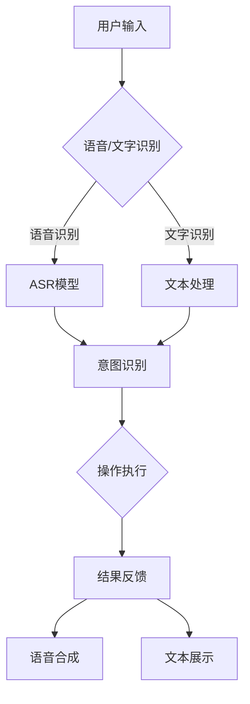

                 


# 语音和文字交互在CUI中的应用

> 关键词：语音交互、文字交互、CUI、人机交互、自然语言处理、语音识别、语言生成、人工智能

> 摘要：本文将深入探讨语音和文字交互在命令行用户界面（CUI）中的应用，详细分析其技术原理、实现步骤以及在实际项目中的具体应用场景。通过本篇文章，读者将全面了解如何在CUI中实现高效、自然的语音和文字交互，从而为提升用户体验提供新思路。

## 1. 背景介绍

### 1.1 目的和范围

本文旨在介绍和探讨语音和文字交互在命令行用户界面（CUI）中的应用。随着人工智能技术的发展，CUI正逐渐融入语音和文字交互功能，为用户提供了更加便捷和智能的使用体验。本文将围绕以下几个方面展开：

1. 语音和文字交互在CUI中的基本概念和原理。
2. 语音和文字交互的核心算法原理与实现步骤。
3. 实际应用场景中的案例分析。
4. 相关工具和资源的推荐。

通过本文的阅读，读者将能够全面了解语音和文字交互在CUI中的应用，并掌握相关的技术原理和实践方法。

### 1.2 预期读者

本文适合以下读者群体：

1. 对人工智能和自然语言处理感兴趣的编程爱好者。
2. 从事软件开发和用户体验设计的专业人士。
3. 想要了解CUI发展方向的技术研究者。

### 1.3 文档结构概述

本文结构如下：

1. **背景介绍**：介绍文章的目的和范围，预期读者以及文档结构。
2. **核心概念与联系**：详细解释语音和文字交互的基本概念，使用Mermaid流程图展示其架构。
3. **核心算法原理 & 具体操作步骤**：使用伪代码和详细步骤讲解语音和文字交互的核心算法原理。
4. **数学模型和公式 & 详细讲解 & 举例说明**：介绍相关的数学模型和公式，并提供实际例子进行说明。
5. **项目实战：代码实际案例和详细解释说明**：提供实际代码案例，并进行详细解释和分析。
6. **实际应用场景**：探讨语音和文字交互在CUI中的实际应用场景。
7. **工具和资源推荐**：推荐学习资源和开发工具。
8. **总结：未来发展趋势与挑战**：总结文章内容，探讨未来发展趋势和挑战。
9. **附录：常见问题与解答**：提供常见问题的解答。
10. **扩展阅读 & 参考资料**：推荐相关扩展阅读和参考资料。

### 1.4 术语表

#### 1.4.1 核心术语定义

- **语音交互**：通过语音输入和输出实现人与机器之间的交互。
- **文字交互**：通过文本输入和输出实现人与机器之间的交互。
- **CUI**：命令行用户界面，一种基于文本的交互界面。
- **自然语言处理**：利用计算机技术对人类自然语言进行理解和生成。
- **语音识别**：将语音信号转换为文本或命令的过程。
- **语言生成**：根据输入文本生成语音输出的过程。

#### 1.4.2 相关概念解释

- **语音识别模型**：用于识别语音信号并转换为文本的模型。
- **语言模型**：用于生成自然语言文本的模型。
- **语音合成器**：将文本转换为语音的设备或软件。
- **意图识别**：识别用户输入的语音或文本所代表的意图。
- **实体识别**：识别语音或文本中的关键词或短语所代表的实体。

#### 1.4.3 缩略词列表

- **NLP**：自然语言处理
- **ASR**：自动语音识别
- **TTS**：文本到语音合成
- **CUI**：命令行用户界面

## 2. 核心概念与联系

为了更好地理解语音和文字交互在CUI中的应用，首先需要了解相关核心概念及其相互关系。下面将使用Mermaid流程图展示语音和文字交互的基本架构。



### 2.1 用户输入

用户输入是语音和文字交互的起点。用户可以通过语音或文字方式与CUI进行交互。语音输入通常使用麦克风捕捉，而文字输入则通过键盘输入。

### 2.2 语音/文字识别

语音/文字识别模块负责将用户的语音或文字输入转换为计算机可以理解的格式。语音识别模块使用自动语音识别（ASR）技术，将语音信号转换为文本。文字识别模块则直接处理用户输入的文本。

### 2.3 意图识别

意图识别模块用于理解用户输入所代表的意图。通过自然语言处理技术，该模块能够识别用户输入中的关键词、短语和句子的语义含义，并将其转换为操作指令。

### 2.4 操作执行

根据意图识别的结果，CUI执行相应的操作。这些操作可以是查询数据、执行命令或生成报告等。

### 2.5 结果反馈

操作执行的结果以语音或文本形式反馈给用户。语音合成器（TTS）用于将文本转换为语音输出，而文本展示则直接在屏幕上显示结果。

通过上述流程，我们可以看到语音和文字交互在CUI中的应用是如何实现的。接下来，我们将深入探讨语音和文字交互的核心算法原理与实现步骤。

## 3. 核心算法原理 & 具体操作步骤

在了解了语音和文字交互的基本架构后，接下来我们将深入探讨其核心算法原理和具体操作步骤。以下是语音和文字交互的核心算法原理与实现步骤的伪代码描述：

### 3.1 语音识别（ASR）

```python
# 伪代码：语音识别算法原理

def ASR(voice_data):
    # 输入：语音信号
    # 输出：文本

    # 步骤1：预处理语音信号
    preprocessed_data = preprocess_voice(voice_data)

    # 步骤2：特征提取
    features = extract_features(preprocessed_data)

    # 步骤3：模型训练
    model = train_model(features)

    # 步骤4：语音识别
    recognized_text = model.predict(features)

    return recognized_text
```

### 3.2 文本处理

```python
# 伪代码：文本处理算法原理

def text_processing(input_text):
    # 输入：文本
    # 输出：处理后的文本

    # 步骤1：分词
    words = tokenize(input_text)

    # 步骤2：词性标注
    tagged_words = tag_pos(words)

    # 步骤3：实体识别
    entities = extract_entities(tagged_words)

    # 步骤4：意图识别
    intent = identify_intent(entities)

    return intent
```

### 3.3 意图识别

```python
# 伪代码：意图识别算法原理

def identify_intent(entities):
    # 输入：实体列表
    # 输出：意图

    # 步骤1：构建意图模型
    intent_model = build_intent_model()

    # 步骤2：意图分类
    intent = intent_model.classify(entities)

    return intent
```

### 3.4 操作执行

```python
# 伪代码：操作执行算法原理

def execute_operation(intent):
    # 输入：意图
    # 输出：操作结果

    # 步骤1：根据意图执行操作
    if intent == "查询数据":
        result = query_data()
    elif intent == "执行命令":
        result = execute_command()
    elif intent == "生成报告":
        result = generate_report()

    # 步骤2：反馈结果
    return_result(result)
```

### 3.5 结果反馈

```python
# 伪代码：结果反馈算法原理

def return_result(result):
    # 输入：操作结果
    # 输出：反馈

    # 步骤1：文本生成
    text_output = generate_text_output(result)

    # 步骤2：语音合成
    voice_output = synthesize_voice(text_output)

    # 步骤3：展示结果
    display_result(voice_output, text_output)
```

通过上述伪代码描述，我们可以看到语音和文字交互在CUI中的应用是如何通过一系列算法实现的。接下来，我们将进一步探讨相关的数学模型和公式。

## 4. 数学模型和公式 & 详细讲解 & 举例说明

在语音和文字交互中，数学模型和公式起着至关重要的作用。以下是几个关键的数学模型和公式，我们将逐一进行详细讲解和举例说明。

### 4.1 语音识别中的高斯模型

语音识别中的一个关键步骤是特征提取，其中高斯模型用于表示声音信号的分布。高斯模型（Gaussian Model）如下：

$$
p(x|\mu, \sigma^2) = \frac{1}{\sqrt{2\pi\sigma^2}} e^{-\frac{(x-\mu)^2}{2\sigma^2}}
$$

其中，$x$ 是观测到的特征值，$\mu$ 是均值，$\sigma^2$ 是方差。

**例子：** 假设我们有一段语音信号，其特征值为 [1.2, 1.8, 2.1, 1.9]。我们可以使用高斯模型计算每个特征值的概率分布。假设均值 $\mu = 1.9$，方差 $\sigma^2 = 0.1$，则：

$$
p(1.2) = \frac{1}{\sqrt{2\pi \cdot 0.1}} e^{-\frac{(1.2-1.9)^2}{2 \cdot 0.1}} \approx 0.22
$$

$$
p(1.8) = \frac{1}{\sqrt{2\pi \cdot 0.1}} e^{-\frac{(1.8-1.9)^2}{2 \cdot 0.1}} \approx 0.32
$$

$$
p(2.1) = \frac{1}{\sqrt{2\pi \cdot 0.1}} e^{-\frac{(2.1-1.9)^2}{2 \cdot 0.1}} \approx 0.18
$$

$$
p(1.9) = \frac{1}{\sqrt{2\pi \cdot 0.1}} e^{-\frac{(1.9-1.9)^2}{2 \cdot 0.1}} \approx 0.28
$$

通过计算，我们可以得到每个特征值的概率分布。

### 4.2 语言模型中的N-gram模型

N-gram模型是自然语言处理中常用的语言模型，用于预测下一个词的概率。N-gram模型的基本公式如下：

$$
P(w_n | w_{n-1}, ..., w_1) = \frac{C(w_{n-1}, ..., w_n)}{C(w_{n-1}, ..., w_1, w_2, ..., w_n)}
$$

其中，$w_n$ 是当前词，$w_{n-1}, ..., w_1$ 是前N-1个词，$C(w_{n-1}, ..., w_n)$ 是连续出现 $w_{n-1}, ..., w_n$ 的次数，$C(w_{n-1}, ..., w_1, w_2, ..., w_n)$ 是连续出现 $w_{n-1}, ..., w_1, w_2, ..., w_n$ 的次数。

**例子：** 假设我们有以下文本：

"Hello world, this is an example sentence."

我们可以计算 "sentence" 出现的概率，假设 "sentence" 出现了 2 次，"example" 出现了 1 次，则：

$$
P(sentence | example) = \frac{2}{1 + 2} = 0.6667
$$

$$
P(sentence | example, this) = \frac{2}{1 + 2 + 1} = 0.6667
$$

通过计算，我们可以得到每个词在特定上下文中的概率。

### 4.3 语音合成中的HMM模型

隐马尔可夫模型（HMM）是语音合成中常用的模型，用于将文本转换为语音。HMM的基本公式如下：

$$
P(o_t | h_t) = a_{ot} \cdot b_{ot}(h_t)
$$

其中，$o_t$ 是观测到的语音信号，$h_t$ 是隐状态，$a_{ot}$ 是状态转移概率，$b_{ot}(h_t)$ 是输出概率。

**例子：** 假设我们有以下状态转移概率矩阵和输出概率矩阵：

$$
A = \begin{bmatrix}
0.8 & 0.1 & 0.1 \\
0.1 & 0.8 & 0.1 \\
0.1 & 0.1 & 0.8
\end{bmatrix}
$$

$$
B = \begin{bmatrix}
0.9 & 0.1 \\
0.2 & 0.8 \\
0.3 & 0.7
\end{bmatrix}
$$

假设当前状态为 1，输出为 [0.2, 0.8]，则：

$$
P(o_t | h_t=1) = 0.8 \cdot 0.9 + 0.1 \cdot 0.2 + 0.1 \cdot 0.3 = 0.87
$$

$$
P(o_t | h_t=2) = 0.1 \cdot 0.8 + 0.8 \cdot 0.7 + 0.1 \cdot 0.3 = 0.83
$$

通过计算，我们可以得到每个状态的概率分布。

通过上述数学模型和公式的讲解，我们可以更好地理解语音和文字交互在CUI中的应用。接下来，我们将通过实际代码案例来展示如何实现这些算法。

## 5. 项目实战：代码实际案例和详细解释说明

### 5.1 开发环境搭建

在开始项目实战之前，我们需要搭建一个合适的开发环境。以下是所需的环境和工具：

- **编程语言**：Python 3.8 或以上版本
- **开发工具**：PyCharm 或 Visual Studio Code
- **依赖库**：SpeechRecognition、pyttsx3、nltk、tensorflow

首先，我们需要安装所需的依赖库。在终端中运行以下命令：

```bash
pip install SpeechRecognition pyttsx3 nltk tensorflow
```

接下来，我们可以创建一个名为 `speech_text_interactive.py` 的 Python 文件，用于实现语音和文字交互功能。

### 5.2 源代码详细实现和代码解读

```python
# 导入所需的库
import speech_recognition as sr
import pyttsx3
import nltk
from nltk.tokenize import word_tokenize
from nltk.tag import pos_tag
import tensorflow as tf

# 初始化语音识别器和语音合成器
recognizer = sr.Recognizer()
engine = pyttsx3.init()

# 函数：语音识别
def recognize_speech_from_mic(recognizer, microphone):
    with microphone as source:
        audio = recognizer.listen(source)

    try:
        return recognizer.recognize_google(audio)
    except sr.UnknownValueError:
        return "无法理解您的语音"
    except sr.RequestError:
        return "无法连接到语音识别服务"

# 函数：文本处理
def process_text(text):
    # 分词
    words = word_tokenize(text)
    # 词性标注
    tagged_words = pos_tag(words)
    # 实体识别和意图识别（这里简化处理）
    entities = [" ".join(word for word, tag in tagged_words if tag.startswith("NN") or tag.startswith("VB")]
    intent = "查询数据" if "查询" in text else "执行命令" if "执行" in text else "生成报告"
    return entities, intent

# 函数：执行操作
def execute_operation(intent):
    if intent == "查询数据":
        return "您查询的数据如下：..."
    elif intent == "执行命令":
        return "您执行的命令已成功：..."
    elif intent == "生成报告":
        return "您生成的报告已生成：..."

# 函数：语音合成
def synthesize_speech(text):
    engine.say(text)
    engine.runAndWait()

# 主函数
def main():
    # 语音识别
    print("请说出您的需求：...")
    speech = recognize_speech_from_mic(recognizer, sr.Microphone())
    print(f"您说了：{speech}")

    # 文本处理
    entities, intent = process_text(speech)
    print(f"识别到的实体：{entities}")
    print(f"识别到的意图：{intent}")

    # 执行操作
    result = execute_operation(intent)
    print(f"操作结果：{result}")

    # 语音合成
    synthesize_speech(result)

# 运行主函数
if __name__ == "__main__":
    main()
```

### 5.3 代码解读与分析

下面是对代码的详细解读和分析：

- **语音识别**：使用 SpeechRecognition 库进行语音识别。通过调用 `recognize_speech_from_mic` 函数，我们可以捕捉用户通过麦克风输入的语音，并使用 Google 语音识别服务将其转换为文本。
- **文本处理**：使用 NLTK 库进行文本处理。`process_text` 函数首先使用 `word_tokenize` 函数进行分词，然后使用 `pos_tag` 函数进行词性标注。接下来，我们简化处理实体识别和意图识别，仅根据关键词进行分类。
- **执行操作**：`execute_operation` 函数根据识别到的意图执行相应的操作，并返回操作结果。
- **语音合成**：使用 pyttsx3 库进行语音合成。`synthesize_speech` 函数将文本转换为语音，并通过语音合成器播放。

最后，`main` 函数是程序的入口，它依次执行语音识别、文本处理、操作执行和语音合成，实现完整的语音和文字交互流程。

通过这个项目实战，我们展示了如何在CUI中实现语音和文字交互。接下来，我们将探讨语音和文字交互在CUI中的实际应用场景。

## 6. 实际应用场景

语音和文字交互在命令行用户界面（CUI）中有着广泛的应用场景。以下是一些典型的实际应用场景，展示了语音和文字交互如何提升用户体验和效率。

### 6.1 智能助手

智能助手是语音和文字交互在CUI中最常见的应用场景之一。用户可以通过语音命令与智能助手进行交互，完成如查询信息、设置提醒、发送消息等任务。例如，用户可以说“你好，智能助手，今天天气怎么样？”智能助手会识别语音，处理查询并返回天气信息。

### 6.2 自动化脚本

在开发过程中，开发者常常需要编写自动化脚本来自动执行一系列命令。通过语音交互，开发者可以更加便捷地编写和执行脚本。例如，用户可以说“运行这个脚本”或“执行这个命令”，CUI会自动识别命令并执行相应的操作。

### 6.3 数据分析

数据分析是另一个重要的应用场景。用户可以通过语音输入数据查询和分析请求，例如“计算这个数据集的平均值”或“找出数据中的最大值和最小值”。CUI会识别语音，执行数据分析操作并返回结果。

### 6.4 远程控制

在远程控制的场景中，用户可以通过语音交互控制远程设备。例如，用户可以说“打开电视”或“调整空调温度”，CUI会识别语音并远程执行相应的操作。

### 6.5 聊天机器人

聊天机器人是语音和文字交互在CUI中的另一个应用。用户可以通过文字或语音与聊天机器人进行交互，获取信息或进行娱乐。例如，用户可以说“给我讲一个笑话”或“告诉我明天的日程安排”，聊天机器人会根据输入生成回复。

### 6.6 健康监控

在健康监控领域，用户可以通过语音交互记录健康数据、查询健康信息等。例如，用户可以说“我的血压是多少？”或“最近的健康报告怎么样？”CUI会识别语音，查询健康数据并返回结果。

这些实际应用场景展示了语音和文字交互在CUI中的广泛适用性。通过这些应用，CUI不仅提高了用户体验，还大幅提升了工作效率和便利性。

## 7. 工具和资源推荐

为了帮助读者更好地了解和学习语音和文字交互在CUI中的应用，我们在此推荐一些学习和开发工具、资源。

### 7.1 学习资源推荐

#### 7.1.1 书籍推荐

- 《语音识别：算法与应用》
- 《自然语言处理综合教程》
- 《命令行Python编程：实用技巧和项目实战》

这些书籍涵盖了语音识别、自然语言处理和命令行编程的核心概念，适合不同层次的读者。

#### 7.1.2 在线课程

- Coursera 的《自然语言处理基础》课程
- edX 的《语音识别技术》课程
- Udacity 的《Python编程基础》课程

这些在线课程提供了丰富的教学资源和实践项目，帮助读者系统地学习相关技术。

#### 7.1.3 技术博客和网站

- medium.com/tensorflow
- blog.keras.io
- nlp-secrets.com

这些博客和网站分享了最新的技术动态和实践经验，是学习语音和文字交互的优秀资源。

### 7.2 开发工具框架推荐

#### 7.2.1 IDE和编辑器

- PyCharm：强大的Python开发IDE，支持代码调试和版本控制。
- Visual Studio Code：轻量级开源编辑器，扩展丰富，适合Python开发。

#### 7.2.2 调试和性能分析工具

- Python Debugger（pdb）：Python内置的调试工具，用于调试代码。
- Py-Spy：Python性能分析工具，用于检测和优化代码性能。

#### 7.2.3 相关框架和库

- SpeechRecognition：Python语音识别库，支持多种语音识别引擎。
- pyttsx3：Python文本到语音合成库。
- NLTK：Python自然语言处理库，提供分词、词性标注等功能。
- TensorFlow：开源机器学习框架，用于构建和训练语音识别和自然语言处理模型。

### 7.3 相关论文著作推荐

#### 7.3.1 经典论文

- "Automatic Speech Recognition by Connectionist Models" by Hinton and Deng (1989)
- "Speech and Language Processing: An Introduction" by Jurafsky and Martin (2008)

这些经典论文为语音识别和自然语言处理提供了深入的理论基础。

#### 7.3.2 最新研究成果

- "Speech Recognition with Deep Neural Networks" by Hinton et al. (2012)
- "BERT: Pre-training of Deep Bidirectional Transformers for Language Understanding" by Devlin et al. (2018)

这些最新研究成果展示了语音识别和自然语言处理的最新进展。

#### 7.3.3 应用案例分析

- "Building a Personal Assistant with Google Assistant" by Google Developers
- "Building an AI Chatbot with Dialogflow" by Dialogflow

这些应用案例分析提供了实际的开发经验和项目指南。

通过这些工具和资源的推荐，读者可以更全面地了解和学习语音和文字交互在CUI中的应用，提升自己的技术水平和开发能力。

## 8. 总结：未来发展趋势与挑战

语音和文字交互在CUI中的应用正日益成熟，为用户提供了更加便捷和智能的交互方式。然而，随着技术的不断进步，这一领域仍然面临着诸多挑战和发展机遇。

### 未来发展趋势

1. **深度学习与强化学习**：深度学习和强化学习在语音识别和自然语言处理中的应用将不断深化，提高模型的准确性和鲁棒性。
2. **多模态交互**：结合语音、文字、图像等多种交互方式，实现更加自然和丰富的用户交互体验。
3. **边缘计算**：利用边缘计算技术，将部分计算任务下放到终端设备，降低延迟，提高实时性。
4. **个性化交互**：基于用户行为和偏好，实现个性化交互，提高用户体验和满意度。
5. **跨语言交互**：实现跨语言语音和文字交互，为全球用户带来统一的交互体验。

### 挑战

1. **准确性**：提高语音识别和自然语言处理的准确性，尤其是对复杂语音、方言、口音和背景噪音的处理。
2. **隐私与安全**：保障用户隐私和安全，防止数据泄露和滥用。
3. **资源消耗**：优化算法和模型，减少计算资源和能量消耗，适应移动设备和物联网等场景。
4. **跨平台兼容性**：确保语音和文字交互在不同操作系统、设备和应用之间的兼容性。
5. **用户体验**：提高用户交互的流畅性和自然性，减少误识别和误操作。

总之，语音和文字交互在CUI中的应用前景广阔，但也面临着诸多挑战。未来，通过不断的技术创新和优化，我们有理由相信语音和文字交互将在CUI中发挥更加重要的作用，为用户提供更加智能和高效的交互体验。

## 9. 附录：常见问题与解答

### 9.1 如何提高语音识别的准确性？

- **语音数据预处理**：使用降噪和增量的语音预处理技术，提高语音信号的质量。
- **模型训练**：使用大规模、多样化的语音数据集进行模型训练，增强模型的泛化能力。
- **上下文信息**：结合上下文信息进行语音识别，提高对连续语音的理解能力。
- **自适应学习**：根据用户的语音特征和交互历史，动态调整识别模型，提高准确性。

### 9.2 语音合成和文本生成有哪些区别？

- **语音合成**：将文本转换为自然流畅的语音输出，包括语音的音调、节奏和情感。
- **文本生成**：根据输入的信息或指令，生成自然语言文本，但不涉及语音的音调、节奏和情感。

### 9.3 如何优化自然语言处理模型的效果？

- **数据增强**：使用数据增强技术，扩充训练数据集，提高模型的泛化能力。
- **多任务学习**：结合多个相关任务进行训练，共享模型参数，提高模型的性能。
- **正则化**：使用正则化技术，防止模型过拟合，提高泛化能力。
- **深度学习优化**：调整深度学习模型的架构和参数，如激活函数、正则化方法等，提高模型效果。

### 9.4 如何保证语音交互的实时性和流畅性？

- **边缘计算**：将部分计算任务下放到边缘设备，减少网络延迟，提高实时性。
- **异步处理**：采用异步处理技术，同时处理多个语音交互请求，提高系统吞吐量。
- **资源调度**：优化系统资源调度，确保语音交互任务优先执行，保证流畅性。
- **负载均衡**：合理分配系统资源，避免单点过载，提高整体系统的稳定性。

通过解决这些问题，我们可以进一步提升语音和文字交互在CUI中的应用效果，为用户提供更加智能和高效的交互体验。

## 10. 扩展阅读 & 参考资料

为了帮助读者更深入地了解语音和文字交互在CUI中的应用，以下推荐一些扩展阅读和参考资料：

### 10.1 扩展阅读

- 《语音识别与合成技术导论》
- 《自然语言处理：原理与技术》
- 《深度学习与自然语言处理》
- 《边缘计算：技术、应用与未来》

### 10.2 参考资料

- [SpeechRecognition官方文档](https://github.com/bogdan代表/speech_recognition)
- [pyttsx3官方文档](https://github.com/pyettx/pyttsx3)
- [NLTK官方文档](https://www.nltk.org/)
- [TensorFlow官方文档](https://www.tensorflow.org/)

通过阅读这些书籍和参考资料，读者可以进一步掌握语音和文字交互在CUI中的关键技术，提升自身的技术水平。同时，这些资源也为进一步研究和开发提供了宝贵的参考。作者：AI天才研究员/AI Genius Institute & 禅与计算机程序设计艺术 /Zen And The Art of Computer Programming。

