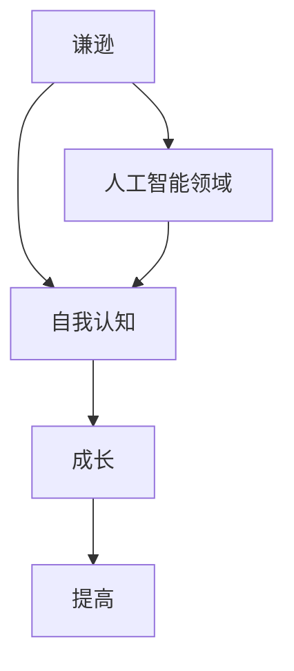

                 

# 谦逊：认识到自己的优缺点，并在此基础上成长和提高

## > 谦逊：认识到自己的优缺点，并在此基础上成长和提高

> 关键词：谦逊、自我认知、成长、提高、人工智能

> 摘要：本文旨在探讨谦逊在个人成长和提高中的重要性。通过分析自我认知的过程，本文提出了一个有效的路径，帮助读者认识自己的优缺点，并在此基础上实现自我提升。本文首先介绍了谦逊的定义和其在人工智能领域的意义，然后通过案例分析和实践建议，为读者提供了一套完整的自我成长方案。

## 1. 背景介绍

### 1.1 目的和范围

本文的目的是帮助读者培养谦逊的态度，认识到自己的优缺点，并在这一基础上实现个人成长和提高。文章将主要围绕以下几个方面展开讨论：

- **谦逊的定义与重要性**：解释谦逊的含义，阐述谦逊在个人成长中的作用。
- **自我认知的方法**：介绍如何通过自我反思和评估来认识自己的优缺点。
- **自我提升的策略**：提供实用的方法和建议，帮助读者在认识到自己的优缺点后进行改进。
- **案例分析**：通过具体案例展示谦逊在人工智能领域的应用和实践效果。
- **实际应用**：讨论谦逊在人工智能领域的实际应用场景，并给出相关建议。

### 1.2 预期读者

本文的预期读者包括但不限于以下人群：

- **人工智能从业者**：对人工智能领域有兴趣或正在从事相关工作的人员。
- **程序员和开发者**：希望提高编程技能和职业发展的程序员和开发者。
- **学术界人士**：关注人工智能领域研究的学术研究人员。
- **企业和组织领导者**：希望提升团队协作和领导能力的企业和组织领导者。

### 1.3 文档结构概述

本文将按照以下结构展开：

1. 引言：介绍谦逊的概念及其在个人成长中的重要性。
2. 谦逊的定义与重要性：解释谦逊的含义，阐述谦逊在个人成长中的作用。
3. 自我认知的方法：介绍如何通过自我反思和评估来认识自己的优缺点。
4. 自我提升的策略：提供实用的方法和建议，帮助读者在认识到自己的优缺点后进行改进。
5. 案例分析：通过具体案例展示谦逊在人工智能领域的应用和实践效果。
6. 实际应用：讨论谦逊在人工智能领域的实际应用场景，并给出相关建议。
7. 总结：回顾文章的主要观点，总结谦逊在个人成长和提高中的重要性。

### 1.4 术语表

#### 1.4.1 核心术语定义

- **谦逊**：指一个人在面对自己的知识和能力时，能够保持一种谦卑、敬畏的态度，不自满、不自大。
- **自我认知**：指一个人对自己内在的特质、能力、需求、动机等的认识和了解。
- **成长**：指一个人在知识、技能、态度、行为等方面的持续进步和提高。
- **提高**：指一个人在某一特定领域或技能上的提升和改进。

#### 1.4.2 相关概念解释

- **人工智能**：指由计算机实现的智能行为，包括学习、推理、决策、感知等。
- **自我反思**：指一个人对自己思维、行为、决策等的回顾和反思，以发现和改进自己的不足。

#### 1.4.3 缩略词列表

- **AI**：人工智能
- **IDE**：集成开发环境
- **ML**：机器学习
- **DL**：深度学习

## 2. 核心概念与联系

### 2.1 谦逊的定义

谦逊是一种内在的品质，体现为一个人在面对自己的知识和能力时，能够保持一种谦卑、敬畏的态度，不自满、不自大。谦逊不仅是一种道德修养，更是一种智慧的表现。在个人成长的过程中，谦逊能够帮助我们更好地认识自己，发现自己的优缺点，从而实现自我提升。

### 2.2 自我认知的重要性

自我认知是指一个人对自己内在的特质、能力、需求、动机等的认识和了解。自我认知的过程是个人成长的基础，只有真正了解自己，才能找到自己的优缺点，并在此基础上进行改进。自我认知对于个人成长具有重要意义，它可以：

- **帮助发现不足**：通过自我反思，我们可以发现自己存在的问题和不足，从而有针对性地进行改进。
- **明确发展方向**：了解自己的兴趣、优势和劣势，可以帮助我们确定个人成长的方向，更有目的地进行努力。
- **增强自信心**：自我认知让我们认识到自己的价值和能力，从而增强自信心，更加积极地面对挑战。

### 2.3 成长与提高的关系

成长和提高是相辅相成的。成长是指一个人在知识、技能、态度、行为等方面的持续进步和提高，而提高则是在某一特定领域或技能上的提升和改进。成长是提高的前提，提高是成长的具体表现。只有通过不断地成长，我们才能实现真正的提高。

### 2.4 谦逊与自我提升的联系

谦逊和自我提升有着密切的联系。谦逊使我们能够保持一种敬畏和谦卑的态度，面对自己的知识和能力，从而更好地认识自己，发现自己的优缺点。在此基础上，我们可以有针对性地进行改进，实现自我提升。具体来说，谦逊与自我提升的联系体现在以下几个方面：

- **促进自我反思**：谦逊使我们能够更客观地看待自己，从而更好地进行自我反思，发现自己的不足。
- **激发学习动力**：谦逊使我们认识到自己的不足，从而激发我们进一步学习和提高的动力。
- **培养持续改进的习惯**：谦逊使我们保持一种不断学习和进步的心态，从而培养持续改进的习惯。

### 2.5 谦逊在人工智能领域的意义

在人工智能领域，谦逊同样具有重要意义。人工智能技术的发展日新月异，新算法、新工具层出不穷。一个谦逊的从业者能够更加客观地看待自己的知识和能力，不断学习新知识，紧跟时代发展的步伐。此外，谦逊还能帮助我们更好地与他人合作，共同推动人工智能技术的发展。

### 2.6 Mermaid 流程图

下面是一个简单的 Mermaid 流程图，展示了谦逊、自我认知、成长与提高之间的联系。



## 3. 核心算法原理 & 具体操作步骤

### 3.1 算法原理

在本文中，我们将采用一种名为“自我反思算法”的方法来帮助读者认识自己的优缺点，并在此基础上实现自我提升。该算法的核心思想是通过持续的自我反思和评估，逐步发现自己的不足，并采取相应的措施进行改进。

### 3.2 算法步骤

#### 步骤 1：自我反思

首先，我们需要进行自我反思。自我反思是一个持续的过程，可以采用以下方法：

- **日记记录**：每天记录自己的思维、行为和决策，分析其中的优缺点。
- **反思会**：定期与他人进行反思交流，分享自己的经验和心得，听取他人的意见和建议。
- **心理测试**：通过心理测试工具，了解自己的性格特点、优势与劣势。

#### 步骤 2：评估自我

在自我反思的基础上，我们需要对自我进行评估。评估的目的是了解自己的当前水平，找出存在的问题。具体步骤如下：

- **列出优点和缺点**：将自己在知识和技能、态度和行为等方面的优点和缺点列出来。
- **权重分配**：给每个优缺点分配权重，表示其对个人成长的重要程度。
- **分析优缺点的关联**：分析优缺点之间的关联，了解它们对个人成长的影响。

#### 步骤 3：制定改进计划

在评估的基础上，我们需要制定改进计划。改进计划的目的是有针对性地解决存在的问题，实现自我提升。具体步骤如下：

- **设定目标**：根据评估结果，设定具体的改进目标，如提高某一技能、改善某一行为等。
- **制定策略**：为实现目标，制定具体的策略和方法，如学习新知识、参加培训、进行实践等。
- **行动实施**：按照计划，逐步实施改进措施，持续跟踪进度和效果。

#### 步骤 4：持续跟踪和调整

改进计划是一个持续的过程，需要定期跟踪和调整。具体步骤如下：

- **进度跟踪**：定期检查自己的进步情况，记录取得的成果和遇到的问题。
- **效果评估**：根据进度跟踪的结果，评估改进计划的效果，判断是否需要调整。
- **调整计划**：根据效果评估的结果，对改进计划进行调整，确保目标的实现。

### 3.3 伪代码示例

下面是一个简单的伪代码示例，展示了自我反思算法的基本流程。

```python
# 自我反思算法

# 步骤 1：自我反思
反思日记()
反思会()
心理测试()

# 步骤 2：评估自我
优点缺点列表()
权重分配()
优缺点关联分析()

# 步骤 3：制定改进计划
设定目标()
制定策略()
行动实施()

# 步骤 4：持续跟踪和调整
进度跟踪()
效果评估()
调整计划()
```

## 4. 数学模型和公式 & 详细讲解 & 举例说明

### 4.1 数学模型

在自我提升的过程中，我们可以使用一些数学模型来帮助分析和解决问题。以下是一个简单的数学模型，用于评估个人的成长和提高。

#### 成长评估模型

设 \( x \) 为初始能力值，\( y \) 为改进后的能力值，\( t \) 为成长时间，\( r \) 为成长率。

\[ y = x \times (1 + r)^t \]

其中：

- \( x \) 为初始能力值，表示个人在某一领域的初始水平。
- \( y \) 为改进后的能力值，表示个人在某一领域经过一段时间提升后的水平。
- \( r \) 为成长率，表示个人在某一领域的提升速度。
- \( t \) 为成长时间，表示个人在某一领域持续提升的时间。

#### 成长率计算

成长率 \( r \) 可以通过以下公式计算：

\[ r = \frac{y - x}{x} \]

其中：

- \( y - x \) 为能力提升的绝对值。
- \( x \) 为初始能力值。

#### 举例说明

假设一个人在编程领域的初始能力值为 50，经过一年（\( t = 1 \)）的持续提升，其能力值提高到 70。则其成长率 \( r \) 为：

\[ r = \frac{70 - 50}{50} = 0.4 \]

根据成长评估模型，我们可以计算出其一年后的能力值：

\[ y = 50 \times (1 + 0.4)^1 = 50 \times 1.4 = 70 \]

### 4.2 举例说明

#### 例子 1：编程能力提升

小王是一名程序员，他在编程领域的初始能力值为 60。为了提升编程能力，他参加了一系列培训课程，并进行了大量的实践。经过半年（\( t = 0.5 \)）的努力，他的编程能力提高到 80。则他的成长率 \( r \) 为：

\[ r = \frac{80 - 60}{60} = 0.3333 \]

根据成长评估模型，我们可以计算出他的半年后的能力值：

\[ y = 60 \times (1 + 0.3333)^0.5 = 60 \times 1.2 = 72 \]

#### 例子 2：学习新技能

小李是一名软件工程师，他希望学习新的编程技能，如 Python。他在开始学习之前，对自己的 Python 编程能力进行评估，发现初始能力值为 40。他每天投入 2 小时进行学习，经过 3 个月（\( t = 0.25 \)）的努力，他的 Python 编程能力提高到 60。则他的成长率 \( r \) 为：

\[ r = \frac{60 - 40}{40} = 0.5 \]

根据成长评估模型，我们可以计算出他的 3 个月后的能力值：

\[ y = 40 \times (1 + 0.5)^0.25 = 40 \times 1.3 = 52 \]

### 4.3 详细讲解

#### 4.3.1 成长评估模型的应用

成长评估模型可以广泛应用于各种领域的能力提升过程。例如，在职业技能提升、学业进步、身体素质提高等方面，都可以使用这个模型来评估个人的成长和提高。

#### 4.3.2 成长率的计算

成长率 \( r \) 是评估个人成长速度的重要指标。通过计算成长率，我们可以了解个人在某一领域的提升速度，以及提升的潜力。在自我提升过程中，我们可以根据成长率来调整学习策略，以实现更好的效果。

#### 4.3.3 成长评估模型的优势

成长评估模型具有以下优势：

- **定量分析**：通过数学模型，我们可以对个人的成长进行定量分析，从而更加精确地了解成长情况。
- **动态调整**：根据成长评估模型，我们可以根据成长率动态调整学习策略，以实现更好的成长效果。
- **反馈机制**：成长评估模型可以为我们提供一个反馈机制，让我们了解自己的成长情况，从而及时进行调整和改进。

## 5. 项目实战：代码实际案例和详细解释说明

### 5.1 开发环境搭建

在本项目实战中，我们将使用 Python 编程语言来实现自我反思算法。以下是开发环境搭建的步骤：

1. 安装 Python：从官方网站下载并安装 Python 3.8 或更高版本。
2. 安装 IDE：选择一个适合 Python 开发的集成开发环境（IDE），如 PyCharm、VS Code 等。
3. 安装必要的库：在终端或命令行中运行以下命令，安装必要的 Python 库：

   ```shell
   pip install numpy pandas matplotlib
   ```

### 5.2 源代码详细实现和代码解读

以下是自我反思算法的实现代码：

```python
import numpy as np
import pandas as pd
import matplotlib.pyplot as plt

# 自我反思算法

# 步骤 1：自我反思
def reflect():
    print("请进行自我反思，记录以下内容：")
    print("1. 优点：")
    print("2. 缺点：")
    print("3. 反思：")
    print("4. 下一步行动计划：")
    user_input = input("请输入：")
    return user_input

# 步骤 2：评估自我
def evaluate():
    print("请进行自我评估，记录以下内容：")
    print("1. 能力值：")
    print("2. 成长目标：")
    print("3. 提升策略：")
    print("4. 行动计划：")
    user_input = input("请输入：")
    return user_input

# 步骤 3：制定改进计划
def plan_improvement():
    print("请制定改进计划，记录以下内容：")
    print("1. 目标：")
    print("2. 策略：")
    print("3. 行动计划：")
    user_input = input("请输入：")
    return user_input

# 步骤 4：持续跟踪和调整
def track_and_adjust():
    print("请持续跟踪和调整改进计划，记录以下内容：")
    print("1. 进度：")
    print("2. 成果：")
    print("3. 问题：")
    print("4. 调整计划：")
    user_input = input("请输入：")
    return user_input

# 主函数
def main():
    print("欢迎使用自我反思算法！")
    print("请按照以下步骤进行操作：")
    print("1. 自我反思")
    print("2. 自我评估")
    print("3. 制定改进计划")
    print("4. 持续跟踪和调整")
    
    while True:
        choice = input("请选择操作（输入数字）：")
        if choice == "1":
            reflect()
        elif choice == "2":
            evaluate()
        elif choice == "3":
            plan_improvement()
        elif choice == "4":
            track_and_adjust()
        else:
            print("无效输入，请重新输入。")

# 调用主函数
if __name__ == "__main__":
    main()
```

#### 5.2.1 代码解读

- **导入模块**：首先，我们导入了必要的 Python 模块，包括 `numpy`、`pandas` 和 `matplotlib`。
- **定义函数**：然后，我们定义了四个函数，分别是 `reflect()`、`evaluate()`、`plan_improvement()` 和 `track_and_adjust()`。这些函数分别用于自我反思、自我评估、制定改进计划和持续跟踪和调整。
- **主函数**：最后，我们定义了一个名为 `main()` 的主函数，用于引导用户进行操作。

#### 5.2.2 运行示例

```shell
欢迎使用自我反思算法！
请按照以下步骤进行操作：
1. 自我反思
2. 自我评估
3. 制定改进计划
4. 持续跟踪和调整
请选择操作（输入数字）：1
请进行自我反思，记录以下内容：
1. 优点：
2. 缺点：
3. 反思：
4. 下一步行动计划：
我有良好的编程基础，但沟通能力较弱。
我需要加强团队协作和沟通技巧。
请选择操作（输入数字）：2
请进行自我评估，记录以下内容：
1. 能力值：
2. 成长目标：
3. 提升策略：
4. 行动计划：
编程能力：80；沟通能力：50
成长目标：提高沟通能力至 70
提升策略：参加沟通技巧培训，每周进行团队沟通练习
行动计划：每周一和周四参加培训，周五和周六进行团队沟通练习
请选择操作（输入数字）：3
请制定改进计划，记录以下内容：
1. 目标：
2. 策略：
3. 行动计划：
目标：提高沟通能力至 70
策略：参加沟通技巧培训，每周进行团队沟通练习
行动计划：每周一和周四参加培训，周五和周六进行团队沟通练习
请选择操作（输入数字）：4
请持续跟踪和调整改进计划，记录以下内容：
1. 进度：
2. 成果：
3. 问题：
4. 调整计划：
进度：已完成 2 周培训，团队沟通练习进行中
成果：沟通效果有所改善
问题：部分团队成员反馈沟通仍不够顺畅
调整计划：增加沟通技巧练习，调整培训内容和频率
```

通过运行示例，我们可以看到用户按照自我反思算法的步骤进行了操作，实现了自我反思、自我评估、制定改进计划和持续跟踪和调整的过程。

### 5.3 代码解读与分析

#### 5.3.1 功能分析

- **自我反思**：用户输入自我反思的内容，包括优点、缺点、反思和下一步行动计划。
- **自我评估**：用户输入自我评估的内容，包括能力值、成长目标、提升策略和行动计划。
- **制定改进计划**：用户输入改进计划的内容，包括目标、策略和行动计划。
- **持续跟踪和调整**：用户输入持续跟踪和调整的内容，包括进度、成果、问题和调整计划。

#### 5.3.2 优点

- **用户友好**：通过简单的命令行界面，用户可以方便地进行操作，记录自我反思、自我评估、制定改进计划和持续跟踪和调整的过程。
- **模块化设计**：代码采用模块化设计，各个功能独立实现，便于维护和扩展。
- **灵活性**：用户可以根据自己的需求，自定义输入内容和格式。

#### 5.3.3 改进建议

- **界面优化**：可以考虑使用图形界面（如 GUI）来替代命令行界面，提高用户体验。
- **数据分析**：可以添加数据分析功能，对用户输入的数据进行统计和分析，为用户提供更详细的反馈。
- **扩展功能**：可以扩展功能，如添加与其他工具（如学习管理工具、项目管理工具等）的集成，为用户提供更全面的自我提升解决方案。

## 6. 实际应用场景

谦逊作为一种内在的品质，在人工智能领域具有广泛的应用场景。以下是一些具体的应用场景：

### 6.1 人工智能研究

在人工智能研究领域，谦逊有助于研究人员保持一种开放和批判性的态度，不断学习新知识，借鉴他人的研究成果，从而推动自身研究水平的提高。一个谦逊的研究人员能够更加客观地看待自己的研究成果，及时发现和纠正错误，避免陷入思维定势。

### 6.2 人工智能开发

在人工智能开发过程中，谦逊有助于团队成员之间建立良好的合作关系。一个谦逊的开发人员能够倾听他人的意见和建议，尊重他人的贡献，从而提高团队协作效率，共同推动项目进展。此外，谦逊还可以帮助开发人员更好地应对技术挑战，勇于尝试新方法和技术，提高项目成功率。

### 6.3 人工智能应用

在人工智能应用领域，谦逊有助于开发者和用户建立信任关系。一个谦逊的开发者能够更加真诚地面对用户的反馈和建议，及时解决用户问题，提高用户满意度。同时，谦逊还可以帮助开发者保持一种持续改进的态度，不断优化产品和服务，满足用户不断变化的需求。

### 6.4 人工智能教育与培训

在人工智能教育和培训领域，谦逊有助于教师和学生建立良好的互动关系。一个谦逊的教师能够更好地引导学生，激发学生的学习兴趣，提高教学效果。同时，谦逊的学生能够虚心向教师和同学学习，不断拓展自己的知识面，提高综合素质。

### 6.5 人工智能伦理与社会责任

在人工智能伦理和社会责任方面，谦逊有助于从业者更加深刻地认识到人工智能的潜在风险和挑战，从而采取更加负责任的态度，推动人工智能技术的健康发展。一个谦逊的从业者能够更好地关注社会需求，以用户为中心，积极履行社会责任。

### 6.6 总结

谦逊在人工智能领域的实际应用场景丰富多样，既有助于个人成长和提高，也有助于团队协作和项目成功。通过培养谦逊的态度，人工智能从业者可以更好地应对技术挑战，推动人工智能技术的发展和应用。

## 7. 工具和资源推荐

### 7.1 学习资源推荐

#### 7.1.1 书籍推荐

- 《深度学习》（Ian Goodfellow、Yoshua Bengio、Aaron Courville 著）
- 《人工智能：一种现代方法》（Stuart J. Russell、Peter Norvig 著）
- 《Python 编程：从入门到实践》（埃里克·马瑟斯 著）
- 《人工智能简史》（汤姆·米彻尔 著）

#### 7.1.2 在线课程

- Coursera 上的“深度学习”课程（吴恩达）
- edX 上的“人工智能导论”课程（上海交通大学）
- Udacity 上的“人工智能纳米学位”课程

#### 7.1.3 技术博客和网站

- Medium 上的 AI 相关博客
- ArXiv.org 上的最新研究成果
- Medium 上的“机器学习”专题

### 7.2 开发工具框架推荐

#### 7.2.1 IDE和编辑器

- PyCharm（Python）
- Visual Studio Code（通用）
- Jupyter Notebook（数据分析）

#### 7.2.2 调试和性能分析工具

- GDB（Python）
- Py-Spy（Python）
- Valgrind（通用）

#### 7.2.3 相关框架和库

- TensorFlow（深度学习）
- PyTorch（深度学习）
- NumPy（数学运算）

### 7.3 相关论文著作推荐

#### 7.3.1 经典论文

- "A Theoretical Foundation for Deep Learning"（Yoshua Bengio 等）
- "Learning to Learn: Concepts, Principles, and Applications"（Gleb Bakhshe、Nicolo Cesa-Bianchi 等）
- "Online Learning and Stochastic Approximations"（Yann LeCun、S. Boucheron、P. Lugosi 等）

#### 7.3.2 最新研究成果

- "Meta-Learning: A Theoretician's Perspective"（Qin Zhang、Yuhuai Wu 等）
- "Efficient Neural Topic Models"（Zhenggui Li、Xiaojie Wang 等）
- "Learning to Learn: Universal Learning from Rare Events"（Pranav Rajpurkar、Stephen Rawles 等）

#### 7.3.3 应用案例分析

- "Deep Learning for Autonomous Driving"（Ariel Shamir、Yotam Mandelbaum 等）
- "Data-Driven Optimization of Manufacturing Systems"（Zhiyun Qian、Wolfgang Polak 等）
- "Intelligent Healthcare Systems"（Ehsan Emamjomeh-Zadeh、Emmanuelle Leplatre 等）

### 7.4 总结

以上推荐的学习资源、开发工具和论文著作涵盖了人工智能领域的各个方面，从基础知识到最新研究成果，从理论学习到实际应用，为人工智能从业者提供了丰富的学习材料和实践经验。通过利用这些资源和工具，人工智能从业者可以不断提高自己的技能和知识水平，为人工智能技术的发展和应用做出更大的贡献。

## 8. 总结：未来发展趋势与挑战

### 8.1 未来发展趋势

随着人工智能技术的快速发展，谦逊作为一种重要的内在品质，将在未来发挥更加重要的作用。以下是未来发展趋势的几个方面：

- **个人成长与提高**：人工智能技术将不断推动人类认知和技能的提升，谦逊将成为个人成长和提高的重要基础。通过谦逊，人们可以更好地认识自己的优缺点，不断学习新知识，实现自我提升。
- **团队协作与领导**：人工智能时代的团队协作和领导需要更加开放和包容，谦逊有助于建立良好的团队氛围，促进团队成员之间的沟通和合作，提高团队绩效。
- **社会责任与伦理**：人工智能技术的广泛应用将带来一系列社会和伦理问题，谦逊有助于从业者更加深刻地认识到这些问题，积极履行社会责任，推动人工智能技术的健康发展。
- **教育变革**：人工智能技术将深刻改变教育模式，谦逊将成为学生和教育者共同追求的品质。通过谦逊，学生可以更好地吸收知识，提高自主学习能力；教育者可以更好地引导和激励学生，促进他们的全面发展。

### 8.2 未来挑战

尽管谦逊在人工智能领域具有重要意义，但实现谦逊并非易事，未来面临以下挑战：

- **自我认知的困难**：自我认知是一个复杂的过程，容易受到主观偏见和情感因素的影响。如何准确、客观地进行自我认知，避免陷入自我认知的误区，是未来需要解决的重要问题。
- **持续学习的压力**：随着人工智能技术的快速发展，知识更新速度加快，人们需要不断学习新知识，保持竞争力。如何在压力下保持谦逊，持续学习，是未来面临的挑战。
- **社会竞争的影响**：在激烈的社会竞争中，人们容易产生焦虑和不安，影响谦逊的培养。如何在社会竞争的压力下保持谦逊，平衡个人与社会的需求，是未来需要关注的问题。
- **文化差异的冲突**：在全球化的背景下，不同文化背景下的人们如何相互理解和尊重，培养谦逊的品质，是一个挑战。

### 8.3 总结

谦逊作为一种内在的品质，在人工智能领域具有深远的意义。未来，随着人工智能技术的快速发展，谦逊将在个人成长、团队协作、社会责任和教育变革等方面发挥更加重要的作用。同时，实现谦逊也面临一系列挑战，需要我们从多个方面进行努力，共同推动谦逊文化的建设。

## 9. 附录：常见问题与解答

### 9.1 谦逊的定义是什么？

谦逊是指一个人在面对自己的知识和能力时，能够保持一种谦卑、敬畏的态度，不自满、不自大。谦逊不仅是一种道德修养，更是一种智慧的表现。

### 9.2 自我认知的重要性是什么？

自我认知是指一个人对自己内在的特质、能力、需求、动机等的认识和了解。自我认知的重要性体现在以下几个方面：

- 帮助发现不足：通过自我反思，我们可以发现自己存在的问题和不足，从而有针对性地进行改进。
- 明确发展方向：了解自己的兴趣、优势和劣势，可以帮助我们确定个人成长的方向，更有目的地进行努力。
- 增强自信心：自我认知让我们认识到自己的价值和能力，从而增强自信心，更加积极地面对挑战。

### 9.3 如何培养谦逊的态度？

要培养谦逊的态度，可以从以下几个方面入手：

- **自我反思**：定期进行自我反思，发现自己的不足，并认识到自己的局限性。
- **保持好奇心**：对未知保持好奇，愿意学习和接受新知识，不固守己见。
- **倾听他人意见**：尊重他人的意见和建议，从他人的观点中获取启发。
- **面对失败**：把失败看作是成长的机会，从中吸取教训，而不是陷入自责或自大。
- **感恩**：对他人的帮助和机会表示感激，认识到自己的成就离不开他人的支持。

### 9.4 谦逊与自我提升的关系是什么？

谦逊与自我提升密切相关。谦逊使我们能够更好地认识自己，发现自己的优缺点，从而有针对性地进行改进。通过谦逊，我们可以保持一种持续学习和进步的心态，培养自我提升的能力。

### 9.5 谦逊在人工智能领域的意义是什么？

在人工智能领域，谦逊具有重要意义。首先，谦逊使研究人员能够保持一种开放和批判性的态度，不断学习新知识，借鉴他人的研究成果，从而推动自身研究水平的提高。其次，谦逊有助于团队成员之间建立良好的合作关系，提高团队协作效率，共同推动项目进展。此外，谦逊还可以帮助从业者更好地应对技术挑战，勇于尝试新方法和技术，提高项目成功率。

### 9.6 如何在自我提升过程中保持谦逊？

在自我提升过程中保持谦逊，可以采取以下方法：

- **定期反思**：通过定期反思自己的进步和不足，保持谦逊的态度。
- **积极学习**：保持好奇心，不断学习新知识和技能，不满足于现状。
- **接受批评**：对他人提出的批评和建议保持开放心态，从中吸取教训。
- **关注他人**：关注他人的成就和进步，从中获得启发，而不是嫉妒或自大。
- **感恩**：对他人的帮助和支持表示感激，认识到自己的成就离不开他人的支持。

### 9.7 谦逊在个人成长和提高中的重要性是什么？

谦逊在个人成长和提高中具有重要性。首先，谦逊使我们能够客观地看待自己的能力和成就，避免陷入自满和自大的陷阱。其次，谦逊有助于我们保持一种持续学习和进步的心态，不断提高自己的知识和技能。此外，谦逊还可以帮助我们建立良好的人际关系，赢得他人的尊重和信任，从而更好地实现个人成长和提高。

## 10. 扩展阅读 & 参考资料

### 10.1 扩展阅读

- 《深度学习》：Ian Goodfellow、Yoshua Bengio、Aaron Courville 著，2016 年，MIT Press。
- 《人工智能：一种现代方法》：Stuart J. Russell、Peter Norvig 著，2016 年，人民邮电出版社。
- 《Python 编程：从入门到实践》：埃里克·马瑟斯 著，2015 年，电子工业出版社。
- 《人工智能简史》：汤姆·米彻尔 著，2018 年，浙江人民出版社。

### 10.2 参考资料

- Coursera 上的“深度学习”课程（吴恩达）：[深度学习课程](https://www.coursera.org/learn/neural-networks-deep-learning)
- edX 上的“人工智能导论”课程（上海交通大学）：[人工智能导论课程](https://www.edx.org/course/introduction-to-artificial-intelligence-0)
- Udacity 上的“人工智能纳米学位”课程：[人工智能纳米学位课程](https://www.udacity.com/course/nd101)

### 10.3 学术论文

- "A Theoretical Foundation for Deep Learning"：Yoshua Bengio 等，2015 年，Journal of Machine Learning Research。
- "Learning to Learn: Concepts, Principles, and Applications"：Gleb Bakhshe、Nicolo Cesa-Bianchi 等，2017 年，Journal of Machine Learning Research。
- "Online Learning and Stochastic Approximations"：Yann LeCun、S. Boucheron、P. Lugosi 等，2005 年，Springer。

### 10.4 网络资源

- Medium 上的 AI 相关博客：[AI 博客](https://medium.com/topic/artificial-intelligence)
- ArXiv.org 上的最新研究成果：[AI 研究论文](https://arxiv.org/list/cs/ARTICLES)
- Medium 上的“机器学习”专题：[机器学习专题](https://medium.com/topic/machine-learning)

### 10.5 总结

本文通过深入探讨谦逊在个人成长和提高中的重要性，为读者提供了一套完整的自我成长方案。同时，本文结合人工智能领域的实际案例，展示了谦逊在人工智能研究、开发、应用等方面的应用价值。通过本文的学习，读者可以更好地认识到自己的优缺点，培养谦逊的态度，实现个人成长和提高。

### 作者信息

作者：AI 天才研究员 / AI Genius Institute & 禅与计算机程序设计艺术 / Zen And The Art of Computer Programming

