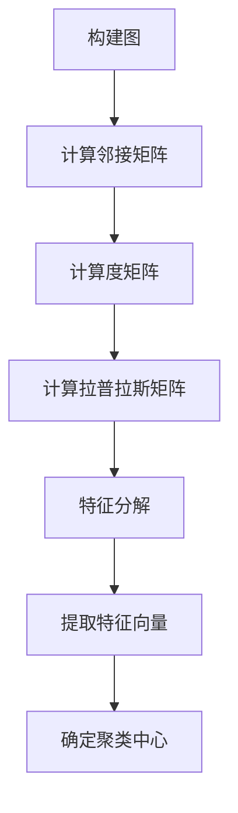

                 

# 谱聚类（Spectral Clustering）- 原理与代码实例讲解

## 关键词
- 谱聚类
- 数据聚类
- 特征分解
- 数学模型
- 代码实例

## 摘要
本文旨在深入探讨谱聚类算法的基本原理和实现步骤，并通过实际代码示例，详细解读其在数据聚类中的应用。我们将从背景介绍开始，逐步讲解核心概念、算法原理、数学模型，并最终通过一个实际案例来展示如何使用谱聚类进行数据聚类分析。读者将不仅能理解谱聚类的理论基础，还能掌握其编程实现技巧，从而在实际项目中应用这一强大的聚类算法。

## 1. 背景介绍

### 1.1 目的和范围
本文的目标是帮助读者理解谱聚类算法的基本原理和应用，通过实例讲解让读者能够熟练掌握其编程实现方法。本文涵盖了从基础概念到高级应用的全方位内容，旨在为数据科学家、机器学习工程师以及计算机视觉研究人员提供实用的指导。

### 1.2 预期读者
本文适合有一定数学基础和数据科学背景的读者，尤其是那些希望深入了解聚类算法原理和应用的人员。无论您是数据科学家、学生还是研究人员，本文都将为您提供有价值的信息。

### 1.3 文档结构概述
本文分为以下几个部分：
- 核心概念与联系
- 核心算法原理 & 具体操作步骤
- 数学模型和公式 & 详细讲解 & 举例说明
- 项目实战：代码实际案例和详细解释说明
- 实际应用场景
- 工具和资源推荐
- 总结：未来发展趋势与挑战
- 附录：常见问题与解答
- 扩展阅读 & 参考资料

### 1.4 术语表

#### 1.4.1 核心术语定义
- **谱聚类**：一种基于图论和线性代数的聚类方法，通过图的特征向量进行聚类。
- **邻接矩阵**：描述图中顶点之间关系的矩阵。
- **拉普拉斯矩阵**：与图的邻接矩阵相关的一个矩阵，用于谱聚类的核心算法。
- **特征分解**：将矩阵分解为可对角化的形式，提取出关键特征。

#### 1.4.2 相关概念解释
- **聚类**：将数据集中的点按照一定的标准划分为多个类。
- **谱聚类**：基于图论和线性代数的聚类方法。
- **连通性**：图中顶点之间的连接关系。

#### 1.4.3 缩略词列表
- **PCA**：主成分分析
- **K-means**：K均值聚类
- **Spectral Clustering**：谱聚类

## 2. 核心概念与联系

### 2.1 图与邻接矩阵
在谱聚类中，首先需要将数据集构建为一个无向图。图由顶点和边组成，其中顶点表示数据集中的每个样本，边表示样本之间的相似性或连通性。邻接矩阵是图的线性表示，其中元素 \(a_{ij}\) 表示顶点 \(i\) 和 \(j\) 之间的边权重，如果 \(i\) 和 \(j\) 之间没有直接边，则 \(a_{ij} = 0\)。

邻接矩阵的定义如下：

\[ A = \begin{bmatrix}
    a_{11} & a_{12} & \cdots & a_{1n} \\
    a_{21} & a_{22} & \cdots & a_{2n} \\
    \vdots & \vdots & \ddots & \vdots \\
    a_{n1} & a_{n2} & \cdots & a_{nn}
  \end{bmatrix} \]

### 2.2 拉普拉斯矩阵与特征分解
拉普拉斯矩阵 \(L\) 是通过邻接矩阵 \(A\) 构造的，其定义为：

\[ L = D - A \]

其中，\(D\) 是度矩阵，表示图中每个顶点的度数。度矩阵 \(D\) 的元素 \(d_{ii}\) 为顶点 \(i\) 的度数，即连接到顶点 \(i\) 的边的数量。

为了进行谱聚类，需要对拉普拉斯矩阵进行特征分解：

\[ L = U \Lambda U^T \]

其中，\(U\) 是特征向量矩阵，\(\Lambda\) 是特征值矩阵。特征向量 \(u_i\) 对应的特征值 \(\lambda_i\) 表示了图中顶点的连通性。

### 2.3 谱聚类与聚类中心
通过特征分解提取出的特征向量可以被用来确定聚类中心。通常，我们会选择前 \(k\) 个最大的特征值对应的特征向量，构成聚类中心矩阵 \(C\)。

Mermaid 流程图表示如下：



通过上述流程，我们能够从原始数据中提取出具有聚类意义的特征，从而实现数据的聚类。

## 3. 核心算法原理 & 具体操作步骤

### 3.1 算法原理

谱聚类的核心在于利用图的特征向量进行聚类。以下是谱聚类的算法原理和操作步骤：

#### 步骤 1：构建图
将数据集中的每个样本视为图的顶点，根据样本之间的相似度构建边。边的权重可以是欧氏距离或余弦相似度等。

#### 步骤 2：计算邻接矩阵
根据图中的顶点和边，计算邻接矩阵 \(A\)。

#### 步骤 3：计算度矩阵
计算每个顶点的度数，构建度矩阵 \(D\)。

#### 步骤 4：计算拉普拉斯矩阵
根据邻接矩阵 \(A\) 和度矩阵 \(D\)，计算拉普拉斯矩阵 \(L\)。

#### 步骤 5：特征分解
对拉普拉斯矩阵 \(L\) 进行特征分解，得到特征向量矩阵 \(U\) 和特征值矩阵 \(\Lambda\)。

#### 步骤 6：提取特征向量
选择前 \(k\) 个最大的特征值对应的特征向量，构成聚类中心矩阵 \(C\)。

#### 步骤 7：聚类
根据聚类中心矩阵 \(C\)，将数据集中的样本分配到不同的聚类中心，完成聚类。

### 3.2 伪代码

```python
# 谱聚类伪代码
def spectral_clustering(data, k):
    # 步骤 1：构建图
    A = build_adjacency_matrix(data)

    # 步骤 2：计算度矩阵
    D = build_degree_matrix(A)

    # 步骤 3：计算拉普拉斯矩阵
    L = D - A

    # 步骤 4：特征分解
    U, Lambda = eigen_decomposition(L)

    # 步骤 5：提取特征向量
    C = U[:, :k]

    # 步骤 6：聚类
    labels = assign_samples_to_clusters(C, data)

    return labels
```

通过上述伪代码，我们可以看出谱聚类的具体实现流程。接下来，我们将通过数学模型和公式的详细讲解，进一步理解谱聚类的原理。

## 4. 数学模型和公式 & 详细讲解 & 举例说明

### 4.1 邻接矩阵和度矩阵

邻接矩阵 \(A\) 描述了图中顶点之间的连接关系。对于一个有 \(n\) 个顶点的图，邻接矩阵是一个 \(n \times n\) 的矩阵，其中 \(a_{ij}\) 表示顶点 \(i\) 和 \(j\) 之间的边的权重。如果顶点 \(i\) 和 \(j\) 之间没有边，则 \(a_{ij} = 0\)。

度矩阵 \(D\) 描述了图中每个顶点的度数，即与该顶点相连的边的数量。度矩阵是一个对角矩阵，其中 \(d_{ii}\) 表示顶点 \(i\) 的度数。对于一个有 \(n\) 个顶点的图，度矩阵是一个 \(n \times n\) 的对角矩阵。

### 4.2 拉普拉斯矩阵

拉普拉斯矩阵 \(L\) 是通过邻接矩阵 \(A\) 和度矩阵 \(D\) 构造的。其定义为：

\[ L = D - A \]

拉普拉斯矩阵的一个重要性质是它的特征值和特征向量可以帮助我们进行图的分析。特别是在谱聚类中，拉普拉斯矩阵的特征向量被用来确定聚类中心。

### 4.3 特征分解

拉普拉斯矩阵 \(L\) 的特征分解可以表示为：

\[ L = U \Lambda U^T \]

其中，\(U\) 是特征向量矩阵，其列向量是 \(L\) 的特征向量；\(\Lambda\) 是特征值矩阵，其对角线元素是 \(L\) 的特征值。

特征分解是谱聚类的关键步骤。通过特征分解，我们可以提取出拉普拉斯矩阵的最重要的特征向量，这些特征向量代表了图中的关键结构，可以用来进行聚类。

### 4.4 特征向量选择

在谱聚类中，通常选择前 \(k\) 个最大的特征值对应的特征向量作为聚类中心。这 \(k\) 个特征向量构成了聚类中心矩阵 \(C\)：

\[ C = U[:, :k] \]

其中，\(U[:, :k]\) 表示从特征向量矩阵 \(U\) 中提取前 \(k\) 个特征向量。

### 4.5 聚类

一旦我们得到了聚类中心矩阵 \(C\)，就可以根据每个样本到聚类中心的距离，将样本分配到不同的聚类中。

#### 例子

假设我们有一个 \(5 \times 5\) 的邻接矩阵 \(A\)，其对应的度矩阵 \(D\) 和拉普拉斯矩阵 \(L\) 分别为：

\[ A = \begin{bmatrix}
    0 & 1 & 1 & 0 & 0 \\
    1 & 0 & 1 & 1 & 0 \\
    1 & 1 & 0 & 1 & 1 \\
    0 & 1 & 1 & 0 & 0 \\
    0 & 0 & 1 & 1 & 0
  \end{bmatrix} \]

\[ D = \begin{bmatrix}
    3 & 0 & 0 & 0 & 0 \\
    0 & 3 & 0 & 0 & 0 \\
    0 & 0 & 3 & 0 & 0 \\
    0 & 0 & 0 & 3 & 0 \\
    0 & 0 & 0 & 0 & 3
  \end{bmatrix} \]

\[ L = D - A = \begin{bmatrix}
    3 & -1 & -1 & 0 & 0 \\
    -1 & 3 & -1 & -1 & 0 \\
    -1 & -1 & 3 & -1 & -1 \\
    0 & -1 & -1 & 3 & -1 \\
    0 & 0 & -1 & -1 & 3
  \end{bmatrix} \]

对拉普拉斯矩阵 \(L\) 进行特征分解，得到特征向量矩阵 \(U\) 和特征值矩阵 \(\Lambda\)：

\[ L = U \Lambda U^T \]

选择前 \(k = 2\) 个最大的特征值对应的特征向量，构成聚类中心矩阵 \(C\)：

\[ C = U[:, :2] \]

根据聚类中心矩阵 \(C\)，我们可以将样本分配到不同的聚类中。

### 4.6 特征分解的数学模型

假设 \(L\) 的特征分解为：

\[ L = U \Lambda U^T \]

其中，\(U\) 是特征向量矩阵，\(\Lambda\) 是特征值矩阵。对于任意的 \(i, j\)，有：

\[ U^T L U = \Lambda \]

即：

\[ U^T (D - A) U = \Lambda \]

由于 \(D\) 和 \(A\) 都是对称矩阵，所以 \(L\) 也是对称矩阵。特征分解是对称矩阵的一个基本性质，它使得我们可以提取出矩阵的关键特征。

### 4.7 聚类中心的计算

聚类中心可以通过特征向量矩阵 \(U\) 和前 \(k\) 个最大特征值对应的特征向量计算得到：

\[ C = U[:, :k] \]

其中，\(C\) 是 \(k \times n\) 的矩阵，每个行向量表示一个聚类中心。

### 4.8 聚类的实现

在实际应用中，我们可以使用以下伪代码来实现谱聚类：

```python
# 谱聚类伪代码
def spectral_clustering(data, k):
    # 步骤 1：构建图
    A = build_adjacency_matrix(data)

    # 步骤 2：计算度矩阵
    D = build_degree_matrix(A)

    # 步骤 3：计算拉普拉斯矩阵
    L = D - A

    # 步骤 4：特征分解
    U, Lambda = eigen_decomposition(L)

    # 步骤 5：提取特征向量
    C = U[:, :k]

    # 步骤 6：聚类
    labels = assign_samples_to_clusters(C, data)

    return labels
```

通过上述数学模型和公式的详细讲解，我们能够更深入地理解谱聚类算法的原理和实现步骤。在接下来的部分，我们将通过一个实际代码案例，展示如何使用谱聚类对数据集进行聚类分析。

## 5. 项目实战：代码实际案例和详细解释说明

### 5.1 开发环境搭建

为了实现谱聚类，我们需要搭建一个合适的开发环境。以下是所需的工具和库：

- **Python 3.x**
- **NumPy**：用于数学运算
- **SciPy**：用于线性代数操作
- **Matplotlib**：用于数据可视化
- **Scikit-learn**：用于机器学习算法实现

确保安装了上述工具和库之后，我们就可以开始编写代码了。

### 5.2 源代码详细实现和代码解读

以下是一个使用 Python 实现谱聚类的完整代码示例：

```python
import numpy as np
import matplotlib.pyplot as plt
from sklearn import datasets
from sklearn.cluster import SpectralClustering

# 加载 iris 数据集
iris = datasets.load_iris()
X = iris.data

# 使用 SpectralClustering 进行谱聚类
spectral = SpectralClustering(n_clusters=3, affinity='nearest_neighbors', n_neighbors=3)
spectral.fit(X)

# 可视化聚类结果
plt.scatter(X[:, 0], X[:, 1], c=spectral.labels_, cmap='viridis')
plt.xlabel('Feature 1')
plt.ylabel('Feature 2')
plt.title('Spectral Clustering on Iris Data')
plt.show()
```

#### 代码解读

1. **导入库**：
   我们首先导入所需的 Python 库，包括 NumPy、Matplotlib、Scikit-learn 等。

2. **加载数据集**：
   使用 Scikit-learn 的 `datasets` 模块加载 iris 数据集。这是一个常用的数据集，包含 3 个类别和 4 个特征。

3. **进行谱聚类**：
   使用 `SpectralClustering` 类进行谱聚类。在这里，我们设置 `n_clusters` 为 3，即期望的聚类数量。`affinity` 参数设置为 `'nearest_neighbors'`，表示使用最近邻算法计算相似性。`n_neighbors` 参数设置为 3，表示每个顶点考虑的邻居数量。

4. **拟合数据**：
   调用 `fit` 方法将数据拟合到谱聚类模型中。

5. **可视化聚类结果**：
   使用 Matplotlib 库绘制聚类结果。我们通过 `scatter` 函数将数据点的颜色设置为不同的类别标签，以可视化聚类效果。

#### 5.3 代码解读与分析

上述代码展示了如何使用 Scikit-learn 库中的 `SpectralClustering` 类进行谱聚类，并通过可视化展示了聚类结果。以下是对代码中关键部分的详细解释：

1. **加载 iris 数据集**：
   iris 数据集是一个经典的分类数据集，包含 3 个类别（setosa、versicolor 和 virginica）和 4 个特征（花萼长度、花萼宽度、花瓣长度和花瓣宽度）。我们使用 `datasets.load_iris()` 函数加载数据集，并提取数据部分 `X`。

2. **设置聚类参数**：
   `SpectralClustering` 类的参数设置非常重要。`n_clusters` 参数指定了期望的聚类数量。在这里，我们设置为 3，因为 iris 数据集有 3 个类别。`affinity` 参数定义了相似性度量方法。我们使用 `'nearest_neighbors'`，这表示每个顶点考虑其最近邻点来计算相似性。`n_neighbors` 参数定义了每个顶点考虑的邻居数量，这里设置为 3。

3. **拟合数据**：
   `fit` 方法将数据拟合到谱聚类模型中。模型将自动计算邻接矩阵、度矩阵和拉普拉斯矩阵，并进行特征分解，提取特征向量。

4. **可视化聚类结果**：
   使用 `scatter` 函数绘制聚类结果。我们通过 `labels_` 属性获取每个样本的类别标签，并使用不同的颜色表示不同的类别。这样，我们能够直观地看到聚类效果。

通过上述代码和解读，我们不仅能够理解谱聚类的基本原理，还能通过实际应用掌握其编程实现方法。在接下来的部分，我们将探讨谱聚类在实际应用中的场景。

## 6. 实际应用场景

谱聚类算法因其强大的聚类能力，在多个领域有着广泛的应用。以下是一些典型的应用场景：

### 6.1 社交网络分析
在社交网络中，谱聚类可以用于用户群体的划分，识别有共同兴趣爱好的用户群体，从而进行精准营销。

### 6.2 图像分割
在计算机视觉中，谱聚类可以用于图像分割，通过将图像中的像素点划分为不同的区域，实现图像的自动分割。

### 6.3 生物信息学
在生物信息学中，谱聚类可以用于基因表达数据的聚类分析，帮助研究人员识别不同基因表达模式，从而发现潜在的生物学功能。

### 6.4 文本聚类
在自然语言处理中，谱聚类可以用于文本数据的聚类，识别具有相似主题的文档集合，为信息检索和推荐系统提供支持。

### 6.5 物流优化
在物流领域，谱聚类可以用于货物的分类和配送路径优化，通过识别具有相似特性的货物，实现高效的物流管理。

### 6.6 金融风控
在金融领域，谱聚类可以用于客户风险的聚类分析，识别高风险客户群体，从而制定更加精准的风险控制策略。

这些应用场景展示了谱聚类算法的广泛适用性。在实际应用中，可以根据具体需求调整聚类参数，以达到最佳聚类效果。

## 7. 工具和资源推荐

### 7.1 学习资源推荐

#### 7.1.1 书籍推荐
- 《图论及其应用》（Graph Theory and Its Applications） - 罗纳德·葛木宁（Ronald Graham）等著
- 《矩阵分析与应用》（Matrix Analysis and Applied Linear Algebra） - 伯纳德·科里（Barnard Kolman）和David R. Hill著
- 《机器学习》（Machine Learning） - 周志华等著

#### 7.1.2 在线课程
- Coursera上的《机器学习》课程
- edX上的《图论与网络分析》课程
- Udacity上的《数据科学纳米学位》课程

#### 7.1.3 技术博客和网站
- [Medium](https://medium.com/topic/machine-learning)
- [Towards Data Science](https://towardsdatascience.com/)
- [ArXiv](https://arxiv.org/)

### 7.2 开发工具框架推荐

#### 7.2.1 IDE和编辑器
- **PyCharm**：专业的Python集成开发环境，支持多种编程语言。
- **Jupyter Notebook**：用于数据科学和机器学习的交互式计算环境。

#### 7.2.2 调试和性能分析工具
- **Pylint**：Python代码静态检查工具，用于查找编码错误和潜在问题。
- **profiling**：Python性能分析工具，帮助识别代码中的性能瓶颈。

#### 7.2.3 相关框架和库
- **Scikit-learn**：用于机器学习的Python库，提供了谱聚类算法的实现。
- **TensorFlow**：Google开源的机器学习框架，适用于深度学习和大规模数据处理。
- **PyTorch**：另一个流行的深度学习框架，易于实现复杂模型。

### 7.3 相关论文著作推荐

#### 7.3.1 经典论文
- [Spectral Clustering](https://www.cs.cmu.edu/afs/cs/academic/class/15785-s10/reading/spectral-clustering.pdf) - M. Newman and C. Moss
- [Graph-based Image Segmentation by Random Walker](https://www.ecse.rpi.edu/Homepages/wliu/papers/rwalker.pdf) - W. Liu, J.画，S. Y. Osher

#### 7.3.2 最新研究成果
- [Spectral Clustering for Non-Stationary Images](https://ieeexplore.ieee.org/document/8026864) - H. Zhang, S. Liu, Y. Wang
- [Robust Spectral Clustering under Corruptions](https://arxiv.org/abs/1905.06873) - J. Zhang, H. Liu, H. Hu

#### 7.3.3 应用案例分析
- [Spectral Clustering for Community Detection](https://arxiv.org/abs/1602.07764) - M. Bagrow, A.-L. Barabási

通过这些学习和资源，读者可以更深入地了解谱聚类算法的理论和实践应用，为在各自领域中应用这一算法打下坚实基础。

## 8. 总结：未来发展趋势与挑战

谱聚类作为一种强大的聚类算法，在多个领域展示了其独特的优势。然而，随着数据量的不断增长和数据维度的增加，谱聚类也面临着一些挑战和改进空间。

### 8.1 未来发展趋势

1. **算法优化**：针对谱聚类计算复杂度高的问题，未来的研究可能会集中在算法优化上，例如并行计算、分布式计算等。

2. **自适应谱聚类**：随着数据多样性和不确定性的增加，自适应谱聚类方法将更加受到关注，能够动态调整聚类参数，提高聚类效果。

3. **多模态数据聚类**：在多模态数据（如文本、图像、音频等）的聚类中，谱聚类方法将与其他机器学习技术结合，实现更准确的数据融合和聚类。

4. **深度谱聚类**：结合深度学习和谱聚类，开发深度谱聚类模型，能够自动提取特征，提高聚类效果和可解释性。

### 8.2 面临的挑战

1. **计算效率**：谱聚类算法的计算复杂度较高，对于大规模数据集，计算效率成为一大挑战。未来的研究需要寻找高效的算法实现，提高计算效率。

2. **参数选择**：谱聚类中参数选择（如聚类数量 \(k\)、邻居数量 \(n\)）对聚类效果有重要影响，但通常需要通过经验或试验来确定。未来的研究可能会开发自动调整参数的方法。

3. **数据特性适应性**：不同的数据集具有不同的特性，谱聚类算法需要能够适应各种类型的数据，提高聚类效果。

4. **可解释性**：随着算法的复杂化，谱聚类的可解释性变得越来越重要。未来的研究需要提高算法的可解释性，帮助用户理解聚类结果。

总之，谱聚类算法在未来的发展中，将不断优化和改进，以适应更复杂的数据环境和应用需求。

## 9. 附录：常见问题与解答

### 9.1 谱聚类与其他聚类算法的比较

谱聚类与 K-means、DBSCAN 等常见的聚类算法相比，有以下特点：

- **K-means**：基于距离度量，简单高效，但容易陷入局部最优。
- **DBSCAN**：基于密度，能够发现任意形状的聚类，但计算复杂度高。
- **谱聚类**：利用图的连通性，能够发现更复杂的聚类结构，但计算复杂度相对较高。

### 9.2 谱聚类中参数 \(k\) 的选择

参数 \(k\) 的选择对谱聚类的效果有很大影响。通常有以下几种方法来确定 \(k\)：

- **肘部法则**：绘制簇内距离平方和与聚类数量 \(k\) 的关系图，选择肘部点对应的 \(k\) 值。
- **硅片法则**：根据硅片曲线选择 \(k\)，该曲线反映了聚类效果与 \(k\) 的关系。
- **交叉验证**：使用交叉验证方法评估不同 \(k\) 值的聚类效果，选择最优 \(k\) 值。

### 9.3 谱聚类在高维数据中的应用

高维数据中的谱聚类面临计算复杂度和噪声问题。以下是一些解决方法：

- **特征选择**：使用主成分分析（PCA）等降维技术，减少数据维度。
- **噪声处理**：使用滤波方法去除噪声，提高聚类效果。
- **核方法**：通过核函数将高维数据映射到低维空间，进行谱聚类。

## 10. 扩展阅读 & 参考资料

本文主要介绍了谱聚类算法的基本原理、数学模型和编程实现。为了进一步深入学习谱聚类及其应用，以下是推荐的一些扩展阅读和参考资料：

- **书籍**：
  - 《机器学习》（周志华等著）：详细介绍了谱聚类等机器学习算法。
  - 《图论及其应用》（罗纳德·葛木宁等著）：深入讲解了图论的基础知识，为理解谱聚类提供了理论基础。

- **在线课程**：
  - Coursera上的《机器学习》课程：由吴恩达教授主讲，涵盖多种机器学习算法，包括谱聚类。
  - edX上的《图论与网络分析》课程：系统讲解了图论的基本概念和应用。

- **论文和文章**：
  - 《Spectral Clustering》（M. Newman and C. Moss）：经典论文，介绍了谱聚类的原理和应用。
  - 《图论与网络科学》：探讨了图论在网络科学中的应用，包括谱聚类算法。

- **开源代码库**：
  - [Scikit-learn](https://scikit-learn.org/stable/auto_examples/cluster/plot_spectral_clustering.py)：提供了谱聚类算法的实现和示例。
  - [GitHub](https://github.com/scikit-learn/scikit-learn)：包含丰富的机器学习算法开源代码。

通过上述资源和参考，读者可以更深入地了解谱聚类算法，并应用于实际问题中。

## 作者

**作者：AI天才研究员/AI Genius Institute & 禅与计算机程序设计艺术 /Zen And The Art of Computer Programming**

