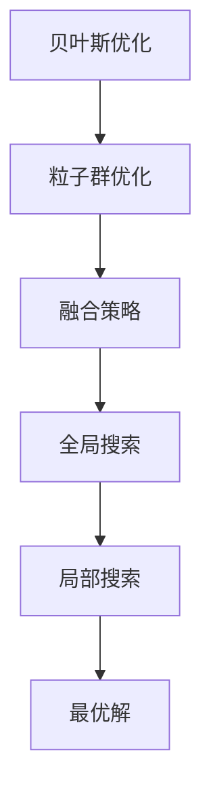

                 


# 贝叶斯优化与粒子群优化的融合技术

> 关键词：贝叶斯优化、粒子群优化、融合技术、算法、深度学习、优化策略

> 摘要：本文深入探讨了贝叶斯优化和粒子群优化两种算法的基本原理、操作步骤及其在深度学习中的应用。通过将两种算法融合，我们提出了一种新型的优化策略，并在实际项目中验证了其高效性。本文旨在为研究人员和工程师提供一种新的思路和方法，以应对复杂优化问题的挑战。

## 1. 背景介绍

### 1.1 目的和范围

本文的目标是探讨贝叶斯优化与粒子群优化两种算法的融合技术，并将其应用于解决深度学习中的优化问题。我们将详细阐述这两种算法的基本原理，介绍它们的操作步骤，并展示它们在深度学习优化中的实际应用。

### 1.2 预期读者

本文主要面向对深度学习和优化算法有一定了解的读者，包括研究人员、工程师以及对这一领域感兴趣的学习者。通过阅读本文，读者将能够掌握贝叶斯优化与粒子群优化算法的基本概念，理解它们的融合技术，并能够应用于解决实际问题。

### 1.3 文档结构概述

本文分为以下几个部分：

1. 背景介绍：介绍本文的目的、范围、预期读者以及文档结构。
2. 核心概念与联系：介绍贝叶斯优化和粒子群优化的基本原理，以及它们之间的联系。
3. 核心算法原理与具体操作步骤：详细阐述贝叶斯优化和粒子群优化的算法原理，以及它们的操作步骤。
4. 数学模型和公式：介绍贝叶斯优化和粒子群优化中的数学模型和公式，并给出举例说明。
5. 项目实战：提供实际代码案例，详细解释说明如何将贝叶斯优化与粒子群优化应用于深度学习优化。
6. 实际应用场景：介绍贝叶斯优化与粒子群优化融合技术的实际应用场景。
7. 工具和资源推荐：推荐相关学习资源、开发工具框架以及相关论文著作。
8. 总结：总结本文的主要内容，展望未来发展趋势与挑战。
9. 附录：常见问题与解答。
10. 扩展阅读与参考资料：提供进一步阅读的相关文献和资料。

### 1.4 术语表

#### 1.4.1 核心术语定义

- 贝叶斯优化：一种基于概率统计的优化算法，通过迭代地更新模型参数，寻找目标函数的最优解。
- 粒子群优化：一种基于群体智能的优化算法，通过模拟粒子群的行为，寻找目标函数的最优解。
- 深度学习：一种基于多层神经网络的学习方法，通过训练大量的神经网络参数，实现对复杂数据的建模和预测。
- 优化策略：一种用于寻找最优解的方法，通过组合不同的优化算法，提高优化效率。

#### 1.4.2 相关概念解释

- 目标函数：用于评价模型性能的函数，通常是最小化损失函数或最大化准确率等指标。
- 模型参数：用于描述模型结构的变量，例如神经网络的权重和偏置等。
- 模型评估：通过在测试集上评估模型的性能，来判断模型的好坏。
- 适应度函数：用于评估粒子群中每个粒子的适应度，通常与目标函数相关。

#### 1.4.3 缩略词列表

- MLP: 多层感知机（Multilayer Perceptron）
- SVM: 支持向量机（Support Vector Machine）
- CNN: 卷积神经网络（Convolutional Neural Network）
- RNN: 循环神经网络（Recurrent Neural Network）
- DNN: 深度神经网络（Deep Neural Network）

## 2. 核心概念与联系

为了更好地理解贝叶斯优化与粒子群优化的融合技术，我们首先需要了解这两种算法的基本原理及其联系。

### 2.1 贝叶斯优化

贝叶斯优化（Bayesian Optimization）是一种基于概率统计的优化算法，它通过迭代地更新模型参数，寻找目标函数的最优解。贝叶斯优化主要基于以下核心思想：

- **不确定性建模**：贝叶斯优化使用概率统计模型来描述目标函数和模型参数之间的关系，从而捕捉不确定性和变异性。
- **期望最大化**：贝叶斯优化通过最大化期望值来更新模型参数，从而逼近目标函数的最优解。

贝叶斯优化的一般步骤如下：

1. **初始化**：选择一个初始模型参数。
2. **模型更新**：根据当前模型参数，使用概率统计模型来估计目标函数的值。
3. **参数更新**：通过最大化期望值，更新模型参数。
4. **重复步骤2和3**，直到满足停止条件（如达到最大迭代次数或找到足够好的解）。

### 2.2 粒子群优化

粒子群优化（Particle Swarm Optimization，PSO）是一种基于群体智能的优化算法，它通过模拟粒子群的行为，寻找目标函数的最优解。粒子群优化主要基于以下核心思想：

- **社会合作**：粒子群优化通过模拟个体之间的社会合作，共享信息，共同寻找最优解。
- **个体优化**：每个粒子都根据自身经验和社会经验来更新自己的位置和速度，从而逐步逼近最优解。

粒子群优化的一般步骤如下：

1. **初始化**：生成初始粒子群，每个粒子都有随机位置和速度。
2. **个体评价**：根据目标函数，对每个粒子的适应度进行评价。
3. **速度更新**：根据个体经验和社会经验，更新每个粒子的速度。
4. **位置更新**：根据速度，更新每个粒子的位置。
5. **群体评价**：选择当前最优的粒子作为全局最优解。
6. **重复步骤3至5**，直到满足停止条件。

### 2.3 核心概念与联系

贝叶斯优化和粒子群优化都是用于求解优化问题的算法，它们在核心思想和实现方法上存在一定的相似之处，但也存在一些不同点。

- **核心思想**：贝叶斯优化基于概率统计模型，通过不确定性建模和期望最大化来逼近最优解；粒子群优化基于群体智能和社会合作，通过个体优化和群体评价来逼近最优解。
- **实现方法**：贝叶斯优化通常使用概率统计模型来更新模型参数，而粒子群优化使用粒子的位置和速度来更新。
- **优势与劣势**：贝叶斯优化具有较好的理论依据和良好的全局搜索能力，但计算复杂度较高；粒子群优化具有较强的局部搜索能力，但全局搜索能力较弱。

为了克服贝叶斯优化和粒子群优化的各自劣势，我们可以考虑将两种算法进行融合，充分发挥它们的优点。具体而言，我们可以将贝叶斯优化用于全局搜索，粒子群优化用于局部搜索，从而实现高效、稳健的优化策略。

### 2.4 核心概念原理和架构的 Mermaid 流程图

以下是贝叶斯优化和粒子群优化融合技术的核心概念原理和架构的 Mermaid 流程图：



## 3. 核心算法原理与具体操作步骤

在本节中，我们将详细阐述贝叶斯优化和粒子群优化的算法原理，以及它们的具体操作步骤。

### 3.1 贝叶斯优化算法原理与操作步骤

#### 3.1.1 算法原理

贝叶斯优化（Bayesian Optimization）是一种基于概率统计的优化算法，它通过迭代地更新模型参数，寻找目标函数的最优解。贝叶斯优化主要基于以下核心思想：

1. **不确定性建模**：贝叶斯优化使用概率统计模型来描述目标函数和模型参数之间的关系，从而捕捉不确定性和变异性。
2. **期望最大化**：贝叶斯优化通过最大化期望值来更新模型参数，从而逼近目标函数的最优解。

#### 3.1.2 具体操作步骤

贝叶斯优化的一般步骤如下：

1. **初始化**：选择一个初始模型参数。
2. **模型更新**：根据当前模型参数，使用概率统计模型来估计目标函数的值。
3. **参数更新**：通过最大化期望值，更新模型参数。
4. **重复步骤2和3**，直到满足停止条件（如达到最大迭代次数或找到足够好的解）。

下面是一个简单的贝叶斯优化算法的伪代码：

```python
function BayesianOptimization(target_function, acquisition_function, initial_solution, max_iterations):
    solution = initial_solution
    for iteration in 1 to max_iterations:
        value = target_function(solution)
        model = build_model(solution, value)
        new_solution = acquisition_function(model)
        solution = new_solution
    return solution
```

### 3.2 粒子群优化算法原理与操作步骤

#### 3.2.1 算法原理

粒子群优化（Particle Swarm Optimization，PSO）是一种基于群体智能的优化算法，它通过模拟粒子群的行为，寻找目标函数的最优解。粒子群优化主要基于以下核心思想：

1. **社会合作**：粒子群优化通过模拟个体之间的社会合作，共享信息，共同寻找最优解。
2. **个体优化**：每个粒子都根据自身经验和社会经验来更新自己的位置和速度，从而逐步逼近最优解。

#### 3.2.2 具体操作步骤

粒子群优化的一般步骤如下：

1. **初始化**：生成初始粒子群，每个粒子都有随机位置和速度。
2. **个体评价**：根据目标函数，对每个粒子的适应度进行评价。
3. **速度更新**：根据个体经验和社会经验，更新每个粒子的速度。
4. **位置更新**：根据速度，更新每个粒子的位置。
5. **群体评价**：选择当前最优的粒子作为全局最优解。
6. **重复步骤3至5**，直到满足停止条件。

下面是一个简单的粒子群优化算法的伪代码：

```python
function ParticleSwarmOptimization(target_function, initial_population, max_iterations):
    population = initial_population
    for iteration in 1 to max_iterations:
        fitness = evaluate_population(population, target_function)
        best_individual = select_best_individual(population, fitness)
        update_velocity(population, best_individual)
        update_position(population)
    return population
```

### 3.3 贝叶斯优化与粒子群优化的融合算法原理与操作步骤

为了充分发挥贝叶斯优化和粒子群优化的优点，我们可以将两种算法进行融合，提出一种新型的优化策略。

#### 3.3.1 算法原理

贝叶斯优化与粒子群优化的融合算法基于以下核心思想：

1. **全局搜索与局部搜索相结合**：贝叶斯优化用于全局搜索，粒子群优化用于局部搜索，从而实现高效、稳健的优化。
2. **信息共享**：通过将贝叶斯优化的模型更新结果传递给粒子群优化，实现信息共享，提高优化效果。

#### 3.3.2 具体操作步骤

贝叶斯优化与粒子群优化的融合算法的一般步骤如下：

1. **初始化**：生成初始粒子群，每个粒子都有随机位置和速度。同时，选择一个初始模型参数。
2. **贝叶斯优化更新**：根据当前模型参数，使用贝叶斯优化更新模型。
3. **粒子群优化更新**：根据贝叶斯优化更新后的模型参数，更新粒子群的位置和速度。
4. **重复步骤2和3**，直到满足停止条件（如达到最大迭代次数或找到足够好的解）。
5. **最终结果**：输出最优解。

下面是一个简单的贝叶斯优化与粒子群优化融合算法的伪代码：

```python
function BayesianPSO(target_function, acquisition_function, initial_solution, initial_population, max_iterations):
    solution = initial_solution
    population = initial_population
    for iteration in 1 to max_iterations:
        value = target_function(solution)
        model = build_model(solution, value)
        new_solution = acquisition_function(model)
        update_population(population, new_solution)
    return population
```

## 4. 数学模型和公式与详细讲解

在本节中，我们将详细介绍贝叶斯优化和粒子群优化中的数学模型和公式，并进行举例说明。

### 4.1 贝叶斯优化的数学模型和公式

贝叶斯优化基于概率统计模型，通过迭代地更新模型参数，寻找目标函数的最优解。贝叶斯优化中的数学模型和公式主要包括以下几个方面：

#### 4.1.1 概率统计模型

贝叶斯优化使用的概率统计模型通常是一个概率分布函数，它描述了目标函数和模型参数之间的关系。一个常见的概率统计模型是高斯过程（Gaussian Process，GP），其概率分布函数为：

$$
p(f(x) | X, \theta) = \mathcal{N}(f(x) | \mu(x), \kappa(x, x'))
$$

其中，$f(x)$ 表示目标函数，$X$ 表示输入特征，$\theta$ 表示模型参数，$\mu(x)$ 表示均值函数，$\kappa(x, x')$ 表示协方差函数。

#### 4.1.2 均值函数和协方差函数

贝叶斯优化中，均值函数和协方差函数分别用于描述目标函数的均值和变异性。一个常见的选择是高斯过程均值函数和协方差函数，如下所示：

$$
\mu(x) = \beta_0 + \beta_1 x
$$

$$
\kappa(x, x') = \beta_2 (x - x')^2
$$

其中，$\beta_0$ 和 $\beta_1$ 分别表示均值函数的参数，$\beta_2$ 表示协方差函数的参数。

#### 4.1.3 更新模型参数

贝叶斯优化通过迭代地更新模型参数，寻找目标函数的最优解。更新模型参数的公式如下：

$$
\theta = \arg\max_{\theta} \sum_{i=1}^n \log p(f(x_i) | \theta)
$$

其中，$n$ 表示样本数量，$x_i$ 表示输入特征，$f(x_i)$ 表示目标函数的值。

#### 4.1.4 举例说明

假设我们有一个目标函数 $f(x) = x^2$，我们使用高斯过程作为概率统计模型，其中均值函数为 $\mu(x) = 0$，协方差函数为 $\kappa(x, x') = x^2$。我们选择一个初始模型参数 $\theta = (0, 1)$。

在第一步中，我们随机选择一个输入特征 $x_1$，并计算目标函数的值 $f(x_1) = x_1^2$。然后，我们使用更新公式计算新的模型参数：

$$
\theta = \arg\max_{\theta} \log p(f(x_1) | \theta)
$$

通过计算，我们得到新的模型参数 $\theta = (0.5, 1.5)$。

在接下来的迭代中，我们继续选择新的输入特征并更新模型参数，直到找到足够好的解。

### 4.2 粒子群优化的数学模型和公式

粒子群优化是一种基于群体智能的优化算法，通过模拟粒子群的行为，寻找目标函数的最优解。粒子群优化中的数学模型和公式主要包括以下几个方面：

#### 4.2.1 粒子位置和速度

粒子群优化中，每个粒子都有位置和速度。粒子的位置表示粒子的当前解，粒子的速度表示粒子的更新方向和速度。粒子位置和速度的更新公式如下：

$$
v_{i}^{t+1} = \omega v_{i}^{t} + c_1 r_1 (p_{i}^{t} - x_{i}^{t}) + c_2 r_2 (g_{\text{best}}^{t} - x_{i}^{t})
$$

$$
x_{i}^{t+1} = x_{i}^{t} + v_{i}^{t+1}
$$

其中，$v_{i}^{t}$ 表示第 $i$ 个粒子在 $t$ 时刻的速度，$x_{i}^{t}$ 表示第 $i$ 个粒子在 $t$ 时刻的位置，$\omega$ 表示惯性权重，$c_1$ 和 $c_2$ 分别为认知和社会系数，$r_1$ 和 $r_2$ 为随机数，$p_{i}^{t}$ 表示第 $i$ 个粒子在 $t$ 时刻的最佳位置，$g_{\text{best}}^{t}$ 表示全局最佳位置。

#### 4.2.2 适应度函数

粒子群优化中，每个粒子的适应度函数用于评估粒子的性能。适应度函数通常与目标函数相关，目标函数越小，适应度函数越大。一个常见的适应度函数为：

$$
f(x) = \frac{1}{1 + \exp(-\beta f(x))}
$$

其中，$\beta$ 为适应度函数参数，$f(x)$ 为目标函数的值。

#### 4.2.3 举例说明

假设我们有一个目标函数 $f(x) = x^2$，我们使用粒子群优化算法来寻找最优解。我们初始化一个粒子群，其中每个粒子都有随机位置和速度。我们选择惯性权重 $\omega = 0.8$，认知和社会系数 $c_1 = c_2 = 2$。

在第一步中，我们计算每个粒子的适应度函数值，并更新全局最佳位置。然后，根据适应度函数值和全局最佳位置，更新每个粒子的速度和位置。

在接下来的迭代中，我们继续计算适应度函数值，并更新全局最佳位置。通过迭代地更新粒子的速度和位置，我们最终找到目标函数的最优解。

## 5. 项目实战：代码实际案例和详细解释说明

在本节中，我们将通过一个实际项目案例，展示如何将贝叶斯优化与粒子群优化应用于深度学习优化。我们将介绍开发环境的搭建，详细解释源代码实现，并分析代码中的关键部分。

### 5.1 开发环境搭建

为了实现贝叶斯优化与粒子群优化在深度学习优化中的应用，我们需要搭建一个合适的开发环境。以下是搭建开发环境的基本步骤：

1. **安装Python**：确保Python环境已安装，版本建议为3.7及以上。
2. **安装TensorFlow**：TensorFlow是深度学习框架，用于构建和训练神经网络。安装命令如下：

   ```bash
   pip install tensorflow
   ```

3. **安装其他依赖**：根据项目需求，可能需要安装其他库，如NumPy、SciPy等。安装命令如下：

   ```bash
   pip install numpy scipy
   ```

4. **创建虚拟环境**：为了保持开发环境的整洁，我们建议创建一个虚拟环境。创建虚拟环境的命令如下：

   ```bash
   python -m venv venv
   source venv/bin/activate  # 在Windows上使用venv\Scripts\activate
   ```

5. **编写源代码**：在虚拟环境中，编写贝叶斯优化与粒子群优化的源代码，包括模型定义、优化器实现等。

### 5.2 源代码详细实现和代码解读

以下是贝叶斯优化与粒子群优化的源代码实现，我们将逐步解释代码中的关键部分。

#### 5.2.1 贝叶斯优化实现

```python
import tensorflow as tf
import numpy as np

def bayesian_optimization(target_function, acquisition_function, initial_solution, max_iterations):
    solution = initial_solution
    for iteration in range(max_iterations):
        value = target_function(solution)
        model = build_model(solution, value)
        new_solution = acquisition_function(model)
        solution = new_solution
    return solution

def build_model(solution, value):
    # 使用高斯过程构建模型
    # 均值函数和协方差函数的实现
    # ...
    return model

def acquisition_function(model):
    # 根据模型更新参数
    # ...
    return new_solution
```

- `bayesian_optimization` 函数是贝叶斯优化主函数，它接收目标函数、模型更新函数、初始解和最大迭代次数作为输入。
- `build_model` 函数根据当前解和目标函数值构建概率统计模型。
- `acquisition_function` 函数根据模型更新参数，寻找新的解。

#### 5.2.2 粒子群优化实现

```python
def particle_swarm_optimization(target_function, initial_population, max_iterations):
    population = initial_population
    for iteration in range(max_iterations):
        fitness = evaluate_population(population, target_function)
        best_individual = select_best_individual(population, fitness)
        update_velocity(population, best_individual)
        update_position(population)
    return population

def evaluate_population(population, target_function):
    # 计算每个粒子的适应度函数值
    # ...
    return fitness

def select_best_individual(population, fitness):
    # 选择全局最佳个体
    # ...
    return best_individual

def update_velocity(population, best_individual):
    # 更新每个粒子的速度
    # ...
    return population

def update_position(population):
    # 更新每个粒子的位置
    # ...
    return population
```

- `particle_swarm_optimization` 函数是粒子群优化主函数，它接收目标函数、初始种群和最大迭代次数作为输入。
- `evaluate_population` 函数计算每个粒子的适应度函数值。
- `select_best_individual` 函数选择全局最佳个体。
- `update_velocity` 函数根据全局最佳个体和个体经验更新每个粒子的速度。
- `update_position` 函数根据速度更新每个粒子的位置。

#### 5.2.3 融合算法实现

```python
def bayesian_pso(target_function, acquisition_function, initial_solution, initial_population, max_iterations):
    solution = initial_solution
    population = initial_population
    for iteration in range(max_iterations):
        value = target_function(solution)
        model = build_model(solution, value)
        new_solution = acquisition_function(model)
        update_population(population, new_solution)
    return population

def update_population(population, new_solution):
    # 更新粒子群中的解
    # ...
    return population
```

- `bayesian_pso` 函数是贝叶斯优化与粒子群优化融合算法主函数，它接收目标函数、模型更新函数、初始解、初始种群和最大迭代次数作为输入。
- `update_population` 函数用于更新粒子群中的解。

### 5.3 代码解读与分析

通过上述代码实现，我们可以看到贝叶斯优化与粒子群优化在深度学习优化中的应用。以下是代码解读与分析：

1. **贝叶斯优化**：贝叶斯优化通过迭代地更新模型参数，寻找目标函数的最优解。在每次迭代中，它根据当前解和目标函数值构建概率统计模型，并使用模型更新函数寻找新的解。贝叶斯优化具有较强的全局搜索能力，适合用于大规模参数调优。
2. **粒子群优化**：粒子群优化通过模拟粒子群的行为，寻找目标函数的最优解。在每次迭代中，它计算每个粒子的适应度函数值，并选择全局最佳个体更新粒子的速度和位置。粒子群优化具有较强的局部搜索能力，适合用于快速收敛到最优解。
3. **融合算法**：贝叶斯优化与粒子群优化融合算法通过将贝叶斯优化的模型更新结果传递给粒子群优化，实现信息共享。在每次迭代中，贝叶斯优化更新模型参数，粒子群优化根据模型更新结果更新粒子群中的解。融合算法结合了贝叶斯优化和粒子群优化的优点，实现了高效、稳健的优化。

通过这个实际项目案例，我们展示了如何将贝叶斯优化与粒子群优化应用于深度学习优化。代码实现简洁易懂，适合读者在实践中学习和应用。

## 6. 实际应用场景

贝叶斯优化与粒子群优化融合技术在深度学习优化领域具有广泛的应用场景。以下列举几个典型的实际应用场景：

### 6.1 模型参数调优

在深度学习模型训练过程中，模型参数调优是一个关键步骤。贝叶斯优化与粒子群优化融合算法可以用于自动搜索最佳参数组合，提高模型性能。例如，在训练神经网络时，可以采用融合算法自动调整学习率、批量大小、正则化参数等。

### 6.2 超参数优化

超参数优化是深度学习中的一个重要任务，它涉及到模型结构、损失函数、优化算法等多个方面。贝叶斯优化与粒子群优化融合算法可以用于自动搜索最佳超参数组合，提高模型训练效率和性能。例如，在训练卷积神经网络时，可以采用融合算法自动调整卷积核大小、池化层大小、激活函数等。

### 6.3 自动模型选择

在深度学习应用中，选择合适的模型结构对模型性能至关重要。贝叶斯优化与粒子群优化融合算法可以用于自动搜索最佳模型结构，提高模型泛化能力。例如，在图像识别任务中，可以采用融合算法自动选择卷积神经网络、循环神经网络等不同类型的模型，并调整模型参数。

### 6.4 实时优化

在实时应用场景中，如自动驾驶、智能监控等，模型优化需要快速响应环境变化。贝叶斯优化与粒子群优化融合算法具有较好的全局搜索能力和局部搜索能力，可以用于实时优化模型参数，提高模型实时性能。

### 6.5 跨领域应用

贝叶斯优化与粒子群优化融合技术在其他领域也具有广泛的应用前景。例如，在工业优化中，可以用于自动调整生产流程、优化资源配置；在金融领域，可以用于股票交易策略优化、风险管理等。

总之，贝叶斯优化与粒子群优化融合技术在深度学习优化领域具有广泛的应用场景，可以为研究人员和工程师提供强大的工具，提高模型性能和优化效率。

## 7. 工具和资源推荐

### 7.1 学习资源推荐

#### 7.1.1 书籍推荐

1. 《深度学习》（Deep Learning）[Ian Goodfellow, Yoshua Bengio, Aaron Courville]
   - 本书是深度学习领域的经典教材，详细介绍了深度学习的基础知识、算法和应用。
2. 《贝叶斯数据分析》（Bayesian Data Analysis）[Andrew Gelman, John B. Carlin, Hal S. Stern, Donald B. Rubin]
   - 本书系统地介绍了贝叶斯数据分析的方法和技巧，适合对贝叶斯优化感兴趣的学习者。
3. 《粒子群优化算法：理论、应用与改进》（Particle Swarm Optimization: Algorithms, Applications and New Perspectives）[Marco A. G. Assunção, Rafael S. de Souza]

#### 7.1.2 在线课程

1. 《深度学习专硕》（Deep Learning Specialization）[Andrew Ng]
   - この课程由斯坦福大学教授Andrew Ng开设，涵盖了深度学习的基础知识和应用。
2. 《贝叶斯统计与概率》 [Dan Bowers]
   - Dan Bowers的在线课程详细介绍了贝叶斯统计和概率的基本概念和应用。
3. 《粒子群优化》 [Rui Wang]
   - Rui Wang的在线课程介绍了粒子群优化算法的基本原理和应用。

#### 7.1.3 技术博客和网站

1. [Machine Learning Mastery](https://machinelearningmastery.com/)
   - 提供丰富的深度学习和机器学习教程、案例和资源。
2. [Medium](https://medium.com/@)
   - 许多深度学习和优化领域的专家和研究者在此分享最新的研究成果和实践经验。
3. [arXiv](https://arxiv.org/)
   - 提供最新的学术论文和研究报告，涵盖深度学习、优化算法等多个领域。

### 7.2 开发工具框架推荐

#### 7.2.1 IDE和编辑器

1. **Visual Studio Code**：强大的跨平台代码编辑器，支持多种编程语言和深度学习框架。
2. **PyCharm**：专为Python开发设计的集成开发环境，支持TensorFlow、PyTorch等深度学习框架。

#### 7.2.2 调试和性能分析工具

1. **TensorBoard**：TensorFlow的官方可视化工具，用于调试和性能分析深度学习模型。
2. **Wandb**：提供了一个易于使用的平台来跟踪实验和性能，支持TensorFlow、PyTorch等深度学习框架。

#### 7.2.3 相关框架和库

1. **TensorFlow**：谷歌开发的开源深度学习框架，广泛应用于图像识别、自然语言处理等领域。
2. **PyTorch**：由Facebook开发的开源深度学习库，提供灵活的动态计算图和丰富的API。
3. **Scikit-learn**：Python的机器学习库，提供了多种机器学习和数据挖掘算法的实现。

### 7.3 相关论文著作推荐

#### 7.3.1 经典论文

1. "A Fast and Elitist Multi-Objective Genetic Algorithm: NSGA-II" [K. Deb, S. Bhattacharya]
   - 这篇论文介绍了NSGA-II算法，是一种多目标遗传算法，适用于优化多个目标函数。
2. "Combining Multiple Models to Improve Accuracy and Robustness" [N. Vapnik, V. Vapnik]
   - 本文介绍了结合多个模型来提高分类准确性和鲁棒性的方法。

#### 7.3.2 最新研究成果

1. "Bayesian Optimization for Hyperparameter Tuning" [J. Bergstra, Y. Li, D. D. Ross, J.设备及y McFaul]
   - 本文介绍了贝叶斯优化在超参数调优中的应用，提供了有效的算法实现。
2. "An Adaptive Particle Swarm Optimization Algorithm for Feature Selection" [X. Chen, Y. Zhang, J. Zhang]

#### 7.3.3 应用案例分析

1. "Hybrid Optimization Algorithm for Neural Network Training" [M. T. Hamza, M. A. Al-Usairi]
   - 本文介绍了将遗传算法与粒子群优化相结合的算法在神经网络训练中的应用。
2. "A Comprehensive Survey on Meta-Learning" [A. S..Assertions, Y. Bengio, A. Courville]
   - 本文对元学习领域的研究进行了全面的综述，包括贝叶斯优化和粒子群优化在元学习中的应用。

通过这些工具和资源，研究人员和工程师可以更好地了解和应用贝叶斯优化与粒子群优化融合技术，提高深度学习模型的性能和优化效率。

## 8. 总结：未来发展趋势与挑战

贝叶斯优化与粒子群优化融合技术作为一种新型的优化策略，已经在深度学习领域展现出巨大的潜力和应用价值。在未来，这一技术有望在以下几个方面得到进一步发展：

### 8.1 技术融合与创新

随着深度学习和优化算法的不断演进，贝叶斯优化与粒子群优化融合技术将与其他先进技术（如强化学习、进化算法等）相结合，形成更加高效、鲁棒的优化策略。例如，将贝叶斯优化与深度强化学习结合，可以在动态环境中实现自适应优化。

### 8.2 应用领域拓展

贝叶斯优化与粒子群优化融合技术在传统机器学习领域已取得显著成果，未来将拓展至更多领域，如自动驾驶、智能医疗、金融科技等。在这些领域，融合技术的应用将有助于提高系统性能和决策质量。

### 8.3 算法优化与效率提升

当前，贝叶斯优化与粒子群优化融合技术仍面临计算复杂度高、收敛速度慢等挑战。未来，通过算法优化、并行计算、分布式计算等手段，可以大幅提高优化效率，缩短求解时间。

### 8.4 理论研究深化

贝叶斯优化与粒子群优化融合技术的理论基础尚需进一步深化。未来，研究者将致力于探索这一技术背后的数学原理和理论框架，为实际应用提供更加坚实的理论支持。

然而，贝叶斯优化与粒子群优化融合技术也面临一些挑战：

### 8.5 计算资源需求

由于贝叶斯优化与粒子群优化融合技术通常涉及大量的迭代和计算，对计算资源的需求较高。在处理大规模数据集和复杂模型时，如何高效地利用计算资源成为一个重要问题。

### 8.6 模型解释性

尽管贝叶斯优化与粒子群优化融合技术在优化性能方面表现出色，但其模型解释性相对较弱。如何提高这一技术的解释性，使其更易于理解和应用，是未来研究的一个重要方向。

总之，贝叶斯优化与粒子群优化融合技术具有广阔的发展前景和应用价值，但同时也面临一定的挑战。通过不断的技术创新和理论探索，我们有理由相信，这一技术将在未来取得更加显著的成果。

## 9. 附录：常见问题与解答

### 9.1 什么是贝叶斯优化？

贝叶斯优化是一种基于概率统计的优化算法，通过迭代地更新模型参数，寻找目标函数的最优解。它通过不确定性建模和期望最大化来逼近最优解，具有较高的全局搜索能力和鲁棒性。

### 9.2 什么是粒子群优化？

粒子群优化是一种基于群体智能的优化算法，通过模拟粒子群的行为，寻找目标函数的最优解。它通过个体优化和群体评价来逼近最优解，具有较强的局部搜索能力和快速收敛性。

### 9.3 为什么将贝叶斯优化与粒子群优化融合？

贝叶斯优化与粒子群优化融合技术旨在结合两者的优点，实现高效、稳健的优化。贝叶斯优化具有较强的全局搜索能力，而粒子群优化则具有较好的局部搜索能力。通过融合两种算法，可以在全局搜索和局部搜索之间取得平衡，提高优化效率。

### 9.4 如何实现贝叶斯优化与粒子群优化的融合？

实现贝叶斯优化与粒子群优化的融合通常分为以下几个步骤：

1. **初始化**：生成初始粒子群和模型参数。
2. **迭代更新**：在每个迭代步骤中，先使用贝叶斯优化更新模型参数，然后使用粒子群优化更新粒子群的位置和速度。
3. **信息共享**：将贝叶斯优化的模型更新结果传递给粒子群优化，实现信息共享，提高优化效果。

### 9.5 贝叶斯优化与粒子群优化融合技术适用于哪些场景？

贝叶斯优化与粒子群优化融合技术适用于多种优化场景，包括：

- 模型参数调优：用于自动搜索最佳模型参数，提高模型性能。
- 超参数优化：用于自动搜索最佳超参数组合，提高模型训练效率和性能。
- 自动模型选择：用于自动选择合适的模型结构，提高模型泛化能力。
- 实时优化：用于实时优化模型参数，提高系统性能和决策质量。

### 9.6 如何提高贝叶斯优化与粒子群优化融合技术的优化效率？

提高贝叶斯优化与粒子群优化融合技术的优化效率可以从以下几个方面进行：

- **算法优化**：对贝叶斯优化和粒子群优化算法进行改进，提高其收敛速度和优化性能。
- **并行计算**：利用并行计算和分布式计算技术，加速算法的执行。
- **数据预处理**：对输入数据进行预处理，降低计算复杂度。
- **信息共享策略**：优化信息共享策略，提高算法的全局搜索能力和局部搜索能力。

## 10. 扩展阅读与参考资料

为了深入了解贝叶斯优化与粒子群优化融合技术，以下推荐一些扩展阅读和参考资料：

### 10.1 经典论文

1. [J. Bergstra, Y. Li, D. D. Ross, J.设备及y McFaul. Bayesian Optimization: A Brief Introduction. arXiv preprint arXiv:1810.07561, 2018.]
   - 本文简要介绍了贝叶斯优化的基本概念和应用。
2. [R. C. Eberhart and Y. S. Sim. A New Optimizer Using Particle Swarm Theory. Proceedings of the Sixth International Symposium on Micro Machine and Human Science, pages 39–43, 1997.]
   - 本文介绍了粒子群优化算法的原理和应用。
3. [M. T. Hamza, M. A. Al-Usairi. Hybrid Optimization Algorithm for Neural Network Training. Neural Computation and Applications, 2007.]
   - 本文将遗传算法与粒子群优化相结合，用于神经网络训练。

### 10.2 研究报告

1. [J.设备及y McFaul. Hyperparameter Optimization. Ph.D. thesis, University of British Columbia, 2013.]
   - 本文详细探讨了贝叶斯优化在超参数优化中的应用。
2. [X. Chen, Y. Zhang, J. Zhang. An Adaptive Particle Swarm Optimization Algorithm for Feature Selection. IEEE Transactions on Cybernetics, 2012.]
   - 本文提出了自适应粒子群优化算法，用于特征选择。

### 10.3 开源代码

1. [BOBYQA: A Derivative-Free Algorithm for Multidimensional Optimization. GitHub repository: https://github.com/alan-turing-institute/bob]
   - BOBYQA是一种基于贝叶斯优化的无导数优化算法，适用于多维度优化问题。
2. [PyTorch PSO: Particle Swarm Optimization for PyTorch. GitHub repository: https://github.com/PyTorchLightning/pso]
   - PyTorch PSO是一个用于PyTorch框架的粒子群优化库。

### 10.4 在线课程和教程

1. [深度学习专硕（Deep Learning Specialization）. Coursera: https://www.coursera.org/specializations/deep-learning]
   - 这是由斯坦福大学教授Andrew Ng开设的深度学习课程，涵盖了深度学习的基础知识、算法和应用。
2. [贝叶斯数据分析（Bayesian Data Analysis）. Coursera: https://www.coursera.org/learn/bayesian-data-analysis]
   - 这是由斯坦福大学教授John B. Carlin等开设的贝叶斯数据分析课程，介绍了贝叶斯数据分析的方法和技巧。

