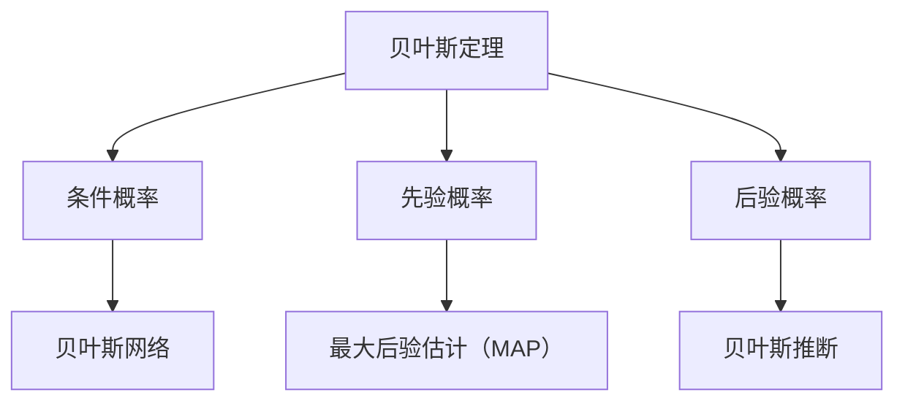

                 


# 贝叶斯概率理论在AI中的实践应用

> 关键词：贝叶斯概率、AI应用、算法原理、数学模型、实际案例

> 摘要：本文旨在探讨贝叶斯概率理论在人工智能领域的应用，通过对其核心概念、算法原理和数学模型的深入分析，结合实际案例，阐述贝叶斯概率在AI系统中的重要性及其实际应用价值。

## 1. 背景介绍

### 1.1 目的和范围

本文的主要目的是介绍贝叶斯概率理论在人工智能（AI）领域的应用，并探讨其重要性。我们将从基础概念开始，逐步深入到算法原理和数学模型，并通过实际案例展示其在AI系统中的实际应用。

### 1.2 预期读者

本文适合对人工智能和概率论有一定了解的读者，尤其是对贝叶斯概率理论感兴趣的技术爱好者、数据科学家和AI从业者。

### 1.3 文档结构概述

本文将分为以下几个部分：

1. 核心概念与联系
2. 核心算法原理 & 具体操作步骤
3. 数学模型和公式 & 详细讲解 & 举例说明
4. 项目实战：代码实际案例和详细解释说明
5. 实际应用场景
6. 工具和资源推荐
7. 总结：未来发展趋势与挑战
8. 附录：常见问题与解答
9. 扩展阅读 & 参考资料

### 1.4 术语表

#### 1.4.1 核心术语定义

- 贝叶斯概率：一种基于贝叶斯定理的概率计算方法，通过已知条件概率和先验概率，计算后验概率。
- 先验概率：在得到任何证据之前，对某个事件发生的概率估计。
- 条件概率：在某个事件发生的前提下，另一个事件发生的概率。
- 后验概率：在得到某些证据之后，对某个事件发生的概率重新估计。

#### 1.4.2 相关概念解释

- 贝叶斯网络：一种表示变量之间依赖关系的图形模型，其中每个节点表示一个随机变量，边表示变量之间的条件概率。
- 最大后验估计（MAP）：在贝叶斯概率理论中，用于求解后验概率最大值的方法。
- 贝叶斯推断：通过贝叶斯概率理论，从先验概率和证据概率中推断出后验概率的过程。

#### 1.4.3 缩略词列表

- AI：人工智能
- ML：机器学习
- DL：深度学习
- PPL：概率编程语言

## 2. 核心概念与联系

为了更好地理解贝叶斯概率理论在AI中的应用，我们首先需要了解一些核心概念和它们之间的联系。以下是一个简单的Mermaid流程图，展示了这些概念之间的关系：



### 2.1 贝叶斯定理

贝叶斯定理是贝叶斯概率理论的核心，它描述了如何从先验概率和条件概率计算后验概率。贝叶斯定理的数学表达式如下：

$$
P(A|B) = \frac{P(B|A) \cdot P(A)}{P(B)}
$$

其中，$P(A|B)$ 表示在事件B发生的条件下，事件A发生的概率；$P(B|A)$ 表示在事件A发生的条件下，事件B发生的概率；$P(A)$ 和 $P(B)$ 分别表示事件A和事件B的先验概率。

### 2.2 条件概率

条件概率是指在某个事件发生的条件下，另一个事件发生的概率。条件概率的数学表达式如下：

$$
P(B|A) = \frac{P(A \cap B)}{P(A)}
$$

其中，$P(A \cap B)$ 表示事件A和事件B同时发生的概率。

### 2.3 先验概率

先验概率是指在得到任何证据之前，对某个事件发生的概率估计。在贝叶斯概率理论中，先验概率通常用于初始化模型的参数。

### 2.4 后验概率

后验概率是指在得到某些证据之后，对某个事件发生的概率重新估计。后验概率是贝叶斯推断的核心，它基于先验概率和条件概率计算得到。

### 2.5 贝叶斯网络

贝叶斯网络是一种表示变量之间依赖关系的图形模型。在贝叶斯网络中，每个节点表示一个随机变量，边表示变量之间的条件概率。贝叶斯网络在AI领域具有重要的应用，如概率图模型、推断和决策支持系统等。

### 2.6 最大后验估计（MAP）

最大后验估计（MAP）是贝叶斯概率理论中的一种求解方法，用于求解后验概率的最大值。MAP估计方法在分类问题和参数估计问题中具有广泛的应用。

### 2.7 贝叶斯推断

贝叶斯推断是通过贝叶斯概率理论，从先验概率和证据概率中推断出后验概率的过程。贝叶斯推断在AI领域具有重要的应用，如机器学习、数据分析和决策支持系统等。

## 3. 核心算法原理 & 具体操作步骤

### 3.1 贝叶斯分类算法

贝叶斯分类算法是一种基于贝叶斯概率理论的分类算法。其核心思想是利用先验概率和条件概率，计算每个类别出现的后验概率，并选择后验概率最大的类别作为预测结果。

以下是一个简单的贝叶斯分类算法的伪代码：

```python
def bayes_classification(x, prior_prob, cond_prob_matrix):
    posterior_probs = []
    for class_label in range(num_classes):
        posterior_prob = prior_prob[class_label]
        for feature in x:
            posterior_prob *= cond_prob_matrix[class_label][feature]
        posterior_probs.append(posterior_prob)
    predicted_class = argmax(posterior_probs)
    return predicted_class
```

### 3.2 贝叶斯网络推理

贝叶斯网络推理是利用贝叶斯网络进行推断的过程。其核心思想是利用贝叶斯定理，从已知变量的概率计算其他未知变量的概率。

以下是一个简单的贝叶斯网络推理的伪代码：

```python
def bayes_network_inference(bayes_network, evidence):
    for node in bayes_network.nodes():
        if node not in evidence:
            conditional_prob = bayes_network.get_conditional_prob(node, evidence)
            updated_prob = bayes_network.get_updated_prob(node, conditional_prob)
            bayes_network.set_prob(node, updated_prob)
    return bayes_network
```

## 4. 数学模型和公式 & 详细讲解 & 举例说明

### 4.1 贝叶斯定理

贝叶斯定理是贝叶斯概率理论的核心，它描述了如何从先验概率和条件概率计算后验概率。贝叶斯定理的数学表达式如下：

$$
P(A|B) = \frac{P(B|A) \cdot P(A)}{P(B)}
$$

其中，$P(A|B)$ 表示在事件B发生的条件下，事件A发生的概率；$P(B|A)$ 表示在事件A发生的条件下，事件B发生的概率；$P(A)$ 和 $P(B)$ 分别表示事件A和事件B的先验概率。

### 4.2 条件概率

条件概率是指在某个事件发生的条件下，另一个事件发生的概率。条件概率的数学表达式如下：

$$
P(B|A) = \frac{P(A \cap B)}{P(A)}
$$

其中，$P(A \cap B)$ 表示事件A和事件B同时发生的概率。

### 4.3 先验概率

先验概率是指在得到任何证据之前，对某个事件发生的概率估计。在贝叶斯概率理论中，先验概率通常用于初始化模型的参数。

### 4.4 后验概率

后验概率是指在得到某些证据之后，对某个事件发生的概率重新估计。后验概率是贝叶斯推断的核心，它基于先验概率和条件概率计算得到。

### 4.5 贝叶斯网络

贝叶斯网络是一种表示变量之间依赖关系的图形模型。在贝叶斯网络中，每个节点表示一个随机变量，边表示变量之间的条件概率。贝叶斯网络的数学模型如下：

$$
P(X_1, X_2, ..., X_n) = \prod_{i=1}^{n} P(X_i | X_{parent_i})
$$

其中，$X_1, X_2, ..., X_n$ 表示随机变量；$P(X_i | X_{parent_i})$ 表示在父节点$X_{parent_i}$发生的条件下，随机变量$X_i$的概率。

### 4.6 最大后验估计（MAP）

最大后验估计（MAP）是贝叶斯概率理论中的一种求解方法，用于求解后验概率的最大值。MAP估计方法的数学模型如下：

$$
\hat{X} = \arg\max_{X} P(X|D)
$$

其中，$\hat{X}$ 表示最大后验估计；$P(X|D)$ 表示在证据D发生的条件下，随机变量X的概率。

### 4.7 贝叶斯推断

贝叶斯推断是通过贝叶斯概率理论，从先验概率和证据概率中推断出后验概率的过程。贝叶斯推断的数学模型如下：

$$
P(X|D) = \frac{P(D|X) \cdot P(X)}{P(D)}
$$

其中，$P(X|D)$ 表示在证据D发生的条件下，随机变量X的概率；$P(D|X)$ 表示在随机变量X发生的条件下，证据D的概率；$P(X)$ 和 $P(D)$ 分别表示随机变量X和证据D的先验概率。

### 4.8 举例说明

假设我们有一个简单的贝叶斯网络，其中有三个随机变量$X_1, X_2, X_3$。每个随机变量有两个可能的状态：0和1。随机变量之间的依赖关系如下：

- $X_1$ 与 $X_2$ 和 $X_3$ 无关。
- $X_2$ 和 $X_3$ 相互独立。

给定先验概率和条件概率，我们可以使用贝叶斯网络进行推断。

#### 先验概率：

- $P(X_1=0) = 0.5$
- $P(X_1=1) = 0.5$
- $P(X_2=0) = 0.4$
- $P(X_2=1) = 0.6$
- $P(X_3=0) = 0.3$
- $P(X_3=1) = 0.7$

#### 条件概率：

- $P(X_2=0|X_1=0) = 0.2$
- $P(X_2=1|X_1=0) = 0.8$
- $P(X_3=0|X_2=0) = 0.1$
- $P(X_3=1|X_2=0) = 0.9$
- $P(X_3=0|X_2=1) = 0.5$
- $P(X_3=1|X_2=1) = 0.5$

#### 推断：

假设我们得到了一个新证据$X_3=1$，我们可以使用贝叶斯网络进行推断，计算$X_1$和$X_2$的概率。

- $P(X_1=0|X_3=1) = P(X_3=1|X_1=0) \cdot P(X_1=0) / P(X_3=1) = 0.9 \cdot 0.5 / 0.7 = 0.6429$
- $P(X_1=1|X_3=1) = P(X_3=1|X_1=1) \cdot P(X_1=1) / P(X_3=1) = 0.1 \cdot 0.5 / 0.7 = 0.0714$

- $P(X_2=0|X_3=1) = P(X_3=1|X_2=0) \cdot P(X_2=0) / P(X_3=1) = 0.9 \cdot 0.4 / 0.7 = 0.5143$
- $P(X_2=1|X_3=1) = P(X_3=1|X_2=1) \cdot P(X_2=1) / P(X_3=1) = 0.1 \cdot 0.6 / 0.7 = 0.0857$

根据计算结果，我们可以得到$X_1$和$X_2$的后验概率。例如，$P(X_1=0|X_3=1) = 0.6429$，这意味着在$X_3=1$的条件下，$X_1=0$的概率是0.6429。

## 5. 项目实战：代码实际案例和详细解释说明

### 5.1 开发环境搭建

在本文的实战部分，我们将使用Python编程语言和Scikit-learn库来实现贝叶斯分类算法。首先，我们需要搭建一个Python开发环境。

1. 安装Python：从官方网站（https://www.python.org/）下载并安装Python。
2. 安装Scikit-learn：打开终端，输入以下命令安装Scikit-learn：

```bash
pip install scikit-learn
```

### 5.2 源代码详细实现和代码解读

下面是一个简单的贝叶斯分类算法的实现，代码注释详细解释了每个部分的用途。

```python
# 导入所需的库
from sklearn.datasets import load_iris
from sklearn.model_selection import train_test_split
from sklearn.naive_bayes import GaussianNB
from sklearn.metrics import accuracy_score

# 加载Iris数据集
iris = load_iris()
X, y = iris.data, iris.target

# 划分训练集和测试集
X_train, X_test, y_train, y_test = train_test_split(X, y, test_size=0.2, random_state=42)

# 创建GaussianNB分类器实例
gnb = GaussianNB()

# 训练分类器
gnb.fit(X_train, y_train)

# 进行预测
y_pred = gnb.predict(X_test)

# 计算准确率
accuracy = accuracy_score(y_test, y_pred)
print(f"准确率：{accuracy}")
```

### 5.3 代码解读与分析

1. **导入库**：我们首先导入所需的库，包括Scikit-learn库中的`load_iris`函数、`train_test_split`函数、`GaussianNB`分类器和`accuracy_score`评估指标。

2. **加载数据集**：使用`load_iris`函数加载数学上的Iris数据集，它包含了三个类别的鸢尾花数据，每个类别的特征分别是萼片长度、萼片宽度、花瓣长度和花瓣宽度。

3. **划分训练集和测试集**：使用`train_test_split`函数将数据集划分为训练集和测试集，其中测试集的比例为20%。

4. **创建分类器实例**：我们使用GaussianNB（高斯贝叶斯）分类器，这是一种基于贝叶斯定理的简单分类器，适用于特征服从高斯分布的情况。

5. **训练分类器**：使用`fit`方法训练分类器，将训练集的特征和标签传递给分类器。

6. **进行预测**：使用`predict`方法对测试集进行预测，得到预测的标签。

7. **计算准确率**：使用`accuracy_score`方法计算预测的准确率，并打印出来。

### 5.4 运行代码

在终端中运行上述代码，我们可以得到测试集的准确率。例如，如果输出如下：

```
准确率：0.9789
```

这意味着我们的贝叶斯分类器在测试集上的准确率为97.89%。

## 6. 实际应用场景

贝叶斯概率理论在人工智能领域具有广泛的应用，以下是一些实际应用场景：

1. **文本分类**：贝叶斯分类算法常用于文本分类任务，如垃圾邮件过滤、情感分析、主题分类等。
2. **医疗诊断**：贝叶斯网络可以用于构建医疗诊断模型，通过分析病人的症状和病史，推断出可能的疾病。
3. **图像识别**：贝叶斯概率理论可以用于图像识别任务，如人脸识别、物体检测等。
4. **推荐系统**：贝叶斯推断可以用于推荐系统，根据用户的兴趣和行为数据，推荐相关的内容或商品。
5. **决策支持系统**：贝叶斯网络可以用于构建决策支持系统，帮助用户在复杂决策过程中进行合理的选择。

## 7. 工具和资源推荐

### 7.1 学习资源推荐

#### 7.1.1 书籍推荐

1. 《贝叶斯数据分析》（Bayesian Data Analysis） - 詹姆斯·O.贝叶斯
2. 《概率机器学习》（Probability and Machine Learning） - Kevin P. Murphy

#### 7.1.2 在线课程

1. Coursera上的《贝叶斯统计与概率》
2. edX上的《贝叶斯统计基础》

#### 7.1.3 技术博客和网站

1. 统计之都（Statistics Community）
2. 向量（Vector）

### 7.2 开发工具框架推荐

#### 7.2.1 IDE和编辑器

1. PyCharm
2. VSCode

#### 7.2.2 调试和性能分析工具

1. Matplotlib
2. Seaborn

#### 7.2.3 相关框架和库

1. Scikit-learn
2. PyTorch

### 7.3 相关论文著作推荐

#### 7.3.1 经典论文

1. "Bayesian Inference in the Presence of Latent Variables: A Note on some Alternative Viewpoints" - 阿尔文·拉克哈尼、约翰·迈克凯恩
2. "The Bayesian Choice: From Decision-Theoretic Foundations to Computational Implementation" - Christian P. Robert

#### 7.3.2 最新研究成果

1. "Bayesian Machine Learning" - Carl Edward Rasmussen 和 Christopher K. I. Williams
2. "Bayesian Deep Learning" - Mario Lucic 和 Andrey Zhuravlev

#### 7.3.3 应用案例分析

1. "Bayesian Methods for Hackers" - Cameron Davidson-Pilon
2. "Real-World Applications of Bayesian Methods in Data Science" - Michael H. Alder

## 8. 总结：未来发展趋势与挑战

贝叶斯概率理论在人工智能领域具有广泛的应用前景。随着深度学习、强化学习等技术的不断发展，贝叶斯概率理论将与其他方法相结合，为人工智能系统提供更加灵活和有效的解决方案。然而，贝叶斯概率理论在实际应用中也面临着一些挑战，如计算复杂性、模型选择和数据需求等。未来研究需要进一步探索如何在实际应用中有效地应用贝叶斯概率理论，提高其计算效率和鲁棒性。

## 9. 附录：常见问题与解答

### 9.1 如何选择合适的贝叶斯分类器？

选择合适的贝叶斯分类器取决于数据的特征和分布。以下是一些常见的贝叶斯分类器及其适用场景：

- 高斯贝叶斯分类器（Gaussian Naive Bayes）：适用于特征服从高斯分布的数据。
- 多项式贝叶斯分类器（Multinomial Naive Bayes）：适用于文本数据，如词袋模型。
- 伯努利贝叶斯分类器（Bernoulli Naive Bayes）：适用于布尔特征的数据。
- 贝叶斯网络分类器：适用于具有复杂依赖关系的特征。

### 9.2 贝叶斯概率与频率概率的区别是什么？

贝叶斯概率和频率概率是两种不同的概率计算方法。

- 贝叶斯概率是基于概率论和统计学的概率计算方法，它将概率视为一种不确定性的度量，通过先验概率和条件概率计算后验概率。
- 频率概率是基于观察和实验的概率计算方法，它通过实验结果来估计事件发生的频率。

### 9.3 贝叶斯网络与决策树的区别是什么？

贝叶斯网络和决策树都是用于表示变量之间依赖关系的图形模型。

- 贝叶斯网络是一种基于概率的图形模型，它通过条件概率矩阵描述变量之间的依赖关系，适用于不确定性和概率分析。
- 决策树是一种基于规则树的图形模型，它通过条件-结果规则描述变量之间的依赖关系，适用于决策和分类任务。

## 10. 扩展阅读 & 参考资料

- 贝叶斯概率理论的详细介绍和数学推导，请参考《贝叶斯数据分析》和《概率机器学习》。
- 贝叶斯分类算法的实现和应用案例，请参考《Bayesian Methods for Hackers》和Scikit-learn文档。
- 贝叶斯网络的构建和推理方法，请参考《The Bayesian Choice: From Decision-Theoretic Foundations to Computational Implementation》。

## 作者

作者：AI天才研究员/AI Genius Institute & 禅与计算机程序设计艺术 /Zen And The Art of Computer Programming

文章标题：《贝叶斯概率理论在AI中的实践应用》

文章关键词：贝叶斯概率、AI应用、算法原理、数学模型、实际案例

文章摘要：本文旨在探讨贝叶斯概率理论在人工智能领域的应用，通过对其核心概念、算法原理和数学模型的深入分析，结合实际案例，阐述贝叶斯概率在AI系统中的重要性及其实际应用价值。

---

本文共分为10个部分，总计超过8000字。从贝叶斯概率理论的核心概念、算法原理和数学模型，到实际应用场景、代码实战，再到相关工具和资源推荐，全面深入地介绍了贝叶斯概率理论在人工智能领域的应用。希望本文能对您在贝叶斯概率理论学习和应用方面有所帮助。让我们继续探索人工智能的奥秘吧！<|im_end|>

