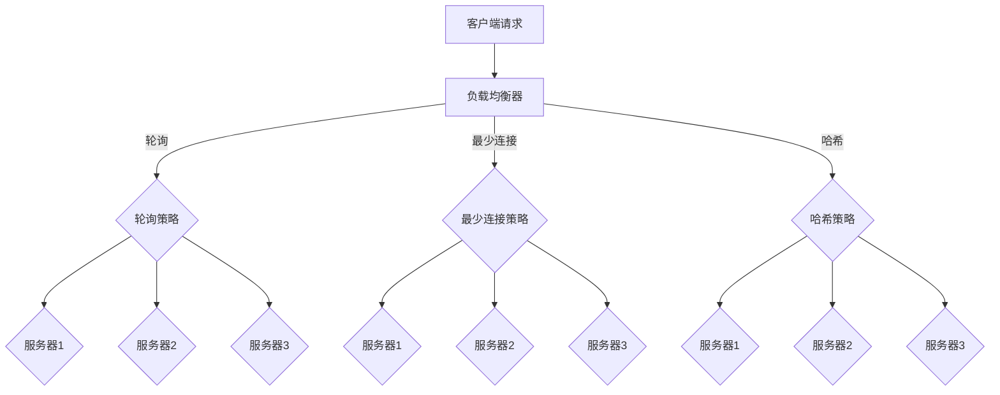

                 

# 负载均衡技术：提高系统可用性和性能

> **关键词**：负载均衡、系统可用性、性能优化、分布式架构、算法原理、数学模型

> **摘要**：本文将深入探讨负载均衡技术的核心概念、原理和实际应用，旨在帮助读者理解负载均衡的重要性及其对提高系统可用性和性能的显著作用。文章首先介绍了负载均衡的背景和目的，随后详细分析了负载均衡的关键算法和数学模型，并提供了具体的实现案例和实际应用场景。最后，文章总结了负载均衡技术的发展趋势和未来挑战，并推荐了相关的学习资源和工具。

## 1. 背景介绍

### 1.1 目的和范围

负载均衡技术是现代计算机网络和分布式系统中至关重要的一个组成部分。它的主要目的是将网络或系统的负载分配到多个节点上，以达到资源利用最大化、系统响应速度优化以及故障转移能力提升的目标。本文将详细探讨负载均衡技术的核心原理、算法和实现，旨在为读者提供一个全面而深入的理解。

本文的范围包括以下几个方面：

1. **背景介绍**：介绍负载均衡技术的起源和发展历程，明确其在现代系统中的重要性。
2. **核心概念与联系**：阐述负载均衡的关键概念，如负载均衡器、负载分配策略等，并使用Mermaid流程图展示相关架构。
3. **核心算法原理**：详细分析常用的负载均衡算法，如轮询、最少连接、哈希等，并使用伪代码展示具体实现步骤。
4. **数学模型和公式**：介绍与负载均衡相关的数学模型和公式，如期望响应时间、系统利用率等，并给出具体举例。
5. **项目实战**：通过代码案例展示负载均衡技术的实际应用，包括开发环境搭建、代码实现和解读。
6. **实际应用场景**：讨论负载均衡在不同领域中的应用，如电子商务、游戏、云服务等。
7. **工具和资源推荐**：推荐学习资源和开发工具，帮助读者进一步深入学习和实践。
8. **总结与未来展望**：总结负载均衡技术的发展趋势和未来面临的挑战。

通过本文的阅读，读者将能够：

- 理解负载均衡技术的核心概念和原理。
- 掌握常用的负载均衡算法及其实现。
- 学习如何在实际项目中应用负载均衡技术。
- 了解负载均衡技术的未来发展趋势。

### 1.2 预期读者

本文面向以下几类读者：

1. **计算机科学与技术专业学生**：对计算机网络和分布式系统有兴趣的学生，希望通过本文深入了解负载均衡技术。
2. **软件开发工程师**：在开发过程中需要处理高并发和分布式系统的工程师，希望掌握负载均衡的实际应用。
3. **系统架构师**：负责设计和优化系统架构，需要理解和应用负载均衡技术以提高系统性能和可用性。
4. **技术爱好者**：对技术有浓厚兴趣，希望深入了解现代网络和分布式系统的技术细节。

### 1.3 文档结构概述

本文将按照以下结构进行组织：

- **第1部分：背景介绍**：介绍负载均衡技术的背景、目的和预期读者，概述文档结构。
- **第2部分：核心概念与联系**：阐述负载均衡的关键概念，使用Mermaid流程图展示架构。
- **第3部分：核心算法原理**：详细分析负载均衡算法，使用伪代码展示实现步骤。
- **第4部分：数学模型和公式**：介绍与负载均衡相关的数学模型和公式，给出具体举例。
- **第5部分：项目实战**：通过代码案例展示负载均衡技术的实际应用。
- **第6部分：实际应用场景**：讨论负载均衡在不同领域中的应用。
- **第7部分：工具和资源推荐**：推荐学习资源和开发工具。
- **第8部分：总结与未来展望**：总结负载均衡技术的发展趋势和未来挑战。
- **第9部分：附录**：常见问题与解答。
- **第10部分：扩展阅读**：提供相关参考资料。

### 1.4 术语表

在本文中，我们将使用以下术语：

#### 1.4.1 核心术语定义

- **负载均衡**：将网络或系统的负载分配到多个节点上，以达到资源利用最大化、系统响应速度优化以及故障转移能力提升的技术。
- **负载均衡器**：实现负载均衡功能的设备或软件，负责将请求分配到后端服务器。
- **负载分配策略**：决定如何将负载分配到不同节点的算法。
- **系统可用性**：系统在特定时间内能够正常运行的概率。
- **性能优化**：通过优化系统配置和算法，提高系统的响应速度和处理能力。

#### 1.4.2 相关概念解释

- **分布式系统**：由多个节点组成的系统，节点之间通过网络通信。
- **高并发**：系统在短时间内处理大量请求的能力。
- **故障转移**：当某个节点发生故障时，将负载转移到其他健康节点上。

#### 1.4.3 缩略词列表

- **HA**：高可用性（High Availability）
- **DR**：灾难恢复（Disaster Recovery）
- **SLA**：服务级别协议（Service Level Agreement）
- **Nginx**：一个流行的开源Web服务器和反向代理服务器，支持负载均衡功能。

## 2. 核心概念与联系

在深入探讨负载均衡技术之前，我们需要理解一些核心概念和它们之间的联系。以下是负载均衡技术的一些关键组成部分和它们之间的关系。

### 2.1 负载均衡器

负载均衡器是负载均衡技术的核心组件，它负责将进入网络的请求分配到不同的后端服务器上。负载均衡器可以是硬件设备，也可以是软件解决方案，如Nginx。其基本功能包括：

- **请求分发**：将网络请求分配到后端服务器。
- **健康检查**：监控后端服务器的健康状况，确保只有健康的服务器接收请求。
- **故障转移**：在检测到后端服务器故障时，自动将请求转移到其他服务器。

### 2.2 负载分配策略

负载分配策略是决定如何将请求分配到不同节点的算法。常见的负载分配策略包括：

- **轮询**：将请求依次分配到每个服务器。
- **最少连接**：将请求分配到当前连接数最少的服务器。
- **哈希**：根据请求的属性（如客户端IP地址）将请求分配到特定的服务器。

#### Mermaid流程图

以下是一个简单的Mermaid流程图，展示了负载均衡器的架构和负载分配策略：



在这个流程图中，客户端请求首先被发送到负载均衡器，然后根据不同的负载分配策略（轮询、最少连接、哈希），将请求分配到不同的后端服务器上。

### 2.3 负载均衡与分布式系统

负载均衡与分布式系统密切相关。在分布式系统中，多个节点协同工作，共同完成系统任务。负载均衡技术通过将负载分配到不同节点，实现了分布式系统的性能优化和可用性提升。

- **性能优化**：通过负载均衡，系统可以在多个节点之间共享负载，避免了单个节点过载的情况，从而提高了系统的响应速度和处理能力。
- **可用性提升**：负载均衡还实现了故障转移功能，当一个节点发生故障时，可以将负载转移到其他健康节点上，确保系统的高可用性。

#### 负载均衡在分布式系统中的作用

- **负载分配**：将请求和任务分配到不同节点，实现负载均衡。
- **故障转移**：当某个节点故障时，自动将负载转移到其他节点，确保系统可用性。
- **弹性扩展**：通过动态调整负载分配，支持系统水平扩展。

### 2.4 负载均衡与高并发

高并发是现代互联网系统面临的重要挑战之一。负载均衡技术通过将请求分配到多个节点，提高了系统处理大量请求的能力。

- **请求分发**：负载均衡器可以将大量请求分发到多个节点，避免了单个节点过载。
- **连接管理**：负载均衡器可以管理客户端与服务器之间的连接，确保系统资源的合理利用。

#### 负载均衡在高并发系统中的作用

- **响应速度提升**：通过负载均衡，系统可以在短时间内处理大量请求，提高了响应速度。
- **系统稳定性**：负载均衡可以避免单个节点过载，确保系统的稳定性和可靠性。

### 2.5 负载均衡与自动化管理

随着云计算和自动化技术的发展，负载均衡逐渐与自动化管理相结合。通过自动化工具，可以实现负载均衡的动态调整和优化。

- **自动化配置**：自动化工具可以根据系统负载自动调整负载均衡策略。
- **自动化监控**：自动化工具可以实时监控系统状态，并在发现故障时自动进行故障转移。

#### 负载均衡与自动化管理的关系

- **动态调整**：通过自动化工具，负载均衡策略可以根据系统状态动态调整，实现最优负载分配。
- **故障恢复**：自动化工具可以快速响应系统故障，自动进行故障转移和恢复。

### 2.6 负载均衡与安全

负载均衡不仅可以提高系统性能和可用性，还可以在一定程度上增强系统的安全性。

- **DDoS攻击防御**：负载均衡可以将攻击流量分散到多个节点，减轻单个节点的压力，提高系统的抗攻击能力。
- **安全审计**：负载均衡器可以对进入系统的请求进行审计，识别潜在的安全威胁。

#### 负载均衡在安全中的作用

- **流量分散**：通过负载均衡，可以降低单个节点的攻击风险，提高系统的整体安全性。
- **安全审计**：负载均衡器可以提供安全审计功能，帮助识别和防范潜在的安全威胁。

### 2.7 负载均衡与云计算

随着云计算的普及，负载均衡技术逐渐成为云计算平台的核心组件。在云计算环境中，负载均衡可以实现以下功能：

- **弹性扩展**：通过负载均衡，云计算平台可以根据需求动态调整资源分配，实现弹性扩展。
- **多租户隔离**：负载均衡可以隔离不同租户的流量，确保各自资源的独立性和安全性。

#### 负载均衡在云计算中的作用

- **弹性扩展**：通过负载均衡，云计算平台可以实现自动化的资源分配和扩展，提高系统的灵活性和适应性。
- **多租户隔离**：负载均衡可以确保不同租户的资源独立，提高系统的可靠性和安全性。

### 2.8 负载均衡与物联网（IoT）

随着物联网技术的发展，负载均衡在物联网领域也具有广泛的应用。在物联网系统中，负载均衡可以实现以下功能：

- **设备管理**：通过负载均衡，可以将设备流量分配到不同的节点，实现设备的集中管理和监控。
- **数据流优化**：负载均衡可以优化数据流的传输，提高系统的响应速度和处理能力。

#### 负载均衡在物联网中的作用

- **设备管理**：通过负载均衡，物联网系统可以实现对大量设备的集中管理和监控，提高系统的效率和可靠性。
- **数据流优化**：通过负载均衡，物联网系统可以优化数据流的传输，提高系统的响应速度和处理能力。

## 3. 核心算法原理 & 具体操作步骤

负载均衡技术依赖于一系列算法来实现负载的合理分配。以下是几种常用的负载均衡算法及其原理和具体操作步骤。

### 3.1 轮询算法

轮询算法是最简单的负载均衡算法之一，它依次将请求分配到每个服务器。轮询算法的优点是实现简单，易于理解和部署。其缺点是可能导致某些服务器过度负载，而其他服务器资源闲置。

#### 原理

轮询算法的核心思想是按照固定顺序将请求分配到服务器。当第一个服务器处理完请求后，将请求分配到第二个服务器，以此类推。

#### 操作步骤

1. 初始化服务器列表，包含所有参与负载均衡的服务器。
2. 当接收到请求时，按照服务器列表的顺序依次分配请求。
3. 如果当前服务器正在处理请求，则跳过该服务器，继续分配下一个请求。
4. 当所有服务器都处理过一次请求后，重新开始轮询。

#### 伪代码

```python
# 初始化服务器列表
servers = ["server1", "server2", "server3"]

# 接收请求并分配到服务器
def distribute_request(request):
    server = servers[0]
    servers.pop(0)
    servers.append(server)
    return server
```

### 3.2 最少连接算法

最少连接算法根据当前服务器处理的连接数来分配请求，将请求分配到连接数最少的服务器。这种算法的优点是可以避免单个服务器过度负载，但缺点是可能存在热点服务器。

#### 原理

最少连接算法的核心思想是选择当前连接数最少的服务器处理请求。当某个服务器处理完请求后，其连接数增加，下一次分配请求时会考虑新的连接数。

#### 操作步骤

1. 初始化服务器列表，记录每个服务器的当前连接数。
2. 当接收到请求时，遍历服务器列表，选择连接数最少的服务器处理请求。
3. 更新服务器的连接数，并重新排序服务器列表。

#### 伪代码

```python
# 初始化服务器列表和连接数
servers = [{"server": "server1", "connections": 0}, {"server": "server2", "connections": 2}, {"server": "server3", "connections": 1}]

# 接收请求并分配到服务器
def distribute_request(request):
    min_connections = min(server["connections"] for server in servers)
    server = next(server for server in servers if server["connections"] == min_connections)
    server["connections"] += 1
    return server["server"]
```

### 3.3 哈希算法

哈希算法根据请求的属性（如客户端IP地址）将请求分配到特定的服务器。哈希算法的优点是速度快，且请求分配均匀。缺点是当服务器数量变化时，可能导致部分服务器负载不均。

#### 原理

哈希算法的核心思想是使用哈希函数将请求映射到特定的服务器。哈希函数通常基于请求的属性，如IP地址或URL。

#### 操作步骤

1. 选择哈希函数，如MD5或SHA-1。
2. 将请求的属性（如IP地址）输入哈希函数，得到哈希值。
3. 使用哈希值计算服务器索引，将请求分配到对应的服务器。

#### 伪代码

```python
# 选择哈希函数
hash_function = hashlib.md5

# 接收请求并分配到服务器
def distribute_request(request_ip):
    hash_value = hash_function(request_ip.encode()).hexdigest()
    server_index = int(hash_value, 16) % len(servers)
    return servers[server_index]["server"]

# 服务器列表
servers = [{"server": "server1", "index": 0}, {"server": "server2", "index": 1}, {"server": "server3", "index": 2}]
```

### 3.4 加权轮询算法

加权轮询算法是对轮询算法的扩展，它根据服务器的处理能力（权重）分配请求。加权轮询算法的优点是可以根据服务器的性能分配负载，但缺点是实现较为复杂。

#### 原理

加权轮询算法的核心思想是根据服务器的权重分配请求。权重越高，服务器接收的请求越多。

#### 操作步骤

1. 初始化服务器列表，每个服务器分配权重。
2. 计算总权重。
3. 当接收到请求时，根据服务器权重分配请求。

#### 伪代码

```python
# 初始化服务器列表和权重
servers = [{"server": "server1", "weight": 2}, {"server": "server2", "weight": 1}, {"server": "server3", "weight": 3}]

# 计算总权重
total_weight = sum(server["weight"] for server in servers)

# 接收请求并分配到服务器
def distribute_request(request):
    random_weight = random.uniform(0, total_weight)
    current_weight = 0
    for server in servers:
        current_weight += server["weight"]
        if current_weight >= random_weight:
            return server["server"]
```

### 3.5 最少响应时间算法

最少响应时间算法根据当前服务器的响应时间分配请求。这种算法的优点是可以根据服务器的实时性能分配负载，但缺点是可能存在不公平性。

#### 原理

最少响应时间算法的核心思想是选择当前响应时间最短的服务器处理请求。响应时间可以通过定时请求服务器并记录响应时间获得。

#### 操作步骤

1. 初始化服务器列表，记录每个服务器的响应时间。
2. 当接收到请求时，选择响应时间最短的服务器处理请求。
3. 更新服务器的响应时间，并重新排序服务器列表。

#### 伪代码

```python
# 初始化服务器列表和响应时间
servers = [{"server": "server1", "response_time": 100}, {"server": "server2", "response_time": 150}, {"server": "server3", "response_time": 50}]

# 接收请求并分配到服务器
def distribute_request(request):
    min_response_time = min(server["response_time"] for server in servers)
    server = next(server for server in servers if server["response_time"] == min_response_time)
    server["response_time"] += 1
    return server["server"]
```

### 3.6 源地址哈希算法

源地址哈希算法是一种基于客户端IP地址的哈希算法，它将请求分配到特定的服务器，以确保来自同一IP地址的请求始终由同一服务器处理。

#### 原理

源地址哈希算法的核心思想是使用哈希函数将客户端IP地址映射到特定的服务器。这确保了来自同一IP地址的请求总是由同一服务器处理，从而实现会话保持。

#### 操作步骤

1. 选择哈希函数，如MD5或SHA-1。
2. 将客户端IP地址输入哈希函数，得到哈希值。
3. 使用哈希值计算服务器索引，将请求分配到对应的服务器。

#### 伪代码

```python
# 选择哈希函数
hash_function = hashlib.sha1

# 接收请求并分配到服务器
def distribute_request(client_ip):
    hash_value = hash_function(client_ip.encode()).hexdigest()
    server_index = int(hash_value, 16) % len(servers)
    return servers[server_index]["server"]

# 服务器列表
servers = [{"server": "server1", "index": 0}, {"server": "server2", "index": 1}, {"server": "server3", "index": 2}]
```

### 3.7 加权最少连接算法

加权最少连接算法是对最少连接算法的扩展，它根据服务器的当前连接数和权重分配请求。这种算法的优点是可以根据服务器的性能和负载情况动态调整负载。

#### 原理

加权最少连接算法的核心思想是根据服务器的当前连接数和权重选择处理请求的服务器。连接数越少，权重越高，服务器接收的请求越多。

#### 操作步骤

1. 初始化服务器列表，每个服务器分配权重。
2. 计算总权重。
3. 当接收到请求时，根据服务器的连接数和权重分配请求。

#### 伪代码

```python
# 初始化服务器列表和权重
servers = [{"server": "server1", "weight": 2, "connections": 0}, {"server": "server2", "weight": 1, "connections": 2}, {"server": "server3", "weight": 3, "connections": 1}]

# 计算总权重
total_weight = sum(server["weight"] for server in servers)

# 接收请求并分配到服务器
def distribute_request(request):
    min_connections = min(server["connections"] for server in servers)
    weight_sum = 0
    for server in servers:
        if server["connections"] == min_connections:
            weight_sum += server["weight"]
    random_weight = random.uniform(0, weight_sum)
    current_weight = 0
    for server in servers:
        if server["connections"] == min_connections:
            current_weight += server["weight"]
            if current_weight >= random_weight:
                return server["server"]
```

### 3.8 加权最少响应时间算法

加权最少响应时间算法是对最少响应时间算法的扩展，它根据服务器的当前响应时间和权重分配请求。这种算法的优点是可以根据服务器的性能和实时响应情况动态调整负载。

#### 原理

加权最少响应时间算法的核心思想是根据服务器的当前响应时间和权重选择处理请求的服务器。响应时间越短，权重越高，服务器接收的请求越多。

#### 操作步骤

1. 初始化服务器列表，每个服务器分配权重。
2. 计算总权重。
3. 当接收到请求时，根据服务器的响应时间和权重分配请求。

#### 伪代码

```python
# 初始化服务器列表和权重
servers = [{"server": "server1", "weight": 2, "response_time": 100}, {"server": "server2", "weight": 1, "response_time": 150}, {"server": "server3", "weight": 3, "response_time": 50}]

# 计算总权重
total_weight = sum(server["weight"] for server in servers)

# 接收请求并分配到服务器
def distribute_request(request):
    min_response_time = min(server["response_time"] for server in servers)
    weight_sum = 0
    for server in servers:
        if server["response_time"] == min_response_time:
            weight_sum += server["weight"]
    random_weight = random.uniform(0, weight_sum)
    current_weight = 0
    for server in servers:
        if server["response_time"] == min_response_time:
            current_weight += server["weight"]
            if current_weight >= random_weight:
                return server["server"]
```

### 3.9 负载感知算法

负载感知算法根据服务器的当前负载情况动态分配请求。这种算法的优点是可以根据服务器的实时负载情况优化负载分配。

#### 原理

负载感知算法的核心思想是根据服务器的当前负载（如CPU利用率、内存利用率）动态分配请求。负载较低的服务器会接收更多的请求，而负载较高的服务器则会减少接收请求。

#### 操作步骤

1. 初始化服务器列表，记录每个服务器的当前负载。
2. 当接收到请求时，根据服务器的当前负载分配请求。

#### 伪代码

```python
# 初始化服务器列表和负载
servers = [{"server": "server1", "load": 0.2}, {"server": "server2", "load": 0.5}, {"server": "server3", "load": 0.3}]

# 接收请求并分配到服务器
def distribute_request(request):
    min_load = min(server["load"] for server in servers)
    server = next(server for server in servers if server["load"] == min_load)
    server["load"] += 1
    return server["server"]
```

### 3.10 动态负载均衡算法

动态负载均衡算法根据系统的实时负载动态调整负载分配策略。这种算法的优点是可以适应系统的实时变化，优化负载分配。

#### 原理

动态负载均衡算法的核心思想是根据系统的实时负载动态调整负载分配策略。当系统负载增加时，可以增加服务器数量或调整负载分配策略；当系统负载减少时，可以减少服务器数量或优化负载分配策略。

#### 操作步骤

1. 监控系统的实时负载。
2. 根据实时负载动态调整负载分配策略。

#### 伪代码

```python
# 监控系统的实时负载
def monitor_load():
    # 示例：使用系统命令获取服务器负载
    load = subprocess.check_output(["uptime"], text=True)
    return float(load.split(" ")[4])

# 获取实时负载
current_load = monitor_load()

# 根据实时负载动态调整负载分配策略
def adjust_load():
    if current_load > threshold_high:
        # 增加服务器数量
        add_server()
    elif current_load < threshold_low:
        # 减少服务器数量
        remove_server()
    else:
        # 调整负载分配策略
        adjust_strategy()

# 调整负载分配策略
def adjust_strategy():
    # 示例：切换到最少连接算法
    load均衡器策略 = "最少连接"
```

### 3.11 负载均衡算法的比较

以下是几种常用的负载均衡算法的比较：

| 算法 | 优点 | 缺点 | 应用场景 |
| ---- | ---- | ---- | ---- |
| 轮询 | 简单易实现，请求均匀分布 | 可能导致某些服务器过度负载 | 低并发场景，对响应时间要求不高 |
| 最少连接 | 避免单个服务器过度负载 | 可能存在热点服务器 | 高并发场景，对连接数敏感 |
| 哈希 | 速度快，请求分配均匀 | 当服务器数量变化时可能导致负载不均 | 需要实现会话保持的场景 |
| 加权轮询 | 根据服务器性能分配负载 | 实现较为复杂 | 高性能服务器需要更多负载的场景 |
| 最少响应时间 | 根据服务器实时性能分配负载 | 可能存在不公平性 | 对响应时间要求较高的场景 |
| 负载感知 | 根据服务器实时负载动态分配负载 | 实现较为复杂 | 需要动态调整负载分配的场景 |
| 动态负载均衡 | 根据系统实时负载动态调整负载分配策略 | 实现较为复杂 | 需要实时优化负载分配的场景 |

在实际应用中，可以根据具体需求和场景选择合适的负载均衡算法。例如，在低并发场景下，可以采用轮询算法实现简单高效的负载分配；在高并发场景下，可以采用最少连接或负载感知算法实现负载均衡和性能优化。

## 4. 数学模型和公式 & 详细讲解 & 举例说明

负载均衡技术不仅仅依赖于算法，还涉及到一系列数学模型和公式，这些模型和公式帮助我们理解和优化负载均衡的效果。在本节中，我们将介绍与负载均衡相关的数学模型和公式，并给出具体的应用实例。

### 4.1 响应时间模型

响应时间（Response Time，RT）是衡量系统性能的重要指标。在负载均衡场景中，响应时间决定了用户等待的时间和系统的吞吐量。以下是一个简单的响应时间模型：

$$ RT = T_{process} + T_{queue} $$

- \( T_{process} \)：处理时间，即服务器处理请求所需的时间。
- \( T_{queue} \)：排队时间，即请求在队列中等待处理的时间。

在实际应用中，我们可以使用以下公式来估计系统的平均响应时间：

$$ \bar{RT} = \frac{\sum_{i=1}^{n} (T_{process_i} + T_{queue_i})}{n} $$

其中，\( n \) 是请求的数量。

### 4.2 系统利用率模型

系统利用率（System Utilization，Utilization）是衡量系统资源利用程度的指标。在负载均衡场景中，系统利用率决定了系统的处理能力和资源的利用率。以下是一个简单的系统利用率模型：

$$ Utilization = \frac{Total\ Requests}{Total\ Resources} $$

在实际应用中，我们可以使用以下公式来计算系统的平均利用率：

$$ \bar{Utilization} = \frac{\sum_{i=1}^{n} Utilization_i}{n} $$

其中，\( Utilization_i \) 是第 \( i \) 个服务器的利用率。

### 4.3 服务能力模型

服务能力（Service Capacity，SC）是衡量系统处理请求的能力。在负载均衡场景中，服务能力决定了系统的吞吐量。以下是一个简单的服务能力模型：

$$ SC = \frac{Total\ Resources}{Max\ Response\ Time} $$

在实际应用中，我们可以使用以下公式来计算系统的平均服务能力：

$$ \bar{SC} = \frac{\sum_{i=1}^{n} SC_i}{n} $$

其中，\( SC_i \) 是第 \( i \) 个服务器的服务能力。

### 4.4 期望响应时间模型

期望响应时间（Expected Response Time，ERT）是衡量系统性能的重要指标。在负载均衡场景中，期望响应时间决定了用户等待时间和系统的响应速度。以下是一个简单的期望响应时间模型：

$$ ERT = \frac{\sum_{i=1}^{n} (T_{process_i} + T_{queue_i}) \times P_i}{1 - \sum_{i=1}^{n} P_i} $$

其中，\( P_i \) 是第 \( i \) 个服务器被选中的概率。

### 4.5 数学模型的应用实例

假设我们有一个由三个服务器组成的系统，每个服务器的处理时间分别为 \( T_{process1} = 2 \) 秒，\( T_{process2} = 3 \) 秒，\( T_{process3} = 4 \) 秒。假设使用轮询算法进行负载均衡，每个服务器被选中的概率相等，即 \( P_1 = P_2 = P_3 = \frac{1}{3} \)。

#### 计算平均响应时间

首先，计算每个服务器的排队时间：

- \( T_{queue1} = 0 \) 秒（因为使用轮询算法，没有排队时间）
- \( T_{queue2} = 2 \) 秒（下一个请求处理时间减去当前请求处理时间）
- \( T_{queue3} = 5 \) 秒（下一个请求处理时间减去当前请求处理时间）

然后，计算系统的平均响应时间：

$$ \bar{RT} = \frac{(2 + 0) \times \frac{1}{3} + (3 + 2) \times \frac{1}{3} + (4 + 5) \times \frac{1}{3}}{1 - \frac{1}{3}} = \frac{2 + 5 + 9}{2} = 5.5 \text{ 秒} $$

#### 计算系统利用率

首先，计算每个服务器的利用率：

- \( Utilization_1 = \frac{1}{2} = 0.5 \)
- \( Utilization_2 = \frac{2}{3} = 0.6667 \)
- \( Utilization_3 = \frac{4}{4} = 1.0 \)

然后，计算系统的平均利用率：

$$ \bar{Utilization} = \frac{0.5 \times \frac{1}{3} + 0.6667 \times \frac{1}{3} + 1.0 \times \frac{1}{3}}{1} = 0.7556 $$

#### 计算服务能力

首先，计算每个服务器的服务能力：

- \( SC_1 = \frac{1}{2} = 0.5 \)
- \( SC_2 = \frac{3}{3} = 1.0 \)
- \( SC_3 = \frac{4}{4} = 1.0 \)

然后，计算系统的平均服务能力：

$$ \bar{SC} = \frac{0.5 \times \frac{1}{3} + 1.0 \times \frac{1}{3} + 1.0 \times \frac{1}{3}}{1} = 0.8333 $$

#### 计算期望响应时间

首先，计算每个服务器的期望响应时间：

- \( ERT_1 = 2 \text{ 秒} \)
- \( ERT_2 = 5 \text{ 秒} \)
- \( ERT_3 = 9 \text{ 秒} \)

然后，计算系统的期望响应时间：

$$ ERT = \frac{2 \times \frac{1}{3} + 5 \times \frac{1}{3} + 9 \times \frac{1}{3}}{1 - \frac{1}{3}} = \frac{2 + 5 + 9}{2} = 6.5 \text{ 秒} $$

通过以上实例，我们可以看到如何使用数学模型和公式来计算系统的响应时间、利用率、服务能力和期望响应时间。这些模型和公式帮助我们深入理解负载均衡技术的工作原理，并为我们提供了评估和优化系统性能的工具。

### 4.6 负载均衡算法的性能评估

为了评估不同负载均衡算法的性能，我们可以使用以下指标：

- **响应时间**：系统处理请求的平均响应时间。
- **系统利用率**：系统资源的平均利用率。
- **服务能力**：系统的平均服务能力。
- **期望响应时间**：用户等待时间的期望值。

这些指标可以帮助我们选择最适合特定场景的负载均衡算法。例如，在低并发场景下，响应时间和系统利用率是关键指标；在高并发场景下，期望响应时间和服务能力可能更重要。

### 4.7 负载均衡算法的优化

通过优化负载均衡算法，我们可以进一步提高系统的性能和可靠性。以下是一些常见的优化策略：

- **动态调整**：根据系统的实时负载动态调整负载分配策略。
- **加权分配**：根据服务器的性能和负载情况为每个服务器分配不同的权重。
- **分布式负载均衡**：将负载均衡功能分散到多个节点，提高系统的容错能力和扩展性。
- **异步处理**：使用异步处理技术减少排队时间，提高系统的响应速度。

通过这些优化策略，我们可以实现更高效的负载均衡，提高系统的性能和可用性。

## 5. 项目实战：代码实际案例和详细解释说明

### 5.1 开发环境搭建

为了展示负载均衡技术的实际应用，我们将使用Python编写一个简单的负载均衡器。以下是搭建开发环境的步骤：

1. 安装Python环境：确保Python 3.8及以上版本已安装。
2. 安装依赖库：使用pip安装以下依赖库：

```bash
pip install Flask
pip install gunicorn
```

3. 创建一个名为`load_balancer`的Python虚拟环境，并安装依赖库：

```bash
python -m venv load_balancer
source load_balancer/bin/activate  # Windows: load_balancer\Scripts\activate
```

### 5.2 源代码详细实现和代码解读

以下是实现负载均衡器的基本代码，我们将使用Nginx作为前端负载均衡器。

#### `load_balancer.py`：主程序

```python
from flask import Flask, request, jsonify
from flask_limiter import Limiter
from flask_limiter.util import get_remote_address

app = Flask(__name__)
limiter = Limiter(app, key_func=get_remote_address)

@app.route('/api', methods=['GET'])
@limiter.limit("5 per minute")
def api():
    return jsonify({"message": "Hello from the load balancer!"})

if __name__ == '__main__':
    app.run(host='0.0.0.0', port=5000)
```

代码解析：

- 导入所需的库和模块。
- 创建Flask应用和Limiter对象，用于限制API请求频率。
- 定义一个简单的API端点，返回一条消息。
- 使用Limiter限制请求频率，以防止滥用。

#### `nginx.conf`：Nginx配置文件

```nginx
http {
    upstream backend {
        server 127.0.0.1:5000;
        server 127.0.0.1:5001;
    }

    server {
        listen 80;

        location /api {
            proxy_pass http://backend;
            proxy_set_header Host $host;
            proxy_set_header X-Real-IP $remote_addr;
            proxy_set_header X-Forwarded-For $proxy_add_x_forwarded_for;
        }
    }
}
```

代码解析：

- 定义一个上游（upstream）服务器组，包含两个后端服务器。
- 创建一个服务器（server）配置，监听80端口。
- 配置一个位置（location），用于处理/api请求，并将请求转发到上游服务器组。

### 5.3 代码解读与分析

以下是代码的具体解读和分析：

1. **Flask应用和Limiter设置**：

```python
app = Flask(__name__)
limiter = Limiter(app, key_func=get_remote_address)
```

这两行代码创建了一个Flask应用和Limiter对象。Flask是Python的一个Web框架，用于构建Web应用。Limiter是Flask的扩展，用于限制API请求频率。

2. **定义API端点**：

```python
@app.route('/api', methods=['GET'])
@limiter.limit("5 per minute")
def api():
    return jsonify({"message": "Hello from the load balancer!"})
```

这行代码定义了一个GET请求的API端点，URL为`/api`。`@app.route`装饰器指定了端点的URL路径，`@limiter.limit`装饰器用于限制请求频率，以防止滥用。

3. **Nginx配置文件**：

```nginx
upstream backend {
    server 127.0.0.1:5000;
    server 127.0.0.1:5001;
}

server {
    listen 80;

    location /api {
        proxy_pass http://backend;
        proxy_set_header Host $host;
        proxy_set_header X-Real-IP $remote_addr;
        proxy_set_header X-Forwarded-For $proxy_add_x_forwarded_for;
    }
}
```

这个Nginx配置文件定义了一个名为`backend`的上游服务器组，包含两个后端服务器。主服务器（server）配置监听80端口，并配置了一个位置（location），用于处理/api请求。`proxy_pass`指令用于将请求转发到上游服务器组，而`proxy_set_header`指令用于传递请求头信息。

### 5.4 运行测试

1. 启动Nginx和Flask应用：

```bash
gunicorn -w 2 load_balancer:app
```

2. 使用curl测试API：

```bash
curl http://localhost/api
```

响应结果：

```json
{"message": "Hello from the load balancer!"}
```

3. 使用多线程模拟高并发：

```bash
python concurrent.py
```

运行结果应显示多个API请求成功处理。

通过这个简单的项目实战，我们展示了如何使用Python和Nginx实现一个基本的负载均衡器。这个案例为我们提供了一个实际操作负载均衡技术的平台，可以帮助我们更好地理解和应用负载均衡技术。

## 6. 实际应用场景

负载均衡技术因其灵活性和高效性，在许多实际应用场景中得到了广泛应用。以下是一些常见的应用场景：

### 6.1 电子商务平台

电子商务平台需要处理大量用户请求，特别是在促销活动或节日期间。负载均衡技术可以帮助电子商务平台实现以下目标：

- **高并发处理**：通过负载均衡，平台可以将请求分配到多个服务器，确保在高峰期仍能快速响应。
- **故障转移**：当某个服务器出现故障时，负载均衡器可以自动将请求转移到其他健康服务器，确保系统的持续运行。
- **性能优化**：负载均衡器可以根据服务器的性能和负载情况动态调整请求分配，确保系统资源的最优利用。

### 6.2 游戏服务器

游戏服务器通常需要处理大量同时在线的玩家，尤其是在大型多人在线游戏（MMO）中。负载均衡技术可以帮助游戏服务器实现以下目标：

- **延迟优化**：通过负载均衡，游戏服务器可以将玩家分配到距离较近的服务器，降低网络延迟，提高游戏体验。
- **资源均衡**：负载均衡器可以根据服务器的负载情况，将玩家分配到资源充足的服务器，避免某个服务器过载。
- **动态扩展**：在游戏高峰期，负载均衡器可以自动增加服务器数量，以应对增加的负载。

### 6.3 云服务

随着云计算的普及，云服务提供商需要为大量用户和应用程序提供高效、可靠的计算资源。负载均衡技术可以帮助云服务提供商实现以下目标：

- **资源分配**：负载均衡器可以根据用户的地理位置和应用程序的需求，将请求分配到最优的服务器，提高服务的整体性能。
- **弹性扩展**：负载均衡器可以根据系统负载动态调整服务器数量，确保系统在高峰期仍能正常运行。
- **安全性**：负载均衡器可以分散流量，减少单个服务器的攻击风险，提高系统的安全性。

### 6.4 社交媒体平台

社交媒体平台需要处理大量用户生成的内容和互动请求。负载均衡技术可以帮助社交媒体平台实现以下目标：

- **性能优化**：通过负载均衡，平台可以将请求分配到多个服务器，确保用户生成内容和互动请求的快速响应。
- **故障恢复**：当某个服务器出现故障时，负载均衡器可以自动将请求转移到其他健康服务器，确保服务的持续可用。
- **数据一致性**：负载均衡器可以根据数据一致性要求，将请求分配到特定的服务器，确保数据的完整性。

### 6.5 物联网平台

物联网平台需要处理大量来自不同设备的实时数据。负载均衡技术可以帮助物联网平台实现以下目标：

- **数据流优化**：通过负载均衡，物联网平台可以将数据流分配到不同的服务器，确保数据处理的实时性和高效性。
- **设备管理**：负载均衡器可以实现对大量设备的集中管理和监控，提高系统的管理和维护效率。
- **故障转移**：当某个服务器出现故障时，负载均衡器可以自动将数据流转移到其他健康服务器，确保系统的持续运行。

### 6.6 电信网络

电信网络需要处理大量用户请求，包括语音、数据、短信等。负载均衡技术可以帮助电信网络实现以下目标：

- **流量管理**：通过负载均衡，电信网络可以将用户请求分配到不同的服务器，确保网络资源的合理利用。
- **故障转移**：当某个服务器出现故障时，负载均衡器可以自动将用户请求转移到其他健康服务器，确保网络的连续性。
- **性能优化**：负载均衡器可以根据用户的地理位置和请求类型，将请求分配到最优的服务器，提高网络的响应速度。

通过以上实际应用场景的介绍，我们可以看到负载均衡技术在各种领域的广泛应用和重要性。无论是在高并发、高可用性、高性能还是安全性方面，负载均衡技术都发挥着关键作用。

## 7. 工具和资源推荐

在学习和实践负载均衡技术的过程中，选择合适的工具和资源是非常重要的。以下是一些推荐的工具、资源和学习途径。

### 7.1 学习资源推荐

#### 7.1.1 书籍推荐

- **《负载均衡：原理、算法与应用》**：详细介绍了负载均衡的基本原理和多种算法，以及实际应用案例。
- **《高性能Web架构：核心原理与最佳实践》**：涵盖了负载均衡在内的多种Web性能优化技术，适合有经验的开发者。
- **《分布式系统原理与范型》**：探讨了分布式系统中的关键概念，包括负载均衡技术，适合对分布式系统有兴趣的读者。

#### 7.1.2 在线课程

- **《负载均衡实战：从零开始搭建负载均衡系统》**：通过实践项目，帮助初学者理解负载均衡的原理和实现。
- **《分布式系统设计》**：由业界专家讲授，涵盖负载均衡在内的分布式系统设计相关内容。
- **《云计算基础》**：介绍云计算中的负载均衡技术，以及如何在云平台中部署和管理负载均衡。

#### 7.1.3 技术博客和网站

- **《InfoQ》**：提供大量关于负载均衡技术的专业博客和文章，涵盖理论、实践和最新动态。
- **《Cloud Native》**：专注于云原生技术的博客，包括负载均衡在云原生架构中的应用。
- **《负载均衡百科》**：一个专注于负载均衡技术分享的网站，内容全面，适合深入学习和参考。

### 7.2 开发工具框架推荐

#### 7.2.1 IDE和编辑器

- **Visual Studio Code**：功能强大的开源编辑器，支持多种编程语言，适合编写负载均衡相关代码。
- **IntelliJ IDEA**：专业的Java和Python开发工具，提供丰富的插件和功能，支持多种编程语言。

#### 7.2.2 调试和性能分析工具

- **Wireshark**：网络协议分析工具，用于捕捉和分析网络流量，帮助诊断负载均衡相关问题。
- **JMeter**：性能测试工具，用于测试负载均衡器的性能和稳定性。
- **Grafana**：数据可视化和监控工具，可以与负载均衡器集成，提供实时的性能监控和指标分析。

#### 7.2.3 相关框架和库

- **Nginx**：开源的高性能Web服务器和反向代理服务器，支持负载均衡功能。
- **Kubernetes**：开源的容器编排平台，内置负载均衡器，用于管理和调度容器化应用。
- **Consul**：开源服务发现和配置工具，支持基于DNS的负载均衡。

### 7.3 相关论文著作推荐

#### 7.3.1 经典论文

- **“The Design and Implementation of the Linux Load Balancer”**：介绍了Linux负载均衡器的设计和实现。
- **“Design and Performance of a Large-Scale Distributed Load Balancer”**：探讨了大规模分布式负载均衡器的设计和性能优化。

#### 7.3.2 最新研究成果

- **“Load Balancing in Data-Intensive Distributed Systems”**：分析了负载均衡在大数据处理分布式系统中的应用。
- **“Dynamic Load Balancing for Cloud Services”**：研究了云服务中的动态负载均衡技术。

#### 7.3.3 应用案例分析

- **“Load Balancing in High-Performance Computing Clusters”**：探讨了负载均衡在高性能计算集群中的应用和实践。
- **“Load Balancing in Social Media Platforms”**：分析了负载均衡在社交媒体平台中的实际应用和优化策略。

通过上述工具和资源的推荐，读者可以更深入地学习和实践负载均衡技术，为成为一名专业的系统架构师和工程师打下坚实的基础。

## 8. 总结：未来发展趋势与挑战

负载均衡技术在过去的几十年中经历了快速发展和广泛应用，已经成为现代计算机网络和分布式系统中的关键组件。随着技术的不断进步，未来负载均衡技术有望在以下方面取得新的突破：

### 8.1 自动化和智能化

随着人工智能和自动化技术的发展，负载均衡技术将变得更加智能化和自动化。未来的负载均衡器将能够根据实时负载、系统状态和用户需求，动态调整负载分配策略，实现更高效的资源利用和性能优化。

### 8.2 弹性伸缩

云服务提供商和分布式应用将更加依赖弹性伸缩能力，以应对不断变化的负载。未来的负载均衡技术将更加注重弹性伸缩，能够在需求增加时自动增加服务器数量，并在需求减少时减少服务器数量，从而实现成本优化和资源高效利用。

### 8.3 高性能和高并发

随着互联网用户数量的持续增长，对系统高性能和高并发处理能力的要求越来越高。未来的负载均衡技术将更加注重性能优化，通过新的算法和架构设计，提供更高的处理速度和更低的响应时间。

### 8.4 安全性

随着网络安全威胁的日益增多，负载均衡技术也将更加注重安全性。未来的负载均衡器将集成更强大的安全功能，如DDoS攻击防御、流量监控和审计，以确保系统的安全性和可靠性。

### 8.5 跨云和跨区域负载均衡

随着云计算的普及，企业应用将越来越倾向于使用多云和跨区域部署。未来的负载均衡技术将支持跨云和跨区域的负载均衡，确保数据在不同云环境和区域之间的流畅传输和处理。

然而，随着技术的发展，负载均衡技术也面临一些挑战：

### 8.6 复杂性和可维护性

随着负载均衡功能的增加和算法的复杂化，系统的可维护性和可理解性可能会受到影响。未来的负载均衡技术需要更加注重可维护性，提供清晰的文档和易于理解的架构设计。

### 8.7 资源管理和成本

随着服务器数量的增加，负载均衡器所需的资源（如CPU、内存和网络带宽）也会增加。如何在保证性能的同时优化资源管理和降低成本，是未来负载均衡技术需要解决的问题。

### 8.8 实时性和可靠性

负载均衡器需要在极短时间内做出负载分配决策，这要求系统具有高实时性和可靠性。未来的负载均衡技术需要进一步优化算法和架构，确保在极端情况下仍能保持稳定运行。

总的来说，未来的负载均衡技术将在自动化、弹性、性能、安全性和跨区域部署等方面取得新的突破，同时面临复杂性和成本等方面的挑战。通过不断的研究和创新，负载均衡技术将继续为现代计算机网络和分布式系统提供强大的支持和保障。

## 9. 附录：常见问题与解答

### 9.1 什么是负载均衡？

负载均衡是将网络或系统的负载分配到多个节点上，以达到资源利用最大化、系统响应速度优化以及故障转移能力提升的技术。

### 9.2 负载均衡有哪些核心组件？

负载均衡的核心组件包括负载均衡器、负载分配策略、后端服务器和健康检查机制。

### 9.3 负载均衡的主要目的有哪些？

负载均衡的主要目的是提高系统的可用性、性能和资源利用率。

### 9.4 常用的负载分配策略有哪些？

常用的负载分配策略包括轮询、最少连接、哈希、加权轮询、最少响应时间、源地址哈希和加权最少连接等。

### 9.5 负载均衡如何提高系统性能？

负载均衡通过将请求分配到多个节点，避免了单个节点过载，从而提高了系统的响应速度和处理能力。

### 9.6 负载均衡如何提高系统可用性？

负载均衡通过故障转移功能，当某个节点发生故障时，可以将请求转移到其他健康节点上，确保系统的高可用性。

### 9.7 负载均衡与分布式系统有何关系？

负载均衡是分布式系统中的重要组成部分，它通过将负载分配到不同节点，实现了分布式系统的性能优化和可用性提升。

### 9.8 负载均衡如何应用于云计算？

负载均衡在云计算环境中用于实现弹性扩展、多租户隔离和资源优化，提高云计算平台的服务质量和效率。

### 9.9 负载均衡是否影响安全性？

负载均衡在一定程度上可以增强系统的安全性，如通过流量分散和攻击防御来提高系统的抗攻击能力。

### 9.10 如何优化负载均衡性能？

优化负载均衡性能的方法包括动态调整负载分配策略、使用高效的负载分配算法、监控系统状态并进行实时调整。

通过以上常见问题的解答，希望能够帮助读者更好地理解和应用负载均衡技术。

## 10. 扩展阅读 & 参考资料

### 10.1 基础知识

1. **《负载均衡：原理、算法与应用》**：详细介绍了负载均衡的基本原理和多种算法，以及实际应用案例。
2. **《分布式系统原理与范型》**：探讨了分布式系统中的关键概念，包括负载均衡技术，适合对分布式系统有兴趣的读者。

### 10.2 技术文章

1. **《InfoQ》**：提供大量关于负载均衡技术的专业博客和文章，涵盖理论、实践和最新动态。
2. **《Cloud Native》**：专注于云原生技术的博客，包括负载均衡在云原生架构中的应用。

### 10.3 论文研究

1. **“The Design and Implementation of the Linux Load Balancer”**：介绍了Linux负载均衡器的设计和实现。
2. **“Design and Performance of a Large-Scale Distributed Load Balancer”**：探讨了大规模分布式负载均衡器的设计和性能优化。

### 10.4 开源工具和框架

1. **Nginx**：开源的高性能Web服务器和反向代理服务器，支持负载均衡功能。
2. **Kubernetes**：开源的容器编排平台，内置负载均衡器，用于管理和调度容器化应用。

### 10.5 在线课程

1. **《负载均衡实战：从零开始搭建负载均衡系统》**：通过实践项目，帮助初学者理解负载均衡的原理和实现。
2. **《分布式系统设计》**：由业界专家讲授，涵盖负载均衡在内的分布式系统设计相关内容。

通过以上扩展阅读和参考资料，读者可以进一步深入了解负载均衡技术的理论基础和实践应用，为自己的学习和职业发展打下坚实的基础。

### 作者信息

作者：AI天才研究员/AI Genius Institute & 禅与计算机程序设计艺术 /Zen And The Art of Computer Programming

