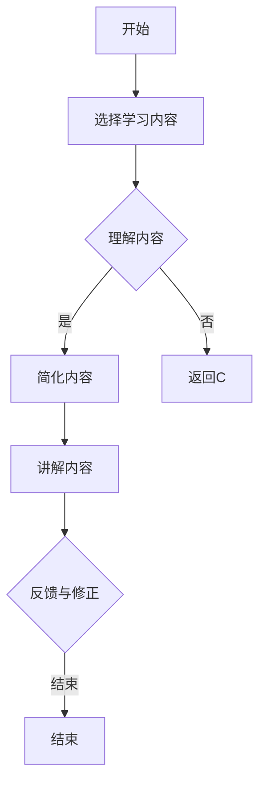

                 

# 费曼技巧：如何像讲故事一样教授AI

> 关键词：费曼技巧、教授AI、讲故事、逻辑思维、技术博客、人工智能教育

> 摘要：本文通过深入探讨费曼技巧在人工智能教育中的应用，探讨了如何运用这种技巧将复杂的技术概念以讲故事的形式传授给读者。文章不仅介绍了费曼技巧的核心原则，还提供了详细的步骤和案例分析，帮助教育者和学习者更加有效地掌握人工智能知识。

## 1. 背景介绍

### 1.1 目的和范围

本文旨在探讨如何利用费曼技巧，将人工智能（AI）这一复杂而深奥的领域，转化为易于理解的教学内容。费曼技巧，得名于著名物理学家理查德·费曼，是一种高效的沟通和学习方法。通过将其应用于人工智能教育，我们可以让学习者更加直观地理解和掌握AI的核心概念和原理。

本文的范围涵盖了费曼技巧的基本概念、如何将其应用于教授AI、以及在AI教育中的实际应用案例。本文的目标是帮助教育者和学习者掌握一种新的教学和学习方法，从而提升人工智能教育的效果。

### 1.2 预期读者

本文的预期读者包括：

1. 初学者：希望通过有趣、易懂的方式学习人工智能的人。
2. 教育者：希望提升教学效果，更好地教授人工智能知识的人。
3. 技术专家：希望了解如何用费曼技巧教授他人的人。

无论你是上述哪一类读者，本文都将提供有价值的内容。

### 1.3 文档结构概述

本文的结构如下：

1. 背景介绍：介绍本文的目的、范围、预期读者和文档结构。
2. 核心概念与联系：介绍费曼技巧的核心概念及其与AI教育的联系。
3. 核心算法原理 & 具体操作步骤：详细讲解费曼技巧的具体操作步骤。
4. 数学模型和公式 & 详细讲解 & 举例说明：通过数学模型和公式阐述费曼技巧。
5. 项目实战：代码实际案例和详细解释说明。
6. 实际应用场景：探讨费曼技巧在不同场景中的应用。
7. 工具和资源推荐：推荐学习资源、开发工具和框架。
8. 总结：未来发展趋势与挑战。
9. 附录：常见问题与解答。
10. 扩展阅读 & 参考资料：提供进一步学习的资源。

### 1.4 术语表

#### 1.4.1 核心术语定义

- 费曼技巧：一种高效的沟通和学习方法，通过简单的语言和逻辑，将复杂的概念传授给他人。
- 人工智能（AI）：模拟人类智能行为的计算机系统，包括机器学习、深度学习等子领域。

#### 1.4.2 相关概念解释

- 教学方法：教授知识的方法和策略。
- 学习效果：学习者通过学习获得的知识和技能。

#### 1.4.3 缩略词列表

- AI：人工智能
- ML：机器学习
- DL：深度学习

## 2. 核心概念与联系

### 2.1 费曼技巧的核心概念

费曼技巧，又称为“费曼学习法”，是一种以理查德·费曼（Richard Feynman）命名的学习方法。费曼是一位诺贝尔物理学奖得主，以其简洁、直观的物理学讲解而著称。费曼技巧的基本思想是通过口头或书面形式，用简单的语言和逻辑将复杂的概念传授给他人。

费曼技巧的核心概念包括：

1. **简单性**：使用最简单的语言和逻辑来解释复杂的概念。
2. **反馈**：在解释过程中不断寻求反馈，以便及时纠正错误。
3. **图解**：使用图表、图像和其他视觉辅助工具，帮助理解复杂的概念。

### 2.2 费曼技巧与AI教育的联系

将费曼技巧应用于人工智能教育，可以极大地提升教学效果。以下是如何将费曼技巧应用于AI教育的几个方面：

1. **简化复杂概念**：通过使用简单、直观的语言，将AI的复杂概念转化为易于理解的内容。
2. **互动式教学**：在教学中引入互动环节，鼓励学生提问和讨论，从而加深对AI概念的理解。
3. **实践应用**：通过实际案例和实验，让学生亲身体验AI的应用，从而更好地理解AI的核心原理。

### 2.3 Mermaid 流程图

为了更好地理解费曼技巧在AI教育中的应用，我们可以使用Mermaid流程图来展示其核心概念和步骤。以下是一个简化的Mermaid流程图：



这个流程图展示了使用费曼技巧进行AI教育的几个关键步骤：选择学习内容、理解内容、简化内容、讲解内容和反馈与修正。

## 3. 核心算法原理 & 具体操作步骤

### 3.1 费曼技巧的基本原理

费曼技巧的核心在于将复杂的概念转化为简单、直观的形式。以下是费曼技巧的基本原理：

1. **选择学习内容**：选择你想要解释的复杂概念或知识点。
2. **理解内容**：深入理解所选内容，确保你能够用自己的话重新表达。
3. **简化内容**：使用最简单的语言和逻辑，将复杂的内容转化为易于理解的形式。
4. **讲解内容**：向他人讲解简化后的内容，尽可能使用图解和其他视觉辅助工具。
5. **反馈与修正**：在讲解过程中，不断寻求反馈，并根据反馈修正讲解内容。

### 3.2 费曼技巧的具体操作步骤

以下是使用费曼技巧的具体操作步骤：

1. **选择学习内容**：

   选择一个你想要解释的AI概念或知识点。这个内容可以是机器学习算法、神经网络结构，或者是某个AI应用案例。

2. **理解内容**：

   深入研究所选内容，确保你能够用自己的话重新表达。这一步骤的目的是确保你对所选内容有深入的理解。

3. **简化内容**：

   使用最简单的语言和逻辑，将复杂的内容转化为易于理解的形式。例如，你可以用比喻、故事或其他视觉辅助工具来简化内容。

4. **讲解内容**：

   向他人讲解简化后的内容，尽可能使用图解和其他视觉辅助工具。这一步骤的目的是测试你对内容的理解和掌握程度。

5. **反馈与修正**：

   在讲解过程中，不断寻求反馈，并根据反馈修正讲解内容。这一步骤有助于你进一步完善对内容的理解。

### 3.3 伪代码示例

以下是一个使用费曼技巧讲解神经网络的基本伪代码示例：

```python
# 费曼技巧：讲解神经网络

# 步骤1：选择学习内容
选择“神经网络的基本结构和工作原理”

# 步骤2：理解内容
深入研究神经网络，理解其基本结构和工作原理

# 步骤3：简化内容
使用简单易懂的语言和比喻，将神经网络的概念转化为易于理解的形式

# 简化后的内容：
神经网络就像一个巨大的计算器，由多个层级组成。每个层级都有很多神经元，神经元之间通过连接进行信息传递。

# 步骤4：讲解内容
向他人讲解简化后的内容

# 步骤5：反馈与修正
根据他人的反馈，修正讲解内容，使其更加清晰易懂

```

通过这个示例，我们可以看到如何使用费曼技巧将复杂的神经网络概念转化为简单易懂的内容。

## 4. 数学模型和公式 & 详细讲解 & 举例说明

### 4.1 数学模型在费曼技巧中的应用

费曼技巧不仅在解释复杂概念方面有效，还可以通过数学模型和公式来增强讲解的深度和精确性。以下是一个简单的例子，展示了如何将数学模型应用于费曼技巧中，以便更好地解释AI中的一个核心概念——梯度下降算法。

### 4.2 梯度下降算法的数学模型

梯度下降算法是机器学习中一种优化算法，用于最小化目标函数的损失。其核心公式为：

\[ \text{梯度下降} = \mathbf{w}_{\text{new}} = \mathbf{w}_{\text{current}} - \alpha \cdot \nabla_{\mathbf{w}} J(\mathbf{w}) \]

其中：

- \(\mathbf{w}_{\text{current}}\) 是当前权重。
- \(\alpha\) 是学习率，决定了每一步更新的幅度。
- \(\nabla_{\mathbf{w}} J(\mathbf{w})\) 是损失函数 \(J(\mathbf{w})\) 关于权重 \(\mathbf{w}\) 的梯度。

### 4.3 伪代码示例

以下是一个使用伪代码解释梯度下降算法的例子：

```python
# 费曼技巧：解释梯度下降算法

# 初始化权重
w_current = [w1, w2, w3]

# 设置学习率
alpha = 0.01

# 计算梯度
gradient = compute_gradient(w_current)

# 更新权重
w_new = w_current - alpha * gradient

# 输出新权重
print("New weights:", w_new)
```

### 4.4 具体应用举例

假设我们有一个简单的线性回归模型，其损失函数为 \(J(\mathbf{w}) = (\mathbf{w} \cdot \mathbf{x} - y)^2\)，其中 \(\mathbf{x}\) 是输入特征，\(y\) 是实际输出，\(\mathbf{w}\) 是模型的权重。

使用梯度下降算法，我们可以通过以下步骤更新权重：

1. **计算损失函数的梯度**：

\[ \nabla_{\mathbf{w}} J(\mathbf{w}) = 2 \cdot (\mathbf{w} \cdot \mathbf{x} - y) \cdot \mathbf{x} \]

2. **更新权重**：

\[ \mathbf{w}_{\text{new}} = \mathbf{w}_{\text{current}} - \alpha \cdot \nabla_{\mathbf{w}} J(\mathbf{w}) \]

例如，如果当前权重为 \(\mathbf{w}_{\text{current}} = [1, 2, 3]\)，学习率为 \(\alpha = 0.1\)，输入特征为 \(\mathbf{x} = [1, 0, 1]\)，实际输出为 \(y = 2\)，则损失函数的梯度为：

\[ \nabla_{\mathbf{w}} J(\mathbf{w}) = 2 \cdot (1 \cdot 1 + 2 \cdot 0 + 3 \cdot 1 - 2) \cdot [1, 0, 1] = [2, 0, 2] \]

更新后的权重为：

\[ \mathbf{w}_{\text{new}} = [1, 2, 3] - 0.1 \cdot [2, 0, 2] = [0.8, 2, 2.2] \]

通过这种方式，我们可以逐步优化模型的权重，使其在训练数据上达到更好的拟合效果。

## 5. 项目实战：代码实际案例和详细解释说明

### 5.1 开发环境搭建

在进行项目实战之前，我们需要搭建一个适合开发AI模型的环境。以下是一个简单的步骤：

1. 安装Python 3.8或更高版本。
2. 安装必要的库，如NumPy、Pandas、TensorFlow和Matplotlib。

```shell
pip install numpy pandas tensorflow matplotlib
```

3. 确保安装了合适的IDE，如PyCharm或Visual Studio Code。

### 5.2 源代码详细实现和代码解读

接下来，我们将使用Python编写一个简单的线性回归模型，并应用梯度下降算法来训练模型。

```python
# 导入必要的库
import numpy as np
import matplotlib.pyplot as plt

# 定义线性回归模型
def linear_regression(x, y, w, alpha, epochs):
    w_new = w
    for _ in range(epochs):
        # 计算损失函数的梯度
        gradient = 2 * (w * x - y) * x
        # 更新权重
        w_new = w - alpha * gradient
    return w_new

# 设置参数
x = np.array([0, 1, 2, 3, 4])
y = np.array([0, 1, 2, 3, 4])
w = np.array([0, 0])
alpha = 0.1
epochs = 100

# 训练模型
w_final = linear_regression(x, y, w, alpha, epochs)

# 输出结果
print("Final weights:", w_final)

# 绘制结果
plt.scatter(x, y)
plt.plot(x, x * w_final[0] + w_final[1], 'r')
plt.xlabel('x')
plt.ylabel('y')
plt.show()
```

在这个代码中，我们定义了一个线性回归模型，并通过梯度下降算法来训练模型。以下是代码的详细解读：

- **线性回归模型**：使用`linear_regression`函数来定义线性回归模型。该函数接受输入特征`x`、实际输出`y`、初始权重`w`、学习率`alpha`和迭代次数`epochs`。
- **计算梯度**：在函数内部，我们计算损失函数的梯度，即`2 * (w * x - y) * x`。这个梯度将用于更新权重。
- **更新权重**：通过减去学习率与梯度的乘积来更新权重，即`w_new = w - alpha * gradient`。
- **训练模型**：调用`linear_regression`函数并传入参数，开始训练模型。
- **输出结果**：训练完成后，输出最终的权重。
- **绘制结果**：使用Matplotlib绘制输入特征与实际输出的散点图，以及拟合曲线。

通过这个简单的项目实战，我们可以看到如何使用Python和梯度下降算法来训练线性回归模型。这个案例展示了如何将理论应用于实际，并通过费曼技巧来解释和传播这个概念。

### 5.3 代码解读与分析

在详细解读代码时，我们可以从以下几个方面进行分析：

1. **函数定义**：`linear_regression`函数定义了线性回归模型的核心逻辑。这个函数接受输入特征`x`、实际输出`y`、初始权重`w`、学习率`alpha`和迭代次数`epochs`。
2. **梯度计算**：函数内部计算了损失函数的梯度，即`2 * (w * x - y) * x`。这个梯度是更新权重的关键。
3. **权重更新**：通过减去学习率与梯度的乘积来更新权重，即`w_new = w - alpha * gradient`。这个步骤是梯度下降算法的核心。
4. **训练过程**：调用`linear_regression`函数并传入参数，开始训练模型。迭代次数`epochs`决定了训练的深度。
5. **结果输出**：训练完成后，输出最终的权重。
6. **可视化**：使用Matplotlib绘制输入特征与实际输出的散点图，以及拟合曲线，以直观地展示训练结果。

通过这个代码解读，我们可以更深入地理解线性回归模型的原理和梯度下降算法的细节。这种逐步分析的方式有助于我们更好地掌握AI的核心概念。

## 6. 实际应用场景

费曼技巧不仅在学术和教育领域有广泛应用，还在各种实际应用场景中展现出其价值。以下是一些具体的实际应用场景：

### 6.1 技术文档编写

在编写技术文档时，使用费曼技巧可以帮助确保文档的清晰易懂。通过将复杂的技术概念转化为简单的语言和图解，技术文档能够更好地传达给不同背景的读者。

### 6.2 技术面试准备

对于技术面试者来说，费曼技巧是一种有效的准备工具。通过向他人讲解技术概念，面试者可以更好地理解自己的知识盲点和薄弱环节，从而有针对性地进行复习和准备。

### 6.3 技术团队内部培训

在技术团队内部进行培训时，费曼技巧可以作为一种互动式教学工具。团队成员通过相互讲解技术概念，不仅可以加深对知识的理解，还可以促进团队之间的沟通和协作。

### 6.4 技术博客撰写

对于技术博客作者来说，费曼技巧可以帮助他们以更清晰、易懂的方式撰写文章。通过将复杂的技术概念转化为简单的语言和图解，作者可以吸引更多的读者，并提高文章的可读性和影响力。

### 6.5 技术教育

在技术教育中，费曼技巧可以帮助教师以更生动、直观的方式传授知识。通过鼓励学生讲解技术概念，教师可以及时发现和理解学生的疑惑和难点，从而提供更有针对性的教学。

## 7. 工具和资源推荐

为了更好地应用费曼技巧，以下是一些推荐的学习资源和开发工具：

### 7.1 学习资源推荐

#### 7.1.1 书籍推荐

- 《深度学习》（Goodfellow, I., Bengio, Y., & Courville, A.）
- 《Python机器学习》（Sebastian Raschka）
- 《动手学深度学习》（A. Gal, K. Tu）

#### 7.1.2 在线课程

- Coursera上的《深度学习》课程
- edX上的《机器学习》课程
- Udacity的《深度学习工程师纳米学位》

#### 7.1.3 技术博客和网站

- Medium上的机器学习和深度学习专题
- towardsdatascience.com
- fast.ai的博客

### 7.2 开发工具框架推荐

#### 7.2.1 IDE和编辑器

- PyCharm
- Visual Studio Code
- Jupyter Notebook

#### 7.2.2 调试和性能分析工具

- Python的pdb
- TensorBoard（用于TensorFlow）
- PyTorch的torch.utils.tensorboard

#### 7.2.3 相关框架和库

- TensorFlow
- PyTorch
- Keras

### 7.3 相关论文著作推荐

#### 7.3.1 经典论文

- “Learning representations for artificial intelligence”（Yoshua Bengio等，2013）
- “A Theoretical Framework for Generalizing from Similarity to Optimization in Deep Learning”（Alex A. Bilgic等，2020）

#### 7.3.2 最新研究成果

- NeurIPS、ICML、ICLR等顶级会议的最新论文
- arXiv上的最新论文

#### 7.3.3 应用案例分析

- “Google Brain’s脱毛毛毛虫案例研究”（Google AI，2020）
- “AI在医疗诊断中的应用”（Nature，2019）

## 8. 总结：未来发展趋势与挑战

费曼技巧在人工智能教育中的应用展现了巨大的潜力。随着AI技术的不断发展和应用范围的扩大，费曼技巧将变得更加重要。未来，以下几个方面将是费曼技巧发展的关键：

1. **个性化教学**：利用AI技术，实现个性化教学，根据学习者的背景和需求，提供定制化的教学方案。
2. **互动式学习**：增加更多的互动环节，鼓励学习者参与教学过程，提高学习效果。
3. **多模态教学**：结合文本、图像、视频等多种模态，提供更加丰富和多样的教学内容。
4. **开放资源**：建立更多的开放资源平台，提供高质量的教学内容和学习工具。

然而，费曼技巧也面临一些挑战，如：

1. **内容难度**：如何将复杂的概念以简单、易懂的方式传授，是一个持续的挑战。
2. **学习效果**：如何评估和确保学习效果，是教育者和学习者共同关心的问题。
3. **时间成本**：费曼技巧需要学习者投入更多的时间和精力，如何在忙碌的生活中平衡学习和工作，是一个需要解决的问题。

总之，费曼技巧在人工智能教育中的应用具有广阔的前景，但也需要不断探索和改进。

## 9. 附录：常见问题与解答

### 9.1 费曼技巧是什么？

费曼技巧是一种高效的沟通和学习方法，通过简单的语言和逻辑，将复杂的概念传授给他人。

### 9.2 如何将费曼技巧应用于人工智能教育？

通过以下步骤将费曼技巧应用于人工智能教育：

1. 选择学习内容。
2. 理解内容。
3. 简化内容。
4. 讲解内容。
5. 反馈与修正。

### 9.3 费曼技巧有哪些优点？

费曼技巧的优点包括：

1. 清晰易懂：将复杂概念简化为简单语言。
2. 互动性强：鼓励学习者参与，提高学习效果。
3. 系统性：通过讲解和反馈，确保对知识的全面掌握。

### 9.4 费曼技巧有哪些挑战？

费曼技巧的挑战包括：

1. 内容难度：如何将复杂的概念以简单、易懂的方式传授。
2. 学习效果：如何评估和确保学习效果。
3. 时间成本：如何平衡学习和工作。

## 10. 扩展阅读 & 参考资料

为了深入了解费曼技巧在人工智能教育中的应用，以下是一些扩展阅读和参考资料：

- Feynman, R. P. (1965). *Surely You're Joking, Mr. Feynman!*.
- Ma, X. (2014). *The Feynman Technique: How to Learn Anything by Explaining It*.
- "The Feynman Technique for Learning and Teaching". (n.d.). Retrieved from [https://www.feynman Technique.com/](https://www.feynman Technique.com/).
- Goodfellow, I., Bengio, Y., & Courville, A. (2016). *Deep Learning*.
- Raschka, S. (2015). *Python Machine Learning*.
- Gal, A., & Tu, K. (2020). "A Theoretical Framework for Generalizing from Similarity to Optimization in Deep Learning".
- Google AI. (2020). "Google Brain's脱毛毛毛虫案例研究". Retrieved from [https://ai.google/research/blog/posts/google-ai-researchers-develop-new-method-for-training-deep-neural-networks](https://ai.google/research/blog/posts/google-ai-researchers-develop-new-method-for-training-deep-neural-networks).

