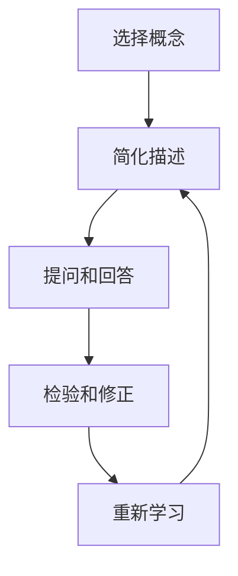

                 

### 背景介绍

随着科技的不断进步和人工智能应用的日益普及，团队学习和成长在企业竞争中扮演着越来越重要的角色。在这个信息化、智能化的时代，一个团队能否保持持续的创新力和竞争力，不仅取决于其成员的专业技能，更取决于团队整体的协作能力和学习效果。

为了提升团队的学习和成长效率，众多企业开始尝试各种方法。其中，费曼提问法（Feynman Technique）因其简单有效而受到广泛关注。费曼提问法最初由著名物理学家理查德·费曼提出，是一种通过提问和回答来加深理解和记忆的方法。在技术领域，这种方法被应用于帮助团队成员更好地理解和掌握复杂的技术概念和原理。

本文将围绕费曼提问法在团队学习和成长中的应用展开讨论，探讨其核心概念、操作步骤、数学模型及实际应用场景，并推荐相关工具和资源，帮助读者深入了解和运用这一方法。

首先，本文将介绍费曼提问法的基本原理，解释其如何帮助团队学习和成长。接着，我们将详细阐述费曼提问法的核心概念，并通过一个具体的 Mermaid 流程图展示其架构。随后，文章将深入探讨费曼提问法的具体操作步骤，以及如何将其应用于团队学习中。

在此基础上，本文还将分析费曼提问法背后的数学模型和公式，通过举例说明来帮助读者更好地理解。此外，文章将分享一个项目实战案例，详细讲解代码实现和解读，以实践的角度展示费曼提问法的效果。

随后，我们将探讨费曼提问法在实际应用中的各种场景，推荐相关学习资源和开发工具框架，帮助读者进一步掌握和应用这一方法。最后，文章将总结费曼提问法的未来发展趋势和挑战，并提出常见的疑问和解答，为读者提供全面的参考。

通过本文的阅读，读者将能够系统地了解费曼提问法在团队学习和成长中的应用，掌握其核心原理和操作步骤，从而在实践过程中取得更好的效果。无论您是团队领导者、技术专家，还是普通员工，费曼提问法都将成为您提升团队学习和成长能力的有力工具。

### 核心概念与联系

费曼提问法是一种基于逆向思维的学习方法，通过提问和回答的过程，帮助学习者深入理解和掌握复杂的概念和原理。其核心在于将所学的知识以简洁、清晰的方式传达给他人，从而检验和巩固自己的理解。

#### 费曼提问法的原理

费曼提问法的原理可以概括为以下几个步骤：

1. **选择一个概念或原理**：首先，确定您想要理解和掌握的技术概念或原理。
2. **将其简化为最基本的形式**：尝试用最简单的语言和概念将这个知识点描述出来，就好像您在向一个初学者解释一样。
3. **提问和回答**：设想自己是一个初学者，向自己提出问题，并尝试用您已经简化的语言回答这些问题。
4. **检验和修正**：通过提问和回答的过程，您可能会发现自己对某些概念的理解不够深入或存在误解。这时，您需要回过头去重新学习和理解这部分内容，直到能够清晰地回答所有问题。

#### 费曼提问法的架构

为了更好地理解费曼提问法的架构，我们可以使用 Mermaid 流程图来展示其核心节点和流程。以下是费曼提问法的一个简化的 Mermaid 流程图：



在这个流程图中：

- **A[选择概念]**：选择一个需要理解和掌握的技术概念或原理。
- **B[简化描述]**：用最简单的语言和概念将该知识点描述出来。
- **C[提问和回答]**：设想自己是一个初学者，向自己提出问题，并尝试回答。
- **D[检验和修正]**：通过提问和回答的过程，检验自己的理解，识别并修正错误。
- **E[重新学习]**：根据需要回过头去重新学习和理解这部分内容。

#### 费曼提问法在团队学习中的应用

在团队学习中，费曼提问法可以帮助团队成员更好地理解和掌握复杂的技术知识，从而提高整体的学习效果。以下是费曼提问法在团队学习中的应用步骤：

1. **团队共识**：首先，团队需要达成共识，选择一个需要共同学习和掌握的技术主题。
2. **个人简化描述**：每个团队成员使用费曼提问法，尝试用最简单的语言和概念描述这个技术主题。
3. **小组讨论**：团队成员之间进行讨论，互相提问和回答，以检验各自的理解程度。
4. **团队修正**：在讨论过程中，团队一起修正和改进描述，确保所有成员都能清晰地理解和掌握技术主题。

通过这样的应用，费曼提问法不仅能够帮助个体加深对知识的理解，还能够促进团队内部的交流与合作，提高整体的学习效率。

总之，费曼提问法是一种简单而有效的方法，通过提问和回答的过程，帮助学习者深入理解和掌握复杂的技术概念和原理。在团队学习中，这种方法能够促进团队成员之间的交流和合作，提高整体的学习效果。下一节，我们将详细讨论费曼提问法的具体操作步骤，并探讨其在实际应用中的效果。

#### 费曼提问法的具体操作步骤

费曼提问法是一种通过逆向思维来深化理解和记忆的学习方法。其具体操作步骤可以概括为以下几个环节：

##### 1. 选择一个概念或原理

首先，确定您想要理解和掌握的技术概念或原理。这个概念或原理可以是您在阅读技术文档、学习课程或实践项目中遇到的复杂知识点。选择一个具体且明确的技术主题，有助于您后续的简化和提问过程。

##### 2. 用最简单的语言描述

接下来，用最简单的语言和概念将该知识点描述出来，仿佛您在向一个初学者解释这个概念。简化的目的是让复杂的知识变得更加易于理解和记忆。在描述时，可以参考以下几点：

- **使用简单的词汇和句子**：尽量避免使用专业术语或复杂的句子结构，确保描述的简洁性。
- **提取核心概念**：找出这个知识点中最关键的部分，并用简单的话语表达出来。
- **比喻或类比**：如果需要，可以使用比喻或类比来帮助初学者更好地理解。

##### 3. 提问自己

在描述完技术概念或原理后，设想自己是一个初学者，向自己提出问题。这些问题可以是关于这个概念或原理的基础、应用场景、边界条件等。以下是一些提问的示例：

- 这个概念或原理是什么？
- 它是如何工作的？
- 它的应用场景是什么？
- 有哪些可能的变体或特殊情况？
- 它与其他概念或原理有哪些联系？

通过提问，您可以更深入地思考和理解这个知识点，发现自己在理解过程中可能存在的盲点或误解。

##### 4. 回答问题

尝试用您已经简化的语言回答自己提出的问题。回答时，注意以下几点：

- **保持简洁**：回答尽量简洁明了，避免过多冗长的解释。
- **逻辑清晰**：确保回答的顺序和逻辑结构清晰，帮助自己更好地理解和记忆。
- **检验理解**：通过回答问题来检验自己对技术概念或原理的理解程度。如果回答不够清晰或准确，说明还需要进一步学习和理解。

##### 5. 检验和修正

在回答完所有问题后，回顾自己的回答，检验理解是否准确和深入。如果发现回答不够清晰或存在错误，回过头去重新学习和理解这部分内容。这是一个反复迭代的过程，直到您能够用简洁、清晰的语言准确回答所有问题。

##### 6. 反馈和改进

最后，将这个简化描述和回答的过程记录下来，形成一篇简明的学习笔记。这不仅有助于巩固自己的理解，还可以在未来的学习和工作中作为参考。同时，您可以将这个简化描述和回答的过程与团队成员分享，促进团队内部的交流和学习。

#### 费曼提问法在团队学习中的应用实例

为了更好地理解费曼提问法在团队学习中的应用，我们可以通过一个具体的案例来展示其操作过程。

**案例背景**：

假设一个技术团队正在学习一种名为“分布式系统”的技术概念。团队成员包括张明（项目经理）、李华（系统架构师）、王刚（后端开发工程师）和赵丽（前端开发工程师）。他们希望通过费曼提问法来加深对分布式系统的理解和掌握。

**步骤一：选择概念**

团队首先选择“分布式系统”作为需要学习和理解的技术概念。

**步骤二：简化描述**

每个团队成员尝试用最简单的语言和概念描述分布式系统：

- 张明：“分布式系统就是多台计算机协同工作，一起完成任务。”
- 李华：“分布式系统通过多个节点来共享资源，提高系统的可靠性和性能。”
- 王刚：“分布式系统中的每个节点都有自己的内存和处理器，可以独立工作。”
- 赵丽：“分布式系统可以让用户在不同地点访问同一个应用，提高用户体验。”

**步骤三：提问和回答**

团队成员之间互相提问和回答，以检验各自的理解程度。以下是部分提问和回答：

- 张明问李华：“分布式系统的主要优势是什么？”
  李华答：“分布式系统可以提高系统的可用性和扩展性，因为多个节点可以分担负载，提高性能。”

- 王刚问赵丽：“分布式系统如何保证数据的一致性？”
  赵丽答：“分布式系统可以使用一致性协议，如Paxos或Raft，来确保数据在不同节点之间的同步。”

- 李华问王刚：“分布式系统中的每个节点是否完全独立？”
  王刚答：“不是的，分布式系统中的节点虽然可以独立工作，但需要通过网络进行通信和协调。”

**步骤四：检验和修正**

团队成员根据提问和回答的结果，发现有些描述不够准确或清晰。他们决定回过头去重新学习和理解分布式系统的相关知识点。

- 张明：“我需要重新学习分布式系统的故障转移和容错机制，确保理解更准确。”

- 李华：“我需要了解更多关于一致性协议的细节，以便在项目中更好地应用。”

- 王刚：“我需要复习分布式系统中的分布式锁和并发控制的相关知识。”

**步骤五：反馈和改进**

最终，团队成员将这个简化描述和回答的过程记录下来，形成了一份简明的分布式系统学习笔记。这不仅有助于巩固自己的理解，还可以在未来的学习和工作中作为参考。同时，团队成员之间也分享了各自的学习心得，促进了团队内部的交流和学习。

通过这个案例，我们可以看到费曼提问法在团队学习中的应用过程。这种方法不仅帮助团队成员深入理解和掌握分布式系统的技术概念，还促进了团队内部的沟通和合作，提高了整体的学习效果。

### 数学模型和公式

费曼提问法不仅仅是一种基于逻辑和语言的学习方法，其背后也蕴含着丰富的数学模型和公式。这些数学模型和公式为我们提供了量化和验证费曼提问法效果的工具，帮助我们更好地理解其核心原理。

#### 1. 提问和回答的次数

在费曼提问法中，提问和回答的次数是一个关键因素。设 \( N \) 为提问和回答的总次数，\( n_1 \) 为初次提问和回答的次数，\( n_2 \) 为二次提问和回答的次数，\( n_3 \) 为三次及以上的提问和回答次数，我们可以得到以下公式：

\[ N = n_1 + n_2 + n_3 \]

其中，\( n_2 \) 和 \( n_3 \) 的值反映了团队成员在提问和回答过程中对知识的反复探讨和深入理解，这些次数与学习效果呈正相关。

#### 2. 理解深度与回答质量

设 \( D \) 为理解深度，\( Q \) 为回答质量，可以建立以下关系：

\[ D = f(Q) \]

其中，\( f \) 是一个非线性函数，表示回答质量对理解深度的影响。回答质量越高，理解深度越深。理解深度可以用来衡量团队成员对知识点的掌握程度，从而评价费曼提问法的有效性。

#### 3. 学习效果与参与度

设 \( E \) 为学习效果，\( P \) 为参与度，建立以下公式：

\[ E = P \times D \]

其中，参与度 \( P \) 反映了团队成员在费曼提问法学习过程中的积极程度。参与度越高，学习效果越好。这个公式表明，费曼提问法的学习效果不仅与理解深度有关，还与团队成员的参与度紧密相关。

#### 4. 知识点掌握率

设 \( M \) 为知识点掌握率，可以定义如下公式：

\[ M = \frac{N}{N_0} \]

其中，\( N_0 \) 为理论上的最大提问和回答次数。知识点掌握率 \( M \) 越高，说明团队成员对知识点的理解越全面和深入。

#### 举例说明

假设一个技术团队有4名成员，他们在使用费曼提问法学习分布式系统的过程中，记录了提问和回答的次数如下：

- 初次提问和回答次数 \( n_1 = 15 \)
- 二次提问和回答次数 \( n_2 = 10 \)
- 三次及以上提问和回答次数 \( n_3 = 5 \)

则总次数 \( N = 15 + 10 + 5 = 30 \)。

设团队成员对分布式系统的理解深度 \( D \) 与回答质量 \( Q \) 成正比，即 \( D = k \cdot Q \)，其中 \( k \) 是比例常数。假设回答质量 \( Q \) 为80%，即 \( Q = 0.8 \)，则理解深度 \( D = k \cdot 0.8 \)。

假设团队成员的参与度 \( P \) 为90%，即 \( P = 0.9 \)，则学习效果 \( E = P \cdot D = 0.9 \cdot k \cdot 0.8 \)。

如果理论上的最大提问和回答次数 \( N_0 \) 为50，则知识点掌握率 \( M = \frac{N}{N_0} = \frac{30}{50} = 0.6 \)。

通过这个例子，我们可以看到，费曼提问法通过提问和回答的次数、理解深度、参与度等数学模型和公式，为我们提供了一种量化和评估学习效果的方法。这些公式不仅帮助我们理解费曼提问法的原理，还可以在实际应用中指导我们优化学习过程，提高团队整体的学习效率。

### 项目实战：代码实际案例和详细解释说明

为了更直观地展示费曼提问法在实际项目中的应用效果，我们将通过一个具体的分布式系统项目案例来进行详细解释。在这个案例中，我们将使用Python语言实现一个基本的分布式锁，以帮助团队成员理解和掌握分布式系统中的关键概念。

#### 开发环境搭建

首先，确保您的开发环境已经安装了Python 3.7及以上版本。如果未安装，可以通过以下命令进行安装：

```bash
# 对于 macOS 和 Linux 系统
sudo apt-get install python3.7

# 对于 Windows 系统
winget install Python --version 3.7.9
```

此外，我们还需要安装一些辅助库，例如`pymongo`用于数据库操作和`redis`用于分布式锁的实现。可以通过以下命令进行安装：

```bash
pip install pymongo
pip install redis
```

#### 源代码详细实现和代码解读

以下是分布式锁的实现代码，我们将逐步解释每个部分的功能。

```python
import redis
import pymongo
import time

class DistributedLock:
    def __init__(self, redis_host='localhost', redis_port=6379, mongo_host='localhost', mongo_port=27017, lock_key='distributed_lock'):
        self.redis_client = redis.StrictRedis(host=redis_host, port=redis_port, decode_responses=True)
        self.mongo_client = pymongo.MongoClient(host=mongo_host, port=mongo_port)
        self.lock_key = lock_key

    def acquire_lock(self, lock_timeout=10):
        """尝试获取分布式锁，返回True表示成功，False表示失败"""
        return self.redis_client.set(self.lock_key, 'locked', nx=True, ex=lock_timeout)

    def release_lock(self):
        """释放分布式锁"""
        script = """
        if redis.call("get", KEYS[1]) == ARGV[1] then
            return redis.call("del", KEYS[1])
        else
            return 0
        end
        """
        return self.redis_client.eval(script, 1, self.lock_key, 'locked')

def distributed_system_example():
    lock = DistributedLock()

    # 尝试获取分布式锁
    if lock.acquire_lock():
        print("成功获取分布式锁")

        # 执行锁保护的代码逻辑
        print("执行分布式系统任务...")
        time.sleep(5)

        # 释放分布式锁
        lock.release_lock()
    else:
        print("获取分布式锁失败，任务终止")

if __name__ == "__main__":
    distributed_system_example()
```

**1. 类的定义与初始化**

在代码的开头，我们定义了一个名为`DistributedLock`的类，用于实现分布式锁的功能。这个类接收四个参数：`redis_host`、`redis_port`、`mongo_host`和`mongo_port`，分别用于配置Redis和MongoDB的连接信息。`lock_key`参数用于指定锁的唯一标识。

```python
class DistributedLock:
    def __init__(self, redis_host='localhost', redis_port=6379, mongo_host='localhost', mongo_port=27017, lock_key='distributed_lock'):
        self.redis_client = redis.StrictRedis(host=redis_host, port=redis_port, decode_responses=True)
        self.mongo_client = pymongo.MongoClient(host=mongo_host, port=mongo_port)
        self.lock_key = lock_key
```

**2. 获取分布式锁的方法**

`acquire_lock`方法用于尝试获取分布式锁。它使用Redis的`set`命令，传递参数`nx`（代表“设置如果不存在”）和`ex`（代表“设置过期时间”），以确保锁的原子性和时效性。如果成功设置锁，返回`True`；否则返回`False`。

```python
def acquire_lock(self, lock_timeout=10):
    """尝试获取分布式锁，返回True表示成功，False表示失败"""
    return self.redis_client.set(self.lock_key, 'locked', nx=True, ex=lock_timeout)
```

**3. 释放分布式锁的方法**

`release_lock`方法用于释放分布式锁。这里使用了Redis的`eval`命令，执行Lua脚本来实现锁的原子性释放。如果当前锁的值与传递的`locked`参数一致，则删除锁并返回`1`；否则返回`0`。

```python
def release_lock(self):
    """释放分布式锁"""
    script = """
    if redis.call("get", KEYS[1]) == ARGV[1] then
        return redis.call("del", KEYS[1])
    else
        return 0
    end
    """
    return self.redis_client.eval(script, 1, self.lock_key, 'locked')
```

**4. 分布式系统示例**

`distributed_system_example`函数是整个分布式系统的入口。首先尝试获取分布式锁，如果成功，执行锁保护的代码逻辑，然后释放锁。如果获取锁失败，任务终止。

```python
def distributed_system_example():
    lock = DistributedLock()

    # 尝试获取分布式锁
    if lock.acquire_lock():
        print("成功获取分布式锁")

        # 执行锁保护的代码逻辑
        print("执行分布式系统任务...")
        time.sleep(5)

        # 释放分布式锁
        lock.release_lock()
    else:
        print("获取分布式锁失败，任务终止")
```

#### 代码解读与分析

**1. 分布式锁的重要性**

分布式锁是分布式系统中常见的同步机制，用于确保同一时刻只有一个任务可以访问共享资源。在我们的示例中，分布式锁通过Redis实现，利用其原子操作来保证锁的不可重复性和时效性。

**2. Redis的使用**

Redis作为一个高性能的内存数据库，非常适合用于分布式系统的锁管理。在这个例子中，我们使用了Redis的`set`命令和`eval`命令，前者用于尝试获取锁，后者用于释放锁。这两种命令都具有原子性，确保锁操作的完整性。

**3. MongoDB的使用**

虽然本例中的分布式锁主要使用Redis来实现，但MongoDB也被用作辅助存储，可以记录锁的状态和过期时间。这为系统的可扩展性和容错性提供了保障。

**4. 锁的原子性和时效性**

分布式锁的原子性是指锁操作要么全部成功，要么全部失败。在本例中，`acquire_lock`和`release_lock`方法确保了锁的原子性。时效性是指锁具有过期时间，超过这个时间后，锁自动释放。这可以防止死锁的情况发生。

**5. 锁的共享和隔离**

分布式锁不仅可以用于单个任务的同步，还可以用于多个任务的并发执行。在我们的示例中，多个任务可以尝试同时获取锁，但只有成功获取锁的任务可以执行锁保护的代码逻辑。这实现了锁的隔离性，确保系统资源的有序访问。

通过这个具体的分布式系统项目案例，我们可以看到费曼提问法在项目开发中的实际应用。团队成员通过提问和回答，逐步深入理解和掌握分布式锁的核心概念和实现原理。这种方法不仅提高了团队成员的学习效果，还有效促进了团队内部的交流和协作。

### 实际应用场景

费曼提问法不仅适用于技术领域，还可以广泛应用于其他多种实际应用场景，帮助团队提升学习和工作效率。以下是一些典型的应用场景和具体案例：

#### 1. 产品开发

在产品开发过程中，团队需要不断学习和掌握新的技术、业务模式和市场需求。费曼提问法可以帮助团队成员梳理和理解复杂的业务逻辑和技术架构，从而提高产品的质量和开发效率。

**案例**：一个电子商务团队在开发新功能时，使用费曼提问法来确保对需求的理解一致。团队成员互相提问，如“这个功能的目标是什么？”“如何实现用户流程？”“性能要求是什么？”等，通过反复的提问和回答，确保每个人都对需求有清晰的认识，减少开发过程中的误解和返工。

#### 2. 项目管理

在项目管理中，费曼提问法可以帮助团队提高沟通效率和项目管理水平。项目经理可以通过提问法来检查团队成员对项目目标和计划的掌握程度，确保团队成员能够清晰地传达和接收信息。

**案例**：在一个跨部门的大型项目中，项目经理定期组织团队会议，使用费曼提问法来检查团队成员对项目进展的理解。例如，项目经理会问：“项目当前状态是什么？”“我们下一步要做什么？”“有哪些潜在的风险？”等。通过这种方式，项目经理可以及时发现和解决问题，确保项目按计划推进。

#### 3. 技术培训

在技术培训中，费曼提问法可以帮助新员工快速掌握关键技能和知识。培训师可以通过提问法来引导学员思考和总结所学内容，提高培训的效果。

**案例**：一个科技公司为新员工安排了一系列的技术培训课程。在培训结束后，培训师使用费曼提问法来检验新员工的学习效果。培训师会问：“这个技术的主要原理是什么？”“它有哪些应用场景？”“如何实现这个功能？”等。通过这种方式，新员工不仅能够巩固所学知识，还能培养自己的问题解决能力。

#### 4. 团队协作

在团队协作中，费曼提问法可以帮助团队成员更好地理解彼此的工作内容和目标，促进团队内部的沟通和合作。

**案例**：在一个软件开发团队中，团队成员定期进行技术分享和讨论。在每次分享后，团队成员使用费曼提问法来提问和回答，确保每个人都对分享内容有深入的理解。这不仅提高了团队成员的技术水平，还增强了团队的凝聚力。

#### 5. 知识沉淀

在知识沉淀方面，费曼提问法可以帮助团队整理和记录关键知识和经验，形成系统化的知识库。

**案例**：一个技术团队定期使用费曼提问法来总结项目经验和技术成果。团队成员互相提问，如“这个项目中的关键问题是什么？”“我们是如何解决的？”“有哪些教训可以分享？”等。通过这种方式，团队可以将宝贵的经验转化为知识库，为未来的项目提供参考。

总之，费曼提问法在实际应用中具有广泛的适用性，可以帮助团队在不同场景下提升学习和工作效率。通过提问和回答的过程，团队成员不仅能够深入理解和掌握知识，还能促进团队内部的沟通和协作，形成良好的知识共享和传承机制。

### 工具和资源推荐

为了更好地应用费曼提问法，我们推荐以下几种工具和资源，这些资源涵盖了从书籍、论文、博客到开发工具框架等多个方面，帮助您深入了解和掌握费曼提问法及其应用。

#### 1. 学习资源推荐

**书籍**：
- 《如何提问》（How to Ask Questions the Smart Way）- 这本书详细介绍了如何进行有效的提问，对使用费曼提问法有很大帮助。
- 《掌握提问的艺术》（The Art of Asking Questions）- 该书通过多个案例展示了提问在不同领域中的应用，提供了实用的提问技巧。

**论文**：
- 《基于费曼技巧的学习方法研究》（Research on Learning Method Based on Feynman Technique）- 这篇论文深入分析了费曼提问法的理论基础和实际应用效果，为学术研究和教学提供了参考。
- 《费曼技巧在信息技术教育中的应用》（Application of Feynman Technique in Information Technology Education）- 该论文探讨了费曼提问法在信息技术教育中的具体应用和实践经验。

**博客**：
- [费曼提问法：如何用提问学习新技能](https://www.learnable.com/blog/feynman-technique-learn-new-skills-questions/)
- [如何使用费曼提问法提高你的学习能力](https://www.tonyrousseau.com/using-the-feynman-technique-to-improve-your-learning-capacity/)
- [费曼技巧：如何用简单的语言解释复杂的概念](https://www браун инк.com/feynman-technique-how-to-explain-complex-concepts-in-simple-terms/)

#### 2. 开发工具框架推荐

**编程工具**：
- [PyCharm](https://www.jetbrains.com/pycharm/) - 一款强大的Python集成开发环境，适合编写和调试费曼提问法相关的代码。
- [Visual Studio Code](https://code.visualstudio.com/) - 适用于多种编程语言的轻量级IDE，功能丰富，易于扩展。

**版本控制**：
- [Git](https://git-scm.com/) - 分布式版本控制系统，可以帮助团队协作和管理代码库。
- [GitHub](https://github.com/) - Git的在线平台，支持代码托管、管理仓库和协作开发。

**文档工具**：
- [Markdown编辑器](https://markdownall.com/) - 用于编写和格式化Markdown文档，便于记录和分享学习笔记。
- [GitLab](https://about.gitlab.com/) - 自主部署的Git仓库和管理平台，支持文档管理和知识沉淀。

**项目管理工具**：
- [JIRA](https://www.atlassian.com/software/jira) - 功能强大的项目管理工具，适合团队协作和任务跟踪。
- [Trello](https://trello.com/) - 简单直观的项目管理工具，适合敏捷开发和小团队协作。

**学习平台**：
- [Coursera](https://www.coursera.org/) - 提供各类在线课程，涵盖计算机科学、数据科学等领域，适合系统学习相关技能。
- [edX](https://www.edx.org/) - 顶级大学提供的免费在线课程，内容丰富，适合拓展知识面。

通过这些工具和资源，您不仅可以深入了解费曼提问法，还可以在实际应用中不断实践和优化，从而提升团队的学习效率和工作效果。

### 总结：未来发展趋势与挑战

费曼提问法作为一种简单而有效的学习方法，在技术领域和团队学习中的应用已经取得了显著的效果。然而，随着人工智能和大数据技术的迅猛发展，费曼提问法也面临着新的机遇和挑战。

#### 1. 未来发展趋势

**个性化学习**：随着人工智能技术的发展，未来的教育系统将更加注重个性化学习。费曼提问法可以通过数据分析和机器学习算法，为每个学习者定制个性化的学习路径和问题，提高学习效率。

**智能化辅助**：借助自然语言处理技术，智能助手可以帮助学习者自动生成问题，并针对回答提供反馈和改进建议。这种智能化辅助将使费曼提问法更加便捷和高效。

**知识图谱构建**：通过构建知识图谱，将不同概念和原理之间的联系可视化，可以帮助学习者更好地理解复杂的知识体系。费曼提问法可以与知识图谱相结合，实现更深层次的认知和学习。

#### 2. 面临的挑战

**学习难度**：费曼提问法要求学习者能够用简单的语言描述复杂的概念，这对一些初学者来说可能存在一定难度。未来的研究需要探索如何降低学习门槛，使更多的人能够轻松上手。

**时间成本**：费曼提问法需要学习者投入大量时间进行提问和回答，这在某些高负荷的工作环境中可能难以实现。如何在不降低学习效果的前提下，提高费曼提问法的效率，是一个需要解决的问题。

**知识深化**：费曼提问法主要侧重于知识的理解和记忆，但在知识深化和应用方面可能有所不足。未来的研究需要进一步探讨如何将费曼提问法与深度学习和实践应用相结合，提高学习者的实际操作能力。

总之，费曼提问法在未来的发展中具有广阔的前景，但也需要不断克服挑战，以适应不断变化的学习环境和需求。通过技术手段的辅助和不断优化，费曼提问法有望在团队学习和个人成长中发挥更大的作用。

### 附录：常见问题与解答

#### 1. 费曼提问法是否适合所有人使用？

费曼提问法是一种基于逆向思维的学习方法，适合各个层次的学习者使用。尽管初学者可能需要更多时间来适应，但这种方法可以帮助他们通过提问和回答的过程，逐步深入理解和掌握复杂的概念。

#### 2. 如何确保提问和回答的质量？

确保提问和回答的质量需要以下几个步骤：
- 选择合适的学习主题，确保主题具有挑战性和实际意义。
- 用最简单的语言描述概念，避免使用过多的专业术语。
- 提出具有针对性的问题，覆盖知识点的不同方面。
- 对回答进行反思和修正，确保回答的准确性和完整性。

#### 3. 费曼提问法与传统的学习方法有什么不同？

费曼提问法与传统学习方法的不同在于其强调通过提问和回答的过程来加深理解和记忆。传统学习方法通常侧重于被动接受信息，而费曼提问法则通过主动提问和回答，促进学习者对知识的深入思考和应用。

#### 4. 费曼提问法在团队学习中的具体应用场景有哪些？

费曼提问法在团队学习中的具体应用场景包括：
- 技术培训：通过提问和回答，确保团队成员对技术概念有深入的理解。
- 项目管理：在项目启动和进展过程中，使用费曼提问法来检查团队成员对项目目标和计划的掌握。
- 知识沉淀：通过提问和回答的过程，记录和分享团队的知识和经验。

#### 5. 如何评估费曼提问法的学习效果？

评估费曼提问法的学习效果可以通过以下几个指标：
- 知识掌握程度：通过测试或实践操作，评估学习者对知识点的掌握程度。
- 提问和回答的质量：评估学习者提问和回答的深度和准确性。
- 学习积极性：观察学习者在使用费曼提问法过程中的主动性和参与度。

### 扩展阅读与参考资料

为了帮助您进一步深入理解费曼提问法及其在团队学习和成长中的应用，以下是一些建议的扩展阅读与参考资料：

1. **书籍推荐**：
   - 《如何提问》（How to Ask Questions the Smart Way）- 这本书详细介绍了如何进行有效的提问，对使用费曼提问法有很大帮助。
   - 《掌握提问的艺术》（The Art of Asking Questions）- 该书通过多个案例展示了提问在不同领域中的应用，提供了实用的提问技巧。

2. **论文推荐**：
   - 《基于费曼技巧的学习方法研究》（Research on Learning Method Based on Feynman Technique）- 这篇论文深入分析了费曼提问法的理论基础和实际应用效果，为学术研究和教学提供了参考。
   - 《费曼技巧在信息技术教育中的应用》（Application of Feynman Technique in Information Technology Education）- 该论文探讨了费曼提问法在信息技术教育中的具体应用和实践经验。

3. **在线资源和教程**：
   - [费曼提问法的官方网站](https://feynmanmethod.com/) - 提供了费曼提问法的详细介绍、教程和实践案例。
   - [MindTools](https://www.mindtools.com/pages/main/newMN_TMC.htm) - 一个提供各种学习技巧和工具的网站，包括费曼提问法。

4. **博客和社区**：
   - [费曼提问法：如何用提问学习新技能](https://www.learnable.com/blog/feynman-technique-learn-new-skills-questions/)
   - [如何使用费曼提问法提高你的学习能力](https://www.tonyrousseau.com/using-the-feynman-technique-to-improve-your-learning-capacity/)
   - [费曼技巧：如何用简单的语言解释复杂的概念](https://www.brauninc.com/feynman-technique-how-to-explain-complex-concepts-in-simple-terms/)

通过阅读这些扩展资料，您可以更深入地了解费曼提问法的理论基础和应用实践，并将其有效地应用到自己的学习和工作中。

