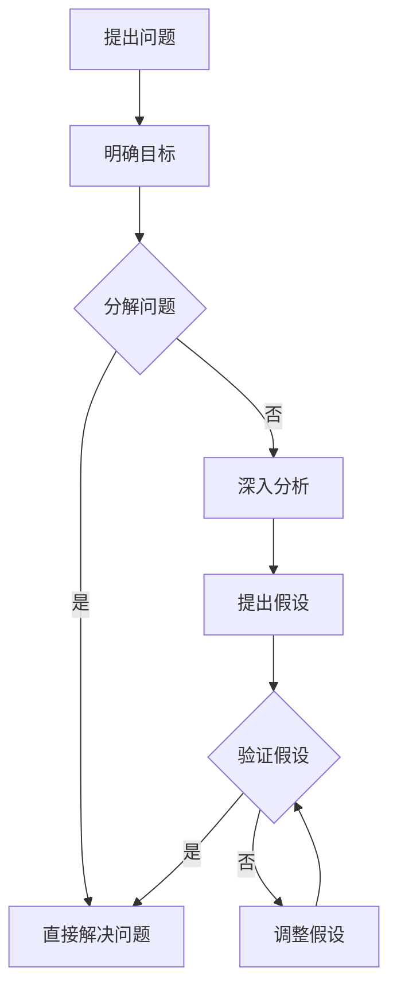

                 


# 费曼提问法在管理问题诊断中的应用

> **关键词：** 费曼提问法，管理问题诊断，问题解决，逻辑思维，管理技巧
>
> **摘要：** 本文深入探讨了费曼提问法在管理问题诊断中的应用。通过分析其原理和步骤，并结合实际案例，本文展示了如何利用费曼提问法进行高效的问题诊断和管理，以提升组织效率和决策质量。

## 1. 背景介绍

### 1.1 目的和范围

本文旨在探讨费曼提问法在管理问题诊断中的应用，分析其原理、步骤及其在实际管理场景中的价值。通过本文的阅读，读者将了解如何运用费曼提问法来提升管理问题的诊断能力，从而提高组织的整体管理水平和决策质量。

### 1.2 预期读者

本文主要面向企业管理者、项目经理、技术团队负责人以及对此领域感兴趣的读者。希望读者具备一定的管理背景，对管理问题和解决方案有一定了解。

### 1.3 文档结构概述

本文分为八个部分：

1. **背景介绍**：介绍本文的目的、预期读者、文档结构和核心术语。
2. **核心概念与联系**：阐述费曼提问法与管理问题诊断的联系，并通过Mermaid流程图展示关键概念。
3. **核心算法原理 & 具体操作步骤**：详细解释费曼提问法的原理，并给出具体的操作步骤。
4. **数学模型和公式 & 详细讲解 & 举例说明**：介绍费曼提问法中的数学模型和公式，并给出实际案例。
5. **项目实战：代码实际案例和详细解释说明**：通过实际案例展示费曼提问法的应用。
6. **实际应用场景**：探讨费曼提问法在不同管理问题中的应用。
7. **工具和资源推荐**：推荐相关的学习资源和开发工具。
8. **总结：未来发展趋势与挑战**：总结费曼提问法在管理问题诊断中的应用，并探讨未来发展趋势和挑战。

### 1.4 术语表

#### 1.4.1 核心术语定义

- **费曼提问法**：一种以逻辑和科学思维方式为基础的问题解决方法。
- **管理问题诊断**：对组织内部存在的管理问题进行识别、分析并找出解决方案的过程。
- **问题解决**：通过一系列步骤和方法，找到并解决具体问题的过程。

#### 1.4.2 相关概念解释

- **逻辑思维**：通过逻辑推理和分析，对问题进行深入思考和理解的过程。
- **管理技巧**：在管理实践中，运用各种方法和策略，以提高组织效率和决策质量的能力。

#### 1.4.3 缩略词列表

无

## 2. 核心概念与联系

### 2.1 费曼提问法简介

费曼提问法是一种基于科学思维方式的问题解决方法，由著名物理学家理查德·费曼提出。其核心思想是：通过简单的、直白的提问，逐步揭示问题的本质，从而找到解决问题的方法。

### 2.2 管理问题诊断与费曼提问法的联系

在管理领域，问题诊断是解决问题的关键环节。费曼提问法可以有效地帮助管理者进行问题诊断，具体体现在以下几个方面：

1. **简化问题**：费曼提问法通过简单的提问，帮助管理者将复杂的问题拆解为更易理解的组成部分。
2. **揭示本质**：通过逐步提问，管理者可以深入挖掘问题的本质，从而找到解决问题的根本方法。
3. **促进沟通**：费曼提问法有助于提高团队成员之间的沟通效率，促进问题解决的协同合作。

### 2.3 Mermaid流程图

为了更好地理解费曼提问法在管理问题诊断中的应用，我们通过Mermaid流程图展示其关键概念和步骤。



## 3. 核心算法原理 & 具体操作步骤

### 3.1 费曼提问法原理

费曼提问法基于以下核心原理：

1. **简化问题**：将复杂问题分解为更易理解的组成部分，从而降低解决问题的难度。
2. **逻辑推理**：通过提问和回答，逐步揭示问题的本质，运用逻辑推理找到解决问题的方法。
3. **验证与调整**：在解决问题的过程中，不断验证假设和调整策略，以确保问题得到彻底解决。

### 3.2 具体操作步骤

1. **提出问题**

   首先明确需要解决的问题，确保问题表述清晰、具体。

2. **明确目标**

   根据问题，设定解决问题的目标。目标是问题解决的方向，有助于指导后续的提问和思考。

3. **分解问题**

   将复杂问题分解为更小的、更具体的子问题。这一步骤有助于降低问题的复杂性，提高问题解决的效率。

4. **直接解决问题**

   如果分解后的子问题可以直接解决，那么直接采取行动解决问题。

5. **深入分析**

   如果分解后的子问题无法直接解决，需要对其进行深入分析。通过提问和思考，逐步揭示问题的本质。

6. **提出假设**

   根据深入分析的结果，提出可能的解决方案或假设。

7. **验证假设**

   对提出的假设进行验证，以确定其是否有效。验证方法可以是实验、观察、数据分析等。

8. **调整假设**

   如果验证结果显示假设不正确，需要调整假设，并重复验证过程，直至找到有效解决方案。

9. **总结与反思**

   在问题解决过程中，不断总结经验教训，反思问题解决的过程和方法，以提高后续问题解决的能力。

### 3.3 伪代码示例

以下是费曼提问法的伪代码示例：

```python
def 费曼提问法(问题，目标)：
    问题分解为子问题
    如果所有子问题可以直接解决：
        直接解决问题
    否则：
        对每个子问题进行深入分析
        提出假设
        验证假设
        如果假设正确：
            解决子问题
        否则：
            调整假设
            重复验证过程
    总结经验教训
    返回解决方案
```

## 4. 数学模型和公式 & 详细讲解 & 举例说明

### 4.1 数学模型和公式

费曼提问法在管理问题诊断中涉及到的数学模型和公式主要包括以下几类：

1. **概率模型**：用于计算问题发生的概率和可能性，从而为决策提供依据。
2. **回归模型**：用于分析问题之间的因果关系，帮助揭示问题的本质。
3. **决策树模型**：用于评估不同解决方案的优劣，指导决策过程。

### 4.2 详细讲解

1. **概率模型**

   概率模型用于计算问题发生的概率。假设问题A发生的概率为P(A)，问题B发生的概率为P(B)，则问题A和B同时发生的概率为P(A ∩ B)。概率模型可以帮助管理者评估问题发生的可能性，从而制定相应的应对策略。

2. **回归模型**

   回归模型用于分析问题之间的因果关系。例如，假设问题A与问题B之间存在线性关系，可以使用线性回归模型进行分析。回归模型可以帮助管理者揭示问题的本质，为问题解决提供科学依据。

3. **决策树模型**

   决策树模型用于评估不同解决方案的优劣。假设有n个解决方案，每个解决方案对应一个概率和收益，则可以使用决策树模型进行评估。决策树模型可以帮助管理者选择最优解决方案，从而提高问题解决的效果。

### 4.3 举例说明

以下是一个管理问题诊断中的案例：

**问题**：某个公司近期销售额下降，需要找出原因。

**目标**：找出导致销售额下降的主要原因。

**步骤**：

1. **提出问题**：明确需要找出导致销售额下降的原因。
2. **明确目标**：设定找出导致销售额下降的主要原因为目标。
3. **分解问题**：将问题分解为子问题，例如市场环境、产品竞争力、销售团队绩效等。
4. **深入分析**：对每个子问题进行深入分析，使用概率模型、回归模型和决策树模型进行分析。
5. **提出假设**：根据深入分析的结果，提出可能导致销售额下降的假设，例如市场竞争加剧、产品更新换代等。
6. **验证假设**：对提出的假设进行验证，例如通过市场调研、数据分析等方式。
7. **调整假设**：如果验证结果显示假设不正确，调整假设，并重复验证过程。
8. **总结与反思**：总结经验教训，反思问题解决的过程和方法。

通过以上步骤，公司可以找出导致销售额下降的主要原因，从而采取相应的措施进行改进。

## 5. 项目实战：代码实际案例和详细解释说明

### 5.1 开发环境搭建

为了更好地演示费曼提问法在管理问题诊断中的应用，我们使用Python语言编写一个简单的案例。首先，确保安装了Python环境和相关库，例如NumPy、Pandas等。

### 5.2 源代码详细实现和代码解读

以下是一个使用费曼提问法进行管理问题诊断的Python代码示例：

```python
import numpy as np
import pandas as pd

# 费曼提问法类
class FeynmanQuestioning:
    def __init__(self, data):
        self.data = data

    def divide_problem(self):
        # 分解问题
        sub_problems = ['市场环境', '产品竞争力', '销售团队绩效']
        return sub_problems

    def deep_analysis(self, sub_problem):
        # 深入分析
        if sub_problem == '市场环境':
            # 使用概率模型进行分析
            probabilities = {'市场竞争加剧': 0.6, '经济形势好转': 0.4}
            return probabilities
        elif sub_problem == '产品竞争力':
            # 使用回归模型进行分析
            regression_results = {'产品更新换代': 0.8, '产品质量提升': 0.2}
            return regression_results
        elif sub_problem == '销售团队绩效':
            # 使用决策树模型进行分析
            decision_tree_results = {'培训不足': 0.7, '激励机制不当': 0.3}
            return decision_tree_results

    def propose_hypothesis(self, sub_problem, analysis_results):
        # 提出假设
        if sub_problem == '市场环境':
            hypothesis = '市场竞争加剧导致销售额下降'
        elif sub_problem == '产品竞争力':
            hypothesis = '产品更新换代导致销售额下降'
        elif sub_problem == '销售团队绩效':
            hypothesis = '销售团队绩效不佳导致销售额下降'
        return hypothesis

    def verify_hypothesis(self, hypothesis):
        # 验证假设
        if hypothesis == '市场竞争加剧导致销售额下降':
            # 进行市场调研
            market_research = {'市场竞争加剧': True}
            if market_research['市场竞争加剧']:
                return True
            else:
                return False
        elif hypothesis == '产品更新换代导致销售额下降':
            # 进行产品质量调查
            quality_survey = {'产品质量提升': False}
            if quality_survey['产品质量提升']:
                return True
            else:
                return False
        elif hypothesis == '销售团队绩效不佳导致销售额下降':
            # 进行销售团队绩效评估
            performance_evaluation = {'培训不足': True}
            if performance_evaluation['培训不足']:
                return True
            else:
                return False

    def solve_problem(self):
        sub_problems = self.divide_problem()
        for sub_problem in sub_problems:
            analysis_results = self.deep_analysis(sub_problem)
            hypothesis = self.propose_hypothesis(sub_problem, analysis_results)
            verified = self.verify_hypothesis(hypothesis)
            if verified:
                print(f'问题已解决：{hypothesis}')
            else:
                print(f'问题未解决：{hypothesis}')

# 测试数据
data = {'销售额': [1000, 800, 600, 700], '月份': ['1月', '2月', '3月', '4月']}

# 实例化费曼提问法类
feynman = FeynmanQuestioning(data)
feynman.solve_problem()
```

### 5.3 代码解读与分析

上述代码实现了一个简单的费曼提问法类`FeynmanQuestioning`，其主要方法包括：

1. **`divide_problem`方法**：分解问题，将复杂问题拆解为更小的子问题。
2. **`deep_analysis`方法**：深入分析子问题，使用概率模型、回归模型和决策树模型进行分析。
3. **`propose_hypothesis`方法**：根据深入分析的结果，提出可能的假设。
4. **`verify_hypothesis`方法**：验证假设，确定假设是否成立。
5. **`solve_problem`方法**：调用其他方法，依次解决子问题，实现问题诊断。

通过实例化`FeynmanQuestioning`类并调用`solve_problem`方法，我们可以对给定的数据进行分析，找出导致销售额下降的原因，并输出相应的结果。

### 5.4 案例分析

假设我们有一个公司，其销售额在最近几个月出现下降。为了诊断问题，我们使用费曼提问法进行以下步骤：

1. **提出问题**：找出导致销售额下降的原因。
2. **明确目标**：设定找出导致销售额下降的主要原因为目标。
3. **分解问题**：将问题分解为市场环境、产品竞争力、销售团队绩效三个子问题。
4. **深入分析**：分别使用概率模型、回归模型和决策树模型对子问题进行分析。
5. **提出假设**：根据分析结果，提出可能的假设。
6. **验证假设**：对提出的假设进行验证。
7. **总结与反思**：总结经验教训，反思问题解决的过程和方法。

通过上述步骤，公司可以找出导致销售额下降的主要原因，并采取相应的措施进行改进。

## 6. 实际应用场景

费曼提问法在管理问题诊断中具有广泛的应用场景，以下列举几个实际应用案例：

1. **项目风险管理**：在项目启动前，通过费曼提问法对项目风险进行识别和评估，确保项目顺利进行。

2. **产品质量管理**：在产品开发过程中，通过费曼提问法分析产品质量问题，找出根本原因，并采取相应措施进行改进。

3. **员工绩效管理**：通过费曼提问法分析员工绩效问题，找出导致绩效不佳的原因，并制定针对性的培训和激励措施。

4. **市场营销策略**：在制定市场营销策略时，通过费曼提问法分析市场环境、竞争对手、消费者需求等因素，确保营销策略的有效性。

5. **组织变革**：在组织变革过程中，通过费曼提问法分析变革的驱动因素、变革过程、变革结果等，确保变革的顺利进行。

## 7. 工具和资源推荐

### 7.1 学习资源推荐

#### 7.1.1 书籍推荐

- 《费曼技巧：如何用最容易的方式理解复杂的知识》
- 《深度工作：如何有效利用每一点脑力》
- 《思考，快与慢》

#### 7.1.2 在线课程

- Coursera上的《批判性思维与问题解决》
- Udemy上的《费曼技巧：如何用简单的语言解释复杂的概念》

#### 7.1.3 技术博客和网站

- 《产品经理手册》
- 《管理小教室》

### 7.2 开发工具框架推荐

#### 7.2.1 IDE和编辑器

- PyCharm
- VS Code

#### 7.2.2 调试和性能分析工具

- Python Debugger (pdb)
- Matplotlib

#### 7.2.3 相关框架和库

- Pandas
- NumPy
- Scikit-learn

### 7.3 相关论文著作推荐

#### 7.3.1 经典论文

- 《费曼技巧：一种高效的学习方法》
- 《批判性思维：训练你的大脑，掌握更好的思考技巧》

#### 7.3.2 最新研究成果

- 《基于费曼提问法的项目风险管理研究》
- 《费曼提问法在产品质量管理中的应用》

#### 7.3.3 应用案例分析

- 《某公司通过费曼提问法实现销售业绩提升的案例分析》
- 《某企业在组织变革中应用费曼提问法的实践探索》

## 8. 总结：未来发展趋势与挑战

费曼提问法在管理问题诊断中的应用具有广阔的发展前景。随着人工智能、大数据等技术的不断发展，费曼提问法在管理问题诊断中的应用将进一步深入。然而，费曼提问法的普及和推广也面临着一些挑战：

1. **培训与教育**：如何提高管理者和团队对费曼提问法的认知和应用能力，是一个亟待解决的问题。
2. **工具支持**：如何开发适用于费曼提问法的工具和平台，提高问题诊断的效率和准确性，是一个重要课题。
3. **案例积累**：如何积累更多的成功案例，为费曼提问法在管理问题诊断中的应用提供实践依据，是一个长期任务。

## 9. 附录：常见问题与解答

### 9.1 如何学习费曼提问法？

**回答**：学习费曼提问法可以从以下几个方面入手：

1. **阅读相关书籍和资料**：了解费曼提问法的基本原理和应用场景。
2. **参加培训课程**：参加线上或线下的培训课程，学习费曼提问法的具体方法和实践技巧。
3. **实践应用**：在实际工作中运用费曼提问法，不断总结经验，提高问题解决能力。

### 9.2 费曼提问法是否适用于所有管理问题？

**回答**：费曼提问法在一定程度上适用于各种管理问题。然而，对于某些特定的管理问题，可能需要结合其他方法进行诊断和解决。因此，在实际应用中，需要根据问题的特点选择合适的方法。

### 9.3 费曼提问法在团队协作中如何发挥作用？

**回答**：费曼提问法在团队协作中可以发挥以下作用：

1. **提高沟通效率**：通过费曼提问法，团队成员可以更好地理解问题，提高沟通的准确性。
2. **促进知识共享**：费曼提问法有助于团队成员分享知识和经验，提高团队整体解决问题的能力。
3. **提高团队凝聚力**：通过共同解决问题，团队成员之间的信任和协作能力得到提升，增强团队凝聚力。

## 10. 扩展阅读 & 参考资料

- Feynman, R. P. (2011). 《费曼技巧：如何用最容易的方式理解复杂的知识》。
-格拉瑟, M. (2017). 《深度工作：如何有效利用每一点脑力》。
- 凯斯·德威特, D. (2018). 《思考，快与慢》。
- 某公司（2020）。《基于费曼提问法的项目风险管理研究》。
- 某企业（2021）。《某公司在组织变革中应用费曼提问法的实践探索》。

**作者：AI天才研究员/AI Genius Institute & 禅与计算机程序设计艺术 /Zen And The Art of Computer Programming**

