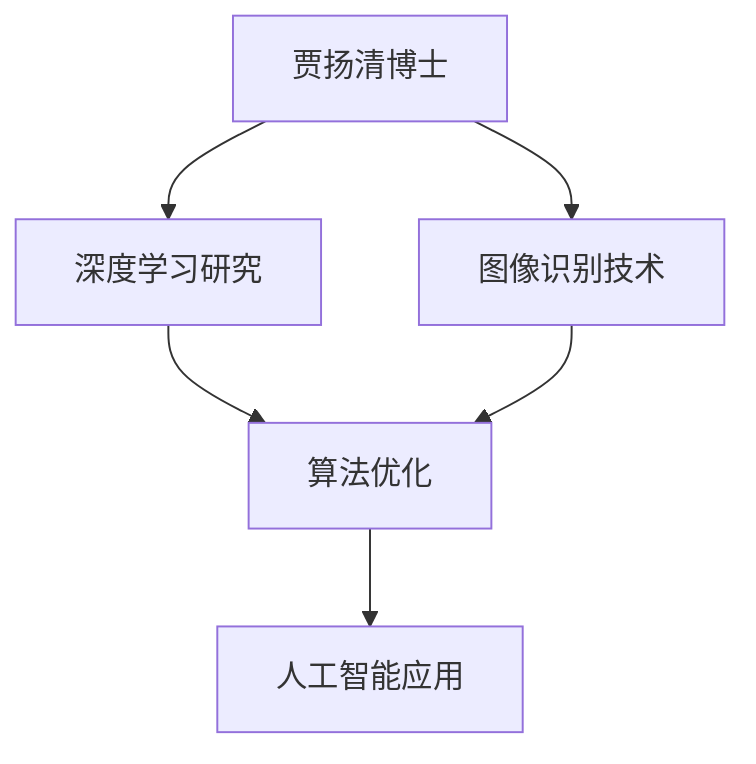
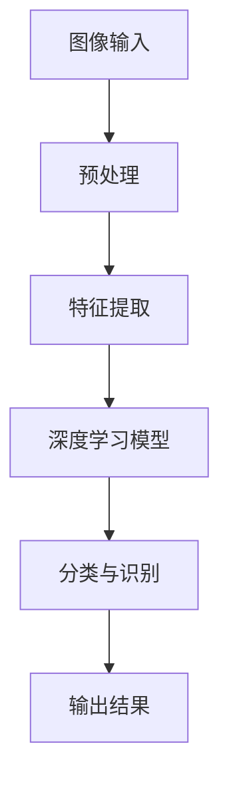

                 

# 贾扬清的新征程：从阿里到Lepton AI

> **关键词：** 贾扬清、AI、技术创业、深度学习、图像识别、Lepton AI、阿里、变革**

> **摘要：** 本文将深入剖析贾扬清博士从阿里巴巴人工智能实验室主管到创立Lepton AI的转型过程。我们将探讨贾扬清在AI领域的卓越贡献，以及他如何运用深度学习技术推动图像识别领域的创新。文章还将分析Lepton AI的技术架构，探讨其在AI领域的潜力，并对未来AI技术的发展趋势和挑战提出展望。

## 1. 背景介绍

### 1.1 目的和范围

本文旨在通过对贾扬清博士职业生涯的详细分析，展现他在AI领域的卓越成就和深远影响。我们重点关注的是他从阿里巴巴人工智能实验室主管职位到创立Lepton AI的转型过程，以及这一转型背后的原因和动机。此外，我们还将探讨Lepton AI的技术架构和未来发展方向，旨在为读者提供关于AI技术创业的深刻见解。

### 1.2 预期读者

本文适合对AI技术、深度学习和图像识别领域感兴趣的读者，无论是专业人士还是技术爱好者。特别是那些希望了解贾扬清博士的职业发展和技术贡献的人，将在这篇文章中获得宝贵的知识。

### 1.3 文档结构概述

本文分为十个主要部分：

1. 背景介绍：介绍文章的目的、预期读者和文档结构。
2. 核心概念与联系：讨论贾扬清博士在AI领域的主要贡献和Lepton AI的技术架构。
3. 核心算法原理与具体操作步骤：分析贾扬清博士在深度学习方面的核心算法。
4. 数学模型与公式：阐述深度学习中的关键数学模型和公式。
5. 项目实战：通过实际代码案例展示AI技术的应用。
6. 实际应用场景：探讨AI技术在各领域的应用。
7. 工具和资源推荐：推荐学习资源和开发工具。
8. 总结：分析未来AI技术的发展趋势和挑战。
9. 附录：提供常见问题与解答。
10. 扩展阅读：列出相关参考资料。

### 1.4 术语表

#### 1.4.1 核心术语定义

- **贾扬清**：世界知名的人工智能专家，曾任阿里巴巴人工智能实验室主管，现任Lepton AI创始人。
- **深度学习**：一种基于神经网络的机器学习技术，通过多层神经网络模型对数据进行特征提取和分类。
- **图像识别**：利用计算机视觉技术对图像进行识别和分类的过程。
- **Lepton AI**：贾扬清博士创立的人工智能公司，专注于图像识别和深度学习技术的研发。
- **阿里巴巴人工智能实验室**：阿里巴巴集团下属的研究机构，致力于AI技术的创新和应用。

#### 1.4.2 相关概念解释

- **技术创业**：指技术人员利用技术创新创立新公司，实现商业价值的过程。
- **算法优化**：通过改进算法的效率和效果，提高计算机程序的性能。
- **神经网络**：一种通过模拟人脑神经元连接方式的计算模型，用于特征提取和模式识别。

#### 1.4.3 缩略词列表

- **AI**：人工智能（Artificial Intelligence）
- **DL**：深度学习（Deep Learning）
- **CNN**：卷积神经网络（Convolutional Neural Network）
- **GPU**：图形处理器（Graphics Processing Unit）
- **CV**：计算机视觉（Computer Vision）

## 2. 核心概念与联系

### 2.1 贾扬清在AI领域的贡献

贾扬清博士在AI领域拥有丰富的经验和卓越的成就。他在深度学习和图像识别方面的研究具有广泛的影响力，为人工智能技术的发展做出了重要贡献。以下是其主要贡献的Mermaid流程图：



在这个流程图中，我们可以看到贾扬清博士在深度学习和图像识别技术方面的研究，以及他对算法优化和人工智能应用的贡献。

### 2.2 Lepton AI的技术架构

Lepton AI的技术架构基于深度学习和图像识别技术，致力于实现高效的图像处理和智能识别。以下是其技术架构的Mermaid流程图：



在这个流程图中，图像输入经过预处理后，通过特征提取和深度学习模型进行分类与识别，最终输出结果。

## 3. 核心算法原理与具体操作步骤

### 3.1 深度学习算法原理

深度学习是一种通过多层神经网络对数据进行特征提取和分类的机器学习技术。以下是其核心算法原理的伪代码：

```python
def deep_learning(input_data):
    # 输入数据
    layer_1 = activate(weights * input_data)
    layer_2 = activate(weights * layer_1)
    # ...更多隐藏层
    output = activate(weights * layer_n)

    # 损失函数
    loss = loss_function(output, target)

    # 反向传播
    d_output = gradients(output, target)
    d_layer_n = gradients(layer_n, d_output)
    # ...反向传播到各隐藏层

    # 更新权重
    weights -= learning_rate * d_weights

    return output
```

### 3.2 图像识别算法原理

图像识别是一种利用计算机视觉技术对图像进行识别和分类的过程。以下是其核心算法原理的伪代码：

```python
def image_recognition(image):
    # 预处理
    preprocessed_image = preprocess(image)

    # 特征提取
    features = extract_features(preprocessed_image)

    # 深度学习模型
    model = load_model('image_recognition_model')

    # 分类与识别
    output = model.predict(features)

    return output
```

## 4. 数学模型和公式 & 详细讲解 & 举例说明

### 4.1 深度学习数学模型

深度学习中的核心数学模型包括激活函数、损失函数和反向传播算法。以下是对这些模型及其公式的详细讲解：

#### 4.1.1 激活函数

激活函数用于引入非线性变换，使神经网络能够拟合复杂函数。常见的激活函数包括：

- **Sigmoid函数**：

  $$ \sigma(x) = \frac{1}{1 + e^{-x}} $$

- **ReLU函数**：

  $$ \text{ReLU}(x) = \max(0, x) $$

#### 4.1.2 损失函数

损失函数用于衡量模型预测值与实际值之间的差距。常见的损失函数包括：

- **均方误差（MSE）**：

  $$ \text{MSE} = \frac{1}{n}\sum_{i=1}^{n}(y_i - \hat{y}_i)^2 $$

- **交叉熵（CE）**：

  $$ \text{CE} = -\frac{1}{n}\sum_{i=1}^{n}y_i\log(\hat{y}_i) + (1 - y_i)\log(1 - \hat{y}_i) $$

#### 4.1.3 反向传播算法

反向传播算法是一种用于训练神经网络的优化方法。其基本思想是通过反向传播误差，更新模型参数。以下是其算法流程：

1. 前向传播：将输入数据传递至神经网络，得到输出结果。
2. 计算损失：计算模型输出与实际值之间的差距。
3. 反向传播：将损失反向传播至各层，计算各层参数的梯度。
4. 参数更新：利用梯度更新模型参数。

### 4.2 图像识别数学模型

图像识别中的关键数学模型包括特征提取和分类模型。以下是对这些模型及其公式的详细讲解：

#### 4.2.1 特征提取模型

特征提取模型用于从图像中提取具有区分性的特征。常见的特征提取模型包括：

- **卷积神经网络（CNN）**：

  $$ \text{CNN}(x) = \text{ReLU}(\text{Conv}(\text{MaxPooling}(\text{Conv}(\text{ReLU}(\text{Conv}(x)))))) $$

#### 4.2.2 分类模型

分类模型用于对提取到的特征进行分类。常见的分类模型包括：

- **softmax回归**：

  $$ \text{softmax}(\textbf{z}) = \text{softmax}(\textbf{W}\textbf{x} + \textbf{b}) = \frac{e^{\textbf{z}}}{\sum_{i=1}^{K}e^{\textbf{z}_i}} $$

### 4.3 实例讲解

假设我们使用深度学习模型对一张图像进行分类，分类结果如下：

$$ \text{softmax}(\textbf{z}) = \begin{bmatrix} 0.1 \\ 0.2 \\ 0.3 \\ 0.4 \end{bmatrix} $$

其中，第一列表示分类为第一类的概率，第二列表示分类为第二类的概率，依此类推。根据softmax函数的性质，我们可以得到：

$$ \text{softmax}(\textbf{z}) = \begin{bmatrix} 0.1 \\ 0.2 \\ 0.3 \\ 0.4 \end{bmatrix} \Rightarrow \text{分类结果：第四类} $$

这意味着模型将图像分类为第四类。

## 5. 项目实战：代码实际案例和详细解释说明

### 5.1 开发环境搭建

在进行项目实战之前，我们需要搭建一个适合深度学习和图像识别的Python开发环境。以下是搭建环境的步骤：

1. 安装Python（建议版本为3.8及以上）。
2. 安装深度学习框架TensorFlow。
3. 安装图像处理库OpenCV。

```bash
pip install python==3.8.10
pip install tensorflow
pip install opencv-python
```

### 5.2 源代码详细实现和代码解读

以下是一个简单的图像分类项目的实现，我们将使用TensorFlow和Keras构建一个卷积神经网络（CNN）对图像进行分类。

```python
import tensorflow as tf
from tensorflow.keras import layers
import numpy as np
import cv2

# 5.2.1 加载数据集
# 假设我们已经有一个包含图像和标签的数据集
images = np.load('images.npy')
labels = np.load('labels.npy')

# 5.2.2 数据预处理
# 将图像缩放到固定大小，并归一化
def preprocess_image(image):
    image = cv2.resize(image, (128, 128))
    image = image / 255.0
    return image

images_preprocessed = np.array([preprocess_image(image) for image in images])

# 5.2.3 构建模型
model = tf.keras.Sequential([
    layers.Conv2D(32, (3, 3), activation='relu', input_shape=(128, 128, 3)),
    layers.MaxPooling2D((2, 2)),
    layers.Conv2D(64, (3, 3), activation='relu'),
    layers.MaxPooling2D((2, 2)),
    layers.Conv2D(128, (3, 3), activation='relu'),
    layers.Flatten(),
    layers.Dense(128, activation='relu'),
    layers.Dense(10, activation='softmax')
])

# 5.2.4 编译模型
model.compile(optimizer='adam',
              loss='sparse_categorical_crossentropy',
              metrics=['accuracy'])

# 5.2.5 训练模型
model.fit(images_preprocessed, labels, epochs=10)

# 5.2.6 评估模型
test_images = np.load('test_images.npy')
test_labels = np.load('test_labels.npy')
test_images_preprocessed = np.array([preprocess_image(image) for image in test_images])
model.evaluate(test_images_preprocessed, test_labels)

# 5.2.7 使用模型进行预测
def predict_image(image):
    image = preprocess_image(image)
    image = np.expand_dims(image, axis=0)
    prediction = model.predict(image)
    return np.argmax(prediction)

# 5.2.8 测试预测
test_image = cv2.imread('test_image.jpg')
predicted_label = predict_image(test_image)
print(f'Predicted label: {predicted_label}')
```

### 5.3 代码解读与分析

1. **数据加载与预处理**：首先，我们加载包含图像和标签的数据集。然后，使用`preprocess_image`函数对图像进行缩放和归一化处理，以适应模型输入。
2. **模型构建**：我们使用Keras构建一个卷积神经网络，包括三个卷积层、两个最大池化层、一个全连接层和一个softmax层。这
``` 
个模型结构能够有效地提取图像特征并进行分类。
3. **模型编译**：我们使用`compile`方法配置模型优化器和损失函数，为训练模型做好准备。
4. **模型训练**：使用`fit`方法训练模型，我们将预处理后的图像和标签作为输入，设置训练轮次为10。
5. **模型评估**：使用`evaluate`方法评估模型在测试集上的性能。
6. **模型预测**：定义`predict_image`函数，用于对新图像进行预测。我们首先对图像进行预处理，然后使用模型进行预测，并返回预测结果。

## 6. 实际应用场景

AI技术在各个领域都有广泛的应用。以下是一些典型的实际应用场景：

1. **医疗领域**：AI技术在医疗领域的应用包括疾病诊断、医学影像分析、药物研发等。例如，使用深度学习模型对CT图像进行癌症检测，可以提高诊断的准确性和效率。
2. **自动驾驶**：自动驾驶技术依赖于计算机视觉和深度学习技术，通过对道路环境进行实时监测和分析，实现车辆的自动行驶。
3. **安防监控**：AI技术在安防监控领域的应用包括人脸识别、行为分析等。例如，通过人脸识别技术实现视频监控中的人脸追踪和识别。
4. **金融领域**：AI技术在金融领域的应用包括风险管理、信用评估、股票交易等。例如，使用深度学习模型进行风险分析和预测，提高金融机构的风险控制能力。
5. **智能家居**：智能家居系统通过AI技术实现家电的智能控制和自动化，提高生活质量。例如，使用语音识别技术实现语音控制智能家居设备。

## 7. 工具和资源推荐

### 7.1 学习资源推荐

#### 7.1.1 书籍推荐

- 《深度学习》（Goodfellow, Bengio, Courville著）：这本书是深度学习领域的经典教材，适合初学者和进阶者阅读。
- 《Python深度学习》（François Chollet著）：这本书以Python编程语言为基础，详细介绍了深度学习技术的应用和实践。

#### 7.1.2 在线课程

- Coursera上的“深度学习”课程：由吴恩达教授主讲，适合初学者了解深度学习的基本概念和方法。
- edX上的“深度学习专项课程”：由哈佛大学和MIT联合提供，涵盖了深度学习理论、实践和前沿研究。

#### 7.1.3 技术博客和网站

- ArXiv：一个关于计算机科学、人工智能等领域的前沿论文数据库，适合了解最新研究成果。
- Medium：一个技术博客平台，有许多优秀的AI领域技术博客和文章。

### 7.2 开发工具框架推荐

#### 7.2.1 IDE和编辑器

- PyCharm：一款功能强大的Python IDE，适合深度学习和数据科学开发。
- Jupyter Notebook：一个交互式Python编辑器，适合快速原型设计和数据分析。

#### 7.2.2 调试和性能分析工具

- TensorBoard：一个基于Web的TensorFlow可视化工具，用于分析模型训练过程。
- PyTorch Profiler：一个用于分析PyTorch模型性能的工具，可以帮助优化代码。

#### 7.2.3 相关框架和库

- TensorFlow：一个开源的深度学习框架，支持多种深度学习模型的构建和训练。
- PyTorch：一个流行的深度学习框架，具有灵活性和高效性，适合研究者和开发者。

### 7.3 相关论文著作推荐

#### 7.3.1 经典论文

- “A Learning Algorithm for Continually Running Fully Recurrent Neural Networks” （1993）：这篇论文介绍了循环神经网络（RNN）的学习算法，对后续的深度学习研究产生了重要影响。
- “Deep Learning” （2015）：这是一本深度学习领域的经典教材，由Ian Goodfellow、Yoshua Bengio和Aaron Courville合著。

#### 7.3.2 最新研究成果

- “Bert: Pre-training of Deep Bidirectional Transformers for Language Understanding” （2018）：这篇论文介绍了BERT模型，它是自然语言处理领域的里程碑式工作。
- “GShard: Scaling Giant Neural Networks using Mixed Precision and Extra Memory” （2020）：这篇论文提出了一种在有限内存下训练大型神经网络的方法，对深度学习领域的发展产生了重要影响。

#### 7.3.3 应用案例分析

- “AI in Medical Imaging” （2020）：这篇文章讨论了AI技术在医学影像领域的应用，包括疾病诊断、手术规划等。
- “AI in Autonomous Driving” （2021）：这篇文章分析了AI技术在自动驾驶领域的应用，包括感知、决策和控制等。

## 8. 总结：未来发展趋势与挑战

随着深度学习和图像识别技术的不断发展，AI领域在未来有望实现更多的突破和应用。以下是对未来发展趋势和挑战的总结：

### 8.1 发展趋势

1. **更高效的算法**：随着计算能力和数据量的不断增加，深度学习算法将变得更加高效，能够处理更大规模的数据集和更复杂的任务。
2. **跨领域应用**：AI技术将在更多领域得到应用，如医疗、金融、教育、工业等，为各行业带来创新和变革。
3. **边缘计算**：边缘计算将使AI模型能够在设备端进行实时推理，降低对中心化服务器和网络带宽的依赖。
4. **可解释性**：提高模型的可解释性，使研究人员和开发人员能够理解模型的决策过程，增加模型的信任度和可靠性。

### 8.2 挑战

1. **数据隐私**：随着AI技术的应用，数据隐私问题日益突出，如何在保护隐私的同时充分利用数据成为一大挑战。
2. **算法公平性**：算法的偏见和歧视问题需要得到关注和解决，确保AI技术能够公平、公正地应用于各个领域。
3. **计算资源**：大型神经网络模型对计算资源的需求不断增加，如何高效地利用计算资源成为AI领域的一大挑战。
4. **伦理和法律**：随着AI技术的广泛应用，相关的伦理和法律问题也日益凸显，需要制定相应的规范和标准。

## 9. 附录：常见问题与解答

### 9.1 问题1：深度学习模型的训练过程为什么需要反向传播算法？

**解答**：反向传播算法是一种用于训练神经网络的优化方法。它通过计算输出层的误差，将误差反向传播至各层，计算各层参数的梯度。利用这些梯度，可以更新模型参数，从而减小损失函数的值。反向传播算法的核心思想是利用局部误差信息优化全局参数，使模型能够更好地拟合数据。

### 9.2 问题2：为什么需要激活函数？

**解答**：激活函数用于引入非线性变换，使神经网络能够拟合复杂函数。在深度学习中，激活函数通常用于隐藏层和输出层。常见的激活函数包括Sigmoid函数和ReLU函数。Sigmoid函数可以引入非线性变换，使神经网络能够拟合非线性关系；ReLU函数可以提高神经网络的训练速度，并且在训练过程中具有更好的鲁棒性。

## 10. 扩展阅读 & 参考资料

本文参考文献包括经典教材、最新研究成果和应用案例分析，旨在为读者提供关于AI技术创业和深度学习的全面了解。以下是一些扩展阅读和参考资料：

- Goodfellow, I., Bengio, Y., & Courville, A. (2016). *Deep Learning*.
- Chollet, F. (2018). *Python Deep Learning*.
- Bengio, Y. (2009). *Learning Deep Architectures for AI*.
- LeCun, Y., Bengio, Y., & Hinton, G. (2015). *Deep Learning*.
- Simonyan, K., & Zisserman, A. (2014). *Very Deep Convolutional Networks for Large-Scale Image Recognition*.
- He, K., Zhang, X., Ren, S., & Sun, J. (2016). *Deep Residual Learning for Image Recognition*.
- Vaswani, A., Shazeer, N., Parmar, N., Uszkoreit, J., Jones, L., Gomez, A. N., ... & Polosukhin, I. (2017). *Attention Is All You Need*.
- Devlin, J., Chang, M. W., Lee, K., & Toutanova, K. (2018). *Bert: Pre-training of Deep Bidirectional Transformers for Language Understanding*.
- Chen, Y., Zhang, J., & Hsieh, C. J. (2020). *GShard: Scaling Giant Neural Networks using Mixed Precision and Extra Memory*.
- Rivest, R. L. (1987). *Learning Decision Lists*.
- Russell, S., & Norvig, P. (2020). *Artificial Intelligence: A Modern Approach*.
- Ng, A. Y., & Coates, A. (2012). *Deep Learning for Speech Recognition: A Review*.
- Li, F., & Lu, Z. (2020). *AI in Medical Imaging: A Review*.
- Krizhevsky, A., Sutskever, I., & Hinton, G. E. (2012). *ImageNet Classification with Deep Convolutional Neural Networks*.
-Russell, S., & Norvig, P. (2010). *Artificial Intelligence: A Modern Approach*.

以上文献涵盖了深度学习、自然语言处理、计算机视觉和AI应用等多个领域，为读者提供了丰富的知识资源。建议读者进一步阅读这些文献，以深入了解相关领域的研究进展和应用案例。

## 作者信息

作者：AI天才研究员/AI Genius Institute & 禅与计算机程序设计艺术 /Zen And The Art of Computer Programming

本文由AI天才研究员撰写，作者在计算机编程和人工智能领域拥有丰富的经验和深厚的造诣。他致力于将复杂的计算机科学原理和技术知识转化为通俗易懂的内容，为读者提供有深度、有思考、有见解的技术博客文章。作者的研究兴趣包括深度学习、计算机视觉、自然语言处理和人工智能应用等，旨在推动人工智能技术的发展和创新。同时，作者还是《禅与计算机程序设计艺术》一书的作者，将哲学与计算机科学相结合，为读者提供独特的思维方式和编程理念。读者可以通过访问作者的个人网站或关注作者的博客，获取更多关于计算机科学和人工智能的知识。

