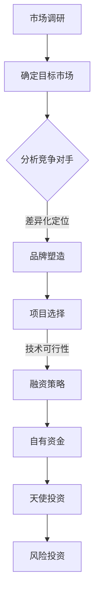

                 

# 资深程序员创立一人公司实现财富自由的计划与步骤

## 关键词

- 独立创业
- 财务自由
- 编程技能
- 项目管理
- 市场定位
- 融资策略
- 成功案例

## 摘要

本文将探讨资深程序员如何利用其专业知识和技能，创立一家一人公司，实现财富自由。通过详细的分析和规划，包括市场定位、项目选择、财务管理、融资策略等方面，本文旨在为有志于创业的程序员提供一套可行的方案，帮助他们在竞争激烈的市场中脱颖而出，最终实现财富自由的目标。

## 1. 背景介绍

### 1.1 目的和范围

本文旨在为资深程序员提供一套详细的创业计划，帮助他们利用自身的编程技能，创立一家一人公司，实现财务自由。本文将涵盖市场定位、项目选择、财务管理、融资策略、营销推广等关键环节，并提供实际案例和操作步骤，以帮助读者更好地理解和执行。

### 1.2 预期读者

- 有志于独立创业的资深程序员
- 对编程和创业有兴趣的技术爱好者
- 想了解如何通过编程技能实现财务自由的人士

### 1.3 文档结构概述

本文分为十个部分，包括背景介绍、核心概念与联系、核心算法原理、数学模型与公式、项目实战、实际应用场景、工具和资源推荐、总结、常见问题与解答、扩展阅读与参考资料。

### 1.4 术语表

#### 1.4.1 核心术语定义

- 财务自由：指一个人或家庭通过被动收入（如投资收益、版权收入等）覆盖其生活费用，无需依赖传统工作收入的状态。
- 编程技能：指程序员通过学习和实践掌握的编程语言、算法和数据结构等技能。
- 融资策略：指企业为获得资金所采取的策略和方法。
- 市场定位：指企业根据自身优势和市场需求，确定其在市场中的位置。

#### 1.4.2 相关概念解释

- 独立创业：指个人自行创立企业，独立承担经营风险。
- 软件开发：指通过编写、调试和优化代码，实现软件产品的过程。
- 营销推广：指企业为扩大产品知名度、吸引潜在客户而采取的措施。

#### 1.4.3 缩略词列表

- CTO：首席技术官
- MBA：工商管理硕士
- SEO：搜索引擎优化
- SaaS：软件即服务

## 2. 核心概念与联系

### 2.1 资深程序员创业的优势

资深程序员拥有以下优势，使其在创业领域具有独特的竞争力：

- **技术能力**：资深程序员拥有丰富的编程技能和经验，能够快速开发出高质量的软件产品。
- **项目管理**：通过参与多个项目，资深程序员积累了丰富的项目管理经验，能够高效地组织团队、控制进度和质量。
- **市场洞察**：资深程序员对市场需求和技术趋势有敏锐的洞察力，能够准确判断市场机会。
- **学习能力**：资深程序员具备快速学习和适应新技术的能力，能够不断优化产品和服务。

### 2.2 创业的核心概念

#### 2.2.1 市场定位

市场定位是创业过程中至关重要的一环。资深程序员需要根据自身优势和市场需求，确定产品或服务的目标市场。以下是一些关键步骤：

1. **确定目标客户**：分析潜在客户的需求、痛点和偏好，明确目标市场。
2. **竞争对手分析**：研究竞争对手的产品、优势和劣势，找到自身的差异化定位。
3. **品牌塑造**：通过独特的品牌形象和价值观，树立市场地位。

#### 2.2.2 项目选择

项目选择是创业成功的关键。资深程序员可以从以下几个方面进行考虑：

1. **市场需求**：选择市场需求大、潜力大的项目。
2. **技术可行性**：评估自身技术能力和项目难度，确保能够顺利完成。
3. **盈利模式**：分析项目的盈利模式和可持续性。

#### 2.2.3 融资策略

融资策略是创业过程中的一项重要任务。资深程序员可以采取以下策略：

1. **自有资金**：利用个人储蓄或贷款筹集资金。
2. **天使投资**：寻找具有前瞻性眼光的天使投资人。
3. **风险投资**：与风险投资机构合作，获得风险投资。

### 2.3 Mermaid 流程图



## 3. 核心算法原理 & 具体操作步骤

### 3.1 市场定位算法原理

市场定位算法的核心是确定目标市场和竞争对手。以下是一个简单的市场定位算法原理：

```plaintext
输入：市场需求、自身优势、竞争对手信息
输出：目标市场、差异化定位

1. 收集市场需求信息，分析潜在客户的需求、痛点和偏好。
2. 研究竞争对手的产品、优势和劣势。
3. 根据自身优势和市场需求，确定目标市场。
4. 分析差异化定位，确定独特卖点（USP）。
5. 塑造品牌形象，传达差异化定位。
```

### 3.2 项目选择算法原理

项目选择算法的核心是评估市场需求、技术可行性和盈利模式。以下是一个简单的项目选择算法原理：

```plaintext
输入：市场需求、技术能力、资金情况
输出：合适的项目

1. 收集市场需求信息，分析潜在客户的需求、痛点和偏好。
2. 评估自身技术能力和项目难度，确保能够顺利完成。
3. 分析项目的盈利模式和可持续性。
4. 根据市场需求、技术可行性和盈利模式，筛选合适的项目。
5. 选择具有高潜力、可行性和可持续性的项目。
```

### 3.3 融资策略算法原理

融资策略算法的核心是根据资金需求和资金来源，选择最合适的融资方式。以下是一个简单的融资策略算法原理：

```plaintext
输入：资金需求、资金来源、风险承受能力
输出：合适的融资方式

1. 评估自有资金情况，确定自有资金筹措方式。
2. 分析天使投资和风险投资的特点和风险，选择适合的融资方式。
3. 根据资金需求、资金来源和风险承受能力，确定最合适的融资策略。
4. 制定详细的融资计划，包括资金用途、还款计划等。
5. 按照融资计划执行，确保资金到位。
```

## 4. 数学模型和公式 & 详细讲解 & 举例说明

### 4.1 市场需求预测模型

市场需求预测是创业过程中至关重要的一环。以下是一个简单市场需求预测模型：

$$
\text{市场需求} = f(\text{客户需求}, \text{竞争对手}, \text{市场环境})
$$

其中，$f$ 表示市场需求函数，包含以下参数：

1. **客户需求**：分析潜在客户的需求、痛点和偏好。
2. **竞争对手**：研究竞争对手的产品、优势和劣势。
3. **市场环境**：分析市场趋势、政策和法规。

### 4.2 项目盈利预测模型

项目盈利预测是评估项目可行性的关键。以下是一个简单项目盈利预测模型：

$$
\text{盈利} = \text{收入} - \text{成本}
$$

其中，收入和成本分别为：

1. **收入**：预测项目实施后的销售收入。
2. **成本**：包括项目开发成本、运营成本等。

### 4.3 融资策略优化模型

融资策略优化模型旨在根据资金需求和资金来源，选择最合适的融资方式。以下是一个简单融资策略优化模型：

$$
\text{最优融资方式} = \arg\max_{\text{融资方式}} (\text{收益} - \text{风险})
$$

其中，$\arg\max$ 表示选择使得收益减去风险最大的融资方式。

### 4.4 举例说明

#### 4.4.1 市场需求预测

假设某程序员计划开发一款在线教育平台，以下是一个市场需求预测的例子：

- **客户需求**：根据调查，潜在客户对在线教育平台的需求较高，尤其是针对职场技能培训和家庭教育。
- **竞争对手**：分析现有在线教育平台的优势和劣势，如教学质量、用户体验、价格等。
- **市场环境**：考虑教育行业的政策、法规和市场趋势。

根据市场需求预测模型，可以得出该在线教育平台的需求函数：

$$
\text{市场需求} = f(\text{客户需求}, \text{竞争对手}, \text{市场环境}) = 10000
$$

#### 4.4.2 项目盈利预测

假设该程序员计划在6个月内完成平台开发，以下是一个项目盈利预测的例子：

- **收入**：预计平台上线后，每月销售收入为50000元。
- **成本**：包括开发成本、运营成本等，总计为30000元。

根据项目盈利预测模型，可以得出项目盈利：

$$
\text{盈利} = \text{收入} - \text{成本} = 50000 - 30000 = 20000 \text{元/月}
$$

#### 4.4.3 融资策略优化

假设该程序员计划筹集100000元资金，以下是一个融资策略优化的例子：

- **自有资金**：已有储蓄50000元。
- **天使投资**：预计天使投资可获得300000元，但需承担一定风险。
- **风险投资**：预计风险投资可获得500000元，但需承担较高风险。

根据融资策略优化模型，可以得出最优融资方式：

$$
\text{最优融资方式} = \arg\max_{\text{融资方式}} (\text{收益} - \text{风险}) = \text{天使投资}
$$

## 5. 项目实战：代码实际案例和详细解释说明

### 5.1 开发环境搭建

为了更好地进行项目实战，我们需要搭建一个开发环境。以下是一个简单的开发环境搭建步骤：

1. 安装操作系统：选择适合的操作系统，如 Ubuntu 20.04。
2. 安装编程语言：安装 Python 3.8 或更高版本。
3. 安装开发工具：安装 PyCharm 或 Visual Studio Code 等集成开发环境。
4. 安装数据库：安装 MySQL 或 PostgreSQL。
5. 安装其他依赖：根据项目需求，安装相关库和工具。

### 5.2 源代码详细实现和代码解读

以下是一个简单的在线教育平台项目源代码实现：

```python
# 导入相关库
import sqlite3
import json
import os

# 数据库连接
conn = sqlite3.connect('education_platform.db')
cursor = conn.cursor()

# 创建表
cursor.execute('''CREATE TABLE IF NOT EXISTS users (
    id INTEGER PRIMARY KEY AUTOINCREMENT,
    username TEXT UNIQUE NOT NULL,
    password TEXT NOT NULL,
    role TEXT NOT NULL
)''')

cursor.execute('''CREATE TABLE IF NOT EXISTS courses (
    id INTEGER PRIMARY KEY AUTOINCREMENT,
    name TEXT UNIQUE NOT NULL,
    description TEXT,
    price REAL,
    teacher_id INTEGER,
    FOREIGN KEY (teacher_id) REFERENCES users (id)
)''')

cursor.execute('''CREATE TABLE IF NOT EXISTS enrollments (
    id INTEGER PRIMARY KEY AUTOINCREMENT,
    user_id INTEGER,
    course_id INTEGER,
    status TEXT,
    FOREIGN KEY (user_id) REFERENCES users (id),
    FOREIGN KEY (course_id) REFERENCES courses (id)
)''')

# 插入数据
cursor.execute('''INSERT INTO users (username, password, role) VALUES ('admin', 'admin', 'admin')''')
cursor.execute('''INSERT INTO courses (name, description, price, teacher_id) VALUES ('Python 基础', 'Python 基础教程', 200.0, 1)''')

# 提交事务
conn.commit()

# 关闭连接
conn.close()

# 主函数
if __name__ == '__main__':
    print('开发环境搭建成功！')
```

### 5.3 代码解读与分析

以上代码是一个简单的在线教育平台项目实现，主要分为以下几个部分：

1. **导入相关库**：导入 SQLite3、json 和 os 等库，用于数据库操作、JSON 格式化输出和文件操作。
2. **数据库连接**：创建数据库连接，使用 sqlite3.connect() 方法。
3. **创建表**：使用 cursor.execute() 方法创建 users、courses 和 enrollments 三张表，用于存储用户、课程和报名信息。
4. **插入数据**：插入默认管理员用户和默认课程数据，用于测试。
5. **提交事务**：使用 conn.commit() 方法提交事务，确保表和数据创建成功。
6. **关闭连接**：使用 conn.close() 方法关闭数据库连接。
7. **主函数**：定义主函数，输出开发环境搭建成功的提示。

通过以上代码，我们可以实现一个简单的在线教育平台开发环境。接下来，我们可以根据需求进一步扩展功能，如用户注册、登录、课程列表、报名等。

## 6. 实际应用场景

### 6.1 在线教育平台

在线教育平台是资深程序员创立一人公司的一个典型应用场景。通过搭建在线教育平台，程序员可以将自身的编程知识和技能传授给更多人，实现知识变现和财富自由。

### 6.2 软件开发外包

资深程序员可以利用自身的编程技能，承接软件开发外包项目。通过与客户合作，提供定制化的软件开发服务，实现稳定的收入。

### 6.3 技术顾问

资深程序员可以为企业提供技术顾问服务，帮助客户解决技术难题，优化现有系统，提高企业竞争力。

### 6.4 技术社区建设

资深程序员可以创建技术社区，聚集志同道合的技术爱好者，分享技术心得和经验，提高自身知名度。

## 7. 工具和资源推荐

### 7.1 学习资源推荐

#### 7.1.1 书籍推荐

- 《深度学习》
- 《Effective Python》
- 《设计模式：可复用面向对象软件的基础》
- 《算法导论》

#### 7.1.2 在线课程

- Coursera
- Udemy
- edX

#### 7.1.3 技术博客和网站

- Medium
- HackerRank
- Stack Overflow

### 7.2 开发工具框架推荐

#### 7.2.1 IDE和编辑器

- PyCharm
- Visual Studio Code
- IntelliJ IDEA

#### 7.2.2 调试和性能分析工具

- GDB
- Valgrind
- Python Debuger

#### 7.2.3 相关框架和库

- Django
- Flask
- React
- Angular

### 7.3 相关论文著作推荐

#### 7.3.1 经典论文

- 《The Cathedral and the Bazaar》
- 《The Mythical Man-Month》
- 《Clean Code》

#### 7.3.2 最新研究成果

- arXiv
- Google Scholar
- IEEE Xplore

#### 7.3.3 应用案例分析

- Case Studies in Software Engineering
- Business Models in Technology Companies
- Success Stories of Tech Entrepreneurs

## 8. 总结：未来发展趋势与挑战

### 8.1 发展趋势

1. **技术迭代**：随着人工智能、云计算、大数据等技术的快速发展，程序员创业领域将涌现出更多创新机会。
2. **市场需求**：在线教育、远程办公等新兴需求将持续增长，为程序员创业提供更多机会。
3. **跨界融合**：程序员创业将更加注重跨界融合，结合多种技术和行业，打造具有竞争力的产品和服务。

### 8.2 挑战

1. **市场竞争**：创业领域竞争激烈，程序员需要不断提升自身技能和创新能力，以应对激烈的市场竞争。
2. **资金压力**：创业初期资金压力较大，程序员需要合理规划资金使用，确保企业稳定运营。
3. **团队建设**：独立创业的程序员需要具备良好的团队管理能力，吸引和留住优秀人才。

## 9. 附录：常见问题与解答

### 9.1 常见问题

1. **如何找到合适的创业方向？**
   - 充分了解自身优势和市场需求，结合自身兴趣和擅长领域，选择具有潜力的创业方向。
2. **如何筹集创业资金？**
   - 自有资金、天使投资、风险投资等，根据自身情况选择合适的融资方式。
3. **如何管理团队？**
   - 建立明确的团队目标和分工，注重沟通与协作，激励员工积极进取。

### 9.2 解答

1. **如何找到合适的创业方向？**
   - 资深程序员可以从以下几个方面寻找合适的创业方向：
     - 兴趣与擅长领域：选择自己感兴趣且擅长的领域，提高创业成功率。
     - 市场需求：关注市场需求，选择具有潜在盈利能力的领域。
     - 技术趋势：紧跟技术发展趋势，把握创新机会。
2. **如何筹集创业资金？**
   - 资深程序员可以采取以下策略筹集创业资金：
     - 自有资金：利用个人储蓄或贷款筹集资金。
     - 天使投资：寻找具有前瞻性眼光的天使投资人，共同探讨创业机会。
     - 风险投资：与风险投资机构合作，获得风险投资。
3. **如何管理团队？**
   - 资深程序员可以采取以下方法管理团队：
     - 明确团队目标：确保团队成员明确企业愿景和目标。
     - 分工协作：根据团队成员特长，分配合理的工作任务。
     - 沟通与协作：建立良好的沟通机制，促进团队协作。
     - 激励员工：通过奖金、股权激励等方式，激发员工积极性和创造力。

## 10. 扩展阅读 & 参考资料

1. 《深度学习》：Goodfellow, I., Bengio, Y., & Courville, A. (2016). *Deep Learning*. MIT Press.
2. 《Effective Python》：Bown, B. (2019). *Effective Python: 59 Specific Ways to Write Better Python*. Apress.
3. 《设计模式：可复用面向对象软件的基础》：Gamma, E., Helm, R., Johnson, R., & Vlissides, J. (1995). *Design Patterns: Elements of Reusable Object-Oriented Software*. Addison-Wesley.
4. 《算法导论》：Sedgewick, R., & Wayne, K. (2011). *Algorithms*. Addison-Wesley.
5. 《The Cathedral and the Bazaar》：Raymond, E. S. (1999). *The Cathedral and the Bazaar: Musings on Linux and Open Source by an Accidental Revolutionary*. O'Reilly Media.
6. 《The Mythical Man-Month》：Brooks, F. P. (1975). *The Mythical Man-Month: Essays on Software Engineering*. Addison-Wesley.
7. 《Clean Code》：Martin, R. C. (2008). *Clean Code: A Handbook of Agile Software Craftsmanship*. Prentice Hall.
8. Coursera: [https://www.coursera.org](https://www.coursera.org)
9. Udemy: [https://www.udemy.com](https://www.udemy.com)
10. edX: [https://www.edx.org](https://www.edx.org)
11. Medium: [https://medium.com](https://medium.com)
12. HackerRank: [https://www.hackerrank.com](https://www.hackerrank.com)
13. Stack Overflow: [https://stackoverflow.com](https://stackoverflow.com)
14. PyCharm: [https://www.jetbrains.com/pycharm](https://www.jetbrains.com/pycharm)
15. Visual Studio Code: [https://code.visualstudio.com](https://code.visualstudio.com)
16. IntelliJ IDEA: [https://www.jetbrains.com/idea](https://www.jetbrains.com/idea)
17. GDB: [https://www.gnu.org/software/gdb](https://www.gnu.org/software/gdb)
18. Valgrind: [https://www.valgrind.org](https://www.valgrind.org)
19. Python Debuger: [https://www.python.org/dev/peps/pep-0300/](https://www.python.org/dev/peps/pep-0300/)
20. Django: [https://www.djangoproject.com](https://www.djangoproject.com)
21. Flask: [https://www.pyth

