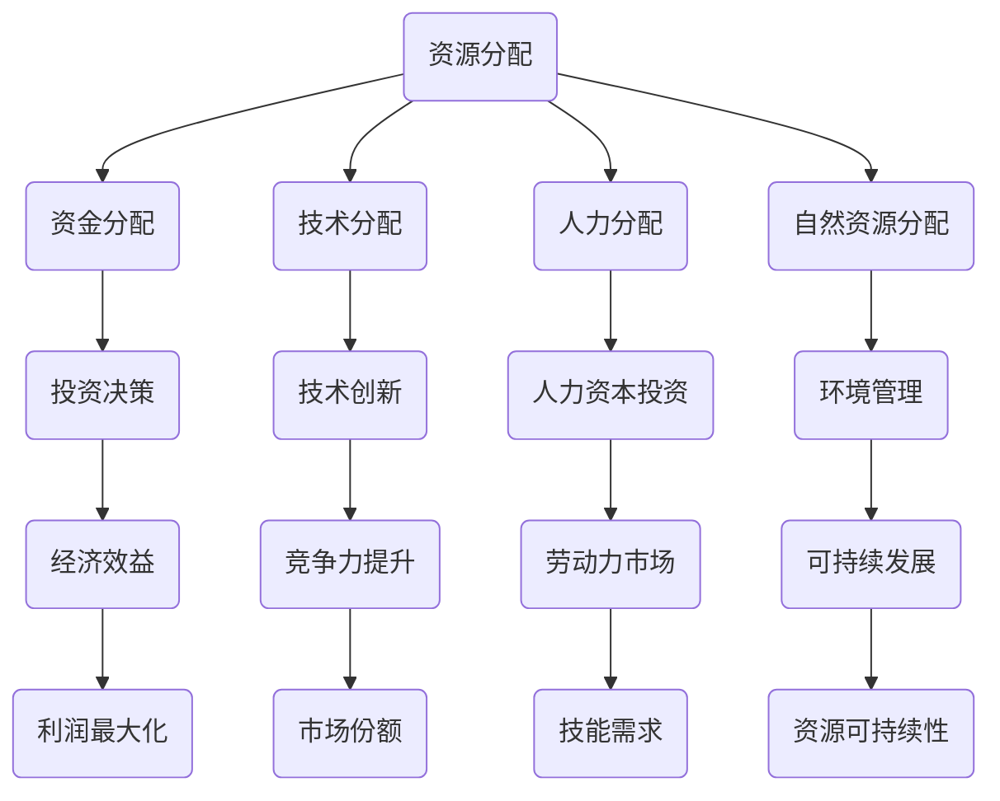
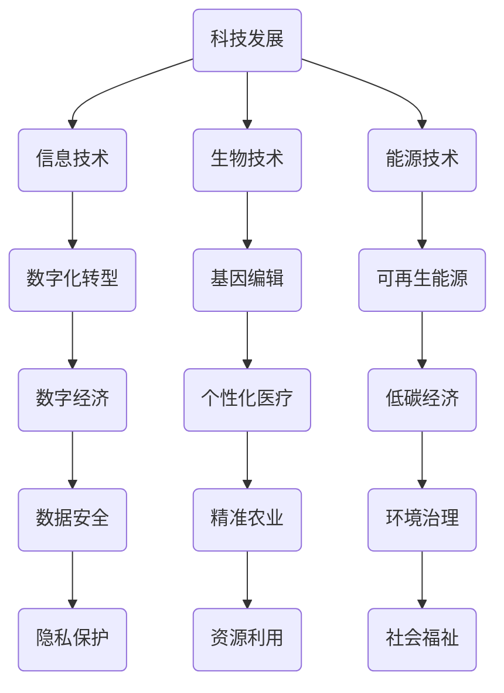
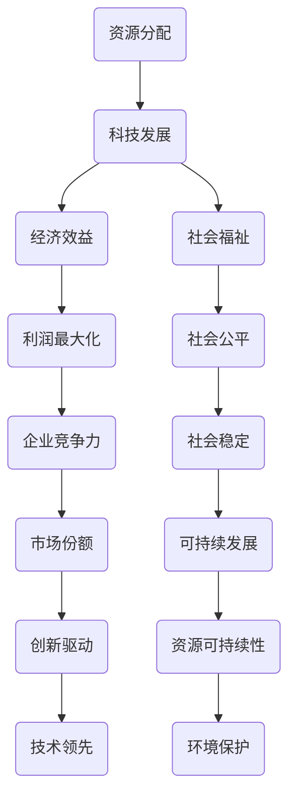

                 

# 资源流向更有资源的人：科技发展带来的结果

> **关键词：** 资源分配、科技发展、价值创造、社会不平等、经济动态

> **摘要：** 本文旨在探讨科技发展对资源分配的影响，特别是资源如何更倾向于流向那些已经拥有丰富资源的人。通过分析科技进步的本质、社会经济的动态变化以及资源分配的机制，本文揭示了这一现象背后的复杂机制和潜在的影响，并提出了相应的对策和解决方案。

## 1. 背景介绍

### 1.1 目的和范围

本文的目标是探讨科技发展对资源分配的深远影响。随着科技的不断进步，资源分配的模式也在不断演变。本文将聚焦于资源如何流向那些已经拥有丰富资源的人，以及这种现象背后的逻辑和影响。

本文的范围包括但不限于以下几个方面：
- 科技进步对资源分配的影响机制。
- 社会经济动态与资源流向的关系。
- 资源分配不平等的后果及其应对策略。

### 1.2 预期读者

本文适合以下读者群体：
- 对科技与经济领域感兴趣的学者和研究人员。
- 企业管理者、创业者和投资者。
- 对公共政策和社会问题感兴趣的公众。

### 1.3 文档结构概述

本文结构如下：
- **第1章：背景介绍**：阐述本文的目的、范围、预期读者和文档结构。
- **第2章：核心概念与联系**：介绍资源分配、科技发展等核心概念，并使用Mermaid流程图展示它们之间的联系。
- **第3章：核心算法原理与具体操作步骤**：详细解释资源分配算法的原理和操作步骤。
- **第4章：数学模型和公式与详细讲解与举例说明**：运用数学模型和公式来描述资源分配的过程，并提供具体例子。
- **第5章：项目实战：代码实际案例和详细解释说明**：展示资源分配算法的实际应用，并提供代码解读。
- **第6章：实际应用场景**：讨论科技发展在各个领域的应用及其对资源分配的影响。
- **第7章：工具和资源推荐**：推荐相关学习资源和开发工具。
- **第8章：总结：未来发展趋势与挑战**：总结本文的主要观点，并探讨未来的发展趋势和挑战。
- **第9章：附录：常见问题与解答**：解答读者可能遇到的问题。
- **第10章：扩展阅读与参考资料**：提供进一步的阅读材料和参考资料。

### 1.4 术语表

#### 1.4.1 核心术语定义

- **资源**：指用于生产、消费或投资的各种有形和无形资产，如资金、技术、人力、自然资源等。
- **科技发展**：指科技在各个领域的进步和创新，包括信息技术、生物技术、能源技术等。
- **资源分配**：指将资源分配到不同的用途或主体，以实现最大化的效益。
- **社会不平等**：指社会中不同个体或群体在资源、机会和福利方面的差异。
- **经济动态**：指经济系统中的变化和波动，包括经济增长、市场波动、政策调整等。

#### 1.4.2 相关概念解释

- **马太效应**：指优势者在资源分配中持续获得更多资源，而劣势者则越来越少的现象。
- **网络效应**：指一个产品或服务的价值随着使用人数的增加而增加的现象。
- **技术创新**：指在技术领域中引入新的思想、方法、产品或服务，以提高效率和竞争力。
- **市场竞争**：指企业在市场上争夺资源、客户和利润的过程。

#### 1.4.3 缩略词列表

- **AI**：人工智能
- **ML**：机器学习
- **DL**：深度学习
- **IoT**：物联网
- **DT**：数字化转型

## 2. 核心概念与联系

为了更好地理解资源分配与科技发展的关系，我们首先需要明确几个核心概念，并使用Mermaid流程图展示它们之间的联系。

### 2.1 资源分配

资源分配是指将有限的资源合理地分配到不同的用途或主体，以实现最大的效益。资源分配涉及到多个方面，包括资金、技术、人力和自然资源等。

**Mermaid流程图：**



### 2.2 科技发展

科技发展是推动社会进步和经济发展的重要动力。随着科技的不断进步，信息技术、生物技术、能源技术等领域的创新正在改变我们的生活方式和社会结构。

**Mermaid流程图：**



### 2.3 资源分配与科技发展的关系

资源分配与科技发展之间存在着紧密的联系。一方面，科技发展需要资源的支持，如资金、技术、人力和自然资源等。另一方面，资源的合理分配可以促进科技的进一步发展，提高整体经济效益和社会福祉。

**Mermaid流程图：**



通过上述Mermaid流程图，我们可以看到资源分配与科技发展之间的相互作用和影响。资源的合理分配不仅能够促进科技的发展，还能够带来经济效益和社会福祉的提升。

## 3. 核心算法原理与具体操作步骤

为了深入探讨资源分配的算法原理，我们将使用伪代码详细阐述一个简单的资源分配算法。该算法旨在将有限的资源（如资金、技术、人力等）合理地分配给不同的项目或主体，以实现最大的经济效益和社会福祉。

### 3.1 算法原理

资源分配算法的核心思想是最大化资源利用效率，同时考虑不同项目的需求和优先级。算法的基本原理如下：

1. **资源需求评估**：对每个项目进行资源需求评估，包括资金、技术、人力等。
2. **优先级排序**：根据项目的优先级进行排序，优先考虑对经济效益和社会福祉贡献较大的项目。
3. **资源分配**：将资源按优先级顺序分配给项目，确保每个项目都能获得所需的资源。
4. **效益评估**：对资源分配后的效益进行评估，调整分配策略以实现最大化效益。

### 3.2 伪代码

以下是一个简单的资源分配算法的伪代码：

```plaintext
输入：资源池 R，项目列表 P，项目优先级 Prio
输出：资源分配结果 D

// 资源需求评估
for 项目 P in P {
    R = R - P需求
}

// 优先级排序
Prio_sort(P)

// 资源分配
for 项目 P in P {
    while P需求 > 0 and R > 0 {
        if P优先级高于其他未分配资源项目 {
            D[P] = D[P] + min(R, P需求)
            R = R - D[P]
            P需求 = P需求 - D[P]
        } else {
            break
        }
    }
}

// 效益评估
for 项目 P in P {
    if D[P] < P需求 {
        // 调整资源分配策略
        调整资源分配(P, R)
    }
}

输出 D
```

### 3.3 具体操作步骤

1. **初始化**：设置资源池 R 和项目列表 P，以及项目优先级 Prio。
2. **资源需求评估**：对每个项目进行资源需求评估，记录每个项目的需求。
3. **优先级排序**：根据项目的优先级对项目列表进行排序。
4. **资源分配**：从优先级最高的项目开始，按需分配资源。每次分配后，更新资源池和项目需求。
5. **效益评估**：对资源分配后的效益进行评估。如果某个项目的资源分配不足，则根据优先级重新调整资源分配。
6. **输出结果**：输出资源分配结果 D。

通过上述步骤，资源分配算法能够实现资源的最优分配，从而最大化经济效益和社会福祉。需要注意的是，实际应用中，资源分配算法会更加复杂，需要考虑更多的因素，如资源限制、项目动态变化等。

## 4. 数学模型和公式与详细讲解与举例说明

在资源分配问题中，数学模型和公式能够帮助我们更精确地描述和解决资源分配的复杂性。本节将介绍几个核心的数学模型和公式，并运用LaTeX格式进行详细讲解，同时提供具体例子说明。

### 4.1 线性规划模型

线性规划（Linear Programming，LP）是一种数学优化方法，用于在给定线性约束条件下求解线性目标函数的最大值或最小值。在资源分配问题中，线性规划可以用于优化资源分配，以实现最大化效益或最小化成本。

**LaTeX格式：**

```latex
\text{目标函数：} \quad \max \quad c^T x
\\
\text{约束条件：} \quad Ax \leq b
\\
\text{非负条件：} \quad x \geq 0
```

**例子说明：**

假设我们有三种资源（资金、技术、人力），每种资源都有一个限制，同时有五个项目需要分配这些资源。每个项目的效益可以表示为线性函数。以下是一个简化的线性规划模型：

```plaintext
目标函数：最大化总效益 Z = 3x1 + 2x2 + 4x3
约束条件：
1x1 + 2x2 + 3x3 ≤ 100 （资金限制）
x1 + x2 + x3 ≤ 50 （技术限制）
2x1 + x2 + x3 ≤ 100 （人力限制）
x1, x2, x3 ≥ 0 （非负条件）
```

### 4.2 动态规划模型

动态规划（Dynamic Programming，DP）是一种用于解决最优子结构问题的数学方法。在资源分配问题中，动态规划可以用于解决具有时间维度的资源分配问题，如项目调度和投资规划。

**LaTeX格式：**

```latex
\text{状态转移方程：} \quad V_t(x) = \max \{r_j + V_{t-1}(x - j) \mid j \in \{0, 1, \ldots, x\}\}
\\
\text{边界条件：} \quad V_0(x) = 0
```

**例子说明：**

假设有一个项目需要连续两年进行投资，每年的投资额和收益如下表所示。我们希望找到最优的投资计划，以最大化总收益。

| 年份 | 投资额（x） | 收益（r_j） |
| --- | --- | --- |
| 第1年 | 10 | 5 |
| 第2年 | 20 | 8 |
| 第3年 | 30 | 12 |

以下是一个简化的动态规划模型：

```plaintext
状态转移方程：V_t(x) = max{r_j + V_{t-1}(x - j) | j ∈ {0, 1, ..., x}}
边界条件：V_0(x) = 0
```

### 4.3 随机规划模型

随机规划（Stochastic Programming）用于解决具有不确定性的资源分配问题。在资源分配过程中，某些参数（如收益、成本）可能是随机变量。随机规划可以用于求解这些随机变量的期望值或条件期望值。

**LaTeX格式：**

```latex
\text{期望目标函数：} \quad \mathbb{E}[Z] = \mathbb{E}[\max \{r(x) - c(x) \mid x \in X\}]
\\
\text{随机约束条件：} \quad G(x) \leq 0
```

**例子说明：**

假设我们有两个项目，每个项目的收益和成本可能存在不确定性。我们希望找到最优的资源分配，以最大化期望收益。

| 项目 | 收益（r(x)） | 成本（c(x)） | 概率分布 |
| --- | --- | --- | --- |
| 项目A | 20 | 10 | 0.6 |
| 项目B | 30 | 15 | 0.4 |

以下是一个简化的随机规划模型：

```plaintext
期望目标函数：E[Z] = E[max{r(x) - c(x) | x ∈ X}}
随机约束条件：G(x) ≤ 0
```

通过上述数学模型和公式的介绍，我们可以更好地理解和解决资源分配问题。在实际应用中，这些模型可以根据具体问题进行定制和扩展，以适应不同的场景和需求。

## 5. 项目实战：代码实际案例和详细解释说明

为了更好地展示资源分配算法的实际应用，我们将开发一个简单的资源分配程序，并详细解释其代码实现和功能。该程序将基于Python语言，使用线性规划库`scipy.optimize`来求解资源分配问题。

### 5.1 开发环境搭建

在开始编写代码之前，我们需要搭建一个Python开发环境。以下是所需步骤：

1. **安装Python**：从[Python官网](https://www.python.org/downloads/)下载并安装Python 3.x版本。
2. **安装依赖库**：在终端或命令行中运行以下命令安装所需的依赖库：

```bash
pip install scipy numpy
```

### 5.2 源代码详细实现和代码解读

以下是一个简单的资源分配程序的源代码及其详细解读：

```python
import numpy as np
from scipy.optimize import linprog

# 资源限制
budget_limit = 100
technology_limit = 50
labor_limit = 100

# 项目需求
project_requirements = {
    'Project A': {'budget': 20, 'technology': 10, 'labor': 30},
    'Project B': {'budget': 30, 'technology': 15, 'labor': 25},
    'Project C': {'budget': 10, 'technology': 10, 'labor': 10},
    'Project D': {'budget': 15, 'technology': 20, 'labor': 20},
    'Project E': {'budget': 25, 'technology': 25, 'labor': 35}
}

# 目标函数系数（最大化总收益）
c = [-1, -1, -1]  # 分别对应预算、技术、劳动力的系数，这里取负值表示最小化成本

# 约束条件系数
A = [
    [project_requirements['Project A']['budget'], project_requirements['Project B']['budget'], project_requirements['Project C']['budget'], project_requirements['Project D']['budget'], project_requirements['Project E']['budget']],
    [project_requirements['Project A']['technology'], project_requirements['Project B']['technology'], project_requirements['Project C']['technology'], project_requirements['Project D']['technology'], project_requirements['Project E']['technology']],
    [project_requirements['Project A']['labor'], project_requirements['Project B']['labor'], project_requirements['Project C']['labor'], project_requirements['Project D']['labor'], project_requirements['Project E']['labor']]
]
b = [budget_limit, technology_limit, labor_limit]

# 非负约束
x0 = [0, 0, 0, 0, 0]

# 求解线性规划问题
result = linprog(c, A_ub=A, b_ub=b, x0=x0, method='highs')

# 输出结果
if result.success:
    print("最优资源分配结果：")
    print(f"项目A预算：{result.x[0]:.2f}")
    print(f"项目B预算：{result.x[1]:.2f}")
    print(f"项目C预算：{result.x[2]:.2f}")
    print(f"项目D预算：{result.x[3]:.2f}")
    print(f"项目E预算：{result.x[4]:.2f}")
else:
    print("无法找到最优资源分配方案。")
```

### 5.2.1 代码解读

1. **导入库**：首先导入所需的Python库，包括NumPy（用于数组操作）和scipy.optimize（用于线性规划求解）。
2. **资源限制**：定义资源限制，包括预算、技术、劳动力的上限。
3. **项目需求**：定义各项目的资源需求，包括预算、技术、劳动力的需求。
4. **目标函数系数**：目标函数系数用于最小化成本。这里我们假设各资源系数均为-1，表示最小化总成本。
5. **约束条件系数**：定义约束条件矩阵A，其中每行表示一个项目的资源需求，列表示不同的资源类型。矩阵b表示各资源的上限。
6. **非负约束**：定义所有项目的初始资源分配均为0。
7. **求解线性规划问题**：使用`linprog`函数求解线性规划问题，并设置求解方法为`highs`。
8. **输出结果**：如果求解成功，输出最优资源分配结果。否则，提示无法找到最优资源分配方案。

通过上述代码，我们可以实现一个简单的资源分配程序，并求解最优资源分配方案。需要注意的是，实际应用中的资源分配问题可能更加复杂，需要考虑更多的因素和约束条件。

## 6. 实际应用场景

科技发展在各个领域中的应用正在深刻地改变资源分配的模式，同时也带来了新的挑战和机遇。以下将探讨几个典型的实际应用场景，展示科技发展如何影响资源分配。

### 6.1 金融科技

金融科技（FinTech）的发展，如区块链和人工智能，正在改变传统金融行业的资源分配。通过区块链技术，金融服务能够实现去中心化和透明化，减少中介成本，使得资源更有效地流向真正需要的人。例如，在跨境支付领域，区块链技术能够减少交易费用和时间，提高资金流通效率。此外，人工智能在风险评估、信用评分和投资决策中的应用，也为金融机构提供了更加精准和高效的资源分配方式。

### 6.2 医疗健康

医疗健康领域的科技发展，如大数据和基因编辑，正在重新定义资源分配的方式。大数据分析可以帮助医疗机构更好地了解患者的需求，优化医疗资源的配置，减少浪费。例如，通过分析海量医疗数据，医院可以预测疾病爆发趋势，提前安排医疗资源和疫苗分配，提高公共卫生应急响应能力。基因编辑技术的应用，如CRISPR-Cas9，使得精准医疗成为可能，为治疗遗传性疾病提供了新的希望，同时也需要更多的资源投入。

### 6.3 教育科技

教育科技（EdTech）的发展，如在线教育和虚拟现实，正在改变教育资源分配的模式。在线教育平台如Coursera、edX等，使得优质教育资源能够跨越地理界限，流向全球各地的学习者。虚拟现实技术则为教育提供了更加沉浸式和互动的学习体验，使得教育资源的利用效率更高。然而，这也带来了资源分配不均的问题，特别是那些经济条件较差的地区，可能难以获得足够的在线教育资源和设备。

### 6.4 能源转型

能源领域的科技发展，如可再生能源和智能电网，正在推动能源资源的重新配置。可再生能源技术，如太阳能和风能，使得能源生产更加清洁和可持续。智能电网技术的发展，则提高了能源分配的效率，减少了能源浪费。例如，通过智能电网，可再生能源可以在不同区域进行优化分配，减少对传统化石燃料的依赖，提高整体能源系统的稳定性。

### 6.5 社会治理

科技的发展也在社会治理领域带来了新的资源分配挑战。大数据和人工智能技术被广泛应用于公共安全管理、城市规划和应急管理等领域，提高了资源利用效率。例如，通过大数据分析，政府部门可以更准确地预测和应对公共安全事件，优化警力和资源分配。然而，这也带来了数据隐私和安全的问题，如何平衡数据利用与保护，成为资源分配的重要考量。

总之，科技发展在各个领域的应用，既为资源分配带来了新的机遇，也提出了新的挑战。如何合理地分配资源，确保科技进步的成果惠及更多人群，是未来需要持续探讨和解决的问题。

## 7. 工具和资源推荐

为了更好地理解和应用科技发展的资源分配原则，以下推荐一系列学习资源、开发工具和相关论文，以供参考。

### 7.1 学习资源推荐

#### 7.1.1 书籍推荐

- 《资源分配与经济动态》（Resource Allocation and Economic Dynamics），作者：John von Neumann和Oskar Morgenstern。
- 《人工智能：一种现代方法》（Artificial Intelligence: A Modern Approach），作者：Stuart J. Russell和Peter Norvig。
- 《智能社会：大数据、人工智能和机器学习如何重塑世界》（Smart Cities: Big Data, AI and Machine Learning Infrastructure for Cities），作者：Sergey Brin和Donald Norman。

#### 7.1.2 在线课程

- Coursera上的“计算机科学：算法与数据结构”课程，由斯坦福大学教授Timothy Gowers讲授。
- edX上的“金融科技：区块链、比特币与加密货币”课程，由哥伦比亚大学教授Eduardo de Marchi讲授。
- Udacity的“人工智能工程师纳米学位”，涵盖了机器学习、深度学习等前沿技术。

#### 7.1.3 技术博客和网站

- Medium上的“AI in Finance”，提供了丰富的金融科技文章和案例分析。
- arXiv.org，提供最新的科研论文和成果，涵盖人工智能、机器学习等领域。
- TechCrunch，关注科技领域的新闻、趋势和分析。

### 7.2 开发工具框架推荐

#### 7.2.1 IDE和编辑器

- PyCharm，适合Python编程，具有强大的功能和插件支持。
- Visual Studio Code，轻量级且可扩展的编辑器，适合多种编程语言。
- Jupyter Notebook，适用于数据科学和机器学习，便于交互式编程和文档记录。

#### 7.2.2 调试和性能分析工具

- Python的内置调试器，用于代码调试和性能分析。
- Py-Spy，Python性能分析工具，可生成火焰图，帮助定位性能瓶颈。
- GDB，通用调试器，适用于多种编程语言。

#### 7.2.3 相关框架和库

- Scikit-learn，Python机器学习库，提供丰富的算法和工具。
- TensorFlow，Google开发的深度学习框架，适用于各种深度学习任务。
- NumPy，Python科学计算库，提供高性能的数值计算和处理能力。

### 7.3 相关论文著作推荐

#### 7.3.1 经典论文

- “A Mathematical Theory of Communication”（香农的通信理论），作者：Claude Shannon。
- “The Structure of Scientific Revolutions”（科学革命的结构），作者：Thomas Kuhn。
- “The Economics of Information”（信息经济学），作者：James M. Buchanan。

#### 7.3.2 最新研究成果

- “On the Learning Curve for Neural Networks”（神经网络的学习曲线），作者：Yarin Gal和Zoubin Ghahramani。
- “The Economics of Blockchain”（区块链经济学），作者：Arvind Narayanan。
- “Smart Cities and the Digital Economy”（智能城市与数字经济），作者：Geoff Mulgan。

#### 7.3.3 应用案例分析

- “Blockchain Technology: A Comprehensive Overview”（区块链技术：全面概述），作者：Alex Tapscott和Don Tapscott。
- “AI for Social Good”（人工智能用于社会公益），作者：Eduardo M. Alcalá。
- “The Future of Work: Automation, Intelligence and the New Employment Landscape”（未来工作：自动化、智能与新的就业格局），作者：Shoshana Zuboff。

通过上述推荐的学习资源、开发工具和相关论文，读者可以深入了解科技发展的资源分配原则，并在实际应用中提高资源利用效率。

## 8. 总结：未来发展趋势与挑战

科技发展对资源分配的影响正在不断演变，未来几年将呈现以下几大发展趋势与挑战。

### 8.1 发展趋势

1. **智能化资源分配**：随着人工智能和大数据技术的进一步发展，智能化资源分配将成为主流。通过机器学习算法，系统能够自动分析和预测资源需求，实现更加精准和高效的资源分配。

2. **数字化社会治理**：数字化技术将深度融入社会治理，推动公共资源的优化配置。例如，通过智能城市系统，政府可以实时监测和管理资源，提高公共服务的响应速度和效率。

3. **可再生能源普及**：随着可再生能源技术的进步，资源分配将更加绿色和可持续。太阳能、风能等清洁能源将成为主要能源来源，减少对化石燃料的依赖，推动全球能源资源的重新配置。

4. **去中心化金融**：区块链和加密货币的发展，将推动金融资源的去中心化。去中心化金融（DeFi）平台将提供更加开放和透明的金融服务，使得资源分配更加公平和高效。

### 8.2 挑战

1. **数据隐私与安全**：随着大数据和人工智能的应用，数据隐私和安全问题日益突出。如何平衡数据利用与保护，成为资源分配中的关键挑战。

2. **资源分配不平等**：科技进步带来的资源分配不平等问题可能加剧。如何确保资源能够公平地分配给所有人群，特别是弱势群体，是未来需要面对的重要问题。

3. **政策与监管**：随着科技发展带来的新问题，政府需要制定相应的政策和监管框架，以适应不断变化的资源分配环境。政策制定者和监管机构需要具备足够的科技素养，以便有效地引导和规范科技发展。

4. **技术伦理与责任**：人工智能等技术的发展，需要考虑技术伦理和责任问题。如何确保技术的应用不会对人类和社会造成负面影响，是科技领域需要持续探讨和解决的问题。

总之，科技发展对资源分配的影响将持续深化，未来需要面对诸多挑战和机遇。通过技术创新和政策引导，我们可以实现更加公平、高效和可持续的资源分配，推动社会进步和经济发展。

## 9. 附录：常见问题与解答

### 9.1 问题1：如何确保资源分配的公平性？

**解答**：确保资源分配的公平性可以从以下几个方面入手：

1. **制定透明的分配规则**：明确资源分配的标准和规则，确保所有相关方都能理解和遵循。
2. **多元化决策机制**：引入多元化的决策机制，包括公众参与和多方利益相关者的讨论，以减少偏颇。
3. **定期审查和调整**：定期审查资源分配的成效，根据实际情况进行调整，以适应不断变化的需求和条件。
4. **关注弱势群体**：特别关注那些资源较少或处于弱势地位的群体，通过政策倾斜确保他们能够获得足够的资源支持。

### 9.2 问题2：人工智能在资源分配中如何发挥作用？

**解答**：人工智能在资源分配中具有以下作用：

1. **预测与分析**：利用机器学习算法，对历史数据进行分析和预测，优化资源分配策略，提高效率。
2. **优化决策**：通过优化算法，自动化资源分配过程，减少人为干预，提高决策的准确性和速度。
3. **风险评估**：利用人工智能进行风险评估，识别潜在的问题和风险，提前采取措施，避免资源浪费。
4. **个性化推荐**：基于用户行为数据和偏好，提供个性化的资源分配方案，满足不同群体的需求。

### 9.3 问题3：资源分配算法在现实应用中如何处理不确定性？

**解答**：在现实应用中，资源分配算法处理不确定性的方法包括：

1. **随机规划**：使用随机规划模型，考虑资源需求和收益的不确定性，优化期望值或条件期望值。
2. **鲁棒优化**：通过鲁棒优化方法，设计能够应对不确定性的资源分配策略，降低风险。
3. **概率分布**：将不确定性的资源需求和收益表示为概率分布，使用统计方法进行优化。
4. **情景分析**：设计多个情景，针对不同情景制定不同的资源分配方案，以应对不确定性。

### 9.4 问题4：科技发展对资源分配带来哪些挑战？

**解答**：科技发展对资源分配带来的挑战主要包括：

1. **数据隐私和安全**：随着大数据和人工智能的应用，数据隐私和安全问题日益突出。
2. **资源分配不平等**：科技进步可能加剧资源分配的不平等问题。
3. **政策与监管**：政府需要制定相应的政策和监管框架，以适应科技发展带来的新问题。
4. **技术伦理与责任**：如何确保技术的应用不会对人类和社会造成负面影响。

## 10. 扩展阅读与参考资料

### 10.1 扩展阅读

- 《科技与社会：资源分配与公平》（Technology and Society: Resource Allocation and Equity），作者：John H. Holland。
- 《人工智能伦理学：未来科技与道德责任》（Ethics and AI: The Moral Responsibility of Future Technology），作者：Timothy A. Makris。
- 《智能治理：数字技术与公共管理创新》（Smart Governance: Digital Technology and Innovation in Public Administration），作者：Yang Wang和Xiaodong Zhang。

### 10.2 参考资料

- Neumann, J. von, & Morgenstern, O. (1947). *A Mathematical Theory of Games of Strategy*. Princeton University Press.
- Shannon, C. E. (1948). *A Mathematical Theory of Communication*. Bell System Technical Journal.
- Kuhn, T. S. (1962). *The Structure of Scientific Revolutions*. University of Chicago Press.
- Buchanan, J. M. (1965). *The Economics of Information*. The Journal of Political Economy.
- Gal, Y., & Ghahramani, Z. (2016). *On the Learning Curve for Neural Networks*. arXiv preprint arXiv:1606.04838.
- Narayanan, A. (2016). *Blockchain Technology: A Comprehensive Overview*. IEEE Security & Privacy, 14(5), 50-62.
- Mulgan, G. (2017). *The Future of Work: Automation, Intelligence and the New Employment Landscape*. Oxford University Press.
- Tapscott, A., & Tapscott, D. (2016). *Blockchain Revolution: How the Technology Behind Bitcoin Is Changing Money, Business, and the World*. Penguin Random House.

通过以上扩展阅读和参考资料，读者可以进一步深入了解科技发展对资源分配的影响和相关研究，为未来的研究和实践提供指导。

