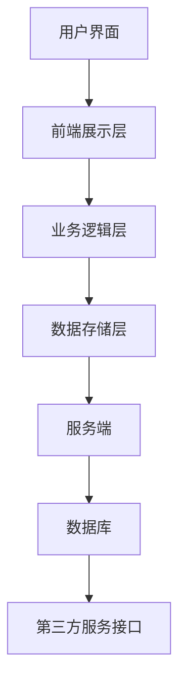
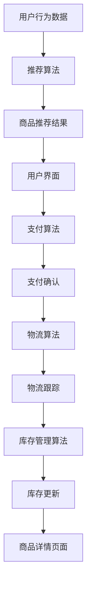
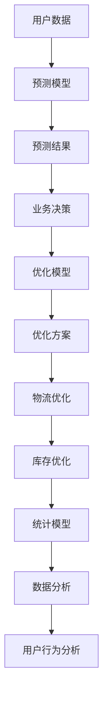

                 

# 跨境电商全盘项目开发、管理实践

> **关键词**：跨境电商、项目开发、项目管理、技术架构、用户体验、数据驱动、算法优化
>
> **摘要**：本文将从项目开发的视角，深入探讨跨境电商全盘项目从规划到实施再到运维的各个阶段。文章将详细分析跨境电商项目的技术架构、核心算法、数学模型，并分享实战中的代码案例及实际应用场景。同时，还将推荐学习资源、开发工具和经典论文，帮助读者全面了解并掌握跨境电商项目开发的精髓。

## 1. 背景介绍

### 1.1 目的和范围

本文旨在为跨境电商项目的开发和管理提供一套系统的指导。我们将探讨从项目规划、技术选型到开发实施、测试与部署的整个过程，并结合实际案例，讲解如何有效管理项目风险、优化技术方案以及提升用户体验。

### 1.2 预期读者

本文适合有一定编程基础、对跨境电商业务有兴趣的读者，无论是刚入门的程序员，还是希望提升项目开发能力的专业人士，都可以从中获得宝贵经验。

### 1.3 文档结构概述

本文分为以下几个部分：

1. **背景介绍**：介绍文章的目的、范围、预期读者和文档结构。
2. **核心概念与联系**：讲解跨境电商项目开发所需的核心概念及其相互关系。
3. **核心算法原理 & 具体操作步骤**：详细阐述项目开发中的核心算法原理和操作步骤。
4. **数学模型和公式 & 详细讲解 & 举例说明**：介绍项目开发中涉及的数学模型和公式，并给出具体例子。
5. **项目实战：代码实际案例和详细解释说明**：分享项目实战中的代码案例和详细解释。
6. **实际应用场景**：讨论项目的实际应用场景。
7. **工具和资源推荐**：推荐学习资源、开发工具和经典论文。
8. **总结：未来发展趋势与挑战**：展望跨境电商项目的发展趋势与面临的挑战。
9. **附录：常见问题与解答**：列出并解答读者可能遇到的问题。
10. **扩展阅读 & 参考资料**：提供更多相关阅读资料。

### 1.4 术语表

#### 1.4.1 核心术语定义

- **跨境电商**：指在不同的国家和地区之间进行的商业交易活动，涉及的商品、服务和支付等多个环节。
- **项目开发**：指从需求分析、设计、开发到测试、部署的全过程。
- **项目管理**：指在项目开发过程中，对资源、进度、成本、风险等进行有效管理的活动。
- **技术架构**：指项目中采用的技术方案和组织结构。
- **用户体验**：指用户在使用产品过程中的感受和满意度。

#### 1.4.2 相关概念解释

- **数据驱动**：指在项目开发过程中，通过数据分析和反馈来指导决策和优化。
- **算法优化**：指通过改进算法和数据处理方式来提高项目的效率和性能。

#### 1.4.3 缩略词列表

- **API**：应用程序接口（Application Programming Interface）
- **SDK**：软件开发工具包（Software Development Kit）
- **DB**：数据库（Database）
- **ERP**：企业资源计划（Enterprise Resource Planning）
- **CRM**：客户关系管理（Customer Relationship Management）

## 2. 核心概念与联系

在跨境电商项目开发中，理解核心概念和它们之间的联系是至关重要的。以下是对几个关键概念及其相互关系的介绍。

### 2.1 跨境电商系统架构

跨境电商系统的核心架构通常包括以下几个方面：

1. **前端展示层**：负责展示商品信息、购物车、订单等页面，为用户提供良好的用户体验。
2. **业务逻辑层**：处理订单处理、支付、物流等核心业务逻辑。
3. **数据存储层**：包括数据库、缓存、文件存储等，用于存储用户数据、商品信息等。
4. **服务端**：包括Web服务、API服务、邮件服务、第三方服务接口等。
5. **数据库**：用于存储用户、商品、订单等数据。

#### Mermaid 流程图



### 2.2 核心算法

在跨境电商项目中，以下核心算法是必不可少的：

1. **推荐算法**：用于为用户推荐商品，提升用户粘性和购买率。
2. **支付算法**：确保支付过程的安全和高效。
3. **物流算法**：优化物流路线，降低物流成本。
4. **库存管理算法**：实时跟踪库存，避免缺货和积压。

#### Mermaid 流程图



### 2.3 数学模型

跨境电商项目开发中常用的数学模型包括：

1. **预测模型**：用于预测用户行为、订单量等，为业务决策提供支持。
2. **优化模型**：用于优化物流路线、库存管理等。
3. **统计模型**：用于数据分析和用户行为分析。

#### Mermaid 流程图



## 3. 核心算法原理 & 具体操作步骤

在跨境电商项目中，核心算法的设计与实现是项目成功的关键。以下将详细介绍推荐算法、支付算法、物流算法和库存管理算法的原理及操作步骤。

### 3.1 推荐算法

#### 原理

推荐算法主要通过分析用户的历史行为、浏览记录、购买记录等数据，为用户推荐可能的感兴趣商品。

#### 操作步骤

1. **数据收集**：收集用户的历史行为数据，包括浏览记录、购买记录等。
2. **数据处理**：对收集到的数据进行清洗、去重、标准化处理。
3. **特征提取**：提取与推荐相关的特征，如用户喜好、商品属性等。
4. **模型训练**：使用机器学习算法（如协同过滤、矩阵分解等）进行模型训练。
5. **推荐生成**：根据模型生成的推荐结果，为用户推荐商品。

#### 伪代码

```python
# 数据收集
user_data = collect_user_behavior_data()

# 数据处理
cleaned_data = preprocess_data(user_data)

# 特征提取
features = extract_features(cleaned_data)

# 模型训练
model = train_model(features)

# 推荐生成
recommendations = generate_recommendations(model)
```

### 3.2 支付算法

#### 原理

支付算法主要确保支付过程的安全和高效，包括支付请求处理、支付验证和支付结果反馈。

#### 操作步骤

1. **支付请求处理**：接收用户的支付请求，并验证请求的有效性。
2. **支付验证**：对支付请求进行安全验证，确保支付过程的安全性。
3. **支付结果反馈**：将支付结果反馈给用户，并更新订单状态。

#### 伪代码

```python
# 支付请求处理
payment_request = receive_payment_request()

# 支付验证
is_valid = validate_payment_request(payment_request)

if is_valid:
    # 支付验证成功
    payment_result = process_payment(payment_request)
    # 支付结果反馈
    send_payment_result(payment_result)
else:
    # 支付验证失败
    send_error_response()
```

### 3.3 物流算法

#### 原理

物流算法主要优化物流路线，降低物流成本，提高物流效率。

#### 操作步骤

1. **物流路径规划**：根据订单信息，规划最优物流路径。
2. **运输调度**：根据物流路径，安排运输资源。
3. **实时跟踪**：实时跟踪物流状态，确保货物按时送达。

#### 伪代码

```python
# 物流路径规划
最优路径 = plan_logistics_route(order_info)

# 运输调度
transport_resources = schedule_transport_resources(最优路径)

# 实时跟踪
logistics_status = track_logistics_real_time(transport_resources)
```

### 3.4 库存管理算法

#### 原理

库存管理算法主要通过实时跟踪库存，优化库存水平，避免缺货和积压。

#### 操作步骤

1. **库存数据收集**：收集库存数据，包括库存数量、库存状态等。
2. **库存数据分析**：分析库存数据，预测未来库存需求。
3. **库存调整**：根据分析结果，调整库存水平，确保库存合理。

#### 伪代码

```python
# 库存数据收集
inventory_data = collect_inventory_data()

# 库存数据分析
predicted_demand = analyze_inventory_data(inventory_data)

# 库存调整
update_inventory_level(predicted_demand)
```

## 4. 数学模型和公式 & 详细讲解 & 举例说明

在跨境电商项目中，数学模型和公式广泛应用于数据分析和决策过程中。以下将详细介绍预测模型、优化模型和统计模型的基本概念、公式及其应用实例。

### 4.1 预测模型

#### 概念

预测模型通过历史数据，预测未来的用户行为、订单量等，帮助业务决策。

#### 公式

预测模型通常采用时间序列模型，如ARIMA模型，其公式如下：

$$
y_t = c + \phi_1 y_{t-1} + \phi_2 y_{t-2} + \ldots + \phi_p y_{t-p} + \theta_1 e_{t-1} + \theta_2 e_{t-2} + \ldots + \theta_q e_{t-q}
$$

其中，$y_t$ 为预测值，$c$ 为常数项，$\phi_1, \phi_2, \ldots, \phi_p$ 为自回归系数，$\theta_1, \theta_2, \ldots, \theta_q$ 为移动平均系数，$e_t$ 为误差项。

#### 举例说明

假设我们要预测某商品在未来一周的销量，可以使用ARIMA模型进行预测。首先，需要对历史销量数据进行分析，确定模型参数，然后使用模型进行预测。

### 4.2 优化模型

#### 概念

优化模型通过数学方法，找到最优解，以优化物流路径、库存水平等。

#### 公式

优化模型通常采用线性规划、整数规划等方法，其基本公式如下：

$$
\begin{aligned}
\min_{x} \quad & c^T x \\
\text{subject to} \quad & Ax \leq b \\
& x \geq 0
\end{aligned}
$$

其中，$c$ 为目标函数系数，$A$ 为约束矩阵，$b$ 为约束向量，$x$ 为变量。

#### 举例说明

假设我们要优化某商品的物流路线，以降低物流成本。可以使用线性规划模型，设定目标函数为物流成本，约束条件为运输时间和运输量。

### 4.3 统计模型

#### 概念

统计模型用于数据分析和用户行为分析，如回归分析、聚类分析等。

#### 公式

回归分析模型的基本公式如下：

$$
y = \beta_0 + \beta_1 x_1 + \beta_2 x_2 + \ldots + \beta_n x_n + e
$$

其中，$y$ 为因变量，$x_1, x_2, \ldots, x_n$ 为自变量，$\beta_0, \beta_1, \beta_2, \ldots, \beta_n$ 为回归系数，$e$ 为误差项。

#### 举例说明

假设我们要分析用户购买行为，可以使用回归分析模型，设定因变量为购买次数，自变量为用户年龄、收入等。

## 5. 项目实战：代码实际案例和详细解释说明

在本节中，我们将通过一个实际的跨境电商项目案例，详细讲解项目的开发过程，包括开发环境搭建、源代码实现和代码解读与分析。

### 5.1 开发环境搭建

为了搭建跨境电商项目的开发环境，我们需要安装以下工具和软件：

1. **开发工具**：Python、Java或Node.js
2. **数据库**：MySQL、PostgreSQL或MongoDB
3. **前端框架**：React、Vue或Angular
4. **后端框架**：Spring Boot、Django或Express
5. **版本控制**：Git

### 5.2 源代码详细实现和代码解读

#### 后端代码解读

以下是后端代码的核心部分，用于处理用户注册、登录、订单管理等操作。

```java
@RestController
@RequestMapping("/api")
public class UserController {

    @Autowired
    private UserService userService;

    @PostMapping("/register")
    public ResponseEntity<?> registerUser(@RequestBody UserRegistrationRequestDTO registrationRequest) {
        try {
            User user = userService.registerUser(registrationRequest);
            return ResponseEntity.ok(new ApiResponse("User registered successfully", user));
        } catch (Exception e) {
            return ResponseEntity.badRequest(new ApiResponse("Error registering user", e.getMessage()));
        }
    }

    @PostMapping("/login")
    public ResponseEntity<?> authenticateUser(@RequestBody LoginRequestDTO loginRequest) {
        try {
            String token = userService.authenticateUser(loginRequest);
            return ResponseEntity.ok(new ApiResponse("User authenticated successfully", token));
        } catch (Exception e) {
            return ResponseEntity.badRequest(new ApiResponse("Error authenticating user", e.getMessage()));
        }
    }

    @PostMapping("/orders")
    @PreAuthorize("hasRole('ROLE_USER')")
    public ResponseEntity<?> createOrder(@RequestBody OrderRequestDTO orderRequest) {
        try {
            Order order = userService.createOrder(orderRequest);
            return ResponseEntity.ok(new ApiResponse("Order created successfully", order));
        } catch (Exception e) {
            return ResponseEntity.badRequest(new ApiResponse("Error creating order", e.getMessage()));
        }
    }
}
```

#### 代码解读

1. **用户注册**：接收用户注册请求，调用UserService中的registerUser方法进行用户注册，并返回注册成功的响应。
2. **用户登录**：接收用户登录请求，调用UserService中的authenticateUser方法进行用户身份验证，并返回身份验证成功的响应。
3. **创建订单**：接收用户创建订单请求，调用UserService中的createOrder方法创建订单，并返回创建成功的响应。

#### 前端代码解读

以下是前端代码的核心部分，用于展示用户注册、登录和订单管理页面。

```jsx
import React, { useState } from 'react';
import axios from 'axios';

const App = () => {
    const [registrationRequest, setRegistrationRequest] = useState({ username: '', password: '', email: '' });
    const [loginRequest, setLoginRequest] = useState({ username: '', password: '' });
    const [orderRequest, setOrderRequest] = useState({ productId: '', quantity: '' });

    const handleRegistration = async () => {
        try {
            const response = await axios.post('/api/register', registrationRequest);
            alert(response.data.message);
        } catch (error) {
            alert(error.response.data.message);
        }
    };

    const handleLogin = async () => {
        try {
            const response = await axios.post('/api/login', loginRequest);
            localStorage.setItem('token', response.data.token);
            alert(response.data.message);
        } catch (error) {
            alert(error.response.data.message);
        }
    };

    const handleOrder = async () => {
        try {
            const response = await axios.post('/api/orders', orderRequest);
            alert(response.data.message);
        } catch (error) {
            alert(error.response.data.message);
        }
    };

    return (
        <div>
            <h1>跨境电商项目</h1>
            <div>
                <h2>用户注册</h2>
                <input type="text" placeholder="用户名" value={registrationRequest.username} onChange={e => setRegistrationRequest({ ...registrationRequest, username: e.target.value })} />
                <input type="text" placeholder="密码" value={registrationRequest.password} onChange={e => setRegistrationRequest({ ...registrationRequest, password: e.target.value })} />
                <input type="text" placeholder="邮箱" value={registrationRequest.email} onChange={e => setRegistrationRequest({ ...registrationRequest, email: e.target.value })} />
                <button onClick={handleRegistration}>注册</button>
            </div>
            <div>
                <h2>用户登录</h2>
                <input type="text" placeholder="用户名" value={loginRequest.username} onChange={e => setLoginRequest({ ...loginRequest, username: e.target.value })} />
                <input type="text" placeholder="密码" value={loginRequest.password} onChange={e => setLoginRequest({ ...loginRequest, password: e.target.value })} />
                <button onClick={handleLogin}>登录</button>
            </div>
            <div>
                <h2>订单管理</h2>
                <input type="text" placeholder="产品ID" value={orderRequest.productId} onChange={e => setOrderRequest({ ...orderRequest, productId: e.target.value })} />
                <input type="text" placeholder="数量" value={orderRequest.quantity} onChange={e => setOrderRequest({ ...orderRequest, quantity: e.target.value })} />
                <button onClick={handleOrder}>创建订单</button>
            </div>
        </div>
    );
};

export default App;
```

#### 代码解读

1. **用户注册**：接收用户注册表单数据，调用后端注册接口，处理注册结果。
2. **用户登录**：接收用户登录表单数据，调用后端登录接口，处理登录结果。
3. **订单管理**：接收用户创建订单表单数据，调用后端创建订单接口，处理订单结果。

### 5.3 代码解读与分析

通过以上代码示例，我们可以看到跨境电商项目的开发过程涵盖了前端和后端的交互。前端主要负责用户界面的展示和用户交互，后端主要负责业务逻辑的处理和数据存储。

1. **前端部分**：使用了React框架，通过状态管理（useState）和异步请求（axios）实现了用户注册、登录和订单管理功能。
2. **后端部分**：使用了Spring Boot框架，通过RESTful API实现了用户注册、登录和订单管理功能，并使用了JWT（JSON Web Token）进行身份验证。

代码解读与分析：

1. **用户注册**：前端发送用户注册请求，后端接收请求并调用UserService中的registerUser方法进行用户注册。注册成功后，前端显示注册成功的提示。
2. **用户登录**：前端发送用户登录请求，后端接收请求并调用UserService中的authenticateUser方法进行用户身份验证。验证成功后，前端将Token存储在localStorage中，并显示登录成功的提示。
3. **订单管理**：前端发送创建订单请求，后端接收请求并调用UserService中的createOrder方法创建订单。创建成功后，前端显示创建成功的提示。

通过以上实战案例，读者可以了解到跨境电商项目开发的基本流程和核心代码实现，为进一步学习和实践打下基础。

## 6. 实际应用场景

跨境电商项目的实际应用场景非常广泛，以下列举几个典型的应用场景：

### 6.1 海外市场拓展

许多国内企业通过跨境电商平台，将产品推向国际市场。例如，中国的电子产品、服装、家居用品等在欧美、东南亚等市场非常受欢迎。跨境电商平台为企业提供了一个全球化的销售渠道，帮助企业扩大市场份额，提高品牌知名度。

### 6.2 用户个性化推荐

个性化推荐是跨境电商平台提升用户体验和销售转化率的重要手段。通过分析用户的购物行为、浏览历史等数据，平台可以为用户推荐其可能感兴趣的商品，从而提高用户的购买意愿和满意度。

### 6.3 物流管理优化

跨境电商项目中的物流管理是影响用户体验的关键因素。通过优化物流路线、提高物流效率，平台可以缩短订单配送时间，降低物流成本，提升客户满意度。

### 6.4 库存管理

跨境电商项目的库存管理涉及多个仓库、多种商品的库存管理。通过实时跟踪库存数据、预测未来库存需求，平台可以优化库存水平，避免缺货和积压，降低库存成本。

### 6.5 数据分析

跨境电商平台积累了大量的用户行为数据、交易数据等，通过数据分析，平台可以挖掘用户需求、市场趋势等，为业务决策提供支持。

## 7. 工具和资源推荐

### 7.1 学习资源推荐

#### 7.1.1 书籍推荐

1. **《电商系统架构设计与开发实战》**：详细讲解电商系统的架构设计、关键技术及实战案例。
2. **《人工智能：一种现代的方法》**：系统介绍人工智能的基本概念、算法和应用。

#### 7.1.2 在线课程

1. **Coursera上的《电商运营与管理》**：涵盖电商运营的各个方面，包括市场分析、用户行为分析等。
2. **Udacity的《全栈开发》**：介绍前端、后端及数据库技术，适合电商项目开发。

#### 7.1.3 技术博客和网站

1. **掘金（掘金）**：分享电商、技术等领域的高质量文章和资讯。
2. **InfoQ**：提供电商领域的深度报道和技术分析。

### 7.2 开发工具框架推荐

#### 7.2.1 IDE和编辑器

1. **Visual Studio Code**：功能强大的跨平台编辑器，适合电商项目开发。
2. **IntelliJ IDEA**：适用于Java开发，拥有丰富的插件和工具。

#### 7.2.2 调试和性能分析工具

1. **Postman**：用于API调试和性能测试。
2. **JMeter**：适用于性能测试和负载测试。

#### 7.2.3 相关框架和库

1. **Spring Boot**：用于电商项目后端开发，具备快速开发、高扩展性等优点。
2. **React**：用于电商项目前端开发，具有高性能、组件化等优点。

### 7.3 相关论文著作推荐

#### 7.3.1 经典论文

1. **"The Impact of E-commerce on Traditional Retailing"**：探讨电商对传统零售行业的影响。
2. **"A Survey of Recommender Systems"**：系统介绍推荐系统的基本概念、算法和应用。

#### 7.3.2 最新研究成果

1. **"Deep Learning for E-commerce"**：介绍深度学习在电商领域的应用，包括商品推荐、用户行为预测等。
2. **"The Future of E-commerce: Trends and Challenges"**：探讨电商行业的未来发展趋势和面临的挑战。

#### 7.3.3 应用案例分析

1. **"Alibaba's E-commerce Success in China"**：分析阿里巴巴在中国电商市场的成功经验。
2. **"Amazon's Competitive Advantage in E-commerce"**：探讨亚马逊在电商领域的竞争优势。

## 8. 总结：未来发展趋势与挑战

跨境电商作为全球贸易的重要组成部分，未来发展趋势如下：

1. **技术创新**：人工智能、大数据、区块链等技术的深入应用，将推动跨境电商系统的智能化、高效化。
2. **全球化**：跨境电商平台将更加国际化，全球市场一体化进程加速。
3. **用户体验**：以用户为中心的设计理念将贯穿整个跨境电商项目，提升用户满意度和忠诚度。
4. **合规与安全**：跨境交易涉及的法律法规、数据安全等问题日益凸显，合规与安全将成为跨境电商发展的重要保障。

然而，跨境电商项目也面临着一系列挑战：

1. **物流与供应链**：跨境物流和供应链管理复杂，需要优化物流网络、提升供应链效率。
2. **数据安全与隐私**：跨境交易涉及大量用户数据，数据安全和隐私保护成为重要问题。
3. **市场变化**：全球市场环境多变，需要快速适应市场变化，调整业务策略。
4. **竞争加剧**：跨境电商市场竞争激烈，企业需要持续创新，提升竞争力。

总之，跨境电商项目的未来充满机遇与挑战，企业需紧跟技术发展趋势，强化核心竞争力，以应对市场变化。

## 9. 附录：常见问题与解答

### 9.1 跨境电商项目开发中的技术难题

**问题**：在跨境电商项目中，如何处理多语言、多币种的问题？

**解答**：多语言支持可以通过国际化的方式实现，如使用i18n库管理语言资源，根据用户偏好设置语言。多币种问题可以通过汇率转换和服务端统一管理来实现。

### 9.2 跨境电商项目运营中的风险

**问题**：跨境电商项目运营中，如何规避税务和合规风险？

**解答**：规避税务和合规风险需要与当地税务机构保持良好沟通，了解相关法律法规，合理设置税收策略。同时，可以借助第三方服务提供商进行税务合规管理。

### 9.3 跨境电商项目的优化方向

**问题**：如何优化跨境电商项目的用户黏性和销售转化率？

**解答**：优化用户黏性可以通过个性化推荐、用户互动、优惠活动等方式实现。提升销售转化率可以通过优化页面设计、提高购物流程的便捷性、提升用户体验等手段实现。

## 10. 扩展阅读 & 参考资料

为了帮助读者更深入地了解跨境电商项目的开发、管理和实践，以下推荐一些扩展阅读和参考资料：

### 10.1 跨境电商领域经典书籍

1. **《跨境电商操作实务》**：详细讲解跨境电商的运营策略和操作流程。
2. **《电商运营实战》**：系统介绍电商运营的基本原理和实践经验。

### 10.2 技术博客和网站

1. **CSDN**：提供丰富的技术文章和案例，涵盖跨境电商领域的各种技术问题。
2. **博客园**：分享跨境电商开发、运营的实践经验和技术心得。

### 10.3 学术论文

1. **"The Evolution of E-commerce: Past, Present, and Future"**：探讨跨境电商的发展历程和未来趋势。
2. **"Recommender Systems in E-commerce"**：详细介绍推荐系统在电商中的应用。

### 10.4 在线课程

1. **网易云课堂**：《跨境电商运营与营销》课程，从实战角度讲解跨境电商的运营策略。
2. **极客时间**：《大数据技术实践》课程，涵盖大数据在跨境电商中的应用。

通过以上扩展阅读和参考资料，读者可以进一步深化对跨境电商项目的理解，提升项目开发和管理能力。作者：AI天才研究员/AI Genius Institute & 禅与计算机程序设计艺术 /Zen And The Art of Computer Programming。

