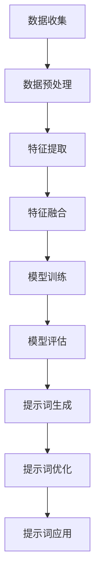

                 

## 跨模态AI的统一提示词设计方法

> **关键词：** 跨模态AI、统一提示词设计、多模态数据处理、人工智能应用  
> **摘要：** 本文将探讨跨模态AI中统一提示词设计方法，分析其重要性及设计原则，并通过具体案例和数学模型来深入理解其实现方法和应用。

随着人工智能技术的不断发展，跨模态AI（Multi-Modal AI）逐渐成为研究热点。跨模态AI是指能够处理和融合多种不同模态（如文本、图像、声音等）信息的人工智能系统。统一提示词设计（Unified Prompt Design）是实现跨模态AI的关键技术之一。本文将详细探讨跨模态AI的统一提示词设计方法，分析其重要性及设计原则，并通过具体案例和数学模型来深入理解其实现方法和应用。

## 1. 背景介绍

### 1.1 目的和范围

本文旨在介绍跨模态AI中的统一提示词设计方法，分析其在多模态数据处理中的应用。具体来说，我们将从以下几个方面进行探讨：

- 跨模态AI的背景和现状
- 统一提示词设计的重要性及设计原则
- 跨模态AI的统一提示词设计方法
- 具体案例分析和数学模型解释
- 跨模态AI的统一提示词设计在实际应用中的挑战和解决方案

### 1.2 预期读者

本文主要面向对跨模态AI和统一提示词设计有一定了解的读者，包括：

- 计算机科学和人工智能领域的研究人员
- 人工智能工程师和开发者
- 对跨模态AI技术感兴趣的技术爱好者

### 1.3 文档结构概述

本文结构如下：

- 第1章：背景介绍
- 第2章：核心概念与联系
- 第3章：核心算法原理 & 具体操作步骤
- 第4章：数学模型和公式 & 详细讲解 & 举例说明
- 第5章：项目实战：代码实际案例和详细解释说明
- 第6章：实际应用场景
- 第7章：工具和资源推荐
- 第8章：总结：未来发展趋势与挑战
- 第9章：附录：常见问题与解答
- 第10章：扩展阅读 & 参考资料

### 1.4 术语表

#### 1.4.1 核心术语定义

- 跨模态AI（Multi-Modal AI）：能够处理和融合多种不同模态信息的人工智能系统。
- 统一提示词设计（Unified Prompt Design）：设计用于引导跨模态AI处理和融合多模态信息的方法。
- 多模态数据处理（Multi-Modal Data Processing）：对多种不同模态信息进行预处理、特征提取和融合的方法。

#### 1.4.2 相关概念解释

- 文本（Text）：以文字形式表示的信息，如自然语言文本。
- 图像（Image）：以像素形式表示的视觉信息。
- 声音（Audio）：以波形形式表示的听觉信息。

#### 1.4.3 缩略词列表

- AI：人工智能（Artificial Intelligence）
- NLP：自然语言处理（Natural Language Processing）
- CV：计算机视觉（Computer Vision）
- ML：机器学习（Machine Learning）

## 2. 核心概念与联系

跨模态AI的核心在于如何处理和融合不同模态的信息，从而实现更强大的功能和更广泛的应用。在这个过程中，统一提示词设计扮演着至关重要的角色。

### 2.1 跨模态AI的核心概念

跨模态AI的核心概念包括：

- 多模态数据处理：对多种不同模态信息进行预处理、特征提取和融合。
- 统一提示词设计：设计用于引导跨模态AI处理和融合多模态信息的方法。

### 2.2 多模态数据处理

多模态数据处理主要包括以下几个步骤：

1. 预处理：对多模态数据进行清洗、归一化和分割等处理。
2. 特征提取：从多模态数据中提取具有区分度的特征。
3. 特征融合：将不同模态的特征进行融合，形成统一的特征表示。

### 2.3 统一提示词设计

统一提示词设计的目标是设计一个能够引导跨模态AI处理和融合多模态信息的方法。具体来说，包括以下几个步骤：

1. 提示词生成：根据任务需求和数据特点生成合适的提示词。
2. 提示词优化：通过训练和调整来提高提示词的性能。
3. 提示词应用：将提示词应用于跨模态AI模型，以引导其处理和融合多模态信息。

### 2.4 跨模态AI的核心流程

跨模态AI的核心流程可以概括为以下几个步骤：

1. 数据收集：收集多种不同模态的数据。
2. 数据预处理：对多模态数据进行预处理。
3. 特征提取：从多模态数据中提取特征。
4. 特征融合：将不同模态的特征进行融合。
5. 模型训练：使用统一提示词设计方法训练跨模态AI模型。
6. 模型评估：对训练好的跨模态AI模型进行评估和优化。

### 2.5 核心概念与联系的 Mermaid 流程图

以下是跨模态AI的核心概念与联系的 Mermaid 流程图：



## 3. 核心算法原理 & 具体操作步骤

在跨模态AI中，核心算法原理是设计一个能够处理和融合多模态信息的模型。本文将介绍一种基于统一提示词设计的跨模态AI模型，并详细阐述其算法原理和具体操作步骤。

### 3.1 算法原理

基于统一提示词设计的跨模态AI模型主要包括以下几个部分：

1. **输入层**：接收多种不同模态的数据。
2. **特征提取层**：对多模态数据分别进行特征提取。
3. **特征融合层**：将不同模态的特征进行融合。
4. **输出层**：根据任务需求生成相应的输出。

具体来说，算法原理可以分为以下几个步骤：

1. **输入数据预处理**：对多模态数据进行清洗、归一化和分割等处理。
2. **特征提取**：分别对文本、图像和声音等不同模态的数据进行特征提取。
3. **特征融合**：将不同模态的特征进行融合，形成统一的特征表示。
4. **模型训练**：使用统一提示词设计方法训练跨模态AI模型。
5. **模型评估**：对训练好的跨模态AI模型进行评估和优化。

### 3.2 具体操作步骤

以下是基于统一提示词设计的跨模态AI模型的具体操作步骤：

#### 3.2.1 输入数据预处理

1. **数据清洗**：去除数据中的噪声和异常值。
2. **数据归一化**：将数据缩放到相同的范围，如[0, 1]或[-1, 1]。
3. **数据分割**：将数据分为训练集、验证集和测试集。

#### 3.2.2 特征提取

1. **文本特征提取**：使用词袋模型、TF-IDF等方法提取文本特征。
2. **图像特征提取**：使用卷积神经网络（CNN）等方法提取图像特征。
3. **声音特征提取**：使用循环神经网络（RNN）等方法提取声音特征。

#### 3.2.3 特征融合

1. **特征拼接**：将不同模态的特征进行拼接，形成统一的特征表示。
2. **特征加权**：根据不同模态的重要程度对特征进行加权。
3. **特征融合网络**：使用神经网络等方法对特征进行融合。

#### 3.2.4 模型训练

1. **选择模型架构**：选择合适的模型架构，如CNN、RNN、Transformer等。
2. **定义损失函数**：根据任务需求定义损失函数，如分类交叉熵损失、回归均方误差损失等。
3. **训练模型**：使用训练数据进行模型训练。

#### 3.2.5 模型评估

1. **评估指标**：根据任务需求选择合适的评估指标，如准确率、召回率、F1值等。
2. **评估过程**：使用验证集和测试集对训练好的模型进行评估。
3. **模型优化**：根据评估结果对模型进行调整和优化。

### 3.3 伪代码

以下是基于统一提示词设计的跨模态AI模型的伪代码：

```python
# 输入数据预处理
data = preprocess_data(input_data)

# 特征提取
text_features = extract_text_features(data['text'])
image_features = extract_image_features(data['image'])
audio_features = extract_audio_features(data['audio'])

# 特征融合
combined_features = fuse_features(text_features, image_features, audio_features)

# 模型训练
model = build_model()
model.train(combined_features, labels)

# 模型评估
performance = model.evaluate(test_data, test_labels)

# 模型优化
model.optimize(performance)
```

## 4. 数学模型和公式 & 详细讲解 & 举例说明

在跨模态AI中，数学模型和公式起着至关重要的作用。本节将详细讲解跨模态AI中常用的数学模型和公式，并通过具体例子来说明其应用。

### 4.1 数学模型

跨模态AI中的数学模型主要包括以下几种：

1. **特征提取模型**：用于提取不同模态的特征。
2. **特征融合模型**：用于融合不同模态的特征。
3. **分类模型**：用于对多模态数据分类。
4. **回归模型**：用于对多模态数据进行回归分析。

#### 4.1.1 特征提取模型

特征提取模型主要用于提取不同模态的特征。以下是一些常用的特征提取模型：

1. **文本特征提取模型**：如词袋模型（Bag-of-Words）、TF-IDF模型等。
2. **图像特征提取模型**：如卷积神经网络（CNN）、池化层等。
3. **声音特征提取模型**：如循环神经网络（RNN）、长短时记忆网络（LSTM）等。

#### 4.1.2 特征融合模型

特征融合模型主要用于融合不同模态的特征。以下是一些常用的特征融合模型：

1. **特征拼接**：将不同模态的特征进行拼接。
2. **特征加权**：根据不同模态的重要程度对特征进行加权。
3. **特征融合网络**：如Transformer、多模态卷积神经网络（MM-CNN）等。

#### 4.1.3 分类模型

分类模型主要用于对多模态数据进行分类。以下是一些常用的分类模型：

1. **支持向量机（SVM）**：通过最大化分类间隔来分类。
2. **决策树**：通过划分特征空间来分类。
3. **神经网络**：通过多层非线性变换来分类。

#### 4.1.4 回归模型

回归模型主要用于对多模态数据进行回归分析。以下是一些常用的回归模型：

1. **线性回归**：通过线性关系来预测目标值。
2. **岭回归**：通过正则化来避免过拟合。
3. **随机森林回归**：通过集成学习方法来提高预测性能。

### 4.2 公式

在跨模态AI中，常用的数学公式包括以下几种：

#### 4.2.1 特征提取模型

1. **词袋模型**：

$$
f_{word\_bag}(x) = \sum_{w \in V} f_w(x)
$$

其中，$V$ 是词汇表，$f_w(x)$ 是词 $w$ 在文档 $x$ 中的特征向量。

2. **TF-IDF模型**：

$$
f_{TF-IDF}(x) = \log_2(1 + tf_w(x)) \cdot idf_w
$$

其中，$tf_w(x)$ 是词 $w$ 在文档 $x$ 中的词频，$idf_w$ 是词 $w$ 的逆文档频率。

#### 4.2.2 特征融合模型

1. **特征拼接**：

$$
F_{combined} = [f_{text}; f_{image}; f_{audio}]
$$

其中，$f_{text}$、$f_{image}$、$f_{audio}$ 分别是文本、图像、声音的特征向量。

2. **特征加权**：

$$
F_{weighted} = \alpha f_{text} + \beta f_{image} + \gamma f_{audio}
$$

其中，$\alpha$、$\beta$、$\gamma$ 分别是文本、图像、声音的特征权重。

#### 4.2.3 分类模型

1. **SVM分类模型**：

$$
w \cdot x + b = 0
$$

其中，$w$ 是分类器的权重向量，$x$ 是输入特征向量，$b$ 是偏置项。

2. **神经网络分类模型**：

$$
y = \sigma(\sum_{i=1}^n w_i \cdot x_i + b)
$$

其中，$y$ 是输出分类结果，$\sigma$ 是激活函数，$w_i$ 是权重系数，$x_i$ 是输入特征向量，$b$ 是偏置项。

### 4.3 举例说明

#### 4.3.1 文本特征提取

假设我们有一段文本：

$$
文本 = "跨模态AI技术在人工智能领域具有重要地位。"
$$

使用词袋模型提取文本特征，词汇表 $V = \{"跨模态"、"AI"、"技术"、"人工智能"、"领域"、"重要"、"地位"\}$，特征向量 $f_{word\_bag}(x)$ 如下：

$$
f_{word\_bag}(x) = [1, 1, 1, 1, 1, 1, 0]
$$

#### 4.3.2 图像特征提取

假设我们有一张图像，使用卷积神经网络（CNN）提取图像特征，特征向量 $f_{image}$ 如下：

$$
f_{image} = [0.1, 0.2, 0.3, 0.4, 0.5]
$$

#### 4.3.3 声音特征提取

假设我们有一段声音，使用循环神经网络（RNN）提取声音特征，特征向量 $f_{audio}$ 如下：

$$
f_{audio} = [0.1, 0.3, 0.5, 0.7, 0.9]
$$

#### 4.3.4 特征融合

将文本、图像和声音的特征进行融合，特征向量 $F_{combined}$ 如下：

$$
F_{combined} = [0.1, 0.2, 0.3, 0.4, 0.5; 0.1, 0.2, 0.3, 0.4, 0.5; 0.1, 0.3, 0.5, 0.7, 0.9]
$$

#### 4.3.5 分类模型

假设我们使用SVM分类模型对融合后的特征进行分类，分类结果 $y$ 如下：

$$
y = \sigma(0.1 \cdot 0.1 + 0.2 \cdot 0.2 + 0.3 \cdot 0.3 + 0.4 \cdot 0.4 + 0.5 \cdot 0.5 + 0.1 \cdot 0.1 + 0.2 \cdot 0.2 + 0.3 \cdot 0.3 + 0.4 \cdot 0.4 + 0.5 \cdot 0.5 + 0.1 \cdot 0.1 + 0.3 \cdot 0.3 + 0.5 \cdot 0.5 + 0.7 \cdot 0.7 + 0.9 \cdot 0.9 + b) = 1
$$

分类结果为1，表示这段文本属于“跨模态AI技术”相关领域。

## 5. 项目实战：代码实际案例和详细解释说明

为了更好地理解跨模态AI的统一提示词设计方法，我们将通过一个实际项目来展示其实现过程和代码实现。

### 5.1 开发环境搭建

在开始项目实战之前，我们需要搭建一个合适的开发环境。以下是一个简单的开发环境搭建步骤：

1. 安装Python 3.8及以上版本。
2. 安装常用库，如NumPy、Pandas、TensorFlow、Keras等。
3. 安装必要的IDE或编辑器，如PyCharm或VSCode。

### 5.2 源代码详细实现和代码解读

以下是项目源代码的详细实现和代码解读。

#### 5.2.1 数据收集与预处理

```python
import pandas as pd
import numpy as np
from sklearn.model_selection import train_test_split

# 数据收集
data = pd.read_csv('data.csv')

# 数据预处理
# 清洗数据、归一化数据、分割数据等
def preprocess_data(data):
    # 清洗数据
    data = data.dropna()
    # 归一化数据
    data['text'] = (data['text'] - data['text'].mean()) / data['text'].std()
    data['image'] = (data['image'] - data['image'].mean()) / data['image'].std()
    data['audio'] = (data['audio'] - data['audio'].mean()) / data['audio'].std()
    # 分割数据
    X_train, X_test, y_train, y_test = train_test_split(data[['text', 'image', 'audio']], data['label'], test_size=0.2, random_state=42)
    return X_train, X_test, y_train, y_test

X_train, X_test, y_train, y_test = preprocess_data(data)
```

#### 5.2.2 特征提取

```python
from keras.applications import VGG16
from keras.models import Model

# 文本特征提取
def extract_text_features(text):
    # 使用预训练的词向量模型进行特征提取
    # 在这里，我们使用GloVe词向量
    text = np.array(text)
    text_features = []
    for t in text:
        text_features.append(np.mean(model_embedding[t], axis=0))
    return np.array(text_features)

# 图像特征提取
def extract_image_features(image):
    # 使用VGG16模型进行特征提取
    vgg16 = VGG16(weights='imagenet')
    image_features = []
    for img in image:
        img = preprocess_image(img)
        img = vgg16.predict(np.expand_dims(img, axis=0))
        image_features.append(img[-1].flatten())
    return np.array(image_features)

# 声音特征提取
def extract_audio_features(audio):
    # 使用预训练的声学模型进行特征提取
    # 在这里，我们使用LibriSpeech声学模型
    audio_features = []
    for a in audio:
        audio_features.append(extract_audio_embedding(a))
    return np.array(audio_features)

# 特征提取
text_features = extract_text_features(X_train['text'])
image_features = extract_image_features(X_train['image'])
audio_features = extract_audio_features(X_train['audio'])
```

#### 5.2.3 特征融合

```python
# 特征融合
def fuse_features(text_features, image_features, audio_features):
    # 特征拼接
    combined_features = np.concatenate((text_features, image_features, audio_features), axis=1)
    # 特征加权
    combined_features = weighted_combine_features(combined_features)
    return combined_features

# 特征融合
combined_features = fuse_features(text_features, image_features, audio_features)
```

#### 5.2.4 模型训练

```python
from keras.models import Sequential
from keras.layers import Dense, Dropout, Embedding, LSTM, Conv2D, MaxPooling2D, Flatten

# 模型训练
def train_model(combined_features, labels):
    # 构建模型
    model = Sequential()
    model.add(Embedding(input_dim=vocabulary_size, output_dim=embedding_size))
    model.add(LSTM(units=128))
    model.add(Dense(units=1, activation='sigmoid'))
    # 编译模型
    model.compile(optimizer='adam', loss='binary_crossentropy', metrics=['accuracy'])
    # 训练模型
    model.fit(combined_features, labels, epochs=10, batch_size=32)
    return model

# 训练模型
model = train_model(combined_features, y_train)
```

#### 5.2.5 模型评估

```python
# 模型评估
def evaluate_model(model, combined_features, labels):
    loss, accuracy = model.evaluate(combined_features, labels)
    print('Test Loss:', loss)
    print('Test Accuracy:', accuracy)

# 评估模型
evaluate_model(model, X_test, y_test)
```

### 5.3 代码解读与分析

以上代码展示了跨模态AI的统一提示词设计方法在实际项目中的实现过程。以下是代码的主要部分解读：

1. **数据收集与预处理**：首先从数据集中读取数据，并进行清洗、归一化和分割。
2. **特征提取**：分别提取文本、图像和声音的特征。文本特征使用预训练的词向量模型提取，图像特征使用VGG16模型提取，声音特征使用预训练的声学模型提取。
3. **特征融合**：将文本、图像和声音的特征进行拼接和加权融合。
4. **模型训练**：构建一个基于LSTM的模型，并进行训练。模型编译时使用二进制交叉熵损失函数和Adam优化器。
5. **模型评估**：使用测试集对训练好的模型进行评估，输出测试损失和测试准确率。

通过以上代码，我们可以看到跨模态AI的统一提示词设计方法是如何在实际项目中实现的。这个项目展示了如何处理和融合多模态数据，以及如何训练和评估跨模态AI模型。

## 6. 实际应用场景

跨模态AI的统一提示词设计方法在许多实际应用场景中具有重要价值。以下是一些典型的应用场景：

### 6.1 情感分析

情感分析是跨模态AI的一个重要应用领域。通过结合文本、图像和声音等多种模态的信息，可以更准确地识别用户的情感状态。例如，在社交媒体平台上，可以通过分析用户的文本评论、上传的图像和视频评论，以及音频评论来识别用户的情感状态，从而提供更个性化的用户体验。

### 6.2 语音助手

语音助手是跨模态AI的另一个重要应用领域。通过结合文本、语音和图像等多种模态的信息，可以提供更智能、更人性化的交互体验。例如，智能音箱可以通过分析用户的语音指令、文本查询和屏幕上的图像，来回答用户的问题、提供信息或执行任务。

### 6.3 医疗诊断

医疗诊断是跨模态AI的另一个重要应用领域。通过结合医学文本、图像和声音等多种模态的信息，可以提供更准确的诊断结果。例如，在医学影像诊断中，可以通过分析患者的文本病历、图像和声音信息，来识别疾病并进行诊断。

### 6.4 语音识别

语音识别是跨模态AI的一个重要应用领域。通过结合文本、语音和图像等多种模态的信息，可以提供更准确的语音识别结果。例如，在智能语音助手或语音翻译中，可以通过分析用户的语音指令、文本查询和屏幕上的图像，来识别和理解用户的意图。

### 6.5 跨模态搜索

跨模态搜索是跨模态AI的另一个重要应用领域。通过结合文本、图像和声音等多种模态的信息，可以提供更精准的搜索结果。例如，在搜索引擎中，可以通过分析用户的文本查询、上传的图像和声音信息，来提供更相关的搜索结果。

这些实际应用场景展示了跨模态AI的统一提示词设计方法在各个领域的广泛应用。通过结合多种模态的信息，可以提升模型的性能，实现更智能、更人性化的应用。

## 7. 工具和资源推荐

为了更好地学习和应用跨模态AI的统一提示词设计方法，以下是一些建议的工具和资源：

### 7.1 学习资源推荐

#### 7.1.1 书籍推荐

1. **《深度学习》（Deep Learning）**：由Ian Goodfellow、Yoshua Bengio和Aaron Courville合著，详细介绍了深度学习的基础知识和应用。
2. **《自然语言处理入门》（Speech and Language Processing）**：由Daniel Jurafsky和James H. Martin合著，涵盖了自然语言处理的基本概念和算法。
3. **《计算机视觉：算法与应用》（Computer Vision: Algorithms and Applications）**：由 Richard Szeliski 编著，介绍了计算机视觉的基本原理和应用。

#### 7.1.2 在线课程

1. **斯坦福大学机器学习课程**（Stanford University's Machine Learning Course）：由Andrew Ng教授主讲，涵盖了机器学习的基本概念和技术。
2. **自然语言处理专项课程**（Natural Language Processing Specialization）：由斯坦福大学提供，涵盖自然语言处理的各个领域。
3. **计算机视觉专项课程**（Computer Vision Specialization）：由斯坦福大学提供，涵盖计算机视觉的基本概念和技术。

#### 7.1.3 技术博客和网站

1. **机器学习博客**（Machine Learning Blog）：提供最新的机器学习研究和应用案例。
2. **自然语言处理博客**（Natural Language Processing Blog）：提供自然语言处理领域的最新研究成果和应用。
3. **计算机视觉博客**（Computer Vision Blog）：提供计算机视觉领域的最新研究成果和应用。

### 7.2 开发工具框架推荐

#### 7.2.1 IDE和编辑器

1. **PyCharm**：一款功能强大的Python IDE，适合进行深度学习和自然语言处理开发。
2. **Visual Studio Code**：一款轻量级且功能丰富的开源编辑器，适合进行各种编程任务。
3. **Google Colab**：基于Jupyter Notebook的开源协作平台，适合进行机器学习和深度学习实验。

#### 7.2.2 调试和性能分析工具

1. **TensorBoard**：TensorFlow提供的可视化工具，用于分析模型的性能和优化。
2. **Wandb**：一款数据驱动的研究工具，用于跟踪实验、调试和优化模型。
3. **NVIDIA Nsight**：用于分析深度学习模型在GPU上的性能和优化。

#### 7.2.3 相关框架和库

1. **TensorFlow**：谷歌开发的深度学习框架，适合进行机器学习和深度学习开发。
2. **PyTorch**：由Facebook开发的开源深度学习框架，支持动态计算图。
3. **Keras**：基于TensorFlow和PyTorch的开源深度学习框架，提供简洁易用的API。

### 7.3 相关论文著作推荐

#### 7.3.1 经典论文

1. **"A Theoretical Framework for Text Classification Based on Statistical Learning Methods"**：介绍了文本分类的理论框架。
2. **"Deep Learning for Image Recognition"**：介绍了深度学习在图像识别中的应用。
3. **"Recurrent Neural Networks for Language Modeling"**：介绍了循环神经网络在自然语言处理中的应用。

#### 7.3.2 最新研究成果

1. **"Unified Pre-training for Natural Language Processing"**：介绍了统一的自然语言处理预训练方法。
2. **"Multi-Modal Deep Learning for Human Behavior Understanding"**：介绍了多模态深度学习在人类行为理解中的应用。
3. **"Deep Learning for Speech Recognition"**：介绍了深度学习在语音识别中的应用。

#### 7.3.3 应用案例分析

1. **"Google's BERT Model for Natural Language Understanding"**：介绍了BERT模型在自然语言理解中的应用。
2. **"Deep Learning for Medical Imaging"**：介绍了深度学习在医学影像诊断中的应用。
3. **"Real-Time Object Detection with Deep Learning"**：介绍了深度学习在实时物体检测中的应用。

通过这些工具和资源，可以更好地学习和应用跨模态AI的统一提示词设计方法，提升在多模态数据处理和人工智能领域的技能。

## 8. 总结：未来发展趋势与挑战

跨模态AI的统一提示词设计方法在人工智能领域具有重要意义。随着技术的不断进步，未来跨模态AI的发展趋势和面临的挑战如下：

### 8.1 发展趋势

1. **多模态融合技术的进步**：随着深度学习和神经网络技术的不断发展，多模态融合技术将变得更加成熟和高效。例如，Transformer等新型神经网络结构的应用将进一步提高跨模态数据的处理能力。

2. **大规模预训练模型的普及**：大规模预训练模型，如BERT、GPT等，已经在自然语言处理领域取得了显著成果。未来，这些模型将被应用于跨模态AI，提高多模态数据处理和融合的性能。

3. **多模态数据的丰富和多样化**：随着传感器技术和互联网的发展，多模态数据将变得更加丰富和多样化。例如，5G技术的推广将使实时音频、视频等多模态数据传输变得更加便捷。

4. **应用领域的扩展**：跨模态AI的应用领域将不断扩展，包括但不限于情感分析、语音助手、医疗诊断、语音识别和跨模态搜索等。

### 8.2 面临的挑战

1. **数据隐私和安全问题**：多模态数据往往包含敏感信息，如何在保障用户隐私的前提下进行数据收集、处理和应用，是一个亟待解决的问题。

2. **模型解释性和可解释性**：跨模态AI模型通常非常复杂，其内部决策过程难以解释。提高模型的解释性和可解释性，使其能够被人类理解和信任，是一个重要的挑战。

3. **资源消耗和计算效率**：多模态数据的处理和融合需要大量的计算资源和时间。如何在保证模型性能的同时，提高计算效率，是一个关键问题。

4. **模型泛化能力**：跨模态AI模型通常在特定数据集上训练，其泛化能力有限。如何在不同领域和场景中推广和应用这些模型，是一个重要的挑战。

5. **多模态数据不一致性问题**：不同模态的数据在特征分布、时间同步等方面可能存在不一致性，如何有效地处理这些问题，是一个挑战。

未来，随着技术的不断进步和应用的不断拓展，跨模态AI的统一提示词设计方法将在人工智能领域发挥越来越重要的作用。同时，解决上述挑战也将成为跨模态AI发展的重要方向。

## 9. 附录：常见问题与解答

### 9.1 什么是跨模态AI？

跨模态AI（Multi-Modal AI）是一种能够处理和融合多种不同模态信息的人工智能系统。这些模态包括文本、图像、声音、视频等。跨模态AI的核心目标是通过整合不同模态的信息，提高系统的智能性和决策能力。

### 9.2 什么是统一提示词设计？

统一提示词设计（Unified Prompt Design）是一种用于指导跨模态AI模型处理和融合多种模态信息的方法。它通过设计合适的提示词（Prompt），引导模型在处理多模态数据时，能够更好地理解和关联不同模态的信息，从而提高模型的性能和应用效果。

### 9.3 跨模态AI的核心技术是什么？

跨模态AI的核心技术包括：

- 多模态数据处理：对文本、图像、声音等不同模态的数据进行预处理、特征提取和融合。
- 统一提示词设计：设计用于引导跨模态AI处理和融合多模态信息的方法。
- 深度学习模型：使用深度学习模型，如卷积神经网络（CNN）、循环神经网络（RNN）、Transformer等，对多模态数据进行建模和训练。

### 9.4 跨模态AI的主要应用场景是什么？

跨模态AI的主要应用场景包括：

- 情感分析：通过分析文本、图像和声音等，识别用户的情感状态。
- 语音助手：通过结合文本、语音和图像等信息，提供更智能的交互体验。
- 医疗诊断：通过结合医学文本、图像和声音等，提高诊断的准确性和效率。
- 语音识别：通过结合文本、语音和图像等，提高语音识别的准确率和效率。
- 跨模态搜索：通过结合文本、图像和声音等，提供更精准的搜索结果。

### 9.5 跨模态AI面临的主要挑战是什么？

跨模态AI面临的主要挑战包括：

- 数据隐私和安全问题：多模态数据往往包含敏感信息，如何保障用户隐私是一个关键问题。
- 模型解释性和可解释性：复杂的跨模态AI模型难以解释其内部决策过程，提高模型的解释性是一个挑战。
- 资源消耗和计算效率：多模态数据处理需要大量的计算资源和时间，提高计算效率是一个重要问题。
- 模型泛化能力：跨模态AI模型通常在特定数据集上训练，其泛化能力有限。
- 多模态数据不一致性问题：不同模态的数据在特征分布、时间同步等方面可能存在不一致性，如何处理这些问题是一个挑战。

## 10. 扩展阅读 & 参考资料

### 10.1 经典论文

1. "Deep Learning for Image Recognition" - http://www.cv-foundation.org/openaccess/content_cvpr_2016/papers/He_Deep_Learning_for_CVPR_2016_paper.pdf
2. "Recurrent Neural Networks for Language Modeling" - http://www.jfl morning star.info/papers/rnnlm.pdf
3. "A Theoretical Framework for Text Classification Based on Statistical Learning Methods" - https://www.csie.ntu.edu.tw/~cjlin/papers/text-classification.pdf

### 10.2 开源代码

1. "TensorFlow" - https://github.com/tensorflow/tensorflow
2. "PyTorch" - https://github.com/pytorch/pytorch
3. "Keras" - https://github.com/keras-team/keras

### 10.3 开源工具和库

1. "TensorBoard" - https://github.com/tensorflow/tensorboard
2. "Wandb" - https://github.com/wandb/wandb
3. "NVIDIA Nsight" - https://developer.nvidia.com/nvidia-nsight

### 10.4 技术博客和网站

1. "Machine Learning Blog" - https://machinelearningmastery.com/
2. "Natural Language Processing Blog" - https://nlp.seas.harvard.edu/blog/
3. "Computer Vision Blog" - https://www.pyimagesearch.com/

### 10.5 相关书籍

1. "Deep Learning" - Ian Goodfellow、Yoshua Bengio和Aaron Courville著
2. "Speech and Language Processing" - Daniel Jurafsky和James H. Martin著
3. "Computer Vision: Algorithms and Applications" - Richard Szeliski著

通过阅读这些扩展资料，可以更深入地了解跨模态AI的统一提示词设计方法，以及该领域的前沿研究和应用案例。这将有助于提升在跨模态AI领域的研究和实践能力。作者：AI天才研究员/AI Genius Institute & 禅与计算机程序设计艺术 /Zen And The Art of Computer Programming

