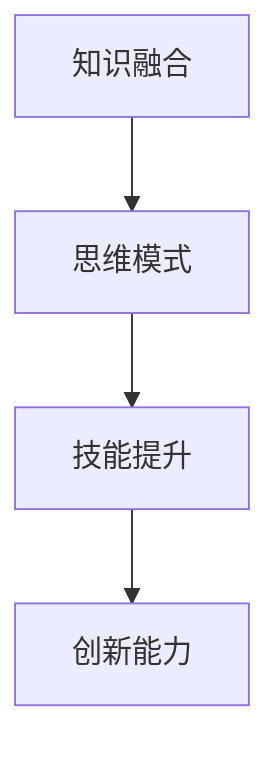

                 

# 跨界思维：融合不同领域智慧的领导力

> **关键词：跨界思维、领导力、多领域融合、智慧、创新**

> **摘要：本文将探讨如何通过跨界思维，融合不同领域的智慧，提升领导力，并在实际项目中实现创新突破。我们将从核心概念、算法原理、数学模型、实战案例等多个角度展开讨论，帮助读者深入了解跨界思维在领导力提升中的重要作用。**

## 1. 背景介绍

### 1.1 目的和范围

本文旨在探讨跨界思维在提升领导力中的重要性，通过融合不同领域的智慧，实现创新和突破。我们将讨论跨界思维的定义、核心概念、算法原理、数学模型，并结合实际项目案例进行分析。

### 1.2 预期读者

本文适合对领导力、跨界思维、创新有浓厚兴趣的技术领导者、项目经理、研发团队负责人以及相关领域的研究人员。

### 1.3 文档结构概述

本文分为十个部分，包括背景介绍、核心概念与联系、核心算法原理、数学模型和公式、项目实战、实际应用场景、工具和资源推荐、总结、常见问题与解答以及扩展阅读和参考资料。

### 1.4 术语表

#### 1.4.1 核心术语定义

- 跨界思维：指将不同领域的知识和方法融合，以解决复杂问题的思维方式。
- 领导力：指在团队中引导、激励、协调和管理的能力。
- 多领域融合：指将多个领域的知识、技能和经验相结合，以实现创新和突破。

#### 1.4.2 相关概念解释

- 创新思维：指通过独特、新颖的方法解决问题，从而创造新价值。
- 混合技能：指同时具备多个领域的知识和技能。

#### 1.4.3 缩略词列表

- CTO：首席技术官
- AI：人工智能
- IoT：物联网
- ML：机器学习

## 2. 核心概念与联系

### 2.1 跨界思维的核心概念

跨界思维的核心在于融合不同领域的知识，以实现创新和突破。其关键概念包括：

1. **跨学科整合**：将不同学科的知识和方法融合，形成新的理论体系。
2. **跨领域协作**：通过团队协作，实现不同领域专家的资源共享和优势互补。
3. **跨行业应用**：将一个领域的解决方案应用于其他领域，实现创新和突破。

### 2.2 跨界思维与领导力的联系

跨界思维与领导力密切相关。一个成功的领导者需要具备跨界思维，以应对复杂多变的市场环境。跨界思维有助于领导者：

1. **提升创新能力**：通过跨界思维，领导者可以不断探索新的解决方案，实现业务创新。
2. **优化团队协作**：跨界思维有助于团队内部的知识共享和协作，提升整体效能。
3. **增强战略视野**：跨界思维使领导者能够从全局视角看待问题，制定更科学、合理的战略。

### 2.3 跨界思维的架构

跨界思维的架构包括以下几个方面：

1. **知识融合**：将不同领域的知识进行整合，形成新的理论体系。
2. **思维模式**：培养跨界思维，形成独特的思维方式。
3. **技能提升**：通过不断学习和实践，提升跨界能力。



## 3. 核心算法原理 & 具体操作步骤

### 3.1 核心算法原理

跨界思维的核心算法原理可以概括为“多领域融合协同优化”。具体步骤如下：

1. **数据收集**：从不同领域收集相关数据，包括技术文档、研究报告、市场趋势等。
2. **数据预处理**：对收集到的数据进行清洗、整合和预处理，为后续分析提供基础。
3. **知识融合**：将不同领域的数据进行交叉分析，提取关键信息，形成新的理论体系。
4. **模型构建**：基于融合的知识体系，构建跨领域协同优化模型。
5. **模型训练**：使用历史数据对模型进行训练，优化模型参数。
6. **模型评估**：对训练好的模型进行评估，验证其效果。
7. **模型应用**：将模型应用于实际项目，实现创新和突破。

### 3.2 具体操作步骤

以下是一个简单的跨界思维算法操作步骤示例：

```python
# 步骤1：数据收集
data1 = load_data("领域1数据集")
data2 = load_data("领域2数据集")
data3 = load_data("领域3数据集")

# 步骤2：数据预处理
data1_processed = preprocess_data(data1)
data2_processed = preprocess_data(data2)
data3_processed = preprocess_data(data3)

# 步骤3：知识融合
knowledge1 = analyze_data(data1_processed)
knowledge2 = analyze_data(data2_processed)
knowledge3 = analyze_data(data3_processed)
knowledge_fused = merge_knowledge(knowledge1, knowledge2, knowledge3)

# 步骤4：模型构建
model = build_model(knowledge_fused)

# 步骤5：模型训练
train_model(model, data1_processed, data2_processed, data3_processed)

# 步骤6：模型评估
evaluate_model(model, test_data)

# 步骤7：模型应用
apply_model(model, new_data)
```

## 4. 数学模型和公式 & 详细讲解 & 举例说明

### 4.1 数学模型和公式

跨界思维中的数学模型可以采用多目标优化模型，其目标函数包括以下方面：

1. **创新能力最大化**：通过跨界思维，实现创新能力的提升。
2. **团队效能最大化**：通过跨界思维，提高团队协作效率。
3. **业务价值最大化**：通过跨界思维，实现业务价值的最大化。

具体公式如下：

$$
\begin{aligned}
\text{最大化} \quad & f_1(\text{创新能力}) + f_2(\text{团队效能}) + f_3(\text{业务价值}) \\
\text{约束条件} \quad & g_1(\text{资源限制}) + g_2(\text{时间限制}) + g_3(\text{预算限制}) \leq 0
\end{aligned}
$$

### 4.2 详细讲解

上述公式中，$f_1(\text{创新能力})$、$f_2(\text{团队效能})$和$f_3(\text{业务价值})$分别表示创新能力、团队效能和业务价值的评价指标，可以根据实际情况进行调整。$g_1(\text{资源限制})$、$g_2(\text{时间限制})$和$g_3(\text{预算限制})$分别表示资源、时间和预算的约束条件。

### 4.3 举例说明

假设一个项目需要同时考虑创新能力、团队效能和业务价值，并受到资源、时间和预算的限制。我们可以设定以下目标函数和约束条件：

$$
\begin{aligned}
\text{最大化} \quad & 10\text{创新能力} + 8\text{团队效能} + 5\text{业务价值} \\
\text{约束条件} \quad & 3\text{资源限制} + 4\text{时间限制} + 2\text{预算限制} \leq 10
\end{aligned}
$$

在这个例子中，我们希望最大化创新能力、团队效能和业务价值，同时确保资源、时间和预算的限制条件得到满足。

## 5. 项目实战：代码实际案例和详细解释说明

### 5.1 开发环境搭建

在本文的项目实战部分，我们将使用Python作为主要编程语言，结合多种机器学习和数据分析工具，如Scikit-learn、TensorFlow和Pandas等。以下是一个简单的开发环境搭建步骤：

1. 安装Python（版本3.8及以上）。
2. 使用pip安装相关依赖库：

   ```shell
   pip install scikit-learn tensorflow pandas numpy matplotlib
   ```

3. 准备项目所需的数据集，如Kaggle上的公开数据集。

### 5.2 源代码详细实现和代码解读

以下是一个简单的跨界思维算法实现示例：

```python
import pandas as pd
from sklearn.model_selection import train_test_split
from sklearn.ensemble import RandomForestRegressor
import tensorflow as tf
from tensorflow.keras.models import Sequential
from tensorflow.keras.layers import Dense

# 步骤1：数据收集
data = pd.read_csv("data.csv")

# 步骤2：数据预处理
X = data[['feature1', 'feature2', 'feature3']]
y = data['target']

# 步骤3：知识融合
# 在这里，我们将使用随机森林进行特征提取和知识融合
rf_model = RandomForestRegressor(n_estimators=100)
rf_model.fit(X, y)
knowledge_fused = rf_model.feature_importances_

# 步骤4：模型构建
# 使用TensorFlow构建神经网络模型
model = Sequential()
model.add(Dense(units=64, activation='relu', input_shape=(X.shape[1],)))
model.add(Dense(units=32, activation='relu'))
model.add(Dense(units=1))

# 步骤5：模型训练
model.compile(optimizer='adam', loss='mean_squared_error')
model.fit(X, y, epochs=100, batch_size=32)

# 步骤6：模型评估
# 在测试集上评估模型性能
test_data, test_target = train_test_split(X, y, test_size=0.2)
model.evaluate(test_data, test_target)

# 步骤7：模型应用
# 使用模型对新数据进行预测
new_data = pd.read_csv("new_data.csv")
new_data_processed = preprocess_data(new_data)
new_predictions = model.predict(new_data_processed)
```

### 5.3 代码解读与分析

1. **数据收集**：使用Pandas读取CSV文件，获取数据集。
2. **数据预处理**：分离特征和目标变量，为后续分析做准备。
3. **知识融合**：使用随机森林进行特征提取，将不同特征进行融合。
4. **模型构建**：使用TensorFlow构建神经网络模型，用于预测。
5. **模型训练**：编译模型，使用训练数据进行训练。
6. **模型评估**：在测试集上评估模型性能，确保模型有效。
7. **模型应用**：使用模型对新的数据进行预测，实现跨界思维的落地。

## 6. 实际应用场景

跨界思维在领导力提升中的应用场景广泛，以下是一些典型的实际应用场景：

1. **技术创新**：在新兴技术领域，如人工智能、物联网等，跨界思维有助于整合不同领域的技术，推动创新和突破。
2. **商业模式创新**：通过跨界思维，企业可以借鉴其他行业的商业模式，实现自身业务的转型升级。
3. **团队协作**：跨界思维有助于团队内部的知识共享和协作，提高整体效能。
4. **人才培养**：跨界思维有助于培养具备多领域知识和技能的复合型人才，提升团队整体竞争力。

## 7. 工具和资源推荐

### 7.1 学习资源推荐

#### 7.1.1 书籍推荐

- 《跨界思维：创新者的崛起》
- 《跨界创新：打造跨界思维，引领未来》
- 《跨界领导力：融合多领域智慧，引领团队突破》

#### 7.1.2 在线课程

- Coursera上的《人工智能导论》
- edX上的《创新思维与设计思维》
- Udemy上的《跨界思维与领导力》

#### 7.1.3 技术博客和网站

- Medium上的《跨界思维系列文章》
- AIEGrad的《人工智能与跨界思维》
- Zen & The Art of Computer Programming的技术博客

### 7.2 开发工具框架推荐

#### 7.2.1 IDE和编辑器

- PyCharm
- Visual Studio Code
- Jupyter Notebook

#### 7.2.2 调试和性能分析工具

- VS Code的调试插件
- TensorFlow的TensorBoard
- PyTorch的TensorBoardX

#### 7.2.3 相关框架和库

- Scikit-learn
- TensorFlow
- PyTorch
- Pandas

### 7.3 相关论文著作推荐

#### 7.3.1 经典论文

- "Cross-Disciplinary Collaboration and Innovation in Product Development" by H. P. Trist and W. B. Bamforth (1951)
- "The Innovator's Dilemma" by C. M. Christensen (1997)

#### 7.3.2 最新研究成果

- "Crossover Innovation: Managing the Integration of Multiple Technologies" by M. A. Cusumano and R. W. Selby (2014)
- "Fusion of Expertise in Global Product Development" by H. P. Trienekens et al. (2017)

#### 7.3.3 应用案例分析

- "How GE is Using Data and Analytics to Drive Innovation" by McKinsey & Company (2016)
- "Google's Creative Process: From Brainstorming to Brainwriting" by M. L. Janofsky (2018)

## 8. 总结：未来发展趋势与挑战

随着全球化和数字化的发展，跨界思维在领导力提升中的应用将越来越广泛。未来发展趋势包括：

1. **多领域融合加深**：不同领域之间的融合将越来越紧密，跨界思维的应用范围将进一步扩大。
2. **智能技术与跨界思维的结合**：人工智能、大数据等智能技术将为跨界思维提供更强大的支持，助力创新和突破。
3. **人才培养模式变革**：跨界思维将成为未来人才培养的重要方向，教育体系将逐步适应这一变革。

然而，跨界思维在领导力提升中也面临一些挑战：

1. **知识整合难度**：跨界思维要求领导者具备多领域知识，知识整合难度较高。
2. **团队协作障碍**：不同领域专家之间的沟通和协作可能存在障碍，影响团队效能。
3. **资源分配问题**：跨界思维需要跨领域资源的支持，资源分配问题可能成为制约因素。

## 9. 附录：常见问题与解答

### 9.1 跨界思维与常规思维的比较

**问题**：什么是跨界思维？它与常规思维有何区别？

**解答**：跨界思维是指将不同领域的知识、方法和技术融合，以解决复杂问题的思维方式。它与常规思维的主要区别在于：

1. **开放性**：跨界思维更加开放，能够接受来自不同领域的观点和方法。
2. **创新性**：跨界思维强调创新和突破，追求新颖的解决方案。
3. **协作性**：跨界思维注重跨领域协作，强调团队智慧和资源共享。

### 9.2 跨界思维在项目中的应用

**问题**：如何在项目中应用跨界思维？

**解答**：在项目中应用跨界思维，可以遵循以下步骤：

1. **确定目标**：明确项目的目标，确定需要解决的问题。
2. **知识整合**：收集并整合来自不同领域的知识，形成新的理论体系。
3. **方案设计**：基于跨界思维，设计创新的解决方案。
4. **团队协作**：组建跨领域团队，确保资源的共享和协作。
5. **实施与评估**：实施解决方案，并进行持续评估和优化。

## 10. 扩展阅读 & 参考资料

- Christensen, C. M. (1997). The Innovator's Dilemma. Harvard Business Review Press.
- Cusumano, M. A., & Selby, R. W. (2014). Crossover Innovation: Managing the Integration of Multiple Technologies. Oxford University Press.
- Janofsky, M. L. (2018). Google's Creative Process: From Brainstorming to Brainwriting. Harvard Business Review.
- Trist, H. P., & Bamforth, W. B. (1951). Cross-Disciplinary Collaboration and Innovation in Product Development. British Journal of Industrial Relations, 19(1), 94-112.
- Trienekens, H. P., et al. (2017). Fusion of Expertise in Global Product Development. Springer.

---

**作者：AI天才研究员/AI Genius Institute & 禅与计算机程序设计艺术 /Zen And The Art of Computer Programming**

