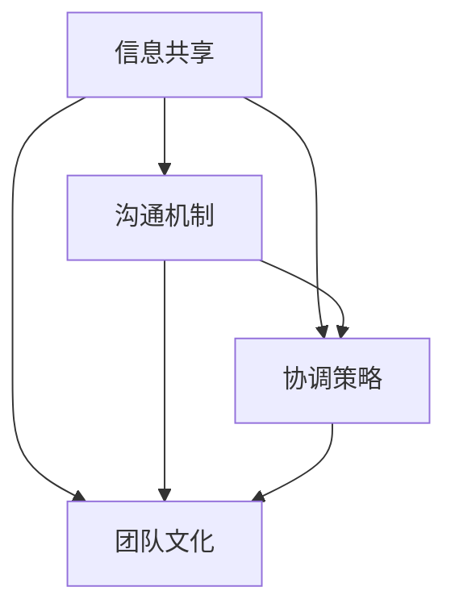

                 

# 跨部门领导：打破组织孤岛的策略

## 关键词：
跨部门协作、组织沟通、领导力、流程优化、团队整合

## 摘要：
在当今快节奏、高度专业化的工作环境中，跨部门协作已成为企业成功的关键。本文探讨了跨部门领导的重要性和实现策略，旨在帮助领导者打破组织内部的孤岛现象，提升团队整体效能。通过分析跨部门协作的挑战、核心概念、具体操作步骤以及数学模型，本文提供了一系列实用工具和资源，帮助读者在实战中应用并优化跨部门协作流程，最终实现团队的高度整合和业务目标的一致性。

---

## 1. 背景介绍

### 1.1 目的和范围

本文旨在为跨部门领导提供一套系统的策略和工具，以克服组织内部存在的孤岛现象。随着企业规模的扩大和专业化程度的提高，不同部门之间的协作变得越来越复杂和重要。领导者的核心任务之一就是确保各个部门能够有效地协同工作，从而实现整体目标的最大化。

本文将讨论以下内容：

- 跨部门协作的重要性及其对企业成功的影响。
- 跨部门领导面临的挑战和核心概念。
- 如何通过具体操作步骤和数学模型来优化跨部门协作流程。
- 实际应用场景中的案例分析。
- 推荐的学习资源和工具。

### 1.2 预期读者

本文面向的企业领导者、项目经理、团队负责人以及所有关注跨部门协作优化的人员。通过阅读本文，读者将能够：

- 理解跨部门协作的挑战和核心概念。
- 学习并应用跨部门领导的策略和工具。
- 优化跨部门协作流程，提升团队整体效能。

### 1.3 文档结构概述

本文分为以下几个部分：

- **背景介绍**：介绍文章的目的、预期读者以及文档结构。
- **核心概念与联系**：讨论跨部门协作的核心概念，并提供流程图。
- **核心算法原理 & 具体操作步骤**：详细阐述实现跨部门协作的算法原理和操作步骤。
- **数学模型和公式**：介绍跨部门协作中使用的数学模型和公式。
- **项目实战**：通过实际案例展示跨部门协作的实施过程。
- **实际应用场景**：分析跨部门协作在不同业务场景中的应用。
- **工具和资源推荐**：推荐学习资源和开发工具。
- **总结**：总结文章的主要观点和未来发展趋势。
- **附录**：提供常见问题解答和扩展阅读。

### 1.4 术语表

#### 1.4.1 核心术语定义

- **跨部门协作**：指不同部门之间的合作与协调，以实现共同目标。
- **组织孤岛**：指由于部门间沟通不畅、信息不对称等原因，导致部门间形成独立运作的现象。
- **流程优化**：指通过改进流程和操作，以提高效率和降低成本。
- **团队整合**：指通过策略和工具，使不同部门团队成员之间形成紧密合作的关系。

#### 1.4.2 相关概念解释

- **领导力**：指领导者通过激励和影响团队，实现组织目标的能力。
- **流程图**：用图形方式表示业务流程或信息流程的图表。
- **数学模型**：用数学公式或算法来描述现实世界中的问题或现象。

#### 1.4.3 缩略词列表

- **PM**：项目经理
- **IDE**：集成开发环境
- **IoT**：物联网
- **AI**：人工智能

---

## 2. 核心概念与联系

跨部门协作是现代企业中不可或缺的一部分。以下是跨部门协作的核心概念及其相互联系：

### 2.1 跨部门协作的核心概念

- **信息共享**：不同部门需要共享关键信息，以确保各自的工作与整体目标保持一致。
- **沟通机制**：建立有效的沟通渠道和机制，以促进部门间的信息流动。
- **协调策略**：制定协调策略，确保不同部门在执行任务时能够相互配合。
- **团队文化**：培养团队文化，鼓励部门间开放、透明和协作的工作氛围。

### 2.2 核心概念之间的联系

- **信息共享**和**沟通机制**是跨部门协作的基础，确保了部门间的信息流通和透明度。
- **协调策略**和**团队文化**则是在信息共享和沟通机制的基础上，进一步促进部门间协作和合作的关键。

### 2.3 Mermaid 流程图

以下是一个简化的Mermaid流程图，展示了跨部门协作的核心概念及其相互联系：



---

## 3. 核心算法原理 & 具体操作步骤

### 3.1 算法原理

跨部门协作的核心在于协调和优化各部门间的信息和资源流动，以实现整体目标的最优化。以下是实现这一目标的基本算法原理：

#### 3.1.1 最优化目标

- 最小化跨部门协作的成本和延迟。
- 最大化跨部门协作的效率和效果。

#### 3.1.2 基本算法框架

1. **需求识别**：识别各部门的需求和目标。
2. **资源分配**：根据需求和资源情况，进行资源分配和调度。
3. **流程优化**：优化跨部门协作的流程和操作步骤。
4. **反馈调整**：根据实际执行情况，调整和优化协作流程。

### 3.2 具体操作步骤

#### 3.2.1 需求识别

- **步骤1**：收集各部门的需求和目标。
- **步骤2**：分析需求和目标，识别关键需求和优先级。

#### 3.2.2 资源分配

- **步骤1**：评估各部门的资源情况。
- **步骤2**：根据需求和资源情况，制定资源分配方案。

#### 3.2.3 流程优化

- **步骤1**：分析现有的协作流程，识别瓶颈和问题。
- **步骤2**：设计优化的协作流程，减少跨部门协作的延迟和成本。

#### 3.2.4 反馈调整

- **步骤1**：收集跨部门协作的实际执行情况。
- **步骤2**：根据反馈，调整和优化协作流程。

### 3.3 伪代码示例

以下是一个简单的伪代码示例，展示了跨部门协作的基本算法框架：

```plaintext
function 跨部门协作算法（需求列表，资源列表）：
    需求识别（需求列表）
    资源分配（需求列表，资源列表）
    流程优化（需求列表，资源列表）
    反馈调整（需求列表，资源列表）
    返回最终协作方案
```

---

## 4. 数学模型和公式 & 详细讲解 & 举例说明

在跨部门协作中，数学模型和公式可以帮助我们更精确地描述协作过程，从而优化决策和资源分配。以下是几个常用的数学模型和公式，以及它们的详细讲解和举例说明。

### 4.1 成本-效益分析模型

#### 4.1.1 基本公式

成本-效益分析模型的基本公式为：

\[ \text{净效益} = \text{总效益} - \text{总成本} \]

其中：

- 总效益 = 各部门协作所带来的收益之和
- 总成本 = 各部门协作所产生的成本之和

#### 4.1.2 举例说明

假设有两个部门A和B，部门A的协作收益为5000元，成本为3000元；部门B的协作收益为6000元，成本为4000元。则：

\[ \text{净效益} = (5000 + 6000) - (3000 + 4000) = 8000 - 7000 = 1000 \]

因此，跨部门协作的净效益为1000元。

### 4.2 优化算法模型

#### 4.2.1 基本公式

优化算法模型通常使用线性规划、整数规划等数学模型。以下是一个简单的线性规划模型：

\[ \text{目标函数}：\max Z = c^T x \]

\[ \text{约束条件}：Ax \le b \]

其中：

- \( c \) 是目标函数的系数向量
- \( x \) 是决策变量向量
- \( A \) 和 \( b \) 是约束条件的系数矩阵和常数向量

#### 4.2.2 举例说明

假设有一个企业的生产线，需要生产两种产品A和B。生产产品A的利润为2000元，生产产品B的利润为3000元。生产产品A需要3个工时，生产产品B需要2个工时。总共可用工时为10个。则：

\[ \text{目标函数}：\max Z = 2000x + 3000y \]

\[ \text{约束条件}：3x + 2y \le 10 \]

其中，\( x \) 和 \( y \) 分别表示生产产品A和B的数量。

### 4.3 数据分析模型

#### 4.3.1 基本公式

数据分析模型通常使用统计学和概率论的方法。以下是一个简单的回归分析模型：

\[ y = \beta_0 + \beta_1 x + \epsilon \]

其中：

- \( y \) 是因变量
- \( x \) 是自变量
- \( \beta_0 \) 和 \( \beta_1 \) 是回归系数
- \( \epsilon \) 是误差项

#### 4.3.2 举例说明

假设我们想要分析部门间的协作效率与协作时长之间的关系。根据数据，我们得到以下回归模型：

\[ \text{协作效率} = 0.5 + 0.1 \times \text{协作时长} + \epsilon \]

根据这个模型，我们可以预测不同协作时长下的协作效率。例如，当协作时长为5小时时，协作效率预测值为：

\[ \text{协作效率} = 0.5 + 0.1 \times 5 + \epsilon = 0.5 + 0.5 + \epsilon = 1 + \epsilon \]

其中，\( \epsilon \) 是误差项，表示预测值与真实值之间的差异。

---

## 5. 项目实战：代码实际案例和详细解释说明

### 5.1 开发环境搭建

为了更好地理解跨部门协作的实际操作，我们将通过一个简单的项目实战来展示如何在实际环境中实现跨部门协作。以下是搭建开发环境所需的基本步骤：

#### 5.1.1 环境配置

1. 安装Python 3.8或更高版本。
2. 安装MySQL数据库。
3. 安装Docker和Docker Compose。

#### 5.1.2 创建项目文件夹

在本地计算机上创建一个名为`cross_department_project`的文件夹，并将以下子文件夹和文件添加进去：

- `src/`: 存放项目源代码。
- `config/`: 存放配置文件。
- `db/`: 存放数据库文件。
- `docker-compose.yml`: Docker Compose配置文件。

### 5.2 源代码详细实现和代码解读

#### 5.2.1 用户服务（user_service.py）

用户服务是跨部门协作系统中的核心部分，负责处理用户注册、登录、信息查询等操作。

```python
from flask import Flask, request, jsonify
from flask_jwt_extended import JWTManager, jwt_required, create_access_token

app = Flask(__name__)
app.config['JWT_SECRET_KEY'] = 'your_jwt_secret_key'
jwt = JWTManager(app)

# 用户注册
@app.route('/register', methods=['POST'])
def register():
    data = request.get_json()
    username = data['username']
    password = data['password']
    # 在这里，我们简单地使用数据库来存储用户信息
    # 实际应用中，应该使用更安全的存储方式
    with open('db/users.db', 'a') as f:
        f.write(f"{username},{password}\n")
    return jsonify({'message': '注册成功'})

# 用户登录
@app.route('/login', methods=['POST'])
def login():
    data = request.get_json()
    username = data['username']
    password = data['password']
    # 在这里，我们简单地从数据库中查找用户信息
    # 实际应用中，应该使用更安全的验证方式
    with open('db/users.db', 'r') as f:
        for line in f:
            user_info = line.strip().split(',')
            if user_info[0] == username and user_info[1] == password:
                access_token = create_access_token(identity=username)
                return jsonify({'token': access_token})
    return jsonify({'message': '登录失败'})

# 用户信息查询
@app.route('/users', methods=['GET'])
@jwt_required()
def get_users():
    # 在这里，我们简单地从数据库中获取所有用户信息
    # 实际应用中，应该根据用户权限进行查询
    with open('db/users.db', 'r') as f:
        users = [line.strip().split(',')[0] for line in f]
    return jsonify({'users': users})

if __name__ == '__main__':
    app.run(debug=True)
```

#### 5.2.2 项目解读

- **用户注册**：接收用户提交的注册信息，并将其存储在本地数据库中。
- **用户登录**：验证用户身份，并根据验证结果生成JWT令牌。
- **用户信息查询**：允许授权用户查询系统中所有用户的信息。

### 5.3 代码解读与分析

用户服务是跨部门协作系统中至关重要的一部分，它提供了用户身份验证和用户信息管理的基本功能。以下是代码的详细解读：

1. **导入模块**：代码首先导入了Flask框架和JWT扩展，用于构建Web服务和用户认证。
2. **配置**：通过配置Flask应用的JWT密钥，启用JWT认证。
3. **用户注册**：接收用户提交的注册信息（用户名和密码），将其添加到本地数据库中。实际应用中，应使用安全的数据库存储方式，如MySQL。
4. **用户登录**：验证用户身份，如果用户信息匹配，生成JWT令牌。
5. **用户信息查询**：允许授权用户查询系统中所有用户的信息。实际应用中，应考虑用户权限和安全性问题。

通过这个简单的项目，我们可以看到跨部门协作系统中用户服务的基本实现方式。在实际应用中，还需要考虑更多的安全性和性能优化问题，如数据库连接池、缓存机制等。

---

## 6. 实际应用场景

跨部门协作在实际应用场景中具有广泛的应用。以下是几个典型的应用场景：

### 6.1 产品开发

在产品开发过程中，不同部门（如设计、开发、测试、市场等）需要紧密协作。通过跨部门协作，可以实现以下目标：

- **需求同步**：确保各部门对产品需求的理解一致。
- **进度追踪**：实时监控项目进度，确保各阶段按时完成。
- **质量保证**：通过跨部门协作，提高产品质量和客户满意度。

### 6.2 项目管理

在项目管理过程中，项目经理需要协调不同团队之间的工作。跨部门协作可以帮助项目经理：

- **任务分配**：根据团队能力和项目需求，合理分配任务。
- **沟通机制**：建立有效的沟通渠道，确保项目信息畅通。
- **风险管理**：识别和应对项目中的风险，确保项目顺利进行。

### 6.3 运维管理

在运维管理过程中，跨部门协作可以确保系统的高可用性和稳定性。具体应用场景包括：

- **故障处理**：快速响应和处理系统故障，减少对业务的影响。
- **性能优化**：通过跨部门协作，分析系统性能瓶颈，进行优化。
- **安全防护**：确保系统的安全性，防范潜在的安全威胁。

### 6.4 业务拓展

在业务拓展过程中，跨部门协作可以帮助企业快速响应市场变化，实现业务增长。具体应用场景包括：

- **市场调研**：通过跨部门协作，收集和分析市场数据，制定市场策略。
- **客户服务**：确保客户服务的高效和满意度，提升客户体验。
- **业务创新**：通过跨部门协作，推动业务创新和产品迭代。

---

## 7. 工具和资源推荐

### 7.1 学习资源推荐

#### 7.1.1 书籍推荐

- 《跨部门协作：打破组织孤岛的秘密》
- 《敏捷开发：团队协作的艺术》
- 《团队协作与沟通技巧》

#### 7.1.2 在线课程

- Coursera上的《团队协作与领导力》
- Udemy上的《跨部门协作：实现高效团队》
- LinkedIn Learning上的《跨部门沟通与协作》

#### 7.1.3 技术博客和网站

- Martin Fowler的《Continuous Integration》
- ThoughtWorks的《Collaboration is Key》
- Atlassian的《Team Collaboration: Best Practices》

### 7.2 开发工具框架推荐

#### 7.2.1 IDE和编辑器

- Visual Studio Code
- IntelliJ IDEA
- PyCharm

#### 7.2.2 调试和性能分析工具

- GitLab CI/CD
- JMeter
- New Relic

#### 7.2.3 相关框架和库

- Flask（Python Web框架）
- React（JavaScript库）
- Spring Boot（Java框架）

### 7.3 相关论文著作推荐

#### 7.3.1 经典论文

- 《The Mythical Man-Month》（Frederick P. Brooks Jr.）
- 《The Importance of Work-Life Balance in Team Collaboration》（Anne C. Ehrenberg等）

#### 7.3.2 最新研究成果

- 《The Impact of Communication on Team Performance》（Xiaojun Wang等）
- 《Collaboration Patterns in Agile Development》（David J. Anderson等）

#### 7.3.3 应用案例分析

- 《跨部门协作：阿里巴巴的实践与经验》
- 《华为的团队协作模式与经验》
- 《微软的跨部门协作案例研究》

---

## 8. 总结：未来发展趋势与挑战

随着全球化进程的加快和信息技术的发展，跨部门协作在未来将面临新的发展趋势和挑战。

### 8.1 发展趋势

1. **数字化与智能化**：跨部门协作将越来越多地依赖于数字化工具和智能系统，如AI、大数据分析等，以提高协作效率和效果。
2. **云端协作**：随着云计算技术的发展，跨部门协作将更加依赖云端服务，实现更灵活、高效的协作模式。
3. **全球协作**：随着全球化进程的加快，企业将面临更多的跨地域、跨文化的协作需求，这要求领导者具备更高的跨文化沟通能力和协作能力。

### 8.2 挑战

1. **沟通障碍**：跨部门协作中的沟通障碍仍然是一个挑战，特别是在跨地域、跨文化的协作中。
2. **资源分配**：在资源有限的情况下，如何合理分配资源以实现跨部门协作的最优化是一个重要问题。
3. **文化差异**：不同部门之间的文化差异可能导致协作不畅，需要领导者采取有效的措施来缓解文化冲突。

### 8.3 应对策略

1. **建立高效的沟通机制**：通过定期会议、即时通讯工具等，确保部门间信息的畅通。
2. **优化流程和工具**：使用先进的协作工具和流程，如敏捷开发、看板管理等，以提高协作效率。
3. **培养跨文化领导力**：领导者应具备跨文化沟通能力，积极推动跨部门协作，促进文化融合。

---

## 9. 附录：常见问题与解答

### 9.1 跨部门协作的关键成功因素是什么？

**回答**：跨部门协作的关键成功因素包括：明确的协作目标、高效的沟通机制、合理的资源分配、团队间的信任和尊重，以及领导者的积极推动和协调。

### 9.2 如何应对跨部门协作中的沟通障碍？

**回答**：应对跨部门协作中的沟通障碍，可以采取以下措施：

- **建立沟通渠道**：确保各部门有明确的沟通渠道，如定期会议、即时通讯工具等。
- **提高沟通效率**：采用结构化沟通方法，确保信息传递的准确性和完整性。
- **加强团队建设**：通过团队建设活动，增强团队成员之间的信任和合作。

### 9.3 跨部门协作中的冲突如何解决？

**回答**：解决跨部门协作中的冲突，可以采取以下方法：

- **积极沟通**：通过面对面的沟通，了解各方立场和需求。
- **中立调解**：如果冲突无法自行解决，可以寻求第三方调解。
- **制定共同目标**：通过制定共同的目标，促进部门间的合作。

---

## 10. 扩展阅读 & 参考资料

本文探讨了跨部门协作的重要性、核心概念、具体操作步骤以及数学模型，并通过实际项目案例展示了跨部门协作的实施过程。以下是本文的扩展阅读和参考资料：

- 《跨部门协作：打破组织孤岛的秘密》
- 《敏捷开发：团队协作的艺术》
- 《团队协作与沟通技巧》
- Coursera上的《团队协作与领导力》
- Udemy上的《跨部门协作：实现高效团队》
- Martin Fowler的《Continuous Integration》
- ThoughtWorks的《Collaboration is Key》
- Atlassian的《Team Collaboration: Best Practices》
- 《The Mythical Man-Month》（Frederick P. Brooks Jr.）
- 《The Importance of Work-Life Balance in Team Collaboration》（Anne C. Ehrenberg等）
- 《The Impact of Communication on Team Performance》（Xiaojun Wang等）
- 《Collaboration Patterns in Agile Development》（David J. Anderson等）
- 《跨部门协作：阿里巴巴的实践与经验》
- 《华为的团队协作模式与经验》
- 《微软的跨部门协作案例研究》

---

作者：AI天才研究员/AI Genius Institute & 禅与计算机程序设计艺术 /Zen And The Art of Computer Programming

