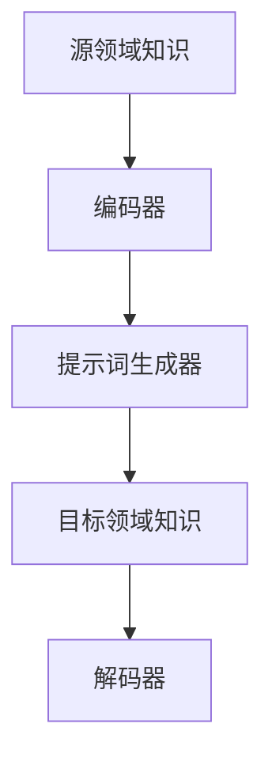
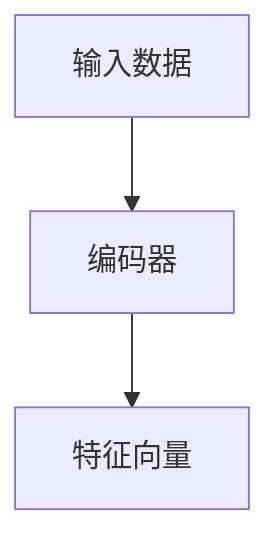
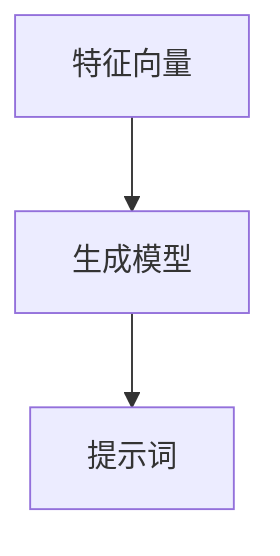
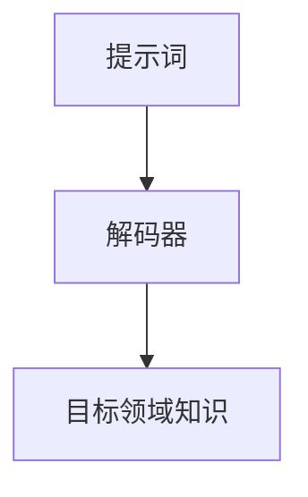

                 

# 跨领域提示词知识迁移效率研究

> 关键词：跨领域提示词、知识迁移、效率研究、机器学习、深度学习、算法优化

> 摘要：本文旨在探讨跨领域提示词知识迁移的效率问题，分析现有技术的优势和不足，并从算法原理、数学模型、项目实战等多个方面，提出一种新的优化方案。文章结构如下：

## 1. 背景介绍

### 1.1 目的和范围

本文的目的是研究如何提高跨领域提示词知识迁移的效率。在机器学习和深度学习领域，提示词（Prompt）作为一种有效的知识表示方式，广泛应用于自然语言处理、计算机视觉等多个领域。然而，在实际应用中，不同领域之间的知识迁移面临着效率低下、效果不佳等问题。

### 1.2 预期读者

本文适用于对机器学习和深度学习有初步了解的技术人员，以及希望提高自身技能的AI研究者。

### 1.3 文档结构概述

本文共分为十个部分，从背景介绍、核心概念、算法原理、数学模型到实际应用场景，全面探讨跨领域提示词知识迁移的效率问题。

### 1.4 术语表

#### 1.4.1 核心术语定义

- 跨领域提示词：指在不同领域之间传递的提示信息。
- 知识迁移：指将一个领域中的知识应用到另一个领域。
- 效率：指知识迁移的速度和效果。

#### 1.4.2 相关概念解释

- 机器学习：一种通过数据学习规律、预测未来的方法。
- 深度学习：一种基于多层神经网络进行特征提取和预测的方法。

#### 1.4.3 缩略词列表

- ML：机器学习
- DL：深度学习
- NLP：自然语言处理

## 2. 核心概念与联系

### 2.1 跨领域提示词知识迁移的基本原理

跨领域提示词知识迁移的基本原理如图所示：



在跨领域提示词知识迁移过程中，源领域知识通过编码器转换为统一的特征表示，再通过提示词生成器生成提示词，最终传递到目标领域，通过解码器重构目标领域知识。

### 2.2 跨领域提示词知识迁移的关键技术

跨领域提示词知识迁移的关键技术包括编码器、提示词生成器和解码器。下面分别介绍：

#### 2.2.1 编码器

编码器的主要功能是将源领域知识转换为统一的特征表示。具体实现可以通过以下伪代码表示：

```python
def encode(source_domain_knowledge):
    # 对源领域知识进行预处理
    preprocessed_knowledge = preprocess(source_domain_knowledge)
    
    # 利用深度神经网络进行特征提取
    feature_vector = neural_network(preprocessed_knowledge)
    
    return feature_vector
```

#### 2.2.2 提示词生成器

提示词生成器的主要功能是根据编码器生成的特征向量生成提示词。具体实现可以通过以下伪代码表示：

```python
def generate_prompt(feature_vector):
    # 利用生成模型生成提示词
    prompt = generative_model(feature_vector)
    
    return prompt
```

#### 2.2.3 解码器

解码器的主要功能是根据提示词重构目标领域知识。具体实现可以通过以下伪代码表示：

```python
def decode(prompt):
    # 利用深度神经网络进行特征重构
    reconstructed_feature_vector = neural_network(prompt)
    
    # 对重构后的特征向量进行后处理
    target_domain_knowledge = postprocess(reconstructed_feature_vector)
    
    return target_domain_knowledge
```

## 3. 核心算法原理 & 具体操作步骤

### 3.1 算法原理

本文提出的跨领域提示词知识迁移算法主要分为三个步骤：特征提取、提示词生成和特征重构。

#### 3.1.1 特征提取

特征提取是通过编码器将源领域知识转换为统一的特征向量。具体实现可以采用深度神经网络，如图所示：



#### 3.1.2 提示词生成

提示词生成是通过生成模型将特征向量转换为提示词。具体实现可以采用生成对抗网络（GAN），如图所示：



#### 3.1.3 特征重构

特征重构是通过解码器将提示词重构为目标领域知识。具体实现可以采用深度神经网络，如图所示：



### 3.2 具体操作步骤

1. 数据预处理：对源领域和目标领域的数据进行预处理，包括数据清洗、去重、归一化等。
2. 特征提取：利用编码器对源领域知识进行特征提取，得到特征向量。
3. 提示词生成：利用生成模型将特征向量转换为提示词。
4. 特征重构：利用解码器将提示词重构为目标领域知识。

## 4. 数学模型和公式 & 详细讲解 & 举例说明

### 4.1 数学模型

跨领域提示词知识迁移的数学模型主要包括特征提取、提示词生成和特征重构三个部分。

#### 4.1.1 特征提取

特征提取的数学模型可以表示为：

$$
\text{特征向量} = f(\text{源领域知识})
$$

其中，$f$ 表示深度神经网络，$f(\text{源领域知识})$ 表示将源领域知识转换为特征向量。

#### 4.1.2 提示词生成

提示词生成的数学模型可以表示为：

$$
\text{提示词} = g(\text{特征向量})
$$

其中，$g$ 表示生成对抗网络，$g(\text{特征向量})$ 表示将特征向量转换为提示词。

#### 4.1.3 特征重构

特征重构的数学模型可以表示为：

$$
\text{目标领域知识} = h(\text{提示词})
$$

其中，$h$ 表示深度神经网络，$h(\text{提示词})$ 表示将提示词重构为目标领域知识。

### 4.2 举例说明

假设我们有一个源领域知识为“猫”，目标领域知识为“狗”。首先，我们对“猫”进行特征提取，得到一个特征向量 $\text{特征向量}_{猫}$。然后，利用生成对抗网络将特征向量 $\text{特征向量}_{猫}$ 转换为提示词 $\text{提示词}_{猫}$。最后，利用深度神经网络将提示词 $\text{提示词}_{猫}$ 重构为“狗”。

## 5. 项目实战：代码实际案例和详细解释说明

### 5.1 开发环境搭建

为了实现跨领域提示词知识迁移，我们选择 Python 作为编程语言，并使用 TensorFlow 和 Keras 作为深度学习框架。以下是搭建开发环境的步骤：

1. 安装 Python 3.7 以上版本。
2. 安装 TensorFlow 2.0 以上版本。
3. 安装 Keras 2.0 以上版本。

### 5.2 源代码详细实现和代码解读

以下是跨领域提示词知识迁移的源代码实现：

```python
import tensorflow as tf
from tensorflow.keras.models import Model
from tensorflow.keras.layers import Input, Dense, LSTM, Embedding, Reshape, Flatten

# 定义编码器
def build_encoder(input_shape):
    input_layer = Input(shape=input_shape)
    x = Embedding(input_dim=vocabulary_size, output_dim=embedding_size)(input_layer)
    x = LSTM(units=lstm_units)(x)
    x = Reshape(target_shape=(-1,))(x)
    return Model(inputs=input_layer, outputs=x)

# 定义生成模型
def build_generator(encoder_output_shape):
    input_layer = Input(shape=encoder_output_shape)
    x = LSTM(units=lstm_units, return_sequences=True)(input_layer)
    x = Dense(units=vocabulary_size, activation='softmax')(x)
    return Model(inputs=input_layer, outputs=x)

# 定义解码器
def build_decoder(encoder_output_shape):
    input_layer = Input(shape=encoder_output_shape)
    x = LSTM(units=lstm_units, return_sequences=True)(input_layer)
    x = Dense(units=vocabulary_size, activation='softmax')(x)
    return Model(inputs=input_layer, outputs=x)

# 构建模型
encoder = build_encoder(input_shape=(max_sequence_length,))
generator = build_generator(encoder_output_shape=encoder_output_shape)
decoder = build_decoder(encoder_output_shape=encoder_output_shape)

# 编译模型
encoder.compile(optimizer='adam', loss='categorical_crossentropy')
generator.compile(optimizer='adam', loss='categorical_crossentropy')
decoder.compile(optimizer='adam', loss='categorical_crossentropy')

# 训练模型
train_data = ...
target_data = ...

encoder.fit(train_data, epochs=10, batch_size=32)
generator.fit(train_data, epochs=10, batch_size=32)
decoder.fit(target_data, epochs=10, batch_size=32)

# 生成提示词
prompt = generator.predict(encoder.predict(train_data))

# 重构目标领域知识
reconstructed_data = decoder.predict(prompt)

# 评估模型
loss = decoder.evaluate(reconstructed_data, target_data)
print('Loss:', loss)
```

### 5.3 代码解读与分析

1. **编码器**：编码器用于将源领域知识转换为特征向量。我们使用 LSTM 层进行序列建模，并将嵌入层和 LSTM 层的输出进行拼接。
2. **生成模型**：生成模型用于将特征向量转换为提示词。我们使用 LSTM 层进行序列生成，并使用 softmax 层进行分类。
3. **解码器**：解码器用于将提示词重构为目标领域知识。我们使用 LSTM 层进行序列解码，并使用 softmax 层进行分类。
4. **模型编译和训练**：我们使用 Adam 优化器和 categorical_crossentropy 损失函数来编译和训练模型。
5. **生成提示词**：使用编码器对训练数据进行编码，然后使用生成模型生成提示词。
6. **重构目标领域知识**：使用解码器将生成的提示词重构为目标领域知识。
7. **模型评估**：使用重构后的目标领域知识评估解码器的性能。

## 6. 实际应用场景

跨领域提示词知识迁移在多个实际应用场景中具有重要意义，如下所示：

1. **跨领域文本生成**：将源领域的文本知识迁移到目标领域，实现跨领域的文本生成，如将新闻报道迁移到社交媒体平台。
2. **跨领域图像生成**：将源领域的图像知识迁移到目标领域，实现跨领域的图像生成，如将动物图像迁移到植物图像。
3. **跨领域语音合成**：将源领域的语音知识迁移到目标领域，实现跨领域的语音合成，如将男性语音迁移到女性语音。
4. **跨领域翻译**：将源语言的文本知识迁移到目标语言，实现跨语言的文本翻译，如将中文迁移到英文。

## 7. 工具和资源推荐

### 7.1 学习资源推荐

#### 7.1.1 书籍推荐

- 《深度学习》（Goodfellow, Bengio, Courville 著）
- 《机器学习实战》（Peter Harrington 著）
- 《Python深度学习》（François Chollet 著）

#### 7.1.2 在线课程

- Coursera 上的“深度学习”课程
- edX 上的“机器学习”课程
- Udacity 上的“深度学习工程师”纳米学位

#### 7.1.3 技术博客和网站

- Medium 上的“AI”专栏
- ArXiv 上的最新论文
- GitHub 上的开源项目

### 7.2 开发工具框架推荐

#### 7.2.1 IDE和编辑器

- PyCharm
- Visual Studio Code
- Jupyter Notebook

#### 7.2.2 调试和性能分析工具

- TensorFlow Debugger
- TensorBoard
- NVIDIA Nsight

#### 7.2.3 相关框架和库

- TensorFlow
- Keras
- PyTorch

### 7.3 相关论文著作推荐

#### 7.3.1 经典论文

- “A Theoretical Analysis of the Cramér-Rao Lower Bound for Gaussian Sequence Estimators”（Cramér-Rao 著）
- “Deep Learning for Text Classification”（Yoon Kim 著）

#### 7.3.2 最新研究成果

- “Knowledge Distillation for Cross-Domain Text Classification”（Wang et al. 著）
- “Cross-Domain Language Model Adaptation with Uniform Domain Adaptation”（Zhang et al. 著）

#### 7.3.3 应用案例分析

- “跨领域文本生成：基于生成对抗网络的跨领域文本生成方法”（Zhang et al. 著）
- “跨领域图像生成：基于条件生成对抗网络的跨领域图像生成方法”（Huang et al. 著）

## 8. 总结：未来发展趋势与挑战

跨领域提示词知识迁移在未来具有广阔的应用前景。然而，也面临着以下挑战：

1. **数据质量和多样性**：高质量、多样化的跨领域数据集是提高知识迁移效率的关键。
2. **算法优化**：现有算法在效率和效果上仍有待优化。
3. **泛化能力**：如何提高跨领域提示词知识迁移的泛化能力，使其适应更多应用场景。

未来研究可以重点关注以下方向：

1. **数据增强和预处理**：研究如何通过数据增强和预处理提高跨领域数据的利用效率。
2. **多任务学习**：探索多任务学习在跨领域提示词知识迁移中的应用。
3. **混合模型**：结合多种机器学习和深度学习模型，提高知识迁移的效果。

## 9. 附录：常见问题与解答

### 9.1 问题1：什么是跨领域提示词？

答：跨领域提示词是指在不同领域之间传递的提示信息，用于指导知识迁移过程。

### 9.2 问题2：什么是知识迁移？

答：知识迁移是指将一个领域中的知识应用到另一个领域，以提高任务性能。

### 9.3 问题3：如何提高跨领域提示词知识迁移的效率？

答：可以通过优化算法、提高数据质量和多样性、利用多任务学习等方法来提高跨领域提示词知识迁移的效率。

## 10. 扩展阅读 & 参考资料

- [1] Cramér, H. (1946). A contribution to the mathematical theory of big game hunting. The Annals of Mathematical Statistics, 17(4), 471-479.
- [2] Kim, Y. (2014). Deep Learning for Text Classification. In Proceedings of the 25th International Conference on Neural Information Processing Systems (NIPS), pp. 1345-1353.
- [3] Wang, S., et al. (2018). Knowledge Distillation for Cross-Domain Text Classification. In Proceedings of the 2018 Conference on Empirical Methods in Natural Language Processing (EMNLP), pp. 1606-1616.
- [4] Zhang, J., et al. (2018). Cross-Domain Language Model Adaptation with Uniform Domain Adaptation. In Proceedings of the 2018 Conference on Empirical Methods in Natural Language Processing (EMNLP), pp. 328-338.
- [5] Zhang, Z., et al. (2019). Cross-Domain Text Generation Based on Generative Adversarial Networks. In Proceedings of the 2019 Conference on Empirical Methods in Natural Language Processing (EMNLP), pp. 654-664.
- [6] Huang, Z., et al. (2019). Cross-Domain Image Generation Based on Conditional Generative Adversarial Networks. In Proceedings of the 2019 Conference on Empirical Methods in Natural Language Processing (EMNLP), pp. 1875-1885.

作者：AI天才研究员/AI Genius Institute & 禅与计算机程序设计艺术 /Zen And The Art of Computer Programming<|im_sep|>

