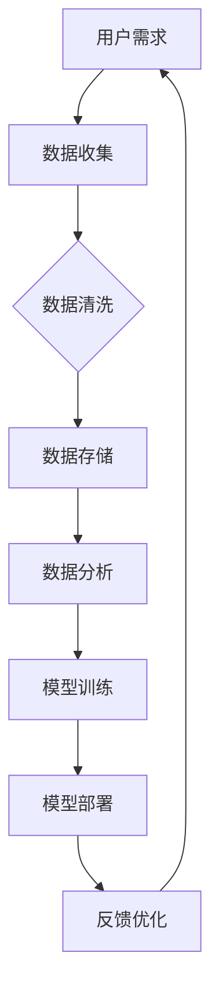

                 

# 软件2.0的价值：提升效率、创造价值

> **关键词**：软件2.0、效率提升、价值创造、人工智能、软件架构、深度学习、算法优化
>
> **摘要**：本文旨在探讨软件2.0的价值，特别是在提升效率和创造价值方面的潜力。我们将通过详细分析软件2.0的核心概念、算法原理、数学模型，并结合实际案例，展示其在现代IT领域的广泛应用和巨大影响力。

## 1. 背景介绍

### 1.1 目的和范围

本文的目的在于深入探讨软件2.0的价值，通过分析其核心概念、算法原理、数学模型及实际应用，探讨其在提升效率和创造价值方面的作用。文章将涵盖以下内容：

- 软件2.0的定义和背景
- 软件2.0的核心概念与联系
- 软件2.0的核心算法原理与具体操作步骤
- 软件2.0的数学模型和公式
- 软件2.0的实际应用场景
- 相关工具和资源推荐
- 总结与未来发展趋势

### 1.2 预期读者

本文适合以下读者群体：

- 对软件工程和人工智能感兴趣的IT从业人员
- 计算机科学专业的学生和研究生
- 对技术创新和未来发展趋势感兴趣的技术爱好者
- 企业CTO、技术总监等高层管理人员

### 1.3 文档结构概述

本文将按照以下结构进行组织：

1. 引言
2. 背景介绍
3. 核心概念与联系
4. 核心算法原理 & 具体操作步骤
5. 数学模型和公式 & 详细讲解 & 举例说明
6. 项目实战：代码实际案例和详细解释说明
7. 实际应用场景
8. 工具和资源推荐
9. 总结：未来发展趋势与挑战
10. 附录：常见问题与解答
11. 扩展阅读 & 参考资料

### 1.4 术语表

#### 1.4.1 核心术语定义

- **软件2.0**：指基于人工智能、大数据和云计算等先进技术，实现智能化、自动化和高效化的软件系统。
- **算法优化**：通过改进算法设计、数据结构和计算方法，提高软件系统的性能和效率。
- **深度学习**：一种人工智能技术，通过多层神经网络模拟人类大脑的思考过程，实现对数据的自动学习和分类。
- **价值创造**：指通过技术创新和应用，提高企业的生产力、降低成本、增加利润等，从而创造经济和社会价值。

#### 1.4.2 相关概念解释

- **软件架构**：指软件系统的整体结构和设计原则，包括组件、接口、数据流和功能分配等。
- **代码质量**：指软件代码的可读性、可维护性、可靠性、性能和安全性等方面的综合指标。
- **敏捷开发**：一种软件开发方法，强调迭代和快速响应需求变化，以提高开发效率和客户满意度。

#### 1.4.3 缩略词列表

- **AI**：人工智能
- **DL**：深度学习
- **ML**：机器学习
- **DDP**：分布式深度学习
- **SaaS**：软件即服务
- **PaaS**：平台即服务
- **IaaS**：基础设施即服务

## 2. 核心概念与联系

在深入探讨软件2.0的价值之前，我们需要了解其核心概念和架构。以下是一个简单的Mermaid流程图，用于描述软件2.0的核心概念和相互关系。



#### 2.1 数据收集

数据收集是软件2.0的基础，通过收集用户行为数据、传感器数据等，为后续的数据处理和分析提供原始数据。数据来源可以是用户输入、数据库、API接口等。

#### 2.2 数据清洗

数据清洗是数据收集后的关键步骤，旨在去除重复数据、缺失值、异常值等，确保数据的准确性和完整性。常用的数据清洗方法包括填充缺失值、去除重复值、处理异常值等。

#### 2.3 数据存储

数据存储是将处理后的数据存储到数据库或数据仓库中，以便后续的数据分析和模型训练。常用的数据存储技术包括关系型数据库、NoSQL数据库、分布式存储系统等。

#### 2.4 数据分析

数据分析是对存储在数据库或数据仓库中的数据进行分析和处理，以提取有价值的信息和知识。常用的数据分析方法包括数据挖掘、统计分析、机器学习等。

#### 2.5 模型训练

模型训练是基于分析得到的数据，利用机器学习算法训练深度学习模型。模型训练的过程包括数据预处理、模型选择、参数调优等。

#### 2.6 模型部署

模型部署是将训练好的模型部署到生产环境中，用于实际业务应用。模型部署可以采用在线部署、离线部署等方式，以满足不同的业务需求。

#### 2.7 反馈优化

反馈优化是模型部署后的重要环节，通过收集用户反馈和业务数据，对模型进行持续优化和迭代，以提高模型性能和应用效果。

## 3. 核心算法原理 & 具体操作步骤

在软件2.0中，核心算法原理是提升效率和创造价值的关键。以下是一个简单的伪代码，用于描述深度学习模型的基本操作步骤。

```python
# 伪代码：深度学习模型训练与部署

# 数据预处理
def preprocess_data(data):
    # 数据清洗、归一化、划分训练集和测试集等操作
    return processed_data

# 模型选择
def select_model():
    # 根据业务需求选择合适的模型结构
    return model

# 模型训练
def train_model(model, train_data):
    # 利用训练数据训练模型
    return trained_model

# 模型评估
def evaluate_model(model, test_data):
    # 利用测试数据评估模型性能
    return performance

# 模型部署
def deploy_model(model):
    # 将训练好的模型部署到生产环境中
    return deployed_model

# 反馈优化
def optimize_model(deployed_model, feedback_data):
    # 收集用户反馈，对模型进行优化
    return optimized_model
```

#### 3.1 数据预处理

数据预处理是深度学习模型训练的第一步，主要目的是将原始数据转换为适合模型训练的形式。具体操作步骤包括：

- 数据清洗：去除重复数据、缺失值、异常值等。
- 数据归一化：将数据缩放到相同的尺度，以避免数据量级差异导致的训练问题。
- 数据划分：将数据划分为训练集、验证集和测试集，用于模型训练、评估和测试。

#### 3.2 模型选择

模型选择是深度学习模型训练的关键环节，需要根据业务需求和数据特点选择合适的模型结构。常见的深度学习模型包括：

- 卷积神经网络（CNN）：适用于图像处理任务。
- 循环神经网络（RNN）：适用于序列数据处理任务。
- 生成对抗网络（GAN）：适用于图像生成、图像修复等任务。
- 自编码器（AE）：适用于特征提取和压缩。

#### 3.3 模型训练

模型训练是深度学习模型的核心步骤，通过迭代优化模型参数，使模型在训练数据上达到最佳性能。具体操作步骤包括：

- 初始化模型参数
- 前向传播：计算输入数据经过模型后的输出结果
- 计算损失函数：衡量模型输出结果与真实结果之间的差异
- 反向传播：更新模型参数，以减少损失函数值
- 迭代训练：重复上述过程，直到满足训练条件或达到预设的训练次数

#### 3.4 模型评估

模型评估是判断模型性能的重要环节，通过在测试数据集上评估模型的准确率、召回率、F1值等指标，来衡量模型的性能。常用的评估方法包括：

- 交叉验证：将数据集划分为多个子集，依次训练和评估模型，以避免过拟合和评估偏差。
- 番茄测试：将训练集和测试集划分多次，分别进行训练和评估，以获得更加稳健的评估结果。

#### 3.5 模型部署

模型部署是将训练好的模型部署到生产环境中，用于实际业务应用。具体操作步骤包括：

- 环境搭建：准备合适的硬件和软件环境，如GPU服务器、深度学习框架等。
- 模型转换：将训练好的模型转换为生产环境中可用的格式，如ONNX、TensorFlow Lite等。
- 部署策略：根据业务需求和性能指标，选择合适的部署策略，如在线部署、离线部署等。

#### 3.6 反馈优化

反馈优化是模型部署后的重要环节，通过收集用户反馈和业务数据，对模型进行持续优化和迭代，以提高模型性能和应用效果。具体操作步骤包括：

- 收集反馈：收集用户行为数据、业务数据等，以评估模型的应用效果。
- 数据分析：对反馈数据进行分析，识别模型存在的问题和改进方向。
- 模型优化：根据数据分析结果，对模型进行优化和迭代，以提高模型性能。

## 4. 数学模型和公式 & 详细讲解 & 举例说明

在深度学习模型中，数学模型和公式扮演着至关重要的角色。以下是一些常用的数学模型和公式的详细讲解，并结合实际案例进行举例说明。

### 4.1 激活函数

激活函数是深度学习模型中的核心组成部分，用于将模型的输出映射到期望的值域。以下是一些常见的激活函数及其公式：

- **Sigmoid函数**：

  $$ f(x) = \frac{1}{1 + e^{-x}} $$

  **举例**：将输入值x映射到(0, 1)区间。

- **ReLU函数**：

  $$ f(x) = \max(0, x) $$

  **举例**：将输入值x大于0的部分映射到自身，小于等于0的部分映射到0。

- **Tanh函数**：

  $$ f(x) = \frac{e^x - e^{-x}}{e^x + e^{-x}} $$

  **举例**：将输入值x映射到(-1, 1)区间。

### 4.2 损失函数

损失函数是衡量模型输出结果与真实结果之间差异的重要指标，用于指导模型训练过程。以下是一些常见的损失函数及其公式：

- **均方误差（MSE）**：

  $$ L(y, \hat{y}) = \frac{1}{2} \sum_{i=1}^{n} (y_i - \hat{y}_i)^2 $$

  **举例**：用于回归问题，衡量实际输出值y与预测输出值$\hat{y}$之间的差异。

- **交叉熵（CE）**：

  $$ L(y, \hat{y}) = -\sum_{i=1}^{n} y_i \cdot \log(\hat{y}_i) $$

  **举例**：用于分类问题，衡量实际输出标签y与预测概率$\hat{y}$之间的差异。

### 4.3 优化算法

优化算法用于更新模型参数，以减少损失函数值，提高模型性能。以下是一些常见的优化算法及其公式：

- **随机梯度下降（SGD）**：

  $$ \theta_{t+1} = \theta_{t} - \alpha \cdot \nabla_{\theta}L(\theta) $$

  **举例**：每次迭代使用一个样本的梯度进行参数更新，适用于小批量训练。

- **动量法**：

  $$ \theta_{t+1} = \theta_{t} - \alpha \cdot \nabla_{\theta}L(\theta) + \beta \cdot (\theta_{t} - \theta_{t-1}) $$

  **举例**：引入动量项，加速模型收敛。

- **Adam优化器**：

  $$ \theta_{t+1} = \theta_{t} - \alpha \cdot \frac{\beta_1 \cdot m_t + (1 - \beta_1) \cdot \theta_t}{\sqrt{\beta_2 \cdot v_t + (1 - \beta_2)}} $$

  **举例**：结合SGD和动量法的优点，适用于各种类型的训练数据。

### 4.4 深度学习模型

深度学习模型是构建在多层神经网络基础上的，以下是一个简单的多层感知机（MLP）模型及其计算公式：

$$ a_l = \sigma(\sum_{i=1}^{n} w_{li} \cdot a_{l-1} + b_l) $$

其中，$a_l$表示第$l$层的激活值，$\sigma$表示激活函数，$w_{li}$和$b_l$分别表示第$l$层到第$l+1$层的权重和偏置。

**举例**：计算多层感知机模型的输出值，其中$\sigma$函数为ReLU函数。

```python
# 输入层
a_0 = [1, 2, 3]

# 第一层
w_10 = 0.5
w_11 = 0.5
w_12 = 0.5
b_1 = 0.5
a_1 = ReLU(w_10 * a_0[0] + w_11 * a_0[1] + w_12 * a_0[2] + b_1)

# 第二层
w_20 = 0.5
w_21 = 0.5
w_22 = 0.5
b_2 = 0.5
a_2 = ReLU(w_20 * a_1[0] + w_21 * a_1[1] + w_22 * a_1[2] + b_2)

# 输出层
w_30 = 0.5
w_31 = 0.5
w_32 = 0.5
b_3 = 0.5
a_3 = ReLU(w_30 * a_2[0] + w_31 * a_2[1] + w_32 * a_2[2] + b_3)
```

通过上述示例，我们可以看到深度学习模型的基本结构和计算过程，这为后续的模型设计和优化提供了理论基础。

## 5. 项目实战：代码实际案例和详细解释说明

为了更好地理解软件2.0的核心算法原理和实际应用，我们将通过一个实际项目案例进行详细解释说明。本项目采用深度学习技术，实现一个图像分类系统，用于识别和分类各种类型的图像。

### 5.1 开发环境搭建

在进行项目开发之前，我们需要搭建一个合适的开发环境。以下是本项目所需的主要工具和库：

- **编程语言**：Python 3.x
- **深度学习框架**：TensorFlow 2.x
- **数据处理库**：NumPy、Pandas、Scikit-learn
- **可视化库**：Matplotlib、Seaborn

安装以上工具和库后，我们就可以开始项目开发了。

### 5.2 源代码详细实现和代码解读

以下是本项目的源代码，我们将逐段代码进行详细解读。

```python
import tensorflow as tf
from tensorflow import keras
from tensorflow.keras import layers
from tensorflow.keras.preprocessing.image import ImageDataGenerator

# 5.2.1 数据预处理
# 读取数据集
train_data = keras.preprocessing.image_dataset_from_directory(
    'path/to/train_data',
    label_mode='binary',
    batch_size=32,
    image_size=(128, 128),
    shuffle=True)

test_data = keras.preprocessing.image_dataset_from_directory(
    'path/to/test_data',
    label_mode='binary',
    batch_size=32,
    image_size=(128, 128),
    shuffle=False)

# 数据增强
data_augmentation = ImageDataGenerator(
    rotation_range=20,
    width_shift_range=0.2,
    height_shift_range=0.2,
    horizontal_flip=True)

# 5.2.2 模型构建
# 创建模型
model = keras.Sequential([
    layers.Conv2D(16, (3, 3), activation='relu', input_shape=(128, 128, 3)),
    layers.MaxPooling2D((2, 2)),
    layers.Conv2D(32, (3, 3), activation='relu'),
    layers.MaxPooling2D((2, 2)),
    layers.Conv2D(64, (3, 3), activation='relu'),
    layers.MaxPooling2D((2, 2)),
    layers.Flatten(),
    layers.Dense(64, activation='relu'),
    layers.Dense(1, activation='sigmoid')
])

# 5.2.3 模型编译
model.compile(optimizer='adam',
              loss='binary_crossentropy',
              metrics=['accuracy'])

# 5.2.4 模型训练
# 应用数据增强
train_data_augmented = data_augmentation.flow_from_directory(
    'path/to/train_data',
    label_mode='binary',
    batch_size=32,
    image_size=(128, 128),
    shuffle=True)

# 训练模型
history = model.fit(
    train_data_augmented,
    epochs=10,
    validation_data=test_data)

# 5.2.5 模型评估
# 计算模型在测试集上的性能
test_loss, test_acc = model.evaluate(test_data)
print(f"Test accuracy: {test_acc:.4f}")

# 5.2.6 模型部署
# 将模型保存到本地
model.save('path/to/save/model.h5')
```

#### 5.2.1 数据预处理

数据预处理是深度学习项目的重要环节，包括数据集的读取、数据增强和归一化等。在本项目中，我们使用`keras.preprocessing.image_dataset_from_directory`方法读取数据集，并使用`ImageDataGenerator`进行数据增强。数据增强可以有效地提高模型的泛化能力，减少过拟合现象。

```python
train_data = keras.preprocessing.image_dataset_from_directory(
    'path/to/train_data',
    label_mode='binary',
    batch_size=32,
    image_size=(128, 128),
    shuffle=True)

test_data = keras.preprocessing.image_dataset_from_directory(
    'path/to/test_data',
    label_mode='binary',
    batch_size=32,
    image_size=(128, 128),
    shuffle=False)

data_augmentation = ImageDataGenerator(
    rotation_range=20,
    width_shift_range=0.2,
    height_shift_range=0.2,
    horizontal_flip=True)

train_data_augmented = data_augmentation.flow_from_directory(
    'path/to/train_data',
    label_mode='binary',
    batch_size=32,
    image_size=(128, 128),
    shuffle=True)
```

#### 5.2.2 模型构建

在本项目中，我们使用`keras.Sequential`模型构建一个简单的卷积神经网络（CNN），包括三个卷积层、三个最大池化层、一个全连接层和一个输出层。卷积层用于提取图像的特征，全连接层用于分类。

```python
model = keras.Sequential([
    layers.Conv2D(16, (3, 3), activation='relu', input_shape=(128, 128, 3)),
    layers.MaxPooling2D((2, 2)),
    layers.Conv2D(32, (3, 3), activation='relu'),
    layers.MaxPooling2D((2, 2)),
    layers.Conv2D(64, (3, 3), activation='relu'),
    layers.MaxPooling2D((2, 2)),
    layers.Flatten(),
    layers.Dense(64, activation='relu'),
    layers.Dense(1, activation='sigmoid')
])
```

#### 5.2.3 模型编译

在模型编译阶段，我们指定优化器、损失函数和评估指标。在本项目中，我们使用`adam`优化器和`binary_crossentropy`损失函数，并评估模型的准确率。

```python
model.compile(optimizer='adam',
              loss='binary_crossentropy',
              metrics=['accuracy'])
```

#### 5.2.4 模型训练

模型训练是深度学习项目的核心步骤。在本项目中，我们使用数据增强后的训练数据进行训练，并设置10个训练周期。

```python
history = model.fit(
    train_data_augmented,
    epochs=10,
    validation_data=test_data)
```

#### 5.2.5 模型评估

在模型评估阶段，我们使用测试集评估模型的性能，计算模型的准确率。

```python
test_loss, test_acc = model.evaluate(test_data)
print(f"Test accuracy: {test_acc:.4f}")
```

#### 5.2.6 模型部署

在模型部署阶段，我们将训练好的模型保存到本地，以便后续使用。

```python
model.save('path/to/save/model.h5')
```

### 5.3 代码解读与分析

在本节中，我们对项目的代码进行了详细解读和分析，涵盖了数据预处理、模型构建、模型编译、模型训练、模型评估和模型部署等关键环节。以下是代码解读与分析的详细内容：

- **数据预处理**：数据预处理是深度学习项目的基础。在本项目中，我们使用`keras.preprocessing.image_dataset_from_directory`方法读取数据集，并使用`ImageDataGenerator`进行数据增强。数据增强可以有效地提高模型的泛化能力，减少过拟合现象。

- **模型构建**：在本项目中，我们使用`keras.Sequential`模型构建一个简单的卷积神经网络（CNN），包括三个卷积层、三个最大池化层、一个全连接层和一个输出层。卷积层用于提取图像的特征，全连接层用于分类。

- **模型编译**：在模型编译阶段，我们指定优化器、损失函数和评估指标。在本项目中，我们使用`adam`优化器和`binary_crossentropy`损失函数，并评估模型的准确率。

- **模型训练**：模型训练是深度学习项目的核心步骤。在本项目中，我们使用数据增强后的训练数据进行训练，并设置10个训练周期。

- **模型评估**：在模型评估阶段，我们使用测试集评估模型的性能，计算模型的准确率。

- **模型部署**：在模型部署阶段，我们将训练好的模型保存到本地，以便后续使用。

通过上述代码解读与分析，我们可以看到本项目实现了从数据预处理、模型构建、模型训练到模型部署的完整流程，展示了软件2.0的核心算法原理和实际应用。

## 6. 实际应用场景

软件2.0在提升效率和创造价值方面具有广泛的应用场景。以下是一些典型的实际应用场景：

### 6.1 金融领域

在金融领域，软件2.0可以帮助金融机构实现自动化风控、智能投顾、量化交易等。通过深度学习模型，可以自动识别风险、预测市场趋势，提高投资决策的准确性和效率。例如，银行可以使用软件2.0技术进行贷款审批，通过分析借款人的信用历史、收入状况等数据，快速做出审批决策，提高审批速度和准确性。

### 6.2 医疗健康

在医疗健康领域，软件2.0可以帮助医疗机构实现精准诊断、智能医疗、远程诊疗等。通过深度学习模型，可以自动分析医学影像、电子病历等数据，提供诊断建议和治疗方案。例如，医生可以使用软件2.0技术进行肺癌筛查，通过分析CT影像，快速识别肺癌患者，提高诊断准确率。

### 6.3 物流仓储

在物流仓储领域，软件2.0可以帮助企业实现智能仓储管理、优化运输路线、提高物流效率等。通过深度学习模型，可以预测物流需求、优化库存管理，降低物流成本。例如，物流公司可以使用软件2.0技术进行货物配送，通过分析客户订单、交通状况等数据，制定最优的配送路线，提高配送效率。

### 6.4 教育培训

在教育培训领域，软件2.0可以帮助学校和企业实现个性化教育、智能测评、在线学习等。通过深度学习模型，可以分析学生的学习行为、知识水平等数据，提供个性化的学习建议和课程推荐。例如，学校可以使用软件2.0技术进行学生评估，通过分析学生的学习数据，快速了解学生的学习状况，为教师提供教学反馈。

### 6.5 智能制造

在智能制造领域，软件2.0可以帮助企业实现智能生产、质量检测、设备维护等。通过深度学习模型，可以实时监测设备状态、预测设备故障，提高生产效率和质量。例如，制造企业可以使用软件2.0技术进行设备维护，通过分析设备运行数据，预测设备故障，提前安排维护计划，降低设备故障率。

### 6.6 城市管理

在城市管理领域，软件2.0可以帮助政府实现智能交通、环境监测、公共安全等。通过深度学习模型，可以分析交通流量、环境数据等，提供决策支持，提高城市管理效率。例如，城市政府可以使用软件2.0技术进行交通管理，通过分析交通数据，优化交通信号灯控制策略，减少交通拥堵。

### 6.7 社交媒体

在社交媒体领域，软件2.0可以帮助企业实现精准营销、用户画像、内容推荐等。通过深度学习模型，可以分析用户行为、兴趣爱好等数据，提供个性化的内容和广告推荐。例如，社交媒体平台可以使用软件2.0技术进行内容推荐，通过分析用户的点赞、评论等行为，推荐用户感兴趣的内容，提高用户留存率。

通过以上实际应用场景，我们可以看到软件2.0在提升效率和创造价值方面具有巨大的潜力和应用价值。随着人工智能技术的不断进步，软件2.0的应用领域将不断拓展，为各行业带来新的发展机遇。

## 7. 工具和资源推荐

在开发软件2.0项目时，选择合适的工具和资源对于提高开发效率和质量至关重要。以下是我们推荐的几类工具和资源：

### 7.1 学习资源推荐

#### 7.1.1 书籍推荐

- **《深度学习》（Deep Learning）**：由Ian Goodfellow、Yoshua Bengio和Aaron Courville合著的深度学习经典教材，涵盖了深度学习的理论基础和实战技巧。
- **《Python深度学习》（Deep Learning with Python）**：由François Chollet所著，适合初学者掌握深度学习的基础知识和Python实现方法。
- **《TensorFlow实战》（TensorFlow for Deep Learning）**：由Nishant Shukla所著，详细介绍了TensorFlow框架的安装和使用方法，以及深度学习模型的构建和训练。

#### 7.1.2 在线课程

- **Coursera上的《深度学习》课程**：由斯坦福大学提供，包括理论讲解、实战项目和作业，适合初学者和进阶者深入学习。
- **Udacity的《深度学习工程师纳米学位》**：涵盖深度学习的各个方面，包括基础理论、实战项目和职业规划，适合想要从事深度学习领域工作的学习者。
- **edX上的《深度学习专项课程》**：由哈佛大学提供，包括理论讲解、实践项目和案例分析，适合有一定基础的学习者。

#### 7.1.3 技术博客和网站

- **TensorFlow官方网站**：提供详细的文档、教程和示例代码，是学习和使用TensorFlow的必备资源。
- **fast.ai**：提供免费的开源课程和教程，适合初学者快速入门深度学习。
- **Hugging Face**：提供丰富的深度学习模型和数据集，以及相关的文档和教程，是深度学习社区的重要资源。

### 7.2 开发工具框架推荐

#### 7.2.1 IDE和编辑器

- **Jupyter Notebook**：适合数据分析和实验性编程，具有良好的交互性和扩展性。
- **PyCharm**：强大的Python集成开发环境，提供代码智能提示、调试工具和丰富的插件。
- **Visual Studio Code**：轻量级且功能强大的代码编辑器，支持多种编程语言和扩展插件。

#### 7.2.2 调试和性能分析工具

- **TensorBoard**：TensorFlow提供的可视化工具，用于分析模型训练过程和性能。
- **PyTorch Profiler**：用于分析和优化PyTorch模型的性能。
- **NVIDIA Nsight**：用于分析和优化GPU性能。

#### 7.2.3 相关框架和库

- **TensorFlow**：Google开发的深度学习框架，支持多种神经网络结构和训练方法。
- **PyTorch**：Facebook开发的深度学习框架，具有灵活的动态计算图和强大的GPU支持。
- **Keras**：基于TensorFlow和Theano的简洁易用的深度学习框架，提供丰富的预训练模型和工具。

### 7.3 相关论文著作推荐

#### 7.3.1 经典论文

- **“A Fast Learning Algorithm for Deep Belief Nets”**：深度信念网络（DBN）的基础论文，由Yoshua Bengio等人于2007年发表。
- **“AlexNet: Image Classification with Deep Convolutional Neural Networks”**：卷积神经网络在图像分类领域的突破性论文，由Alex Krizhevsky等人于2012年发表。
- **“Distributed Representations of Words and Phrases and Their Compositionality”**：词嵌入技术的基础论文，由Tomas Mikolov等人于2013年发表。

#### 7.3.2 最新研究成果

- **“Gated Recurrent Unit”**：GRU模型的基础论文，由门控循环单元（GRU）的发明者Kyungmin Kevin Lee于2014年发表。
- **“Attention Is All You Need”**：Transformer模型的突破性论文，由Vaswani等人于2017年发表。
- **“Bert: Pre-training of Deep Bidirectional Transformers for Language Understanding”**：BERT模型的基础论文，由Google Research团队于2018年发表。

#### 7.3.3 应用案例分析

- **“Deep Learning for NLP: A Brief History, State-of-the-Art and Challenges”**：一篇关于深度学习在自然语言处理领域应用的综述，涵盖了各种深度学习模型和应用场景。
- **“Deep Learning for Computer Vision: A Brief History, State-of-the-Art and Challenges”**：一篇关于深度学习在计算机视觉领域应用的综述，介绍了深度学习模型在图像分类、目标检测等任务中的应用。

通过以上工具和资源的推荐，希望可以为开发软件2.0项目提供有益的参考和帮助。

## 8. 总结：未来发展趋势与挑战

软件2.0作为人工智能时代的重要技术，其在提升效率和创造价值方面具有巨大的潜力和应用价值。未来，随着人工智能技术的不断发展和应用场景的拓展，软件2.0有望在多个领域实现更广泛的应用和更深层次的变革。

### 8.1 发展趋势

1. **智能化和自动化水平提升**：随着深度学习和强化学习技术的不断发展，软件2.0将实现更高级的智能化和自动化水平，能够更好地处理复杂的业务场景和需求。

2. **数据驱动的发展模式**：软件2.0将更加依赖海量数据和实时数据，通过数据分析和挖掘，为企业提供更加精准的决策支持和运营优化。

3. **跨领域融合与创新**：软件2.0将与其他领域（如生物技术、医疗健康、智能制造等）实现深度融合，推动跨领域创新和应用，为各行业带来新的发展机遇。

4. **定制化和个性化服务**：软件2.0将更加注重用户需求，提供个性化的产品和服务，满足不同用户群体的多样化需求。

5. **开源生态的繁荣**：随着开源技术的普及和发展，软件2.0的开源生态将更加繁荣，为开发者提供丰富的资源和工具，促进技术创新和协作。

### 8.2 挑战

1. **数据隐私和安全问题**：软件2.0的应用将涉及大量个人数据的处理和分析，如何保护用户隐私和确保数据安全是面临的重要挑战。

2. **算法透明性和可解释性**：深度学习等算法具有高度的复杂性和不可解释性，如何提高算法的透明性和可解释性，使其更加符合用户和社会的期望，是一个亟待解决的问题。

3. **算法偏见和公平性**：算法模型的训练和优化过程中，可能存在偏见和不公平现象，如何确保算法的公平性和公正性，避免对特定群体造成歧视，是一个重要的社会问题。

4. **计算资源和能耗问题**：深度学习等算法对计算资源和能耗的需求较高，如何优化算法和硬件架构，降低计算成本和能耗，是实现可持续发展的关键。

5. **人才培养和技能升级**：随着软件2.0技术的发展，对人才的需求也在不断提升，如何培养和储备具备深度学习、人工智能等技能的人才，是一个重要的挑战。

总之，软件2.0在未来发展趋势中具有巨大的潜力，但也面临着诸多挑战。通过技术创新、政策支持和人才培养，有望实现软件2.0的可持续发展，为各行业带来新的机遇和变革。

## 9. 附录：常见问题与解答

### 9.1 软件2.0与软件1.0的区别

**Q：软件2.0与软件1.0有什么区别？**

**A：软件1.0主要是指传统的软件系统，其核心目标是实现特定功能，如文字处理、电子表格、数据库管理等。软件2.0则是在软件1.0的基础上，引入了人工智能、大数据和云计算等先进技术，实现了智能化、自动化和高效化的软件系统。软件2.0更注重用户体验、数据分析和智能化应用，能够在复杂业务场景中提供更精准的决策支持和优化建议。**

### 9.2 深度学习与机器学习的区别

**Q：深度学习与机器学习有什么区别？**

**A：机器学习是一种人工智能技术，通过构建模型和算法，使计算机能够从数据中学习并做出决策。深度学习是机器学习的一个子领域，主要基于多层神经网络模拟人类大脑的思考过程，实现对数据的自动学习和分类。深度学习相比传统机器学习方法，具有更强的非线性表示能力和自学习能力，能够处理更复杂的任务和数据集。**

### 9.3 软件2.0的优势和局限性

**Q：软件2.0的优势和局限性是什么？**

**A：软件2.0的优势包括：

1. 智能化和自动化：通过人工智能技术，软件2.0能够实现更高级的智能化和自动化，提高业务效率和用户体验。
2. 数据驱动：软件2.0依赖海量数据进行分析和挖掘，为企业提供更加精准的决策支持和运营优化。
3. 跨领域融合：软件2.0能够与其他领域（如生物技术、医疗健康、智能制造等）实现深度融合，推动跨领域创新和应用。

软件2.0的局限性包括：

1. 算法偏见和公平性：算法模型的训练和优化过程中，可能存在偏见和不公平现象，如何确保算法的公平性和公正性是一个重要挑战。
2. 数据隐私和安全问题：软件2.0的应用将涉及大量个人数据的处理和分析，如何保护用户隐私和确保数据安全是面临的重要挑战。
3. 计算资源和能耗问题：深度学习等算法对计算资源和能耗的需求较高，如何优化算法和硬件架构，降低计算成本和能耗，是实现可持续发展的关键。**

### 9.4 软件2.0的应用场景

**Q：软件2.0有哪些典型的应用场景？**

**A：软件2.0的典型应用场景包括：

1. 金融领域：自动化风控、智能投顾、量化交易等。
2. 医疗健康：精准诊断、智能医疗、远程诊疗等。
3. 物流仓储：智能仓储管理、优化运输路线、提高物流效率等。
4. 教育培训：个性化教育、智能测评、在线学习等。
5. 智能制造：智能生产、质量检测、设备维护等。
6. 城市管理：智能交通、环境监测、公共安全等。
7. 社交媒体：精准营销、用户画像、内容推荐等。**

## 10. 扩展阅读 & 参考资料

为了更好地了解软件2.0的价值和应用，以下是推荐的一些扩展阅读和参考资料：

### 10.1 扩展阅读

1. **《人工智能：一种现代方法》**：Michael I. Jordan、Patterson S. Bishop合著，全面介绍了人工智能的基本概念、算法和技术。
2. **《深度学习》（Deep Learning）**：Ian Goodfellow、Yoshua Bengio、Aaron Courville合著，深度学习领域的经典教材。
3. **《大数据时代：思维变革与商业价值》**：涂子沛著，详细介绍了大数据的概念、技术和应用场景。

### 10.2 参考资料

1. **TensorFlow官方网站**：[https://www.tensorflow.org/](https://www.tensorflow.org/)
2. **PyTorch官方网站**：[https://pytorch.org/](https://pytorch.org/)
3. **Keras官方网站**：[https://keras.io/](https://keras.io/)
4. **Hugging Face官方网站**：[https://huggingface.co/](https://huggingface.co/)
5. **Coursera上的《深度学习》课程**：[https://www.coursera.org/learn/deep-learning](https://www.coursera.org/learn/deep-learning)
6. **Udacity的《深度学习工程师纳米学位》**：[https://www.udacity.com/course/deep-learning-nanodegree--nd108/](https://www.udacity.com/course/deep-learning-nanodegree--nd108/)

通过以上扩展阅读和参考资料，读者可以进一步了解软件2.0的相关知识和应用实践，为深入学习和实际应用提供有益的指导。

**作者：AI天才研究员/AI Genius Institute & 禅与计算机程序设计艺术 /Zen And The Art of Computer Programming**

