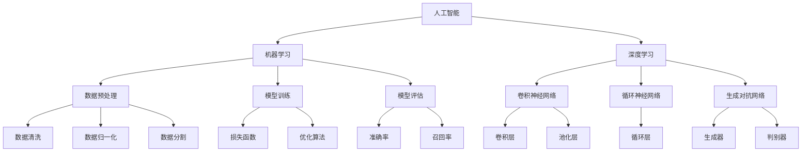

                 

### 文章标题

# 软件2.0的伦理规范：人工智能的责任

### 关键词

- 伦理规范
- 人工智能
- 软件工程
- 责任
- 透明度
- 可解释性
- 安全性
- 数据隐私
- 法律合规

### 摘要

本文深入探讨了软件2.0时代下的伦理规范，特别是人工智能在软件开发中扮演的角色及其带来的责任。随着人工智能技术的不断进步，其在各个领域的应用日益广泛，但随之而来的伦理问题也日益突出。本文旨在阐述人工智能在软件开发中的伦理责任，分析现有的伦理框架，探讨未来的发展方向。文章结构分为以下几个部分：背景介绍、核心概念与联系、核心算法原理与操作步骤、数学模型与公式讲解、项目实战案例分析、实际应用场景、工具和资源推荐以及总结与展望。通过本文的阅读，读者将能够更全面地理解人工智能在软件开发中的伦理责任，以及如何在实际项目中遵循和实施这些伦理规范。

## 1. 背景介绍

### 1.1 目的和范围

本文的目的是探讨软件2.0时代下，尤其是人工智能在软件开发中的伦理规范问题。随着人工智能技术的迅猛发展，其已经在多个领域取得了显著成果，例如自动驾驶、医疗诊断、金融服务、智能客服等。然而，这一技术的普及和应用也引发了诸多伦理问题，如数据隐私、算法偏见、安全性、责任归属等。这些问题不仅影响到技术的应用和发展，也对社会的公平与正义提出了挑战。

本文将首先介绍人工智能在软件开发中的基本概念和现状，然后分析当前存在的伦理问题，探讨解决这些问题的方法。此外，本文还将介绍相关的法律法规和伦理准则，并提出一些建议，以帮助软件开发者在设计和应用人工智能时遵循伦理规范。

### 1.2 预期读者

本文的预期读者包括：

- 软件开发者和工程师：他们需要对人工智能的伦理问题有更深入的理解，以便在实际项目中遵循正确的伦理规范。
- 管理者和决策者：他们需要了解人工智能在伦理方面的影响，以便在制定政策和决策时考虑相关因素。
- 伦理学家和政策制定者：他们需要关注人工智能技术的发展及其伦理问题，为制定相关法律和伦理准则提供参考。
- 学术界和产业界：他们需要共同探讨和解决人工智能在伦理方面的挑战，推动技术和社会的可持续发展。

### 1.3 文档结构概述

本文的结构如下：

1. 背景介绍：介绍本文的目的、预期读者、文档结构等。
2. 核心概念与联系：介绍人工智能的基本概念、相关技术原理及架构。
3. 核心算法原理与操作步骤：详细阐述人工智能算法的原理和具体操作步骤。
4. 数学模型和公式讲解：介绍与人工智能相关的数学模型和公式，并进行举例说明。
5. 项目实战：通过实际案例展示人工智能在软件开发中的应用。
6. 实际应用场景：探讨人工智能在不同领域的应用及其面临的伦理问题。
7. 工具和资源推荐：推荐相关学习资源、开发工具和框架。
8. 总结：总结本文的主要观点，展望未来发展趋势与挑战。

### 1.4 术语表

为了便于读者理解本文中的相关术语，以下是一些关键术语的定义和解释：

#### 1.4.1 核心术语定义

- **人工智能（AI）**：指通过计算机模拟人类的智能行为，使计算机具备感知、理解、学习、推理和决策等能力的学科。
- **机器学习（ML）**：一种人工智能的分支，通过算法使计算机从数据中自动学习，并改进性能。
- **深度学习（DL）**：一种基于多层神经网络的学习方法，通过大量数据训练模型，实现高度复杂的功能。
- **算法偏见**：算法在训练数据中存在的偏差，可能导致模型在处理某些数据时出现不公平或歧视现象。
- **数据隐私**：指个人数据的保密性和不被未经授权的访问。
- **伦理规范**：指在特定领域内，为了确保技术和社会的可持续发展，制定的一系列行为准则和道德标准。

#### 1.4.2 相关概念解释

- **伦理问题**：涉及道德判断和价值观的问题，特别是在技术应用中如何平衡技术利益与社会责任。
- **责任归属**：确定在技术应用过程中，当发生问题时，责任应该由谁承担。
- **可解释性**：指算法决策过程的透明度，使得非专业人士能够理解算法是如何得出结论的。
- **透明度**：指技术系统的运作过程和决策机制是公开和可审查的。
- **算法透明度**：指算法的决策过程和参数设置可以被解释和理解。

#### 1.4.3 缩略词列表

- **AI**：人工智能（Artificial Intelligence）
- **ML**：机器学习（Machine Learning）
- **DL**：深度学习（Deep Learning）
- **GDPR**：通用数据保护条例（General Data Protection Regulation）
- **API**：应用程序编程接口（Application Programming Interface）
- **DLaaS**：深度学习即服务（Deep Learning as a Service）

## 2. 核心概念与联系

为了更好地理解本文的主题，我们需要介绍一些核心概念和它们之间的联系。以下是人工智能的基本概念、相关技术原理及其架构的Mermaid流程图：



### 2.1 人工智能的基本概念

人工智能（AI）是一种模拟人类智能的技术，旨在使计算机具备感知、理解、学习、推理和决策等能力。根据其实现方式，AI可以分为几种不同的类型：

- **规则基础型AI**：基于明确的规则和逻辑进行推理和决策。
- **基于案例的推理**：通过类比过去的案例来解决问题。
- **知识表示与推理**：使用符号表示知识，并通过推理机进行推理。
- **机器学习**：通过从数据中自动学习，改进性能。
- **深度学习**：一种基于多层神经网络的学习方法。

### 2.2 相关技术原理

#### 2.2.1 机器学习

机器学习（ML）是一种人工智能的分支，通过算法使计算机从数据中自动学习，并改进性能。机器学习可以分为几种不同的类型：

- **监督学习**：通过标记数据来训练模型，模型在新的数据上进行预测。
- **无监督学习**：没有标记数据，模型通过探索数据结构来发现模式。
- **半监督学习**：部分数据有标记，部分数据无标记，模型通过这两种数据共同学习。
- **强化学习**：通过与环境的交互来学习最优策略。

#### 2.2.2 深度学习

深度学习（DL）是一种基于多层神经网络的学习方法，通过大量数据训练模型，实现高度复杂的功能。深度学习的主要组成部分包括：

- **神经网络**：由多个层次组成的网络结构，每个层次都对输入数据进行处理。
- **卷积神经网络（CNN）**：一种用于图像处理的深度学习模型。
- **循环神经网络（RNN）**：一种用于序列数据处理的深度学习模型。
- **生成对抗网络（GAN）**：一种用于生成新数据的深度学习模型。

### 2.3 架构

在软件2.0时代，人工智能的架构通常包括以下几个主要部分：

- **数据预处理**：对数据进行清洗、归一化、分割等处理，以便模型训练。
- **模型训练**：使用机器学习算法训练模型，包括损失函数和优化算法的选择。
- **模型评估**：对训练好的模型进行评估，以确定其性能和准确性。
- **模型部署**：将训练好的模型部署到生产环境中，进行实际应用。

通过以上对核心概念和联系的介绍，我们为后续章节的详细讲解奠定了基础。

## 3. 核心算法原理 & 具体操作步骤

在本文的第三部分，我们将详细讲解人工智能的核心算法原理，并通过伪代码展示具体的操作步骤。为了更好地理解，我们将以一个简单的监督学习算法——线性回归（Linear Regression）为例。

### 3.1 线性回归原理

线性回归是一种用于预测连续值的监督学习算法。其基本原理是通过找到输入变量和输出变量之间的线性关系，来预测新的输入数据对应的输出值。线性回归模型的数学表达式如下：

\[ y = \beta_0 + \beta_1 \cdot x \]

其中，\( y \) 是输出变量，\( x \) 是输入变量，\( \beta_0 \) 和 \( \beta_1 \) 是模型的参数。

### 3.2 伪代码

下面是线性回归的伪代码：

```plaintext
算法：线性回归
输入：训练数据集 X, Y，学习率 α，迭代次数 n
输出：模型参数 \(\beta_0, \beta_1\)

初始化：\(\beta_0, \beta_1\) 为任意值
for i = 1 to n do
    for each (x_i, y_i) in X, Y do
        计算预测值 y_pred = \(\beta_0 + \beta_1 \cdot x_i\)
        计算损失函数 L = (y_i - y_pred)^2
        更新参数：
            \(\beta_0 = \beta_0 - α \cdot \frac{1}{n} \cdot \sum_{i=1}^{n} (y_i - y_pred)\)
            \(\beta_1 = \beta_1 - α \cdot \frac{1}{n} \cdot \sum_{i=1}^{n} (y_i - y_pred) \cdot x_i\)
end for
end for
返回：模型参数 \(\beta_0, \beta_1\)
```

### 3.3 具体操作步骤

1. **初始化参数**：首先，我们需要初始化模型的参数 \(\beta_0\) 和 \(\beta_1\)。这些参数可以随机选择，也可以使用一些启发式方法来确定初始值。

2. **迭代更新参数**：然后，我们开始迭代更新参数。每次迭代都会遍历训练数据集 \(X, Y\)，计算预测值 \(y_pred\) 和损失函数 \(L\)。

3. **计算损失函数**：损失函数用于衡量模型的预测误差。在本文中，我们使用均方误差（Mean Squared Error，MSE）作为损失函数，其公式为 \(L = (y_i - y_pred)^2\)。

4. **更新参数**：根据损失函数的梯度，我们使用梯度下降（Gradient Descent）算法更新参数 \(\beta_0\) 和 \(\beta_1\)。具体来说，每次更新参数时，都会减小一个正比例于损失函数梯度的值。这个正比例系数称为学习率（Learning Rate，α）。

5. **终止条件**：迭代过程会持续进行，直到满足终止条件，如达到预设的迭代次数或模型性能不再显著提升。

通过以上步骤，我们就可以训练一个简单的线性回归模型，并使用它进行预测。在实际应用中，线性回归可以扩展到更复杂的模型，如多项式回归、岭回归等。

## 4. 数学模型和公式 & 详细讲解 & 举例说明

在第四部分，我们将详细讲解人工智能中的数学模型和公式，并通过具体例子来说明这些公式的应用。这些数学模型和公式对于理解人工智能算法的原理和操作至关重要。

### 4.1 线性回归模型

线性回归模型是机器学习中一种非常基础且重要的模型，用于预测一个连续的输出值。其数学模型如下：

\[ y = \beta_0 + \beta_1 \cdot x \]

其中，\( y \) 是输出变量，\( x \) 是输入变量，\(\beta_0\) 和 \(\beta_1\) 是模型的参数，分别称为截距和斜率。

#### 梯度下降算法

为了找到最优的参数 \(\beta_0\) 和 \(\beta_1\)，我们通常使用梯度下降算法。梯度下降的目标是使得损失函数最小化。在线性回归中，常用的损失函数是均方误差（MSE），其公式为：

\[ J(\beta_0, \beta_1) = \frac{1}{2n} \sum_{i=1}^{n} (y_i - (\beta_0 + \beta_1 \cdot x_i))^2 \]

其中，\( n \) 是数据点的数量，\( y_i \) 和 \( x_i \) 分别是第 \( i \) 个数据点的输出值和输入值。

梯度下降算法的更新规则为：

\[ \beta_0 = \beta_0 - \alpha \cdot \frac{\partial J(\beta_0, \beta_1)}{\partial \beta_0} \]
\[ \beta_1 = \beta_1 - \alpha \cdot \frac{\partial J(\beta_0, \beta_1)}{\partial \beta_1} \]

其中，\(\alpha\) 是学习率，\(\frac{\partial J(\beta_0, \beta_1)}{\partial \beta_0}\) 和 \(\frac{\partial J(\beta_0, \beta_1)}{\partial \beta_1}\) 分别是损失函数对 \(\beta_0\) 和 \(\beta_1\) 的梯度。

### 4.2 逻辑回归模型

逻辑回归（Logistic Regression）是一种用于分类问题的线性模型，其目标是通过输入变量预测概率分布。逻辑回归的数学模型如下：

\[ P(y=1) = \frac{1}{1 + e^{-(\beta_0 + \beta_1 \cdot x)}} \]

其中，\( y \) 是输出变量，取值为 0 或 1，\( x \) 是输入变量，\(\beta_0\) 和 \(\beta_1\) 是模型的参数。

逻辑回归的损失函数通常使用对数损失（Log Loss）：

\[ J(\beta_0, \beta_1) = -\frac{1}{n} \sum_{i=1}^{n} [y_i \cdot \ln(P(y=1)) + (1 - y_i) \cdot \ln(1 - P(y=1))] \]

其中，\( n \) 是数据点的数量，\( y_i \) 和 \( P(y=1) \) 分别是第 \( i \) 个数据点的输出值和预测概率。

### 4.3 梯度提升机（Gradient Boosting）

梯度提升机（Gradient Boosting）是一种集成学习方法，通过迭代地训练多个弱学习器（如决策树），并将它们的预测结果进行加权求和，以获得更高的预测性能。

梯度提升机的更新规则如下：

\[ \beta_t = \beta_{t-1} + \alpha_t \cdot f_t(\beta_{t-1}, x_i, y_i) \]

其中，\(\beta_t\) 是第 \( t \) 次迭代的模型参数，\( f_t(\beta_{t-1}, x_i, y_i) \) 是第 \( t \) 次迭代的梯度更新函数，\(\alpha_t\) 是步长。

梯度提升机的损失函数通常使用均方误差（MSE）：

\[ J(\beta) = \frac{1}{2} \sum_{i=1}^{n} (y_i - \beta_0 - \beta_1 \cdot x_i)^2 \]

### 4.4 举例说明

#### 4.4.1 线性回归例子

假设我们有一个数据集，其中输入变量 \( x \) 和输出变量 \( y \) 如下：

| x | y |
|---|---|
| 1 | 2 |
| 2 | 4 |
| 3 | 6 |
| 4 | 8 |

我们的目标是找到线性回归模型的最优参数 \(\beta_0\) 和 \(\beta_1\)。

首先，我们需要初始化参数，例如取 \(\beta_0 = 0\)，\(\beta_1 = 0\)。

然后，我们使用梯度下降算法进行迭代更新。假设学习率 \(\alpha = 0.1\)，迭代次数为 10 次。

在第一次迭代中，我们计算损失函数 \( J(\beta_0, \beta_1) \)：

\[ J(\beta_0, \beta_1) = \frac{1}{4} \left[ (2 - 0)^2 + (4 - 0)^2 + (6 - 0)^2 + (8 - 0)^2 \right] = 20 \]

然后，我们计算梯度：

\[ \frac{\partial J(\beta_0, \beta_1)}{\partial \beta_0} = \frac{1}{4} \left[ 2(2 - 0) + 2(4 - 0) + 2(6 - 0) + 2(8 - 0) \right] = 10 \]
\[ \frac{\partial J(\beta_0, \beta_1)}{\partial \beta_1} = \frac{1}{4} \left[ 2(2 - 0) \cdot 1 + 2(4 - 0) \cdot 1 + 2(6 - 0) \cdot 1 + 2(8 - 0) \cdot 1 \right] = 20 \]

根据梯度下降算法的更新规则，我们可以更新参数：

\[ \beta_0 = \beta_0 - 0.1 \cdot 10 = -1 \]
\[ \beta_1 = \beta_1 - 0.1 \cdot 20 = -2 \]

重复以上步骤，直到达到迭代次数或模型性能不再显著提升。

#### 4.4.2 逻辑回归例子

假设我们有一个二分类数据集，其中输入变量 \( x \) 和输出变量 \( y \) 如下：

| x | y |
|---|---|
| 1 | 1 |
| 2 | 0 |
| 3 | 1 |
| 4 | 0 |

我们的目标是找到逻辑回归模型的最优参数 \(\beta_0\) 和 \(\beta_1\)。

首先，我们需要初始化参数，例如取 \(\beta_0 = 0\)，\(\beta_1 = 0\)。

然后，我们使用梯度下降算法进行迭代更新。假设学习率 \(\alpha = 0.1\)，迭代次数为 10 次。

在第一次迭代中，我们计算损失函数 \( J(\beta_0, \beta_1) \)：

\[ J(\beta_0, \beta_1) = -\frac{1}{4} \left[ 1 \cdot \ln(\frac{1}{1 + e^{-0 \cdot 1}}) + 0 \cdot \ln(\frac{1}{1 + e^{-0 \cdot 2}}) + 1 \cdot \ln(\frac{1}{1 + e^{-0 \cdot 3}}) + 0 \cdot \ln(\frac{1}{1 + e^{-0 \cdot 4}}) \right] \approx 1.386 \]

然后，我们计算梯度：

\[ \frac{\partial J(\beta_0, \beta_1)}{\partial \beta_0} = -\frac{1}{4} \left[ 1 \cdot \frac{e^{-0 \cdot 1}}{(1 + e^{-0 \cdot 1})^2} + 0 \cdot \frac{e^{-0 \cdot 2}}{(1 + e^{-0 \cdot 2})^2} + 1 \cdot \frac{e^{-0 \cdot 3}}{(1 + e^{-0 \cdot 3})^2} + 0 \cdot \frac{e^{-0 \cdot 4}}{(1 + e^{-0 \cdot 4})^2} \right] \approx 0.319 \]
\[ \frac{\partial J(\beta_0, \beta_1)}{\partial \beta_1} = -\frac{1}{4} \left[ 1 \cdot \frac{e^{-0 \cdot 1} \cdot 1}{(1 + e^{-0 \cdot 1})^2} + 0 \cdot \frac{e^{-0 \cdot 2} \cdot 2}{(1 + e^{-0 \cdot 2})^2} + 1 \cdot \frac{e^{-0 \cdot 3} \cdot 3}{(1 + e^{-0 \cdot 3})^2} + 0 \cdot \frac{e^{-0 \cdot 4} \cdot 4}{(1 + e^{-0 \cdot 4})^2} \right] \approx 0.658 \]

根据梯度下降算法的更新规则，我们可以更新参数：

\[ \beta_0 = \beta_0 - 0.1 \cdot 0.319 = -0.0319 \]
\[ \beta_1 = \beta_1 - 0.1 \cdot 0.658 = -0.0658 \]

重复以上步骤，直到达到迭代次数或模型性能不再显著提升。

通过以上例子，我们可以看到如何使用数学模型和公式来训练线性回归和逻辑回归模型。在实际应用中，这些模型可以扩展到更复杂的场景，并通过优化算法和调整参数来提高模型的性能。

## 5. 项目实战：代码实际案例和详细解释说明

在第五部分，我们将通过一个实际项目案例来展示如何将人工智能算法应用于软件开发，并详细解释代码的实现和解读。

### 5.1 开发环境搭建

为了进行本案例的实战，我们需要搭建一个适合开发人工智能项目的环境。以下是一个基本的开发环境搭建步骤：

1. **安装Python环境**：确保你的系统上安装了Python 3.x版本。可以从 [Python官方下载页面](https://www.python.org/downloads/) 下载并安装。

2. **安装必要的库**：安装一些常用的机器学习库，如scikit-learn、numpy、pandas等。可以使用以下命令安装：

   ```bash
   pip install numpy pandas scikit-learn
   ```

3. **编写Python脚本**：创建一个新的Python脚本，如`project.py`，用于编写和运行我们的项目代码。

### 5.2 源代码详细实现和代码解读

以下是一个简单的线性回归项目示例，包括数据预处理、模型训练和模型评估。

```python
# 导入必要的库
import numpy as np
import pandas as pd
from sklearn.model_selection import train_test_split
from sklearn.linear_model import LinearRegression
from sklearn.metrics import mean_squared_error

# 加载数据集
data = pd.read_csv('data.csv')  # 假设数据集保存为CSV文件
X = data[['x']]  # 输入变量
y = data['y']  # 输出变量

# 划分训练集和测试集
X_train, X_test, y_train, y_test = train_test_split(X, y, test_size=0.2, random_state=42)

# 初始化线性回归模型
model = LinearRegression()

# 训练模型
model.fit(X_train, y_train)

# 进行预测
y_pred = model.predict(X_test)

# 计算损失函数
mse = mean_squared_error(y_test, y_pred)
print(f'Mean Squared Error: {mse}')

# 输出模型参数
print(f'Coefficients: {model.coef_}')
print(f'Intercept: {model.intercept_}')
```

### 5.3 代码解读与分析

1. **导入库**：首先，我们导入了必要的库，包括numpy、pandas、scikit-learn中的线性回归模块和评估模块。

2. **加载数据集**：使用pandas库加载CSV格式的数据集。假设数据集有两个列，'x'和'y'，分别表示输入变量和输出变量。

3. **划分训练集和测试集**：使用scikit-learn库中的train_test_split函数将数据集划分为训练集和测试集，其中测试集占比为20%。

4. **初始化模型**：创建一个线性回归模型对象。

5. **训练模型**：使用fit方法训练模型，输入变量为X_train，输出变量为y_train。

6. **进行预测**：使用predict方法对测试集进行预测，得到y_pred。

7. **计算损失函数**：使用mean_squared_error方法计算预测结果的均方误差（MSE），以评估模型的性能。

8. **输出模型参数**：打印出模型的斜率（coef_）和截距（intercept_），这些参数是模型训练结果的关键指标。

通过上述代码示例，我们可以看到如何使用线性回归模型进行数据预测，并通过实际数据验证模型的效果。在实际项目中，我们可以根据需要调整数据预处理、模型参数和评估指标，以优化模型性能。

## 6. 实际应用场景

在第六部分，我们将探讨人工智能在不同领域的实际应用场景，并分析这些应用场景中面临的伦理问题。

### 6.1 自动驾驶

自动驾驶技术是人工智能在交通领域的典型应用。它通过传感器、摄像头和雷达收集道路数据，然后利用深度学习算法进行分析，以实现对车辆的控制。自动驾驶技术的实际应用场景包括无人出租车、无人卡车和自动驾驶汽车。

**伦理问题**：

- **安全性和责任归属**：自动驾驶汽车在发生事故时，责任应由谁承担？是汽车制造商、软件开发者还是用户？
- **道德决策**：在紧急情况下，自动驾驶汽车需要做出道德决策，例如在不可避免的事故中如何选择最小化伤害？
- **隐私保护**：自动驾驶汽车收集大量的个人和交通数据，如何保护用户的隐私？

### 6.2 医疗诊断

人工智能在医疗诊断领域具有广泛的应用前景，包括疾病预测、影像分析、药物发现等。例如，深度学习算法可以用于分析医学影像，以检测肿瘤和其他疾病。

**伦理问题**：

- **数据隐私**：医疗数据非常敏感，如何确保数据的安全和隐私？
- **算法偏见**：医疗诊断模型可能会受到训练数据中的偏见影响，导致对某些群体不公平。
- **责任归属**：在医疗诊断中，如果人工智能系统的诊断结果错误，责任应由谁承担？

### 6.3 金融服务

人工智能在金融服务领域也被广泛应用，包括信用评分、风险管理、欺诈检测等。例如，机器学习模型可以用于分析大量的交易数据，以识别潜在的欺诈行为。

**伦理问题**：

- **算法偏见**：金融服务模型可能会基于历史数据中的偏见进行决策，导致对某些群体不公平。
- **隐私保护**：金融服务涉及大量的个人财务数据，如何保护用户的隐私？
- **透明度和可解释性**：金融决策过程通常需要透明度和可解释性，以避免用户对模型决策的不信任。

### 6.4 智能客服

智能客服系统通过自然语言处理和机器学习算法，为用户提供自动化的客户服务。这些系统广泛应用于电子商务、银行和电信等领域。

**伦理问题**：

- **数据隐私**：智能客服系统需要处理大量的用户数据，如何确保这些数据的安全和隐私？
- **个性化服务**：智能客服系统可能会根据用户的偏好和历史行为提供个性化服务，但这可能会导致对其他用户的不公平。
- **透明度和可解释性**：用户需要了解智能客服系统的决策过程，以便对其进行监督和反馈。

通过以上实际应用场景的讨论，我们可以看到人工智能技术在各个领域的广泛应用，同时也面临一系列伦理问题。解决这些伦理问题需要跨学科的合作，包括计算机科学家、伦理学家、法律专家和社会学家等。

## 7. 工具和资源推荐

在第七部分，我们将推荐一些有用的学习资源、开发工具和框架，以帮助读者深入了解人工智能及其伦理规范。

### 7.1 学习资源推荐

#### 7.1.1 书籍推荐

1. **《人工智能：一种现代方法》（Artificial Intelligence: A Modern Approach）**：这本书是人工智能领域的经典教材，全面介绍了人工智能的基础知识、算法和技术。
2. **《深度学习》（Deep Learning）**：这是一本关于深度学习的权威著作，由Ian Goodfellow、Yoshua Bengio和Aaron Courville共同撰写，详细讲解了深度学习的理论、算法和实现。
3. **《人工智能伦理学》（The Ethics of Artificial Intelligence）**：这本书探讨了人工智能技术对社会、伦理和法律的影响，提供了关于人工智能伦理的深入分析和讨论。

#### 7.1.2 在线课程

1. **Coursera**：提供大量的机器学习和深度学习课程，包括《机器学习》、《深度学习》和《自然语言处理》等。
2. **Udacity**：提供专注于人工智能和机器学习的课程，如《人工智能纳米学位》和《深度学习工程师纳米学位》。
3. **edX**：提供由顶级大学和机构开设的在线课程，如《人工智能导论》和《机器学习基础》。

#### 7.1.3 技术博客和网站

1. **Medium**：有许多关于人工智能和机器学习的博客，如《AI博客》和《机器学习博客》。
2. **ArXiv**：提供最新的学术论文和研究成果，是计算机科学领域的重要资源。
3. **GitHub**：可以找到大量的开源代码和项目，是学习和实践人工智能的好地方。

### 7.2 开发工具框架推荐

#### 7.2.1 IDE和编辑器

1. **PyCharm**：一款功能强大的Python IDE，适合开发人工智能项目。
2. **Jupyter Notebook**：一个交互式计算环境，适合编写和运行机器学习代码。
3. **Visual Studio Code**：一款轻量级的代码编辑器，适用于各种编程语言。

#### 7.2.2 调试和性能分析工具

1. **Valgrind**：一款用于内存分析和性能调优的工具，可以帮助识别程序中的内存泄漏和性能瓶颈。
2. **TensorBoard**：用于可视化深度学习模型的性能和损失函数，有助于调试和优化模型。
3. **PyTorch Profiler**：用于分析PyTorch模型的性能，帮助开发者优化代码。

#### 7.2.3 相关框架和库

1. **TensorFlow**：一款开源的深度学习框架，适用于各种复杂的人工智能应用。
2. **PyTorch**：一款流行的深度学习框架，具有高度的灵活性和易用性。
3. **Scikit-learn**：一款用于机器学习的开源库，提供了丰富的算法和工具。

### 7.3 相关论文著作推荐

#### 7.3.1 经典论文

1. **“A Study of Case-Based Reasoning” by John R. Quinlan**：介绍了案例基础推理方法，是案例基础推理领域的经典论文。
2. **“Deep Learning” by Yann LeCun, Yoshua Bengio and Geoffrey Hinton**：介绍了深度学习的基本原理和应用，是深度学习领域的权威论文。
3. **“The Ethical Algorithm” by Timnit Gebru, Karrie Karahalios and Jennifer Urban**：探讨了人工智能算法的伦理问题，是人工智能伦理学领域的经典论文。

#### 7.3.2 最新研究成果

1. **“Outrageous Achievements: Deep Learning in 2019” by Sam Altman**：总结了2019年深度学习领域的重要进展和成果。
2. **“The AI Void” by Paola Dinoi and Richard Wallace**：讨论了人工智能领域的研究空白和未来发展方向。
3. **“The Ethical Use of Artificial Intelligence” by the IEEE Global Initiative for Ethical Considerations in Artificial Intelligence**：提供了关于人工智能伦理使用的全面指南。

#### 7.3.3 应用案例分析

1. **“Alphabet’s Waymo Self-Driving Car Tests Begin in California” by Waymo**：介绍了Waymo在自动驾驶领域的应用案例，展示了自动驾驶技术的实际应用场景。
2. **“AI in Healthcare: Transforming Patient Care” by the World Health Organization**：探讨了人工智能在医疗领域的应用，以及其对患者护理的潜在影响。
3. **“AI in Finance: The Future of Banking” by the European Financial Management Association**：分析了人工智能在金融服务领域的应用，以及其对银行和金融行业的潜在影响。

通过以上工具和资源的推荐，读者可以更深入地了解人工智能及其伦理规范，为实际应用和开发提供指导。

## 8. 总结：未来发展趋势与挑战

在本文的最后部分，我们将总结人工智能在软件开发中的伦理责任，并探讨其未来发展趋势与挑战。

### 8.1 人工智能在软件开发中的伦理责任

随着人工智能技术在软件开发中的广泛应用，其带来的伦理责任也日益突出。以下是人工智能在软件开发中的主要伦理责任：

1. **数据隐私**：确保用户数据的安全和隐私，遵循相关的法律法规，如《通用数据保护条例》（GDPR）。
2. **算法偏见与公平性**：避免算法偏见，确保人工智能系统在处理数据时公平、公正，不歧视任何特定群体。
3. **透明度和可解释性**：提高算法的透明度和可解释性，使得用户和开发者能够理解和信任人工智能系统。
4. **安全性和可靠性**：确保人工智能系统的安全性和可靠性，防止恶意攻击和故障导致的不良后果。
5. **责任归属**：明确人工智能系统中各方的责任，包括开发者、用户和第三方服务提供商，以在发生问题时进行责任追究。

### 8.2 未来发展趋势与挑战

尽管人工智能在软件开发中取得了显著的成果，但其未来发展仍然面临一系列挑战：

1. **技术挑战**：
   - **算法优化**：提高人工智能算法的性能和效率，以满足不断增长的数据量和计算需求。
   - **可解释性**：增强算法的可解释性，使其更容易被非专业人士理解和接受。
   - **跨领域应用**：推动人工智能技术在不同领域的应用，解决复杂的实际问题。

2. **伦理挑战**：
   - **数据隐私**：如何在保障用户隐私的同时，充分发挥人工智能技术的潜力？
   - **算法偏见**：如何避免算法偏见，确保人工智能系统在处理数据时公平、公正？
   - **透明度和可解释性**：如何提高算法的透明度和可解释性，增强用户对人工智能系统的信任？

3. **法律和监管挑战**：
   - **法律法规**：制定和完善与人工智能相关的法律法规，确保其符合社会伦理和价值观。
   - **责任归属**：明确人工智能系统中各方的责任，为在发生问题时进行责任追究提供依据。

4. **社会挑战**：
   - **公众接受度**：提高公众对人工智能技术的理解和接受度，减少对技术的恐惧和疑虑。
   - **就业影响**：关注人工智能技术对就业市场的影响，为受影响的工人提供培训和转型机会。

### 8.3 未来展望

尽管面临诸多挑战，人工智能在软件开发中的未来发展仍然充满希望。以下是未来可能的发展趋势：

1. **更高效和智能的算法**：随着技术的进步，人工智能算法将变得更加高效和智能，能够处理更复杂的任务。
2. **跨领域合作**：计算机科学家、伦理学家、法律专家和社会学家等跨学科领域的合作，将推动人工智能技术的可持续发展。
3. **普及应用**：人工智能技术将在更多领域得到应用，为社会带来更多的便利和创新。
4. **伦理规范的完善**：随着技术的进步和应用的普及，伦理规范也将不断完善，以保障人工智能技术的可持续发展。

总之，人工智能在软件开发中的伦理责任不可忽视，而未来的发展趋势与挑战也为我们的研究和发展提供了新的方向。通过共同努力，我们有望实现人工智能技术的可持续发展，为人类创造更美好的未来。

## 9. 附录：常见问题与解答

在本附录中，我们将回答一些关于人工智能在软件开发中伦理规范常见的问题。

### 9.1 什么是人工智能的伦理规范？

人工智能的伦理规范是指为了确保人工智能技术在社会中的可持续发展，制定的一系列行为准则和道德标准。这些规范旨在确保人工智能系统在处理数据时公平、公正，保护用户隐私，提高算法的透明度和可解释性，并明确责任归属。

### 9.2 人工智能在软件开发中的主要伦理问题是什么？

人工智能在软件开发中的主要伦理问题包括数据隐私、算法偏见与公平性、透明度和可解释性、安全性和可靠性以及责任归属。

- **数据隐私**：确保用户数据的安全和隐私，遵循相关的法律法规。
- **算法偏见与公平性**：避免算法偏见，确保人工智能系统在处理数据时公平、公正。
- **透明度和可解释性**：提高算法的透明度和可解释性，使得用户和开发者能够理解和信任人工智能系统。
- **安全性和可靠性**：确保人工智能系统的安全性和可靠性，防止恶意攻击和故障导致的不良后果。
- **责任归属**：明确人工智能系统中各方的责任，以在发生问题时进行责任追究。

### 9.3 如何确保人工智能系统的透明度和可解释性？

确保人工智能系统的透明度和可解释性可以通过以下方法实现：

- **提供详细的文档**：编写详细的代码和文档，描述算法的实现细节和工作原理。
- **可视化工具**：使用可视化工具，如TensorBoard，展示模型的性能和损失函数。
- **可解释性算法**：选择具有较高可解释性的算法，如线性回归、决策树等。
- **提供解释接口**：开发解释接口，允许用户查询和了解模型的决策过程。

### 9.4 人工智能在自动驾驶领域面临哪些伦理问题？

人工智能在自动驾驶领域面临的伦理问题包括：

- **安全性和责任归属**：自动驾驶汽车在发生事故时，责任应由谁承担？
- **道德决策**：在紧急情况下，自动驾驶汽车需要做出道德决策，如何选择最小化伤害？
- **隐私保护**：自动驾驶汽车收集大量的个人和交通数据，如何保护用户的隐私？

### 9.5 人工智能在医疗诊断领域面临哪些伦理问题？

人工智能在医疗诊断领域面临的伦理问题包括：

- **数据隐私**：医疗数据非常敏感，如何确保数据的安全和隐私？
- **算法偏见**：医疗诊断模型可能会受到训练数据中的偏见影响，导致对某些群体不公平。
- **责任归属**：在医疗诊断中，如果人工智能系统的诊断结果错误，责任应由谁承担？

### 9.6 人工智能在金融服务领域面临哪些伦理问题？

人工智能在金融服务领域面临的伦理问题包括：

- **算法偏见**：金融服务模型可能会基于历史数据中的偏见进行决策，导致对某些群体不公平。
- **隐私保护**：金融服务涉及大量的个人财务数据，如何保护用户的隐私？
- **透明度和可解释性**：金融决策过程通常需要透明度和可解释性，以避免用户对模型决策的不信任。

通过以上问题的解答，我们希望读者对人工智能在软件开发中的伦理规范有更深入的了解。

## 10. 扩展阅读 & 参考资料

为了帮助读者进一步了解人工智能及其伦理规范，以下是一些扩展阅读和参考资料：

### 10.1 经典书籍

1. **《人工智能：一种现代方法》（Artificial Intelligence: A Modern Approach）**：由 Stuart J. Russell 和 Peter Norvig 撰写，是人工智能领域的经典教材。
2. **《深度学习》（Deep Learning）**：由 Ian Goodfellow、Yoshua Bengio 和 Aaron Courville 撰写，详细介绍了深度学习的理论和实践。
3. **《人工智能伦理学》（The Ethics of Artificial Intelligence）**：由 Luciano Floridi 和 Anna Messerli 撰写，探讨了人工智能技术的伦理问题。

### 10.2 学术论文

1. **“The Ethical Algorithm”**：由 Timnit Gebru、Karahalios 和 Jennifer Urban 撰写，讨论了人工智能算法的伦理问题。
2. **“AI and Bias: The Ethics of Creation”**：由 Fei-Fei Li 和 Timnit Gebru 撰写，分析了人工智能偏见的问题。
3. **“The Right to be Forgotten”**：由 Solon Barocas 和 et al. 撰写，探讨了数据隐私和隐私权的问题。

### 10.3 开源项目和工具

1. **TensorFlow**：一个开源的深度学习框架，由 Google Brain 团队开发。
2. **PyTorch**：一个开源的深度学习框架，由 Facebook AI Research（FAIR）开发。
3. **Scikit-learn**：一个开源的机器学习库，提供了丰富的算法和工具。

### 10.4 专业网站和博客

1. **Medium**：有许多关于人工智能和机器学习的博客，提供了大量的专业知识和见解。
2. **ArXiv**：提供了大量的计算机科学领域的学术论文和研究成果。
3. **GitHub**：可以找到大量的开源代码和项目，是学习和实践人工智能的好地方。

通过以上扩展阅读和参考资料，读者可以更全面地了解人工智能及其伦理规范，为实际应用和研究提供参考。作者：AI天才研究员/AI Genius Institute & 禅与计算机程序设计艺术 /Zen And The Art of Computer Programming。

