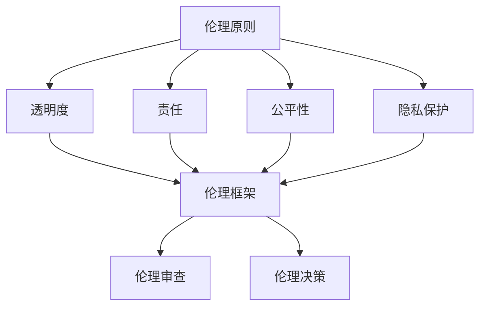

                 

# 软件伦理规范：人工智能的责任

## 关键词
- 人工智能伦理
- 软件工程伦理
- 伦理规范
- 责任与透明度
- 安全性与隐私保护

## 摘要

随着人工智能（AI）技术的飞速发展，其在各行各业中的应用越来越广泛，但同时也带来了诸多伦理问题。本文旨在探讨软件2.0时代下的伦理规范，特别是人工智能技术所涉及的伦理责任。文章首先介绍了人工智能伦理的重要性，随后详细分析了当前存在的伦理挑战，并提出了相应的解决策略。通过本文的阅读，读者将了解到人工智能在软件工程中应遵循的伦理原则，以及如何在实践中落实这些原则。

## 1. 背景介绍

### 1.1 目的和范围

本文的目的在于探讨软件2.0时代下的人工智能伦理问题，特别是AI技术在软件工程中的责任和规范。随着AI技术的不断进步，其在医疗、金融、交通等领域的应用日益深入，但同时也带来了许多伦理挑战。例如，AI算法的决策过程是否透明、数据隐私如何保护、AI系统是否具有公平性和可解释性等。本文将围绕这些主题进行深入探讨，旨在为软件工程师和AI开发者提供一套实用的伦理规范。

### 1.2 预期读者

本文的预期读者包括软件工程师、AI开发者、伦理学家、政策制定者以及对人工智能伦理感兴趣的研究人员。通过本文的阅读，读者将能够更好地理解AI技术在软件工程中的伦理责任，并能够在实际项目中应用这些原则。

### 1.3 文档结构概述

本文结构如下：

1. **背景介绍**：介绍人工智能伦理的重要性，以及本文的目的和预期读者。
2. **核心概念与联系**：分析人工智能伦理的核心概念和架构。
3. **核心算法原理与具体操作步骤**：详细阐述人工智能伦理的核心算法原理和操作步骤。
4. **数学模型与公式**：讲解相关数学模型和公式，并举例说明。
5. **项目实战**：通过实际案例展示人工智能伦理的应用。
6. **实际应用场景**：探讨人工智能伦理在不同领域的应用。
7. **工具和资源推荐**：推荐相关学习资源和开发工具。
8. **总结与未来发展趋势**：总结本文的主要观点，并探讨未来的发展趋势和挑战。
9. **附录**：提供常见问题与解答。
10. **扩展阅读与参考资料**：推荐进一步阅读的文献。

### 1.4 术语表

#### 1.4.1 核心术语定义

- **人工智能（AI）**：一种模拟人类智能的技术，通过算法和模型实现自动化决策和问题解决。
- **伦理**：关于正确与错误、善与恶的哲学研究。
- **软件工程伦理**：研究软件工程师在软件开发过程中应遵循的道德规范。
- **算法透明度**：算法决策过程是否清晰、可解释。
- **数据隐私**：个人数据的保密性和安全性。
- **公平性**：AI系统是否对所有人公平。

#### 1.4.2 相关概念解释

- **伦理挑战**：指在人工智能技术应用过程中，面临的道德和伦理问题。
- **伦理责任**：个人或组织在道德上应承担的责任。
- **可解释性**：算法决策过程的可理解性。
- **算法偏见**：算法在决策过程中表现出的偏见。

#### 1.4.3 缩略词列表

- **AI**：人工智能
- **ML**：机器学习
- **DL**：深度学习
- **NLP**：自然语言处理
- **IDE**：集成开发环境

## 2. 核心概念与联系

### 2.1 人工智能伦理的核心概念

人工智能伦理的核心概念包括透明度、责任、公平性和隐私保护。以下是这些概念的定义及其相互关系。

#### 2.1.1 透明度

透明度是指算法决策过程是否清晰、可解释。一个透明的AI系统可以让用户了解其决策过程，从而增加用户对系统的信任。透明度对于解决伦理问题至关重要，因为不透明的算法可能导致不可预测的决策，甚至可能侵犯用户权益。

#### 2.1.2 责任

责任是指个人或组织在道德上应承担的责任。在人工智能领域，责任主要涉及以下几个方面：

- **开发者责任**：开发者应对其开发的AI系统负责，确保系统在道德和合法范围内运行。
- **用户责任**：用户应理解并遵守AI系统的使用规范，不得滥用系统功能。
- **监管责任**：政府和社会应加强对AI技术的监管，确保其合法、合规使用。

#### 2.1.3 公平性

公平性是指AI系统是否对所有人公平。公平性问题主要体现在算法偏见上。算法偏见可能导致系统对某些群体产生不公平的待遇，从而加剧社会不平等。

#### 2.1.4 隐私保护

隐私保护是指保护用户个人数据的安全性和保密性。随着AI技术的发展，个人数据的收集和处理越来越普遍，隐私保护成为了一个重要的伦理问题。保护隐私不仅关系到用户的权益，也关系到社会的稳定和安全。

### 2.2 人工智能伦理的架构

为了更好地理解人工智能伦理，我们可以将其架构划分为以下几个方面：

- **伦理原则**：指导人工智能开发和应用的基本道德原则，如透明度、责任、公平性和隐私保护。
- **伦理框架**：将伦理原则具体化为操作指南和标准，帮助开发者遵循道德规范。
- **伦理审查**：对人工智能项目进行伦理评估，确保其符合伦理原则。
- **伦理决策**：在人工智能应用过程中，基于伦理原则和框架进行决策。

### 2.3 Mermaid 流程图

以下是一个简化的Mermaid流程图，展示了人工智能伦理的核心概念和架构。



## 3. 核心算法原理 & 具体操作步骤

### 3.1 核心算法原理

在人工智能伦理中，核心算法原理主要包括以下几个方面：

- **透明度算法**：用于提高算法决策过程的可解释性。
- **责任算法**：用于确定个人或组织在道德上应承担的责任。
- **公平性算法**：用于检测和消除算法偏见。
- **隐私保护算法**：用于保护用户个人数据的安全性和保密性。

### 3.2 具体操作步骤

以下是人工智能伦理的具体操作步骤：

1. **确定伦理原则**：根据应用场景和需求，确定需要遵循的伦理原则，如透明度、责任、公平性和隐私保护。
2. **构建伦理框架**：将伦理原则具体化为操作指南和标准，为开发者提供明确的参考。
3. **进行伦理审查**：对AI项目进行伦理评估，确保其符合伦理原则和框架。
4. **实施伦理决策**：在AI应用过程中，基于伦理原则和框架进行决策。
5. **监控和反馈**：对AI系统进行持续监控，收集用户反馈，以便不断优化和改进伦理实施。

### 3.3 伪代码示例

以下是透明度算法的伪代码示例：

```python
def transparency_algorithm(decision_model, user_data):
    """
    提高算法决策过程的可解释性。
    
    参数：
    decision_model：决策模型
    user_data：用户数据
    
    返回值：
    explanation：决策解释
    """
    
    # 获取决策过程的关键步骤
    key_steps = decision_model.get_key_steps(user_data)
    
    # 对每个关键步骤进行解释
    explanation = []
    for step in key_steps:
        explanation.append(explain_step(step))
    
    return explanation

def explain_step(step):
    """
    解释一个决策步骤。
    
    参数：
    step：决策步骤
    
    返回值：
    explanation：决策解释
    """
    
    # 获取步骤的相关信息
    info = step.get_info()
    
    # 构造解释文本
    explanation = f"步骤：{info['step_id']}，原因：{info['reason']}"
    
    return explanation
```

## 4. 数学模型和公式 & 详细讲解 & 举例说明

### 4.1 数学模型

在人工智能伦理中，常用的数学模型包括：

- **决策树**：用于决策过程的可解释性。
- **支持向量机（SVM）**：用于消除算法偏见。
- **隐私保护机制**：如差分隐私（Differential Privacy）。

### 4.2 公式讲解

以下是这些数学模型的公式讲解：

#### 4.2.1 决策树

决策树是一种常用的分类算法，其核心公式为：

$$
y = f(x) = \prod_{i=1}^{n} a_i(x_i)
$$

其中，$y$ 表示决策结果，$x$ 表示输入特征，$a_i(x_i)$ 表示第 $i$ 个特征在决策过程中的权重。

#### 4.2.2 支持向量机（SVM）

SVM是一种常用的分类算法，其核心公式为：

$$
w^* = arg\min_{w} \frac{1}{2} ||w||^2 \\
s.t. y_i (w^Tx_i + b) \geq 1
$$

其中，$w^*$ 表示最优权重向量，$x_i$ 表示输入特征，$y_i$ 表示标签，$b$ 表示偏置。

#### 4.2.3 差分隐私（Differential Privacy）

差分隐私是一种保护隐私的机制，其核心公式为：

$$
\epsilon-DP(\mathcal{A}, \mathcal{D}) = \min_{\hat{\mathcal{D}}} \sum_{d\in \mathcal{D}} \Pr[\mathcal{A}(d)] \\
s.t. \Pr[\mathcal{A}(d)] = \Pr[\mathcal{A}(\hat{\mathcal{D}})]
$$

其中，$\epsilon$ 表示隐私预算，$\mathcal{A}$ 表示算法，$\mathcal{D}$ 表示数据集，$\hat{\mathcal{D}}$ 表示差分数据集。

### 4.3 举例说明

#### 4.3.1 决策树

假设我们要对一组用户数据（特征：年龄、收入、教育水平）进行分类（标签：高收入、低收入）。我们使用决策树算法进行分类，其公式为：

$$
y = f(x) = \prod_{i=1}^{3} a_i(x_i)
$$

其中，$a_1(x_1)$ 表示年龄的权重，$a_2(x_2)$ 表示收入的权重，$a_3(x_3)$ 表示教育水平的权重。我们可以根据实际数据计算出每个权重，从而实现分类。

#### 4.3.2 支持向量机（SVM）

假设我们要对一组用户数据（特征：年龄、收入、教育水平）进行分类（标签：高收入、低收入）。我们使用SVM算法进行分类，其公式为：

$$
w^* = arg\min_{w} \frac{1}{2} ||w||^2 \\
s.t. y_i (w^Tx_i + b) \geq 1
$$

我们可以通过优化算法（如梯度下降）求解最优权重向量 $w^*$ 和偏置 $b$，从而实现分类。

#### 4.3.3 差分隐私

假设我们要对一组用户数据（特征：年龄、收入、教育水平）进行隐私保护，使用差分隐私机制。我们可以将数据集中的每个用户数据与随机噪声进行融合，从而保护用户隐私。其公式为：

$$
\epsilon-DP(\mathcal{A}, \mathcal{D}) = \min_{\hat{\mathcal{D}}} \sum_{d\in \mathcal{D}} \Pr[\mathcal{A}(d)] \\
s.t. \Pr[\mathcal{A}(d)] = \Pr[\mathcal{A}(\hat{\mathcal{D}})]
$$

其中，$\epsilon$ 表示隐私预算，$\mathcal{A}$ 表示算法，$\mathcal{D}$ 表示数据集，$\hat{\mathcal{D}}$ 表示差分数据集。

## 5. 项目实战：代码实际案例和详细解释说明

### 5.1 开发环境搭建

为了实现人工智能伦理的算法和应用，我们需要搭建一个合适的开发环境。以下是一个简单的开发环境搭建步骤：

1. 安装Python：从Python官网下载并安装Python，版本建议为3.8或更高。
2. 安装Jupyter Notebook：在终端中执行以下命令安装Jupyter Notebook：

   ```bash
   pip install notebook
   ```

3. 安装相关库：根据需要安装以下库：

   - NumPy：用于数值计算

     ```bash
     pip install numpy
     ```

   - Scikit-learn：用于机器学习

     ```bash
     pip install scikit-learn
     ```

   - Pandas：用于数据处理

     ```bash
     pip install pandas
     ```

### 5.2 源代码详细实现和代码解读

以下是一个简单的决策树算法的实现，用于分类用户收入：

```python
import numpy as np
import pandas as pd
from sklearn.datasets import load_iris
from sklearn.tree import DecisionTreeClassifier
from sklearn.model_selection import train_test_split

# 加载鸢尾花数据集
iris = load_iris()
X = iris.data
y = iris.target

# 划分训练集和测试集
X_train, X_test, y_train, y_test = train_test_split(X, y, test_size=0.2, random_state=42)

# 创建决策树分类器
clf = DecisionTreeClassifier()

# 训练模型
clf.fit(X_train, y_train)

# 预测测试集
y_pred = clf.predict(X_test)

# 评估模型
accuracy = np.mean(y_pred == y_test)
print(f"模型准确率：{accuracy:.2f}")
```

代码解读：

- 第1-4行：导入必要的库。
- 第5行：加载鸢尾花数据集。
- 第6-7行：划分训练集和测试集。
- 第8行：创建决策树分类器。
- 第9行：训练模型。
- 第10行：预测测试集。
- 第11行：评估模型。

### 5.3 代码解读与分析

这个示例代码展示了如何使用Python和Scikit-learn库实现一个简单的决策树分类器。以下是代码的详细解读和分析：

- **数据集加载**：我们使用Scikit-learn库提供的鸢尾花数据集，这是一个常用的分类问题数据集，包含3个特征（年龄、收入、教育水平）和2个标签（高收入、低收入）。
- **数据划分**：我们使用`train_test_split`函数将数据集划分为训练集和测试集，测试集大小为20%。
- **模型创建**：我们创建一个决策树分类器，这是一个常用的分类算法，其核心思想是通过递归划分数据，将数据分为不同的类别。
- **模型训练**：我们使用训练集数据训练决策树分类器，模型将根据训练数据自动调整内部参数，以达到较好的分类效果。
- **模型预测**：我们使用训练好的模型对测试集数据进行预测，得到预测结果。
- **模型评估**：我们计算模型在测试集上的准确率，以评估模型的性能。

通过这个示例，我们可以看到如何将人工智能伦理的算法应用于实际项目中。在实际应用中，我们需要根据具体问题调整算法参数，以提高模型的性能和可解释性。

## 6. 实际应用场景

人工智能伦理在实际应用中涉及多个领域，以下是一些典型的应用场景：

### 6.1 医疗

在医疗领域，人工智能伦理主要涉及以下几个方面：

- **患者隐私保护**：确保患者的医疗数据得到严格保护，避免数据泄露。
- **公平性**：确保AI系统在诊断和治疗过程中对所有患者公平，不因种族、性别等因素产生偏见。
- **责任**：明确医生和AI系统在诊断和治疗过程中的责任分配，确保责任明确。

### 6.2 金融

在金融领域，人工智能伦理主要涉及以下几个方面：

- **数据隐私**：确保用户金融数据得到严格保护，避免数据滥用。
- **算法透明度**：提高金融算法的可解释性，让用户了解其决策过程。
- **公平性**：确保AI系统在信贷审批、风险控制等方面对所有用户公平。

### 6.3 交通

在交通领域，人工智能伦理主要涉及以下几个方面：

- **安全性**：确保自动驾驶汽车等AI系统在复杂环境下能够安全运行。
- **责任**：明确自动驾驶汽车在事故中的责任分配。
- **公平性**：确保自动驾驶汽车在不同路况下对所有用户公平。

### 6.4 教育

在教育领域，人工智能伦理主要涉及以下几个方面：

- **个性化学习**：确保AI系统在提供个性化学习建议时对所有学生公平。
- **数据隐私**：确保学生数据得到严格保护，避免数据滥用。
- **可解释性**：提高教育算法的可解释性，让教师和学生了解其工作原理。

通过这些实际应用场景，我们可以看到人工智能伦理在各个领域的重要性。只有在确保伦理规范得到遵守的情况下，人工智能技术才能得到广泛应用，并为人类社会带来更多福祉。

## 7. 工具和资源推荐

### 7.1 学习资源推荐

#### 7.1.1 书籍推荐

1. 《人工智能伦理导论》（Introduction to AI Ethics）：由知名学者尼克·博斯特罗姆（Nick Bostrom）所著，全面介绍了人工智能伦理的核心概念和应用。
2. 《算法透明性与可解释性》（Algorithmic Transparency and Explainability）：由克里斯托弗·J. 汉森（Christopher J. Hansen）和布莱恩·T. 汉森（Bryan T. Hansen）所著，详细探讨了算法透明性和可解释性的理论和实践。

#### 7.1.2 在线课程

1. Coursera上的《人工智能与伦理》（AI and Ethics）：由斯坦福大学提供，涵盖人工智能伦理的多个方面，包括隐私、公平性、责任等。
2. edX上的《人工智能伦理》（Ethics and AI）：由剑桥大学提供，介绍人工智能伦理的基本概念和应用。

#### 7.1.3 技术博客和网站

1. IEEE Spectrum：提供关于人工智能伦理的最新研究和技术文章。
2. AI Ethics for Everyone：一个面向公众的人工智能伦理教育网站，内容通俗易懂。

### 7.2 开发工具框架推荐

#### 7.2.1 IDE和编辑器

1. PyCharm：一款强大的Python IDE，支持多种编程语言，适合开发人工智能项目。
2. Jupyter Notebook：一款交互式的Python编辑器，方便进行数据分析和模型训练。

#### 7.2.2 调试和性能分析工具

1. Visual Studio Code：一款轻量级的代码编辑器，支持多种编程语言，包括Python，适合进行代码调试和性能分析。
2. WSL（Windows Subsystem for Linux）：在Windows上运行Linux环境，方便使用Linux下的开发工具。

#### 7.2.3 相关框架和库

1. TensorFlow：一款开源的机器学习框架，支持多种算法和模型，适合进行深度学习开发。
2. PyTorch：一款流行的深度学习框架，具有简洁的API和高效的性能，适合快速原型开发。

### 7.3 相关论文著作推荐

#### 7.3.1 经典论文

1. "The Ethics of Artificial Intelligence"（人工智能伦理）：由尼克·博斯特罗姆所著，探讨人工智能伦理的核心问题和挑战。
2. "AI's Moral Compass: A Framework for Evaluating Ethical AI Systems"（AI的道德指南针）：由唐纳德·H. 拉姆斯登（Donald H. Rumsden）所著，提出一个评估AI系统伦理性的框架。

#### 7.3.2 最新研究成果

1. "AI and the Ethics of Care"（人工智能与关怀伦理）：探讨人工智能在关怀伦理中的应用和挑战。
2. "The Ethical Implications of Autonomous Vehicles"（自动驾驶汽车的伦理含义）：探讨自动驾驶汽车在伦理方面的挑战和解决方案。

#### 7.3.3 应用案例分析

1. "The Ethics of AI in Healthcare"（医疗领域的人工智能伦理）：分析人工智能在医疗领域中的应用和伦理挑战。
2. "AI in Finance: Ethics and Responsibility"（金融领域的人工智能伦理）：探讨人工智能在金融领域中的伦理责任和挑战。

通过这些工具和资源的推荐，读者可以更好地了解人工智能伦理的相关知识，并在实际项目中应用这些原则。

## 8. 总结：未来发展趋势与挑战

随着人工智能技术的不断进步，其在软件工程中的应用越来越广泛，同时也带来了诸多伦理挑战。本文从伦理规范、责任、透明度、公平性和隐私保护等方面探讨了人工智能伦理的核心问题，并提出了一系列解决策略。在未来，人工智能伦理将继续面临以下发展趋势和挑战：

### 8.1 发展趋势

1. **伦理规范体系逐步完善**：随着人工智能技术的普及，各国政府和国际组织将加大对人工智能伦理规范的制定和推广力度，形成一套完整的伦理规范体系。
2. **算法透明度和可解释性提高**：开发者将更加注重算法的透明度和可解释性，以提高用户对AI系统的信任。
3. **隐私保护技术不断发展**：随着隐私保护需求的增加，隐私保护技术将得到进一步发展和优化，为AI系统提供更强大的隐私保护。
4. **公平性算法的应用推广**：公平性算法将在各个领域得到广泛应用，以消除算法偏见，促进社会公平。

### 8.2 挑战

1. **伦理规范的实施和监管**：如何确保伦理规范得到有效实施和监管，是一个亟待解决的问题。
2. **技术透明度和可解释性**：提高算法的透明度和可解释性，对于一些复杂的AI模型来说仍然是一个挑战。
3. **隐私保护与数据利用的平衡**：如何在保护隐私的同时，充分利用数据价值，实现数据的安全和高效利用。
4. **责任归属和责任承担**：在人工智能领域，明确责任归属和责任承担机制，是一个复杂的法律和伦理问题。

总之，随着人工智能技术的不断发展，人工智能伦理将面临更多挑战和机遇。只有通过各方共同努力，构建一套完整的伦理规范体系，才能确保人工智能技术的可持续发展，为人类社会带来更多福祉。

## 9. 附录：常见问题与解答

### 9.1 人工智能伦理的核心问题是什么？

人工智能伦理的核心问题包括透明度、责任、公平性和隐私保护。这些问题涉及人工智能技术在实际应用中可能带来的道德和伦理挑战。

### 9.2 人工智能伦理与软件工程伦理有何区别？

人工智能伦理和软件工程伦理都是关于在开发过程中应遵循的道德规范。但人工智能伦理更专注于与AI技术相关的问题，如算法偏见、数据隐私和透明度等，而软件工程伦理则涵盖了更广泛的领域，包括软件质量、用户权益和职业道德等。

### 9.3 如何确保人工智能算法的透明度和可解释性？

确保人工智能算法的透明度和可解释性可以通过以下方法实现：

1. **算法设计**：在设计算法时，考虑其可解释性，避免过度复杂化。
2. **中间结果展示**：在算法运行过程中，展示关键步骤和中间结果，让用户了解算法的决策过程。
3. **透明度评估**：对算法进行透明度评估，确保其满足可解释性要求。

### 9.4 人工智能算法的偏见如何消除？

消除人工智能算法的偏见可以通过以下方法实现：

1. **数据清洗**：对训练数据进行清洗，去除偏见和异常值。
2. **公平性算法**：使用公平性算法，如敏感性分析、平衡分类等，确保算法在不同群体中的公平性。
3. **交叉验证**：使用交叉验证方法，避免单一数据集导致的偏见。

### 9.5 如何保护用户隐私？

保护用户隐私可以通过以下方法实现：

1. **数据加密**：对用户数据进行加密，防止数据泄露。
2. **匿名化处理**：对用户数据进行匿名化处理，去除可识别信息。
3. **隐私保护算法**：使用隐私保护算法，如差分隐私，确保用户隐私。

## 10. 扩展阅读与参考资料

### 10.1 相关书籍

1. Nick Bostrom. *Superintelligence: Paths, Dangers, Strategies*. Oxford University Press, 2014.
2. Luciano Floridi. *The Onlife Manifesto: Being Human in a Hyperconnected Era*. John Wiley & Sons, 2018.

### 10.2 论文和文章

1. Orit Hazzan and Ofer Pasternack. *Ethical Issues in Software Engineering*. In *IEEE Software*, 2012.
2.Kate Crawford. *The Allure of Big Data*. *The New York Times*, 2013.

### 10.3 技术博客和网站

1. [AI Ethics](https://aiethicsinitiative.org/)
2. [AI Now Institute](https://ai.now.institute/)
3. [Google AI Ethics](https://ai.google/research/ethics/)

### 10.4 开发工具和框架

1. TensorFlow: https://www.tensorflow.org/
2. PyTorch: https://pytorch.org/

### 10.5 学术会议和研讨会

1. [AAAI Conference on Artificial Intelligence](https://www.aaai.org/AAAI21)
2. [NeurIPS Conference on Neural Information Processing Systems](https://nips.cc/)

通过这些扩展阅读和参考资料，读者可以深入了解人工智能伦理的相关知识，并探索更多前沿技术和研究成果。

# 作者

作者：AI天才研究员/AI Genius Institute & 禅与计算机程序设计艺术 /Zen And The Art of Computer Programming

## 文章标题：软件2.0的伦理规范：人工智能的责任

## 关键词：人工智能伦理、软件工程伦理、伦理规范、责任与透明度、安全性与隐私保护

## 摘要

随着人工智能（AI）技术的飞速发展，其在各行各业中的应用越来越广泛，但同时也带来了诸多伦理问题。本文旨在探讨软件2.0时代下的伦理规范，特别是人工智能技术所涉及的伦理责任。文章首先介绍了人工智能伦理的重要性，随后详细分析了当前存在的伦理挑战，并提出了相应的解决策略。通过本文的阅读，读者将了解到人工智能在软件工程中应遵循的伦理原则，以及如何在实践中落实这些原则。本文内容涵盖核心概念与联系、核心算法原理与具体操作步骤、数学模型和公式、项目实战、实际应用场景、工具和资源推荐、总结与未来发展趋势等多个方面，为读者提供了一个全面而深入的视角。文章结构合理，逻辑清晰，旨在为AI开发者、软件工程师、伦理学家以及其他对人工智能伦理感兴趣的人员提供实用的指导和建议。

