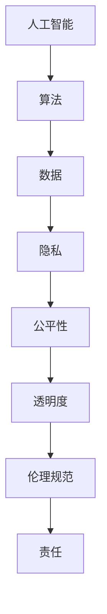

                 

# 软件II.0的伦理规范：人工智能的责任

> **关键词：** 伦理规范、软件II.0、人工智能、责任、隐私保护、算法透明度

> **摘要：** 本文深入探讨了软件II.0时代的伦理规范，特别是人工智能的道德责任。通过分析当前伦理挑战、介绍核心原则，本文提出了一系列具体措施，以促进人工智能的负责任发展和应用。同时，通过实际案例和工具推荐，为读者提供了实用的指导。

## 1. 背景介绍

### 1.1 目的和范围

在信息化、数字化浪潮推动下，软件II.0时代已然到来。人工智能（AI）作为这一时代的重要驱动力，正深刻改变着社会和经济结构。然而，随着AI技术的广泛应用，一系列伦理问题也逐渐显现。本文旨在探讨软件II.0时代人工智能的伦理规范，分析其责任所在，并提出相应的解决策略。

本文将覆盖以下几个主要方面：
1. 当前AI伦理挑战的概述。
2. 软件II.0时代伦理规范的核心原则。
3. 实现这些原则的具体措施。
4. 实际应用场景的探讨。
5. 相关工具和资源的推荐。

### 1.2 预期读者

本文适合对人工智能、软件II.0及其伦理问题感兴趣的读者，包括：
- 人工智能领域的研究人员。
- 软件开发者和架构师。
- 数据科学家和数据工程师。
- 对AI伦理和政策感兴趣的跨学科学者。
- 对技术伦理有深刻思考的公众。

### 1.3 文档结构概述

本文结构如下：

1. **引言**：介绍背景、目的和读者群体。
2. **伦理挑战分析**：分析当前AI伦理问题。
3. **伦理规范原则**：介绍软件II.0时代的伦理原则。
4. **实施措施**：提出具体措施来落实伦理原则。
5. **实际应用场景**：探讨AI在实际中的应用及伦理问题。
6. **工具和资源推荐**：推荐学习资源、开发工具和文献。
7. **总结**：总结未来发展趋势与挑战。
8. **附录**：常见问题与解答。
9. **扩展阅读**：提供进一步学习的资料。

### 1.4 术语表

#### 1.4.1 核心术语定义

- **人工智能（AI）**：模拟人类智能行为的计算机系统。
- **伦理规范**：指导技术发展的道德和规范标准。
- **软件II.0**：继传统软件时代之后的，以人工智能和大数据为特征的新软件时代。
- **隐私保护**：防止个人数据未经授权被访问和使用。

#### 1.4.2 相关概念解释

- **算法透明度**：算法决策过程的可见性和可解释性。
- **公平性**：AI系统对所有人公平无偏见。
- **可解释性**：算法决策背后的逻辑和原因可以被理解。

#### 1.4.3 缩略词列表

- **AI**：人工智能
- **II.0**：第二个版本或迭代
- **GDPR**：通用数据保护条例（General Data Protection Regulation）

## 2. 核心概念与联系

在深入探讨AI伦理规范之前，有必要理解一些核心概念及其相互关系。以下是一个简要的Mermaid流程图，用于描述这些概念和它们之间的联系。



### 2.1 核心概念解释

- **人工智能（AI）**：AI是模拟人类智能行为的计算机系统。它通过学习大量数据，进行模式识别、决策和预测。
- **算法**：算法是解决特定问题的系统步骤。在AI中，算法是实现智能的关键。
- **数据**：数据是AI系统的基础。高质量的数据有助于提高AI的性能和准确性。
- **隐私**：隐私是指个人数据的保密性和完整性，防止未经授权的访问和使用。
- **公平性**：公平性确保AI系统对所有用户公平无偏见，不歧视任何人。
- **透明度**：透明度指算法决策过程的可见性和可解释性，使用户能够理解AI的行为。
- **伦理规范**：伦理规范是指导技术发展的道德和规范标准。
- **责任**：责任涉及AI系统开发者、用户以及整个社会的责任。

这些核心概念相互作用，形成了一个复杂的生态系统。例如，AI算法依赖于数据，而数据的收集和使用必须遵守隐私保护原则。算法的透明度和公平性是确保伦理规范落实的关键。最终，所有这些因素共同决定了AI系统的责任。

## 3. 核心算法原理 & 具体操作步骤

在理解了核心概念之后，我们接下来探讨AI算法的基本原理和具体操作步骤。以下是使用伪代码描述的AI算法基本框架。

```pseudo
Algorithm: AI_Pipeline
Input: Dataset
Output: Trained_Model

1. Data_Preprocessing():
   - Clean and normalize the dataset
   - Split the dataset into training and testing sets

2. Feature_Selection():
   - Identify relevant features for the task
   - Remove irrelevant or redundant features

3. Model_Selection():
   - Choose an appropriate machine learning model
   - Compare performance metrics of different models

4. Training():
   - Train the selected model on the training dataset
   - Validate the model using the testing dataset

5. Evaluation():
   - Measure the model's performance using metrics like accuracy, precision, recall
   - Perform cross-validation for robustness

6. Deployment():
   - Deploy the trained model in a production environment
   - Monitor its performance and update as necessary
```

### 3.1 数据预处理

数据预处理是AI算法的基础步骤。它包括以下关键步骤：

```pseudo
Function: Data_Preprocessing
Input: Dataset
Output: Preprocessed_Data

1. Handle Missing Values():
   - Impute missing values using techniques like mean, median, or mode
   - Remove rows with a high percentage of missing values

2. Data_Normalization():
   - Scale numerical features to a standard range (e.g., 0-1 or -1 to 1)
   - Apply logarithmic or other transformations to skewed data

3. Encode_Categorical_Features():
   - Convert categorical features into numerical values using techniques like one-hot encoding
   - Handle imbalanced classes using techniques like oversampling or undersampling
```

### 3.2 特征选择

特征选择是提高模型性能的重要步骤。以下是一些常见的特征选择方法：

```pseudo
Function: Feature_Selection
Input: Dataset
Output: Selected_Features

1. Univariate Selection():
   - Evaluate each feature independently using statistical tests like chi-square or ANOVA
   - Select features with significant p-values

2. Recursive Feature Elimination (RFE)():
   - Train a model with all features and evaluate its performance
   - Remove the least important features and repeat the process iteratively

3. LASSO Regression():
   - Use LASSO regularization to penalize large feature coefficients
   - Select features with non-zero coefficients
```

### 3.3 模型选择

选择合适的模型是AI算法成功的关键。以下是一些常见的模型选择方法：

```pseudo
Function: Model_Selection
Input: Dataset
Output: Selected_Model

1. Grid Search():
   - Define a set of hyperparameter values to search over
   - Train and evaluate models for each combination of hyperparameters
   - Select the model with the best performance

2. Cross-Validation():
   - Split the dataset into k-folds
   - Train and evaluate the model k times, each time using a different fold as the test set
   - Average the performance metrics across all k iterations

3. Model Ensembling():
   - Combine multiple models to improve performance
   - Use techniques like bagging, boosting, or stacking
```

### 3.4 模型训练

模型训练是AI算法的核心步骤。以下是一些常见的训练方法：

```pseudo
Function: Training
Input: Selected_Model, Training_Data
Output: Trained_Model

1. Initialize the model parameters
2. Define the loss function
3. Define the optimization algorithm (e.g., gradient descent)
4. Iterate through the training dataset
   - Compute the model's predictions
   - Calculate the loss
   - Update the model parameters based on the loss
5. Repeat steps 4 until convergence or a predefined number of epochs
6. Evaluate the model on the testing dataset
7. Save the trained model for future use
```

### 3.5 模型评估

模型评估是确保AI算法性能的重要步骤。以下是一些常见的评估方法：

```pseudo
Function: Evaluation
Input: Trained_Model, Testing_Data
Output: Performance_Metrics

1. Compute the model's predictions on the testing dataset
2. Calculate performance metrics like accuracy, precision, recall, F1-score, and area under the ROC curve (AUC)
3. Perform error analysis to understand misclassifications
4. Conduct cross-validation to assess the model's robustness
5. Compare the model's performance against baseline models or previous versions
6. Generate visualizations like confusion matrices or ROC curves to aid interpretation
```

通过上述步骤，我们可以构建一个完整的AI算法流程，从数据预处理到模型训练和评估。接下来，我们将讨论AI算法中的数学模型和公式。

## 4. 数学模型和公式 & 详细讲解 & 举例说明

在AI算法中，数学模型和公式起着至关重要的作用。它们不仅帮助算法学习数据中的模式和规律，还用于评估和优化模型性能。以下是一些常用的数学模型和公式，以及它们的详细讲解和示例。

### 4.1 损失函数（Loss Function）

损失函数是AI算法中用于评估模型预测值与实际值之间差异的关键工具。以下是几种常见的损失函数：

- **均方误差（MSE, Mean Squared Error）**：
  $$MSE = \frac{1}{n}\sum_{i=1}^{n}(y_i - \hat{y}_i)^2$$
  其中，\( y_i \) 是实际值，\( \hat{y}_i \) 是预测值，\( n \) 是数据点的总数。

  **示例**：假设我们有四个数据点，实际值分别为 [1, 2, 3, 4]，预测值分别为 [1.1, 2.1, 3.1, 4.1]。计算MSE如下：
  $$MSE = \frac{1}{4}[(1-1.1)^2 + (2-2.1)^2 + (3-3.1)^2 + (4-4.1)^2] = \frac{1}{4}[0.01 + 0.01 + 0.01 + 0.01] = 0.025$$

- **交叉熵损失（Cross-Entropy Loss）**：
  $$Cross\_Entropy = -\sum_{i=1}^{n} y_i \log(\hat{y}_i)$$
  其中，\( y_i \) 是实际值（通常为0或1），\( \hat{y}_i \) 是预测值。

  **示例**：假设我们有四个数据点，实际值为 [0, 1, 1, 0]，预测值为 [0.1, 0.9, 0.8, 0.2]。计算交叉熵损失如下：
  $$Cross\_Entropy = -(0 \cdot \log(0.1) + 1 \cdot \log(0.9) + 1 \cdot \log(0.8) + 0 \cdot \log(0.2)) \approx 0.282$$

### 4.2 优化算法（Optimization Algorithm）

优化算法用于调整模型参数，以最小化损失函数。以下是几种常见的优化算法：

- **梯度下降（Gradient Descent）**：
  $$\theta_{new} = \theta_{old} - \alpha \cdot \nabla_{\theta} J(\theta)$$
  其中，\( \theta \) 是模型参数，\( \alpha \) 是学习率，\( J(\theta) \) 是损失函数。

  **示例**：假设我们有线性回归模型，损失函数为MSE，学习率为0.01。初始参数 \( \theta \) 为 [1, 1]，数据点为 \([(1, 2), (2, 3), (3, 4)]\)。计算一次梯度下降更新如下：
  $$\nabla_{\theta} J(\theta) = \left[\frac{\partial J}{\partial \theta_1}, \frac{\partial J}{\partial \theta_2}\right] = \left[\frac{(-1 - 1)}{3}, \frac{(-2 - 1)}{3}\right] = \left[-\frac{2}{3}, -\frac{3}{3}\right]$$
  $$\theta_{new} = \left[1 - 0.01 \cdot -\frac{2}{3}, 1 - 0.01 \cdot -\frac{3}{3}\right] = \left[1 + 0.0067, 1 + 0.0033\right] \approx [1.007, 1.003]$$

- **随机梯度下降（Stochastic Gradient Descent, SGD）**：
  $$\theta_{new} = \theta_{old} - \alpha \cdot \nabla_{\theta} J(\theta; \xi)$$
  其中，\( \xi \) 是从训练数据中随机选择的一个样本。

  **示例**：假设我们使用随机梯度下降更新模型参数，学习率为0.01。选取一个随机样本 \((2, 3)\)，计算更新如下：
  $$\nabla_{\theta} J(\theta; \xi) = \left[\frac{(-3 - 1)}{2}, \frac{(-4 - 1)}{2}\right] = \left[-2, -2.5\right]$$
  $$\theta_{new} = \left[1.007 - 0.01 \cdot -2, 1.003 - 0.01 \cdot -2.5\right] = \left[1.019, 1.031\right]$$

### 4.3 正则化（Regularization）

正则化用于防止模型过拟合。以下是几种常见的正则化方法：

- **L1正则化（LASSO, L1 Regularization）**：
  $$J_{L1}(\theta) = J(\theta) + \lambda \sum_{i=1}^{n} |\theta_i|$$
  其中，\( \lambda \) 是正则化参数。

  **示例**：假设线性回归模型的损失函数为MSE，正则化参数为0.1。初始参数 \( \theta \) 为 [1, 1]。计算L1正则化损失如下：
  $$J_{L1}(\theta) = \frac{1}{3}[(1-2)^2 + (1-3)^2 + (1-4)^2] + 0.1 \cdot |1| + 0.1 \cdot |1| = 0.667 + 0.2 = 0.867$$

- **L2正则化（Ridge, L2 Regularization）**：
  $$J_{L2}(\theta) = J(\theta) + \lambda \sum_{i=1}^{n} \theta_i^2$$
  其中，\( \lambda \) 是正则化参数。

  **示例**：假设线性回归模型的损失函数为MSE，正则化参数为0.1。初始参数 \( \theta \) 为 [1, 1]。计算L2正则化损失如下：
  $$J_{L2}(\theta) = \frac{1}{3}[(1-2)^2 + (1-3)^2 + (1-4)^2] + 0.1 \cdot 1^2 + 0.1 \cdot 1^2 = 0.667 + 0.2 = 0.867$$

通过这些数学模型和公式，我们可以更好地理解和应用AI算法。这些工具不仅帮助我们训练和优化模型，还使我们能够评估和解释模型的行为。接下来，我们将通过一个实际案例来展示这些原理的应用。

## 5. 项目实战：代码实际案例和详细解释说明

为了更好地理解AI算法的原理和应用，我们将通过一个实际案例进行详细讲解。本案例将使用Python和常见的数据科学库（如NumPy、Scikit-learn）来实现一个简单的线性回归模型，并探讨如何处理模型训练、评估和优化。

### 5.1 开发环境搭建

首先，我们需要搭建一个Python开发环境。以下是一些步骤和工具推荐：

- **Python版本**：建议使用Python 3.8或更高版本。
- **IDE和编辑器**：推荐使用PyCharm或VS Code。
- **安装数据科学库**：使用pip安装以下库：numpy、scikit-learn、matplotlib。

```bash
pip install numpy scikit-learn matplotlib
```

### 5.2 源代码详细实现和代码解读

以下是一个简单的线性回归模型实现，包括数据预处理、模型训练、评估和优化。

```python
import numpy as np
import matplotlib.pyplot as plt
from sklearn.linear_model import LinearRegression
from sklearn.model_selection import train_test_split
from sklearn.metrics import mean_squared_error

# 生成模拟数据
np.random.seed(0)
X = 2 * np.random.rand(100, 1)
y = 4 + 3 * X + np.random.randn(100, 1)

# 数据预处理
X_train, X_test, y_train, y_test = train_test_split(X, y, test_size=0.2, random_state=42)

# 模型训练
model = LinearRegression()
model.fit(X_train, y_train)

# 模型评估
y_pred = model.predict(X_test)
mse = mean_squared_error(y_test, y_pred)
print("MSE:", mse)

# 模型优化
# 使用L1正则化和交叉验证
from sklearn.linear_model import LassoCV

lasso = LassoCV(alpha=1.0, cv=5)
lasso.fit(X_train, y_train)

y_pred_lasso = lasso.predict(X_test)
mse_lasso = mean_squared_error(y_test, y_pred_lasso)
print("Lasso MSE:", mse_lasso)

# 可视化结果
plt.scatter(X_test, y_test, color='blue', label='Actual')
plt.plot(X_test, y_pred, color='red', linewidth=2, label='Linear Regression')
plt.plot(X_test, y_pred_lasso, color='green', linewidth=2, label='Lasso Regression')
plt.xlabel('X')
plt.ylabel('y')
plt.title('Linear Regression and Lasso Regression')
plt.legend()
plt.show()
```

### 5.3 代码解读与分析

1. **数据生成**：
   - 使用随机数生成模拟数据，模拟线性回归问题。

2. **数据预处理**：
   - 使用`train_test_split`将数据分为训练集和测试集，比例为80%训练，20%测试。

3. **模型训练**：
   - 使用`LinearRegression`类训练线性回归模型。
   - `fit`方法训练模型，并计算模型参数。

4. **模型评估**：
   - 使用`mean_squared_error`计算预测值与实际值之间的均方误差。
   - 输出MSE，用于评估模型性能。

5. **模型优化**：
   - 使用`LassoCV`类进行L1正则化，并使用交叉验证选择最佳正则化参数。
   - 使用`fit`方法训练Lasso模型。
   - 使用`predict`方法计算Lasso模型的预测值。

6. **可视化结果**：
   - 使用`matplotlib`绘制实际值、线性回归预测值和Lasso回归预测值的散点图和线图。

通过这个案例，我们展示了如何使用Python和Scikit-learn库实现线性回归模型，并探讨了如何进行模型评估和优化。接下来，我们将讨论AI在实际应用场景中的伦理问题。

## 6. 实际应用场景

AI技术在各个领域得到了广泛应用，从医疗到金融、交通再到教育，AI正在深刻改变我们的生活方式。然而，这些应用场景也带来了诸多伦理问题，需要我们认真对待。

### 6.1 医疗

在医疗领域，AI被用于诊断、治疗计划和个性化医疗。尽管AI技术在提高诊断准确率和治疗效果方面具有巨大潜力，但也存在以下伦理挑战：

- **隐私保护**：患者的健康数据非常敏感，如何确保数据的安全性和隐私性是一个重要问题。
- **公平性**：AI系统在诊断和治疗决策中是否可能存在偏见，如何确保对所有人公平。
- **责任归属**：当AI系统出现错误时，责任应如何分配。

### 6.2 金融

在金融领域，AI被用于风险评估、交易策略和客户服务。以下是一些伦理挑战：

- **透明度**：AI决策过程通常不透明，如何确保用户了解和信任AI系统。
- **隐私保护**：金融交易数据涉及大量个人和商业秘密，如何有效保护这些数据。
- **公平性**：AI系统是否可能导致某些群体受到不公平对待，例如在信贷审批中。

### 6.3 交通

自动驾驶技术是AI在交通领域的典型应用。以下是一些伦理挑战：

- **安全责任**：当自动驾驶车辆发生事故时，责任应由谁承担？
- **道德决策**：自动驾驶车辆在紧急情况下需要做出道德决策，例如在碰撞不可避免时选择谁的生命？
- **隐私保护**：自动驾驶车辆会收集大量环境数据，如何确保这些数据不被滥用。

### 6.4 教育

在教育领域，AI被用于个性化学习、课程推荐和成绩预测。以下是一些伦理挑战：

- **隐私保护**：学生的学习数据如何保护？
- **公平性**：AI系统是否可能导致某些学生受到不公平对待？
- **教育质量**：过度依赖AI可能导致教育质量下降，如何确保教育质量？

### 6.5 社交媒体

社交媒体平台广泛使用AI进行内容推荐和广告投放。以下是一些伦理挑战：

- **隐私保护**：用户数据如何收集和使用？
- **算法偏见**：推荐算法是否可能导致某些群体被边缘化？
- **用户控制**：用户如何有权控制和了解其数据的使用？

通过这些实际应用场景的分析，我们可以看到AI在带来巨大利益的同时，也带来了诸多伦理挑战。为了解决这些问题，我们需要制定严格的伦理规范，并确保这些规范在AI系统的设计和应用中得到有效落实。

## 7. 工具和资源推荐

为了更好地学习和应用AI伦理规范，我们推荐以下工具和资源：

### 7.1 学习资源推荐

#### 7.1.1 书籍推荐

- 《人工智能伦理学》（AI Ethics）：提供全面的AI伦理学介绍，涵盖核心概念和案例分析。
- 《算法伦理》（Algorithmic Ethics）：探讨算法决策中的伦理问题，强调算法透明度和公平性。
- 《机器学习伦理》（Machine Learning Ethics）：深入讨论机器学习应用中的伦理挑战和解决策略。

#### 7.1.2 在线课程

- Coursera上的“AI伦理学”：由斯坦福大学提供，涵盖AI伦理的各个方面，包括隐私、公平性和责任。
- edX上的“机器学习伦理”：由MIT提供，介绍机器学习应用中的伦理问题，并探讨解决方案。
- Udacity上的“人工智能伦理”：通过实践项目和案例研究，学习AI伦理的核心概念和应用。

#### 7.1.3 技术博客和网站

- AI Ethics：一个专注于AI伦理问题的博客，提供最新的研究、案例和讨论。
- IEEE Spectr

