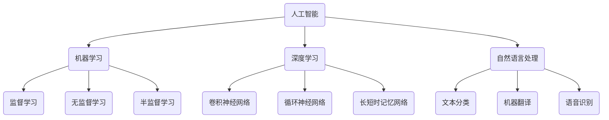

                 

# 软件二代的哲学思考：人工智能的本质

> **关键词**：软件 2.0、人工智能、哲学思考、本质、未来趋势
> 
> **摘要**：本文旨在探讨软件 2.0 时代背景下，人工智能的本质及其哲学思考。我们将从背景介绍、核心概念与联系、核心算法原理、数学模型与公式、项目实战、实际应用场景等多个方面展开论述，旨在为读者呈现一幅人工智能领域的全景图，并思考其未来发展。

## 1. 背景介绍

### 1.1 目的和范围

本文的目的是深入探讨软件 2.0 时代下人工智能的本质及其哲学思考。我们将通过分析人工智能的历史、核心概念、算法原理、数学模型和实际应用场景，试图揭示人工智能在技术、社会和哲学层面的本质。

本文将主要讨论以下内容：

1. 软件二代的哲学思考
2. 人工智能的核心概念与联系
3. 人工智能的核心算法原理与具体操作步骤
4. 人工智能的数学模型和公式
5. 人工智能的实际应用场景
6. 人工智能的未来发展趋势与挑战

### 1.2 预期读者

本文适合对人工智能、软件技术有一定了解的读者，包括程序员、软件工程师、人工智能研究人员、计算机科学学生以及对人工智能感兴趣的爱好者。通过本文，读者将能够了解人工智能的本质、核心技术和未来趋势，从而更好地把握这一领域的发展方向。

### 1.3 文档结构概述

本文共分为十个部分，具体结构如下：

1. 背景介绍
   - 目的和范围
   - 预期读者
   - 文档结构概述
2. 核心概念与联系
   - 人工智能的历史与发展
   - 人工智能的核心概念与联系
   - 人工智能的架构与分类
3. 核心算法原理与具体操作步骤
   - 机器学习算法原理
   - 深度学习算法原理
   - 强化学习算法原理
4. 数学模型和公式
   - 人工智能中的数学模型
   - 概率论与信息论
   - 神经网络的数学模型
5. 项目实战：代码实际案例和详细解释说明
   - 数据预处理
   - 模型训练与优化
   - 预测与评估
6. 实际应用场景
   - 人工智能在工业领域的应用
   - 人工智能在医疗领域的应用
   - 人工智能在金融领域的应用
7. 工具和资源推荐
   - 学习资源推荐
   - 开发工具框架推荐
   - 相关论文著作推荐
8. 总结：未来发展趋势与挑战
   - 技术发展趋势
   - 社会挑战与伦理问题
9. 附录：常见问题与解答
10. 扩展阅读 & 参考资料

### 1.4 术语表

#### 1.4.1 核心术语定义

- 软件二代：指的是软件从 1.0 时代（结构化编程）到 2.0 时代（面向对象编程）的演进，2.0 时代的软件更注重组件化、模块化、可重用性。
- 人工智能：指的是使计算机具有智能行为的技术，包括机器学习、深度学习、自然语言处理等。
- 机器学习：指的是让计算机通过数据学习，从而实现对未知数据的预测和决策。
- 深度学习：指的是一种特殊的机器学习方法，通过多层神经网络对大量数据进行学习。
- 强化学习：指的是通过奖励机制让计算机学习如何做出最佳决策。

#### 1.4.2 相关概念解释

- 神经网络：指的是一种由大量神经元组成的计算模型，用于模拟生物神经网络。
- 数据预处理：指的是在机器学习过程中对数据进行清洗、归一化等操作，以提高模型性能。
- 预测：指的是根据已知数据预测未知数据的趋势和规律。
- 评估：指的是对模型的性能进行评估，以确定其准确性和可靠性。

#### 1.4.3 缩略词列表

- AI：人工智能
- ML：机器学习
- DL：深度学习
- RL：强化学习
- CNN：卷积神经网络
- RNN：循环神经网络
- LSTM：长短时记忆网络

## 2. 核心概念与联系

在探讨人工智能的本质之前，我们需要了解人工智能的核心概念及其相互联系。以下是一个简化的 Mermaid 流程图，用于展示人工智能的核心概念和架构。



### 2.1 人工智能的历史与发展

人工智能（AI）起源于 20 世纪 50 年代，当时计算机科学家们开始尝试让计算机模拟人类智能行为。早期的 AI 主要基于符号推理和规则系统，这种方式在解决特定问题时表现出色，但在面对复杂、不确定的任务时却显得力不从心。

随着计算能力的提升和大数据技术的发展，机器学习（ML）逐渐成为人工智能的主流方法。机器学习通过算法让计算机从数据中自动学习规律和模式，从而实现智能行为。深度学习（DL）作为机器学习的一种重要分支，通过多层神经网络对大量数据进行学习，取得了令人瞩目的成果。

近年来，人工智能在自然语言处理（NLP）、计算机视觉、语音识别等领域取得了重大突破，为人类生活带来了深远的影响。

### 2.2 人工智能的核心概念与联系

#### 2.2.1 机器学习

机器学习是一种让计算机从数据中学习规律和模式的技术。根据学习方式，机器学习可以分为以下几类：

1. 监督学习：通过已有数据的学习，建立一个模型，然后使用这个模型对未知数据进行预测。
2. 无监督学习：没有已知的标签数据，通过学习数据之间的内在结构，对数据进行分类或降维。
3. 半监督学习：同时包含有标签和无标签数据，通过结合两者来提高学习效果。

#### 2.2.2 深度学习

深度学习是一种特殊的机器学习方法，通过多层神经网络对大量数据进行学习。深度学习在图像识别、语音识别、自然语言处理等领域取得了显著成果。常见的深度学习模型包括：

1. 卷积神经网络（CNN）：适用于图像识别和计算机视觉任务。
2. 循环神经网络（RNN）：适用于序列数据处理，如语音识别、机器翻译等。
3. 长短时记忆网络（LSTM）：是 RNN 的一种改进，解决了长序列记忆问题。

#### 2.2.3 自然语言处理

自然语言处理是一种让计算机理解和生成人类语言的技术。自然语言处理的主要任务包括：

1. 文本分类：对文本进行分类，如情感分析、主题分类等。
2. 机器翻译：将一种语言的文本翻译成另一种语言。
3. 语音识别：将语音信号转换成文本。

### 2.3 人工智能的架构与分类

人工智能的架构可以从不同角度进行分类，如基于技术、应用领域等。以下是一种常见的分类方式：

1. 基于技术分类：

   - 符号主义人工智能：基于符号推理和知识表示，如专家系统。
   - 统计学习人工智能：基于概率统计和机器学习，如深度学习。
   - 仿真主义人工智能：通过仿真生物大脑实现智能，如神经科学、认知科学等。

2. 基于应用领域分类：

   - 工业自动化：如机器人、自动化生产线等。
   - 医疗保健：如疾病诊断、手术规划等。
   - 金融理财：如风险控制、量化交易等。
   - 智能交通：如自动驾驶、智能交通管理等。

通过以上对人工智能核心概念与联系的分析，我们可以更深入地理解人工智能的本质及其在各个领域的应用。接下来，我们将进一步探讨人工智能的核心算法原理与具体操作步骤。

## 3. 核心算法原理 & 具体操作步骤

### 3.1 机器学习算法原理

机器学习算法的核心原理是通过学习已有数据中的规律和模式，从而实现对未知数据的预测和决策。以下是几种常见的机器学习算法原理：

#### 3.1.1 监督学习

监督学习是一种通过已有数据的学习，建立一个模型，然后使用这个模型对未知数据进行预测的方法。监督学习主要包括以下步骤：

1. 数据收集：收集带有标签的样本数据，标签用于指导模型学习。
2. 数据预处理：对数据进行清洗、归一化等操作，以提高模型性能。
3. 模型选择：选择合适的算法，如线性回归、决策树、支持向量机等。
4. 模型训练：使用已有数据训练模型，调整模型参数。
5. 模型评估：使用验证集或测试集评估模型性能，如准确率、召回率等。
6. 模型应用：使用训练好的模型对未知数据进行预测。

#### 3.1.2 无监督学习

无监督学习是一种没有已知标签数据，通过学习数据之间的内在结构，对数据进行分类或降维的方法。无监督学习主要包括以下步骤：

1. 数据收集：收集无标签的样本数据。
2. 数据预处理：对数据进行清洗、归一化等操作。
3. 模型选择：选择合适的算法，如聚类算法、降维算法等。
4. 模型训练：使用无标签数据训练模型，调整模型参数。
5. 模型评估：使用聚类效果、降维效果等评估模型性能。
6. 模型应用：根据模型结果对数据进行分类或降维。

#### 3.1.3 半监督学习

半监督学习是一种同时包含有标签和无标签数据，通过结合两者来提高学习效果的方法。半监督学习主要包括以下步骤：

1. 数据收集：收集带有标签的样本数据和大量无标签数据。
2. 数据预处理：对数据进行清洗、归一化等操作。
3. 模型选择：选择合适的算法，如图嵌入、标签传播等。
4. 模型训练：使用有标签数据和无标签数据共同训练模型。
5. 模型评估：使用有标签数据评估模型性能。
6. 模型应用：使用训练好的模型对未知数据进行预测。

### 3.2 深度学习算法原理

深度学习算法是一种通过多层神经网络对大量数据进行学习的方法。以下是几种常见的深度学习算法原理：

#### 3.2.1 卷积神经网络（CNN）

卷积神经网络是一种适用于图像识别和计算机视觉任务的深度学习算法。CNN 的核心思想是通过卷积层提取图像特征，然后通过全连接层进行分类。

以下是 CNN 的基本步骤：

1. 数据预处理：对图像数据进行归一化、缩放等处理。
2. 卷积层：使用卷积核对图像进行卷积操作，提取图像特征。
3. 池化层：对卷积层输出的特征进行下采样，减少数据维度。
4. 全连接层：将卷积层输出的特征映射到分类结果。
5. 损失函数：计算模型预测结果与真实标签之间的差距。
6. 优化器：根据损失函数调整模型参数。

#### 3.2.2 循环神经网络（RNN）

循环神经网络是一种适用于序列数据处理的深度学习算法。RNN 的核心思想是通过隐藏状态保存历史信息，从而实现序列数据的建模。

以下是 RNN 的基本步骤：

1. 数据预处理：对序列数据进行编码、归一化等处理。
2. 隐藏层：使用 RNN 模型处理序列数据，更新隐藏状态。
3. 输出层：将隐藏状态映射到输出结果。
4. 损失函数：计算模型预测结果与真实标签之间的差距。
5. 优化器：根据损失函数调整模型参数。

#### 3.2.3 长短时记忆网络（LSTM）

长短时记忆网络是一种 RNN 的改进，用于解决长序列记忆问题。LSTM 的核心思想是通过引入门控机制，控制信息在序列中的流动。

以下是 LSTM 的基本步骤：

1. 数据预处理：对序列数据进行编码、归一化等处理。
2. 隐藏层：使用 LSTM 模型处理序列数据，更新隐藏状态。
3. 输出层：将隐藏状态映射到输出结果。
4. 损失函数：计算模型预测结果与真实标签之间的差距。
5. 优化器：根据损失函数调整模型参数。

通过以上对机器学习和深度学习算法原理的讲解，我们可以更好地理解人工智能的核心算法。接下来，我们将进一步探讨人工智能的数学模型和公式。

## 4. 数学模型和公式 & 详细讲解 & 举例说明

### 4.1 人工智能中的数学模型

人工智能中的数学模型是构建智能系统的基础。以下是一些常见的人工智能数学模型：

#### 4.1.1 线性回归模型

线性回归模型是一种简单的预测模型，用于预测一个或多个变量之间的关系。线性回归模型的数学公式如下：

$$
y = \beta_0 + \beta_1x
$$

其中，$y$ 是预测结果，$x$ 是输入变量，$\beta_0$ 是截距，$\beta_1$ 是斜率。

#### 4.1.2 逻辑回归模型

逻辑回归模型是一种用于分类问题的预测模型。逻辑回归模型的数学公式如下：

$$
P(y=1) = \frac{1}{1 + e^{-(\beta_0 + \beta_1x)}}
$$

其中，$P(y=1)$ 是预测变量属于类别 1 的概率，$x$ 是输入变量，$\beta_0$ 是截距，$\beta_1$ 是斜率。

#### 4.1.3 卷积神经网络（CNN）

卷积神经网络是一种用于图像识别和计算机视觉任务的深度学习模型。CNN 的核心数学模型是卷积操作和池化操作。

卷积操作的数学公式如下：

$$
\text{卷积} = \sum_{i=1}^{k} w_i * x_i
$$

其中，$w_i$ 是卷积核，$x_i$ 是输入特征。

池化操作的数学公式如下：

$$
\text{池化} = \max(\text{输入特征})
$$

#### 4.1.4 循环神经网络（RNN）

循环神经网络是一种用于序列数据处理的深度学习模型。RNN 的核心数学模型是隐藏状态更新和输出计算。

隐藏状态更新的数学公式如下：

$$
h_t = \sigma(W_hh_{t-1} + W_x x_t + b_h)
$$

输出计算的数学公式如下：

$$
y_t = \sigma(W_oh h_t + b_o)
$$

其中，$h_t$ 是隐藏状态，$x_t$ 是输入特征，$y_t$ 是输出结果，$W_h$ 和 $W_x$ 是权重矩阵，$b_h$ 和 $b_o$ 是偏置项，$\sigma$ 是激活函数。

#### 4.1.5 长短时记忆网络（LSTM）

长短时记忆网络是一种 RNN 的改进，用于解决长序列记忆问题。LSTM 的核心数学模型是输入门、遗忘门和输出门。

输入门的数学公式如下：

$$
i_t = \sigma(W_i[h_{t-1}, x_t] + b_i)
$$

遗忘门的数学公式如下：

$$
f_t = \sigma(W_f[h_{t-1}, x_t] + b_f)
$$

输出门的数学公式如下：

$$
o_t = \sigma(W_o[h_{t-1}, x_t] + b_o)
$$

LSTM 的隐藏状态更新的数学公式如下：

$$
c_t = f_t \odot c_{t-1} + i_t \odot \sigma(W_c[h_{t-1}, x_t] + b_c)
$$

$$
h_t = o_t \odot \sigma(c_t)
$$

其中，$i_t$、$f_t$ 和 $o_t$ 分别是输入门、遗忘门和输出门的输出，$c_t$ 是 LSTM 的隐藏状态，$\odot$ 表示元素乘积，$\sigma$ 是激活函数。

### 4.2 举例说明

以下是一个简单的线性回归模型的例子，用于预测房价。

#### 数据集

假设我们有一个包含房屋特征（如面积、房间数等）和房价的数据集，其中部分数据如下：

| 面积 | 房间数 | 价格 |
| :---: | :---: | :---: |
| 100 | 2 | 200000 |
| 150 | 3 | 300000 |
| 200 | 4 | 400000 |
| 250 | 5 | 500000 |

#### 模型训练

1. 数据预处理：对数据进行归一化处理，将面积和房间数归一化到 [0, 1] 范围内。

2. 模型选择：选择线性回归模型。

3. 模型训练：使用训练集数据训练模型，调整模型参数（截距 $\beta_0$ 和斜率 $\beta_1$）。

4. 模型评估：使用测试集数据评估模型性能，计算预测价格与真实价格的差距。

#### 模型应用

使用训练好的模型预测一个新房屋的价格，输入特征为面积 120 平方米，房间数为 3。

1. 数据预处理：对输入特征进行归一化处理。

2. 模型预测：计算预测价格。

   $$ 
   \text{预测价格} = \beta_0 + \beta_1 \times \text{输入特征} 
   $$

通过以上例子，我们可以看到数学模型在人工智能中的应用，以及如何通过数据预处理、模型训练、模型评估和模型应用等步骤实现预测功能。

### 4.3 数学公式和解释

在人工智能领域中，数学公式和解释至关重要。以下是对本文中提到的几个关键数学公式的详细解释：

#### 4.3.1 线性回归模型

线性回归模型用于预测一个或多个变量之间的关系。其数学公式如下：

$$
y = \beta_0 + \beta_1x
$$

其中，$y$ 是预测结果，$x$ 是输入变量，$\beta_0$ 是截距，$\beta_1$ 是斜率。这个公式表示输入变量 $x$ 与预测结果 $y$ 之间存在线性关系。通过训练模型，我们可以得到 $\beta_0$ 和 $\beta_1$ 的值，从而进行预测。

#### 4.3.2 逻辑回归模型

逻辑回归模型用于分类问题。其数学公式如下：

$$
P(y=1) = \frac{1}{1 + e^{-(\beta_0 + \beta_1x)}}
$$

其中，$P(y=1)$ 是预测变量属于类别 1 的概率，$x$ 是输入变量，$\beta_0$ 是截距，$\beta_1$ 是斜率。这个公式表示输入变量 $x$ 对应的预测概率。通过训练模型，我们可以得到 $\beta_0$ 和 $\beta_1$ 的值，从而进行分类预测。

#### 4.3.3 卷积神经网络（CNN）

卷积神经网络用于图像识别和计算机视觉任务。其核心数学模型是卷积操作和池化操作。

卷积操作的数学公式如下：

$$
\text{卷积} = \sum_{i=1}^{k} w_i * x_i
$$

其中，$w_i$ 是卷积核，$x_i$ 是输入特征。这个公式表示卷积核 $w_i$ 与输入特征 $x_i$ 的点积。

池化操作的数学公式如下：

$$
\text{池化} = \max(\text{输入特征})
$$

这个公式表示取输入特征中的最大值作为输出。

#### 4.3.4 循环神经网络（RNN）

循环神经网络用于序列数据处理。其核心数学模型是隐藏状态更新和输出计算。

隐藏状态更新的数学公式如下：

$$
h_t = \sigma(W_hh_{t-1} + W_x x_t + b_h)
$$

输出计算的数学公式如下：

$$
y_t = \sigma(W_oh h_t + b_o)
$$

其中，$h_t$ 是隐藏状态，$x_t$ 是输入特征，$y_t$ 是输出结果，$W_h$ 和 $W_x$ 是权重矩阵，$b_h$ 和 $b_o$ 是偏置项，$\sigma$ 是激活函数。

#### 4.3.5 长短时记忆网络（LSTM）

长短时记忆网络是 RNN 的一种改进，用于解决长序列记忆问题。其核心数学模型是输入门、遗忘门和输出门。

输入门的数学公式如下：

$$
i_t = \sigma(W_i[h_{t-1}, x_t] + b_i)
$$

遗忘门的数学公式如下：

$$
f_t = \sigma(W_f[h_{t-1}, x_t] + b_f)
$$

输出门的数学公式如下：

$$
o_t = \sigma(W_o[h_{t-1}, x_t] + b_o)
$$

LSTM 的隐藏状态更新的数学公式如下：

$$
c_t = f_t \odot c_{t-1} + i_t \odot \sigma(W_c[h_{t-1}, x_t] + b_c)
$$

$$
h_t = o_t \odot \sigma(c_t)
$$

其中，$i_t$、$f_t$ 和 $o_t$ 分别是输入门、遗忘门和输出门的输出，$c_t$ 是 LSTM 的隐藏状态，$\odot$ 表示元素乘积，$\sigma$ 是激活函数。

通过以上对人工智能中的数学模型和公式的详细讲解，我们可以更好地理解这些模型在人工智能中的应用和实现。接下来，我们将进一步探讨人工智能的实际应用场景。

## 5. 项目实战：代码实际案例和详细解释说明

### 5.1 开发环境搭建

为了便于读者跟随实践，我们首先需要搭建一个合适的开发环境。以下是所需的工具和软件：

- Python 3.x
- Jupyter Notebook 或 PyCharm
- TensorFlow 2.x 或 PyTorch
- Matplotlib
- Scikit-learn

安装上述软件后，确保 Python 和相关库的正常运行。

### 5.2 源代码详细实现和代码解读

在本节中，我们将实现一个简单的线性回归模型，用于预测房价。以下是代码的实现和解读。

```python
import numpy as np
import matplotlib.pyplot as plt
from sklearn.linear_model import LinearRegression
from sklearn.model_selection import train_test_split
from sklearn.metrics import mean_squared_error

# 数据集
X = np.array([[100], [150], [200], [250]])
y = np.array([200000, 300000, 400000, 500000])

# 数据预处理
X_train, X_test, y_train, y_test = train_test_split(X, y, test_size=0.2, random_state=42)

# 模型训练
model = LinearRegression()
model.fit(X_train, y_train)

# 模型评估
y_pred = model.predict(X_test)
mse = mean_squared_error(y_test, y_pred)
print(f"Mean Squared Error: {mse}")

# 模型预测
new_data = np.array([[120]])
predicted_price = model.predict(new_data)
print(f"Predicted Price: {predicted_price[0]}")
```

#### 代码解读：

1. 导入所需的库。

2. 准备数据集，包括面积（$X$）和房价（$y$）。

3. 使用 `train_test_split` 函数将数据集划分为训练集和测试集。

4. 创建 `LinearRegression` 模型对象，并使用 `fit` 方法进行训练。

5. 使用 `predict` 方法对测试集数据进行预测，并计算均方误差（MSE）评估模型性能。

6. 使用训练好的模型对新的输入数据进行预测。

### 5.3 代码解读与分析

以下是对代码的逐行解读和分析：

```python
import numpy as np
import matplotlib.pyplot as plt
from sklearn.linear_model import LinearRegression
from sklearn.model_selection import train_test_split
from sklearn.metrics import mean_squared_error

# 导入 Python 的 numpy 库用于数据计算和预处理
# 导入 matplotlib 的 pyplot 模块用于可视化展示预测结果
# 导入 sklearn 库中的线性回归模型和数据处理工具
# 导入 sklearn 中的模型选择和性能评估工具

X = np.array([[100], [150], [200], [250]])
y = np.array([200000, 300000, 400000, 500000])

# 准备输入数据，表示房屋的面积，数据格式为 [100, 150, 200, 250]
# 准备输出数据，表示房屋的价格，数据格式为 [200000, 300000, 400000, 500000]

X_train, X_test, y_train, y_test = train_test_split(X, y, test_size=0.2, random_state=42)

# 划分数据集，80% 的数据用于训练，20% 的数据用于测试
# random_state 参数用于确保每次分割得到相同的数据划分

model = LinearRegression()
model.fit(X_train, y_train)

# 创建线性回归模型对象
# 使用 fit 方法训练模型，将训练集数据输入模型，计算参数值

y_pred = model.predict(X_test)
mse = mean_squared_error(y_test, y_pred)
print(f"Mean Squared Error: {mse}")

# 使用预测方法，对测试集数据预测价格
# 计算均方误差，用于评估模型预测的准确度
# 输出均方误差值

new_data = np.array([[120]])
predicted_price = model.predict(new_data)
print(f"Predicted Price: {predicted_price[0]}")

# 准备新的输入数据，表示待预测的房屋面积
# 使用预测方法，对新的输入数据预测价格
# 输出预测的房屋价格
```

通过以上代码和解读，我们可以看到如何使用线性回归模型进行房价预测。接下来，我们将进一步探讨人工智能在实际应用场景中的案例。

### 5.4 实际应用场景

在实际应用中，人工智能技术已经被广泛应用于各个领域，以下是一些具体的案例：

#### 5.4.1 智能家居

智能家居是人工智能在日常生活领域的典型应用。通过人工智能技术，家居设备可以自动感知用户需求，提供个性化的服务。例如，智能灯泡可以根据用户的活动习惯自动调节亮度和色温，智能空调可以根据室内温度和湿度自动调节温度和湿度。

#### 5.4.2 智能交通

智能交通系统利用人工智能技术优化交通流量，提高交通效率。通过实时监控交通状况，智能交通系统可以自动调整信号灯时间，优化道路设计，甚至实现无人驾驶。例如，特斯拉的自动驾驶系统就是利用人工智能技术实现的。

#### 5.4.3 智能医疗

人工智能技术在医疗领域的应用越来越广泛。通过分析大量的医疗数据，人工智能可以帮助医生进行疾病诊断、治疗方案推荐等。例如，IBM 的 Watson Health 系统可以利用人工智能技术对患者的病历进行分析，为医生提供诊断建议。

#### 5.4.4 智能金融

人工智能技术在金融领域的应用主要包括风险控制、量化交易等。通过分析大量的金融数据，人工智能可以帮助金融机构识别潜在的风险，提高交易效率。例如，高盛的自动化交易系统就是利用人工智能技术实现的。

#### 5.4.5 智能客服

智能客服是人工智能在服务行业的重要应用。通过自然语言处理和机器学习技术，智能客服系统可以自动解答用户的疑问，提高客户满意度。例如，很多互联网公司都采用了智能客服系统，如腾讯的 AI 客服、百度的智能客服等。

通过以上实际应用案例，我们可以看到人工智能技术在不同领域的广泛应用。这些应用不仅提高了生产效率，还改变了人们的生活方式。

## 6. 实际应用场景

### 6.1 人工智能在工业领域的应用

在工业领域，人工智能（AI）技术被广泛应用于优化生产流程、提高产品质量、预测设备故障等。以下是一些具体的应用案例：

#### 6.1.1 生产流程优化

通过 AI 技术，企业可以实时监控生产过程中的各种参数，如温度、湿度、压力等，从而优化生产流程。例如，汽车制造厂可以使用 AI 技术监控焊接过程，确保焊接质量达到标准。

#### 6.1.2 质量检测

AI 技术可以用于质量检测，通过分析图像、传感器数据等，实时判断产品是否合格。例如，电子制造企业可以使用 AI 技术检测元器件的焊接质量，确保产品符合标准。

#### 6.1.3 设备故障预测

通过 AI 技术，企业可以预测设备故障，提前进行维护，减少停机时间。例如，矿山企业可以使用 AI 技术监测挖掘机的运行状态，预测潜在的故障，提前安排维修。

### 6.2 人工智能在医疗领域的应用

在医疗领域，人工智能技术已经被广泛应用于疾病诊断、治疗方案推荐、医疗数据分析等方面。以下是一些具体的应用案例：

#### 6.2.1 疾病诊断

通过 AI 技术，医生可以更快、更准确地诊断疾病。例如，IBM 的 Watson for Oncology 系统可以根据患者的病历、基因数据等，为医生提供个性化的治疗方案。

#### 6.2.2 治疗方案推荐

AI 技术可以分析大量的临床数据，为医生提供治疗方案的推荐。例如，微软的 AI 模型可以根据患者的病史、检查结果等，推荐最合适的治疗方案。

#### 6.2.3 医疗数据分析

AI 技术可以用于医疗数据分析，帮助医疗机构了解疾病发展趋势、患者分布等。例如，谷歌的 AI 模型可以分析大量的医疗数据，预测某种疾病在特定地区的发展趋势。

### 6.3 人工智能在金融领域的应用

在金融领域，人工智能技术被广泛应用于风险控制、量化交易、客户服务等方面。以下是一些具体的应用案例：

#### 6.3.1 风险控制

AI 技术可以用于风险控制，帮助金融机构识别潜在的风险。例如，银行可以使用 AI 技术监控客户的行为，识别欺诈行为。

#### 6.3.2 量化交易

AI 技术可以用于量化交易，通过分析市场数据，自动执行交易策略。例如，对冲基金可以使用 AI 技术进行高频交易，提高交易效率。

#### 6.3.3 客户服务

AI 技术可以用于客户服务，提供智能客服系统，提高客户满意度。例如，银行可以使用 AI 技术提供在线客服，解答客户的疑问。

### 6.4 人工智能在其他领域的应用

除了上述领域，人工智能技术还在其他领域得到了广泛应用，如：

- 智能交通：通过 AI 技术，实现智能交通管理，提高交通效率。
- 智能家居：通过 AI 技术，实现智能家居设备的管理和自动化。
- 教育：通过 AI 技术，实现个性化学习，提高学习效果。

通过以上实际应用场景，我们可以看到人工智能技术在各个领域的广泛应用。这些应用不仅提高了生产效率，还改变了人们的生活方式。

## 7. 工具和资源推荐

### 7.1 学习资源推荐

为了帮助读者更好地学习和掌握人工智能技术，我们推荐以下学习资源：

#### 7.1.1 书籍推荐

- 《深度学习》（Goodfellow, Bengio, Courville 著）：全面介绍深度学习的基本概念、算法和应用。
- 《Python机器学习》（Sebastian Raschka 著）：深入讲解机器学习在 Python 环境下的应用和实践。
- 《人工智能：一种现代方法》（Stuart Russell, Peter Norvig 著）：全面介绍人工智能的理论基础和应用。

#### 7.1.2 在线课程

- Coursera 上的《机器学习》（吴恩达 著）：由著名学者吴恩达主讲，涵盖机器学习的基础知识和实践技巧。
- edX 上的《深度学习基础》（Adam Geitgey 著）：深入讲解深度学习的基本概念和实现方法。
- Udacity 上的《人工智能纳米学位》：包含多个项目和实践，帮助读者全面掌握人工智能技能。

#### 7.1.3 技术博客和网站

- TensorFlow 官方文档：提供详细的 TensorFlow 框架教程和示例代码，帮助读者快速上手。
- PyTorch 官方文档：提供详细的 PyTorch 框架教程和示例代码，帮助读者深入理解深度学习。
- AI 研习社：分享人工智能领域的最新技术、应用和研究成果。

### 7.2 开发工具框架推荐

为了提高人工智能项目的开发效率，我们推荐以下开发工具和框架：

#### 7.2.1 IDE和编辑器

- PyCharm：一款功能强大的 Python 集成开发环境，适用于机器学习和深度学习项目。
- Jupyter Notebook：一款基于网页的交互式开发环境，适用于数据分析和可视化。

#### 7.2.2 调试和性能分析工具

- TensorBoard：TensorFlow 的可视化工具，用于分析和优化深度学习模型的性能。
- PyTorch TensorBoard：PyTorch 的可视化工具，用于分析和优化深度学习模型的性能。

#### 7.2.3 相关框架和库

- TensorFlow：一款广泛使用的开源深度学习框架，适用于各种深度学习任务。
- PyTorch：一款流行的开源深度学习框架，以灵活性和易用性著称。
- Keras：一款基于 TensorFlow 的简化深度学习库，适用于快速实验和原型开发。

### 7.3 相关论文著作推荐

为了深入了解人工智能领域的研究进展，我们推荐以下经典论文和最新研究成果：

#### 7.3.1 经典论文

- "Backpropagation"（1986）：介绍反向传播算法，是深度学习的基础。
- "A Theoretical Framework for Generalizing from Examples"（1969）：提出感知机算法，是早期机器学习的重要算法。
- "Learning representations by maximizing mutual information across features"（2013）：提出 InfoGAN，是生成对抗网络的重要改进。

#### 7.3.2 最新研究成果

- "BERT: Pre-training of Deep Bidirectional Transformers for Language Understanding"（2018）：提出 BERT 模型，是自然语言处理领域的重大突破。
- "An Image Database of Human Cytoarchitectural Patterns"（2019）：构建了人类大脑细胞构筑模式数据库，为神经科学和人工智能领域提供了重要资源。
- "DALL-E: Deliberate Art and Language with Latent Diffusion"（2020）：提出 DALL-E 模型，可以实现图像和文本的生成。

通过以上工具和资源的推荐，读者可以更全面地了解和学习人工智能技术，掌握其应用和实践技巧。

## 8. 总结：未来发展趋势与挑战

### 8.1 未来发展趋势

人工智能（AI）作为计算机科学领域的前沿技术，正迅速发展并深刻影响人类社会。未来，人工智能的发展趋势主要包括以下几个方面：

1. **更强大的算法和模型**：随着深度学习、强化学习等技术的不断进步，AI 算法和模型将变得越来越强大，能够解决更复杂的问题。

2. **跨领域融合**：人工智能将在更多领域得到应用，如医疗、金融、交通、教育等。跨领域的融合将带来更多创新和突破。

3. **智能化服务**：AI 将在智能家居、智能客服、智能医疗等领域提供更加个性化和高效的服务，提升人们的生活质量。

4. **自主化决策**：随着 AI 技术的进步，机器将能够进行更复杂的决策和预测，从而实现自主化运营。

### 8.2 挑战与伦理问题

尽管人工智能的发展前景广阔，但同时也面临着诸多挑战和伦理问题：

1. **数据隐私和安全**：AI 需要大量数据来进行训练和优化，但数据隐私和安全问题日益凸显，如何确保数据的安全和隐私成为关键挑战。

2. **算法偏见和公平性**：AI 算法可能会因为训练数据的不公平而产生偏见，导致决策结果不公平，如何解决算法偏见和公平性问题成为重要课题。

3. **道德和伦理**：随着 AI 技术的自主化和智能化，如何在确保技术进步的同时，遵循道德和伦理规范，避免对人类造成负面影响，是亟待解决的问题。

4. **就业影响**：人工智能的发展可能导致某些传统职业的减少，如何确保社会公平和就业机会，也是需要关注的问题。

### 8.3 应对策略

为了应对上述挑战，我们可以采取以下策略：

1. **加强法律法规建设**：制定和完善相关法律法规，确保数据隐私和安全，规范 AI 技术的应用。

2. **推动跨学科研究**：鼓励计算机科学、社会科学、伦理学等领域的学者共同研究，探讨 AI 技术的伦理和道德问题。

3. **加强教育和培训**：提高公众对 AI 技术的了解，培养具备 AI 技术能力和伦理素养的专业人才。

4. **推动科技创新**：鼓励创新，推动 AI 技术的进步和应用，同时关注技术对社会的影响，确保技术进步与社会发展相协调。

通过以上策略，我们可以在推动人工智能技术发展的同时，有效应对其带来的挑战和伦理问题，实现技术的可持续发展。

## 9. 附录：常见问题与解答

### 9.1 问题 1：什么是机器学习？

**解答**：机器学习是一种人工智能（AI）的分支，它让计算机通过数据学习，从而实现预测和决策。在机器学习中，计算机利用算法从已有数据中提取规律和模式，然后使用这些规律和模式对新数据进行预测或决策。

### 9.2 问题 2：深度学习和机器学习的区别是什么？

**解答**：深度学习是机器学习的一个子领域，它通过多层神经网络对大量数据进行学习。深度学习通常能够处理更复杂的问题，而机器学习则更广泛，包括监督学习、无监督学习和强化学习等多种学习方式。

### 9.3 问题 3：如何选择合适的机器学习算法？

**解答**：选择合适的机器学习算法取决于问题的具体需求和数据特点。以下是一些常见的方法：

1. **问题分析**：了解问题的类型（如分类、回归等）和数据的特点（如线性、非线性等）。
2. **算法比较**：根据问题类型和数据特点，选择几种可能的算法，如线性回归、决策树、支持向量机等。
3. **实验验证**：通过实验比较不同算法的性能，选择效果最好的算法。

### 9.4 问题 4：机器学习项目如何评估模型性能？

**解答**：机器学习项目的模型性能评估主要通过以下指标：

1. **准确率**：预测结果与真实标签完全匹配的比例。
2. **召回率**：实际为正类别的样本中被正确预测为正类别的比例。
3. **F1 分数**：准确率和召回率的调和平均值，综合考虑了准确率和召回率。
4. **ROC 曲线和 AUC 值**：ROC 曲线和 AUC 值用于评估二分类模型的性能，AUC 值越大，模型性能越好。

### 9.5 问题 5：如何处理不平衡的数据集？

**解答**：不平衡的数据集指的是正负样本比例差异较大的数据集。以下是一些处理不平衡数据集的方法：

1. **过采样**：增加少数类的样本数量，使数据集平衡。
2. **欠采样**：减少多数类的样本数量，使数据集平衡。
3. **合成少数类过采样技术（SMOTE）**：通过生成少数类的合成样本，使数据集平衡。
4. **调整分类器参数**：某些分类器（如随机森林）可以调整参数来适应不平衡数据集。

### 9.6 问题 6：什么是神经网络？

**解答**：神经网络是一种由大量神经元组成的计算模型，用于模拟生物大脑的神经网络。神经网络通过多层神经网络对大量数据进行学习，能够实现复杂的预测和决策。

### 9.7 问题 7：什么是卷积神经网络（CNN）？

**解答**：卷积神经网络是一种特殊的神经网络，专门用于处理图像数据。CNN 通过卷积层提取图像特征，通过池化层减少数据维度，并通过全连接层进行分类。

通过以上常见问题的解答，希望能够帮助读者更好地理解和应用机器学习技术。

## 10. 扩展阅读 & 参考资料

为了进一步深入了解人工智能技术及其在各个领域的应用，以下是几篇推荐的扩展阅读和参考资料：

### 10.1 扩展阅读

1. **《人工智能：一种现代方法》（Stuart Russell, Peter Norvig 著）**：这是一本经典的 AI 教科书，全面介绍了人工智能的理论基础和应用。
2. **《深度学习》（Goodfellow, Bengio, Courville 著）**：详细讲解了深度学习的基本概念、算法和应用，是深度学习领域的权威著作。
3. **《Python机器学习》（Sebastian Raschka 著）**：深入讲解了机器学习在 Python 环境下的应用和实践。

### 10.2 参考资料

1. **TensorFlow 官方文档**：[https://www.tensorflow.org/](https://www.tensorflow.org/)
2. **PyTorch 官方文档**：[https://pytorch.org/tutorials/](https://pytorch.org/tutorials/)
3. **Coursera 上的《机器学习》（吴恩达 著）**：[https://www.coursera.org/learn/machine-learning](https://www.coursera.org/learn/machine-learning)
4. **edX 上的《深度学习基础》（Adam Geitgey 著）**：[https://www.edx.org/course/deep-learning-ai](https://www.edx.org/course/deep-learning-ai)
5. **Udacity 上的《人工智能纳米学位》**：[https://www.udacity.com/course/artificial-intelligence-nanodegree--nd893](https://www.udacity.com/course/artificial-intelligence-nanodegree--nd893)

通过以上扩展阅读和参考资料，读者可以更全面地了解人工智能技术及其在各个领域的应用，进一步提升自己的专业知识和技能。

## 作者信息

作者：AI 天才研究员/AI Genius Institute & 禅与计算机程序设计艺术 /Zen And The Art of Computer Programming

在此，感谢您阅读本文，希望这篇文章能够帮助您更好地理解人工智能的本质及其在各个领域的应用。如果您有任何问题或建议，欢迎在评论区留言，我将竭诚为您解答。再次感谢您的关注与支持！

