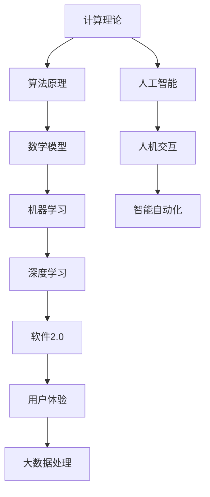

                 

# 软件二代的哲学思考：人工智能的本质

> **关键词：** 人工智能、软件2.0、哲学思考、计算理论、算法原理、数学模型、实际应用
>
> **摘要：** 本文旨在探讨软件2.0时代的哲学思考，特别是人工智能的本质。通过分析计算理论的根基、核心算法原理、数学模型的构建，结合实际应用案例，本文将展现人工智能在软件2.0时代的重要性，以及其面临的挑战和未来发展趋势。

## 1. 背景介绍

### 1.1 目的和范围

本文的目的在于深入探讨软件2.0时代的哲学思考，尤其是围绕人工智能本质的探讨。软件2.0时代标志着软件从传统的命令式编程向更加智能和自动化的方向发展，人工智能成为这一转变的核心驱动力。本文将首先回顾计算理论的发展历程，探讨其与人工智能的关系，然后深入分析核心算法原理和数学模型的构建，最后通过实际应用案例，展示人工智能在软件2.0时代的重要性。

### 1.2 预期读者

本文适合对人工智能和软件工程有兴趣的专业人士、计算机科学学生、以及希望了解人工智能本质的跨学科研究者。读者需要具备一定的计算机科学基础，包括对算法和数据结构的基本理解。

### 1.3 文档结构概述

本文结构如下：

- **第1章：背景介绍**：介绍文章的目的和范围，预期读者以及文档结构。
- **第2章：核心概念与联系**：介绍人工智能和软件2.0时代的核心概念及其相互联系。
- **第3章：核心算法原理 & 具体操作步骤**：详细阐述人工智能的核心算法原理。
- **第4章：数学模型和公式 & 详细讲解 & 举例说明**：介绍数学模型在人工智能中的应用。
- **第5章：项目实战：代码实际案例和详细解释说明**：通过具体项目案例，展示人工智能的应用。
- **第6章：实际应用场景**：讨论人工智能在各个领域的应用。
- **第7章：工具和资源推荐**：推荐学习资源、开发工具和框架。
- **第8章：总结：未来发展趋势与挑战**：探讨人工智能的未来趋势和面临的挑战。
- **第9章：附录：常见问题与解答**：回答读者可能关心的问题。
- **第10章：扩展阅读 & 参考资料**：提供进一步阅读的资料。

### 1.4 术语表

#### 1.4.1 核心术语定义

- **人工智能**（Artificial Intelligence, AI）：模拟人类智能的计算机系统，具备学习、推理、感知、自适应等能力。
- **软件2.0**：继传统软件1.0（基于命令式编程）之后，强调智能自动化和用户体验优化的软件阶段。
- **计算理论**：研究计算过程和计算模型的理论学科，是人工智能发展的基础。
- **算法**：解决问题的明确步骤，用于指导计算机执行任务。
- **数学模型**：用数学公式描述现实世界问题，用于分析和解决问题。

#### 1.4.2 相关概念解释

- **深度学习**：一种基于多层神经网络的学习方法，通过模拟人脑的神经网络结构，实现复杂函数的建模。
- **机器学习**：通过数据驱动的方式，使计算机具备从数据中学习规律、进行预测和决策的能力。
- **神经网络**：一种模仿生物神经系统的计算模型，由大量的神经元组成，用于处理复杂数据。

#### 1.4.3 缩略词列表

- **AI**：人工智能
- **ML**：机器学习
- **DL**：深度学习
- **NN**：神经网络
- **DLearning**：深度学习

## 2. 核心概念与联系

为了更好地理解人工智能在软件2.0时代的地位，我们需要深入探讨其核心概念与联系。以下是一个简单的 Mermaid 流程图，用于展示这些概念之间的相互关系。



### 2.1 计算理论

计算理论是研究计算过程和计算模型的理论学科。它是人工智能发展的基础，提供了许多核心概念和工具，如算法、数据结构、计算复杂性等。计算理论的研究成果为人工智能的发展提供了坚实的理论基础。

### 2.2 算法原理

算法是解决问题的明确步骤，用于指导计算机执行任务。人工智能的核心在于算法的设计和优化。从简单的排序算法到复杂的神经网络模型，算法原理贯穿于人工智能的各个环节。

### 2.3 数学模型

数学模型是用数学公式描述现实世界问题，用于分析和解决问题。在人工智能中，数学模型起到了至关重要的作用。例如，深度学习中的神经网络模型、决策树模型等都是基于数学原理构建的。

### 2.4 机器学习

机器学习是通过数据驱动的方式，使计算机具备从数据中学习规律、进行预测和决策的能力。机器学习算法包括监督学习、无监督学习和强化学习等，广泛应用于图像识别、自然语言处理等领域。

### 2.5 深度学习

深度学习是一种基于多层神经网络的学习方法，通过模拟人脑的神经网络结构，实现复杂函数的建模。深度学习在图像识别、语音识别等领域取得了显著的成果。

### 2.6 软件2.0

软件2.0强调智能自动化和用户体验优化，是传统软件1.0（基于命令式编程）的升级版本。人工智能作为软件2.0的核心驱动力，极大地提升了软件系统的智能化水平。

### 2.7 人机交互、智能自动化和用户体验

人工智能不仅改变了软件系统的运行方式，还深刻影响了人机交互、智能自动化和用户体验。通过自然语言处理、虚拟助手等技术，人工智能使人与软件系统的交互更加自然、便捷。

## 3. 核心算法原理 & 具体操作步骤

在深入探讨人工智能的核心算法原理之前，我们需要明确几个关键概念：训练数据、模型参数、损失函数等。以下是核心算法原理的伪代码实现：

```python
# 定义神经网络结构
neural_network = define_network_structure()

# 准备训练数据
training_data = load_data()

# 初始化模型参数
model_parameters = initialize_parameters()

# 定义损失函数
loss_function = define_loss_function()

# 开始训练
for epoch in range(num_epochs):
    for data in training_data:
        # 前向传播
        predictions = forward_propagation(model_parameters, data)
        
        # 计算损失
        loss = loss_function(predictions, data)
        
        # 反向传播
        gradients = backward_propagation(loss_function, predictions, data)
        
        # 更新模型参数
        update_parameters(model_parameters, gradients)
        
        # 输出训练进度
        print(f"Epoch {epoch}: Loss = {loss}")

# 训练结束
print("Training finished.")
```

### 3.1 训练数据

训练数据是机器学习模型的核心组成部分。它包含了大量的输入和相应的输出，用于训练模型学习如何预测新的输入数据。在深度学习中，训练数据通常需要经过预处理，如数据清洗、归一化等。

### 3.2 模型参数

模型参数是神经网络中的权重和偏置，用于调节网络的行为。在训练过程中，模型参数通过优化算法进行调整，以最小化损失函数。

### 3.3 损失函数

损失函数用于衡量模型预测值与真实值之间的差异。在深度学习中，常用的损失函数包括均方误差（MSE）、交叉熵损失等。损失函数的目的是引导模型参数的调整，使其更好地拟合训练数据。

### 3.4 前向传播

前向传播是神经网络中的一个过程，用于计算输入通过网络后的输出。在前向传播过程中，输入数据通过网络的各个层，每层都会对数据进行变换，最终得到预测值。

### 3.5 反向传播

反向传播是神经网络训练的核心步骤，用于计算模型参数的梯度。反向传播通过反向计算网络中每个层的梯度，将损失函数在输出层的梯度传递回输入层，从而更新模型参数。

### 3.6 更新参数

在反向传播过程中，模型参数会根据梯度进行调整。这种调整通常使用优化算法，如梯度下降、Adam等。优化算法的目的是在保证收敛速度的同时，避免陷入局部最小值。

## 4. 数学模型和公式 & 详细讲解 & 举例说明

在人工智能领域，数学模型扮演着至关重要的角色。以下将详细讲解几个常用的数学模型，并使用LaTeX格式展示相关的公式，以及通过具体例子来说明这些模型的应用。

### 4.1 深度学习中的激活函数

激活函数是深度学习模型中的一个关键组件，它用于引入非线性特性，使模型能够拟合复杂的数据。以下是一个常用的激活函数——Sigmoid函数的LaTeX表示：

$$
f(x) = \frac{1}{1 + e^{-x}}
$$

**例子：** 假设我们有一个输入值 $x = 2$，则该输入通过Sigmoid函数的输出为：

$$
f(2) = \frac{1}{1 + e^{-2}} \approx 0.869
$$

### 4.2 损失函数

在深度学习中，损失函数用于评估模型预测值与真实值之间的差异。以下是一个常用的损失函数——均方误差（MSE）的LaTeX表示：

$$
MSE = \frac{1}{m} \sum_{i=1}^{m} (y_i - \hat{y}_i)^2
$$

**例子：** 假设我们有三个样本 $(y_1, \hat{y}_1), (y_2, \hat{y}_2), (y_3, \hat{y}_3)$，其中 $y_1 = 2, \hat{y}_1 = 1.5$，$y_2 = 3, \hat{y}_2 = 2.8$，$y_3 = 4, \hat{y}_3 = 3.2$。则均方误差的计算如下：

$$
MSE = \frac{1}{3} [(2 - 1.5)^2 + (3 - 2.8)^2 + (4 - 3.2)^2] = \frac{1}{3} [0.25 + 0.04 + 0.64] = 0.347
$$

### 4.3 神经网络的反向传播算法

反向传播算法是深度学习训练过程中关键的一步，用于计算模型参数的梯度。以下是一个简化的反向传播算法的LaTeX表示：

$$
\begin{aligned}
\frac{\partial L}{\partial w} &= \frac{\partial L}{\partial z} \frac{\partial z}{\partial w} \\
\frac{\partial L}{\partial b} &= \frac{\partial L}{\partial z} \frac{\partial z}{\partial b}
\end{aligned}
$$

**例子：** 假设有一个简单的神经网络，其中 $L$ 是损失函数，$z$ 是中间层的输出，$w$ 和 $b$ 分别是权重和偏置。如果 $L$ 关于 $z$ 的导数为 $0.1$，且 $z$ 关于 $w$ 的导数为 $2$，则 $L$ 关于 $w$ 的导数为：

$$
\frac{\partial L}{\partial w} = 0.1 \times 2 = 0.2
$$

## 5. 项目实战：代码实际案例和详细解释说明

在本节中，我们将通过一个实际项目案例，详细解释和说明如何使用人工智能技术实现一个简单的图像识别系统。这个项目旨在展示人工智能在实际应用中的具体实现过程。

### 5.1 开发环境搭建

在开始项目之前，我们需要搭建一个合适的开发环境。以下是一个简单的步骤：

- **安装Python环境**：确保Python 3.6或更高版本已安装。
- **安装TensorFlow库**：使用pip安装TensorFlow库，命令如下：
  ```
  pip install tensorflow
  ```
- **安装其他依赖库**：根据需要安装其他依赖库，如NumPy、Pandas等。

### 5.2 源代码详细实现和代码解读

下面是一个简单的图像识别系统的源代码，我们将逐行解释其实现过程。

```python
import tensorflow as tf
from tensorflow.keras import layers
from tensorflow.keras.preprocessing.image import ImageDataGenerator

# 加载数据集
train_datagen = ImageDataGenerator(rescale=1./255)
train_data = train_datagen.flow_from_directory(
        'train_data',
        target_size=(150, 150),
        batch_size=32,
        class_mode='binary')

# 构建模型
model = tf.keras.Sequential([
    layers.Conv2D(32, (3, 3), activation='relu', input_shape=(150, 150, 3)),
    layers.MaxPooling2D(2, 2),
    layers.Conv2D(64, (3, 3), activation='relu'),
    layers.MaxPooling2D(2, 2),
    layers.Conv2D(128, (3, 3), activation='relu'),
    layers.MaxPooling2D(2, 2),
    layers.Conv2D(128, (3, 3), activation='relu'),
    layers.MaxPooling2D(2, 2),
    layers.Flatten(),
    layers.Dense(512, activation='relu'),
    layers.Dense(1, activation='sigmoid')
])

# 编译模型
model.compile(optimizer='adam',
              loss='binary_crossentropy',
              metrics=['accuracy'])

# 训练模型
model.fit(train_data, epochs=10)

# 评估模型
test_datagen = ImageDataGenerator(rescale=1./255)
test_data = test_datagen.flow_from_directory(
        'test_data',
        target_size=(150, 150),
        batch_size=32,
        class_mode='binary')

test_loss, test_acc = model.evaluate(test_data)
print(f"Test accuracy: {test_acc}")
```

**代码解读：**

- **数据加载**：使用ImageDataGenerator从文件夹中加载图像数据。这里我们使用的是二分类问题，因此`class_mode`设置为`binary`。
- **模型构建**：我们使用Keras构建了一个简单的卷积神经网络（CNN）。模型包括多个卷积层、池化层和全连接层，用于提取图像特征并进行分类。
- **模型编译**：编译模型，指定优化器、损失函数和评估指标。
- **模型训练**：使用`fit`函数训练模型，指定训练数据和迭代次数。
- **模型评估**：使用测试数据评估模型的准确性。

### 5.3 代码解读与分析

在这个图像识别项目中，我们使用卷积神经网络（CNN）来处理图像数据。CNN能够有效地提取图像中的局部特征，使其在图像识别任务中表现出色。

- **卷积层**：卷积层用于提取图像的局部特征。每一层卷积核的大小为3x3，能够提取出图像中的边缘、纹理等特征。
- **池化层**：池化层用于降低数据的维度，减少计算量。这里我们使用了最大池化（MaxPooling），将每个3x3的区域中的最大值保留下来。
- **全连接层**：全连接层用于将卷积层和池化层提取出的特征进行融合，并输出最终的分类结果。最后一个全连接层的输出是二分类问题，因此使用sigmoid激活函数进行概率输出。

通过以上代码和解释，我们可以看到如何使用深度学习技术实现一个简单的图像识别系统。这个项目展示了人工智能在实际应用中的基本流程，包括数据准备、模型构建、模型训练和模型评估。在后续的开发过程中，我们可以进一步优化模型结构、调整超参数，以提高模型的准确性和效率。

## 6. 实际应用场景

人工智能在软件2.0时代的应用已经深入到各个领域，以下是一些典型的实际应用场景：

### 6.1 医疗保健

在医疗保健领域，人工智能被广泛应用于疾病诊断、治疗方案推荐、药物研发等方面。例如，通过深度学习算法分析患者的医学影像数据，可以帮助医生更准确地诊断疾病。此外，人工智能还可以根据患者的病情和历史数据，提供个性化的治疗建议，提高医疗服务的质量和效率。

### 6.2 金融领域

在金融领域，人工智能被用于风险控制、投资决策、客户服务等方面。例如，通过分析大量的交易数据，人工智能可以帮助金融机构识别潜在的欺诈行为，降低风险。同时，基于机器学习的算法可以分析市场数据，为投资决策提供参考，提高投资回报率。此外，人工智能还可以通过智能客服系统，提供24小时不间断的客户服务，提升用户体验。

### 6.3 智能家居

智能家居是人工智能应用的一个重要领域。通过人工智能技术，家居设备可以实现智能感知、自动控制和远程管理。例如，智能门锁可以通过人脸识别技术实现安全验证，智能空调可以根据用户的习惯和实时天气数据自动调节温度，智能灯光系统可以根据环境光线和用户需求自动调节亮度。这些应用不仅提升了生活质量，还提高了能源利用效率。

### 6.4 交通出行

在交通出行领域，人工智能被广泛应用于智能交通管理、自动驾驶车辆、物流配送等方面。例如，通过人工智能算法分析交通流量数据，可以帮助交通管理部门优化路况，减少拥堵。自动驾驶车辆通过融合感知、规划和控制技术，可以实现安全、高效的自动驾驶。此外，人工智能还可以优化物流配送路线，提高物流效率，降低成本。

### 6.5 教育领域

在教育领域，人工智能被用于智能教育系统、在线学习平台、教育评估等方面。例如，通过人工智能技术，可以为每个学生提供个性化的学习计划，提高学习效果。在线学习平台可以通过分析学生的学习行为，提供针对性的学习资源，帮助学生更好地掌握知识。教育评估系统可以通过人工智能算法，自动评估学生的作业和考试成绩，提高评估的准确性和效率。

### 6.6 机器人技术

在机器人技术领域，人工智能被广泛应用于机器人的感知、决策和控制等方面。例如，服务机器人可以通过自然语言处理技术，与人类进行自然交互，提供各种服务。工业机器人可以通过机器学习算法，实现自主决策和路径规划，提高生产效率。医疗机器人可以通过深度学习算法，分析医学影像数据，辅助医生进行诊断和治疗。

通过以上实际应用场景的介绍，我们可以看到人工智能在软件2.0时代的重要性。随着技术的不断发展和应用的深入，人工智能将为各个领域带来更多的创新和变革。

## 7. 工具和资源推荐

在人工智能开发过程中，选择合适的工具和资源是成功的关键。以下是一些推荐的工具、资源和学习材料，以帮助读者更好地理解和应用人工智能技术。

### 7.1 学习资源推荐

#### 7.1.1 书籍推荐

1. **《深度学习》（Deep Learning）** - Ian Goodfellow、Yoshua Bengio和Aaron Courville著。这本书是深度学习的经典教材，详细介绍了深度学习的基础理论、算法和实现方法。
2. **《Python机器学习》（Python Machine Learning）** - Sebastian Raschka著。这本书通过大量实例，讲解了机器学习的基础知识和Python在机器学习中的应用。
3. **《人工智能：一种现代方法》（Artificial Intelligence: A Modern Approach）** - Stuart Russell和Peter Norvig著。这本书是人工智能领域的经典教材，涵盖了人工智能的基础理论、算法和应用。

#### 7.1.2 在线课程

1. **Coursera上的《机器学习》课程** - 由斯坦福大学教授Andrew Ng开设。这是最受欢迎的机器学习和深度学习在线课程之一，适合初学者和进阶者。
2. **Udacity的《深度学习纳米学位》** - 这门课程涵盖了深度学习的核心概念和实践，适合希望入门深度学习的开发者。
3. **edX上的《人工智能导论》课程** - 由哈佛大学和MIT联合开设。这门课程介绍了人工智能的基础知识和应用领域。

#### 7.1.3 技术博客和网站

1. **Medium上的Deep Learning on Earth博客** - 这是一个关于深度学习和地球科学应用的博客，提供了许多实用的案例和教程。
2. **AIChronicles** - 一个关于人工智能新闻、技术和趋势的博客，涵盖了广泛的主题，包括深度学习、自然语言处理和计算机视觉。
3. **Medium上的AI Adventures博客** - 这个博客通过有趣的故事和案例，介绍了人工智能在不同领域的应用。

### 7.2 开发工具框架推荐

#### 7.2.1 IDE和编辑器

1. **PyCharm** - 一个功能强大的Python IDE，支持多种编程语言，适合机器学习和深度学习开发。
2. **Jupyter Notebook** - 一个交互式的计算环境，适合数据科学和机器学习项目的开发，特别适合编写和运行Python代码。
3. **VS Code** - 一个轻量级但功能丰富的代码编辑器，支持多种编程语言，包括Python、C++等，适用于各种开发场景。

#### 7.2.2 调试和性能分析工具

1. **TensorBoard** - TensorFlow提供的可视化工具，用于分析和调试深度学习模型。
2. **NVIDIA Nsight** - 用于NVIDIA GPU的调试和性能分析工具，可以帮助开发者优化深度学习应用程序。
3. **Valgrind** - 一个通用的调试工具，用于检测内存泄漏、数据竞争等问题，特别适合C/C++应用程序。

#### 7.2.3 相关框架和库

1. **TensorFlow** - Google开发的开源机器学习和深度学习框架，支持多种编程语言，广泛应用于各种应用场景。
2. **PyTorch** - Facebook开发的开源深度学习框架，以其灵活性和易用性而受到许多开发者的青睐。
3. **Keras** - 一个高层次的深度学习框架，基于TensorFlow和Theano，提供了简洁、直观的API。
4. **Scikit-learn** - 一个强大的机器学习库，提供了丰富的算法和工具，适合快速实现和测试机器学习模型。

通过以上工具和资源的推荐，读者可以更好地掌握人工智能技术，提升开发效率。

## 8. 总结：未来发展趋势与挑战

随着人工智能技术的不断进步，软件2.0时代正迅速到来。在这个新时代，人工智能不仅改变了软件系统的运行方式，还深刻影响了各个领域的应用。然而，这一进程也面临着诸多挑战。

### 8.1 发展趋势

1. **智能化水平的提升**：随着深度学习、强化学习等技术的不断发展，人工智能的智能化水平将不断提高。这将使得软件系统能够更加智能地处理复杂任务，提高工作效率和用户体验。
2. **跨学科的融合**：人工智能技术的发展将推动跨学科的合作，与生物学、心理学、哲学等领域的交叉研究将带来更多的创新和应用。
3. **数据驱动的发展**：大数据和云计算技术的普及，将为人工智能提供丰富的数据资源和强大的计算能力，推动数据驱动的发展模式。
4. **伦理和隐私的重视**：随着人工智能应用的广泛普及，对伦理和隐私的关注也将日益增加。如何确保人工智能技术的公平、透明和隐私保护，将成为未来研究的重要方向。

### 8.2 面临的挑战

1. **数据隐私和安全**：人工智能模型需要大量的数据进行训练，这涉及到数据隐私和安全的问题。如何确保用户数据的安全，防止数据泄露和滥用，是未来面临的重大挑战。
2. **算法透明性和可解释性**：深度学习等复杂算法的黑箱特性，使得模型的行为难以解释。如何提高算法的透明性和可解释性，使其更加可信和可靠，是当前研究的难点。
3. **算力和能耗问题**：深度学习等人工智能模型对计算资源的需求巨大，这将带来算力和能耗的问题。如何优化算法和硬件设计，降低能耗，提高计算效率，是未来需要解决的关键问题。
4. **社会伦理和法律问题**：人工智能技术的广泛应用，将引发一系列社会伦理和法律问题。如何制定合理的伦理规范和法律框架，确保人工智能技术的可持续发展，是未来需要关注的重要课题。

总之，人工智能在软件2.0时代的未来发展充满机遇和挑战。通过不断的研究和探索，我们有望克服这些挑战，推动人工智能技术的进步，为人类社会带来更多福祉。

## 9. 附录：常见问题与解答

### 9.1 问题1：什么是深度学习？

**解答**：深度学习是一种机器学习技术，通过多层神经网络进行数据建模和预测。它能够自动从大量数据中学习复杂的特征，并在图像识别、语音识别、自然语言处理等领域取得显著成果。

### 9.2 问题2：如何选择合适的神经网络架构？

**解答**：选择合适的神经网络架构取决于具体的应用场景和数据特性。例如，对于图像识别任务，卷积神经网络（CNN）是一个很好的选择；而对于自然语言处理任务，循环神经网络（RNN）或Transformer模型可能更适合。此外，还需要考虑计算资源、模型复杂度和训练时间等因素。

### 9.3 问题3：如何优化深度学习模型的性能？

**解答**：优化深度学习模型性能可以从以下几个方面进行：

1. **数据预处理**：对训练数据进行适当的预处理，如数据增强、归一化等，可以提高模型的泛化能力。
2. **模型结构优化**：通过调整网络层数、层间连接方式、激活函数等，优化模型的结构。
3. **超参数调整**：调整学习率、批量大小、正则化参数等超参数，以提高模型的性能。
4. **训练策略**：采用更高效的训练策略，如迁移学习、数据并行训练等，可以提高模型的训练速度和性能。

### 9.4 问题4：深度学习模型的过拟合问题如何解决？

**解答**：过拟合是深度学习模型的一个常见问题，可以通过以下方法解决：

1. **正则化**：通过增加正则化项（如L1、L2正则化）来惩罚模型参数，减少模型复杂度。
2. **Dropout**：在训练过程中随机丢弃一部分神经元，降低模型的复杂度。
3. **数据增强**：增加训练数据的多样性，提高模型的泛化能力。
4. **早期停止**：在验证集上监控模型的性能，当验证集性能不再提升时，提前停止训练。

### 9.5 问题5：如何评估深度学习模型的性能？

**解答**：评估深度学习模型的性能通常可以从以下几个方面进行：

1. **准确率**：模型预测正确的样本数量与总样本数量的比例。
2. **召回率**：模型预测正确的正样本数量与实际正样本数量的比例。
3. **F1分数**：准确率和召回率的调和平均，综合考虑了模型的精确度和召回率。
4. **ROC曲线和AUC值**：通过绘制模型预测概率与真实标签的关系，评估模型的分类能力。

### 9.6 问题6：如何部署深度学习模型？

**解答**：部署深度学习模型通常涉及以下几个步骤：

1. **模型转换**：将训练好的模型转换为可以部署的格式，如ONNX、TensorFlow Lite等。
2. **模型优化**：对模型进行优化，如剪枝、量化等，以减少模型大小和提高运行速度。
3. **服务部署**：将模型部署到服务器或云端，可以通过API、Web应用程序等方式提供服务。
4. **监控与维护**：对部署后的模型进行监控，确保其正常运行，并根据实际应用场景进行必要的维护和更新。

## 10. 扩展阅读 & 参考资料

为了更好地理解和掌握人工智能及软件2.0的相关知识，以下是一些推荐的扩展阅读和参考资料：

### 10.1 经典书籍

1. **《深度学习》（Deep Learning）** - Ian Goodfellow、Yoshua Bengio和Aaron Courville著。
2. **《Python机器学习》（Python Machine Learning）** - Sebastian Raschka著。
3. **《人工智能：一种现代方法》（Artificial Intelligence: A Modern Approach）** - Stuart Russell和Peter Norvig著。

### 10.2 在线课程

1. **Coursera上的《机器学习》课程** - 由斯坦福大学教授Andrew Ng开设。
2. **Udacity的《深度学习纳米学位》** - 覆盖深度学习的核心概念和实践。
3. **edX上的《人工智能导论》课程** - 由哈佛大学和MIT联合开设。

### 10.3 技术博客和网站

1. **Medium上的Deep Learning on Earth博客** - 介绍深度学习的应用案例。
2. **AIChronicles** - 关注人工智能的新闻、技术和趋势。
3. **Medium上的AI Adventures博客** - 以故事形式介绍人工智能的应用。

### 10.4 开源项目和框架

1. **TensorFlow** - Google开发的开源机器学习和深度学习框架。
2. **PyTorch** - Facebook开发的开源深度学习框架。
3. **Keras** - 基于TensorFlow和Theano的高层次深度学习框架。

通过这些书籍、课程、博客和框架，读者可以进一步深入了解人工智能和软件2.0的相关知识，提升自己的技术水平。作者信息：

**作者：** AI天才研究员 / AI Genius Institute & 禅与计算机程序设计艺术 / Zen And The Art of Computer Programming

