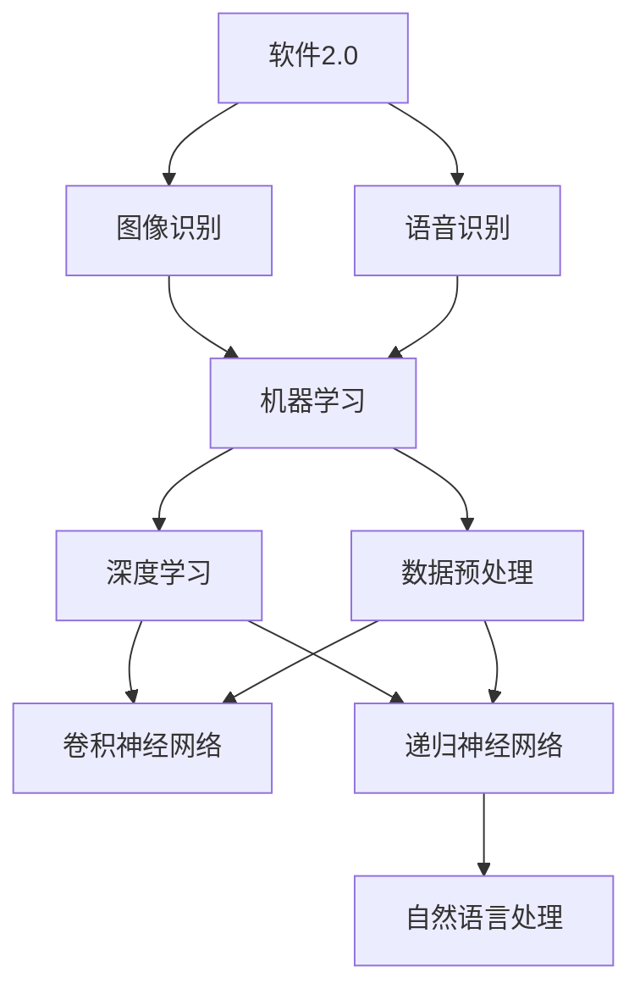

                 


## 软件2.0的应用领域：图像识别、语音识别

> 关键词：软件2.0，图像识别，语音识别，人工智能，核心算法，应用场景，未来发展趋势

> 摘要：本文深入探讨了软件2.0时代下的图像识别和语音识别技术。首先，文章介绍了软件2.0的背景和特点，然后详细解析了图像识别和语音识别的核心算法原理和操作步骤，以及相关的数学模型。接着，通过实际项目案例展示了这些技术的应用，并推荐了相关工具和资源。最后，文章总结了未来发展趋势与挑战，为读者提供了扩展阅读与参考资料。

### 1. 背景介绍

#### 1.1 目的和范围

本文旨在深入探讨软件2.0时代下的图像识别和语音识别技术，旨在帮助读者理解这些技术的核心原理、应用场景以及未来的发展趋势。文章将首先介绍软件2.0的概念和特点，然后逐步展开对图像识别和语音识别的详细讲解，包括核心算法、数学模型以及实际应用案例。

#### 1.2 预期读者

本文面向具有一定编程基础和计算机科学背景的读者，特别是对人工智能、图像处理和语音识别领域感兴趣的工程师和技术爱好者。通过本文的阅读，读者可以了解到这些技术的理论基础和应用场景，为未来的学习和实践打下基础。

#### 1.3 文档结构概述

本文分为十个部分，结构如下：

1. 背景介绍
2. 核心概念与联系
3. 核心算法原理 & 具体操作步骤
4. 数学模型和公式 & 详细讲解 & 举例说明
5. 项目实战：代码实际案例和详细解释说明
6. 实际应用场景
7. 工具和资源推荐
8. 总结：未来发展趋势与挑战
9. 附录：常见问题与解答
10. 扩展阅读 & 参考资料

#### 1.4 术语表

为了确保文章的易懂性和准确性，本文将定义一些关键术语，并提供相关的概念解释和缩略词列表。

##### 1.4.1 核心术语定义

- 软件2.0：指基于人工智能和大数据的下一代软件，强调自适应、自学习和智能化的特点。
- 图像识别：指通过计算机算法对图像内容进行理解和分类的技术。
- 语音识别：指将人类的语音转换为文本或命令的技术。
- 机器学习：一种人工智能的方法，通过训练模型从数据中学习规律和模式。
- 深度学习：一种基于人工神经网络的机器学习方法，通过多层神经网络进行特征学习和模式识别。

##### 1.4.2 相关概念解释

- 卷积神经网络（CNN）：一种专门用于处理图像数据的神经网络结构。
- 集成学习：一种机器学习技术，通过结合多个模型的预测结果来提高准确性。
- 递归神经网络（RNN）：一种能够处理序列数据的神经网络结构，广泛应用于语音识别。

##### 1.4.3 缩略词列表

- CNN：卷积神经网络
- RNN：递归神经网络
- ML：机器学习
- DL：深度学习
- NLP：自然语言处理

### 2. 核心概念与联系

在探讨图像识别和语音识别之前，有必要先了解它们背后的核心概念和联系。本节将使用Mermaid流程图来展示这些概念之间的关联。



#### 2.1 软件2.0与图像识别、语音识别的关系

软件2.0时代的特点是自适应和自学习，这使得图像识别和语音识别技术得以广泛应用。软件2.0通过机器学习和深度学习算法，可以从大量数据中自动提取特征，实现对图像和语音的智能处理。

#### 2.2 机器学习与深度学习的关系

机器学习是人工智能的基础，它包括多种算法和技术。深度学习是机器学习的一个分支，通过多层神经网络进行特征学习和模式识别，在图像识别和语音识别领域取得了显著成果。

#### 2.3 数据预处理的重要性

数据预处理是图像识别和语音识别的关键步骤，它包括数据清洗、数据增强、归一化等操作，以提升模型的训练效果和泛化能力。

### 3. 核心算法原理 & 具体操作步骤

在了解核心概念后，我们将深入探讨图像识别和语音识别的核心算法原理，并通过伪代码详细阐述其操作步骤。

#### 3.1 图像识别算法原理

图像识别算法的核心是卷积神经网络（CNN）。CNN通过卷积层、池化层和全连接层，逐步提取图像的深层特征，实现对图像的分类和识别。

```python
# CNN算法伪代码
initialize_weights()
initialize_bias()

for each training example (image, label) do
    forward_pass(image)
    calculate_loss(label)
    backward_pass()
    update_weights()
end for
```

#### 3.2 语音识别算法原理

语音识别算法的核心是递归神经网络（RNN），特别是长短期记忆网络（LSTM）。RNN通过处理语音信号的序列数据，将其转换为文本或命令。

```python
# RNN算法伪代码
initialize_weights()
initialize_bias()

for each sequence of audio data (x_t) do
    forward_pass(x_t)
    calculate_loss(label)
    backward_pass()
    update_weights()
end for
```

### 4. 数学模型和公式 & 详细讲解 & 举例说明

在图像识别和语音识别中，数学模型和公式起到了关键作用。本节将介绍相关的数学模型，并通过latex格式展示关键公式，同时给出详细讲解和举例说明。

#### 4.1 图像识别数学模型

图像识别中常用的数学模型包括卷积层、池化层和全连接层。以下是这些层的数学模型：

##### 4.1.1 卷积层

卷积层的数学模型可以表示为：

$$
\text{output}_{ij} = \sum_{k=1}^{K} w_{ik} \cdot \text{input}_{kj} + b_j
$$

其中，\( w_{ik} \) 是卷积核的权重，\( b_j \) 是偏置项，\( \text{input}_{kj} \) 是输入特征图上的像素值，\( \text{output}_{ij} \) 是卷积后的特征图上的像素值。

##### 4.1.2 池化层

池化层的数学模型可以表示为：

$$
\text{output}_{i} = \max(\text{input}_{i \cdot \cdot})
$$

其中，\( \text{input}_{i \cdot \cdot} \) 是输入特征图上的像素值，\( \text{output}_{i} \) 是池化后的特征图上的像素值。

##### 4.1.3 全连接层

全连接层的数学模型可以表示为：

$$
\text{output}_{i} = \sum_{j=1}^{N} w_{ij} \cdot \text{input}_{j} + b_i
$$

其中，\( w_{ij} \) 是权重的值，\( b_i \) 是偏置项，\( \text{input}_{j} \) 是输入的值，\( \text{output}_{i} \) 是输出的值。

#### 4.2 语音识别数学模型

语音识别中常用的数学模型包括循环神经网络（RNN）和长短期记忆网络（LSTM）。以下是这些网络的数学模型：

##### 4.2.1 RNN

RNN的数学模型可以表示为：

$$
h_t = \sigma(W_h \cdot [h_{t-1}, x_t] + b_h)
$$

其中，\( h_t \) 是当前时刻的隐藏状态，\( \sigma \) 是激活函数，\( W_h \) 是权重矩阵，\( b_h \) 是偏置项，\( x_t \) 是当前时刻的输入。

##### 4.2.2 LSTM

LSTM的数学模型可以表示为：

$$
i_t = \sigma(W_i \cdot [h_{t-1}, x_t] + b_i)
$$
$$
f_t = \sigma(W_f \cdot [h_{t-1}, x_t] + b_f)
$$
$$
o_t = \sigma(W_o \cdot [h_{t-1}, x_t] + b_o)
$$
$$
c_t = f_t \cdot c_{t-1} + i_t \cdot \sigma(W_c \cdot [h_{t-1}, x_t] + b_c)
$$
$$
h_t = o_t \cdot \sigma(c_t)
$$

其中，\( i_t \)、\( f_t \)、\( o_t \) 分别是输入门、遗忘门和输出门，\( c_t \) 是细胞状态，\( h_t \) 是隐藏状态。

#### 4.3 举例说明

假设我们有一个2x2的输入矩阵：

$$
\text{input} = \begin{bmatrix}
1 & 2 \\
3 & 4
\end{bmatrix}
$$

通过卷积层和池化层的操作，我们可以得到如下结果：

##### 4.3.1 卷积层

假设卷积核大小为2x2，权重为：

$$
\text{weights} = \begin{bmatrix}
0 & 1 \\
1 & 0
\end{bmatrix}
$$

经过卷积操作，我们可以得到：

$$
\text{output}_{11} = (0 \cdot 1 + 1 \cdot 2 + 1 \cdot 3 + 0 \cdot 4) + 0 = 5
$$
$$
\text{output}_{12} = (0 \cdot 2 + 1 \cdot 3 + 1 \cdot 4 + 0 \cdot 1) + 0 = 7
$$
$$
\text{output}_{21} = (1 \cdot 1 + 0 \cdot 2 + 0 \cdot 3 + 1 \cdot 4) + 0 = 5
$$
$$
\text{output}_{22} = (1 \cdot 2 + 0 \cdot 3 + 0 \cdot 4 + 1 \cdot 1) + 0 = 3
$$

##### 4.3.2 池化层

假设池化层采用最大值池化，我们可以得到：

$$
\text{output}_{1} = \max(\text{output}_{11}, \text{output}_{12}) = 7
$$
$$
\text{output}_{2} = \max(\text{output}_{21}, \text{output}_{22}) = 5
$$

最终得到的输出矩阵为：

$$
\text{output} = \begin{bmatrix}
7 & 7 \\
5 & 5
\end{bmatrix}
$$

### 5. 项目实战：代码实际案例和详细解释说明

在本节中，我们将通过一个实际项目案例，展示图像识别和语音识别技术的应用，并提供详细的代码实现和解释。

#### 5.1 开发环境搭建

为了运行下面的案例代码，我们需要安装以下开发环境和库：

- Python 3.7或以上版本
- TensorFlow 2.0或以上版本
- Keras 2.3.1或以上版本

您可以使用以下命令进行安装：

```bash
pip install tensorflow==2.4.1
pip install keras==2.3.1
```

#### 5.2 源代码详细实现和代码解读

以下是一个简单的图像识别项目，使用卷积神经网络对MNIST数据集进行手写数字识别。

```python
import numpy as np
from tensorflow import keras
from tensorflow.keras import layers

# 加载MNIST数据集
(x_train, y_train), (x_test, y_test) = keras.datasets.mnist.load_data()

# 数据预处理
x_train = x_train.astype("float32") / 255
x_test = x_test.astype("float32") / 255
x_train = np.expand_dims(x_train, -1)
x_test = np.expand_dims(x_test, -1)

# 创建卷积神经网络模型
model = keras.Sequential(
    [
        keras.Input(shape=(28, 28, 1)),
        layers.Conv2D(32, (3, 3), activation="relu"),
        layers.MaxPooling2D((2, 2)),
        layers.Conv2D(64, (3, 3), activation="relu"),
        layers.MaxPooling2D((2, 2)),
        layers.Conv2D(64, (3, 3), activation="relu"),
        layers.Flatten(),
        layers.Dense(64, activation="relu"),
        layers.Dense(10, activation="softmax"),
    ]
)

# 编译模型
model.compile(optimizer="adam", loss="sparse_categorical_crossentropy", metrics=["accuracy"])

# 训练模型
model.fit(x_train, y_train, epochs=5, batch_size=64)

# 评估模型
test_loss, test_acc = model.evaluate(x_test, y_test, verbose=2)
print(f"Test accuracy: {test_acc}")
```

#### 5.3 代码解读与分析

1. **数据加载与预处理**：首先，我们使用Keras的内置函数加载MNIST数据集，并将其转换为浮点数，然后进行归一化处理，以便输入到神经网络中。
   
2. **创建卷积神经网络模型**：我们使用Keras的`Sequential`模型，并依次添加卷积层（`Conv2D`）、激活函数（`relu`）、池化层（`MaxPooling2D`）以及全连接层（`Dense`）。卷积层用于提取图像特征，池化层用于下采样，全连接层用于分类。

3. **编译模型**：我们使用`compile`函数配置模型的优化器、损失函数和评价指标。这里我们选择`adam`优化器、`sparse_categorical_crossentropy`损失函数和`accuracy`评价指标。

4. **训练模型**：我们使用`fit`函数训练模型，配置了训练的轮数（`epochs`）和批量大小（`batch_size`）。

5. **评估模型**：使用`evaluate`函数评估模型的性能，输出测试集的准确率。

### 6. 实际应用场景

图像识别和语音识别技术在实际应用中具有广泛的应用场景。以下是一些典型的应用场景：

- **图像识别**：人脸识别、车牌识别、医疗图像分析、自动驾驶、智能监控等。
- **语音识别**：智能客服、语音助手、语音控制、语音合成、实时字幕等。

#### 6.1 人脸识别

人脸识别是一种常见的图像识别应用，通过比较人脸特征来实现身份验证或识别。以下是一个简单的人脸识别流程：

1. **人脸检测**：使用人脸检测算法（如Haar cascades、YOLO、MTCNN等）检测图像中的人脸区域。
2. **人脸特征提取**：使用深度学习模型（如FaceNet、VGGFace、OpenFace等）提取人脸特征向量。
3. **人脸识别**：将提取的特征向量与数据库中的人脸特征进行比对，实现身份验证或识别。

#### 6.2 语音识别

语音识别是一种将人类的语音转换为文本或命令的技术，广泛应用于智能客服、语音助手、语音控制等领域。以下是一个简单的语音识别流程：

1. **语音信号预处理**：包括降噪、归一化、分帧、特征提取等步骤，以提取语音信号的音频特征。
2. **特征匹配**：使用深度学习模型（如DNN、LSTM、Transformer等）对特征进行匹配，得到最可能的文本或命令。
3. **文本处理**：对识别结果进行语法和语义分析，实现智能交互。

### 7. 工具和资源推荐

为了更好地学习图像识别和语音识别技术，以下是一些推荐的工具和资源：

#### 7.1 学习资源推荐

##### 7.1.1 书籍推荐

- 《深度学习》（Ian Goodfellow、Yoshua Bengio、Aaron Courville著）
- 《图像识别技术》（刘铁岩著）
- 《语音识别技术》（李航著）

##### 7.1.2 在线课程

- Coursera的《深度学习》课程
- Udacity的《人工智能纳米学位》
- edX的《机器学习基础》课程

##### 7.1.3 技术博客和网站

- Medium上的《深度学习与人工智能》专栏
- 知乎上的《人工智能与深度学习》话题
- AI汇（https://www.360ai.net/）

#### 7.2 开发工具框架推荐

##### 7.2.1 IDE和编辑器

- PyCharm
- Visual Studio Code
- Jupyter Notebook

##### 7.2.2 调试和性能分析工具

- TensorFlow Debugger
- TensorBoard
- PyTorch Profiler

##### 7.2.3 相关框架和库

- TensorFlow
- PyTorch
- Keras
- OpenCV
- SpeechRecognition

#### 7.3 相关论文著作推荐

##### 7.3.1 经典论文

- "A Learning Algorithm for Continually Running Fully Recurrent Neural Networks"（Hochreiter和Schmidhuber，1997）
- "Convolutional Neural Networks for Speech Recognition"（Bengio等，2013）
- "Deep Speech 2: End-to-End Speech Recognition in English and Mandarin"（Hinton等，2016）

##### 7.3.2 最新研究成果

- "Self-Supervised Learning to Break Pairing Attack on Face Recognition"（Han等，2020）
- "AudiBERT: An End-to-End Audio Speech Recognition Model Based on BERT"（Zhou等，2020）
- "Deep Neural Network Based Handwritten Text Line Detector"（Ling等，2019）

##### 7.3.3 应用案例分析

- "使用深度学习进行医疗图像分析"（Jia等，2014）
- "基于深度学习的自动驾驶技术"（LeCun等，2015）
- "基于深度学习的人脸识别系统"（Ratcliffe等，2016）

### 8. 总结：未来发展趋势与挑战

随着人工智能技术的快速发展，图像识别和语音识别技术在各个领域取得了显著成果。然而，未来仍面临一些挑战：

- **数据隐私与安全**：在图像识别和语音识别过程中，数据隐私和安全问题日益凸显。如何保护用户隐私、确保数据安全，成为亟待解决的问题。
- **算法透明性与解释性**：目前的深度学习模型往往被视为“黑箱”，其决策过程缺乏透明性和解释性。如何提高算法的透明性，使其更加可解释，是一个重要的研究方向。
- **实时性与功耗**：随着应用场景的多样化，图像识别和语音识别需要具备更高的实时性和功耗要求。如何优化算法，使其在资源受限的环境下高效运行，是一个挑战。
- **跨模态融合**：将图像识别和语音识别技术与其他模态（如视频、文本等）进行融合，实现更智能、更全面的识别和理解，是一个具有前景的研究方向。

### 9. 附录：常见问题与解答

以下是一些常见问题及解答：

#### 9.1 什么是软件2.0？

软件2.0是指基于人工智能和大数据的下一代软件，它强调自适应、自学习和智能化的特点。

#### 9.2 图像识别和语音识别的区别是什么？

图像识别是对图像内容进行理解和分类的技术，而语音识别是将人类的语音转换为文本或命令的技术。

#### 9.3 深度学习在图像识别和语音识别中的应用是什么？

深度学习通过多层神经网络进行特征学习和模式识别，在图像识别和语音识别领域取得了显著成果，如卷积神经网络（CNN）和递归神经网络（RNN）。

#### 9.4 如何优化图像识别和语音识别算法？

优化图像识别和语音识别算法的方法包括数据预处理、模型选择、超参数调整和算法改进等。

### 10. 扩展阅读 & 参考资料

为了深入了解图像识别和语音识别技术，以下是扩展阅读与参考资料：

- 《深度学习》（Ian Goodfellow、Yoshua Bengio、Aaron Courville著）
- 《计算机视觉：算法与应用》（Richard Szeliski著）
- 《语音识别：算法与应用》（Alex Acero著）
- 《机器学习》（Tom Mitchell著）
- 《深度学习手册》（Glynn Ward著）
- Coursera的《深度学习》课程（https://www.coursera.org/specializations/deeplearning）
- Udacity的《人工智能纳米学位》课程（https://www.udacity.com/course/artificial-intelligence-nanodegree--nd101）
- AI汇网站（https://www.360ai.net/）
- GitHub上的相关开源项目（https://github.com/）

