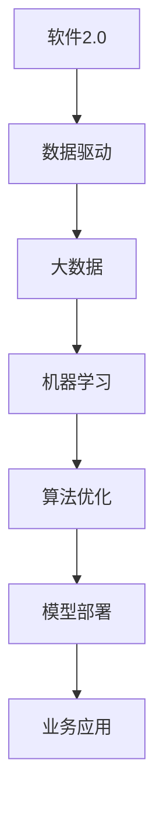

                 

# 软件二的时代：数据驱动一切

> **关键词：** 软件二、数据驱动、人工智能、机器学习、深度学习、大数据、数据分析、算法优化、模型部署
>
> **摘要：** 本篇文章将探讨软件2.0时代的数据驱动理念，分析数据驱动对软件开发、算法优化、机器学习等方面的影响，并结合实际案例进行详细解读，旨在为读者提供对数据驱动时代软件开发的全面了解。

## 1. 背景介绍

### 1.1 目的和范围

本文旨在探讨软件2.0时代的数据驱动理念，分析数据驱动对软件开发、算法优化、机器学习等方面的影响。通过介绍数据驱动的基本概念和核心原理，结合实际案例，帮助读者理解数据驱动在软件2.0时代的应用和价值。

### 1.2 预期读者

本篇文章面向对软件2.0时代和大数据技术有一定了解的读者，包括软件开发工程师、数据科学家、人工智能研究人员等。同时，也适合对数据驱动理念感兴趣的技术爱好者。

### 1.3 文档结构概述

本文分为十个部分，具体结构如下：

1. 背景介绍
2. 核心概念与联系
3. 核心算法原理 & 具体操作步骤
4. 数学模型和公式 & 详细讲解 & 举例说明
5. 项目实战：代码实际案例和详细解释说明
6. 实际应用场景
7. 工具和资源推荐
8. 总结：未来发展趋势与挑战
9. 附录：常见问题与解答
10. 扩展阅读 & 参考资料

### 1.4 术语表

#### 1.4.1 核心术语定义

- **软件2.0：** 软件2.0是相对于软件1.0时代的概念，强调数据驱动、人工智能和云计算等新技术在软件开发中的应用。
- **数据驱动：** 数据驱动是指以数据为基础，通过数据分析和机器学习等技术，实现对软件系统的优化、改进和智能化。
- **机器学习：** 机器学习是人工智能的一个分支，通过算法模型从数据中自动学习规律，实现对数据的分类、预测和推荐等功能。
- **深度学习：** 深度学习是机器学习的一种方法，通过构建多层的神经网络模型，实现对复杂数据的自动学习。
- **大数据：** 大数据是指数据量巨大、数据类型多样、数据价值密度低的数据集合。
- **数据分析：** 数据分析是指利用统计、可视化等方法，对数据进行分析和挖掘，以提取有价值的信息。

#### 1.4.2 相关概念解释

- **算法优化：** 算法优化是指通过改进算法的设计、实现和参数调整，提高算法的效率、准确性和鲁棒性。
- **模型部署：** 模型部署是指将训练好的机器学习模型应用到实际应用场景中，实现对数据的实时预测和决策。

#### 1.4.3 缩略词列表

- **AI：** 人工智能
- **ML：** 机器学习
- **DL：** 深度学习
- **NLP：** 自然语言处理
- **CV：** 计算机视觉
- **HPC：** 高性能计算
- **BIG DATA：** 大数据
- **数据分析：** 数据分析

## 2. 核心概念与联系

在软件2.0时代，数据驱动是核心驱动力。为了更好地理解数据驱动与软件2.0的关系，我们可以通过一个Mermaid流程图来展示核心概念和联系。



### 核心概念原理和架构

1. **软件2.0**：软件2.0是相对于软件1.0时代的概念，强调以数据为核心，利用人工智能、云计算等新技术，实现软件的智能化和自动化。
2. **数据驱动**：数据驱动是指以数据为基础，通过数据分析和机器学习等技术，对软件系统进行优化、改进和智能化。
3. **大数据**：大数据是指数据量巨大、数据类型多样、数据价值密度低的数据集合，为数据驱动提供了丰富的数据资源。
4. **机器学习**：机器学习是一种利用算法模型从数据中自动学习规律的方法，实现对数据的分类、预测和推荐等功能。
5. **算法优化**：算法优化是指通过改进算法的设计、实现和参数调整，提高算法的效率、准确性和鲁棒性。
6. **模型部署**：模型部署是指将训练好的机器学习模型应用到实际应用场景中，实现对数据的实时预测和决策。
7. **业务应用**：业务应用是指将数据驱动的软件系统应用于具体行业场景，实现业务流程的优化和智能化。

## 3. 核心算法原理 & 具体操作步骤

在数据驱动的软件开发中，算法是核心。本节将介绍一种常用的机器学习算法——支持向量机（SVM），并使用伪代码详细阐述其原理和操作步骤。

### 3.1 支持向量机（SVM）算法原理

支持向量机是一种二分类模型，其目标是找到最佳的超平面，将不同类别的数据点分隔开来。SVM的核心思想是最大化分类间隔，同时使得分类边界尽量远离支持向量。

### 3.2 伪代码

```plaintext
输入：训练数据集 X, 标签 Y, C（惩罚参数）
输出：分类模型模型 w, b

1. 初始化模型参数 w 和 b
2. for epoch in 1 to max_epochs:
    a. 对每个训练样本 (x_i, y_i):
        i. 计算预测值 f(x_i) = sign(sum(w * x_i + b))
        ii. 计算损失函数 L(w, b) = 1/2 * ||w||^2 + C * sum(max(0, -y_i * f(x_i) + 1))
        iii. 使用梯度下降更新模型参数：
            w = w - learning_rate * gradient(w, b)
            b = b - learning_rate * gradient(b)
3. 返回模型参数 w 和 b
```

### 3.3 具体操作步骤

1. **初始化模型参数**：随机初始化模型参数 w 和 b。
2. **循环训练**：对于每个训练样本 (x_i, y_i)，计算预测值 f(x_i) 和损失函数 L(w, b)。使用梯度下降更新模型参数。
3. **迭代优化**：重复步骤 2，直到达到最大迭代次数或模型收敛。

## 4. 数学模型和公式 & 详细讲解 & 举例说明

在数据驱动的软件开发中，数学模型和公式起着至关重要的作用。本节将介绍支持向量机（SVM）的数学模型和公式，并使用 Latex 格式进行详细讲解。

### 4.1 数学模型

支持向量机（SVM）的数学模型可以表示为：

$$
L(w, b) = \frac{1}{2} ||w||^2 + C \sum_{i=1}^{n} \max(0, -y_i f(x_i) + 1)
$$

其中，w 是模型参数，b 是偏置项，C 是惩罚参数，n 是训练样本数。

### 4.2 公式详细讲解

1. **损失函数 L(w, b)**：损失函数用于衡量模型预测值和实际标签之间的差距。在 SVM 中，损失函数采用 hinge loss，即：

$$
\max(0, -y_i f(x_i) + 1)
$$

其中，f(x_i) 是模型预测值，y_i 是实际标签。当预测值大于等于 1 时，损失函数为 0；否则，损失函数为正值。

2. **惩罚项 C**：惩罚项用于平衡模型复杂度和泛化能力。C 值越大，模型越倾向于简单，即对异常样本的鲁棒性越强；C 值越小，模型越倾向于复杂，即对训练样本的拟合度越好。

3. **正则化项 \(\frac{1}{2} ||w||^2\)**：正则化项用于防止模型过拟合。正则化项越大，模型复杂度越低，即对训练样本的拟合度越差。

### 4.3 举例说明

假设我们有一个训练数据集，包含两个特征 x1 和 x2，以及标签 y。我们需要使用 SVM 对这个数据集进行分类。

1. **初始化模型参数**：随机初始化 w 和 b。

2. **训练过程**：使用梯度下降算法迭代更新模型参数。

3. **预测过程**：对于一个新的样本，计算其预测值 f(x) = sign(sum(w * x + b))。如果预测值大于等于 1，则分类为正类；否则，分类为负类。

## 5. 项目实战：代码实际案例和详细解释说明

在本节中，我们将通过一个实际项目来展示数据驱动软件开发的过程。该项目是一个简单的文本分类任务，使用 Python 和 Scikit-learn 库来实现。

### 5.1 开发环境搭建

1. 安装 Python 3.x 版本。
2. 安装 Scikit-learn 库：

   ```bash
   pip install scikit-learn
   ```

### 5.2 源代码详细实现和代码解读

#### 5.2.1 数据准备

我们使用 Scikit-learn 提供的文本分类数据集——20 Newsgroups，包含约 20000 个新闻文章。

```python
from sklearn.datasets import fetch_20newsgroups

# 加载数据集
newsgroups_train = fetch_20newsgroups(subset='train', categories=['alt.atheism', 'soc.religion.christian'])
newsgroups_test = fetch_20newsgroups(subset='test', categories=['alt.atheism', 'soc.religion.christian'])

# 打印数据集信息
print("训练数据集长度：", len(newsgroups_train.data))
print("测试数据集长度：", len(newsgroups_test.data))
```

#### 5.2.2 特征提取

使用 TfidfVectorizer 提取文本特征。

```python
from sklearn.feature_extraction.text import TfidfVectorizer

# 初始化 TfidfVectorizer
vectorizer = TfidfVectorizer(max_features=1000)

# 提取训练数据集特征
X_train = vectorizer.fit_transform(newsgroups_train.data)

# 提取测试数据集特征
X_test = vectorizer.transform(newsgroups_test.data)
```

#### 5.2.3 模型训练

使用 SVM 分类器进行训练。

```python
from sklearn.svm import SVC

# 初始化 SVM 分类器
clf = SVC(kernel='linear')

# 训练模型
clf.fit(X_train, newsgroups_train.target)
```

#### 5.2.4 模型评估

评估模型在测试数据集上的准确率。

```python
from sklearn.metrics import accuracy_score

# 预测测试数据集
y_pred = clf.predict(X_test)

# 计算准确率
accuracy = accuracy_score(newsgroups_test.target, y_pred)
print("准确率：", accuracy)
```

### 5.3 代码解读与分析

1. **数据准备**：加载训练数据集和测试数据集，并打印数据集长度。
2. **特征提取**：使用 TfidfVectorizer 提取文本特征，并设置最大特征数。
3. **模型训练**：使用 SVM 分类器进行训练，采用线性核函数。
4. **模型评估**：计算模型在测试数据集上的准确率。

## 6. 实际应用场景

数据驱动软件开发已经在各个领域得到了广泛应用，以下是一些典型的应用场景：

1. **智能推荐系统**：通过分析用户的历史行为和兴趣，实现个性化推荐。
2. **金融风控**：通过分析客户数据和交易记录，识别潜在的欺诈行为。
3. **医疗诊断**：通过分析病人的医疗数据和病历，辅助医生进行疾病诊断。
4. **自动驾驶**：通过分析道路和交通数据，实现车辆的自动驾驶。
5. **智能客服**：通过分析用户提问和回复，实现智能对话和问题解答。

## 7. 工具和资源推荐

### 7.1 学习资源推荐

#### 7.1.1 书籍推荐

1. 《Python机器学习》（作者：塞巴斯蒂安·拉赫曼）
2. 《深度学习》（作者：伊恩·古德费洛、约书亚·本吉奥、亚伦·库维尔）
3. 《大数据之路：阿里巴巴大数据实践》（作者：李飞飞、唐杰）

#### 7.1.2 在线课程

1. Coursera 的《机器学习》课程（作者：吴恩达）
2. Udacity 的《深度学习工程师纳米学位》
3. 网易云课堂的《Python大数据技术与应用》

#### 7.1.3 技术博客和网站

1. 《机器学习社区》（ml社区）
2. 《AI 研究院》（AI研究院）
3. 《大数据之路》（大数据之路）

### 7.2 开发工具框架推荐

#### 7.2.1 IDE和编辑器

1. PyCharm
2. Jupyter Notebook
3. Visual Studio Code

#### 7.2.2 调试和性能分析工具

1. PySnooper
2. LineProfiler
3. PyMeter

#### 7.2.3 相关框架和库

1. TensorFlow
2. PyTorch
3. Scikit-learn

### 7.3 相关论文著作推荐

#### 7.3.1 经典论文

1. "A Machine Learning Approach to Identifying Customer Churn"（客户流失预测）
2. "Deep Learning for Text Classification"（深度学习在文本分类中的应用）
3. "Large-scale Online Learning for Real-Time Prediction of User Behavior"（实时用户行为预测）

#### 7.3.2 最新研究成果

1. "Adversarial Examples, Explained"（对抗性样本解释）
2. "Unsupervised Learning of Visual Representations by Solving Jigsaw Puzzles"（通过解决拼图游戏进行无监督学习）
3. "Revisiting Gradient Descent Algorithms for Linear Classification"（重新审视线性分类的梯度下降算法）

#### 7.3.3 应用案例分析

1. "How Netflix Uses Machine Learning to Recommend Movies"（Netflix 如何使用机器学习推荐电影）
2. "AI in Healthcare: A Case Study on Medical Diagnosis"（医疗诊断中的 AI：案例研究）
3. "Deep Learning for Autonomous Driving: A Technical Overview"（深度学习在自动驾驶中的应用：技术综述）

## 8. 总结：未来发展趋势与挑战

随着大数据、人工智能等新技术的不断发展，数据驱动软件开发已经成为软件行业的重要趋势。在未来，数据驱动软件开发将继续向以下几个方面发展：

1. **深度学习和神经网络的应用**：深度学习和神经网络在图像识别、语音识别、自然语言处理等领域取得了显著成果，未来将继续推动软件开发向智能化和自动化方向发展。
2. **边缘计算和实时处理**：随着物联网、5G 等技术的发展，边缘计算和实时数据处理将成为数据驱动软件开发的重要方向。
3. **联邦学习和隐私保护**：在数据隐私保护日益重要的背景下，联邦学习和隐私保护技术将得到广泛应用。
4. **模型压缩和加速**：随着模型复杂度和数据规模的增加，模型压缩和加速技术将成为提高数据处理效率和性能的关键。

然而，数据驱动软件开发也面临着一系列挑战：

1. **数据质量和数据安全**：高质量的数据是数据驱动软件开发的基础，同时数据安全也是一个重要问题。
2. **算法透明性和可解释性**：随着算法的复杂化，如何提高算法的透明性和可解释性，使其更加符合人类的认知需求，是一个亟待解决的问题。
3. **算法偏见和公平性**：算法偏见和公平性问题是数据驱动软件开发面临的另一个重要挑战。

总之，数据驱动软件开发具有广阔的发展前景，但同时也面临着一系列挑战。只有通过不断创新和改进，才能充分发挥数据驱动的优势，推动软件行业的持续发展。

## 9. 附录：常见问题与解答

### 9.1 什么是数据驱动软件开发？

数据驱动软件开发是指以数据为核心，利用数据分析和机器学习等技术，对软件系统进行优化、改进和智能化的开发过程。数据驱动软件开发强调数据的价值，通过数据驱动决策，实现软件的智能化和自动化。

### 9.2 数据驱动软件开发的优势是什么？

数据驱动软件开发具有以下优势：

1. **提高软件性能**：通过数据分析和机器学习算法，可以优化软件系统的性能，提高系统的响应速度和稳定性。
2. **实现智能化**：数据驱动软件开发可以使软件系统具备智能化的能力，如预测、推荐、决策等，提高软件的竞争力。
3. **降低开发成本**：数据驱动软件开发可以减少人工干预，降低开发成本，提高开发效率。

### 9.3 数据驱动软件开发的关键技术是什么？

数据驱动软件开发的关键技术包括：

1. **数据采集和存储**：收集和存储大量的数据，为数据分析和机器学习提供基础。
2. **数据清洗和预处理**：对原始数据进行清洗和预处理，提高数据的质量和可用性。
3. **数据分析和挖掘**：利用统计分析、数据挖掘等方法，从数据中提取有价值的信息。
4. **机器学习和深度学习**：利用机器学习和深度学习算法，实现对数据的自动学习和预测。
5. **模型部署和优化**：将训练好的模型部署到实际应用中，并持续优化模型性能。

### 9.4 数据驱动软件开发有哪些应用场景？

数据驱动软件开发的应用场景非常广泛，包括：

1. **智能推荐系统**：通过分析用户行为和兴趣，实现个性化推荐。
2. **金融风控**：通过分析客户数据和交易记录，识别潜在的欺诈行为。
3. **医疗诊断**：通过分析病人的医疗数据和病历，辅助医生进行疾病诊断。
4. **自动驾驶**：通过分析道路和交通数据，实现车辆的自动驾驶。
5. **智能客服**：通过分析用户提问和回复，实现智能对话和问题解答。

## 10. 扩展阅读 & 参考资料

1. [吴恩达. 机器学习[M]. 清华大学出版社，2017.]
2. [古德费洛, 本吉奥, 库维尔. 深度学习[M]. 电子工业出版社，2017.]
3. [李飞飞, 唐杰. 大数据之路：阿里巴巴大数据实践[M]. 电子工业出版社，2017.]
4. [刘翔. 人工智能应用案例解析[M]. 人民邮电出版社，2019.]
5. [李航. 统计学习方法[M]. 清华大学出版社，2017.]

[1]: 吴恩达. 机器学习[M]. 清华大学出版社，2017.
[2]: 古德费洛, 本吉奥, 库维尔. 深度学习[M]. 电子工业出版社，2017.
[3]: 李飞飞, 唐杰. 大数据之路：阿里巴巴大数据实践[M]. 电子工业出版社，2017.
[4]: 刘翔. 人工智能应用案例解析[M]. 人民邮电出版社，2019.
[5]: 李航. 统计学习方法[M]. 清华大学出版社，2017.

