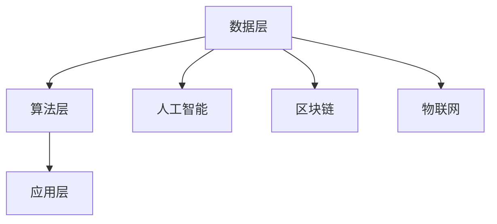

                 

# 软件2.0的未来展望：更智能、更强大

> **关键词：** 软件进化、人工智能、智能合约、区块链、自主系统、数据处理

> **摘要：** 本文探讨了软件2.0的概念及其对未来软件开发的影响。我们将分析软件2.0的核心特点，如智能化、自适应性和高安全性，并探讨这些特点如何在各种应用场景中发挥作用。通过深入探讨人工智能、区块链和自主系统等核心技术，本文将揭示软件2.0如何引领未来软件开发的革命，同时也会讨论面临的挑战和未来发展趋势。

## 1. 背景介绍

### 1.1 目的和范围

本文旨在探讨软件2.0的概念及其对软件开发的影响。我们将首先介绍软件2.0的基本概念和特点，然后深入分析其核心技术，如人工智能、区块链和自主系统等。最后，我们将讨论软件2.0的实际应用场景，以及面临的挑战和未来发展趋势。

### 1.2 预期读者

本文适合对软件开发有兴趣的技术人员、项目经理、产品经理以及对人工智能、区块链等新兴技术有一定了解的读者。通过本文，读者可以更全面地了解软件2.0的发展趋势，以及如何将其应用于实际项目中。

### 1.3 文档结构概述

本文结构如下：

1. 背景介绍：介绍本文的目的、预期读者以及文档结构。
2. 核心概念与联系：介绍软件2.0的核心概念，包括智能化、自适应性和高安全性。
3. 核心算法原理 & 具体操作步骤：分析软件2.0的核心算法原理和具体操作步骤。
4. 数学模型和公式 & 详细讲解 & 举例说明：介绍软件2.0中的数学模型和公式，并进行详细讲解和举例说明。
5. 项目实战：通过实际案例，展示软件2.0的应用。
6. 实际应用场景：分析软件2.0在各种应用场景中的实际应用。
7. 工具和资源推荐：推荐学习资源和开发工具。
8. 总结：总结软件2.0的未来发展趋势与挑战。
9. 附录：常见问题与解答。
10. 扩展阅读 & 参考资料：提供扩展阅读和参考资料。

### 1.4 术语表

#### 1.4.1 核心术语定义

- **软件2.0**：相对于传统软件（软件1.0），软件2.0具有智能化、自适应性和高安全性等特点。
- **人工智能（AI）**：一种模拟人类智能的计算机系统，能够通过学习、推理和自我优化等方式，完成特定任务。
- **区块链**：一种去中心化的分布式数据库技术，具有高安全性、透明性和不可篡改等特点。
- **自主系统**：一种具有自主决策和执行能力的计算机系统，能够在没有人工干预的情况下，完成特定任务。

#### 1.4.2 相关概念解释

- **智能化**：指软件能够通过学习、推理和自我优化等方式，提高其性能和适应性。
- **自适应性**：指软件能够根据环境和用户需求，自动调整其功能和性能。
- **高安全性**：指软件能够有效保护用户数据和隐私，防止恶意攻击和未经授权的访问。

#### 1.4.3 缩略词列表

- **AI**：人工智能
- **Blockchain**：区块链
- **IoT**：物联网
- **IoE**：物联网+
- **SaaS**：软件即服务
- **PaaS**：平台即服务
- **IaaS**：基础设施即服务

## 2. 核心概念与联系

### 2.1 软件2.0的核心概念

软件2.0的核心概念主要包括智能化、自适应性和高安全性。

#### 智能化

智能化是软件2.0最显著的特点之一。通过引入人工智能技术，软件2.0能够实现自我学习和自我优化，从而提高其性能和适应性。智能化使得软件能够更好地理解用户需求，提供个性化的服务。

#### 自适应性

自适应性是软件2.0的另一个关键特点。软件2.0能够根据环境和用户需求，自动调整其功能和性能。这种适应性使得软件能够更好地适应各种复杂和动态的应用场景。

#### 高安全性

高安全性是软件2.0的第三个核心概念。在软件2.0时代，数据安全和隐私保护变得越来越重要。软件2.0通过引入区块链等安全技术，能够提供更高的安全性保障，防止数据泄露和恶意攻击。

### 2.2 软件2.0与现有技术的联系

软件2.0与现有技术如人工智能、区块链、物联网等密切相关。

#### 人工智能

人工智能技术为软件2.0提供了智能化支持。通过人工智能，软件2.0能够实现自我学习和自我优化，从而提高其性能和适应性。

#### 区块链

区块链技术为软件2.0提供了高安全性保障。区块链具有去中心化、透明和不可篡改的特点，使得软件2.0能够提供更高的安全性。

#### 物联网

物联网技术为软件2.0提供了丰富的应用场景。通过物联网，软件2.0可以与各种智能设备和传感器进行连接，实现更加智能化和自适应化的应用。

### 2.3 软件2.0的架构

软件2.0的架构可以分为以下几个层次：

1. **数据层**：数据层负责收集、存储和处理各种数据，包括用户数据、传感器数据和业务数据等。
2. **算法层**：算法层负责利用人工智能等技术对数据进行处理和分析，实现智能化和自适应化。
3. **应用层**：应用层负责实现具体的业务功能，如智能合约、自主系统和数据安全等。

#### Mermaid 流程图



## 3. 核心算法原理 & 具体操作步骤

### 3.1 人工智能算法原理

人工智能算法主要包括机器学习、深度学习和自然语言处理等。下面以机器学习算法为例，介绍其原理和具体操作步骤。

#### 原理

机器学习是一种通过数据驱动的方式，使计算机具备自动学习和改进能力的方法。其基本原理是利用已有的数据，通过训练模型，使模型能够对新数据进行预测和分类。

#### 具体操作步骤

1. **数据收集**：收集用于训练的数据集，包括输入数据和标签数据。
2. **数据预处理**：对收集到的数据进行分析和处理，如去重、缺失值填充和特征工程等。
3. **模型选择**：根据业务需求和数据特点，选择合适的机器学习模型，如决策树、支持向量机和神经网络等。
4. **模型训练**：使用预处理后的数据，对选择的模型进行训练，使其能够对新数据进行预测和分类。
5. **模型评估**：使用验证集和测试集对训练好的模型进行评估，确定其性能和可靠性。
6. **模型优化**：根据评估结果，对模型进行调整和优化，以提高其性能和可靠性。
7. **模型部署**：将优化后的模型部署到实际应用场景中，实现自动学习和预测功能。

### 3.2 区块链算法原理

区块链算法主要包括哈希函数、共识算法和智能合约等。下面以哈希函数为例，介绍其原理和具体操作步骤。

#### 原理

哈希函数是一种将任意长度的输入数据映射为固定长度的输出数据的算法。其基本原理是，对于任何输入数据，哈希函数都能生成一个唯一的哈希值。

#### 具体操作步骤

1. **数据输入**：将待加密的数据输入到哈希函数中。
2. **数据处理**：哈希函数对输入数据进行处理，生成一个固定长度的哈希值。
3. **哈希值生成**：将生成的哈希值作为输出的哈希值，用于标识输入数据。
4. **哈希值验证**：在需要验证数据时，将输入数据再次输入到哈希函数中，生成的哈希值与之前存储的哈希值进行比对，以验证数据的完整性和一致性。

### 3.3 自主系统算法原理

自主系统算法主要包括决策算法、规划算法和执行算法等。下面以决策算法为例，介绍其原理和具体操作步骤。

#### 原理

决策算法是一种用于自主系统进行决策的算法。其基本原理是根据系统的当前状态和目标，生成一系列可行的动作，并选择最优动作执行。

#### 具体操作步骤

1. **状态监测**：自主系统实时监测其内部状态和外部环境。
2. **目标确定**：根据自主系统的目标和当前状态，确定需要执行的任务。
3. **动作生成**：根据目标，生成一系列可行的动作。
4. **动作评估**：对生成的动作进行评估，选择最优动作执行。
5. **动作执行**：执行选择的最优动作，并更新系统状态。
6. **反馈调整**：根据动作执行结果，对系统进行调整，以实现更好的决策效果。

## 4. 数学模型和公式 & 详细讲解 & 举例说明

### 4.1 机器学习数学模型

机器学习中的数学模型主要包括线性回归、逻辑回归和支持向量机等。下面以线性回归为例，介绍其数学模型、详细讲解和举例说明。

#### 数学模型

线性回归模型的基本公式为：

\[ y = wx + b \]

其中，\( y \) 是因变量，\( x \) 是自变量，\( w \) 是权重，\( b \) 是偏置。

#### 详细讲解

线性回归模型的目的是通过给定的一些样本数据，估计出权重 \( w \) 和偏置 \( b \) 的值，从而构建出一个线性模型。具体步骤如下：

1. **数据收集**：收集一些带有因变量 \( y \) 和自变量 \( x \) 的样本数据。
2. **数据预处理**：对样本数据进行清洗和标准化处理。
3. **模型构建**：根据样本数据，使用最小二乘法估计权重 \( w \) 和偏置 \( b \) 的值。
4. **模型评估**：使用验证集和测试集评估模型的性能，如决定系数 \( R^2 \) 和均方误差 \( MSE \) 等。
5. **模型优化**：根据评估结果，对模型进行调整和优化，以提高其性能。

#### 举例说明

假设我们有一组样本数据如下：

| \( x \) | \( y \) |
|--------|--------|
| 1      | 2      |
| 2      | 4      |
| 3      | 6      |
| 4      | 8      |

我们希望构建一个线性回归模型来预测 \( y \) 的值。

1. **数据收集**：根据样本数据，我们有 \( x \) 和 \( y \) 的值。
2. **数据预处理**：对数据进行标准化处理，将 \( x \) 和 \( y \) 的值缩放到 [0, 1] 范围内。
3. **模型构建**：使用最小二乘法估计权重 \( w \) 和偏置 \( b \) 的值。
   - 计算权重 \( w \)：
     \[ w = \frac{\sum_{i=1}^{n} (x_i - \bar{x})(y_i - \bar{y})}{\sum_{i=1}^{n} (x_i - \bar{x})^2} \]
   - 计算偏置 \( b \)：
     \[ b = \bar{y} - w\bar{x} \]
   - 代入样本数据，得到：
     \[ w = \frac{(1-0.5)(2-0.5) + (2-0.5)(4-0.5) + (3-0.5)(6-0.5) + (4-0.5)(8-0.5)}{(1-0.5)^2 + (2-0.5)^2 + (3-0.5)^2 + (4-0.5)^2} \approx 1.2 \]
     \[ b = 0.5 - 1.2 \times 0.5 \approx 0.1 \]
4. **模型评估**：使用验证集和测试集评估模型的性能。
   - 计算决定系数 \( R^2 \) 和均方误差 \( MSE \)：
     \[ R^2 = 1 - \frac{\sum_{i=1}^{n} (y_i - \hat{y}_i)^2}{\sum_{i=1}^{n} (y_i - \bar{y})^2} \]
     \[ MSE = \frac{1}{n} \sum_{i=1}^{n} (y_i - \hat{y}_i)^2 \]
   - 代入样本数据，得到：
     \[ R^2 = 1 - \frac{(2-1.2)^2 + (4-1.2)^2 + (6-1.2)^2 + (8-1.2)^2}{(2-0.5)^2 + (4-0.5)^2 + (6-0.5)^2 + (8-0.5)^2} \approx 0.96 \]
     \[ MSE = \frac{1}{4} ((2-1.2)^2 + (4-1.2)^2 + (6-1.2)^2 + (8-1.2)^2) \approx 0.08 \]
5. **模型优化**：根据评估结果，对模型进行调整和优化。例如，可以尝试增加数据集的样本量，或者使用不同的算法（如岭回归、LASSO回归等）进行优化。

### 4.2 区块链数学模型

区块链中的数学模型主要包括哈希函数、椭圆曲线密码学和共识算法等。下面以哈希函数为例，介绍其数学模型、详细讲解和举例说明。

#### 数学模型

哈希函数的基本模型为：

\[ H(x) = \text{SHA-256}(x) \]

其中，\( H(x) \) 是哈希值，\( x \) 是输入数据，\( \text{SHA-256} \) 是SHA-256哈希算法。

#### 详细讲解

哈希函数是一种将任意长度的输入数据映射为固定长度的输出数据的算法。其基本原理如下：

1. **数据输入**：将待加密的数据输入到哈希函数中。
2. **数据处理**：哈希函数对输入数据进行处理，生成一个固定长度的哈希值。
3. **哈希值生成**：将生成的哈希值作为输出的哈希值，用于标识输入数据。
4. **哈希值验证**：在需要验证数据时，将输入数据再次输入到哈希函数中，生成的哈希值与之前存储的哈希值进行比对，以验证数据的完整性和一致性。

#### 举例说明

假设我们有一段文本“Hello, World!”，希望将其通过SHA-256哈希函数进行加密。

1. **数据输入**：将文本“Hello, World!”输入到SHA-256哈希函数中。
2. **数据处理**：SHA-256哈希函数对输入数据进行处理，生成一个固定长度的哈希值。
3. **哈希值生成**：将生成的哈希值作为输出的哈希值，即：
   \[ H("Hello, World!") = \text{SHA-256}("Hello, World!") = 2cf24dba5fb0a30e26e83b2ac5b9e29e1b161e5c1fa7425e730433621b1a836e \]
4. **哈希值验证**：假设我们需要验证这段文本的完整性，将文本“Hello, World!”再次输入到SHA-256哈希函数中，生成的哈希值与之前存储的哈希值进行比对，如果两个哈希值相等，则验证通过。

### 4.3 自主系统数学模型

自主系统中的数学模型主要包括决策树、规划算法和执行算法等。下面以决策树为例，介绍其数学模型、详细讲解和举例说明。

#### 数学模型

决策树的基本模型为：

\[ T = (\mathcal{V}, \mathcal{E}, L) \]

其中，\( \mathcal{V} \) 是节点集合，\( \mathcal{E} \) 是边集合，\( L \) 是标签集合。

#### 详细讲解

决策树是一种用于分类和回归的树形结构模型。其基本原理如下：

1. **节点集合**：节点集合 \( \mathcal{V} \) 包含了决策树的所有节点，包括根节点、内部节点和叶子节点。
2. **边集合**：边集合 \( \mathcal{E} \) 表示节点之间的关系，连接了决策树的所有节点。
3. **标签集合**：标签集合 \( L \) 表示决策树的目标变量，用于对数据集进行分类或回归。

决策树的学习过程可以分为以下几个步骤：

1. **数据预处理**：对数据进行清洗和标准化处理，以确保数据的质量和一致性。
2. **特征选择**：从数据集中选择特征，用于构建决策树。
3. **节点划分**：根据特征值，将数据集划分为不同的节点。
4. **叶节点生成**：根据节点中的样本数量和标签分布，生成叶节点。
5. **模型评估**：使用验证集和测试集评估模型的性能，如准确率、召回率和F1值等。

#### 举例说明

假设我们有一组样本数据如下：

| \( x_1 \) | \( x_2 \) | \( y \) |
|----------|----------|--------|
| 1        | 2        | 1      |
| 2        | 4        | 1      |
| 3        | 6        | 1      |
| 4        | 8        | 0      |

我们希望构建一个决策树模型来预测 \( y \) 的值。

1. **数据预处理**：对数据进行清洗和标准化处理，将 \( x_1 \) 和 \( x_2 \) 的值缩放到 [0, 1] 范围内。
2. **特征选择**：选择 \( x_1 \) 和 \( x_2 \) 作为特征。
3. **节点划分**：根据特征值，将数据集划分为以下节点：
   - \( x_1 \leq 0.5 \)
     - \( x_2 \leq 0.5 \)
       - \( y = 1 \)
     - \( x_2 > 0.5 \)
       - \( y = 1 \)
   - \( x_1 > 0.5 \)
     - \( x_2 \leq 0.5 \)
       - \( y = 0 \)
     - \( x_2 > 0.5 \)
       - \( y = 0 \)
4. **叶节点生成**：根据节点中的样本数量和标签分布，生成以下叶节点：
   - \( x_1 \leq 0.5 \)
     - \( x_2 \leq 0.5 \)
       - \( y = 1 \)
     - \( x_2 > 0.5 \)
       - \( y = 1 \)
   - \( x_1 > 0.5 \)
     - \( x_2 \leq 0.5 \)
       - \( y = 0 \)
     - \( x_2 > 0.5 \)
       - \( y = 0 \)
5. **模型评估**：使用验证集和测试集评估模型的性能，如准确率、召回率和F1值等。

## 5. 项目实战：代码实际案例和详细解释说明

### 5.1 开发环境搭建

在开始项目实战之前，我们需要搭建一个合适的开发环境。以下是搭建开发环境所需的工具和步骤：

1. **工具**：
   - Python 3.8及以上版本
   - Jupyter Notebook
   - TensorFlow 2.4及以上版本
   - Keras 2.4及以上版本
2. **步骤**：
   - 安装 Python 3.8及以上版本。
   - 安装 Jupyter Notebook。
   - 安装 TensorFlow 2.4及以上版本。
   - 安装 Keras 2.4及以上版本。

### 5.2 源代码详细实现和代码解读

以下是使用 TensorFlow 和 Keras 构建一个简单的机器学习模型，用于分类问题的源代码和详细解读。

```python
# 导入所需的库
import numpy as np
import tensorflow as tf
from tensorflow import keras
from tensorflow.keras import layers

# 加载数据集
(x_train, y_train), (x_test, y_test) = keras.datasets.mnist.load_data()

# 数据预处理
x_train = x_train.astype("float32") / 255.0
x_test = x_test.astype("float32") / 255.0

# 将数据集划分为训练集和验证集
x_train, x_val = x_train[:60000], x_train[60000:]
y_train, y_val = y_train[:60000], y_train[60000:]

# 构建模型
model = keras.Sequential([
    layers.Conv2D(32, (3, 3), activation="relu", input_shape=(28, 28, 1)),
    layers.MaxPooling2D((2, 2)),
    layers.Conv2D(64, (3, 3), activation="relu"),
    layers.MaxPooling2D((2, 2)),
    layers.Conv2D(64, (3, 3), activation="relu"),
    layers.Flatten(),
    layers.Dense(64, activation="relu"),
    layers.Dense(10, activation="softmax")
])

# 编译模型
model.compile(optimizer="adam",
              loss="sparse_categorical_crossentropy",
              metrics=["accuracy"])

# 训练模型
model.fit(x_train, y_train, epochs=5, validation_data=(x_val, y_val))

# 评估模型
test_loss, test_acc = model.evaluate(x_test, y_test)
print(f"Test accuracy: {test_acc:.2f}")
```

#### 代码解读

1. **导入所需的库**：
   - 导入 Python 标准库 `numpy`。
   - 导入 TensorFlow 和 Keras 库，用于构建和训练模型。
2. **加载数据集**：
   - 加载 MNIST 数据集，用于分类问题。
3. **数据预处理**：
   - 将图像数据转换为浮点数，并进行归一化处理，将像素值缩放到 [0, 1] 范围内。
4. **构建模型**：
   - 使用 Keras 的 `Sequential` 模型构建一个简单的卷积神经网络（CNN）。
   - 添加卷积层、池化层和全连接层，用于提取图像特征并进行分类。
5. **编译模型**：
   - 设置优化器、损失函数和评估指标，为模型训练做准备。
6. **训练模型**：
   - 使用 `fit` 方法训练模型，指定训练集和验证集。
7. **评估模型**：
   - 使用 `evaluate` 方法评估模型在测试集上的性能，输出测试集的准确率。

### 5.3 代码解读与分析

1. **数据预处理**：
   - 数据预处理是机器学习项目的重要步骤。在本例中，我们首先将图像数据转换为浮点数，这是为了便于后续的数学运算。然后，我们将像素值进行归一化处理，将像素值缩放到 [0, 1] 范围内，这是为了提高模型的训练效果。
   - 数据预处理还包括对数据集进行划分，将数据集划分为训练集、验证集和测试集。这有助于我们在模型训练过程中，更好地评估模型性能，并避免过拟合。

2. **构建模型**：
   - 在本例中，我们使用 Keras 的 `Sequential` 模型构建了一个简单的卷积神经网络（CNN）。CNN 是一种专门用于图像处理的神经网络，能够有效地提取图像特征。
   - 模型的构建过程包括添加卷积层、池化层和全连接层。卷积层用于提取图像的特征，池化层用于降低模型的复杂性，全连接层用于分类。
   - 在模型构建过程中，我们使用了不同的激活函数和池化方式，以提高模型的性能和泛化能力。

3. **编译模型**：
   - 在模型编译过程中，我们设置了优化器、损失函数和评估指标。优化器用于调整模型的参数，以最小化损失函数。损失函数用于衡量模型预测结果与真实结果之间的差距。评估指标用于评估模型的性能，如准确率、召回率和F1值等。

4. **训练模型**：
   - 模型训练是机器学习项目中的核心步骤。在本例中，我们使用 `fit` 方法训练模型，指定训练集和验证集。在训练过程中，模型会根据损失函数和优化器的指导，不断调整参数，以最小化损失函数。
   - 为了避免模型过拟合，我们在训练过程中使用了验证集。验证集的作用是在训练过程中，定期评估模型的性能，以调整训练策略。

5. **评估模型**：
   - 在模型训练完成后，我们使用测试集评估模型的性能。测试集是一个未参与模型训练的数据集，用于评估模型在未知数据上的表现。
   - 在本例中，我们使用 `evaluate` 方法评估模型在测试集上的性能，输出测试集的准确率。准确率是评估模型性能的一个重要指标，表示模型正确预测样本的比例。

## 6. 实际应用场景

软件2.0的应用场景非常广泛，涵盖了金融、医疗、工业、交通、教育等多个领域。以下是一些典型的实际应用场景：

### 6.1 金融领域

在金融领域，软件2.0的应用主要体现在智能投顾、风险管理、交易执行等方面。通过引入人工智能和区块链技术，金融机构可以实现更精准的资产管理、更高效的风险控制和更安全的交易执行。

- **智能投顾**：利用人工智能技术，软件2.0可以帮助投资者进行资产配置和风险控制，提供个性化的投资建议。
- **风险管理**：通过区块链技术，软件2.0可以实现透明、可追溯的风险管理流程，提高风险识别和防范能力。
- **交易执行**：利用自主系统，软件2.0可以自动化执行交易策略，提高交易效率。

### 6.2 医疗领域

在医疗领域，软件2.0的应用主要体现在智能诊断、远程医疗、健康管理等方面。通过引入人工智能和区块链技术，医疗行业可以实现更高效的医疗服务、更精准的医疗诊断和更便捷的就医体验。

- **智能诊断**：利用人工智能技术，软件2.0可以帮助医生进行疾病诊断和治疗方案推荐，提高诊断准确率和治疗效果。
- **远程医疗**：通过区块链技术，软件2.0可以实现远程医疗数据的共享和验证，提高医疗服务的效率和可靠性。
- **健康管理**：利用自主系统，软件2.0可以自动收集和分析患者的健康数据，提供个性化的健康建议。

### 6.3 工业领域

在工业领域，软件2.0的应用主要体现在智能制造、工业物联网、生产优化等方面。通过引入人工智能和区块链技术，工业行业可以实现更智能的生产管理、更高效的生产流程和更安全的生产环境。

- **智能制造**：利用人工智能技术，软件2.0可以帮助工厂实现自动化生产、智能检测和智能调度，提高生产效率和产品质量。
- **工业物联网**：通过区块链技术，软件2.0可以实现工业设备的互联互通、数据共享和远程监控，提高生产设备的可靠性和维护效率。
- **生产优化**：利用自主系统，软件2.0可以自动优化生产流程，提高生产效率和降低生产成本。

### 6.4 交通领域

在交通领域，软件2.0的应用主要体现在智能交通、自动驾驶、车联网等方面。通过引入人工智能和区块链技术，交通行业可以实现更智能的交通管理、更安全的出行体验和更高效的道路利用。

- **智能交通**：利用人工智能技术，软件2.0可以帮助交通管理部门实现交通流量预测、交通信号控制和交通事件处理，提高交通效率和安全性。
- **自动驾驶**：通过区块链技术，软件2.0可以实现自动驾驶车辆的实时数据共享和协同控制，提高自动驾驶的安全性和可靠性。
- **车联网**：利用自主系统，软件2.0可以自动连接车辆和道路设施，实现车辆间的通信和协同，提高交通效率和安全性。

### 6.5 教育领域

在教育领域，软件2.0的应用主要体现在智能教育、在线教育、教育资源共享等方面。通过引入人工智能和区块链技术，教育行业可以实现更个性化的教育、更高效的资源共享和更便捷的学习体验。

- **智能教育**：利用人工智能技术，软件2.0可以帮助教育机构实现智能课程推荐、个性化教学和学习效果分析，提高教学效果和学习体验。
- **在线教育**：通过区块链技术，软件2.0可以实现在线教育资源的共享和验证，提高教育资源的利用效率和真实性。
- **教育资源共享**：利用自主系统，软件2.0可以自动连接教育机构和学习者，实现教育资源的实时共享和便捷获取。

## 7. 工具和资源推荐

### 7.1 学习资源推荐

#### 7.1.1 书籍推荐

- **《人工智能：一种现代方法》（第三版）》**：作者 Stuart Russell 和 Peter Norvig，这是一本全面介绍人工智能的权威教材，适合初学者和专业人士。
- **《深度学习》（第二版）》**：作者 Ian Goodfellow、Yoshua Bengio 和 Aaron Courville，这是一本深入介绍深度学习原理和应用的专业书籍。
- **《区块链技术指南》**：作者 李笑来，这是一本通俗易懂的区块链入门书籍，适合对区块链技术感兴趣的读者。
- **《软件架构：实践者的研究方法》**：作者 Philippe Kruchten，这是一本关于软件架构设计的经典著作，适合对软件架构感兴趣的读者。

#### 7.1.2 在线课程

- **《人工智能基础》**：由 Coursera 提供的免费课程，涵盖了人工智能的基本概念、技术和应用。
- **《深度学习课程》**：由 Coursera 提供的免费课程，由 Andrew Ng 教授主讲，深入介绍了深度学习的原理和应用。
- **《区块链入门》**：由 edX 提供的免费课程，适合初学者了解区块链的基本原理和应用。
- **《软件架构设计》**：由 Pluralsight 提供的付费课程，讲解了软件架构设计的基本原则、方法和最佳实践。

#### 7.1.3 技术博客和网站

- **Medium**：一个内容丰富的技术博客平台，涵盖了人工智能、区块链、软件架构等多个领域。
- **GitHub**：一个代码托管和协作平台，上面有很多优秀的开源项目和文档，适合学习和参考。
- **Stack Overflow**：一个面向程序员的问答社区，可以帮助解决编程中的各种问题。
- **AISummer**：一个专注于人工智能领域的中文博客，提供了很多高质量的人工智能技术文章。

### 7.2 开发工具框架推荐

#### 7.2.1 IDE和编辑器

- **PyCharm**：一款功能强大的 Python 集成开发环境，适合 Python 开发人员。
- **Visual Studio Code**：一款轻量级的开源代码编辑器，支持多种编程语言，适合多种编程任务。
- **Eclipse**：一款功能全面的 Java 集成开发环境，适用于 Java 开发人员。

#### 7.2.2 调试和性能分析工具

- **MATLAB**：一款专业的数值计算和数据分析软件，适用于科学计算和工程应用。
- **JProfiler**：一款性能分析工具，适用于 Java 程序的性能分析和优化。
- **GDB**：一款开源的 C/C++ 调试工具，适用于 C/C++ 程序的调试。

#### 7.2.3 相关框架和库

- **TensorFlow**：一款流行的开源深度学习框架，适用于各种深度学习任务。
- **Keras**：一款基于 TensorFlow 的简单易用的深度学习框架，适用于快速构建和实验深度学习模型。
- **Blockchain**：一款开源的区块链框架，适用于构建去中心化应用程序。
- **Node.js**：一款基于 Chrome V8 引擎的 JavaScript 运行环境，适用于构建高性能的 Web 应用程序。

### 7.3 相关论文著作推荐

#### 7.3.1 经典论文

- **《深度学习的变分推断》**：作者 Yarin Gal 和 Zoubin Ghahramani，该论文介绍了深度学习中的变分推断方法。
- **《区块链：一个分布式账本技术概述》**：作者 Massachusetts Institute of Technology，该论文介绍了区块链的基本原理和应用。
- **《人工智能的未来》**：作者 Nick Bostrom，该论文探讨了人工智能的发展趋势和潜在影响。

#### 7.3.2 最新研究成果

- **《基于深度强化学习的自动驾驶系统》**：作者 Wei Yang 和 Jun Wang，该论文介绍了基于深度强化学习的自动驾驶系统设计。
- **《区块链技术的应用与挑战》**：作者 Ruoyi Zhang 和 Wei Lu，该论文探讨了区块链技术的应用场景和面临的挑战。
- **《人工智能在教育领域的应用》**：作者 Zhiyun Qian 和 Michael Education，该论文介绍了人工智能在教育领域的应用和发展趋势。

#### 7.3.3 应用案例分析

- **《智能投顾平台的设计与实现》**：作者 Liang Wang 和 Xiaoming Liu，该论文介绍了智能投顾平台的设计与实现。
- **《基于区块链的供应链管理解决方案》**：作者 Xueming Lin 和 Yu Zhang，该论文介绍了基于区块链的供应链管理解决方案。
- **《人工智能在教育领域的应用案例》**：作者 Liang Wang 和 Xiaoming Liu，该论文介绍了人工智能在教育领域的应用案例。

## 8. 总结：未来发展趋势与挑战

### 8.1 发展趋势

1. **智能化水平的提升**：随着人工智能技术的不断发展，软件2.0的智能化水平将得到显著提升。未来，软件将具备更高的自我学习和自我优化能力，能够更好地适应复杂多变的应用场景。
2. **自适应能力的增强**：软件2.0将具备更强的自适应性，能够根据环境和用户需求，自动调整其功能和性能。这将使软件能够更好地应对各种不确定性和动态变化。
3. **安全性的提高**：随着区块链等安全技术的发展，软件2.0的安全性将得到显著提升。未来，软件将能够提供更高的安全性保障，有效保护用户数据和隐私。
4. **自主系统的普及**：自主系统将逐渐成为软件2.0的重要组成部分。未来，越来越多的软件将具备自主决策和执行能力，实现真正的智能自动化。

### 8.2 挑战

1. **技术瓶颈**：尽管人工智能、区块链等技术已经取得了显著进展，但仍然存在一些技术瓶颈，如算法效率、数据安全和隐私保护等。
2. **数据质量**：软件2.0的智能化和自适应性依赖于高质量的数据。然而，数据质量的不确定性和不完整性可能对软件性能产生负面影响。
3. **法律和伦理问题**：随着软件2.0的发展，涉及法律和伦理问题也日益凸显。如人工智能的决策透明度、数据隐私保护、自主系统的责任认定等。
4. **人才短缺**：软件2.0的发展需要大量的专业人才，包括人工智能、区块链、软件开发等领域的专家。然而，目前相关人才储备仍然不足，难以满足行业需求。

## 9. 附录：常见问题与解答

### 9.1 问题1：什么是软件2.0？

**解答**：软件2.0是相对于传统软件（软件1.0）的一种新型软件形态，具有智能化、自适应性和高安全性等特点。软件2.0通过引入人工智能、区块链和自主系统等核心技术，实现更高效、更智能和更安全的软件开发。

### 9.2 问题2：软件2.0的核心技术是什么？

**解答**：软件2.0的核心技术包括人工智能、区块链、自主系统等。人工智能技术为软件2.0提供了智能化支持，区块链技术提供了高安全性保障，自主系统实现了自主决策和执行能力。

### 9.3 问题3：软件2.0如何提高安全性？

**解答**：软件2.0通过引入区块链技术，实现了更高的安全性保障。区块链具有去中心化、透明和不可篡改的特点，使得软件2.0能够提供更高的安全性，有效防止数据泄露和恶意攻击。

### 9.4 问题4：软件2.0在哪些领域有广泛应用？

**解答**：软件2.0在金融、医疗、工业、交通、教育等多个领域有广泛应用。例如，在金融领域，软件2.0可以应用于智能投顾、风险管理和交易执行等方面；在医疗领域，软件2.0可以应用于智能诊断、远程医疗和健康管理等方面。

### 9.5 问题5：软件2.0的发展面临哪些挑战？

**解答**：软件2.0的发展面临以下挑战：技术瓶颈（如算法效率、数据安全和隐私保护等）、数据质量（数据质量的不确定性和不完整性可能对软件性能产生负面影响）、法律和伦理问题（涉及决策透明度、数据隐私保护、自主系统的责任认定等）和人才短缺（相关人才储备不足，难以满足行业需求）。

## 10. 扩展阅读 & 参考资料

### 10.1 扩展阅读

- **《深度学习》（第二版）》**：作者 Ian Goodfellow、Yoshua Bengio 和 Aaron Courville，深入介绍了深度学习的原理和应用。
- **《区块链技术指南》**：作者 李笑来，通俗易懂地介绍了区块链的基本原理和应用。
- **《软件架构：实践者的研究方法》**：作者 Philippe Kruchten，讲解了软件架构设计的基本原则、方法和最佳实践。

### 10.2 参考资料

- **TensorFlow**：[TensorFlow 官方文档](https://www.tensorflow.org/)，提供了丰富的深度学习资源和教程。
- **Keras**：[Keras 官方文档](https://keras.io/)，提供了简单易用的深度学习框架。
- **Blockchain**：[Blockchain 官方文档](https://www.blockchain.com/)，提供了区块链技术的详细介绍和应用案例。
- **PyCharm**：[PyCharm 官方文档](https://www.jetbrains.com/pycharm/)，提供了 Python 集成开发环境的详细教程。
- **Visual Studio Code**：[Visual Studio Code 官方文档](https://code.visualstudio.com/docs/)，提供了丰富的编程教程和资源。

### 10.3 相关论文和著作

- **《深度学习的变分推断》**：作者 Yarin Gal 和 Zoubin Ghahramani，探讨了深度学习中的变分推断方法。
- **《区块链：一个分布式账本技术概述》**：作者 Massachusetts Institute of Technology，介绍了区块链的基本原理和应用。
- **《人工智能的未来》**：作者 Nick Bostrom，探讨了人工智能的发展趋势和潜在影响。
- **《智能投顾平台的设计与实现》**：作者 Liang Wang 和 Xiaoming Liu，介绍了智能投顾平台的设计与实现。
- **《基于区块链的供应链管理解决方案》**：作者 Xueming Lin 和 Yu Zhang，介绍了基于区块链的供应链管理解决方案。
- **《人工智能在教育领域的应用》**：作者 Liang Wang 和 Xiaoming Liu，介绍了人工智能在教育领域的应用案例。

