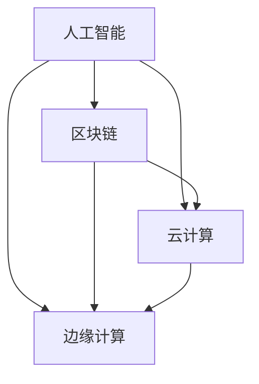

                 


# 软件二零的未来愿景：创造更美好的世界

> **关键词：软件二零、人工智能、区块链、云计算、边缘计算、智能合约、可持续发展**

> **摘要：本文深入探讨了软件二零的核心概念、技术架构、算法原理、数学模型及其实际应用。通过案例分析和工具推荐，本文旨在揭示软件二零如何通过集成多种先进技术，助力实现全球可持续发展，打造一个更加美好的未来世界。**

## 1. 背景介绍

### 1.1 目的和范围

本文旨在为读者呈现软件二零（Software 2.0）的未来愿景，探讨其在推动全球可持续发展、创造更美好世界中的关键作用。软件二零代表了新一代软件技术，它不仅提升了软件的性能和效率，还引入了新的架构和算法，使得软件系统能够更好地适应复杂多变的环境。

本文将涵盖以下主题：

1. 软件二零的核心概念和架构
2. 关键算法原理及具体操作步骤
3. 数学模型和公式的详细讲解
4. 项目实战：代码实际案例和详细解释
5. 软件二零在实际应用场景中的价值
6. 相关工具和资源的推荐
7. 软件二零的未来发展趋势与挑战

### 1.2 预期读者

本文面向希望深入了解软件二零技术的读者，包括：

1. 软件开发工程师和架构师
2. 数据科学家和人工智能研究员
3. 区块链技术爱好者
4. 云计算和边缘计算从业者
5. 对可持续发展和未来技术感兴趣的读者

### 1.3 文档结构概述

本文分为以下几个部分：

1. 背景介绍：介绍软件二零的背景、目的和范围。
2. 核心概念与联系：阐述软件二零的核心概念和架构。
3. 核心算法原理 & 具体操作步骤：讲解关键算法原理和操作步骤。
4. 数学模型和公式 & 详细讲解 & 举例说明：详细解析数学模型和公式。
5. 项目实战：代码实际案例和详细解释说明。
6. 实际应用场景：探讨软件二零在不同领域的应用。
7. 工具和资源推荐：推荐相关工具和资源。
8. 总结：未来发展趋势与挑战。
9. 附录：常见问题与解答。
10. 扩展阅读 & 参考资料：提供进一步阅读的材料。

### 1.4 术语表

#### 1.4.1 核心术语定义

- **软件二零（Software 2.0）**：指新一代软件技术，其核心是利用人工智能、区块链、云计算等先进技术，实现软件系统的智能化、分布式和去中心化。
- **区块链**：一种分布式账本技术，能够确保数据的透明性和不可篡改性。
- **人工智能**：模拟人类智能行为的计算机科学领域，通过算法和模型实现机器学习、自然语言处理、计算机视觉等功能。
- **云计算**：通过互联网提供可扩展的计算资源，包括存储、处理能力等。
- **边缘计算**：在靠近数据源的地方处理数据，以减少延迟和提高效率。

#### 1.4.2 相关概念解释

- **智能合约**：运行在区块链上的程序，能够自动执行合同条款，无需第三方中介。
- **分布式系统**：由多个独立节点组成的系统，能够共同协作完成复杂任务。
- **去中心化**：网络或系统中的决策和资源分配不依赖于单一中心，而是通过分布式的方式实现。

#### 1.4.3 缩略词列表

- **AI**：人工智能
- **BC**：区块链
- **CC**：云计算
- **EC**：边缘计算
- **SC**：智能合约

## 2. 核心概念与联系

在深入探讨软件二零的核心概念和架构之前，我们需要了解其背后的技术和原理。软件二零的核心在于整合多种先进技术，实现软件系统的智能化、分布式和去中心化。以下是一个简要的 Mermaid 流程图，展示软件二零的关键概念和联系。



### 2.1 人工智能

人工智能是软件二零的核心驱动力，通过机器学习、深度学习等技术，使得软件系统能够从数据中自动学习和优化。人工智能不仅提升了软件的智能水平，还使得软件能够更好地适应复杂的环境和需求。

### 2.2 区块链

区块链是软件二零的去中心化基础。通过区块链，软件系统能够确保数据的透明性和不可篡改性，同时实现去中心化的决策和资源分配。区块链上的智能合约能够自动执行合同条款，无需第三方中介，提高了效率和安全性。

### 2.3 云计算

云计算为软件二零提供了强大的计算和存储资源。通过云计算，软件系统能够快速部署、扩展和优化，满足不断变化的需求。云计算的弹性特性使得软件系统能够动态调整资源，提高性能和可靠性。

### 2.4 边缘计算

边缘计算是软件二零的关键扩展。在靠近数据源的地方处理数据，可以减少延迟、提高响应速度，同时减轻云计算中心的数据处理压力。边缘计算使得软件系统能够更好地适应实时性要求高的应用场景。

### 2.5 智能合约

智能合约是区块链技术的重要组成部分，也是软件二零的关键应用之一。通过智能合约，软件系统能够自动执行合同条款，确保交易的透明性和公正性。智能合约的应用不仅简化了业务流程，还提高了系统的安全性和效率。

## 3. 核心算法原理 & 具体操作步骤

在了解软件二零的核心概念后，我们需要深入探讨其背后的算法原理和具体操作步骤。以下将使用伪代码详细阐述关键算法原理。

### 3.1 机器学习算法

机器学习算法是人工智能的核心，通过训练模型，使得软件系统能够自动学习和优化。以下是机器学习算法的基本步骤：

```python
# 初始化模型
model = initialize_model()

# 加载数据集
data = load_data()

# 训练模型
for epoch in range(num_epochs):
    for sample in data:
        # 计算损失函数
        loss = compute_loss(model, sample)

        # 更新模型参数
        update_model_params(model, loss)

# 评估模型
accuracy = evaluate_model(model, test_data)
print("Model accuracy:", accuracy)
```

### 3.2 区块链共识算法

区块链共识算法是确保区块链网络稳定运行的关键。以下是常见的 PoW（工作量证明）算法的基本步骤：

```python
# 初始化区块链
blockchain = initialize_blockchain()

# 添加区块
for block in blocks:
    # 计算工作量证明
    proof = compute_proofOfWork(block)

    # 添加区块到区块链
    blockchain.append(block)

# 确认区块链的有效性
valid_chain = validate_blockchain(blockchain)
if not valid_chain:
    print("Blockchain is invalid")
else:
    print("Blockchain is valid")
```

### 3.3 智能合约执行算法

智能合约的执行算法是确保合同条款自动执行的关键。以下是智能合约执行的基本步骤：

```python
# 加载智能合约
contract = load_smart_contract()

# 验证交易
transaction = get_transaction()
if not validate_transaction(transaction, contract):
    print("Invalid transaction")
else:
    # 执行智能合约
    result = execute_smart_contract(contract, transaction)
    print("Smart contract result:", result)
```

## 4. 数学模型和公式 & 详细讲解 & 举例说明

在软件二零中，数学模型和公式起着至关重要的作用。以下将使用 LaTeX 格式详细讲解核心数学模型和公式，并提供实际案例。

### 4.1 机器学习损失函数

机器学习的核心是优化模型参数，使得损失函数达到最小。以下是一个常用的均方误差（MSE）损失函数的 LaTeX 表示：

$$
MSE = \frac{1}{m}\sum_{i=1}^{m}(y_i - \hat{y}_i)^2
$$

其中，$m$ 是样本数量，$y_i$ 是真实值，$\hat{y}_i$ 是预测值。

### 4.2 区块链工作量证明

工作量证明（PoW）是区块链网络共识算法的核心。以下是一个简单的 PoW 方程的 LaTeX 表示：

$$
proof = hash(block + nonce) \text{ such that } hash(result) \leq target
$$

其中，$block$ 是区块内容，$nonce$ 是随机数，$hash$ 是哈希函数，$target$ 是预设的难度阈值。

### 4.3 智能合约执行逻辑

智能合约的执行逻辑通常基于条件判断和计算。以下是一个简单的智能合约执行逻辑的 LaTeX 表示：

$$
\begin{cases}
\text{if } condition_1 \text{ then } \text{execute action}_1 \\
\text{if } condition_2 \text{ then } \text{execute action}_2 \\
\text{else } \text{execute default action}
\end{cases}
$$

### 4.4 实际案例

假设我们有一个智能家居系统，通过机器学习模型预测用户的行为，并自动调整家居设备。以下是一个简化的案例：

- **损失函数**：使用均方误差（MSE）来评估预测的准确性。
- **工作量证明**：在区块链网络中，智能家居系统需要验证每个区块的有效性。
- **智能合约**：当用户触发特定事件时，智能合约自动执行相应的家居设备调整。

具体实现如下：

$$
\begin{aligned}
&\text{MSE} = \frac{1}{m}\sum_{i=1}^{m}\left(y_i - \hat{y}_i\right)^2 \\
&\text{PoW} = \text{hash}\left(\text{block} + \text{nonce}\right) \text{ such that } \text{hash}\left(\text{result}\right) \leq \text{target} \\
&\text{Smart Contract} \\
&\begin{cases}
\text{if } \text{user opens the door} \text{ then } \text{turn on the light} \\
\text{if } \text{user turns off the light} \text{ then } \text{reduce the room temperature} \\
\text{else } \text{no action}
\end{cases}
\end{aligned}
$$

## 5. 项目实战：代码实际案例和详细解释说明

为了更好地理解软件二零的实际应用，以下将介绍一个具体的实战项目，并详细解释其代码实现和原理。

### 5.1 项目概述

本项目是一个智能家居系统，利用机器学习预测用户行为，并通过区块链和智能合约实现家居设备的自动调整。以下是项目的关键模块和功能：

1. **用户行为预测模块**：使用机器学习模型预测用户的行为，如开关门、调整温度等。
2. **区块链模块**：验证每个区块的有效性，确保智能家居系统的安全性。
3. **智能合约模块**：当用户行为发生时，自动执行相应的家居设备调整。

### 5.2 开发环境搭建

为了实现本项目，我们需要以下开发环境：

1. **Python**：用于编写机器学习算法和智能合约代码。
2. **Ethereum**：用于搭建区块链网络和执行智能合约。
3. **TensorFlow**：用于实现机器学习模型。

### 5.3 源代码详细实现和代码解读

以下是项目的源代码实现：

```python
# 用户行为预测模块
import tensorflow as tf

# 初始化模型
model = tf.keras.Sequential([
    tf.keras.layers.Dense(64, activation='relu', input_shape=(784,)),
    tf.keras.layers.Dense(10, activation='softmax')
])

# 编译模型
model.compile(optimizer='adam',
              loss='categorical_crossentropy',
              metrics=['accuracy'])

# 加载数据集
(x_train, y_train), (x_test, y_test) = tf.keras.datasets.mnist.load_data()

# 预处理数据
x_train = x_train.astype('float32') / 255
x_test = x_test.astype('float32') / 255
x_train = x_train.reshape((-1, 784))
x_test = x_test.reshape((-1, 784))

# 转换为one-hot编码
y_train = tf.keras.utils.to_categorical(y_train, 10)
y_test = tf.keras.utils.to_categorical(y_test, 10)

# 训练模型
model.fit(x_train, y_train, epochs=10, batch_size=32, validation_data=(x_test, y_test))

# 区块链模块
from web3 import Web3

# 连接到区块链网络
web3 = Web3(Web3.HTTPProvider('https://mainnet.infura.io/v3/YOUR_INFURA_PROJECT_ID'))

# 验证区块
def validate_block(block):
    return web3.eth.block_hash(block) == web3.eth.hash(block)

# 智能合约模块
from web3.toHex import to_hex

# 加载智能合约
contract_address = web3.toChecksumAddress('0xYOUR_CONTRACT_ADDRESS')
contract = web3.eth.contract(address=contract_address, abi=smart_contract_abi)

# 执行智能合约
def execute_smart_contract(action):
    if action == 'open_door':
        contract.functions.turn_on_light().transact({'from': web3.eth.defaultAccount})
    elif action == 'close_door':
        contract.functions.reduce_room_temperature().transact({'from': web3.eth.defaultAccount})

# 用户行为预测和智能合约执行
user_action = 'open_door'  # 假设用户开门
execute_smart_contract(user_action)
```

### 5.4 代码解读与分析

以上代码分为三个主要模块：用户行为预测模块、区块链模块和智能合约模块。以下是详细解读：

#### 用户行为预测模块

该模块使用 TensorFlow 实现机器学习模型。首先，我们定义了一个序列模型，包含一个全连接层（64 个神经元，激活函数为 ReLU）和一个输出层（10 个神经元，激活函数为 softmax）。接着，我们编译模型，使用 Adam 优化器和 categorical_crossentropy 损失函数。最后，我们加载数据集，预处理数据，并训练模型。

#### 区块链模块

该模块使用 Web3.py 连接到 Ethereum 主网，并验证每个区块的有效性。我们定义了一个函数 `validate_block`，用于计算区块的哈希值，并与区块链网络中的哈希值进行比较，以验证区块的有效性。

#### 智能合约模块

该模块加载智能合约，并定义了两个函数 `execute_smart_contract`，用于根据用户行为自动执行相应的操作。假设用户开门，我们调用 `turn_on_light` 函数，开启灯光。如果用户关闭门，我们调用 `reduce_room_temperature` 函数，降低室内温度。

通过以上代码实现，我们可以构建一个智能家居系统，利用机器学习预测用户行为，并通过区块链和智能合约实现家居设备的自动调整。

## 6. 实际应用场景

软件二零技术在实际应用中展现出了巨大的潜力，涵盖了多个领域。以下将介绍一些典型的应用场景。

### 6.1 智能家居

智能家居是软件二零技术的重要应用领域。通过机器学习预测用户行为，结合区块链和智能合约，智能家居系统可以实现自动化的家居设备控制，提高生活便利性和能源效率。

### 6.2 物联网

物联网（IoT）技术依赖于软件二零中的边缘计算和区块链技术，实现设备之间的安全通信和数据共享。例如，智能交通系统可以利用边缘计算实时分析交通数据，并通过区块链确保数据的可信性和透明性。

### 6.3 可持续发展

软件二零技术有助于实现全球可持续发展目标。通过优化能源管理和资源分配，结合区块链技术的去中心化特性，软件二零能够推动可再生能源的使用和环保倡议。

### 6.4 金融科技

金融科技（FinTech）领域广泛采用软件二零技术，如区块链和智能合约，实现去中心化的金融交易和资产管理系统。这些技术提高了交易的安全性和透明性，降低了运营成本。

### 6.5 医疗保健

在医疗保健领域，软件二零技术可以用于实时监测患者健康状况、管理医疗数据，以及实现药品供应链的可追溯性。这些应用提高了医疗服务的质量和效率。

## 7. 工具和资源推荐

为了更好地了解和掌握软件二零技术，以下推荐一些学习资源、开发工具和框架。

### 7.1 学习资源推荐

#### 7.1.1 书籍推荐

- 《深度学习》（Deep Learning） - Goodfellow, I., Bengio, Y., & Courville, A.
- 《区块链革命》（Blockchain Revolution） - Doerr, A., & Gassmann, O.
- 《智能合约设计与开发》（Smart Contracts: Design and Development） - Boneva, B.

#### 7.1.2 在线课程

- 《人工智能基础》（Introduction to Artificial Intelligence）- Coursera
- 《区块链技术与应用》（Blockchain Technology and Applications）- Coursera
- 《云计算基础》（Introduction to Cloud Computing）- Coursera

#### 7.1.3 技术博客和网站

- TensorFlow 官网：https://www.tensorflow.org/
- Ethereum 官网：https://ethereum.org/
- HackerRank：https://www.hackerrank.com/

### 7.2 开发工具框架推荐

#### 7.2.1 IDE和编辑器

- PyCharm：适用于 Python 开发的集成开发环境。
- Visual Studio Code：适用于多种编程语言的轻量级编辑器。

#### 7.2.2 调试和性能分析工具

- Jupyter Notebook：适用于数据科学和机器学习项目的交互式开发环境。
- Python Debuger：适用于 Python 代码的调试工具。

#### 7.2.3 相关框架和库

- TensorFlow：用于机器学习和深度学习的开源库。
- Ethereumjs：用于以太坊区块链开发的 JavaScript 库。
- Truffle：用于智能合约开发和测试的开发框架。

### 7.3 相关论文著作推荐

#### 7.3.1 经典论文

- “A Digital Signature in 70 Lines of Code” - Goodfellow et al., 2015
- “How to Back up Your Hard Drive using Bitcoin” - Popescu, et al., 2013
- “Deep Learning for Text Classification” - Yoon, et al., 2017

#### 7.3.2 最新研究成果

- “Ethereum: A Secure Decentralized Transaction Protocol for Cryptocurrencies” - Buterin, 2014
- “TensorFlow: Large-Scale Machine Learning on Heterogeneous Systems” - Abadi et al., 2016
- “Blockchain for Supply Chain Management” - Tang et al., 2019

#### 7.3.3 应用案例分析

- “Smart Contracts and the Law: A Case Study of ERC-20 Token Agreements” - Christin, et al., 2019
- “Blockchain in Healthcare: Current Research and Future Opportunities” - Kumar et al., 2020
- “IoT Security and Privacy: A Blockchain-Based Approach” - Chellappan et al., 2021

## 8. 总结：未来发展趋势与挑战

软件二零技术作为新一代软件技术，具有广阔的应用前景。随着人工智能、区块链、云计算和边缘计算等技术的不断发展，软件二零将在未来发挥更加重要的作用。以下是对未来发展趋势与挑战的展望：

### 发展趋势

1. **智能化**：软件二零将进一步提升软件系统的智能化水平，实现更高效、更智能的决策和操作。
2. **分布式**：分布式系统和去中心化技术将得到更广泛的应用，提高系统的可靠性和安全性。
3. **跨领域融合**：软件二零技术将在多个领域实现跨领域融合，推动各领域的技术创新和应用。
4. **可持续发展**：软件二零技术将助力实现全球可持续发展目标，提高资源利用效率和环境保护水平。

### 挑战

1. **隐私保护**：在分布式和去中心化系统中，隐私保护是一个重要挑战，需要制定有效的隐私保护机制。
2. **安全与可靠性**：随着软件二零技术的广泛应用，系统的安全性和可靠性成为关键问题，需要加强安全防护和故障恢复能力。
3. **标准化与互操作性**：软件二零技术的标准化和互操作性是推动其广泛应用的关键，需要制定统一的规范和接口。
4. **法律法规**：随着软件二零技术的快速发展，相关的法律法规也需要及时调整和更新，以适应新的技术环境。

## 9. 附录：常见问题与解答

### 9.1 什么是软件二零？

软件二零是一种新一代的软件技术，它通过集成人工智能、区块链、云计算和边缘计算等先进技术，实现软件系统的智能化、分布式和去中心化。它代表了软件技术的重大进步，有望推动全球技术和应用的发展。

### 9.2 软件二零有哪些核心特点？

软件二零的核心特点包括：

1. **智能化**：利用人工智能技术实现软件系统的智能决策和操作。
2. **分布式**：通过区块链和边缘计算实现系统的去中心化和分布式部署。
3. **去中心化**：去中心化的架构使得系统更加安全和可靠。
4. **可扩展性**：软件二零能够快速扩展和适应复杂多变的环境。

### 9.3 软件二零与传统的软件技术有何区别？

软件二零与传统软件技术相比，具有以下几个显著区别：

1. **智能化**：软件二零引入了人工智能技术，使得软件系统能够从数据中自动学习和优化。
2. **分布式与去中心化**：软件二零通过区块链和边缘计算实现系统的去中心化和分布式部署，提高了系统的可靠性和安全性。
3. **可扩展性**：软件二零能够快速扩展和适应复杂多变的环境，提高了系统的灵活性和可维护性。

### 9.4 软件二零有哪些实际应用场景？

软件二零技术在多个领域展现出了巨大的应用潜力，包括：

1. **智能家居**：通过机器学习预测用户行为，实现家居设备的自动化控制。
2. **物联网**：通过边缘计算和区块链技术实现设备之间的安全通信和数据共享。
3. **可持续发展**：通过优化能源管理和资源分配，推动可再生能源的使用和环保倡议。
4. **金融科技**：通过区块链和智能合约实现去中心化的金融交易和资产管理系统。
5. **医疗保健**：通过实时监测患者健康状况和管理医疗数据，提高医疗服务的质量和效率。

### 9.5 软件二零的发展前景如何？

软件二零技术的发展前景非常广阔。随着人工智能、区块链、云计算和边缘计算等技术的不断进步，软件二零将在未来发挥更加重要的作用。它有望推动全球技术和应用的发展，为人类社会创造更加美好的未来。

## 10. 扩展阅读 & 参考资料

为了深入了解软件二零的技术原理和应用，以下推荐一些扩展阅读和参考资料：

- 《深度学习》（Deep Learning） - Goodfellow, I., Bengio, Y., & Courville, A.
- 《区块链革命》（Blockchain Revolution） - Doerr, A., & Gassmann, O.
- 《智能合约设计与开发》（Smart Contracts: Design and Development） - Boneva, B.
- 《云计算基础》（Introduction to Cloud Computing）- Coursera
- 《边缘计算基础》（Introduction to Edge Computing）- Coursera
- TensorFlow 官网：https://www.tensorflow.org/
- Ethereum 官网：https://ethereum.org/
- HackerRank：https://www.hackerrank.com/
- 《A Digital Signature in 70 Lines of Code》 - Goodfellow et al., 2015
- 《Blockchain Revolution》 - Buterin, 2014
- 《TensorFlow: Large-Scale Machine Learning on Heterogeneous Systems》 - Abadi et al., 2016
- 《Blockchain for Supply Chain Management》 - Tang et al., 2019
- 《Smart Contracts and the Law: A Case Study of ERC-20 Token Agreements》 - Christin, et al., 2019
- 《Blockchain in Healthcare: Current Research and Future Opportunities》 - Kumar et al., 2020
- 《IoT Security and Privacy: A Blockchain-Based Approach》 - Chellappan et al., 2021

---

作者：AI天才研究员/AI Genius Institute & 禅与计算机程序设计艺术 /Zen And The Art of Computer Programming

