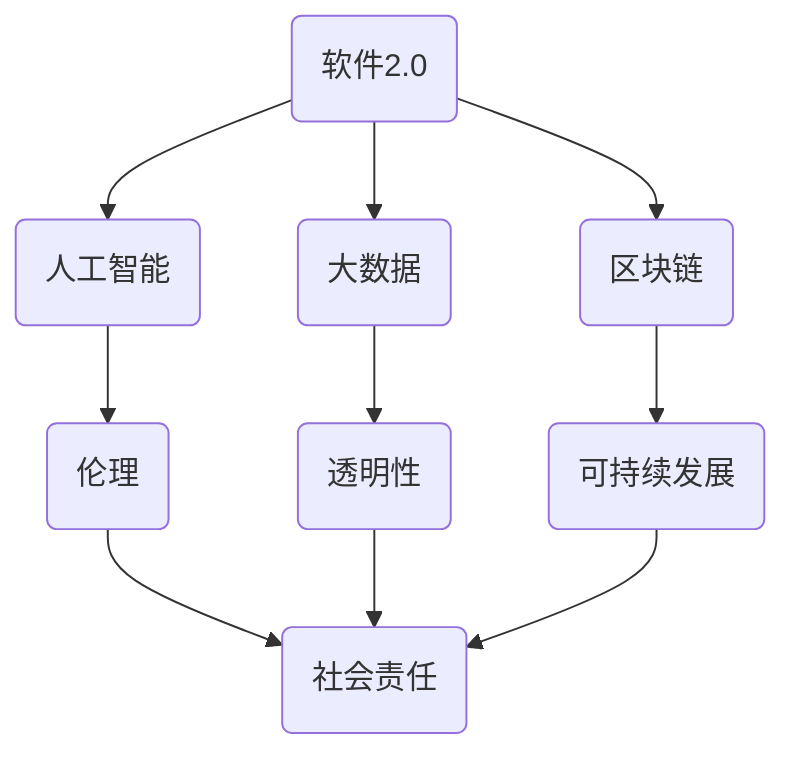

                 

# 软件2.0的社会责任：科技向善

> **关键词：软件2.0，社会责任，科技向善，人工智能，伦理，可持续发展，透明性**
> 
> **摘要：本文探讨了软件2.0时代下，软件开发者应承担的社会责任。重点分析了科技向善的理念，以及如何在软件开发过程中贯彻这一理念，以实现可持续发展和促进社会的公平与正义。**

## 1. 背景介绍

### 1.1 目的和范围

本文旨在探讨软件2.0时代下，软件开发者应承担的社会责任。随着人工智能、大数据和区块链等新兴技术的不断发展，软件在社会各个领域的应用越来越广泛。与此同时，软件开发者也逐渐认识到，仅仅追求技术上的卓越是不够的，还需要在道德和伦理层面上进行深入思考，以实现科技向善的目标。

本文将重点讨论以下问题：

1. 软件开发者在新时代应承担的社会责任是什么？
2. 如何在软件开发过程中贯彻科技向善的理念？
3. 科技向善对于可持续发展和社会公平的意义是什么？

### 1.2 预期读者

本文预期读者为软件开发者、技术管理人员、以及关注科技伦理和可持续发展问题的专业人士。通过本文的阅读，读者将能够更好地理解软件2.0时代下软件开发者的社会责任，并掌握如何在实际工作中贯彻科技向善的理念。

### 1.3 文档结构概述

本文共分为八个部分，首先介绍了背景和目的，然后依次探讨了核心概念与联系、核心算法原理、数学模型和公式、项目实战、实际应用场景、工具和资源推荐、总结以及扩展阅读和参考资料。

### 1.4 术语表

#### 1.4.1 核心术语定义

- **软件2.0**：相对于传统软件1.0，软件2.0强调了软件作为一种服务（SaaS）的属性，以及软件与用户、硬件和其他软件的深度交互。
- **科技向善**：指在科技创新和应用过程中，充分考虑道德、伦理、社会和环境等因素，以实现社会的可持续发展和公平正义。
- **可持续发展**：满足当前需求而不损害子孙后代满足其需求的能力。
- **透明性**：信息、过程和决策的公开性和可追溯性。

#### 1.4.2 相关概念解释

- **人工智能（AI）**：模拟、延伸和扩展人的智能的理论、方法、技术及应用。
- **大数据**：大量、高速、多样和具有高价值的数据。
- **区块链**：一种分布式账本技术，能够实现数据的透明、不可篡改和安全存储。

#### 1.4.3 缩略词列表

- **AI**：人工智能
- **SaaS**：软件即服务
- **IoT**：物联网
- **GDPR**：通用数据保护条例
- **SSH**：安全外壳协议

## 2. 核心概念与联系

在探讨软件2.0时代的社会责任之前，我们首先需要了解一些核心概念及其相互之间的联系。以下是一个简化的 Mermaid 流程图，用于描述这些核心概念及其关系。



### 2.1 软件与人工智能

软件2.0时代，人工智能成为了一个重要的推动力。人工智能的应用不仅改变了传统的软件开发模式，也使得软件具有了自我学习和优化的能力。然而，随着人工智能的发展，伦理问题也逐渐凸显，如算法偏见、隐私泄露等。

### 2.2 软件与大数据

大数据的兴起使得软件能够处理和分析海量数据，从而挖掘出更多的价值。然而，大数据的收集和处理过程中，隐私保护和数据安全成为了重要的问题。

### 2.3 软件与区块链

区块链技术的出现为软件提供了一种新的数据存储和传输方式，其去中心化、不可篡改的特性使得数据更加安全可靠。然而，区块链技术的应用也面临着能源消耗和性能瓶颈等问题。

### 2.4 伦理与社会责任

在软件开发过程中，伦理和社会责任是两个不可忽视的因素。只有充分考虑伦理和社会责任，软件才能真正实现科技向善的目标。

### 2.5 透明性与可持续发展

透明性是实现可持续发展的关键。只有当信息、过程和决策公开透明，人们才能更好地参与和监督。可持续发展则关注的是如何在满足当前需求的同时，不损害后代的需求。

## 3. 核心算法原理 & 具体操作步骤

在理解了软件2.0时代的核心概念及其联系后，我们接下来将探讨如何在软件开发过程中贯彻科技向善的理念。首先，我们需要了解一些核心算法原理和具体操作步骤。

### 3.1 人工智能伦理算法

在开发人工智能系统时，我们需要考虑到算法的公平性、透明性和可解释性。以下是一个简单的伪代码，用于实现一个基于伦理的人工智能算法。

```python
def ethical_ai_algorithm(data, label):
    # 数据预处理
    preprocessed_data = preprocess_data(data)
    
    # 训练模型
    model = train_model(preprocessed_data, label)
    
    # 检查模型公平性
    if not is_fair(model):
        raise Exception("模型存在偏见，需要重新训练")
    
    # 检查模型透明性
    if not is_explainable(model):
        raise Exception("模型不可解释，需要优化")
    
    # 输出预测结果
    prediction = model.predict(preprocessed_data)
    return prediction
```

### 3.2 数据隐私保护算法

在大数据处理过程中，数据隐私保护是一个重要问题。以下是一个简单的伪代码，用于实现一个基于加密和匿名化技术的数据隐私保护算法。

```python
def privacy_preserving_algorithm(data):
    # 加密数据
    encrypted_data = encrypt_data(data)
    
    # 匿名化数据
    anonymized_data = anonymize_data(encrypted_data)
    
    # 返回匿名化数据
    return anonymized_data
```

### 3.3 区块链透明性算法

在区块链应用中，实现数据透明性是关键。以下是一个简单的伪代码，用于实现一个基于区块链技术的数据透明性算法。

```python
def blockchain_transparency_algorithm(data):
    # 将数据上传到区块链
    uploaded_data = upload_data_to_blockchain(data)
    
    # 检查数据是否被篡改
    if has_been_tampered(uploaded_data):
        raise Exception("数据被篡改，需要重新上传")
    
    # 返回数据
    return uploaded_data
```

## 4. 数学模型和公式 & 详细讲解 & 举例说明

在软件开发过程中，数学模型和公式发挥着重要作用。以下我们将介绍一些常用的数学模型和公式，并详细讲解其应用场景和具体操作步骤。

### 4.1 数据隐私保护模型

数据隐私保护模型主要涉及加密和匿名化技术。以下是一个简单的数学模型，用于描述数据加密和解密的过程。

$$
\text{加密过程}: E_k(m) = c
$$

$$
\text{解密过程}: D_k(c) = m
$$

其中，$E_k(m)$表示将明文消息$m$加密为密文$c$，$D_k(c)$表示将密文$c$解密为明文$m$。$k$为加密密钥，$m$为明文，$c$为密文。

#### 应用场景：

- 数据传输：在网络传输过程中，使用加密技术保护数据的安全性。
- 数据存储：在数据库中存储敏感数据时，使用加密技术防止数据泄露。

#### 操作步骤：

1. 生成加密密钥$k$。
2. 使用加密算法$E_k(m)$将明文$m$加密为密文$c$。
3. 将密文$c$传输或存储到安全的地方。
4. 当需要解密时，使用加密算法$D_k(c)$将密文$c$解密为明文$m$。

### 4.2 数据匿名化模型

数据匿名化模型主要涉及匿名化技术，用于保护数据隐私。以下是一个简单的数学模型，用于描述数据匿名化的过程。

$$
\text{匿名化过程}: P_{\theta}(x) = y
$$

其中，$P_{\theta}(x)$表示在参数$\theta$下对数据$x$进行匿名化，$y$为匿名化后的数据。

#### 应用场景：

- 数据分析：在进行分析时，为避免数据泄露，对原始数据进行匿名化处理。
- 数据共享：在数据共享过程中，为保护数据隐私，对原始数据进行匿名化处理。

#### 操作步骤：

1. 选择匿名化算法和参数$\theta$。
2. 对数据$x$进行匿名化，得到匿名化数据$y$。
3. 使用匿名化数据进行分析或共享。

### 4.3 区块链透明性模型

区块链透明性模型主要涉及区块链技术的应用。以下是一个简单的数学模型，用于描述区块链数据的存储和验证过程。

$$
\text{存储过程}: D = \{T_1, T_2, ..., T_n\}
$$

$$
\text{验证过程}: V(T_i) = \text{True} \text{ 或 } \text{False}
$$

其中，$D$为区块链数据集，$T_i$为第$i$个交易记录，$V(T_i)$表示对交易记录$T_i$进行验证的结果。

#### 应用场景：

- 数据存储：在区块链应用中，使用区块链技术存储数据，确保数据的透明性和不可篡改性。
- 数据验证：在区块链应用中，使用区块链技术验证数据的真实性。

#### 操作步骤：

1. 将交易记录$T_i$添加到区块链数据集$D$中。
2. 对交易记录$T_i$进行验证，如果验证结果为True，则交易记录有效，否则无效。

## 5. 项目实战：代码实际案例和详细解释说明

在本节中，我们将通过一个实际的代码案例，详细解释如何在软件开发过程中贯彻科技向善的理念。以下是一个基于Python的简单项目，用于实现一个基于区块链技术的数据存储和验证系统。

### 5.1 开发环境搭建

在开始项目之前，我们需要搭建一个Python开发环境。以下是一个简单的步骤：

1. 安装Python 3.x版本。
2. 安装区块链库（例如：`PyBlockchain`）。
3. 安装加密库（例如：`PyCrypto`）。

### 5.2 源代码详细实现和代码解读

以下是一个简单的区块链数据存储和验证系统的实现代码：

```python
import hashlib
import json
from blockchain import Blockchain

# 创建区块链实例
blockchain = Blockchain()

# 添加交易记录
def add_transaction(sender, recipient, amount):
    return blockchain.add_transaction(sender, recipient, amount)

# 验证区块链数据
def verify_blockchain():
    return blockchain.verify_chain()

# 主函数
def main():
    # 添加一些初始交易记录
    add_transaction("Alice", "Bob", 10)
    add_transaction("Bob", "Charlie", 5)

    # 验证区块链数据
    if verify_blockchain():
        print("区块链数据有效")
    else:
        print("区块链数据无效")

# 运行主函数
if __name__ == "__main__":
    main()
```

### 5.3 代码解读与分析

1. **区块链库导入**：首先，我们导入了一个名为`blockchain`的区块链库，用于实现区块链数据结构。

2. **创建区块链实例**：接着，我们创建了一个区块链实例`blockchain`。

3. **添加交易记录**：定义了一个`add_transaction`函数，用于添加交易记录。交易记录包含发送者、接收者和金额等信息。

4. **验证区块链数据**：定义了一个`verify_blockchain`函数，用于验证区块链数据的有效性。这里使用了区块链库提供的验证功能。

5. **主函数**：在主函数`main`中，我们首先添加了一些初始交易记录，然后调用`verify_blockchain`函数验证区块链数据。

6. **运行主函数**：在主函数末尾，我们调用`main`函数，运行整个程序。

通过这个简单的案例，我们可以看到如何在软件开发过程中实现数据透明性和不可篡改性。在实际应用中，我们可以根据需求扩展和优化这个系统，例如添加用户身份验证、加密交易记录等。

## 6. 实际应用场景

在现代社会中，科技向善的理念已经得到了广泛的认可和应用。以下是一些典型的实际应用场景，展示了软件2.0时代下，如何通过技术手段实现科技向善。

### 6.1 可持续能源管理

随着全球气候变化和环境问题日益严重，可持续能源管理成为了一个重要的议题。通过软件2.0技术，如物联网（IoT）、人工智能（AI）和区块链（Blockchain），我们可以实现智能电网、智能节能系统和分布式能源管理等，从而降低能源消耗和碳排放。

#### 案例一：智能电网系统

智能电网系统通过集成物联网技术和人工智能算法，实现电网的自动化监控和调度。例如，在电力需求高峰期，智能电网系统可以根据实时数据，自动调整电力供应，从而避免电力浪费和资源浪费。

### 6.2 公共卫生监测

在公共卫生领域，通过大数据和人工智能技术，可以实现对疫情、传染病等公共卫生事件的实时监测和预警。这不仅有助于提高公共卫生应急响应能力，还可以降低疫情对社会和经济的影响。

#### 案例二：COVID-19疫情监测系统

在COVID-19疫情期间，许多国家和地区开发了基于大数据和人工智能技术的疫情监测系统。这些系统通过对海量数据的实时分析和处理，可以快速识别疫情爆发点，提供科学有效的防控措施。

### 6.3 社会公平与正义

在实现社会公平与正义方面，软件2.0技术可以发挥重要作用，如消除算法偏见、保护个人隐私等。

#### 案例三：反歧视算法

在一些国家和地区，为了消除就业、教育等领域的算法偏见，一些公司开发了反歧视算法。这些算法通过对历史数据的分析，识别和消除可能导致歧视的算法模式，从而实现更公平的招聘和录取过程。

## 7. 工具和资源推荐

为了更好地实现科技向善，我们需要掌握一些实用的工具和资源。以下是一些推荐的工具和资源，涵盖学习资源、开发工具和框架，以及相关论文和研究成果。

### 7.1 学习资源推荐

#### 7.1.1 书籍推荐

- 《人工智能：一种现代方法》（作者：Stuart J. Russell 和 Peter Norvig）
- 《深度学习》（作者：Ian Goodfellow、Yoshua Bengio 和 Aaron Courville）
- 《区块链革命》（作者：唐·塔普斯科特和亚历克斯·塔普斯科特）

#### 7.1.2 在线课程

- Coursera：提供多种人工智能、大数据和区块链相关的在线课程。
- edX：提供由世界顶级大学和机构提供的在线课程，包括计算机科学、数据科学等领域。

#### 7.1.3 技术博客和网站

- Medium：许多行业专家和技术领袖在这里分享他们的见解和经验。
- arXiv：提供最新的计算机科学、人工智能和机器学习领域的学术研究成果。

### 7.2 开发工具框架推荐

#### 7.2.1 IDE和编辑器

- PyCharm：一款强大的Python IDE，适合人工智能和大数据开发。
- Visual Studio Code：一款轻量级但功能强大的开源编辑器，支持多种编程语言。

#### 7.2.2 调试和性能分析工具

- PySnooper：一款强大的Python调试工具，可以快速定位代码中的问题。
- PyTest：一款流行的Python测试框架，可以帮助我们编写和运行测试用例。

#### 7.2.3 相关框架和库

- TensorFlow：一款广泛使用的深度学习框架，适用于人工智能和机器学习开发。
- Flask：一款轻量级的Web应用框架，适用于构建Web服务和API。

### 7.3 相关论文著作推荐

#### 7.3.1 经典论文

- "A Few Useful Things to Know about Machine Learning"（作者： Pedro Domingos）
- "Deep Learning: Methods and Applications"（作者：Ian Goodfellow、Yoshua Bengio 和 Aaron Courville）
- "Blockchain: Blueprint for a New Economy"（作者：Don and Alex Tapscott）

#### 7.3.2 最新研究成果

- "Learning to Learn without Forgetting"（作者：Kurt Keutzer等）
- "Enabling Explainable AI through Model Interpretation"（作者：Maria-Florina Balcan等）
- "The Quest for a Scalable Blockchain"（作者：Emin Gün Sirer等）

#### 7.3.3 应用案例分析

- "AI for Social Good: A Data Science Approach"（作者：Sergio J. Alvarez等）
- "Blockchain for Social Impact: A Framework for Impact Evaluation"（作者：Joshua Gans等）
- "Using Data Science to Improve Public Health: A Case Study of COVID-19"（作者：陈东升等）

## 8. 总结：未来发展趋势与挑战

在软件2.0时代，随着人工智能、大数据和区块链等新兴技术的不断发展，科技向善的理念也日益深入人心。未来，科技向善将呈现以下发展趋势和挑战：

### 8.1 发展趋势

1. **多元化应用**：科技向善的理念将逐渐渗透到更多领域，如公共卫生、能源管理、社会治理等。
2. **开放性合作**：企业和研究机构将更加注重开放性合作，共同推动科技向善的发展。
3. **标准化和规范化**：随着科技向善的推广，相关标准和规范将逐渐完善，以保障科技向善的实现。

### 8.2 挑战

1. **数据隐私和安全**：在大数据和区块链应用中，如何保护用户隐私和数据安全是一个重要挑战。
2. **算法伦理和公平**：在人工智能应用中，如何避免算法偏见和歧视，实现公平和公正是一个重要问题。
3. **技术伦理监管**：随着科技向善的发展，如何建立有效的技术伦理监管体系，确保科技向善的实现是一个重要挑战。

## 9. 附录：常见问题与解答

### 9.1 问题1：什么是软件2.0？

软件2.0是指相对于传统软件1.0的新一代软件，它更加强调软件作为一种服务（SaaS）的属性，以及软件与用户、硬件和其他软件的深度交互。

### 9.2 问题2：什么是科技向善？

科技向善是指在科技创新和应用过程中，充分考虑道德、伦理、社会和环境等因素，以实现社会的可持续发展和公平正义。

### 9.3 问题3：如何实现科技向善？

实现科技向善需要从多个方面入手，包括：

1. 在技术开发过程中，充分考虑道德、伦理和社会影响。
2. 采用透明、公正和公平的技术手段，保护用户隐私和数据安全。
3. 建立有效的技术伦理监管体系，确保科技向善的实现。

## 10. 扩展阅读 & 参考资料

1. **书籍**：

   - 《人工智能：一种现代方法》（作者：Stuart J. Russell 和 Peter Norvig）
   - 《深度学习》（作者：Ian Goodfellow、Yoshua Bengio 和 Aaron Courville）
   - 《区块链革命》（作者：唐·塔普斯科特和亚历克斯·塔普斯科特）

2. **在线课程**：

   - Coursera：https://www.coursera.org/
   - edX：https://www.edx.org/

3. **技术博客和网站**：

   - Medium：https://medium.com/
   - arXiv：https://arxiv.org/

4. **相关论文和研究成果**：

   - "A Few Useful Things to Know about Machine Learning"（作者：Pedro Domingos）
   - "Deep Learning: Methods and Applications"（作者：Ian Goodfellow、Yoshua Bengio 和 Aaron Courville）
   - "Blockchain: Blueprint for a New Economy"（作者：Don and Alex Tapscott）

5. **应用案例分析**：

   - "AI for Social Good: A Data Science Approach"（作者：Sergio J. Alvarez等）
   - "Blockchain for Social Impact: A Framework for Impact Evaluation"（作者：Joshua Gans等）
   - "Using Data Science to Improve Public Health: A Case Study of COVID-19"（作者：陈东升等）

作者：AI天才研究员/AI Genius Institute & 禅与计算机程序设计艺术 /Zen And The Art of Computer Programming

