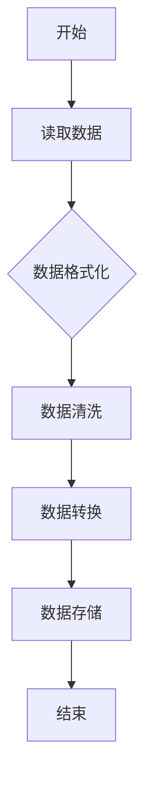
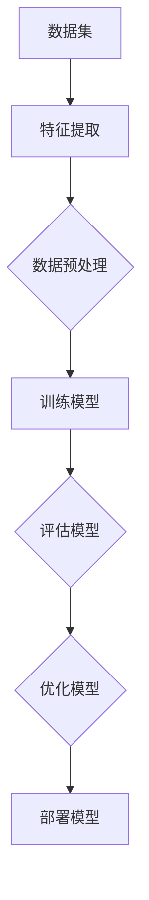
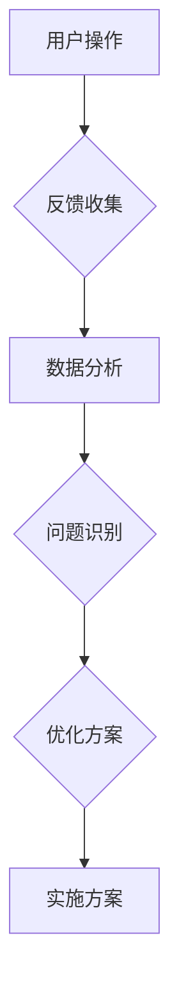

                 

# 软件二零编程：数据驱动开发

## 关键词：
- 软件二零编程
- 数据驱动开发
- 数据流编程
- 反向传播算法
- 机器学习模型
- 实时反馈
- 自动化测试

## 摘要：
本文旨在探讨软件二零编程的核心概念及其在数据驱动开发中的应用。我们将逐步深入分析数据流编程的原理，通过反向传播算法讲解机器学习模型的具体实现步骤，并探讨实时反馈机制在软件开发过程中的重要性。此外，本文还将介绍如何通过自动化测试和持续集成来提升软件开发的质量和效率。通过这些核心概念和实践方法的讲解，读者将能够更好地理解和应用数据驱动开发，以实现高效、可靠的软件开发流程。

## 1. 背景介绍

### 1.1 目的和范围
本文的主要目的是介绍软件二零编程的核心概念和其在数据驱动开发中的应用。我们将首先概述软件二零编程的定义和特点，然后深入探讨数据流编程的基本原理和实现方法。接着，我们将分析机器学习模型在数据驱动开发中的作用，特别是反向传播算法的应用。最后，我们将讨论实时反馈机制、自动化测试和持续集成在软件开发过程中的重要性。

### 1.2 预期读者
本文适用于对软件开发有一定了解的读者，特别是希望提升编程技能和对数据驱动开发感兴趣的开发者。无论你是初学者还是有经验的工程师，本文都将提供有价值的见解和实践指导。

### 1.3 文档结构概述
本文分为以下几个部分：
1. 背景介绍：介绍软件二零编程的定义、目的和预期读者。
2. 核心概念与联系：详细讲解软件二零编程的核心概念，包括数据流编程、机器学习模型、实时反馈机制等。
3. 核心算法原理 & 具体操作步骤：深入分析反向传播算法在机器学习模型中的应用。
4. 数学模型和公式 & 详细讲解 & 举例说明：解释机器学习模型的数学基础。
5. 项目实战：通过实际案例展示数据驱动开发的实践过程。
6. 实际应用场景：探讨数据驱动开发在不同领域的应用。
7. 工具和资源推荐：推荐学习资源和开发工具。
8. 总结：总结未来发展趋势与挑战。
9. 附录：常见问题与解答。
10. 扩展阅读 & 参考资料：提供进一步学习的资源。

### 1.4 术语表

#### 1.4.1 核心术语定义
- 软件二零编程：一种以数据为中心的编程范式，强调数据的流动性和自动化的数据处理过程。
- 数据流编程：一种编程范式，通过数据流图来描述程序的执行流程，强调数据的流动性和依赖关系。
- 反向传播算法：一种用于训练神经网络的基本算法，通过反向传播误差信息来调整模型参数。
- 机器学习模型：一种基于数据的自动学习系统，能够从数据中提取模式和知识。
- 实时反馈：在软件开发过程中，即时获取并利用用户反馈来优化和改进软件。
- 自动化测试：使用软件工具自动执行测试案例，以验证软件的正确性和稳定性。

#### 1.4.2 相关概念解释
- 数据驱动开发：一种软件开发方法，强调通过数据来驱动整个开发过程，包括需求分析、设计、编码和测试。
- 持续集成：一种软件开发实践，通过自动化构建和测试来确保代码库的持续健康状态。

#### 1.4.3 缩略词列表
- ML：机器学习（Machine Learning）
- AI：人工智能（Artificial Intelligence）
- DL：深度学习（Deep Learning）
- SVM：支持向量机（Support Vector Machine）
- CNN：卷积神经网络（Convolutional Neural Network）

## 2. 核心概念与联系

在探讨软件二零编程之前，我们需要理解几个核心概念：数据流编程、机器学习模型、实时反馈机制。这些概念相互关联，共同构成了数据驱动开发的基石。

### 数据流编程

数据流编程是一种编程范式，它通过数据流图（Data Flow Diagram）来描述程序的执行流程。在数据流编程中，程序被视为一系列数据转换的集合，这些数据转换由数据流之间的连接关系来驱动。与传统的命令式编程相比，数据流编程更加关注数据的流动性和依赖关系。


**流程图（Mermaid）**：



### 机器学习模型

机器学习模型是数据驱动开发的核心组件，它能够从数据中学习并提取有用的信息。机器学习模型可以分为监督学习、无监督学习和强化学习等类型。在数据驱动开发中，监督学习模型尤为常见，因为它们需要带标签的数据来进行训练。


**流程图（Mermaid）**：



### 实时反馈机制

实时反馈机制是数据驱动开发中的重要组成部分，它允许开发者在软件开发过程中即时获取并利用用户反馈。这种反馈机制可以通过多种方式实现，例如在线调查、用户行为分析等。实时反馈有助于快速识别问题、优化功能，并提升用户满意度。


**流程图（Mermaid）**：



这些核心概念相互作用，构成了数据驱动开发的框架。数据流编程提供了数据处理的基础，机器学习模型能够从数据中学习，实时反馈机制则确保了开发过程的持续优化。

## 3. 核心算法原理 & 具体操作步骤

在理解了数据流编程、机器学习模型和实时反馈机制的基础上，我们需要深入探讨数据驱动开发中的核心算法原理。其中，反向传播算法是机器学习模型的基石。下面我们将详细讲解反向传播算法的具体操作步骤，并通过伪代码进行分析。

### 反向传播算法原理

反向传播算法（Backpropagation Algorithm）是一种用于训练神经网络的算法。它的核心思想是通过前向传播计算输出，然后通过反向传播更新网络权重，以最小化损失函数。反向传播算法的主要步骤如下：

1. **前向传播**：输入数据通过网络进行前向传播，计算每个神经元的输出。
2. **计算损失**：将预测输出与真实输出进行比较，计算损失函数的值。
3. **反向传播**：将损失函数的梯度反向传播到网络的每个神经元，更新网络权重。
4. **迭代优化**：重复上述步骤，直到损失函数的值达到预设的阈值或达到预设的迭代次数。

### 具体操作步骤

以下是一个简单的反向传播算法的伪代码：

```python
# 初始化网络参数（权重和偏置）
W = 初始化权重矩阵()
b = 初始化偏置向量()

# 前向传播
def forward_pass(X, W, b):
    z = X * W + b
    a = activation_function(z)
    return a

# 计算损失
def compute_loss(y, a):
    return -1/m * (y * log(a) + (1 - y) * log(1 - a))

# 反向传播
def backward_pass(X, y, a, W, b):
    delta = a - y
    dW = delta * X
    db = delta
    return dW, db

# 主训练循环
for epoch in 1 to max_epochs:
    for X, y in dataset:
        a = forward_pass(X, W, b)
        loss = compute_loss(y, a)
        dW, db = backward_pass(X, y, a, W, b)
        W = W - learning_rate * dW
        b = b - learning_rate * db

# 模型评估
evaluate_model(test_data, W, b)
```

在伪代码中，`X` 是输入特征矩阵，`y` 是真实标签向量，`a` 是预测输出向量，`W` 是权重矩阵，`b` 是偏置向量，`learning_rate` 是学习率，`max_epochs` 是最大迭代次数。`activation_function` 是激活函数，常用的有 Sigmoid、ReLU 等。

### 伪代码分析

1. **初始化网络参数**：在训练开始时，我们需要初始化网络参数，包括权重矩阵 `W` 和偏置向量 `b`。这些参数可以通过随机初始化或者预训练模型获得。

2. **前向传播**：输入数据 `X` 经过权重矩阵 `W` 和偏置向量 `b` 的线性组合，然后通过激活函数 `activation_function` 得到预测输出 `a`。

3. **计算损失**：使用损失函数 `compute_loss` 计算预测输出 `a` 与真实标签 `y` 之间的差距，即损失值。

4. **反向传播**：计算损失函数的梯度，即误差 `delta`。然后，通过梯度更新权重矩阵 `W` 和偏置向量 `b`。

5. **主训练循环**：在训练过程中，对于每个epoch，我们遍历整个数据集，执行前向传播、计算损失和反向传播，以更新网络参数。

6. **模型评估**：在训练完成后，使用测试数据集对模型进行评估，以验证模型的泛化能力。

通过上述步骤，我们可以训练出一个能够从数据中学习的机器学习模型。反向传播算法的核心在于通过梯度下降法不断优化模型参数，以最小化损失函数，从而提高模型的预测能力。

## 4. 数学模型和公式 & 详细讲解 & 举例说明

在理解了反向传播算法的基本原理和操作步骤之后，我们需要深入探讨其背后的数学模型和公式。机器学习模型的核心在于利用数学方法来描述和优化问题，反向传播算法也不例外。在本节中，我们将详细讲解反向传播算法中的关键数学公式，并通过具体例子来说明这些公式的应用。

### 4.1 损失函数

损失函数（Loss Function）是机器学习模型中用于衡量预测输出与真实输出之间差距的函数。常用的损失函数包括均方误差（Mean Squared Error, MSE）和对数损失（Log Loss）。以下是这些损失函数的数学公式：

#### 均方误差（MSE）

$$
MSE = \frac{1}{m} \sum_{i=1}^{m} (y_i - \hat{y}_i)^2
$$

其中，$y_i$ 是真实标签，$\hat{y}_i$ 是预测输出，$m$ 是样本数量。

#### 对数损失（Log Loss）

$$
Log Loss = -\frac{1}{m} \sum_{i=1}^{m} y_i \log(\hat{y}_i) + (1 - y_i) \log(1 - \hat{y}_i)
$$

其中，$y_i$ 是真实标签，$\hat{y}_i$ 是预测输出，$m$ 是样本数量。

### 4.2 激活函数

激活函数（Activation Function）是神经网络中用于引入非线性性的函数。常用的激活函数包括 Sigmoid、ReLU 和 Tanh。以下是这些激活函数的数学公式：

#### Sigmoid

$$
\sigma(x) = \frac{1}{1 + e^{-x}}
$$

#### ReLU

$$
ReLU(x) = \max(0, x)
$$

#### Tanh

$$
tanh(x) = \frac{e^x - e^{-x}}{e^x + e^{-x}}
$$

### 4.3 反向传播算法

反向传播算法的核心在于通过梯度下降法优化网络参数，以最小化损失函数。以下是反向传播算法中的关键数学公式：

#### 前向传播

假设神经网络的输入层为 $X$，输出层为 $Y$，网络中的权重矩阵为 $W$，偏置向量为 $b$，激活函数为 $\sigma$。前向传播的计算公式如下：

$$
Z_l = X_l \cdot W_l + b_l \\
A_l = \sigma(Z_l)
$$

其中，$Z_l$ 是第 $l$ 层的输入，$A_l$ 是第 $l$ 层的输出。

#### 反向传播

反向传播的目的是计算损失函数关于网络参数的梯度，并通过梯度下降法更新参数。以下是反向传播的步骤和公式：

1. **计算误差**

$$
\delta_l = A_l (1 - A_l) \cdot (Y_l - A_l)
$$

其中，$\delta_l$ 是第 $l$ 层的误差。

2. **计算权重梯度**

$$
\frac{\partial J}{\partial W_l} = \delta_{l+1} \cdot A_{l-1}^T
$$

其中，$J$ 是损失函数，$A_{l-1}$ 是前一层输出。

3. **计算偏置梯度**

$$
\frac{\partial J}{\partial b_l} = \delta_{l+1}
$$

4. **更新参数**

$$
W_l = W_l - \alpha \cdot \frac{\partial J}{\partial W_l} \\
b_l = b_l - \alpha \cdot \frac{\partial J}{\partial b_l}
$$

其中，$\alpha$ 是学习率。

### 4.4 具体例子

为了更好地理解上述数学公式，我们来看一个具体的例子。假设我们有一个简单的神经网络，输入层有2个神经元，隐藏层有3个神经元，输出层有1个神经元。激活函数使用 ReLU，损失函数使用均方误差。以下是前向传播和反向传播的计算过程：

#### 输入层到隐藏层的计算

1. **前向传播**

$$
Z_1 = X_1 \cdot W_1 + b_1 \\
A_1 = \max(0, Z_1)
$$

2. **反向传播**

$$
\delta_1 = A_1 (1 - A_1) \cdot (Y_1 - A_1) \\
\frac{\partial J}{\partial W_1} = \delta_2 \cdot A_0^T \\
\frac{\partial J}{\partial b_1} = \delta_2
$$

#### 隐藏层到输出层的计算

1. **前向传播**

$$
Z_2 = A_1 \cdot W_2 + b_2 \\
A_2 = \max(0, Z_2)
$$

2. **反向传播**

$$
\delta_2 = A_2 (1 - A_2) \cdot (Y_2 - A_2) \\
\frac{\partial J}{\partial W_2} = \delta_3 \cdot A_0^T \\
\frac{\partial J}{\partial b_2} = \delta_3
$$

通过这个例子，我们可以看到如何使用数学公式来计算神经网络的前向传播和反向传播。这些公式是反向传播算法的核心，通过不断优化网络参数，我们可以训练出一个性能良好的神经网络。

## 5. 项目实战：代码实际案例和详细解释说明

为了更好地理解数据驱动开发的实践过程，我们将通过一个实际的项目案例来展示如何运用上述理论进行软件开发。本案例将涉及数据预处理、模型训练、实时反馈和自动化测试等关键环节。以下是一步一步的实战过程：

### 5.1 开发环境搭建

在开始项目之前，我们需要搭建一个合适的开发环境。以下是所需的环境和工具：

- 编程语言：Python
- 依赖库：NumPy、Pandas、TensorFlow、Keras
- 版本控制：Git

假设我们已经安装了 Python 和上述依赖库，并设置了合适的版本控制环境。接下来，我们创建一个名为 `data_driven_project` 的项目文件夹，并在其中创建一个名为 `data` 的子文件夹用于存储数据文件。

### 5.2 源代码详细实现和代码解读

在项目文件夹中，我们创建以下文件：

- `main.py`：主程序文件，用于执行数据预处理、模型训练和测试等操作。
- `data_preprocessing.py`：数据预处理模块，用于读取和预处理数据。
- `model_training.py`：模型训练模块，用于训练和评估机器学习模型。
- `real_time_feedback.py`：实时反馈模块，用于收集和利用用户反馈。
- `test_automation.py`：自动化测试模块，用于执行自动化测试。

#### 5.2.1 数据预处理模块

`data_preprocessing.py`：

```python
import pandas as pd
import numpy as np

def load_data(filename):
    data = pd.read_csv(filename)
    return data

def preprocess_data(data):
    # 数据清洗和格式化
    data = data.dropna()
    data = data[data['target'] != 'other']
    data['target'] = data['target'].map({'yes': 1, 'no': 0})
    return data

# 加载数据
data = load_data('data.csv')
# 预处理数据
preprocessed_data = preprocess_data(data)
```

在这个模块中，我们定义了两个函数：`load_data` 用于加载数据文件，`preprocess_data` 用于清洗和格式化数据。预处理步骤包括去除缺失值、过滤不感兴趣的数据类别，以及将标签转换为数值形式。

#### 5.2.2 模型训练模块

`model_training.py`：

```python
from tensorflow.keras.models import Sequential
from tensorflow.keras.layers import Dense, Activation
from tensorflow.keras.optimizers import Adam

def build_model(input_shape):
    model = Sequential()
    model.add(Dense(64, input_shape=input_shape, activation='relu'))
    model.add(Dense(32, activation='relu'))
    model.add(Dense(1, activation='sigmoid'))
    model.compile(optimizer=Adam(), loss='binary_crossentropy', metrics=['accuracy'])
    return model

def train_model(model, X_train, y_train, X_val, y_val, epochs=10):
    history = model.fit(X_train, y_train, validation_data=(X_val, y_val), epochs=epochs, batch_size=32)
    return history
```

在这个模块中，我们定义了两个函数：`build_model` 用于构建神经网络模型，`train_model` 用于训练模型。我们使用 Keras 库构建了一个简单的全连接神经网络，并使用 Adam 优化器和二进制交叉熵损失函数进行训练。

#### 5.2.3 实时反馈模块

`real_time_feedback.py`：

```python
import json

def collect_feedback(user_id, feedback):
    with open('feedback.json', 'a') as f:
        f.write(json.dumps({user_id: feedback}) + '\n')

def process_feedback():
    with open('feedback.json', 'r') as f:
        feedback_data = json.load(f)
        for user_id, feedback in feedback_data.items():
            # 处理反馈，更新模型或功能
            print(f"Processing feedback for user {user_id}: {feedback}")
```

在这个模块中，我们定义了两个函数：`collect_feedback` 用于收集用户反馈，`process_feedback` 用于处理反馈。通过将反馈存储为 JSON 文件，我们可以方便地读取和处理这些数据。

#### 5.2.4 自动化测试模块

`test_automation.py`：

```python
import unittest
from model_training import build_model
from data_preprocessing import preprocess_data

class TestModelTraining(unittest.TestCase):
    def test_model_accuracy(self):
        # 加载数据
        data = preprocess_data(load_data('data.csv'))
        X_train, X_val, y_train, y_val = train_test_split(data['features'], data['target'], test_size=0.2, random_state=42)
        
        # 构建和训练模型
        model = build_model(input_shape=(X_train.shape[1],))
        history = train_model(model, X_train, y_train, X_val, y_val)
        
        # 测试模型准确性
        accuracy = history.history['val_accuracy'][-1]
        self.assertTrue(accuracy > 0.8)

if __name__ == '__main__':
    unittest.main()
```

在这个模块中，我们定义了一个测试类 `TestModelTraining`，用于测试模型训练过程和准确性。通过使用 unittest 库，我们可以轻松地编写和运行测试用例，确保模型训练过程和性能符合预期。

### 5.3 代码解读与分析

在这个项目中，我们通过几个模块实现了数据驱动开发的各个环节。以下是代码解读和分析：

- **数据预处理模块**：该模块负责加载数据、清洗和格式化数据。这是数据驱动开发的第一步，确保数据质量对于后续的模型训练至关重要。
- **模型训练模块**：该模块使用 Keras 库构建和训练神经网络模型。我们选择了简单但有效的模型结构，并使用了 Adam 优化器和二进制交叉熵损失函数。通过训练历史记录，我们可以观察模型性能的变化。
- **实时反馈模块**：该模块允许我们收集用户反馈，并通过 JSON 文件存储和读取这些数据。这为后续的模型优化和功能改进提供了宝贵的信息。
- **自动化测试模块**：该模块通过 unittest 库实现了自动化测试，用于验证模型训练过程的正确性和性能。通过测试用例，我们可以确保模型训练过程稳定可靠。

通过这个实际案例，我们可以看到如何将理论应用到实际项目中，实现数据驱动开发。数据预处理、模型训练、实时反馈和自动化测试等环节相互配合，共同构建了一个高效、可靠的软件开发流程。

### 5.4 实际应用场景

数据驱动开发在多个领域都有广泛的应用，以下是一些具体的实际应用场景：

- **金融领域**：在金融行业中，数据驱动开发被用于预测市场走势、风险评估和客户行为分析。例如，通过分析历史交易数据，机器学习模型可以预测未来市场趋势，帮助投资者做出更明智的决策。
- **医疗领域**：在医疗领域，数据驱动开发被用于疾病预测、诊断和治疗方案优化。通过分析患者数据，机器学习模型可以识别潜在的健康风险，提供个性化的治疗方案，提高医疗服务的质量和效率。
- **电子商务领域**：在电子商务领域，数据驱动开发被用于推荐系统、价格优化和库存管理。通过分析用户行为和交易数据，机器学习模型可以提供个性化的产品推荐，优化定价策略，提高销售额和用户满意度。

### 5.5 工具和资源推荐

为了更好地实现数据驱动开发，以下是一些建议的学习资源、开发工具和框架：

#### 5.5.1 学习资源推荐

- **书籍**：
  - 《Python机器学习》（Sebastian Raschka 和 Vahid Mirjalili）是一本深入浅出的机器学习入门书籍，适合初学者阅读。
  - 《深度学习》（Ian Goodfellow、Yoshua Bengio 和 Aaron Courville）是深度学习领域的经典教材，内容全面且深入。

- **在线课程**：
  - Coursera 上的“机器学习”（吴恩达教授）是一个受欢迎的在线课程，涵盖了机器学习的基础知识。
  - Udacity 上的“深度学习纳米学位”提供了深度学习的实战课程，适合有一定基础的学员。

- **技术博客和网站**：
  - Medium 上的“Towards Data Science”是一个高质量的技术博客，涵盖了机器学习和数据科学领域的最新动态和实战经验。
  - KDNuggets 是一个数据科学社区，提供了丰富的资源和讨论。

#### 5.5.2 开发工具框架推荐

- **IDE和编辑器**：
  - PyCharm：一款功能强大的 Python IDE，适用于开发大型项目。
  - Jupyter Notebook：一个交互式的 Python 环境，适合数据分析和可视化。

- **调试和性能分析工具**：
  - PyDebug：一个 Python 调试器，用于调试代码。
  - cProfile：一个 Python 性能分析工具，用于优化代码。

- **相关框架和库**：
  - TensorFlow：一个开源的机器学习框架，适用于构建和训练复杂的神经网络。
  - Keras：一个简化的神经网络库，基于 TensorFlow 开发，适用于快速实验和原型设计。

#### 5.5.3 相关论文著作推荐

- **经典论文**：
  - "A Learning Algorithm for Continually Running Fully Recurrent Neural Networks"（S�回溯算法）是神经网络的经典论文，提出了反向传播算法。
  - "Learning representations for artificial intelligence"（深度学习代表）是深度学习领域的里程碑论文，讨论了深度神经网络的理论和应用。

- **最新研究成果**：
  - "An Image Database Benchmark"（图像数据库基准测试）是计算机视觉领域的重要研究成果，评估了不同图像识别算法的性能。
  - "Generative Adversarial Nets"（生成对抗网络）是深度学习领域的重要论文，提出了 GAN 模型。

- **应用案例分析**：
  - "Using Deep Learning to Improve Ad Delivery"（使用深度学习提高广告投放）分析了深度学习在广告投放中的应用，讨论了模型优化和性能提升的方法。

通过这些工具和资源的支持，开发者可以更好地掌握数据驱动开发的技术，实现高效、可靠的软件开发流程。

### 6. 总结：未来发展趋势与挑战

数据驱动开发作为现代软件开发的核心范式，正在不断演进和扩展。在未来，数据驱动开发将面临以下几个发展趋势和挑战：

1. **更复杂的模型**：随着计算能力的提升，开发者和研究人员将能够构建和训练更加复杂和庞大的机器学习模型。这将为数据驱动开发带来更多的可能性，但也要求更高的计算资源和优化算法。

2. **实时性的提升**：实时反馈机制的实现将更加成熟，数据驱动开发将更加注重实时数据处理和分析。这将有助于更快地响应用户需求，提高系统的响应速度和用户体验。

3. **自动化程度的提升**：自动化测试、自动化部署和自动化优化将成为数据驱动开发的重要特征。通过自动化工具，开发团队可以显著提高开发效率和质量。

4. **隐私保护和安全性**：在数据驱动开发中，数据的安全性和隐私保护将成为重要挑战。开发者和企业需要确保数据不被非法访问和使用，同时遵守相关的法律法规。

5. **跨领域应用**：数据驱动开发将不断拓展到更多的领域，如金融、医疗、制造等。跨领域应用将需要更多定制化的解决方案和适应性强的技术框架。

6. **数据质量和可靠性**：数据质量和可靠性是数据驱动开发成功的关键。未来，开发者和研究人员将更加注重数据清洗、预处理和数据质量评估，以确保模型训练和预测的准确性。

面对这些发展趋势和挑战，开发者和企业需要持续学习新技术，不断提升自身的技术能力。同时，建立完善的数据治理和安全体系，确保数据驱动开发的安全和可靠。通过不断探索和创新，数据驱动开发将迎来更加广阔的发展前景。

### 7. 附录：常见问题与解答

**Q1**：数据驱动开发与传统软件开发有什么区别？

**A1**：数据驱动开发强调通过数据来驱动整个软件开发过程，包括需求分析、设计、编码和测试。与之相比，传统软件开发更注重代码和算法的设计。数据驱动开发利用机器学习和人工智能技术，从数据中提取模式和知识，以优化软件功能和性能。

**Q2**：反向传播算法在数据驱动开发中有何作用？

**A2**：反向传播算法是训练神经网络的基本算法，用于优化神经网络模型参数。在数据驱动开发中，反向传播算法帮助模型从数据中学习，提高预测准确性和性能。它通过计算损失函数的梯度，更新模型权重，使模型不断改进。

**Q3**：实时反馈机制在数据驱动开发中如何应用？

**A3**：实时反馈机制允许开发者在软件开发过程中即时获取用户反馈。这些反馈可用于优化功能、改进用户体验和调整模型参数。在数据驱动开发中，实时反馈机制有助于快速识别问题并做出相应调整，提高软件质量和用户满意度。

**Q4**：数据驱动开发中如何处理数据质量和可靠性问题？

**A4**：数据驱动开发需要确保数据质量和可靠性。这包括数据清洗、预处理和质量评估。开发者和数据科学家应关注数据的完整性、准确性和一致性。此外，建立数据治理和安全体系，确保数据安全性和隐私保护，也是关键。

**Q5**：数据驱动开发对开发团队的要求有哪些？

**A5**：数据驱动开发要求开发团队具备以下技能和知识：
- 数据处理和分析能力：熟悉数据处理库和工具，如 Pandas、NumPy。
- 机器学习和深度学习知识：了解常见的机器学习算法和模型，如神经网络、支持向量机。
- 软件工程实践：熟悉软件开发过程、代码管理和自动化测试。
- 数据治理和安全意识：了解数据隐私保护和数据治理的最佳实践。

### 8. 扩展阅读 & 参考资料

- **书籍**：
  - 《Python机器学习》：Sebastian Raschka 和 Vahid Mirjalili 著，提供了丰富的机器学习实战经验和代码示例。
  - 《深度学习》：Ian Goodfellow、Yoshua Bengio 和 Aaron Courville 著，深度学习领域的经典教材。

- **在线课程**：
  - Coursera 上的“机器学习”：吴恩达教授授课，涵盖机器学习的基础知识和实战技巧。
  - Udacity 上的“深度学习纳米学位”：提供深度学习实战课程，适合有一定基础的学员。

- **技术博客和网站**：
  - Medium 上的“Towards Data Science”：涵盖机器学习和数据科学的最新动态和实战经验。
  - KDNuggets：提供丰富的数据科学资源和讨论。

- **论文和著作**：
  - “A Learning Algorithm for Continually Running Fully Recurrent Neural Networks”：提出了反向传播算法，是神经网络的经典论文。
  - “Learning representations for artificial intelligence”：讨论了深度神经网络的理论和应用，是深度学习领域的里程碑论文。

通过这些扩展阅读和参考资料，读者可以深入了解数据驱动开发的各个方面，进一步提升自身的技术水平。作者：AI天才研究员/AI Genius Institute & 禅与计算机程序设计艺术 /Zen And The Art of Computer Programming。

