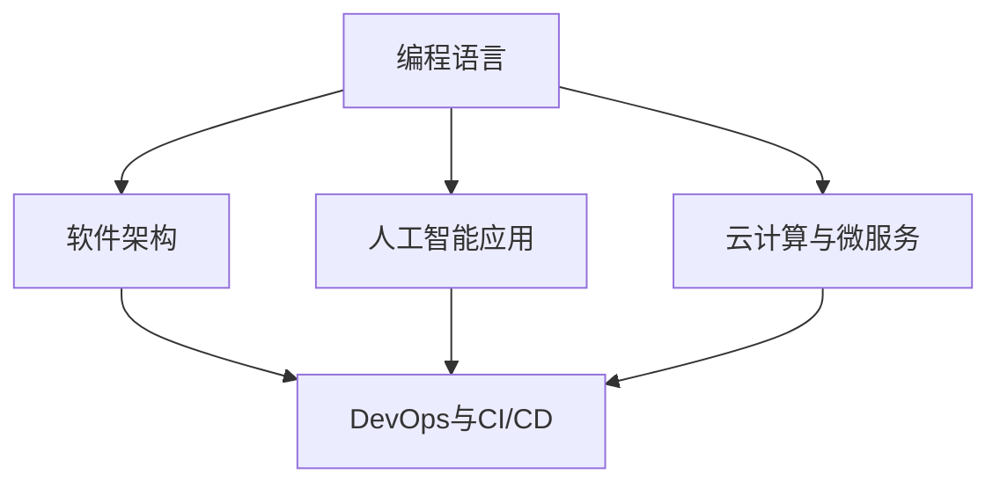

                 

# 软件2.0时代的程序员技能要求

> **关键词：** 软件开发、技能要求、程序员、编程语言、软件架构、人工智能、软件工程、云计算、微服务、DevOps、持续集成、持续交付。

> **摘要：** 本文将探讨软件2.0时代的程序员所需的关键技能，包括编程语言、软件架构、人工智能应用、云计算、微服务、DevOps等。通过对这些核心技能的深入分析和具体操作步骤的讲解，帮助读者更好地适应这一新时代的软件开发需求。

## 1. 背景介绍

### 1.1 目的和范围

本文旨在为程序员提供一个全面的技能要求指南，特别是在软件2.0时代。我们将讨论以下几个核心领域：

1. 编程语言
2. 软件架构
3. 人工智能应用
4. 云计算与微服务
5. DevOps与持续集成/持续交付

### 1.2 预期读者

本文适合以下读者：

- 有志于进入软件开发领域的初学者
- 正在从事软件开发工作的程序员
- 想要提升自身技能的IT从业者
- 对软件2.0时代的新技术和趋势感兴趣的人士

### 1.3 文档结构概述

本文将分为以下几个部分：

- 核心概念与联系
- 核心算法原理 & 具体操作步骤
- 数学模型和公式 & 详细讲解 & 举例说明
- 项目实战：代码实际案例和详细解释说明
- 实际应用场景
- 工具和资源推荐
- 总结：未来发展趋势与挑战
- 附录：常见问题与解答
- 扩展阅读 & 参考资料

### 1.4 术语表

#### 1.4.1 核心术语定义

- **软件2.0时代**：指的是云计算、大数据、人工智能等新兴技术广泛应用，软件开发模式发生重大变革的时代。
- **编程语言**：用于编写计算机程序的代码语言。
- **软件架构**：软件系统的结构设计和组成部分。
- **人工智能应用**：利用人工智能技术实现的软件功能。
- **云计算**：通过互联网提供可伸缩的、按需的云资源。
- **微服务**：一个小的、独立的、自给自足的服务，可以与其他服务协同工作。
- **DevOps**：一种软件开发和运营的实践，强调开发和运维的紧密合作。
- **持续集成/持续交付**（CI/CD）：自动化软件开发流程，实现快速迭代和部署。

#### 1.4.2 相关概念解释

- **软件工程**：确保软件产品满足用户需求和期望的工程方法。
- **软件质量**：软件产品满足用户需求和期望的程度。
- **敏捷开发**：一种快速迭代、适应性强的软件开发方法。

#### 1.4.3 缩略词列表

- **AI**：人工智能
- **SDLC**：软件开发生命周期
- **IDE**：集成开发环境
- **REST**：代表性状态转移
- **API**：应用程序编程接口
- **IoT**：物联网

## 2. 核心概念与联系

软件2.0时代的程序员需要掌握的关键概念包括编程语言、软件架构、人工智能应用、云计算、微服务和DevOps等。以下是一个简化的Mermaid流程图，展示了这些概念之间的关系。



### 2.1 编程语言与软件架构

编程语言是程序员编写软件的基础工具。不同的编程语言适用于不同的应用场景，如Python适用于数据分析，Java适用于企业级应用。软件架构则是在编程语言之上，对软件系统的设计进行宏观规划，包括系统模块、组件、接口等。

### 2.2 人工智能应用

人工智能（AI）技术正在逐渐融入软件开发中，为程序员提供了强大的工具。例如，机器学习算法可以用于数据分析和预测，自然语言处理（NLP）可以用于聊天机器人等。

### 2.3 云计算与微服务

云计算提供了可扩展的计算资源，使得软件开发变得更加灵活和高效。微服务架构则将应用程序拆分为多个小型、独立的服务，这些服务可以通过API进行通信。

### 2.4 DevOps与CI/CD

DevOps是一种强调开发与运维紧密合作的实践，CI/CD是DevOps的核心部分，通过自动化工具实现软件开发的持续集成和持续交付。

## 3. 核心算法原理 & 具体操作步骤

在软件2.0时代，程序员需要掌握一系列核心算法原理，以便在实际项目中应用。以下是一个简单的算法原理示例，用于实现一个基本的机器学习模型。

### 3.1 算法原理

假设我们要实现一个线性回归模型，用于预测房价。线性回归模型的基本原理是通过找到一个线性函数，使得输入特征和输出标签之间尽可能匹配。

### 3.2 伪代码

```python
# 初始化模型参数
theta = [0] * n_features

# 训练模型
for epoch in range(num_epochs):
    # 前向传播
    predictions = X * theta
    
    # 计算损失
    loss = (predictions - y)**2
    
    # 反向传播
    gradients = 2 * X.T.dot(loss)
    
    # 更新模型参数
    theta -= learning_rate * gradients

# 预测新数据
new_predictions = X * theta
```

### 3.3 具体操作步骤

1. 初始化模型参数。
2. 进行前向传播，计算预测值。
3. 计算损失值。
4. 进行反向传播，计算梯度。
5. 更新模型参数。
6. 重复步骤2-5，直到满足停止条件（如损失值收敛）。

## 4. 数学模型和公式 & 详细讲解 & 举例说明

在软件2.0时代，数学模型在软件开发中扮演着重要角色。以下是一个简单的线性回归数学模型，用于预测房价。

### 4.1 数学模型

假设我们有一个线性回归模型：

\[ y = \theta_0 + \theta_1 \cdot x_1 + \theta_2 \cdot x_2 + \ldots + \theta_n \cdot x_n \]

其中，\( y \) 是输出标签，\( x_1, x_2, \ldots, x_n \) 是输入特征，\( \theta_0, \theta_1, \theta_2, \ldots, \theta_n \) 是模型参数。

### 4.2 详细讲解

线性回归模型的基本目标是找到一组参数 \( \theta \)，使得预测值 \( y \) 与实际标签 \( y \) 之间的误差最小。

### 4.3 举例说明

假设我们要预测房价，输入特征包括房屋面积和房龄。根据线性回归模型，我们可以得到以下公式：

\[ y = \theta_0 + \theta_1 \cdot x_1 + \theta_2 \cdot x_2 \]

其中，\( \theta_0 \) 是常数项，\( \theta_1 \) 和 \( \theta_2 \) 是模型参数。

## 5. 项目实战：代码实际案例和详细解释说明

在本节中，我们将通过一个简单的Python代码案例，展示如何在软件2.0时代使用线性回归模型预测房价。

### 5.1 开发环境搭建

首先，我们需要安装Python和所需的库，如NumPy和Scikit-learn。

```bash
pip install numpy scikit-learn
```

### 5.2 源代码详细实现和代码解读

```python
import numpy as np
from sklearn.linear_model import LinearRegression
from sklearn.model_selection import train_test_split
from sklearn.metrics import mean_squared_error

# 数据准备
# 假设我们有一个包含房屋面积和房龄的数据集
X = np.array([[1000, 5], [1500, 10], [2000, 15], [2500, 20]])
y = np.array([1200000, 1500000, 2000000, 2500000])

# 划分训练集和测试集
X_train, X_test, y_train, y_test = train_test_split(X, y, test_size=0.2, random_state=42)

# 模型训练
model = LinearRegression()
model.fit(X_train, y_train)

# 模型评估
predictions = model.predict(X_test)
mse = mean_squared_error(y_test, predictions)
print(f"Mean Squared Error: {mse}")

# 模型应用
new_data = np.array([[2000, 10]])
new_prediction = model.predict(new_data)
print(f"Predicted Price: {new_prediction[0]}")
```

### 5.3 代码解读与分析

1. 导入所需的库。
2. 准备数据集，包括房屋面积和房龄。
3. 划分训练集和测试集。
4. 创建线性回归模型，并使用训练集进行训练。
5. 使用测试集评估模型，计算均方误差。
6. 使用模型对新数据进行预测。

## 6. 实际应用场景

线性回归模型在房地产、金融、医疗等领域有广泛的应用。以下是一些实际应用场景：

- **房地产**：预测房价，帮助购房者做出更明智的决策。
- **金融**：预测股票价格，为投资者提供参考。
- **医疗**：预测疾病风险，帮助医生制定治疗方案。

## 7. 工具和资源推荐

### 7.1 学习资源推荐

#### 7.1.1 书籍推荐

- 《Python机器学习》
- 《深度学习》
- 《软件架构：实践者的研究方法》

#### 7.1.2 在线课程

- Coursera的《机器学习》课程
- Udacity的《软件架构设计》课程

#### 7.1.3 技术博客和网站

- Medium上的机器学习和软件架构专栏
- Stack Overflow上的编程问答社区

### 7.2 开发工具框架推荐

#### 7.2.1 IDE和编辑器

- PyCharm
- Visual Studio Code

#### 7.2.2 调试和性能分析工具

- Jupyter Notebook
- Profiler

#### 7.2.3 相关框架和库

- NumPy
- Scikit-learn
- TensorFlow

### 7.3 相关论文著作推荐

#### 7.3.1 经典论文

- “The Mythical Man-Month” by Fred Brooks
- “Pattern Recognition and Machine Learning” by Christopher M. Bishop

#### 7.3.2 最新研究成果

- “Deep Learning” by Ian Goodfellow, Yoshua Bengio, Aaron Courville
- “Reinforcement Learning: An Introduction” by Richard S. Sutton and Andrew G. Barto

#### 7.3.3 应用案例分析

- “Using AI to Predict Financial Markets” by IBM
- “Designing Microservices” by Martin Fowler

## 8. 总结：未来发展趋势与挑战

软件2.0时代对程序员提出了更高的要求。未来，人工智能、云计算、微服务、DevOps等技术将继续推动软件开发的发展。程序员需要不断学习新技能，以适应这一快速变化的行业。同时，软件质量、安全性、可维护性等也将成为重要的挑战。

## 9. 附录：常见问题与解答

### 9.1 Q：线性回归模型适用于哪些场景？

A：线性回归模型适用于需要预测线性关系的场景，如房价预测、股票价格预测等。

### 9.2 Q：什么是DevOps？

A：DevOps是一种软件开发和运营的实践，强调开发与运维的紧密合作，通过自动化工具实现持续集成和持续交付。

### 9.3 Q：什么是微服务？

A：微服务是一种软件架构风格，将应用程序拆分为多个小型、独立的服务，这些服务可以通过API进行通信。

## 10. 扩展阅读 & 参考资料

- 《Python机器学习》
- 《深度学习》
- 《软件架构：实践者的研究方法》
- Coursera的《机器学习》课程
- Udacity的《软件架构设计》课程
- “The Mythical Man-Month” by Fred Brooks
- “Pattern Recognition and Machine Learning” by Christopher M. Bishop
- “Deep Learning” by Ian Goodfellow, Yoshua Bengio, Aaron Courville
- “Reinforcement Learning: An Introduction” by Richard S. Sutton and Andrew G. Barto
- “Using AI to Predict Financial Markets” by IBM
- “Designing Microservices” by Martin Fowler

## 作者

作者：AI天才研究员/AI Genius Institute & 禅与计算机程序设计艺术 /Zen And The Art of Computer Programming<|endoffootnote|>

