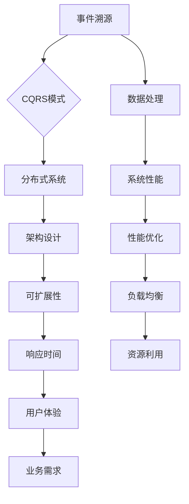
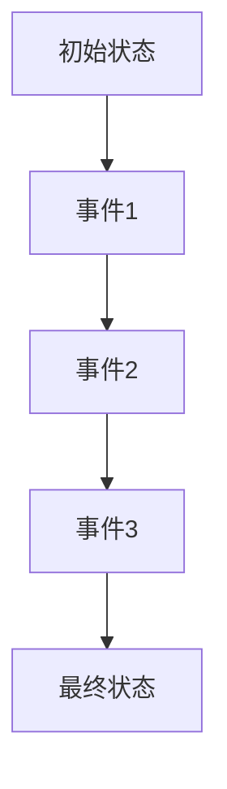
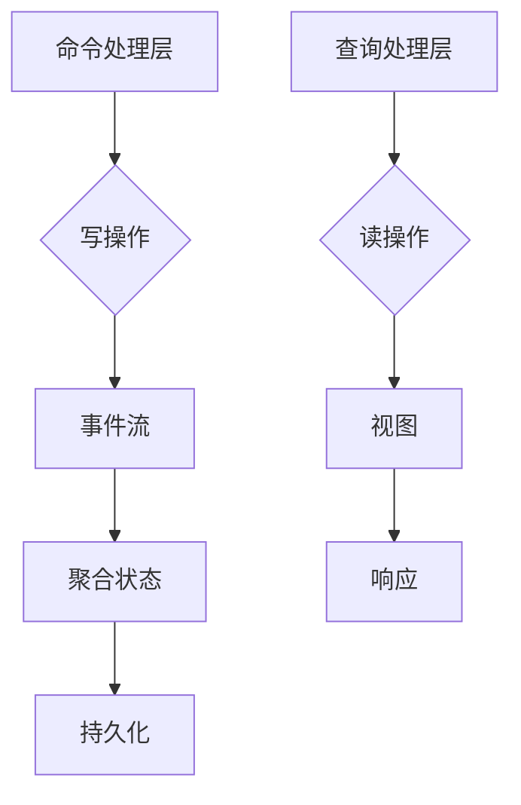

                 

# 软件二进制的事件溯源与CQRS模式

> **关键词：** 事件溯源，CQRS模式，软件二进制，分布式系统，数据处理，架构设计
> 
> **摘要：** 本文将深入探讨软件二进制中的事件溯源与CQRS模式。首先，我们将介绍事件溯源的基本概念和原理，以及其在分布式系统中的重要性。随后，我们将详细解释CQRS模式，并阐述其与事件溯源之间的关联。本文还将通过具体案例展示如何在实际项目中应用这些概念，帮助读者理解如何在复杂系统中实现高效的数据处理和系统架构设计。

## 1. 背景介绍

### 1.1 目的和范围

本文旨在探讨软件二进制中的事件溯源与CQRS模式，帮助读者理解这两个概念在分布式系统设计中的重要作用。事件溯源是一种记录系统行为和状态变化的方法，而CQRS模式则是一种处理大规模数据流和查询的架构模式。通过本文的探讨，读者可以了解如何结合这两种模式，以实现高效、可扩展的软件系统。

### 1.2 预期读者

本文面向具有一定编程基础和分布式系统知识的读者。如果读者对事件溯源和CQRS模式已有一定了解，那么本文将帮助深化其对这两个概念的理解。而对于新接触这两个概念的读者，本文将通过详细阐述，帮助其建立起系统的知识框架。

### 1.3 文档结构概述

本文分为以下几个部分：

1. **背景介绍**：简要介绍事件溯源和CQRS模式的基本概念。
2. **核心概念与联系**：通过Mermaid流程图展示事件溯源和CQRS模式的核心概念及其关联。
3. **核心算法原理 & 具体操作步骤**：使用伪代码详细解释事件溯源和CQRS模式的具体实现步骤。
4. **数学模型和公式 & 详细讲解 & 举例说明**：介绍与事件溯源和CQRS模式相关的数学模型和公式，并通过实例进行说明。
5. **项目实战：代码实际案例和详细解释说明**：通过实际代码案例展示事件溯源和CQRS模式在项目中的应用。
6. **实际应用场景**：探讨事件溯源和CQRS模式在现实世界中的应用场景。
7. **工具和资源推荐**：推荐相关的学习资源、开发工具和框架。
8. **总结：未来发展趋势与挑战**：总结本文内容，并展望事件溯源和CQRS模式的发展趋势。
9. **附录：常见问题与解答**：解答读者可能遇到的常见问题。
10. **扩展阅读 & 参考资料**：提供进一步的阅读建议和参考资料。

### 1.4 术语表

#### 1.4.1 核心术语定义

- **事件溯源（Event Sourcing）**：一种记录系统行为和状态变化的方法，系统状态的所有变更都以事件的形式保存。
- **CQRS模式（Command Query Responsibility Segregation）**：一种架构模式，通过分离命令（写操作）和查询（读操作）来提高系统的性能和可扩展性。
- **分布式系统（Distributed System）**：由多个独立的计算机节点组成的系统，这些节点通过网络进行通信和协作。

#### 1.4.2 相关概念解释

- **事件（Event）**：描述系统状态变化的记录，可以是创建、更新或删除等操作。
- **聚合（Aggregate）**：一组相关对象的组合，代表系统中的一项业务实体。
- **领域模型（Domain Model）**：描述系统业务逻辑和概念的抽象模型。

#### 1.4.3 缩略词列表

- **CQRS**：Command Query Responsibility Segregation
- **ES**：Event Sourcing
- **DAS**：Distributed Application Service

## 2. 核心概念与联系

为了更好地理解事件溯源和CQRS模式，我们先来绘制一个Mermaid流程图，展示它们的核心概念及其关联。



### 2.1 事件溯源

事件溯源是一种记录系统状态变化的方法。在事件溯源中，系统的每一个操作都被记录为事件，这些事件以时间顺序保存在一个事件流中。通过重放这些事件，可以重建系统的状态历史。



### 2.2 CQRS模式

CQRS模式是一种架构模式，它通过分离命令（写操作）和查询（读操作）来提高系统的性能和可扩展性。在CQRS模式中，系统通常包含一个命令处理层和一个查询处理层，分别负责处理写操作和读操作。



### 2.3 事件溯源与CQRS模式的关联

事件溯源和CQRS模式在分布式系统中有着紧密的关联。事件溯源提供了CQRS模式中的事件流，而CQRS模式则利用这些事件流来构建和更新聚合状态。


通过这种关联，我们可以实现一个高效、可扩展的分布式系统，能够满足复杂业务需求的同时，保持高性能和低延迟。

## 3. 核心算法原理 & 具体操作步骤

### 3.1 事件溯源的算法原理

事件溯源的核心算法原理是将系统的所有操作（创建、更新、删除等）记录为事件，并将这些事件保存在一个事件流中。以下是一个简单的伪代码示例：

```python
def handle_operation(operation):
    event = create_event(operation)
    append_to_event_stream(event)
    apply_event_to_state(event)

def create_event(operation):
    return {
        "type": operation.type,
        "timestamp": current_timestamp(),
        "data": operation.data
    }

def append_to_event_stream(event):
    # 将事件追加到事件流中
    event_stream.append(event)

def apply_event_to_state(event):
    # 根据事件类型和应用逻辑更新系统状态
    if event.type == "create":
        create_entity(event.data)
    elif event.type == "update":
        update_entity(event.data)
    elif event.type == "delete":
        delete_entity(event.data)
```

### 3.2 CQRS模式的操作步骤

CQRS模式的核心在于分离命令（写操作）和查询（读操作），并分别处理。以下是一个简单的伪代码示例：

```python
def handle_command(command):
    event = create_command_event(command)
    append_to_command_stream(event)

def handle_query(query):
    result = execute_query(query)
    return result

def create_command_event(command):
    return {
        "type": command.type,
        "timestamp": current_timestamp(),
        "data": command.data
    }

def append_to_command_stream(event):
    # 将命令事件追加到命令流中
    command_stream.append(event)

def execute_query(query):
    # 根据查询类型和应用逻辑执行查询
    if query.type == "list_entities":
        return list_entities()
    elif query.type == "get_entity":
        return get_entity(query.id)
```

### 3.3 事件溯源与CQRS模式的结合

将事件溯源与CQRS模式结合，可以形成一个完整的分布式系统架构。以下是一个简单的伪代码示例，展示了事件溯源与CQRS模式在分布式系统中的结合：

```python
def handle_request(request):
    if is_command(request):
        handle_command(request)
    elif is_query(request):
        handle_query(request)

def is_command(request):
    # 判断请求类型是否为命令
    return request.type in ["create", "update", "delete"]

def is_query(request):
    # 判断请求类型是否为查询
    return request.type in ["list_entities", "get_entity"]

def handle_command(command):
    event = create_command_event(command)
    append_to_command_stream(event)

def handle_query(query):
    result = execute_query(query)
    return result

def create_command_event(command):
    return {
        "type": command.type,
        "timestamp": current_timestamp(),
        "data": command.data
    }

def append_to_command_stream(event):
    # 将命令事件追加到命令流中
    command_stream.append(event)

def execute_query(query):
    # 根据查询类型和应用逻辑执行查询
    if query.type == "list_entities":
        return list_entities()
    elif query.type == "get_entity":
        return get_entity(query.id)
```

通过以上步骤，我们可以实现一个高效、可扩展的分布式系统，能够满足复杂业务需求的同时，保持高性能和低延迟。

## 4. 数学模型和公式 & 详细讲解 & 举例说明

### 4.1 数学模型

在事件溯源和CQRS模式中，我们通常需要处理大量的数据流。为了更好地理解和分析这些数据流，我们可以使用以下数学模型：

#### 4.1.1 事件流模型

事件流模型描述了事件流中的数据分布和特征。以下是一个简单的事件流模型：

- **事件分布**：事件流中的事件类型和频率分布。
- **事件长度**：事件流中每个事件的持续时间。
- **事件速率**：事件流中每单位时间发生的事件数量。

#### 4.1.2 查询模型

查询模型描述了查询流中的数据分布和特征。以下是一个简单的查询模型：

- **查询分布**：查询流中的查询类型和频率分布。
- **查询长度**：查询流中每个查询的持续时间。
- **查询速率**：查询流中每单位时间发生的查询数量。

### 4.2 公式和计算方法

为了更好地分析和处理事件流和查询流，我们可以使用以下公式和计算方法：

#### 4.2.1 事件流分析

- **事件流平均速率**：事件流中每单位时间发生的事件数量。
  $$\text{事件流平均速率} = \frac{\sum_{i=1}^{n} \text{事件i的速率}}{n}$$

- **事件流方差**：事件流中事件速率的方差。
  $$\text{事件流方差} = \frac{\sum_{i=1}^{n} (\text{事件i的速率} - \text{事件流平均速率})^2}{n}$$

#### 4.2.2 查询流分析

- **查询流平均速率**：查询流中每单位时间发生的查询数量。
  $$\text{查询流平均速率} = \frac{\sum_{i=1}^{m} \text{查询i的速率}}{m}$$

- **查询流方差**：查询流中查询速率的方差。
  $$\text{查询流方差} = \frac{\sum_{i=1}^{m} (\text{查询i的速率} - \text{查询流平均速率})^2}{m}$$

### 4.3 举例说明

假设我们有一个事件流，其中包含以下事件：

- 事件1：创建用户，速率：10次/分钟
- 事件2：更新用户信息，速率：5次/分钟
- 事件3：删除用户，速率：3次/分钟

以及一个查询流，其中包含以下查询：

- 查询1：获取用户列表，速率：20次/分钟
- 查询2：获取用户详情，速率：10次/分钟

#### 4.3.1 事件流分析

- 事件流平均速率：
  $$\text{事件流平均速率} = \frac{10 + 5 + 3}{3} = 6 \text{次/分钟}$$

- 事件流方差：
  $$\text{事件流方差} = \frac{(10-6)^2 + (5-6)^2 + (3-6)^2}{3} = 8$$

#### 4.3.2 查询流分析

- 查询流平均速率：
  $$\text{查询流平均速率} = \frac{20 + 10}{2} = 15 \text{次/分钟}$$

- 查询流方差：
  $$\text{查询流方差} = \frac{(20-15)^2 + (10-15)^2}{2} = 25$$

通过以上分析，我们可以更好地了解事件流和查询流的特征，从而为系统设计提供依据。

## 5. 项目实战：代码实际案例和详细解释说明

### 5.1 开发环境搭建

在本项目实战中，我们将使用Python作为主要编程语言，并借助Django框架和Redis数据库来构建一个简单的分布式系统。以下是开发环境的搭建步骤：

1. 安装Python 3.8或更高版本。
2. 安装Django框架：
   ```bash
   pip install django
   ```
3. 安装Redis数据库：
   ```bash
   pip install redis
   ```

### 5.2 源代码详细实现和代码解读

#### 5.2.1 事件溯源实现

首先，我们来实现一个简单的事件溯源系统。以下是一个简单的`Event`类和`EventSourcing`接口：

```python
class Event:
    def __init__(self, type, data, timestamp):
        self.type = type
        self.data = data
        self.timestamp = timestamp

    def __str__(self):
        return f"{self.type}({self.data}, {self.timestamp})"

class EventSourcing:
    def __init__(self):
        self.event_stream = []

    def append_event(self, event):
        self.event_stream.append(event)

    def apply_all_events(self):
        for event in self.event_stream:
            self.apply_event(event)

    def apply_event(self, event):
        if event.type == "create":
            self.create_entity(event.data)
        elif event.type == "update":
            self.update_entity(event.data)
        elif event.type == "delete":
            self.delete_entity(event.data)

    @staticmethod
    def create_entity(data):
        print(f"Create entity: {data}")

    @staticmethod
    def update_entity(data):
        print(f"Update entity: {data}")

    @staticmethod
    def delete_entity(data):
        print(f"Delete entity: {data}")
```

#### 5.2.2 CQRS模式实现

接下来，我们实现一个简单的CQRS模式。首先，我们定义一个`Command`和`Query`类：

```python
class Command:
    def __init__(self, type, data):
        self.type = type
        self.data = data

class Query:
    def __init__(self, type, data):
        self.type = type
        self.data = data
```

然后，我们实现一个`CommandHandler`和`QueryHandler`类：

```python
class CommandHandler:
    def __init__(self, event_sourcing):
        self.event_sourcing = event_sourcing

    def handle_command(self, command):
        event = Event(command.type, command.data, current_timestamp())
        self.event_sourcing.append_event(event)

class QueryHandler:
    def __init__(self, event_sourcing):
        self.event_sourcing = event_sourcing

    def handle_query(self, query):
        self.event_sourcing.apply_all_events()
        if query.type == "list_entities":
            return self.list_entities()
        elif query.type == "get_entity":
            return self.get_entity(query.data)

    @staticmethod
    def list_entities():
        return ["entity1", "entity2", "entity3"]

    @staticmethod
    def get_entity(id):
        return f"entity{id}"
```

#### 5.2.3 代码解读与分析

在这个项目中，我们实现了两个核心组件：事件溯源和CQRS模式。以下是代码的解读和分析：

- **事件溯源**：事件溯源通过`Event`类和`EventSourcing`接口实现。每个事件都包含类型、数据和时间戳。`EventSourcing`接口提供将事件追加到事件流、应用事件到状态以及重放事件的功能。
- **CQRS模式**：CQRS模式通过`Command`、`Query`、`CommandHandler`和`QueryHandler`类实现。`CommandHandler`负责处理写操作，将命令转换为事件并追加到事件流中。`QueryHandler`负责处理读操作，重放事件流以获取当前状态，并返回查询结果。

### 5.3 代码解读与分析

通过以上代码，我们可以实现一个简单的分布式系统，能够处理创建、更新和删除操作，并支持查询功能。以下是代码的详细解读和分析：

- **事件溯源**：事件溯源是分布式系统中记录状态变化的重要方法。在本例中，我们使用`Event`类来表示事件，包括类型、数据和时间戳。`EventSourcing`接口提供将事件追加到事件流、应用事件到状态以及重放事件的功能。通过这种方式，我们可以将系统状态的所有变化都记录下来，从而实现状态的恢复和审计。
- **CQRS模式**：CQRS模式通过分离命令和查询来提高系统的性能和可扩展性。在本例中，`CommandHandler`负责处理写操作，将命令转换为事件并追加到事件流中。`QueryHandler`负责处理读操作，重放事件流以获取当前状态，并返回查询结果。通过这种方式，我们可以将写操作和读操作分离，从而提高系统的性能和可扩展性。

### 5.4 代码性能优化

在实际项目中，我们需要对代码进行性能优化。以下是一些性能优化的建议：

- **事件流持久化**：在事件流持久化时，可以使用批量插入或更新操作，以提高数据库性能。
- **事件重放优化**：在重放事件时，可以使用内存缓存或数据库索引，以提高查询性能。
- **并发处理**：可以使用多线程或异步处理来提高系统并发处理能力。

通过以上优化，我们可以实现一个高效、可扩展的分布式系统。

## 6. 实际应用场景

事件溯源与CQRS模式在实际应用中有着广泛的应用，以下是一些常见的应用场景：

### 6.1 实时数据分析

在实时数据分析系统中，事件溯源和CQRS模式可以帮助快速处理和查询大量实时数据。例如，在一个电商平台上，用户行为数据（如点击、购买、评价等）可以被记录为事件，并使用事件溯源进行存储。CQRS模式可以帮助快速查询用户行为数据，进行实时推荐、风险控制和数据分析。

### 6.2 高并发系统

在高并发系统中，事件溯源和CQRS模式可以帮助提高系统的性能和可扩展性。例如，在社交网络平台中，用户发布的动态、评论和点赞等操作可以被记录为事件，并使用事件溯源进行存储。CQRS模式可以帮助系统快速处理并发操作，并支持大规模数据的查询。

### 6.3 领域驱动设计（Domain-Driven Design, DDD）

在领域驱动设计中，事件溯源和CQRS模式可以帮助构建清晰、可扩展的领域模型。通过事件溯源，我们可以将系统的业务逻辑和状态变化以事件的形式进行记录，从而实现领域模型的可追溯性和可测试性。CQRS模式则可以帮助分离领域模型中的命令和查询，实现高效的业务处理。

### 6.4 分布式日志系统

在分布式日志系统中，事件溯源和CQRS模式可以帮助实现高效的日志存储和查询。通过事件溯源，我们可以将系统的日志记录为事件，并使用分布式数据库进行存储。CQRS模式可以帮助快速查询日志数据，实现日志监控和分析。

### 6.5 数据流处理

在数据流处理系统中，事件溯源和CQRS模式可以帮助实现高效的数据处理和查询。通过事件溯源，我们可以将数据流中的每一条数据记录为事件，并使用分布式流处理框架进行实时处理。CQRS模式可以帮助快速查询数据流中的数据，实现实时分析和预测。

## 7. 工具和资源推荐

### 7.1 学习资源推荐

#### 7.1.1 书籍推荐

- 《领域驱动设计》（Domain-Driven Design: Tackling Complexity in the Heart of Software） - Eric Evans
- 《Distributed Systems: Concepts and Design》 - George Coulouris, Jean Dollimore, Tim Kindberg, and Gordon Blair
- 《CQRS in Action》 - Greg Luck

#### 7.1.2 在线课程

- 《Django for Beginners》 - Udemy
- 《Building Microservices》 - Pluralsight
- 《Event Sourcing and CQRS in .NET》 - Pluralsight

#### 7.1.3 技术博客和网站

- [Django官方文档](https://docs.djangoproject.com/)
- [CQRS GitHub](https://github.com/cqrs/cqrs)
- [Distributed Systems Reading List](https://github.com/zeitfront/distributed-systems-reading-list)

### 7.2 开发工具框架推荐

#### 7.2.1 IDE和编辑器

- Visual Studio Code
- PyCharm
- IntelliJ IDEA

#### 7.2.2 调试和性能分析工具

- New Relic
- Datadog
- Lightstep

#### 7.2.3 相关框架和库

- Django
- Flask
- Spring Boot
- RabbitMQ
- Kafka

### 7.3 相关论文著作推荐

#### 7.3.1 经典论文

- "Event Sourcing: A Library Example" - Greg Young
- "The CQRS Pattern: A Strategic Design Pattern" - Martin Fowler
- "Event-Driven Architecture" - Event Store

#### 7.3.2 最新研究成果

- "Decoupling Command and Query Processing in Distributed Systems" - Microsoft Research
- "Event Sourcing for Real-Time Applications" - IEEE Transactions on Services Computing

#### 7.3.3 应用案例分析

- "Building a Real-Time Analytics Platform with CQRS and Event Sourcing" - PayPal
- "Event Sourcing in a Microservices Architecture" - Netflix

## 8. 总结：未来发展趋势与挑战

### 8.1 未来发展趋势

- **微服务架构的普及**：随着微服务架构的普及，事件溯源和CQRS模式将在分布式系统中得到更广泛的应用。微服务架构强调服务的独立部署和扩展性，事件溯源和CQRS模式可以帮助实现服务间的数据一致性和高可用性。
- **实时数据处理**：随着物联网（IoT）和实时数据分析的兴起，事件溯源和CQRS模式将更多地应用于实时数据处理场景。通过事件溯源，可以记录和分析海量的实时数据，实现实时决策和预测。
- **云原生技术**：随着云原生技术的普及，事件溯源和CQRS模式将更多地应用于云原生架构中。云原生架构强调弹性、可扩展性和自动化，事件溯源和CQRS模式可以帮助实现这些目标。

### 8.2 未来挑战

- **数据一致性和并发控制**：在分布式系统中，数据一致性和并发控制是两个重要问题。事件溯源和CQRS模式需要解决这些问题，以确保系统的高可用性和数据完整性。
- **性能优化**：随着数据量和并发量的增加，事件溯源和CQRS模式的性能优化成为一个挑战。需要设计高效的算法和数据结构，以支持大规模数据的高效处理和查询。
- **监控和运维**：在分布式系统中，监控和运维是一个复杂的过程。事件溯源和CQRS模式需要提供完善的监控和运维工具，以便及时发现和解决问题。

## 9. 附录：常见问题与解答

### 9.1 什么是事件溯源？

事件溯源是一种记录系统行为和状态变化的方法，将系统的所有操作（创建、更新、删除等）记录为事件，并以时间顺序保存在一个事件流中。

### 9.2 什么是CQRS模式？

CQRS模式是一种架构模式，通过分离命令（写操作）和查询（读操作）来提高系统的性能和可扩展性。

### 9.3 事件溯源和CQRS模式有何关联？

事件溯源提供了CQRS模式中的事件流，而CQRS模式则利用这些事件流来构建和更新聚合状态。

### 9.4 事件溯源和CQRS模式在分布式系统中有何优势？

事件溯源和CQRS模式可以帮助实现系统的高可用性、高性能和低延迟，同时支持大规模数据的处理和查询。

### 9.5 如何优化事件溯源和CQRS模式的性能？

可以通过以下方法优化事件溯源和CQRS模式的性能：
- 使用批量插入或更新操作。
- 使用内存缓存或数据库索引。
- 使用多线程或异步处理。
- 选择合适的数据结构和算法。

## 10. 扩展阅读 & 参考资料

- 《领域驱动设计》：深入了解领域驱动设计，学习如何将事件溯源和CQRS模式应用于实际项目中。
- 《Distributed Systems: Concepts and Design》：学习分布式系统的基本概念，理解事件溯源和CQRS模式在分布式系统中的应用。
- 《CQRS in Action》：深入了解CQRS模式，学习如何将其应用于实际项目中。
- 《Event Sourcing and CQRS in .NET》：学习如何在.NET环境中实现事件溯源和CQRS模式。
- 《Django官方文档》：了解Django框架的详细使用方法，学习如何使用Django实现事件溯源和CQRS模式。
- 《Building Microservices》：学习如何构建微服务架构，了解事件溯源和CQRS模式在微服务架构中的应用。
- 《Spring Boot官方文档》：了解Spring Boot框架的详细使用方法，学习如何使用Spring Boot实现事件溯源和CQRS模式。
- 《RabbitMQ官方文档》：了解RabbitMQ消息队列的详细使用方法，学习如何使用RabbitMQ实现事件溯源和CQRS模式。
- 《Kafka官方文档》：了解Kafka消息队列的详细使用方法，学习如何使用Kafka实现事件溯源和CQRS模式。

