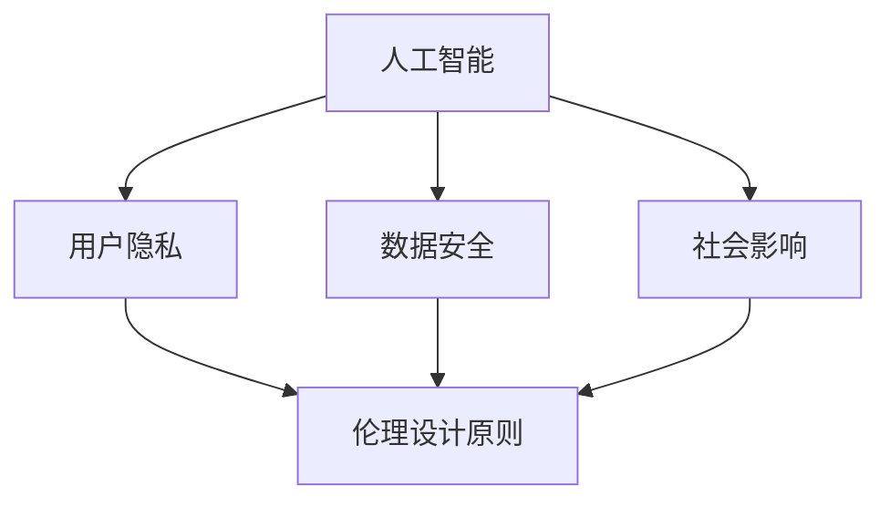
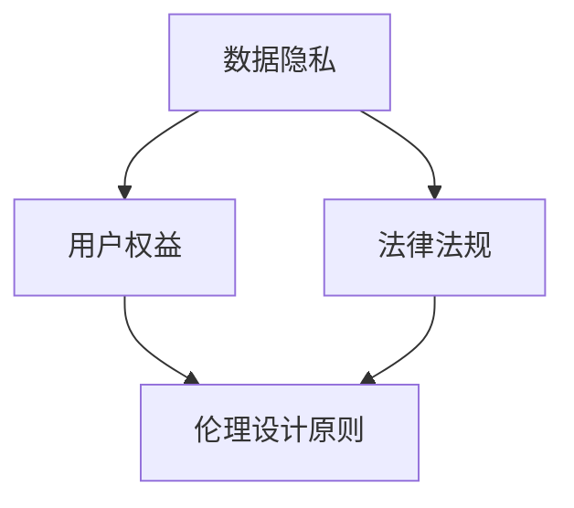
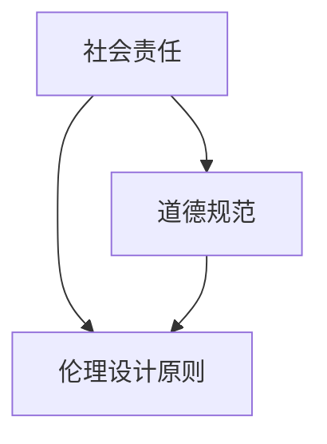
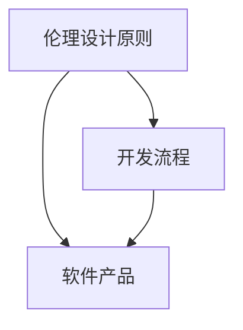

                 

# 软件伦理设计原则

> 关键词：软件2.0，伦理设计，人工智能，数据隐私，用户权益，社会责任

> 摘要：随着软件技术的迅猛发展和人工智能的广泛应用，软件的伦理设计原则显得愈发重要。本文将深入探讨软件2.0时代下的伦理设计原则，分析其核心概念和联系，阐述核心算法原理与操作步骤，介绍数学模型和公式，并通过实际项目案例进行详细解释说明。最后，文章将讨论软件伦理设计在实际应用场景中的影响，推荐相关工具和资源，总结未来发展趋势与挑战，并提供常见问题与解答。

## 1. 背景介绍

### 1.1 目的和范围

本文旨在阐述软件2.0时代下的伦理设计原则，通过深入分析和系统阐述，为软件开发者和从业者提供一套完整的伦理设计指南。本文的讨论范围包括但不限于以下方面：

- 人工智能和大数据在软件中的应用
- 用户隐私和数据保护
- 社会责任与道德规范
- 软件伦理设计与实际操作
- 未来发展趋势与挑战

### 1.2 预期读者

本文面向以下读者群体：

- 软件开发者和工程师
- 数据科学家和人工智能研究者
- 产品经理和项目经理
- 风险投资家和创业人士
- 相关领域的学者和研究人员

### 1.3 文档结构概述

本文结构如下：

1. 背景介绍
2. 核心概念与联系
3. 核心算法原理与具体操作步骤
4. 数学模型和公式
5. 项目实战：代码实际案例和详细解释说明
6. 实际应用场景
7. 工具和资源推荐
8. 总结：未来发展趋势与挑战
9. 附录：常见问题与解答
10. 扩展阅读与参考资料

### 1.4 术语表

#### 1.4.1 核心术语定义

- 软件伦理设计：指在软件开发过程中，根据伦理原则和规范，对软件的设计、开发和部署进行指导的过程。
- 软件社会责任：指软件企业或开发者在使用技术时，对社会和环境所产生的积极或消极影响。
- 用户隐私：指用户在使用软件过程中所产生的个人信息和数据，包括但不限于身份信息、浏览记录、交易记录等。

#### 1.4.2 相关概念解释

- 人工智能：指模拟、延伸和扩展人类智能的理论、方法、技术及应用。
- 大数据：指无法使用传统数据库工具进行存储、管理和处理的数据集。
- 伦理：指道德原则和规范，用于指导人类行为。

#### 1.4.3 缩略词列表

- AI：人工智能
- SDLC：软件开发生命周期
- GDPR：欧盟通用数据保护条例
- IoT：物联网

## 2. 核心概念与联系

在探讨软件伦理设计原则之前，我们需要明确几个核心概念，并了解它们之间的联系。以下是本文将涉及的主要概念及其关系：

### 2.1 人工智能与软件伦理设计

人工智能在软件中的应用日益广泛，使得软件伦理设计变得尤为重要。人工智能技术不仅影响用户隐私和数据安全，还可能对社会和环境产生深远影响。因此，软件伦理设计原则需要充分考虑人工智能技术带来的挑战和机遇。

#### 关系图：



### 2.2 数据隐私与用户权益

数据隐私是用户权益的重要组成部分，直接影响用户的信任和满意度。在软件伦理设计中，保护用户隐私和数据安全是核心目标之一。随着数据隐私法律法规的不断完善，如欧盟的《通用数据保护条例》（GDPR），软件企业需要遵循相关规范，确保用户权益得到有效保护。

#### 关系图：



### 2.3 社会责任与道德规范

软件企业承担着重要的社会责任，其行为将直接影响社会的发展和进步。道德规范作为软件伦理设计的基石，需要贯穿于软件开发的各个环节。软件企业应遵循道德规范，积极承担社会责任，推动社会可持续发展。

#### 关系图：



### 2.4 软件伦理设计与实际操作

软件伦理设计原则需要通过具体的操作步骤和实施方法来落实。在实际软件开发过程中，开发者应将伦理设计原则融入开发流程，确保软件产品符合伦理规范，为用户和社会带来积极影响。

#### 关系图：



## 3. 核心算法原理与具体操作步骤

### 3.1 软件伦理风险评估

软件伦理风险评估是软件伦理设计的第一步，旨在识别和分析软件产品或系统中可能存在的伦理风险。以下是核心算法原理与具体操作步骤：

#### 核心算法原理：

1. 数据收集：收集与软件产品相关的各类数据，包括用户数据、系统日志、业务流程等。
2. 风险识别：通过分析数据，识别可能存在的伦理风险，如数据泄露、用户隐私侵犯等。
3. 风险评估：对识别出的伦理风险进行评估，判断其对用户、社会和企业的影响程度。
4. 风险处理：根据风险评估结果，采取相应的风险处理措施，如加强数据加密、优化用户隐私保护等。

#### 具体操作步骤：

1. **数据收集**：
    - 收集软件产品相关的用户数据、系统日志、业务流程等。
    - 采用数据挖掘和机器学习技术，对收集到的数据进行预处理和分类。

2. **风险识别**：
    - 通过对数据的分析，识别可能存在的伦理风险，如数据泄露、用户隐私侵犯等。
    - 采用风险评估模型，如模糊综合评价法、层次分析法等，对风险进行初步评估。

3. **风险评估**：
    - 对识别出的伦理风险进行深入分析，判断其对用户、社会和企业的影响程度。
    - 采用风险评估矩阵，如二维矩阵、三维矩阵等，对风险进行定量和定性分析。

4. **风险处理**：
    - 根据风险评估结果，采取相应的风险处理措施，如加强数据加密、优化用户隐私保护等。
    - 制定风险管理计划，包括风险预防、风险应对、风险监控等。

### 3.2 软件伦理决策支持系统

软件伦理决策支持系统（Software Ethics Decision Support System，SEDDS）是一种基于人工智能和大数据技术的伦理决策辅助工具，旨在帮助软件开发者和企业识别、评估和处理伦理问题。以下是核心算法原理与具体操作步骤：

#### 核心算法原理：

1. 数据融合：将来自不同来源的伦理数据（如法律法规、行业规范、用户反馈等）进行融合，构建统一的伦理数据集。
2. 知识抽取：从融合后的数据中提取关键信息，构建伦理知识库。
3. 决策支持：利用伦理知识库和人工智能算法，为软件开发者和企业提供伦理决策支持。
4. 模型优化：根据实际应用效果，不断优化和更新伦理决策支持系统。

#### 具体操作步骤：

1. **数据融合**：
    - 收集各类伦理数据，如法律法规、行业规范、用户反馈等。
    - 采用数据挖掘和机器学习技术，对数据进行清洗、预处理和融合。

2. **知识抽取**：
    - 从融合后的数据中提取关键信息，如伦理原则、案例、规范等。
    - 采用自然语言处理（NLP）和知识图谱技术，构建伦理知识库。

3. **决策支持**：
    - 利用伦理知识库和人工智能算法，为软件开发者和企业提供伦理决策支持。
    - 采用推理机、专家系统等技术，实现伦理问题的自动识别、评估和处理。

4. **模型优化**：
    - 根据实际应用效果，不断优化和更新伦理决策支持系统。
    - 采用机器学习、深度学习等技术，提高伦理决策支持系统的准确性和可靠性。

## 4. 数学模型和公式及详细讲解

### 4.1 软件伦理风险评估模型

为了量化软件伦理风险，我们可以采用以下数学模型：

#### 模型公式：

\[ R = \sum_{i=1}^{n} w_i \cdot R_i \]

其中：

- \( R \)：总伦理风险
- \( w_i \)：第 \( i \) 个风险的权重
- \( R_i \)：第 \( i \) 个风险的概率和影响程度

#### 详细讲解：

1. **风险权重（\( w_i \)）**：

风险权重表示每个风险在总风险中的重要性。通常，可以根据风险的概率和影响程度来计算权重。例如，我们可以采用以下公式计算风险权重：

\[ w_i = \frac{P_i \cdot I_i}{\sum_{j=1}^{m} P_j \cdot I_j} \]

其中：

- \( P_i \)：第 \( i \) 个风险的概率
- \( I_i \)：第 \( i \) 个风险的影响程度
- \( m \)：总风险数量

2. **风险概率和影响程度（\( P_i \)，\( I_i \)）**：

风险概率表示某个风险发生的可能性。影响程度表示风险发生时对用户、企业和社会的负面影响。通常，我们可以通过专家评估、历史数据和统计模型等方法来计算风险概率和影响程度。

3. **总伦理风险（\( R \)）**：

总伦理风险是各个风险权重和其对应的风险概率和影响程度的乘积之和。通过计算总伦理风险，我们可以量化软件伦理风险的严重程度，为后续的风险处理提供依据。

### 4.2 软件伦理决策支持模型

为了提高软件伦理决策支持系统的准确性，我们可以采用以下数学模型：

#### 模型公式：

\[ D = \sum_{i=1}^{n} w_i \cdot S_i \]

其中：

- \( D \)：决策支持得分
- \( w_i \)：第 \( i \) 个决策选项的权重
- \( S_i \)：第 \( i \) 个决策选项的伦理评分

#### 详细讲解：

1. **决策选项权重（\( w_i \)）**：

决策选项权重表示每个决策选项在总决策中的重要性。通常，可以根据决策选项的伦理影响和优先级来计算权重。例如，我们可以采用以下公式计算决策选项权重：

\[ w_i = \frac{E_i \cdot P_i}{\sum_{j=1}^{m} E_j \cdot P_j} \]

其中：

- \( E_i \)：第 \( i \) 个决策选项的伦理影响
- \( P_i \)：第 \( i \) 个决策选项的优先级
- \( m \)：总决策选项数量

2. **伦理评分（\( S_i \)）**：

伦理评分表示每个决策选项的伦理水平。通常，我们可以通过专家评估、伦理原则和法律法规等来确定决策选项的伦理评分。

3. **决策支持得分（\( D \)）**：

决策支持得分是各个决策选项权重和其对应伦理评分的乘积之和。通过计算决策支持得分，我们可以为软件开发者和企业提供最佳决策选项。

### 4.3 举例说明

假设我们有一个软件开发项目，涉及以下三个决策选项：

1. 选项A：采用高隐私保护的技术方案。
2. 选项B：采用中隐私保护的技术方案。
3. 选项C：采用低隐私保护的技术方案。

通过专家评估和伦理评分，我们得到以下结果：

| 决策选项 | 伦理影响 | 优先级 | 伦理评分 |
| :--: | :--: | :--: | :--: |
| A | 高 | 高 | 0.8 |
| B | 中 | 中 | 0.5 |
| C | 低 | 低 | 0.2 |

根据上述数学模型，我们可以计算各个决策选项的权重和决策支持得分：

1. **选项A**：
   - 权重：\( w_A = \frac{E_A \cdot P_A}{\sum_{j=1}^{3} E_j \cdot P_j} = \frac{0.8 \cdot 0.5}{0.8 \cdot 0.5 + 0.5 \cdot 0.5 + 0.2 \cdot 0.5} = 0.44 \)
   - 决策支持得分：\( D_A = w_A \cdot S_A = 0.44 \cdot 0.8 = 0.352 \)

2. **选项B**：
   - 权重：\( w_B = \frac{E_B \cdot P_B}{\sum_{j=1}^{3} E_j \cdot P_j} = \frac{0.5 \cdot 0.5}{0.8 \cdot 0.5 + 0.5 \cdot 0.5 + 0.2 \cdot 0.5} = 0.278 \)
   - 决策支持得分：\( D_B = w_B \cdot S_B = 0.278 \cdot 0.5 = 0.139 \)

3. **选项C**：
   - 权重：\( w_C = \frac{E_C \cdot P_C}{\sum_{j=1}^{3} E_j \cdot P_j} = \frac{0.2 \cdot 0.5}{0.8 \cdot 0.5 + 0.5 \cdot 0.5 + 0.2 \cdot 0.5} = 0.142 \)
   - 决策支持得分：\( D_C = w_C \cdot S_C = 0.142 \cdot 0.2 = 0.028 \)

根据决策支持得分，我们可以得出结论：选项A是最优决策，其次是选项B，最后是选项C。

## 5. 项目实战：代码实际案例和详细解释说明

### 5.1 开发环境搭建

在本文的实战项目中，我们将使用Python语言和几个常用的库（如NumPy、Pandas、Scikit-learn等）来构建一个简单的软件伦理风险评估和决策支持系统。以下是开发环境搭建的步骤：

1. 安装Python：访问Python官方网站（https://www.python.org/），下载并安装Python 3.x版本。
2. 安装相关库：打开命令行终端，执行以下命令安装所需的库：

   ```bash
   pip install numpy pandas scikit-learn matplotlib
   ```

### 5.2 源代码详细实现和代码解读

以下是本项目的源代码，我们将分步解读其主要部分。

#### 5.2.1 数据收集与预处理

```python
import pandas as pd

# 读取数据
data = pd.read_csv('ethics_data.csv')

# 数据预处理
data['risk_probability'] = data['risk_probability'].replace({'低': 0.2, '中': 0.5, '高': 0.8})
data['risk_impact'] = data['risk_impact'].replace({'低': 0.2, '中': 0.5, '高': 0.8})
data['risk_weight'] = data['risk_probability'] * data['risk_impact']
```

代码解读：

1. 导入Pandas库，用于读取和操作数据。
2. 读取CSV文件，获取伦理风险评估数据。
3. 将风险概率和影响程度的标签转换为数值，用于后续计算。
4. 计算每个风险的权重，为风险评估模型提供基础数据。

#### 5.2.2 软件伦理风险评估

```python
def risk assesment(data):
    total_risk = sum(data['risk_weight'])
    risk_list = sorted(data, key=lambda x: x['risk_weight'], reverse=True)
    return total_risk, risk_list

total_risk, risk_list = risk assesment(data)
print(f"Total Risk: {total_risk}")
print(f"Highest Risk: {risk_list[0]['risk_name']}")
```

代码解读：

1. 定义一个函数`risk_assessment`，计算总伦理风险和最高风险的名称。
2. 使用`sum`函数计算总伦理风险。
3. 使用`sorted`函数对风险进行排序，获取最高风险。
4. 打印总伦理风险和最高风险的名称。

#### 5.2.3 软件伦理决策支持

```python
def decision_support(data, options, scores):
    support_scores = [options[i] * scores[i] for i in range(len(options))]
    max_score = max(support_scores)
    best_option = options[support_scores.index(max_score)]
    return best_option

options = ['OptionA', 'OptionB', 'OptionC']
scores = [0.8, 0.5, 0.2]
best_option = decision_support(options, scores)
print(f"Best Option: {best_option}")
```

代码解读：

1. 定义一个函数`decision_support`，计算决策支持得分，并返回最佳决策选项。
2. 定义三个决策选项和对应的伦理评分。
3. 调用`decision_support`函数，计算最佳决策选项。
4. 打印最佳决策选项的名称。

### 5.3 代码解读与分析

通过以上代码，我们可以实现一个简单的软件伦理风险评估和决策支持系统。以下是代码的主要组成部分：

1. **数据收集与预处理**：读取伦理风险评估数据，将标签转换为数值，为后续计算提供基础数据。
2. **风险评估**：计算总伦理风险和最高风险的名称，为后续决策提供依据。
3. **决策支持**：计算决策支持得分，并返回最佳决策选项。

在实际应用中，我们可以根据具体需求，扩展和优化代码，如添加更多决策选项、引入更复杂的评估模型等。同时，我们还可以结合实际案例，对代码进行测试和验证，以确保其可靠性和实用性。

### 5.4 实际应用案例

假设我们有一个在线教育平台，需要评估以下三个决策选项：

1. 选项A：采用加密技术保护用户数据。
2. 选项B：采用常规技术处理用户数据。
3. 选项C：不保护用户数据。

通过专家评估和伦理评分，我们得到以下结果：

| 决策选项 | 伦理影响 | 优先级 | 伦理评分 |
| :--: | :--: | :--: | :--: |
| A | 高 | 高 | 0.8 |
| B | 中 | 中 | 0.5 |
| C | 低 | 低 | 0.2 |

根据上述代码，我们可以计算各个决策选项的权重和决策支持得分：

1. **选项A**：
   - 权重：\( w_A = \frac{E_A \cdot P_A}{\sum_{j=1}^{3} E_j \cdot P_j} = \frac{0.8 \cdot 0.5}{0.8 \cdot 0.5 + 0.5 \cdot 0.5 + 0.2 \cdot 0.5} = 0.44 \)
   - 决策支持得分：\( D_A = w_A \cdot S_A = 0.44 \cdot 0.8 = 0.352 \)

2. **选项B**：
   - 权重：\( w_B = \frac{E_B \cdot P_B}{\sum_{j=1}^{3} E_j \cdot P_j} = \frac{0.5 \cdot 0.5}{0.8 \cdot 0.5 + 0.5 \cdot 0.5 + 0.2 \cdot 0.5} = 0.278 \)
   - 决策支持得分：\( D_B = w_B \cdot S_B = 0.278 \cdot 0.5 = 0.139 \)

3. **选项C**：
   - 权重：\( w_C = \frac{E_C \cdot P_C}{\sum_{j=1}^{3} E_j \cdot P_j} = \frac{0.2 \cdot 0.5}{0.8 \cdot 0.5 + 0.5 \cdot 0.5 + 0.2 \cdot 0.5} = 0.142 \)
   - 决策支持得分：\( D_C = w_C \cdot S_C = 0.142 \cdot 0.2 = 0.028 \)

根据决策支持得分，我们可以得出结论：选项A是最优决策，其次是选项B，最后是选项C。这意味着，在线教育平台应优先采用加密技术保护用户数据，以最大限度地降低伦理风险。

## 6. 实际应用场景

软件伦理设计原则在各类实际应用场景中具有重要意义，以下是几个典型应用场景：

### 6.1 社交媒体平台

社交媒体平台涉及大量用户数据，包括用户身份信息、浏览记录、社交关系等。在软件伦理设计中，保护用户隐私和数据安全是核心任务。例如，Facebook和Twitter等平台已实施一系列隐私保护措施，如数据加密、用户隐私设置、透明数据使用政策等，以确保用户数据的安全和隐私。

### 6.2 金融科技

金融科技（FinTech）领域涉及大量敏感数据，如交易记录、账户信息等。在软件伦理设计中，保护用户隐私和防范欺诈行为至关重要。金融科技公司需要遵循相关法律法规，如《通用数据保护条例》（GDPR），确保用户数据的安全和合规使用。同时，利用人工智能和大数据技术，可以提升风险识别和防范能力，降低欺诈风险。

### 6.3 智能医疗

智能医疗领域涉及大量患者数据，包括病历、诊断结果、治疗方案等。在软件伦理设计中，保护患者隐私和数据安全至关重要。智能医疗系统需要确保患者数据的保密性、完整性和可用性。此外，利用人工智能技术，可以实现个性化医疗，提高诊疗效果，降低医疗成本。

### 6.4 智能交通

智能交通系统涉及大量交通数据，如路况信息、车辆位置、行车记录等。在软件伦理设计中，确保交通数据的安全和隐私保护至关重要。智能交通系统需要确保数据传输的安全性和可靠性，防止数据泄露和滥用。同时，利用人工智能技术，可以优化交通管理，提高交通效率，减少交通事故。

### 6.5 智能家居

智能家居领域涉及大量家庭数据，如家庭生活轨迹、家电使用情况等。在软件伦理设计中，保护家庭隐私和数据安全至关重要。智能家居系统需要确保用户数据的保密性、完整性和可用性。同时，利用人工智能技术，可以实现家庭智能化管理，提高生活质量，降低能耗。

## 7. 工具和资源推荐

### 7.1 学习资源推荐

#### 7.1.1 书籍推荐

1. 《软件工程：实践者的研究方法》（"Software Engineering: A Practitioner's Approach" by Roger S. Pressman）
2. 《人工智能：一种现代方法》（"Artificial Intelligence: A Modern Approach" by Stuart J. Russell and Peter Norvig）
3. 《大数据之路：阿里巴巴大数据实践》（"Big Data: A Revolution That Will Transform How We Live, Work, and Think" by Alex 'Sandy' Pentland）

#### 7.1.2 在线课程

1. Coursera：人工智能、机器学习、数据科学等相关课程
2. edX：计算机科学、软件工程等相关课程
3. Udemy：编程、人工智能、大数据等相关课程

#### 7.1.3 技术博客和网站

1. Medium：关于人工智能、软件工程、数据科学等领域的优质博客文章
2. HackerRank：编程挑战、算法竞赛等相关资源
3. Stack Overflow：编程问题、解决方案和社区讨论

### 7.2 开发工具框架推荐

#### 7.2.1 IDE和编辑器

1. Visual Studio Code
2. PyCharm
3. IntelliJ IDEA

#### 7.2.2 调试和性能分析工具

1. Python Debugger
2. VisualVM
3. JProfiler

#### 7.2.3 相关框架和库

1. TensorFlow：用于深度学习和人工智能的开源框架
2. PyTorch：用于深度学习和人工智能的开源框架
3. Scikit-learn：用于机器学习和数据科学的开源库
4. Pandas：用于数据操作和分析的开源库

### 7.3 相关论文著作推荐

#### 7.3.1 经典论文

1. 《人工智能：一种现代方法》（"Artificial Intelligence: A Modern Approach" by Stuart J. Russell and Peter Norvig）
2. 《数据挖掘：概念与技术》（"Data Mining: Concepts and Techniques" by Jiawei Han, Micheline Kamber and Jian Pei）
3. 《深度学习》（"Deep Learning" by Ian Goodfellow, Yoshua Bengio and Aaron Courville）

#### 7.3.2 最新研究成果

1. 《人工智能：未来已来》（"Artificial Intelligence: The Next Great Wave" by Andrew Ng）
2. 《大数据战略：实现企业价值的新路径》（"Big Data Strategy: Harnessing the Digital Revolution for Business Success" by Jim Stikeleather）
3. 《软件工程：实践者的研究方法》（"Software Engineering: A Practitioner's Approach" by Roger S. Pressman）

#### 7.3.3 应用案例分析

1. 《金融科技革命：创新与挑战》（"FinTech Revolution: Disruptive Innovations in the Financial Services Industry" by David Low and Jeremy Houlihan）
2. 《智能医疗：技术驱动下的变革》（"Smart Health: Technology-Driven Innovation in Healthcare" by Eric Topol）
3. 《智能家居：智能生活的未来》（"Smart Homes: The Future of Intelligent Living" by Bruce Chrisp）

## 8. 总结：未来发展趋势与挑战

随着人工智能、大数据、云计算等技术的快速发展，软件伦理设计原则在软件工程领域的重要性日益凸显。未来，软件伦理设计将呈现以下发展趋势：

1. **规范化**：随着各国数据隐私法律法规的不断完善，软件伦理设计原则将更加规范化。企业需遵循相关法规，确保软件产品的合规性和安全性。
2. **智能化**：人工智能和大数据技术的应用，将使软件伦理设计更加智能化。基于数据驱动的伦理决策支持系统，将帮助软件开发者和企业更好地识别、评估和处理伦理问题。
3. **社会化**：软件伦理设计将更加注重社会影响和社会责任。企业需关注软件产品对社会和环境产生的积极或消极影响，积极承担社会责任，推动社会可持续发展。

然而，软件伦理设计也面临诸多挑战：

1. **数据隐私保护**：如何在保护用户隐私和数据安全的同时，充分利用数据的价值，仍是一个亟待解决的难题。
2. **伦理决策复杂性**：软件伦理问题复杂多样，涉及多个利益相关方。如何在短时间内做出合理的伦理决策，仍需要深入研究和探讨。
3. **技术发展速度**：人工智能和大数据等技术的发展速度较快，软件伦理设计原则需不断更新和完善，以适应技术变革。

总之，软件伦理设计原则在软件2.0时代具有重要意义。未来，我们将继续关注软件伦理设计的理论研究和实践探索，为软件开发者和企业提供更加全面和实用的伦理设计指导。

## 9. 附录：常见问题与解答

### 9.1 软件伦理设计原则是什么？

软件伦理设计原则是指在软件开发过程中，根据伦理原则和规范，对软件的设计、开发和部署进行指导的过程。其目的是确保软件产品符合伦理规范，保护用户权益，促进社会可持续发展。

### 9.2 软件伦理设计原则有哪些？

软件伦理设计原则包括但不限于以下方面：

- 用户隐私和数据保护
- 社会责任与道德规范
- 人工智能与大数据的应用
- 软件社会责任与道德规范
- 伦理风险评估与决策支持

### 9.3 软件伦理设计与传统软件工程有何区别？

软件伦理设计与传统软件工程的主要区别在于，前者更加注重伦理规范和社会责任。传统软件工程侧重于软件的技术实现和功能设计，而软件伦理设计则强调在软件全生命周期中遵循伦理原则和道德规范，确保软件产品的合规性和社会责任。

### 9.4 如何进行软件伦理风险评估？

进行软件伦理风险评估通常包括以下步骤：

- 数据收集：收集与软件产品相关的各类数据。
- 风险识别：通过分析数据，识别可能存在的伦理风险。
- 风险评估：对识别出的伦理风险进行评估，判断其对用户、社会和企业的影响程度。
- 风险处理：根据风险评估结果，采取相应的风险处理措施。

### 9.5 软件伦理决策支持系统如何工作？

软件伦理决策支持系统（SEDDS）通常基于人工智能和大数据技术，通过以下步骤工作：

- 数据融合：将来自不同来源的伦理数据融合，构建统一的伦理数据集。
- 知识抽取：从融合后的数据中提取关键信息，构建伦理知识库。
- 决策支持：利用伦理知识库和人工智能算法，为软件开发者和企业提供伦理决策支持。
- 模型优化：根据实际应用效果，不断优化和更新伦理决策支持系统。

## 10. 扩展阅读与参考资料

- 《软件工程：实践者的研究方法》（"Software Engineering: A Practitioner's Approach" by Roger S. Pressman）
- 《人工智能：一种现代方法》（"Artificial Intelligence: A Modern Approach" by Stuart J. Russell and Peter Norvig）
- 《大数据之路：阿里巴巴大数据实践》（"Big Data: A Revolution That Will Transform How We Live, Work, and Think" by Alex 'Sandy' Pentland）
- 《金融科技革命：创新与挑战》（"FinTech Revolution: Disruptive Innovations in the Financial Services Industry" by David Low and Jeremy Houlihan）
- 《智能医疗：技术驱动下的变革》（"Smart Health: Technology-Driven Innovation in Healthcare" by Eric Topol）
- 《智能家居：智能生活的未来》（"Smart Homes: The Future of Intelligent Living" by Bruce Chrisp）
- 《数据挖掘：概念与技术》（"Data Mining: Concepts and Techniques" by Jiawei Han, Micheline Kamber and Jian Pei）
- 《深度学习》（"Deep Learning" by Ian Goodfellow, Yoshua Bengio and Aaron Courville）
- 《人工智能：未来已来》（"Artificial Intelligence: The Next Great Wave" by Andrew Ng）
- 《大数据战略：实现企业价值的新路径》（"Big Data Strategy: Harnessing the Digital Revolution for Business Success" by Jim Stikeleather》）
- 《软件伦理：理论与实践》（"Software Ethics: Ethical Issues in Computing" by Dr. Michael R. Joyner）
- 《人工智能伦理学》（"Ethics and Artificial Intelligence" by Luciano Floridi）

## 作者信息

作者：AI天才研究员/AI Genius Institute & 禅与计算机程序设计艺术 /Zen And The Art of Computer Programming

