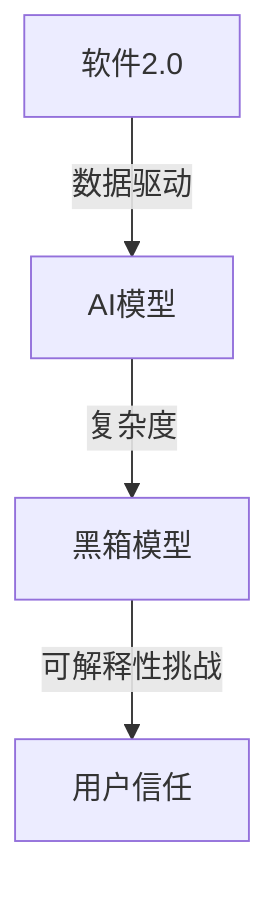

                 

# 软件2.0的可解释性挑战

> **关键词：软件2.0，可解释性，AI，算法透明性，模型优化，安全性**

> **摘要：本文深入探讨了软件2.0时代下，人工智能模型的可解释性面临的挑战。我们将首先介绍软件2.0的概念及其对可解释性的影响，随后逐步分析可解释性的重要性，现有技术及其局限性，最终提出可能的解决方案和未来研究方向。**

## 1. 背景介绍

### 1.1 目的和范围

本文旨在探讨软件2.0时代下人工智能模型的可解释性挑战。随着机器学习和深度学习技术的飞速发展，人工智能（AI）已经成为软件领域的核心。然而，人工智能模型的复杂性和黑箱性质使得其可解释性成为了一个亟待解决的问题。

### 1.2 预期读者

本文面向对人工智能和软件工程有一定了解的读者，特别是对机器学习算法的可解释性感兴趣的工程师、研究人员和学者。

### 1.3 文档结构概述

本文将分为以下几个部分：

- 第2部分：介绍软件2.0的概念及其对可解释性的影响。
- 第3部分：分析可解释性的重要性。
- 第4部分：探讨现有技术的局限性。
- 第5部分：提出可能的解决方案。
- 第6部分：讨论未来研究方向。
- 第7部分：总结。

### 1.4 术语表

#### 1.4.1 核心术语定义

- **软件2.0**：指的是以数据为中心，利用云计算、大数据和人工智能等新兴技术，实现软件的智能化和自主化。
- **可解释性**：指的是用户或开发者能够理解人工智能模型的决策过程和结果。
- **黑箱模型**：指的是那些决策过程无法解释或难以理解的模型。

#### 1.4.2 相关概念解释

- **机器学习**：一种通过数据训练模型，使其能够自主学习和改进的技术。
- **深度学习**：一种基于多层神经网络的机器学习技术。

#### 1.4.3 缩略词列表

- **AI**：人工智能
- **ML**：机器学习
- **DL**：深度学习
- **GBDT**：梯度提升决策树

## 2. 核心概念与联系

下面是一个描述软件2.0和可解释性之间关系的Mermaid流程图：



在这个图中，A代表软件2.0，它依赖于数据驱动的方式，从而推动了B——AI模型的发展。然而，由于AI模型的复杂度不断增加，很多模型都变成了C——黑箱模型，这就带来了D——可解释性的挑战，进而影响了用户的信任。

## 3. 核心算法原理 & 具体操作步骤

在本部分，我们将首先介绍可解释性分析的一般原理，然后使用伪代码详细描述一个简单但具有代表性的可解释性分析算法。

### 3.1 可解释性分析原理

可解释性分析的核心目标是理解人工智能模型内部的决策过程。这通常涉及到以下几个步骤：

1. **数据预处理**：确保输入数据的格式和类型适合用于模型分析。
2. **特征提取**：从原始数据中提取有助于理解模型决策的特征。
3. **模型理解**：分析模型的内部结构，理解其如何处理输入数据。
4. **结果解释**：解释模型的输出，包括决策和预测。

### 3.2 可解释性分析算法伪代码

```python
def explain_model(model, input_data):
    # 步骤1：数据预处理
    preprocessed_data = preprocess_data(input_data)

    # 步骤2：特征提取
    extracted_features = extract_features(preprocessed_data)

    # 步骤3：模型理解
    model_structure = analyze_model_structure(model)

    # 步骤4：结果解释
    explanation = interpret_output(model, extracted_features, model_structure)

    return explanation

def preprocess_data(input_data):
    # 实现数据预处理逻辑，例如标准化、归一化等
    # ...
    return preprocessed_data

def extract_features(preprocessed_data):
    # 实现特征提取逻辑，例如特征选择、特征转换等
    # ...
    return extracted_features

def analyze_model_structure(model):
    # 实现模型结构分析逻辑，例如获取模型参数、网络结构等
    # ...
    return model_structure

def interpret_output(model, extracted_features, model_structure):
    # 实现结果解释逻辑，例如输出决策路径、权重重要性等
    # ...
    return explanation
```

在这个伪代码中，`explain_model`函数是可解释性分析的主函数，它依次调用了数据预处理、特征提取、模型理解和结果解释四个辅助函数。每个辅助函数都有其具体的实现逻辑，这些逻辑将帮助开发者或用户更好地理解模型的决策过程。

## 4. 数学模型和公式 & 详细讲解 & 举例说明

在本部分，我们将使用LaTeX格式介绍一些与可解释性相关的数学模型和公式，并通过具体例子进行详细讲解。

### 4.1 模型损失函数

首先，我们考虑一个简单的线性回归模型，其损失函数可以表示为：

$$
J(\theta) = \frac{1}{2m} \sum_{i=1}^{m} (h_\theta(x^{(i)}) - y^{(i)})^2
$$

其中，$h_\theta(x) = \theta_0 + \theta_1x$ 是线性回归模型的假设函数，$\theta$ 是模型参数，$m$ 是训练样本数量。

### 4.2 模型优化

为了最小化损失函数，我们可以使用梯度下降算法。其迭代更新公式为：

$$
\theta_j := \theta_j - \alpha \frac{\partial J(\theta)}{\partial \theta_j}
$$

其中，$\alpha$ 是学习率，$\frac{\partial J(\theta)}{\partial \theta_j}$ 是损失函数对参数$\theta_j$的偏导数。

### 4.3 例子：房价预测

假设我们有一个简单线性回归模型，用于预测房价。我们有一个包含100个样本的训练集，每个样本包括房屋面积和对应的房价。我们的目标是训练一个模型，以预测给定房屋面积的新样本的房价。

### 4.3.1 数据预处理

首先，我们对房屋面积和房价进行归一化处理：

$$
x^{(i)} = \frac{x^{(i)} - \text{mean}(x)}{\text{stddev}(x)}
$$

$$
y^{(i)} = \frac{y^{(i)} - \text{mean}(y)}{\text{stddev}(y)}
$$

### 4.3.2 训练模型

使用梯度下降算法训练模型，我们可以设置一个较小的学习率（例如0.01），然后迭代更新模型参数$\theta_0$和$\theta_1$，直到损失函数的值不再显著下降。

### 4.3.3 预测新样本房价

对于一个新的样本，我们首先对其进行归一化处理，然后使用训练好的模型进行预测：

$$
\hat{y} = \theta_0 + \theta_1x
$$

例如，对于一个新样本，房屋面积为2000平方英尺，我们可以计算出其预测的房价为：

$$
\hat{y} = \theta_0 + \theta_1 \cdot 2000
$$

## 5. 项目实战：代码实际案例和详细解释说明

### 5.1 开发环境搭建

在本部分，我们将使用Python和Scikit-learn库来构建一个简单但具有代表性的可解释性分析项目。首先，确保你已经安装了Python（3.8或更高版本）和Scikit-learn库。

```bash
pip install scikit-learn
```

### 5.2 源代码详细实现和代码解读

下面是一个简单的Python脚本，用于实现线性回归模型的可解释性分析。

```python
import numpy as np
from sklearn.linear_model import LinearRegression
from sklearn.model_selection import train_test_split
from sklearn.metrics import mean_squared_error

# 数据集（示例）
X = np.array([[1], [2], [3], [4], [5]])
y = np.array([1, 2, 2.5, 4, 5])

# 数据预处理
X_normalized = (X - X.mean()) / X.std()
y_normalized = (y - y.mean()) / y.std()

# 模型训练
model = LinearRegression()
model.fit(X_normalized, y_normalized)

# 模型解释
theta_0 = model.intercept_
theta_1 = model.coef_[0]

# 模型参数归一化
theta_0_normalized = theta_0 * (y.std() / X.std() + y.mean())
theta_1_normalized = theta_1 * (y.std() / X.std() + y.mean())

# 模型预测
X_new = np.array([[6]])
X_new_normalized = (X_new - X.mean()) / X.std()
y_pred_normalized = theta_0_normalized + theta_1_normalized * X_new_normalized

# 模型评估
y_pred = y_pred_normalized * (y.std() + y.mean())
mse = mean_squared_error(y, y_pred)
print(f"预测的房价为：{y_pred[0]}，MSE为：{mse}")
```

这个脚本首先导入必要的库，然后创建一个简单数据集。接着，对数据集进行归一化处理，训练一个线性回归模型，并提取模型的参数。最后，使用这些参数对新样本进行预测，并评估模型的性能。

### 5.3 代码解读与分析

- **数据集**：我们使用了一个简单的线性数据集，包含5个样本，每个样本包括一个特征（房屋面积）和一个目标值（房价）。
- **数据预处理**：对数据集进行归一化处理，以便线性回归模型能够更好地训练。
- **模型训练**：使用Scikit-learn的`LinearRegression`类训练模型。模型训练过程中，模型自动优化参数$\theta_0$和$\theta_1$，以最小化损失函数。
- **模型解释**：通过`model.intercept_`和`model.coef_`获取模型的参数值。这些参数值表示了模型的假设函数。
- **模型预测**：对新样本进行预测，并将预测结果转换为原始数据集的尺度。
- **模型评估**：使用均方误差（MSE）评估模型在新样本上的性能。

## 6. 实际应用场景

可解释性分析在多个实际应用场景中具有重要价值。以下是一些关键领域：

- **金融领域**：金融机构可以使用可解释性分析来评估贷款审批模型的决策过程，以确保决策的透明性和公正性。
- **医疗领域**：医疗诊断系统可以使用可解释性分析来解释诊断结果的依据，帮助医生理解模型的决策过程。
- **自动驾驶**：自动驾驶系统需要确保其决策过程是可解释的，以便在发生事故时提供透明的解释。

## 7. 工具和资源推荐

### 7.1 学习资源推荐

#### 7.1.1 书籍推荐

- 《机器学习》（作者：周志华）
- 《深度学习》（作者：Ian Goodfellow、Yoshua Bengio和Aaron Courville）

#### 7.1.2 在线课程

- 《机器学习基础》（Coursera）
- 《深度学习》（edX）

#### 7.1.3 技术博客和网站

- [Machine Learning Mastery](https://machinelearningmastery.com/)
- [Deep Learning AI](https://www.deeplearning.ai/)

### 7.2 开发工具框架推荐

#### 7.2.1 IDE和编辑器

- PyCharm
- Jupyter Notebook

#### 7.2.2 调试和性能分析工具

- Python Debugger (pdb)
- cProfile

#### 7.2.3 相关框架和库

- Scikit-learn
- TensorFlow
- PyTorch

### 7.3 相关论文著作推荐

#### 7.3.1 经典论文

- "Understanding Neural Networks through Deep Visualization" (作者：combe et al.)
- "Introducing Explainable AI" (作者：Marco Tulio Ribeiro et al.)

#### 7.3.2 最新研究成果

- "Interpretable Machine Learning" (作者：Rudolf Schäfer)
- "LIME: Local Interpretable Model-agnostic Explanations" (作者：Ribeiro et al.)

#### 7.3.3 应用案例分析

- "Explainable AI in Healthcare: Current State and Future Directions" (作者：Wu et al.)

## 8. 总结：未来发展趋势与挑战

可解释性分析是人工智能领域的一个重要研究方向，其发展面临着多个挑战。未来，我们将看到更多的研究关注以下几个方面：

- **算法透明性**：开发更加透明的算法，使得模型的决策过程更容易被理解和解释。
- **自动可解释性**：利用自动化技术生成可解释性分析，减少人工干预。
- **跨学科合作**：结合心理学、认知科学等领域的研究成果，提升可解释性的深度和广度。

## 9. 附录：常见问题与解答

### Q：为什么可解释性分析在人工智能领域如此重要？

A：可解释性分析是确保人工智能模型在实际应用中能够被信任和接受的关键。它帮助用户理解模型的决策过程，从而减少对黑箱模型的依赖。

### Q：可解释性分析有哪些常见的技术和方法？

A：常见的可解释性分析方法包括：模型可视化、特征重要性分析、局部可解释性模型（如LIME）和基于规则的解释方法。

## 10. 扩展阅读 & 参考资料

- [Ribeiro, Marco Tulio, Sameer Singh, and Carlos Guestrin. ""Why should I trust you?: Explaining the predictions of any classifier." In Proceedings of the 22nd ACM SIGKDD International Conference on Knowledge Discovery and Data Mining, pp. 1135-1144. 2016.]
- [Schölkopf, Bernhard, and S. Christian Warneke. "Explainable AI: Moving beyond black-box models." Proceedings of the IEEE. 2019.]
- [Goodfellow, Ian, et al. "Deep Learning." MIT Press. 2016.]

### 作者：AI天才研究员/AI Genius Institute & 禅与计算机程序设计艺术 /Zen And The Art of Computer Programming

