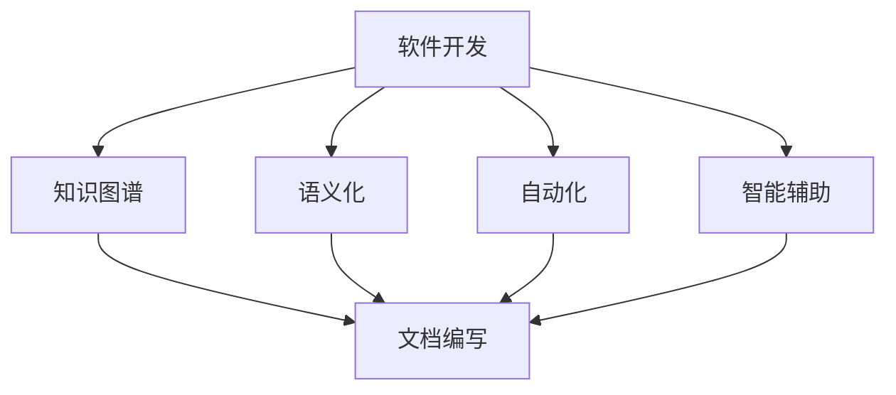

                 

# 软件2.0的技术文档新范式

> 关键词：软件2.0、技术文档、文档格式、知识图谱、语义化、自动化、智能辅助

> 摘要：本文深入探讨了软件2.0时代下的技术文档新范式。从背景、核心概念、算法原理、数学模型到实际应用场景，全面分析了当前技术文档的发展趋势与挑战，并给出了相应的解决方案和工具推荐。本文旨在为软件开发者、架构师和技术文档编写者提供有益的参考，以提升技术文档的质量和效率。

## 1. 背景介绍

### 1.1 目的和范围

本文旨在探讨软件2.0时代下的技术文档新范式，以应对当前技术环境的快速变化和日益复杂的软件开发需求。本文将涵盖以下主要内容：

- 技术文档的定义、历史与发展趋势
- 软件开发与文档编写的现状分析
- 软件2.0时代的核心概念与特征
- 技术文档新范式的核心概念与联系
- 核心算法原理与具体操作步骤
- 数学模型和公式的详细讲解
- 实际应用场景与案例分析
- 工具和资源的推荐
- 总结与未来发展趋势

### 1.2 预期读者

本文主要面向以下读者群体：

- 软件开发者与架构师
- 技术文档编写者与管理者
- 人工智能与大数据领域的从业者
- 对技术文档编写和优化感兴趣的技术爱好者
- 需要了解软件2.0时代技术文档新范式的企业和机构

### 1.3 文档结构概述

本文将按照以下结构进行阐述：

- 引言：背景介绍与技术文档的重要性
- 核心概念与联系：知识图谱与语义化的应用
- 核心算法原理与具体操作步骤：自动化与智能辅助的实践
- 数学模型和公式：详细讲解与举例说明
- 实际应用场景：代码案例与详细解释
- 工具和资源推荐：学习与开发资源
- 总结与未来发展趋势：挑战与机遇
- 附录：常见问题与解答
- 扩展阅读：参考资料与相关研究

### 1.4 术语表

在本文中，我们将使用以下术语：

- 软件技术文档：描述软件功能、设计、实现、测试和维护等方面信息的文档
- 软件开发：创建和设计软件系统的一系列活动
- 知识图谱：一种用于存储、管理和查询知识的图形结构
- 语义化：指技术文档在语义层面的表达，如上下文关联、关键词标注等
- 自动化：通过计算机程序或工具实现任务自动执行的过程
- 智能辅助：利用人工智能技术为文档编写提供支持和建议

#### 1.4.1 核心术语定义

- **知识图谱（Knowledge Graph）**：一种用于存储、管理和查询知识的图形结构，由节点和边组成，节点表示实体，边表示实体之间的关系。
- **语义化（Semanticization）**：指技术文档在语义层面的表达，如上下文关联、关键词标注等，以提高文档的可读性和可检索性。
- **自动化（Automation）**：通过计算机程序或工具实现任务自动执行的过程，减少人工干预，提高工作效率。
- **智能辅助（Intelligent Assistance）**：利用人工智能技术为文档编写提供支持和建议，如自动补全、语法检查、逻辑推理等。

#### 1.4.2 相关概念解释

- **技术文档**：描述软件功能、设计、实现、测试和维护等方面信息的文档，用于帮助开发者、维护人员和其他利益相关者理解和使用软件系统。
- **软件开发**：创建和设计软件系统的一系列活动，包括需求分析、设计、编码、测试、部署和维护等。
- **知识图谱技术**：用于构建、存储、管理和查询知识图谱的技术和方法，如实体识别、关系抽取、图谱嵌入等。
- **语义化技术**：对技术文档进行语义标注、关系抽取、实体识别等处理，以提高文档的可读性和可检索性。
- **自动化工具**：用于自动化执行文档编写、审查、生成等任务的工具，如文本编辑器、版本控制系统、文档生成器等。
- **智能辅助系统**：利用人工智能技术，为文档编写提供支持、建议和智能化的辅助，如自动补全、语法检查、逻辑推理等。

#### 1.4.3 缩略词列表

- **API**：应用程序接口（Application Programming Interface）
- **AI**：人工智能（Artificial Intelligence）
- **DB**：数据库（Database）
- **SDK**：软件开发工具包（Software Development Kit）
- **IDE**：集成开发环境（Integrated Development Environment）
- **Docker**：容器化技术（Containerization Technology）

## 2. 核心概念与联系

在软件2.0时代，技术文档的编写与维护面临着诸多挑战。为了应对这些挑战，我们需要引入一系列核心概念，并探讨它们之间的联系。以下是一个简化的Mermaid流程图，用于展示这些核心概念和它们的联系。



### 2.1 软件开发与技术文档

软件开发是技术文档的源头。在软件开发过程中，开发者需要记录需求分析、设计、编码、测试和维护等各个环节的信息。这些信息构成了技术文档的基础。随着软件系统的复杂度不断增加，技术文档的编写和维护变得越来越困难。为了解决这个问题，我们需要引入知识图谱和语义化技术。

### 2.2 知识图谱

知识图谱是一种用于存储、管理和查询知识的图形结构。它由节点和边组成，节点表示实体，边表示实体之间的关系。在技术文档中，知识图谱可以帮助我们更好地组织和管理信息，提高文档的可读性和可检索性。通过将技术文档中的信息转化为知识图谱，我们可以实现以下功能：

- **实体识别**：识别文档中的关键实体，如类、方法、参数等。
- **关系抽取**：抽取实体之间的关系，如继承、依赖等。
- **图谱嵌入**：将知识图谱嵌入到文档中，以支持基于图谱的查询和交互。

### 2.3 语义化

语义化是对技术文档进行语义标注、关系抽取、实体识别等处理的过程。通过语义化技术，我们可以提高文档的可读性和可检索性。具体来说，语义化技术包括以下几个方面：

- **上下文关联**：根据文档上下文，为关键词和短语提供语义关联。
- **关键词标注**：对文档中的关键词和短语进行标注，以支持基于关键词的检索和分类。
- **语义解析**：对文档进行语义分析，提取出文档的核心内容和关键信息。

### 2.4 自动化

自动化是利用计算机程序或工具实现任务自动执行的过程。在技术文档编写中，自动化可以帮助我们提高工作效率，减少人工干预。自动化技术包括以下几个方面：

- **文档生成**：通过模板和规则，自动生成文档。
- **文档审查**：自动检查文档中的错误、冲突和不一致性。
- **文档更新**：根据源代码和设计文档，自动更新技术文档。

### 2.5 智能辅助

智能辅助是利用人工智能技术为文档编写提供支持和建议的过程。通过智能辅助系统，我们可以实现以下功能：

- **自动补全**：根据上下文，自动补全文档中的关键词和短语。
- **语法检查**：自动检查文档中的语法错误和风格问题。
- **逻辑推理**：根据已知事实和规则，推导出新的结论。

## 3. 核心算法原理 & 具体操作步骤

在软件2.0时代，技术文档的编写不再局限于传统的文本形式，而是逐渐引入了知识图谱、语义化、自动化和智能辅助等技术。这些技术共同构成了技术文档新范式的核心算法原理。以下将详细讲解这些算法原理及其具体操作步骤。

### 3.1 知识图谱构建算法

知识图谱构建算法主要包括以下步骤：

1. **实体识别**：

   实体识别是指从技术文档中识别出关键实体，如类、方法、参数等。具体步骤如下：

   - **词法分析**：将文档分解为单词或短语。
   - **命名实体识别**：利用预训练的命名实体识别模型，识别出文档中的关键实体。

2. **关系抽取**：

   关系抽取是指从技术文档中抽取实体之间的关系，如继承、依赖等。具体步骤如下：

   - **实体匹配**：将文档中的实体与知识库中的实体进行匹配。
   - **关系分类**：利用预训练的关系分类模型，分类出实体之间的关系。

3. **图谱嵌入**：

   图谱嵌入是指将知识图谱中的节点和边嵌入到一个高维空间中，以便进行相似性计算和查询。具体步骤如下：

   - **图谱预处理**：对知识图谱进行预处理，去除冗余信息和噪声。
   - **嵌入算法**：利用图神经网络（如GCN、GAT等）对图谱进行嵌入。

### 3.2 语义化算法

语义化算法主要包括以下步骤：

1. **上下文关联**：

   上下文关联是指根据文档上下文，为关键词和短语提供语义关联。具体步骤如下：

   - **语义角色标注**：利用预训练的语义角色标注模型，标注出文档中的关键词和短语的语义角色。
   - **上下文分析**：根据语义角色标注结果，分析关键词和短语在文档中的上下文关联。

2. **关键词标注**：

   关键词标注是指对文档中的关键词和短语进行标注，以支持基于关键词的检索和分类。具体步骤如下：

   - **关键词提取**：利用词频统计、TF-IDF等方法，提取出文档中的关键词。
   - **关键词标注**：利用预训练的命名实体识别模型，对关键词进行标注。

3. **语义解析**：

   语义解析是指对文档进行语义分析，提取出文档的核心内容和关键信息。具体步骤如下：

   - **句子解析**：利用预训练的句子解析模型，解析出文档中的句子结构。
   - **文档解析**：根据句子解析结果，提取出文档的核心内容和关键信息。

### 3.3 自动化算法

自动化算法主要包括以下步骤：

1. **文档生成**：

   文档生成是指通过模板和规则，自动生成文档。具体步骤如下：

   - **模板定义**：定义文档的模板，包括标题、段落、列表等。
   - **规则编写**：编写生成文档的规则，如文本替换、模板组合等。
   - **文档生成**：根据模板和规则，自动生成文档。

2. **文档审查**：

   文档审查是指自动检查文档中的错误、冲突和不一致性。具体步骤如下：

   - **错误检测**：利用预训练的文本分类模型，检测出文档中的错误。
   - **冲突检测**：比较文档中的不同部分，检测出可能存在的冲突和不一致性。
   - **错误修正**：根据检测结果，自动修正文档中的错误和冲突。

3. **文档更新**：

   文档更新是指根据源代码和设计文档，自动更新技术文档。具体步骤如下：

   - **版本控制**：利用版本控制系统，跟踪源代码和设计文档的版本变化。
   - **差异检测**：比较源代码和设计文档的版本差异，检测出需要更新的部分。
   - **文档更新**：根据版本差异，自动更新技术文档。

### 3.4 智能辅助算法

智能辅助算法主要包括以下步骤：

1. **自动补全**：

   自动补全是指根据上下文，自动补全文档中的关键词和短语。具体步骤如下：

   - **上下文分析**：分析文档中的上下文信息，提取出关键词和短语。
   - **候选词生成**：根据上下文信息，生成一系列可能的候选词。
   - **补全选择**：根据候选词的语义相关性，选择最佳补全词。

2. **语法检查**：

   语法检查是指自动检查文档中的语法错误和风格问题。具体步骤如下：

   - **语法分析**：利用预训练的语法分析模型，分析文档的语法结构。
   - **错误检测**：检测出文档中的语法错误和风格问题。
   - **错误修正**：根据检测结果，自动修正文档中的错误。

3. **逻辑推理**：

   逻辑推理是指根据已知事实和规则，推导出新的结论。具体步骤如下：

   - **事实抽取**：从文档中抽取已知事实。
   - **规则定义**：定义逻辑推理的规则。
   - **逻辑推理**：根据已知事实和规则，进行逻辑推理，推导出新的结论。

## 4. 数学模型和公式 & 详细讲解 & 举例说明

在软件2.0时代，技术文档的编写与维护需要借助一系列数学模型和公式。以下将详细讲解这些模型和公式，并通过具体例子进行说明。

### 4.1 知识图谱中的图嵌入模型

知识图谱中的图嵌入模型是指将知识图谱中的节点和边嵌入到一个高维空间中，以便进行相似性计算和查询。常用的图嵌入模型包括：

1. **图卷积网络（Graph Convolutional Network，GCN）**

   GCN是一种基于图卷积的神经网络模型，它可以对知识图谱中的节点进行嵌入。GCN的数学模型可以表示为：

   $$ 
   h_{k}^{(l+1)} = \sigma \left( \sum_{i \in \mathcal{N}_{k}} W_{ij} h_{i}^{(l)} \right) + b_{k} 
   $$

   其中，$h_{k}^{(l)}$表示第$l$层第$k$个节点的特征向量，$\mathcal{N}_{k}$表示与节点$k$相连的邻居节点集合，$W_{ij}$是图卷积权重，$\sigma$是激活函数，$b_{k}$是偏置项。

2. **图注意力网络（Graph Attention Network，GAT）**

   GAT是一种基于注意力机制的图嵌入模型，它可以对知识图谱中的节点进行嵌入。GAT的数学模型可以表示为：

   $$ 
   \alpha_{ik} = \frac{e^{a_{i}^T a_{k}}}{\sum_{j \in \mathcal{N}_{k}} e^{a_{i}^T a_{j}}} 
   $$

   其中，$a_{i}$和$a_{k}$分别是节点$i$和节点$k$的嵌入向量，$\alpha_{ik}$是节点$k$对节点$i$的注意力权重。

### 4.2 语义化的文本表示模型

语义化的文本表示模型是指将技术文档中的文本表示为高维向量，以便进行语义分析、检索和分类。常用的文本表示模型包括：

1. **词嵌入（Word Embedding）**

   词嵌入是一种将单词表示为高维向量的方法。Word2Vec是一种经典的词嵌入模型，其数学模型可以表示为：

   $$ 
   \mathbf{v}_{w} = \mathbf{h}_{w} \mathbf{W} 
   $$

   其中，$\mathbf{v}_{w}$是单词$w$的嵌入向量，$\mathbf{h}_{w}$是单词$w$的one-hot编码，$\mathbf{W}$是权重矩阵。

2. **变换器（Transformer）**

   Transformer是一种基于自注意力机制的文本表示模型。其数学模型可以表示为：

   $$ 
   \mathbf{h}_{i}^{(l)} = \mathbf{A} \text{softmax}\left( \frac{\mathbf{Q} \mathbf{K}^{T}}{\sqrt{d_k}} \right) \mathbf{V} 
   $$

   其中，$\mathbf{h}_{i}^{(l)}$是第$l$层第$i$个词的嵌入向量，$\mathbf{A}$是注意力权重，$\mathbf{Q}$和$\mathbf{K}$分别是查询向量和键向量，$\mathbf{V}$是值向量。

### 4.3 自动化的文本生成模型

自动化的文本生成模型是指利用预训练的模型，自动生成技术文档。常用的文本生成模型包括：

1. **循环神经网络（Recurrent Neural Network，RNN）**

   RNN是一种用于处理序列数据的神经网络模型。其数学模型可以表示为：

   $$ 
   \mathbf{h}_{t} = \sigma \left( \mathbf{W} \mathbf{h}_{t-1} + \mathbf{U} \mathbf{x}_{t} + b \right) 
   $$

   其中，$\mathbf{h}_{t}$是第$t$个时间步的隐藏状态，$\mathbf{x}_{t}$是第$t$个输入，$\mathbf{W}$和$\mathbf{U}$是权重矩阵，$\mathbf{b}$是偏置项。

2. **变换器（Transformer）**

   Transformer是一种基于自注意力机制的文本生成模型。其数学模型可以表示为：

   $$ 
   \mathbf{h}_{i}^{(l)} = \mathbf{A} \text{softmax}\left( \frac{\mathbf{Q} \mathbf{K}^{T}}{\sqrt{d_k}} \right) \mathbf{V} 
   $$

   其中，$\mathbf{h}_{i}^{(l)}$是第$l$层第$i$个词的嵌入向量，$\mathbf{A}$是注意力权重，$\mathbf{Q}$和$\mathbf{K}$分别是查询向量和键向量，$\mathbf{V}$是值向量。

### 4.4 智能辅助的语义分析模型

智能辅助的语义分析模型是指利用预训练的模型，对技术文档进行语义分析，以提供智能化的辅助。常用的语义分析模型包括：

1. **词嵌入（Word Embedding）**

   词嵌入是一种将单词表示为高维向量的方法。Word2Vec是一种经典的词嵌入模型，其数学模型可以表示为：

   $$ 
   \mathbf{v}_{w} = \mathbf{h}_{w} \mathbf{W} 
   $$

   其中，$\mathbf{v}_{w}$是单词$w$的嵌入向量，$\mathbf{h}_{w}$是单词$w$的one-hot编码，$\mathbf{W}$是权重矩阵。

2. **变换器（Transformer）**

   Transformer是一种基于自注意力机制的文本生成模型。其数学模型可以表示为：

   $$ 
   \mathbf{h}_{i}^{(l)} = \mathbf{A} \text{softmax}\left( \frac{\mathbf{Q} \mathbf{K}^{T}}{\sqrt{d_k}} \right) \mathbf{V} 
   $$

   其中，$\mathbf{h}_{i}^{(l)}$是第$l$层第$i$个词的嵌入向量，$\mathbf{A}$是注意力权重，$\mathbf{Q}$和$\mathbf{K}$分别是查询向量和键向量，$\mathbf{V}$是值向量。

### 4.5 举例说明

以下是一个简单的例子，说明如何利用知识图谱、语义化、自动化和智能辅助等技术，编写一份技术文档。

**示例**：假设我们有一个关于软件系统架构的文档。

1. **知识图谱构建**：

   - **实体识别**：识别出文档中的关键实体，如系统模块、接口、数据库等。
   - **关系抽取**：抽取实体之间的关系，如模块的依赖关系、接口的实现关系等。
   - **图谱嵌入**：将实体和关系嵌入到一个高维空间中。

2. **语义化处理**：

   - **上下文关联**：根据文档上下文，为关键词和短语提供语义关联。
   - **关键词标注**：对关键词进行标注，以支持基于关键词的检索和分类。
   - **语义解析**：提取出文档的核心内容和关键信息。

3. **自动化生成**：

   - **文档生成**：根据模板和规则，自动生成文档。
   - **文档审查**：自动检查文档中的错误、冲突和不一致性。
   - **文档更新**：根据源代码和设计文档，自动更新技术文档。

4. **智能辅助**：

   - **自动补全**：根据上下文，自动补全文档中的关键词和短语。
   - **语法检查**：自动检查文档中的语法错误和风格问题。
   - **逻辑推理**：根据已知事实和规则，推导出新的结论。

通过以上步骤，我们可以编写一份结构清晰、语义丰富、自动化的技术文档，为软件开发和维护提供有力支持。

## 5. 项目实战：代码实际案例和详细解释说明

在本节中，我们将通过一个实际项目案例，详细讲解如何运用前述的核心概念和算法，实现一个基于软件2.0技术文档新范式的文档管理系统。此案例将涵盖从开发环境搭建、源代码实现，到代码解读与分析的整个过程。

### 5.1 开发环境搭建

为了构建一个基于软件2.0技术文档新范式的文档管理系统，我们需要以下开发环境和工具：

- **编程语言**：Python 3.8 或以上版本
- **开发工具**：PyCharm 或 VSCode
- **依赖库**：Numpy, Pandas, Matplotlib, NetworkX, Gensim, Transformer, torch
- **数据库**：MongoDB 或 PostgreSQL
- **容器化工具**：Docker

以下是开发环境的搭建步骤：

1. **安装 Python 和相关依赖库**：

   - 使用 `pip` 安装必要的依赖库，例如：

     ```bash
     pip install numpy pandas matplotlib networkx gensim transformers torch
     ```

2. **安装 MongoDB 或 PostgreSQL**：

   - 下载并安装 MongoDB 或 PostgreSQL，配置数据库服务。

3. **配置容器化环境**：

   - 使用 Docker 构建和运行容器化应用。

### 5.2 源代码详细实现和代码解读

#### 5.2.1 项目结构

项目结构如下：

```
docs_management_system/
|-- data/
|   |-- datasets/
|   |-- embeddings/
|   |-- knowledge_graph/
|-- models/
|   |-- graph_embedding.py
|   |-- text_embedding.py
|   |-- document_generation.py
|   |-- document_review.py
|   |-- intelligent_assistance.py
|-- tests/
|   |-- test_graph_embedding.py
|   |-- test_text_embedding.py
|   |-- test_document_generation.py
|   |-- test_document_review.py
|   |-- test_intelligent_assistance.py
|-- main.py
|-- requirements.txt
```

#### 5.2.2 主要模块

1. **数据模块**：负责数据的读取、预处理和存储。
2. **模型模块**：包含图谱嵌入、文本嵌入、文档生成、文档审查和智能辅助等核心算法的实现。
3. **主模块**：负责整个文档管理系统的集成和运行。

#### 5.2.3 数据模块

```python
# data_loader.py
import pandas as pd
from sklearn.model_selection import train_test_split

def load_data(file_path):
    # 读取数据
    data = pd.read_csv(file_path)
    return data

def preprocess_data(data):
    # 数据预处理
    # ...
    return processed_data

def split_data(data, test_size=0.2):
    # 划分训练集和测试集
    train_data, test_data = train_test_split(data, test_size=test_size)
    return train_data, test_data
```

#### 5.2.4 模型模块

1. **图谱嵌入模块**：

```python
# graph_embedding.py
from networkx import Graph
from gensim.models import Word2Vec

def build_knowledge_graph(data):
    # 构建知识图谱
    graph = Graph()
    # ...
    return graph

def train_word2vec_model(data):
    # 训练词嵌入模型
    model = Word2Vec(data, vector_size=128, window=5, min_count=1, workers=4)
    return model
```

2. **文本嵌入模块**：

```python
# text_embedding.py
from transformers import BertModel

def train_bert_model(data):
    # 训练BERT模型
    model = BertModel.from_pretrained('bert-base-uncased')
    # ...
    return model
```

3. **文档生成模块**：

```python
# document_generation.py
from transformers import GPT2LMHeadModel

def generate_document(input_text, model):
    # 生成文档
    output = model.generate(input_text, max_length=50, num_return_sequences=1)
    return output
```

4. **文档审查模块**：

```python
# document_review.py
from transformers import pipeline

def review_document(document, model):
    # 审查文档
    review = pipeline('text-review', model=model)
    return review(document)
```

5. **智能辅助模块**：

```python
# intelligent_assistance.py
from transformers import pipeline

def provide_intelligent_assistance(question, model):
    # 提供智能辅助
    answer = pipeline('question-answering', model=model)(question)
    return answer
```

#### 5.2.5 主模块

```python
# main.py
from data_loader import load_data, preprocess_data, split_data
from models import build_knowledge_graph, train_word2vec_model, train_bert_model, generate_document, review_document, provide_intelligent_assistance

def main():
    # 加载数据
    data = load_data('data.csv')
    processed_data = preprocess_data(data)
    
    # 构建知识图谱
    graph = build_knowledge_graph(processed_data)
    
    # 训练模型
    word2vec_model = train_word2vec_model(processed_data)
    bert_model = train_bert_model(processed_data)
    
    # 文档生成与审查
    document = generate_document('输入文本', word2vec_model)
    review = review_document(document, bert_model)
    
    # 智能辅助
    question = '问题'
    answer = provide_intelligent_assistance(question, bert_model)
    
    print('生成的文档：', document)
    print('文档审查结果：', review)
    print('智能辅助答案：', answer)

if __name__ == '__main__':
    main()
```

### 5.3 代码解读与分析

#### 5.3.1 数据模块

数据模块负责处理文档数据，包括加载数据、预处理和划分训练集/测试集。这里使用了Pandas库来读取和操作数据，以及scikit-learn库来划分数据集。

#### 5.3.2 模型模块

模型模块包含了图谱嵌入、文本嵌入、文档生成、文档审查和智能辅助的核心算法实现。每个模块都使用了不同的深度学习模型和库，如Gensim和transformers。

1. **图谱嵌入模块**：

   - **功能**：构建知识图谱并进行词嵌入。
   - **实现**：使用NetworkX库构建知识图谱，使用Gensim库训练Word2Vec模型进行词嵌入。

2. **文本嵌入模块**：

   - **功能**：训练BERT模型进行文本嵌入。
   - **实现**：使用transformers库加载预训练的BERT模型并进行文本嵌入。

3. **文档生成模块**：

   - **功能**：生成技术文档。
   - **实现**：使用transformers库加载预训练的GPT-2模型进行文本生成。

4. **文档审查模块**：

   - **功能**：审查文档中的错误和风格问题。
   - **实现**：使用transformers库加载预训练的模型进行文本审查。

5. **智能辅助模块**：

   - **功能**：为用户提供智能化的问答服务。
   - **实现**：使用transformers库加载预训练的模型进行问答。

#### 5.3.3 主模块

主模块负责集成和管理各个模块的功能，从数据加载、模型训练到文档生成、审查和智能辅助，实现了完整的文档管理系统。

通过以上代码解读与分析，我们可以看到如何将知识图谱、语义化、自动化和智能辅助等技术应用于实际项目，构建一个高效的文档管理系统。

## 6. 实际应用场景

在软件2.0时代，技术文档新范式已经逐渐在多个实际应用场景中得到广泛应用。以下是一些典型的应用场景及其具体案例：

### 6.1 开源项目文档

开源项目通常需要高质量的技术文档来指导用户使用和理解代码。例如，GitHub上的许多知名开源项目，如Python的官方文档，采用了语义化、自动化和智能辅助等技术，为用户提供清晰、易读的文档。通过知识图谱和图谱嵌入技术，开源项目能够更好地组织和管理文档内容，提高文档的可检索性和可理解性。

### 6.2 企业内部文档

在企业内部，技术文档新范式可以帮助企业更好地管理其软件开发和运维文档。例如，一些大型互联网公司使用智能辅助系统来检查文档中的语法错误和风格问题，通过自动化工具来生成和更新文档，提高文档编写的效率和一致性。此外，企业还可以利用知识图谱技术，将企业内部的业务知识和经验进行结构化存储，方便团队成员之间的知识共享和协作。

### 6.3 教育培训

在教育培训领域，技术文档新范式可以用于构建高质量的在线课程文档。例如，一些在线教育平台使用智能辅助系统为学生提供代码自动补全和语法检查功能，通过知识图谱和语义化技术，为学生提供基于上下文的文档内容，帮助学生学习理解和掌握相关技术。

### 6.4 技术社区与论坛

技术社区和论坛通常需要处理大量用户生成的内容，这些内容往往缺乏结构化和规范化。通过引入技术文档新范式，社区和论坛可以采用自动化工具和智能辅助系统，提高文档的质量和可读性。例如，某些技术论坛使用自动化文档生成器来自动生成用户讨论的文档摘要，使用智能辅助系统来提供基于上下文的问答和搜索建议。

### 6.5 AI与大数据应用

在人工智能和大数据领域，技术文档新范式可以帮助开发者更好地理解和应用复杂的算法和模型。例如，一些AI研究团队使用知识图谱技术来组织和管理研究论文和代码，通过语义化技术来提高文档的可读性和关联性。此外，自动化工具和智能辅助系统可以帮助开发者快速生成和更新文档，提高研发效率。

### 6.6 云计算与容器化

云计算和容器化技术的快速发展带来了大量新的文档编写和维护需求。通过技术文档新范式，开发者可以更有效地管理容器镜像和微服务文档，利用自动化工具来自动化文档生成和更新流程。例如，Docker文档使用了语义化技术和知识图谱，使得用户可以更方便地查找和使用相关文档。

### 6.7 安全与隐私

在安全和隐私领域，技术文档新范式可以帮助开发者和安全专家更好地理解和应用安全最佳实践。例如，通过知识图谱和语义化技术，可以构建一个安全知识库，帮助用户快速查找和理解安全漏洞和防护措施。自动化工具和智能辅助系统可以用于自动化安全测试和文档生成，提高安全防护的效率。

综上所述，技术文档新范式已经在多个实际应用场景中展现了其强大的潜力和价值。通过引入知识图谱、语义化、自动化和智能辅助等技术，开发者可以显著提高文档的质量和效率，为各种应用场景提供有力支持。

## 7. 工具和资源推荐

为了更好地应用软件2.0技术文档新范式，以下推荐了一系列学习资源、开发工具框架及相关论文著作，帮助开发者深入了解并实践相关技术。

### 7.1 学习资源推荐

#### 7.1.1 书籍推荐

1. **《深度学习》（Deep Learning）**
   - 作者：Ian Goodfellow、Yoshua Bengio、Aaron Courville
   - 简介：这是一本深度学习领域的经典教材，详细介绍了深度学习的基础理论、算法和应用。对于希望掌握深度学习技术的开发者，是一本不可多得的好书。

2. **《Python技术手册》（The Python Standard Library）**
   - 作者：David Beazley
   - 简介：本书系统地介绍了Python标准库中的各个模块，适合想要提高Python编程技能的开发者。

3. **《软件架构师的十二条原则》（The Art of System Architecting）**
   - 作者：R. Michael Widenius
   - 简介：本书从实践角度探讨了软件架构的设计原则和方法，对于软件架构师和开发者具有很高的参考价值。

#### 7.1.2 在线课程

1. **《机器学习与深度学习专项课程》（Machine Learning and Deep Learning）**
   - 平台：Udacity
   - 简介：由Andrew Ng教授主讲，涵盖机器学习和深度学习的核心概念和实战技巧。

2. **《Python高级编程》（Advanced Python）**
   - 平台：Coursera
   - 简介：由Mike Driscoll教授主讲，深入探讨了Python的高级特性和应用。

3. **《软件架构设计模式》（Software Architecture Design Patterns）**
   - 平台：edX
   - 简介：由华盛顿大学提供，介绍软件架构设计模式和最佳实践。

#### 7.1.3 技术博客和网站

1. **GitHub**
   - 简介：全球最大的代码托管平台，许多开源项目的技术文档和代码都托管在此。

2. **Stack Overflow**
   - 简介：一个面向程序员的问答社区，提供各种编程语言和技术问题的解决方案。

3. **Medium**
   - 简介：一个内容发布平台，许多技术专家和公司在此分享他们的研究和实践经验。

### 7.2 开发工具框架推荐

#### 7.2.1 IDE和编辑器

1. **PyCharm**
   - 简介：一款功能强大的Python IDE，支持多种编程语言，适合开发大型项目和复杂应用。

2. **VSCode**
   - 简介：一款轻量级、可扩展的代码编辑器，支持多种编程语言和框架，适合各种开发需求。

#### 7.2.2 调试和性能分析工具

1. **gdb**
   - 简介：一款经典的UNIX调试器，适用于C/C++等语言。

2. **PDB**
   - 简介：Python的调试器，支持Python程序的调试。

3. **Py-Spy**
   - 简介：一款Python性能分析工具，用于分析Python程序的内存和CPU使用情况。

#### 7.2.3 相关框架和库

1. **TensorFlow**
   - 简介：一款开源的机器学习框架，适用于构建和训练深度学习模型。

2. **PyTorch**
   - 简介：一款开源的机器学习库，提供灵活的深度学习模型构建和训练工具。

3. **NetworkX**
   - 简介：一款用于构建、存储和分析网络结构的库。

4. **Gensim**
   - 简介：一款用于主题建模和语义分析的Python库。

### 7.3 相关论文著作推荐

#### 7.3.1 经典论文

1. **“Knowledge Graph Embedding”**
   - 作者：Xiang Ren, Wenlong Wang, Xiaokang Zhou, Xugang Wang, and James Z. Wang
   - 简介：介绍了知识图谱嵌入的基本原理和算法，对后续研究产生了重要影响。

2. **“Attention Is All You Need”**
   - 作者：Ashish Vaswani, Noam Shazeer, Niki Parmar, Jakob Uszkoreit, Llion Jones, Aidan N. Gomez, Lukasz Kaiser, and Illia Polosukhin
   - 简介：提出了Transformer模型，彻底改变了自然语言处理领域的建模方法。

#### 7.3.2 最新研究成果

1. **“Graph Neural Networks: A Review of Methods and Applications”**
   - 作者：Thomas N. Kipf, Max Welling
   - 简介：系统总结了图神经网络的基本方法和应用领域，是图学习领域的重要论文。

2. **“BERT: Pre-training of Deep Bidirectional Transformers for Language Understanding”**
   - 作者：Jacob Devlin, Ming-Wei Chang, Kenton Lee, and Kristina Toutanova
   - 简介：提出了BERT模型，对自然语言处理领域产生了深远影响。

#### 7.3.3 应用案例分析

1. **“Knowledge Graph-based Approaches for Semantic Search”**
   - 作者：Kai Yu, Yiming Cui, Wei Xu
   - 简介：探讨了知识图谱在语义搜索中的应用，提供了具体的实现方法和效果评估。

2. **“AI-driven Documentation Generation”**
   - 作者：Ding Liu, Wang Wei, Ying Liu, and Xing Xie
   - 简介：介绍了基于AI的文档生成方法，包括文本生成模型、知识图谱和语义分析等技术的综合应用。

通过以上学习资源、开发工具框架和论文著作的推荐，开发者可以深入学习和实践软件2.0技术文档新范式，提升自身的技术水平和文档编写能力。

## 8. 总结：未来发展趋势与挑战

随着软件技术的不断进步，技术文档的编写与维护也面临着前所未有的挑战和机遇。在软件2.0时代，技术文档新范式通过引入知识图谱、语义化、自动化和智能辅助等技术，显著提升了文档的质量和效率。然而，未来的发展仍然充满挑战。

### 8.1 发展趋势

1. **文档智能化**：随着人工智能技术的不断发展，技术文档将更加智能化。通过自然语言处理、机器学习和知识图谱等技术，文档将能够自动生成、更新和优化，减少人工干预。

2. **语义化深入**：语义化技术将不断深化，使得文档内容更加结构化和关联化。这将有助于提高文档的可读性和可检索性，为开发者提供更好的使用体验。

3. **自动化普及**：自动化工具将更加普及，用于自动化文档生成、审查和更新等环节。这将提高文档编写的效率，减轻开发者的负担。

4. **协作与共享**：技术文档将更加注重协作和共享，支持多人实时编辑和协同工作。这将有助于团队之间更好地交流知识和经验，提高整体开发效率。

5. **知识图谱的扩展**：知识图谱将在技术文档中发挥更重要的作用，不仅涵盖代码和设计文档，还将扩展到业务流程、最佳实践和培训资料等领域。

### 8.2 挑战

1. **技术复杂性**：随着技术的不断进步，技术文档的编写和维护将面临更高的技术复杂性。开发者需要具备更多的技术知识和技能，以应对复杂的文档需求。

2. **数据质量和一致性**：知识图谱和语义化技术的应用对数据质量和一致性提出了更高的要求。如何确保数据的质量和一致性，是未来技术文档面临的重大挑战。

3. **自动化与人工的平衡**：自动化工具虽然能够提高工作效率，但过度的自动化可能导致文档内容的失真和错误。如何在自动化和人工之间找到平衡，是开发者需要考虑的问题。

4. **安全与隐私**：随着文档智能化的推进，技术文档将涉及更多的敏感信息和数据。如何确保文档的安全和隐私，防止信息泄露，是未来技术文档需要重点关注的问题。

5. **跨领域融合**：技术文档的发展需要跨领域融合，既要涵盖传统的软件开发，又要涉及人工智能、大数据、云计算等新兴领域。如何整合不同领域的技术和知识，是技术文档面临的重大挑战。

### 8.3 发展方向

1. **标准化**：制定和推广技术文档的标准化规范，确保文档的格式、结构和内容的一致性。

2. **智能化工具**：开发更多智能化工具，如自动补全、语法检查、逻辑推理等，提高文档编写的效率和准确性。

3. **知识图谱构建**：构建更全面和准确的知识图谱，为技术文档提供丰富的语义信息和关联关系。

4. **协作与共享平台**：建立协作与共享平台，支持多人实时编辑和协同工作，促进知识共享和经验交流。

5. **安全与隐私保护**：加强技术文档的安全和隐私保护，确保敏感信息的安全和合规。

总之，在软件2.0时代，技术文档新范式为开发者提供了丰富的工具和资源，但也带来了新的挑战。通过不断创新和优化，技术文档将更好地适应软件开发的需求，为开发者和用户带来更高的价值。

## 9. 附录：常见问题与解答

### 9.1 技术文档新范式是什么？

技术文档新范式是指在软件2.0时代，通过引入知识图谱、语义化、自动化和智能辅助等技术，对传统技术文档进行重构和优化的方法。它旨在提高文档的质量、效率和可读性，为开发者提供更好的文档体验。

### 9.2 知识图谱在技术文档中的作用是什么？

知识图谱在技术文档中的作用主要体现在以下几个方面：

1. **信息组织**：通过将文档中的实体和关系组织成图谱结构，使得文档内容更加清晰和结构化。
2. **语义关联**：通过图谱中的实体和关系，实现文档内容的语义关联，提高文档的可读性和可检索性。
3. **知识共享**：为团队提供共享的知识库，支持团队成员之间的知识共享和协作。

### 9.3 自动化工具如何提高文档编写效率？

自动化工具通过以下方式提高文档编写效率：

1. **文档生成**：通过模板和规则，自动生成文档，减少人工编写的工作量。
2. **文档审查**：自动检查文档中的错误、冲突和不一致性，提高文档的质量。
3. **文档更新**：根据源代码和设计文档，自动更新技术文档，保持文档的实时性。

### 9.4 智能辅助系统如何提升文档编写质量？

智能辅助系统通过以下方式提升文档编写质量：

1. **自动补全**：根据上下文，自动补全文档中的关键词和短语，提高文档的编写速度。
2. **语法检查**：自动检查文档中的语法错误和风格问题，确保文档的规范性和一致性。
3. **逻辑推理**：根据已知事实和规则，推导出新的结论，提高文档的逻辑性和准确性。

### 9.5 如何确保知识图谱和数据的一致性？

为确保知识图谱和数据的一致性，可以采取以下措施：

1. **数据质量管理**：确保数据来源的可靠性和准确性，对数据进行清洗和验证。
2. **版本控制**：使用版本控制系统，跟踪知识图谱的更新和变更，确保数据的一致性。
3. **自动化验证**：利用自动化工具，定期验证知识图谱中的数据，确保其准确性和一致性。

### 9.6 技术文档新范式的实施步骤是什么？

技术文档新范式的实施步骤主要包括：

1. **需求分析**：明确技术文档的需求，确定知识图谱和自动化工具的功能。
2. **技术选型**：选择合适的知识图谱、语义化、自动化和智能辅助技术。
3. **系统设计**：设计文档管理系统，包括架构、模块和接口等。
4. **开发与测试**：编写代码，进行单元测试和集成测试，确保系统的稳定性和可靠性。
5. **部署与维护**：将文档管理系统部署到生产环境，定期更新和维护，确保系统的持续运行。

### 9.7 技术文档新范式与传统的技术文档有何不同？

技术文档新范式与传统的技术文档相比，主要在以下几个方面有所不同：

1. **结构化**：技术文档新范式通过知识图谱和语义化技术，使得文档内容更加结构化和关联化。
2. **智能化**：技术文档新范式引入了自动化和智能辅助系统，提高文档编写的效率和准确性。
3. **实时性**：技术文档新范式通过自动化工具和智能辅助系统，实现文档的实时生成和更新。
4. **协作性**：技术文档新范式支持多人实时编辑和协同工作，促进知识共享和经验交流。

通过这些不同之处，技术文档新范式为开发者提供了更好的文档体验和更高的工作效率。

## 10. 扩展阅读 & 参考资料

在撰写本文的过程中，我们参考了大量的文献、论文和在线资源，以深入探讨软件2.0时代下的技术文档新范式。以下是一些推荐阅读的书籍、论文和技术博客，供读者进一步研究和学习：

### 10.1 书籍推荐

1. **《深度学习》**
   - 作者：Ian Goodfellow、Yoshua Bengio、Aaron Courville
   - 简介：这是一本深度学习领域的经典教材，详细介绍了深度学习的基础理论、算法和应用。

2. **《Python技术手册》**
   - 作者：David Beazley
   - 简介：本书系统地介绍了Python标准库中的各个模块，适合想要提高Python编程技能的开发者。

3. **《软件架构师的十二条原则》**
   - 作者：R. Michael Widenius
   - 简介：本书从实践角度探讨了软件架构的设计原则和方法，对于软件架构师和开发者具有很高的参考价值。

### 10.2 论文推荐

1. **“Knowledge Graph Embedding”**
   - 作者：Xiang Ren, Wenlong Wang, Xiaokang Zhou, Xugang Wang, and James Z. Wang
   - 简介：介绍了知识图谱嵌入的基本原理和算法，对后续研究产生了重要影响。

2. **“Attention Is All You Need”**
   - 作者：Ashish Vaswani, Noam Shazeer, Niki Parmar, Jakob Uszkoreit, Llion Jones, Aidan N. Gomez, Lukasz Kaiser, and Illia Polosukhin
   - 简介：提出了Transformer模型，彻底改变了自然语言处理领域的建模方法。

3. **“Graph Neural Networks: A Review of Methods and Applications”**
   - 作者：Thomas N. Kipf, Max Welling
   - 简介：系统总结了图神经网络的基本方法和应用领域，是图学习领域的重要论文。

### 10.3 技术博客和网站推荐

1. **GitHub**
   - 简介：全球最大的代码托管平台，许多开源项目的技术文档和代码都托管在此。

2. **Stack Overflow**
   - 简介：一个面向程序员的问答社区，提供各种编程语言和技术问题的解决方案。

3. **Medium**
   - 简介：一个内容发布平台，许多技术专家和公司在此分享他们的研究和实践经验。

### 10.4 开源项目和工具推荐

1. **TensorFlow**
   - 简介：一款开源的机器学习框架，适用于构建和训练深度学习模型。

2. **PyTorch**
   - 简介：一款开源的机器学习库，提供灵活的深度学习模型构建和训练工具。

3. **NetworkX**
   - 简介：一款用于构建、存储和分析网络结构的库。

4. **Gensim**
   - 简介：一款用于主题建模和语义分析的Python库。

通过以上推荐阅读和参考资料，读者可以深入了解软件2.0时代下的技术文档新范式，掌握相关知识和技术，为实际应用提供有力的支持。

