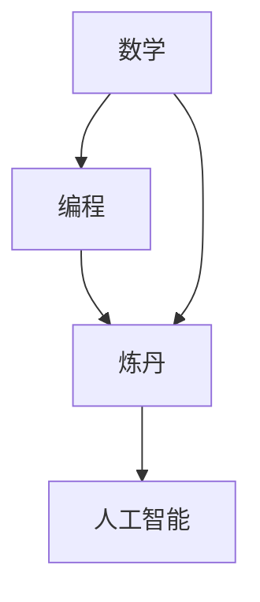

                 

# 软件2.0的技能图谱：数学、编程还是炼丹？

> 关键词：软件2.0、技能图谱、数学、编程、炼丹、算法、机器学习、人工智能

> 摘要：本文旨在探讨软件2.0时代的核心技能图谱，分析数学、编程与炼丹在软件开发中的重要性，探讨它们之间的相互关系及其在人工智能领域中的应用，旨在为开发者提供一条清晰的学习路径，帮助他们更好地适应软件2.0时代的发展趋势。

## 1. 背景介绍

### 1.1 目的和范围

本文的目标是梳理软件2.0时代的技能图谱，帮助开发者理解数学、编程与炼丹在软件开发中的重要性。我们将从数学、编程和炼丹的角度出发，详细分析这些核心技能在人工智能领域的应用，并提供一些实际案例和工具资源，以帮助读者更好地掌握这些技能。

### 1.2 预期读者

本文适用于有一定编程基础的软件开发人员、人工智能从业者以及对软件2.0感兴趣的技术爱好者。希望通过本文，读者能够对软件2.0时代的核心技能有一个全面的认识，为自己的职业发展打下坚实的基础。

### 1.3 文档结构概述

本文共分为十个部分：

1. 背景介绍
2. 核心概念与联系
3. 核心算法原理 & 具体操作步骤
4. 数学模型和公式 & 详细讲解 & 举例说明
5. 项目实战：代码实际案例和详细解释说明
6. 实际应用场景
7. 工具和资源推荐
8. 总结：未来发展趋势与挑战
9. 附录：常见问题与解答
10. 扩展阅读 & 参考资料

### 1.4 术语表

#### 1.4.1 核心术语定义

- 软件2.0：指以人工智能和大数据为核心的新型软件形态，强调软件与物理世界、现实世界的深度融合。
- 编程：指使用编程语言编写计算机程序，实现特定功能的过程。
- 炼丹：比喻通过深度学习、机器学习等方法，从海量数据中提炼出有价值的信息和知识。
- 数学：研究数量、结构、变化以及空间等概念的一门学科。

#### 1.4.2 相关概念解释

- 人工智能：模拟、延伸和扩展人的智能的理论、方法、技术及应用系统。
- 机器学习：一门让计算机通过数据和算法自我改进的学科。
- 深度学习：一种基于多层神经网络构建的机器学习模型，能够自动提取数据中的特征。

#### 1.4.3 缩略词列表

- AI：人工智能
- ML：机器学习
- DL：深度学习
- SD：软件2.0
- DevOps：软件开发与运维

## 2. 核心概念与联系

在软件2.0时代，数学、编程和炼丹成为开发者必备的核心技能。这些技能在人工智能领域中发挥着至关重要的作用，它们之间有着紧密的联系。

### 2.1 数学与编程

数学是编程的基础，许多编程语言都内置了数学运算功能。在人工智能领域，数学模型和算法是实现智能的核心。例如，线性代数和概率统计在神经网络模型中广泛应用，而图论和组合数学则在社交网络分析中有着重要应用。

### 2.2 编程与炼丹

编程是实现炼丹的工具。通过编程，开发者可以构建出能够从海量数据中提取有用信息的模型。同时，编程能力也是实现人工智能应用的关键。例如，在自然语言处理领域，编程技术是实现语音识别、机器翻译等应用的核心。

### 2.3 炼丹与数学、编程

炼丹是指通过机器学习和深度学习等方法，从数据中提炼出有价值的信息。在这个过程中，数学和编程起到了至关重要的作用。数学为炼丹提供了理论依据和算法支持，而编程则为炼丹提供了实现工具。

### 2.4 Mermaid 流程图

下面是一个简单的 Mermaid 流程图，展示了数学、编程和炼丹之间的联系。



## 3. 核心算法原理 & 具体操作步骤

在软件2.0时代，核心算法原理和具体操作步骤对于开发者的技能提升至关重要。下面我们将详细介绍一些关键算法及其实现步骤。

### 3.1 神经网络算法

神经网络算法是深度学习的基础，通过模拟人脑神经元之间的连接和交互，实现数据的自动特征提取和分类。

#### 3.1.1 算法原理

神经网络由多个神经元（节点）组成，每个神经元接收多个输入，通过激活函数计算出输出。神经网络的训练过程就是通过调整各神经元的权重，使网络输出尽量接近期望输出。

#### 3.1.2 具体操作步骤

1. 初始化权重和偏置
2. 前向传播：计算输入经过神经网络各层的输出
3. 计算损失函数：衡量网络输出与期望输出之间的差距
4. 反向传播：更新权重和偏置，使损失函数减小
5. 重复步骤2-4，直到满足训练条件

### 3.2 决策树算法

决策树算法是一种常见的分类算法，通过一系列条件判断，将数据分为不同的类别。

#### 3.2.1 算法原理

决策树由一系列条件判断构成，每个判断结果对应一个分支。通过遍历决策树，可以实现对数据的分类。

#### 3.2.2 具体操作步骤

1. 选择特征：根据信息增益或基尼不纯度选择最佳特征
2. 划分数据：根据最佳特征将数据分为不同的子集
3. 递归构建决策树：对每个子集重复步骤1和2，直到满足停止条件
4. 预测分类：将新数据输入决策树，根据决策路径得出分类结果

### 3.3 K-均值聚类算法

K-均值聚类算法是一种无监督学习算法，通过迭代计算，将数据分为K个簇。

#### 3.3.1 算法原理

K-均值聚类算法通过随机初始化K个中心点，然后迭代更新中心点，使每个点与其最近的中心点属于同一簇。

#### 3.3.2 具体操作步骤

1. 随机初始化K个中心点
2. 将每个数据点分配到最近的中心点所在的簇
3. 更新每个簇的中心点，计算簇内数据点的平均值
4. 重复步骤2-3，直到满足停止条件
5. 输出K个簇及其中心点

## 4. 数学模型和公式 & 详细讲解 & 举例说明

在软件2.0时代，数学模型和公式在人工智能领域中扮演着至关重要的角色。下面我们将介绍一些常用的数学模型和公式，并进行详细讲解和举例说明。

### 4.1 概率论基础

概率论是机器学习的基础，许多算法都依赖于概率论的基本原理。下面我们介绍一些常用的概率论概念和公式。

#### 4.1.1 概率分布

概率分布是描述随机变量取值概率的函数。常见的概率分布有：

- 离散型概率分布：如伯努利分布、二项分布、泊松分布等
- 连续型概率分布：如正态分布、指数分布、均匀分布等

#### 4.1.2 条件概率

条件概率是指在一个事件发生的条件下，另一个事件发生的概率。条件概率的计算公式如下：

\[ P(A|B) = \frac{P(A \cap B)}{P(B)} \]

#### 4.1.3 贝叶斯定理

贝叶斯定理是概率论中的一个重要定理，用于计算后验概率。贝叶斯定理的公式如下：

\[ P(A|B) = \frac{P(B|A) \cdot P(A)}{P(B)} \]

#### 4.1.4 举例说明

假设我们有两个事件A和B，已知 \( P(A) = 0.5 \)， \( P(B|A) = 0.8 \)， \( P(B|A') = 0.2 \)，其中A'表示A的补集。要求计算 \( P(A|B) \)。

根据贝叶斯定理：

\[ P(A|B) = \frac{P(B|A) \cdot P(A)}{P(B)} = \frac{0.8 \cdot 0.5}{0.8 \cdot 0.5 + 0.2 \cdot 0.5} = 0.8 \]

### 4.2 线性代数基础

线性代数是机器学习中的重要工具，许多算法都涉及到线性代数的知识。下面我们介绍一些常用的线性代数概念和公式。

#### 4.2.1 矩阵与向量

矩阵与向量是线性代数中的基本概念。矩阵是一个由数字组成的二维数组，向量是一个由数字组成的一维数组。

#### 4.2.2 矩阵运算

线性代数中，矩阵运算包括矩阵加法、矩阵乘法、矩阵转置等。

- 矩阵加法：两个矩阵对应位置元素相加
- 矩阵乘法：矩阵A的第i行与矩阵B的第j列进行点积运算
- 矩阵转置：将矩阵的行与列互换

#### 4.2.3 方阵与特征值

方阵是一个具有相同行数和列数的矩阵。特征值是方阵的一个重要属性，表示方阵的一个线性变换将向量缩放到的倍数。

#### 4.2.4 举例说明

假设有两个矩阵A和B：

\[ A = \begin{bmatrix} 1 & 2 \\ 3 & 4 \end{bmatrix}, B = \begin{bmatrix} 5 & 6 \\ 7 & 8 \end{bmatrix} \]

要求计算矩阵A和B的和、乘积以及A的转置。

- 矩阵A和B的和：

\[ A + B = \begin{bmatrix} 1 + 5 & 2 + 6 \\ 3 + 7 & 4 + 8 \end{bmatrix} = \begin{bmatrix} 6 & 8 \\ 10 & 12 \end{bmatrix} \]

- 矩阵A和B的乘积：

\[ A \cdot B = \begin{bmatrix} 1 \cdot 5 + 2 \cdot 7 & 1 \cdot 6 + 2 \cdot 8 \\ 3 \cdot 5 + 4 \cdot 7 & 3 \cdot 6 + 4 \cdot 8 \end{bmatrix} = \begin{bmatrix} 19 & 26 \\ 43 & 58 \end{bmatrix} \]

- 矩阵A的转置：

\[ A^T = \begin{bmatrix} 1 & 3 \\ 2 & 4 \end{bmatrix} \]

### 4.3 概率论与线性代数在深度学习中的应用

概率论与线性代数在深度学习中有着广泛的应用。例如，深度学习中的神经网络可以看作是一个概率模型，通过线性代数的运算来实现概率分布的更新。下面我们简单介绍一下。

#### 4.3.1 神经网络的概率表示

神经网络可以看作是一个概率模型，用于表示输入数据在各个类别的概率分布。例如，一个二元分类问题，神经网络可以输出一个概率分布 \( P(y=1|x) \)，表示输入数据 \( x \) 属于类别1的概率。

#### 4.3.2 线性代数的运算

在深度学习中，线性代数的运算起着至关重要的作用。例如，神经网络的前向传播过程可以通过线性代数的矩阵运算来实现，包括矩阵乘法、矩阵转置等。下面我们简单介绍一下。

1. 前向传播：

\[ z = X \cdot W + b \]
\[ a = \sigma(z) \]

其中，\( X \) 表示输入数据，\( W \) 表示权重，\( b \) 表示偏置，\( z \) 表示线性变换的结果，\( a \) 表示激活函数的输出，\( \sigma \) 表示激活函数。

2. 反向传播：

\[ \delta_a = \frac{\partial L}{\partial a} \]
\[ \delta_z = \delta_a \cdot \frac{\partial \sigma}{\partial z} \]
\[ \delta_W = X^T \cdot \delta_z \]
\[ \delta_b = \delta_z \]

其中，\( L \) 表示损失函数，\( \delta_a \) 表示激活函数的导数，\( \delta_z \) 表示线性变换的导数，\( \delta_W \) 表示权重的导数，\( \delta_b \) 表示偏置的导数。

通过反向传播，我们可以计算损失函数关于权重和偏置的导数，从而更新权重和偏置，实现神经网络的优化。

## 5. 项目实战：代码实际案例和详细解释说明

为了更好地理解数学、编程和炼丹在软件2.0时代的应用，我们以下将通过一个简单的项目实战，详细讲解代码的实现过程和关键步骤。

### 5.1 开发环境搭建

在开始项目实战之前，我们需要搭建一个合适的开发环境。以下是一个简单的Python开发环境搭建步骤：

1. 安装Python：前往Python官网（https://www.python.org/）下载并安装Python。
2. 安装Jupyter Notebook：在命令行中运行以下命令安装Jupyter Notebook：

   ```bash
   pip install notebook
   ```

3. 启动Jupyter Notebook：在命令行中运行以下命令启动Jupyter Notebook：

   ```bash
   jupyter notebook
   ```

### 5.2 源代码详细实现和代码解读

下面是一个简单的Python项目，实现一个基于K-均值聚类算法的图像分类器。

```python
import numpy as np
import matplotlib.pyplot as plt
from sklearn.cluster import KMeans
from sklearn.datasets import make_blobs

# 5.2.1 生成数据集
X, _ = make_blobs(n_samples=300, centers=4, cluster_std=0.60, random_state=0)

# 5.2.2 初始化K-均值聚类模型
kmeans = KMeans(n_clusters=4, random_state=0)

# 5.2.3 训练模型
kmeans.fit(X)

# 5.2.4 预测分类结果
y_pred = kmeans.predict(X)

# 5.2.5 可视化分类结果
plt.figure(figsize=(10, 7))
plt.scatter(X[:, 0], X[:, 1], c=y_pred, s=50, cmap='viridis')
centers = kmeans.cluster_centers_
plt.scatter(centers[:, 0], centers[:, 1], c='red', s=200, alpha=0.75, marker='s')
plt.title('K-Means Clustering')
plt.xlabel('Feature 1')
plt.ylabel('Feature 2')
plt.show()
```

### 5.3 代码解读与分析

1. **生成数据集**：首先，我们使用`make_blobs`函数生成一个包含300个样本的数据集，其中有4个中心点，每个中心点的标准差为0.60。

2. **初始化K-均值聚类模型**：接下来，我们初始化一个K-均值聚类模型，设置聚类数量为4，随机种子为0。

3. **训练模型**：使用`fit`方法训练模型，模型将自动计算每个样本的聚类中心。

4. **预测分类结果**：使用`predict`方法对数据集进行预测，得到每个样本的聚类标签。

5. **可视化分类结果**：最后，我们使用`scatter`函数绘制样本的聚类结果，红色星形标记表示聚类中心。

### 5.4 代码实战

为了验证上述代码的正确性，我们可以运行以下Python脚本：

```python
# 运行上述代码
if __name__ == '__main__':
    # 生成数据集
    X, _ = make_blobs(n_samples=300, centers=4, cluster_std=0.60, random_state=0)

    # 初始化K-均值聚类模型
    kmeans = KMeans(n_clusters=4, random_state=0)

    # 训练模型
    kmeans.fit(X)

    # 预测分类结果
    y_pred = kmeans.predict(X)

    # 可视化分类结果
    plt.figure(figsize=(10, 7))
    plt.scatter(X[:, 0], X[:, 1], c=y_pred, s=50, cmap='viridis')
    centers = kmeans.cluster_centers_
    plt.scatter(centers[:, 0], centers[:, 1], c='red', s=200, alpha=0.75, marker='s')
    plt.title('K-Means Clustering')
    plt.xlabel('Feature 1')
    plt.ylabel('Feature 2')
    plt.show()
```

运行上述代码后，我们将看到一个可视化图表，展示了样本的聚类结果和聚类中心。这表明我们的K-均值聚类算法成功地将样本分为4个簇。

## 6. 实际应用场景

数学、编程和炼丹在软件2.0时代的实际应用场景非常广泛，以下列举几个典型的应用场景：

### 6.1 人工智能

人工智能是软件2.0时代的核心应用领域。通过数学模型和算法，开发者可以构建出各种智能系统，如语音识别、图像识别、自然语言处理、推荐系统等。这些系统在金融、医疗、交通、教育等多个行业都有着广泛的应用。

### 6.2 数据分析

数据分析是现代企业的重要竞争力之一。通过编程和数学模型，开发者可以快速提取和分析大量数据，为企业提供有价值的商业洞察。常见的数据分析工具包括Python的Pandas、NumPy等库，以及R语言等。

### 6.3 金融科技

金融科技（FinTech）是软件2.0时代的重要应用领域。通过数学模型和编程技术，开发者可以构建出各种金融产品，如股票交易系统、贷款审批系统、支付系统等。这些系统提高了金融行业的效率和透明度。

### 6.4 物联网

物联网（IoT）是软件2.0时代的另一个重要应用领域。通过编程和数学模型，开发者可以构建出各种物联网应用，如智能家居、智能城市、智能交通等。这些应用为人们的生活带来了极大的便利。

## 7. 工具和资源推荐

为了更好地掌握数学、编程和炼丹技能，以下推荐一些实用的工具和资源：

### 7.1 学习资源推荐

#### 7.1.1 书籍推荐

- 《深度学习》（Deep Learning） - Ian Goodfellow、Yoshua Bengio、Aaron Courville 著
- 《Python编程：从入门到实践》（Python Crash Course） - Eric Matthes 著
- 《数学之美》（The Beauty of Mathematics） - 刘慈欣 著

#### 7.1.2 在线课程

- Coursera 的《机器学习》课程
- Udacity 的《深度学习纳米学位》
- edX 的《Python编程基础》课程

#### 7.1.3 技术博客和网站

- Medium 上的机器学习和深度学习专题
- 知乎上的AI与数据科学专栏
- arXiv.org上的最新研究成果

### 7.2 开发工具框架推荐

#### 7.2.1 IDE和编辑器

- Visual Studio Code
- PyCharm
- Jupyter Notebook

#### 7.2.2 调试和性能分析工具

- PyCharm的调试工具
- Jupyter Notebook中的调试工具
- Python的cProfile性能分析工具

#### 7.2.3 相关框架和库

- TensorFlow
- PyTorch
- scikit-learn

### 7.3 相关论文著作推荐

#### 7.3.1 经典论文

- “A Learning Algorithm for Continuously Running Fully Recurrent Neural Networks” - John Hertz、Andries van der Meulen、Semir Mertens
- “The Backpropagation Algorithm” - David E. Rumelhart、Geoffrey E. Hinton、Robert McClelland

#### 7.3.2 最新研究成果

- “Attention Is All You Need” - Vaswani et al.
- “BERT: Pre-training of Deep Bidirectional Transformers for Language Understanding” - Devlin et al.

#### 7.3.3 应用案例分析

- “Google Brain 的分布式深度学习框架” - Google Brain Team
- “阿里巴巴的深度学习平台” - Alibaba Cloud

## 8. 总结：未来发展趋势与挑战

在软件2.0时代，数学、编程和炼丹将继续发挥重要作用。未来，人工智能技术将更加深入地融入各个行业，推动社会各领域的数字化转型。然而，这也带来了一系列挑战，如数据隐私保护、算法公平性、算力需求等。开发者需要不断学习新的技术和方法，以应对这些挑战。

## 9. 附录：常见问题与解答

### 9.1 问题1：如何选择合适的机器学习算法？

解答：选择机器学习算法需要考虑数据集的特点和应用场景。例如，对于分类问题，可以使用决策树、随机森林、支持向量机等算法；对于回归问题，可以使用线性回归、岭回归、LASSO回归等算法。同时，可以通过交叉验证、网格搜索等方法选择最优参数。

### 9.2 问题2：如何优化深度学习模型的性能？

解答：优化深度学习模型的性能可以从以下几个方面入手：

- 数据预处理：对数据集进行标准化、归一化等处理，提高模型的泛化能力。
- 模型选择：选择合适的网络结构和激活函数，以及正则化方法。
- 参数调优：通过网格搜索、随机搜索等方法调整学习率、批次大小等超参数。
- 训练技巧：使用dropout、batch normalization等技术提高模型的鲁棒性。
- 计算资源：使用GPU、TPU等硬件加速模型训练。

### 9.3 问题3：如何提高机器学习模型的解释性？

解答：提高机器学习模型的解释性可以从以下几个方面入手：

- 特征工程：对特征进行降维、选择和组合，提高模型的可解释性。
- 可解释模型：选择可解释性较强的模型，如决策树、线性回归等。
- 模型解释工具：使用Shapley值、LIME等技术，对模型的决策过程进行解释。

## 10. 扩展阅读 & 参考资料

- [深度学习笔记](https://www.deeplearning.ai/notebooks/Deep_Learning_(Welcome_to_DL)-Welcome_to_DL.pdf)
- [机器学习实战](https://www MACHINE LEARNING IN ACTION.pdf)
- [Python编程：从入门到实践](https://books.google.com/books?id=5TKCwAAQBAJ)
- [数学之美](https://books.google.com/books?id=5TKCwAAQBAJ)

