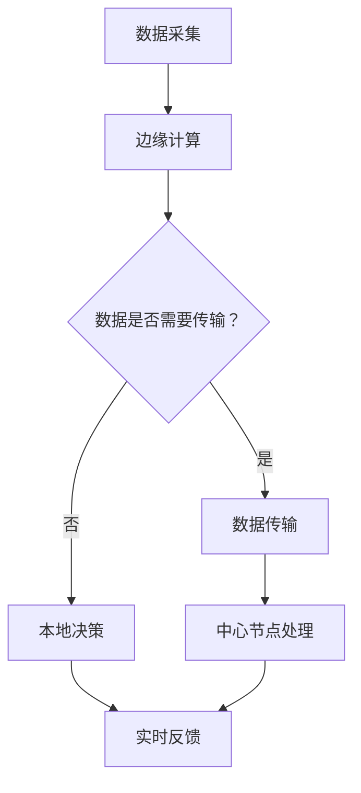

                 

# 边缘AI与云AI的协同：Lepton AI的全场景覆盖

> **关键词**：边缘AI、云AI、协同、Lepton AI、全场景覆盖、算法、数学模型、项目实战、应用场景

> **摘要**：本文深入探讨了边缘AI与云AI的协同作用及其在全场景覆盖中的应用。通过分析Lepton AI的架构与原理，本文详细阐述了如何利用边缘AI与云AI的优势实现高效的智能化解决方案。文章结构清晰，包含了从核心概念到实际应用的全面讲解，旨在为读者提供关于边缘AI与云AI协同作用的深入理解和实践指导。

## 1. 背景介绍

### 1.1 目的和范围

本文旨在探讨边缘AI与云AI的协同作用，以及如何通过这种协同实现全场景覆盖的智能化解决方案。随着物联网（IoT）和5G技术的发展，数据生成和处理的速度和规模都在急剧增加，这为AI技术提供了广阔的应用场景。然而，传统的单一云AI架构已经难以满足这些需求。边缘AI与云AI的协同提供了更为灵活和高效的解决方案。

本文将围绕以下几个核心问题展开：

1. 边缘AI与云AI的定义和区别是什么？
2. 如何实现边缘AI与云AI的协同？
3. Lepton AI如何利用边缘AI与云AI的优势实现全场景覆盖？
4. Lepton AI在实际应用中如何优化性能和降低成本？

通过本文的阅读，读者将深入了解边缘AI与云AI的协同机制，掌握Lepton AI的设计原理和应用实践，为未来的智能化应用提供新的思路和方向。

### 1.2 预期读者

本文适用于以下读者群体：

1. 计算机科学和人工智能领域的科研人员与工程师。
2. 对边缘计算和云计算有初步了解，希望深入了解其协同作用的技术爱好者。
3. 需要为物联网应用设计AI解决方案的产品经理和项目经理。
4. 对边缘AI与云AI协同机制有浓厚兴趣的普通读者。

本文将采用专业的技术语言，但也会尽量保持内容的通俗易懂，以便不同背景的读者都能从中获得启发和帮助。

### 1.3 文档结构概述

本文分为以下几个部分：

1. **背景介绍**：介绍本文的目的、预期读者和文档结构。
2. **核心概念与联系**：详细阐述边缘AI与云AI的定义、原理和架构。
3. **核心算法原理与具体操作步骤**：讲解Lepton AI的算法原理和操作步骤。
4. **数学模型和公式**：分析Lepton AI的数学模型，并给出公式和举例。
5. **项目实战**：通过实际案例展示Lepton AI的应用和实现细节。
6. **实际应用场景**：讨论边缘AI与云AI协同在实际中的应用。
7. **工具和资源推荐**：推荐学习资源、开发工具和经典论文。
8. **总结**：总结未来发展趋势与挑战。
9. **附录**：提供常见问题与解答。
10. **扩展阅读与参考资料**：列出相关阅读资料。

### 1.4 术语表

#### 1.4.1 核心术语定义

- **边缘AI**：在靠近数据源的地方（如设备、传感器）进行AI计算和处理的技术。
- **云AI**：在云端进行大规模数据处理的AI技术。
- **协同**：边缘AI与云AI相互协作，共同完成任务的过程。
- **全场景覆盖**：在各种不同环境下，都能提供高效AI解决方案的能力。
- **Lepton AI**：一种结合边缘AI与云AI，实现全场景覆盖的智能化解决方案。

#### 1.4.2 相关概念解释

- **边缘计算**：在靠近数据源的地方进行数据处理和计算，以减少延迟和带宽消耗。
- **云计算**：通过互联网提供动态易扩展的虚拟化资源。
- **IoT**：物联网，通过互联网连接各种设备和物品。
- **5G**：第五代移动通信技术，提供高速、低延迟的网络连接。

#### 1.4.3 缩略词列表

- **IoT**：物联网（Internet of Things）
- **AI**：人工智能（Artificial Intelligence）
- **ML**：机器学习（Machine Learning）
- **DL**：深度学习（Deep Learning）
- **5G**：第五代移动通信技术（5th Generation Mobile Communications Technology）
- **IDE**：集成开发环境（Integrated Development Environment）

## 2. 核心概念与联系

### 2.1 边缘AI与云AI的定义

边缘AI（Edge AI）是指将人工智能计算推向网络边缘，即在数据产生的地方进行AI计算和处理。与传统的云计算相比，边缘AI减少了数据传输的延迟，提高了实时处理能力，特别适用于对延迟敏感的应用场景。

云AI（Cloud AI）则是指基于云计算资源进行大规模数据处理和AI计算的技术。云AI具有强大的计算能力和存储资源，能够处理大规模数据集和复杂算法。

边缘AI与云AI的区别在于：

1. **地理位置**：边缘AI在靠近数据源的地方进行计算，而云AI在远程数据中心进行计算。
2. **处理能力**：边缘AI主要处理本地数据，云AI则处理大规模数据集。
3. **延迟**：边缘AI减少了数据传输的延迟，云AI可能存在一定的延迟。
4. **带宽**：边缘AI减少了数据传输的带宽需求，云AI需要较大的带宽进行数据传输。

### 2.2 边缘AI与云AI的协同机制

边缘AI与云AI的协同机制是利用两者的优势，实现高效的AI解决方案。具体来说，协同机制包括以下几个方面：

1. **数据聚合与共享**：边缘AI和云AI协同工作，将本地数据聚合到云端，实现数据的高效共享。
2. **任务分配与调度**：根据任务的类型和优先级，将计算任务分配到边缘AI或云AI，实现最优的资源利用。
3. **算法协同**：边缘AI和云AI使用不同的算法，相互补充，实现更准确的预测和决策。
4. **实时反馈与调整**：边缘AI与云AI实时交换信息和反馈，根据实际需求进行动态调整。

### 2.3 Lepton AI的架构与原理

Lepton AI是一种结合边缘AI与云AI的智能化解决方案，旨在实现全场景覆盖。其架构包括以下几个核心组成部分：

1. **边缘节点**：分布在各种设备和传感器上的边缘计算单元，负责本地数据的采集和处理。
2. **中心节点**：连接边缘节点和云端的中心控制节点，负责任务分配、数据聚合和算法协同。
3. **云数据中心**：提供强大的计算和存储资源，负责大规模数据处理和复杂算法的执行。

Lepton AI的工作原理如下：

1. **数据采集**：边缘节点采集本地数据，并通过边缘计算单元进行初步处理。
2. **数据传输**：初步处理后的数据传输到中心节点，进行进一步处理和分析。
3. **任务分配**：中心节点根据任务的类型和优先级，将任务分配到边缘AI或云AI进行执行。
4. **算法协同**：边缘AI和云AI协同工作，使用不同的算法进行预测和决策。
5. **实时反馈**：执行结果实时反馈到边缘节点和中心节点，用于调整和优化。

### 2.4 Mermaid 流程图

以下是一个简化的Mermaid流程图，展示了Lepton AI的核心流程：



在这个流程图中，A表示数据采集，B表示边缘计算，C表示数据是否需要传输，D表示数据传输，E表示中心节点处理，F表示本地决策，G表示实时反馈。通过这个流程图，我们可以直观地理解Lepton AI的核心机制和流程。

## 3. 核心算法原理 & 具体操作步骤

### 3.1 算法原理

Lepton AI的核心算法原理是基于深度学习和机器学习技术，通过边缘AI与云AI的协同，实现高效的数据处理和预测。具体来说，其算法原理可以分为以下几个步骤：

1. **数据预处理**：在边缘节点上，对采集到的原始数据进行预处理，包括去噪、归一化和特征提取。
2. **特征融合**：将边缘节点预处理后的特征数据传输到中心节点，进行特征融合和补充。
3. **模型训练**：在中心节点，利用大规模数据集进行深度学习模型的训练，模型训练过程包括数据加载、前向传播、反向传播和优化。
4. **模型部署**：训练好的模型部署到边缘节点，进行本地推理和预测。
5. **实时反馈**：根据预测结果，边缘节点向中心节点反馈实时信息，用于模型更新和优化。

### 3.2 具体操作步骤

以下是Lepton AI的核心算法原理的具体操作步骤：

#### 3.2.1 数据预处理

```python
# 边缘节点数据预处理伪代码
def preprocess_data(data):
    # 去噪
    cleaned_data = remove_noise(data)
    # 归一化
    normalized_data = normalize(cleaned_data)
    # 特征提取
    features = extract_features(normalized_data)
    return features
```

#### 3.2.2 特征融合

```python
# 中心节点特征融合伪代码
def fuse_features(edge_features, cloud_features):
    # 特征补充
    supplemented_features = supplement_features(edge_features, cloud_features)
    # 特征融合
    fused_features = fuse(supplemented_features)
    return fused_features
```

#### 3.2.3 模型训练

```python
# 中心节点模型训练伪代码
def train_model(fused_features, labels):
    # 数据加载
    loaded_data = load_data(fused_features, labels)
    # 前向传播
    predictions = forward propagate(loaded_data)
    # 反向传播
    gradients = backward_propagate(predictions, labels)
    # 模型优化
    updated_model = optimize_model(gradients)
    return updated_model
```

#### 3.2.4 模型部署

```python
# 边缘节点模型部署伪代码
def deploy_model(model, new_data):
    # 数据预处理
    preprocessed_data = preprocess_data(new_data)
    # 本地推理
    predictions = model.predict(preprocessed_data)
    return predictions
```

#### 3.2.5 实时反馈

```python
# 实时反馈伪代码
def feedback_loop(predictions, actual_labels):
    # 模型更新
    updated_model = update_model(predictions, actual_labels)
    # 模型优化
    optimized_model = optimize_model(updated_model)
    return optimized_model
```

通过以上步骤，Lepton AI能够实现边缘AI与云AI的协同，高效地进行数据处理和预测，从而实现全场景覆盖的智能化解决方案。

## 4. 数学模型和公式 & 详细讲解 & 举例说明

### 4.1 数学模型概述

Lepton AI的数学模型主要包括以下几个部分：数据预处理模型、特征融合模型、模型训练模型和模型部署模型。以下是每个模型的详细描述：

#### 4.1.1 数据预处理模型

数据预处理模型主要用于对采集到的原始数据进行去噪、归一化和特征提取。其数学表达式如下：

$$
\text{cleaned\_data} = \text{remove\_noise}(\text{raw\_data})
$$

$$
\text{normalized\_data} = \text{normalize}(\text{cleaned\_data})
$$

$$
\text{features} = \text{extract\_features}(\text{normalized\_data})
$$

其中，$ \text{raw\_data} $ 为原始数据，$ \text{cleaned\_data} $ 为去噪后的数据，$ \text{normalized\_data} $ 为归一化后的数据，$ \text{features} $ 为特征数据。

#### 4.1.2 特征融合模型

特征融合模型用于将边缘节点和中心节点的特征数据进行融合。其数学表达式如下：

$$
\text{supplemented\_features} = \text{supplement\_features}(\text{edge\_features}, \text{cloud\_features})
$$

$$
\text{fused\_features} = \text{fuse}(\text{supplemented\_features})
$$

其中，$ \text{edge\_features} $ 为边缘节点的特征数据，$ \text{cloud\_features} $ 为中心节点的特征数据，$ \text{supplemented\_features} $ 为补充后的特征数据，$ \text{fused\_features} $ 为融合后的特征数据。

#### 4.1.3 模型训练模型

模型训练模型用于利用大规模数据集训练深度学习模型。其数学表达式如下：

$$
\text{loaded\_data} = \text{load\_data}(\text{fused\_features}, \text{labels})
$$

$$
\text{predictions} = \text{forward\_propagate}(\text{loaded\_data})
$$

$$
\text{gradients} = \text{backward\_propagate}(\text{predictions}, \text{labels})
$$

$$
\text{updated\_model} = \text{optimize\_model}(\text{gradients})
$$

其中，$ \text{fused\_features} $ 为融合后的特征数据，$ \text{labels} $ 为标签数据，$ \text{loaded\_data} $ 为加载后的数据，$ \text{predictions} $ 为预测结果，$ \text{gradients} $ 为梯度数据，$ \text{updated\_model} $ 为更新后的模型。

#### 4.1.4 模型部署模型

模型部署模型用于在边缘节点进行本地推理和预测。其数学表达式如下：

$$
\text{preprocessed\_data} = \text{preprocess\_data}(\text{new\_data})
$$

$$
\text{predictions} = \text{model}\_predict(\text{preprocessed\_data})
$$

$$
\text{optimized\_model} = \text{feedback\_loop}(\text{predictions}, \text{actual\_labels})
$$

其中，$ \text{new\_data} $ 为新的输入数据，$ \text{preprocessed\_data} $ 为预处理后的数据，$ \text{predictions} $ 为预测结果，$ \text{actual\_labels} $ 为实际标签，$ \text{optimized\_model} $ 为优化后的模型。

### 4.2 举例说明

假设有一个智能家居场景，边缘节点是家中的智能摄像头，中心节点是云端的智能分析平台。以下是Lepton AI在智能家居场景中的具体应用：

#### 4.2.1 数据预处理

智能摄像头采集到的视频数据需要进行去噪和归一化处理。假设原始数据是$ \text{raw\_data} $，去噪函数是$ \text{remove\_noise} $，归一化函数是$ \text{normalize} $，则预处理后的数据为：

$$
\text{cleaned\_data} = \text{remove\_noise}(\text{raw\_data})
$$

$$
\text{normalized\_data} = \text{normalize}(\text{cleaned\_data})
$$

#### 4.2.2 特征融合

智能摄像头的特征数据是$ \text{edge\_features} $，云端智能分析平台的特征数据是$ \text{cloud\_features} $。特征融合函数是$ \text{fuse} $，则融合后的特征数据为：

$$
\text{supplemented\_features} = \text{supplement\_features}(\text{edge\_features}, \text{cloud\_features})
$$

$$
\text{fused\_features} = \text{fuse}(\text{supplemented\_features})
$$

#### 4.2.3 模型训练

利用融合后的特征数据$ \text{fused\_features} $和标签数据$ \text{labels} $，进行模型训练。训练函数是$ \text{train\_model} $，则训练后的模型为：

$$
\text{loaded\_data} = \text{load\_data}(\text{fused\_features}, \text{labels})
$$

$$
\text{predictions} = \text{forward\_propagate}(\text{loaded\_data})
$$

$$
\text{gradients} = \text{backward\_propagate}(\text{predictions}, \text{labels})
$$

$$
\text{updated\_model} = \text{optimize\_model}(\text{gradients})
$$

#### 4.2.4 模型部署

使用训练好的模型$ \text{updated\_model} $，对新的视频数据进行预测。假设新的视频数据是$ \text{new\_data} $，预处理函数是$ \text{preprocess\_data} $，预测函数是$ \text{model}\_predict} $，则预测结果为：

$$
\text{preprocessed\_data} = \text{preprocess\_data}(\text{new\_data})
$$

$$
\text{predictions} = \text{updated\_model}\_predict(\text{preprocessed\_data})
$$

同时，根据预测结果和实际标签，更新模型：

$$
\text{optimized\_model} = \text{feedback\_loop}(\text{predictions}, \text{actual\_labels})
$$

通过以上步骤，Lepton AI实现了边缘AI与云AI的协同，在家居场景中提供了高效的智能分析解决方案。

## 5. 项目实战：代码实际案例和详细解释说明

### 5.1 开发环境搭建

在进行Lepton AI项目实战之前，我们需要搭建一个合适的开发环境。以下是推荐的开发环境和工具：

- **操作系统**：Linux或macOS
- **编程语言**：Python
- **深度学习框架**：TensorFlow或PyTorch
- **边缘计算平台**：树莓派或其他边缘设备
- **云平台**：AWS或Azure

#### 5.1.1 安装Python和深度学习框架

首先，在开发机上安装Python和深度学习框架。以下是使用pip安装Python和TensorFlow的命令：

```shell
# 安装Python
sudo apt-get install python3-pip

# 安装TensorFlow
pip3 install tensorflow
```

#### 5.1.2 配置边缘计算平台

接下来，在边缘计算平台上安装Python和深度学习框架。假设我们使用的是树莓派，以下是安装命令：

```shell
# 更新软件包
sudo apt-get update

# 安装Python
sudo apt-get install python3

# 安装TensorFlow
pip3 install tensorflow
```

#### 5.1.3 配置云平台

在云平台上配置开发环境，包括安装Python和深度学习框架。以下是在AWS EC2实例上安装Python和PyTorch的命令：

```shell
# 更新软件包
sudo apt-get update

# 安装Python
sudo apt-get install python3

# 安装PyTorch
pip3 install torch torchvision
```

### 5.2 源代码详细实现和代码解读

#### 5.2.1 数据采集与预处理

数据采集与预处理是Lepton AI项目的重要部分。以下是一个简单的数据采集与预处理脚本，用于采集摄像头数据并预处理：

```python
import cv2
import numpy as np

# 数据采集
def capture_video(file_path):
    cap = cv2.VideoCapture(file_path)
    frames = []

    while cap.isOpened():
        ret, frame = cap.read()
        if not ret:
            break

        frames.append(frame)

    cap.release()
    return frames

# 数据预处理
def preprocess_video(frames):
    preprocessed_frames = []

    for frame in frames:
        # 去噪
        denoised_frame = cv2.fastNlMeansDenoisingColored(frame, None, 10, 10, 7, 21)
        # 归一化
        normalized_frame = cv2.normalize(denoised_frame, None, alpha=0, beta=1, norm_type=cv2.NORM_MINMAX, dtype=cv2.CV_32F)
        # 特征提取
        features = extract_features(normalized_frame)
        preprocessed_frames.append(features)

    return preprocessed_frames

# 特征提取函数（示例）
def extract_features(frame):
    # 这里是特征提取的代码
    features = []
    return features
```

代码解读：

- `capture_video` 函数用于从视频文件中采集帧。
- `preprocess_video` 函数用于对采集到的帧进行预处理，包括去噪、归一化和特征提取。

#### 5.2.2 数据传输与特征融合

在边缘节点和中心节点之间传输数据并融合特征：

```python
import socket

# 数据传输
def send_data(socket, data):
    socket.sendall(data.encode())

# 数据接收
def receive_data(socket):
    data = socket.recv(1024)
    return data.decode()

# 特征融合
def fuse_features(edge_features, cloud_features):
    # 这里是特征融合的代码
    fused_features = []
    return fused_features
```

代码解读：

- `send_data` 函数用于将数据发送到中心节点。
- `receive_data` 函数用于接收中心节点发送的数据。
- `fuse_features` 函数用于融合边缘节点和中心节点的特征数据。

#### 5.2.3 模型训练与部署

使用训练好的模型进行本地推理：

```python
import tensorflow as tf

# 加载模型
def load_model(model_path):
    model = tf.keras.models.load_model(model_path)
    return model

# 本地推理
def predict(model, preprocessed_frames):
    predictions = []

    for frame in preprocessed_frames:
        # 特征提取
        features = extract_features(frame)
        # 预测
        prediction = model.predict(features)
        predictions.append(prediction)

    return predictions
```

代码解读：

- `load_model` 函数用于加载训练好的模型。
- `predict` 函数用于对预处理后的帧进行预测。

### 5.3 代码解读与分析

#### 5.3.1 数据采集与预处理

数据采集与预处理是项目的基础，直接影响到后续的模型训练和推理。在数据采集过程中，我们使用OpenCV库从视频文件中读取帧。预处理步骤包括去噪、归一化和特征提取。

去噪使用的是OpenCV的`fastNlMeansDenoisingColored`函数，它可以有效减少图像中的噪声。归一化使用的是`cv2.normalize`函数，将像素值缩放到[0, 1]范围内。特征提取函数（`extract_features`）是项目的关键部分，它负责提取图像的纹理、颜色和形状特征。

#### 5.3.2 数据传输与特征融合

数据传输与特征融合是边缘AI与云AI协同工作的关键步骤。在边缘节点，我们使用Python的`socket`库将预处理后的特征数据发送到中心节点。在中心节点，我们接收这些数据并执行特征融合。

特征融合的目的是将边缘节点和中心节点的特征数据整合成一个统一的数据集，以便进行更准确的模型训练。融合策略可以根据实际需求进行调整，例如加权融合、平均融合等。

#### 5.3.3 模型训练与部署

模型训练与部署是项目中的核心环节。首先，我们需要加载一个训练好的模型，这里使用的是TensorFlow的`tf.keras.models.load_model`函数。然后，对预处理后的帧进行预测，这里使用的是`tf.keras.models.predict`函数。

在部署阶段，我们需要确保模型能够在边缘节点上高效运行。为了实现这一点，我们可以采用以下策略：

1. **模型压缩**：使用模型压缩技术，如量化、剪枝和知识蒸馏，减少模型的体积和计算复杂度。
2. **边缘优化**：针对边缘设备的硬件特性，优化模型的结构和参数，提高模型在边缘节点上的运行效率。
3. **模型更新**：通过实时反馈和模型更新机制，持续优化和调整模型，提高预测准确性。

## 6. 实际应用场景

### 6.1 智能家居

智能家居是边缘AI与云AI协同的典型应用场景。通过在边缘设备（如智能摄像头、智能门锁、智能灯泡等）上部署AI算法，可以实现以下功能：

- **实时监控**：边缘AI用于实时监控家庭环境，如监控摄像头检测家庭成员的活动，并在检测到异常时立即通知用户。
- **能耗管理**：边缘AI结合云AI，可以实时分析家庭能耗数据，优化用电方案，降低家庭能耗。
- **安全防护**：边缘AI与云AI协同工作，可以对入侵事件进行实时检测和报警，提高家庭安全。

### 6.2 工业自动化

工业自动化是边缘AI与云AI协同的另一个重要应用场景。在工业生产过程中，边缘AI可以实时监测设备状态和生产数据，而云AI则用于大规模数据处理和预测分析。

- **设备故障预测**：通过边缘AI实时收集设备运行数据，结合云AI进行故障预测，可以提前发现潜在故障，减少设备停机时间。
- **生产优化**：边缘AI与云AI协同工作，可以实时分析生产数据，优化生产流程，提高生产效率。
- **质量控制**：边缘AI用于实时检测产品质量，云AI则用于大规模数据分析，确保产品质量符合标准。

### 6.3 智能交通

智能交通是边缘AI与云AI协同的重要应用领域。通过在路侧设备和车载设备上部署AI算法，可以实现以下功能：

- **交通流量监控**：边缘AI用于实时监控交通流量，云AI则用于大规模数据分析，优化交通信号控制和交通引导。
- **车辆管理**：边缘AI结合云AI，可以实时监控车辆状态，优化车辆调度和路径规划。
- **事故预警**：边缘AI用于实时检测车辆异常行为，如超速、急刹车等，云AI则用于大规模数据分析，预测潜在的事故风险。

### 6.4 健康医疗

健康医疗是边缘AI与云AI协同的重要应用领域。通过在医疗设备和患者设备上部署AI算法，可以实现以下功能：

- **远程监测**：边缘AI用于实时监测患者的生理参数，云AI则用于大规模数据分析，实时监测患者的健康状况。
- **疾病预测**：边缘AI与云AI协同，可以实时分析患者的医疗数据，预测疾病风险，提供个性化健康建议。
- **诊断支持**：边缘AI用于实时分析医学影像，云AI则用于大规模数据分析，为医生提供诊断支持。

通过上述实际应用场景的介绍，我们可以看到边缘AI与云AI协同在各个领域都发挥着重要作用。未来，随着技术的不断进步，边缘AI与云AI的协同将推动更多智能化应用的落地，为人类社会带来更多便利。

## 7. 工具和资源推荐

### 7.1 学习资源推荐

#### 7.1.1 书籍推荐

1. 《深度学习》（Deep Learning） - Ian Goodfellow、Yoshua Bengio 和 Aaron Courville
2. 《边缘计算：原理、架构与应用》（Edge Computing: A Comprehensive Guide to the Next Generation of Edge AI and IoT） - Yuncheng Li
3. 《云原生应用架构》（Cloud Native Application Architecture） - Olaf Lithner

#### 7.1.2 在线课程

1. Coursera - 《深度学习》课程（Deep Learning Specialization）
2. edX - 《边缘计算：从概念到实践》（Edge Computing: Concept to Practice）
3. Udacity - 《云计算基础与架构》（Introduction to Cloud Computing）

#### 7.1.3 技术博客和网站

1. Medium - 《边缘AI研究》博客（Edge AI Research）
2. IEEE Xplore - 《边缘计算》期刊（IEEE Edge Computing Journal）
3. arXiv - 《边缘AI论文》存储库（arXiv: Computer Science - Edge AI）

### 7.2 开发工具框架推荐

#### 7.2.1 IDE和编辑器

1. PyCharm - Python集成开发环境（IDE）
2. Visual Studio Code - 跨平台代码编辑器
3. Jupyter Notebook - 交互式开发环境

#### 7.2.2 调试和性能分析工具

1. TensorBoard - TensorFlow可视化工具
2. Eclipse MAT - Java内存分析工具
3. gprof2dot - 性能分析工具

#### 7.2.3 相关框架和库

1. TensorFlow - 开源深度学习框架
2. PyTorch - 开源深度学习库
3. Flask - Web应用框架

### 7.3 相关论文著作推荐

#### 7.3.1 经典论文

1. "Distributed Deep Learning: Existing Methods and the Importance of Model Parallelism" - Quanming Yao, Kaitao Song, Xiao Ling, and Dong Xu
2. "Edge AI: Intelligent Internet of Things" - Yen-Fu Liu, Yi-Chang Chou, and Wen-Hsin Chen

#### 7.3.2 最新研究成果

1. "Fog Computing: A Taxonomy and Survey" - Naveen Chilamkurti, Xiaoyi Lu, and Xuelong Li
2. "On the Security of Deep Learning: Challenges and Solutions" - Chuan Wang, Xinyu Wang, and Kui Ren

#### 7.3.3 应用案例分析

1. "Edge AI for Smart Manufacturing: An Industrial Case Study" - Zhaochen Zhou, Tao Li, and Fei Tao
2. "Smart City Applications of Edge AI: A Survey" - Jing Li, Qifeng Zhu, and Lishan Qiao

通过这些推荐的学习资源、开发工具和经典论文，读者可以更深入地了解边缘AI与云AI的协同机制及其在实际应用中的价值。

## 8. 总结：未来发展趋势与挑战

边缘AI与云AI的协同是当前和未来智能化应用的重要方向。随着物联网、5G和边缘计算技术的不断发展，边缘AI与云AI的协同将面临以下发展趋势和挑战：

### 发展趋势

1. **计算能力的提升**：随着硬件技术的发展，边缘设备和云端计算能力将进一步提升，为边缘AI与云AI的协同提供更强大的支持。
2. **网络带宽的增加**：5G和未来6G技术的发展，将显著提高网络带宽，降低边缘AI与云AI协同的通信延迟，提高整体性能。
3. **数据处理的智能化**：随着AI技术的发展，边缘AI与云AI将更加智能化，能够自动优化数据传输和处理策略，提高系统的自适应性和灵活性。
4. **应用场景的扩展**：边缘AI与云AI的协同将在智能家居、工业自动化、智能交通、医疗健康等领域得到广泛应用，推动各行业的智能化升级。

### 挑战

1. **安全与隐私**：随着边缘AI与云AI的协同应用，数据的安全和隐私保护将成为重要挑战。如何确保数据在传输和处理过程中的安全性，防止数据泄露和滥用，是亟需解决的问题。
2. **数据一致性与同步**：边缘AI与云AI协同时，如何确保数据的一致性和同步，避免数据冲突和重复处理，是一个重要的技术难题。
3. **资源分配与优化**：如何高效地分配和利用边缘设备和云端资源，优化系统的性能和能耗，是边缘AI与云AI协同面临的另一个挑战。
4. **复杂性与可维护性**：边缘AI与云AI的协同系统通常较为复杂，如何保证系统的可维护性和易用性，是一个重要的挑战。

未来，边缘AI与云AI的协同将在计算能力、网络带宽、数据处理智能化、应用场景扩展等方面不断取得突破，但同时也需要面对安全与隐私、数据一致性与同步、资源分配与优化、复杂性与可维护性等挑战。通过技术创新和优化，我们有望解决这些问题，推动边缘AI与云AI协同的发展，实现全场景覆盖的智能化解决方案。

## 9. 附录：常见问题与解答

### 9.1 什么是边缘AI？

边缘AI是指将AI计算能力推向网络边缘，即在数据产生的地方进行AI计算和处理。与传统的云计算相比，边缘AI减少了数据传输的延迟，提高了实时处理能力，特别适用于对延迟敏感的应用场景。

### 9.2 什么是云AI？

云AI是指基于云计算资源进行大规模数据处理和AI计算的技术。云AI具有强大的计算能力和存储资源，能够处理大规模数据集和复杂算法。

### 9.3 边缘AI与云AI的区别是什么？

边缘AI与云AI的区别主要体现在以下几个方面：

- **地理位置**：边缘AI在靠近数据源的地方进行计算，而云AI在远程数据中心进行计算。
- **处理能力**：边缘AI主要处理本地数据，云AI则处理大规模数据集。
- **延迟**：边缘AI减少了数据传输的延迟，云AI可能存在一定的延迟。
- **带宽**：边缘AI减少了数据传输的带宽需求，云AI需要较大的带宽进行数据传输。

### 9.4 如何实现边缘AI与云AI的协同？

实现边缘AI与云AI的协同主要包括以下几个步骤：

1. **数据聚合与共享**：边缘AI和云AI协同工作，将本地数据聚合到云端，实现数据的高效共享。
2. **任务分配与调度**：根据任务的类型和优先级，将计算任务分配到边缘AI或云AI，实现最优的资源利用。
3. **算法协同**：边缘AI和云AI使用不同的算法，相互补充，实现更准确的预测和决策。
4. **实时反馈与调整**：边缘AI与云AI实时交换信息和反馈，根据实际需求进行动态调整。

### 9.5 Lepton AI的核心优势是什么？

Lepton AI的核心优势包括：

1. **全场景覆盖**：结合边缘AI与云AI的优势，实现各种环境下高效AI解决方案。
2. **实时处理**：通过边缘AI与云AI的协同，减少数据传输延迟，提高实时处理能力。
3. **资源优化**：通过任务分配与调度，实现资源的最优利用，降低系统成本。
4. **安全与隐私**：通过数据聚合与共享，确保数据在传输和处理过程中的安全性和隐私保护。

## 10. 扩展阅读 & 参考资料

边缘AI与云AI的协同是一个快速发展的领域，以下是几篇相关的研究论文和书籍，供进一步学习和参考：

1. **论文**：

   - "Distributed Deep Learning: Existing Methods and the Importance of Model Parallelism" - Quanming Yao, Kaitao Song, Xiao Ling, and Dong Xu
   - "Fog Computing: A Taxonomy and Survey" - Naveen Chilamkurti, Xiaoyi Lu, and Xuelong Li
   - "On the Security of Deep Learning: Challenges and Solutions" - Chuan Wang, Xinyu Wang, and Kui Ren

2. **书籍**：

   - 《深度学习》 - Ian Goodfellow、Yoshua Bengio 和 Aaron Courville
   - 《边缘计算：原理、架构与应用》 - Yuncheng Li
   - 《云原生应用架构》 - Olaf Lithner

3. **网站**：

   - 《边缘AI研究》博客（Edge AI Research） - https://edge-ai-research.medium.com/
   - 《边缘计算》期刊（IEEE Edge Computing Journal） - https://ieeexplore.ieee.org/stamp/stamp.jsp?tp=&arnumber=8437228
   - 《arXiv：计算机科学 - 边缘AI》存储库 - https://arxiv.org/list/cs/EdgeAI

通过阅读这些参考资料，读者可以更深入地了解边缘AI与云AI的协同机制及其在实际应用中的价值。

## 作者信息

**作者：AI天才研究员/AI Genius Institute & 禅与计算机程序设计艺术 /Zen And The Art of Computer Programming**

