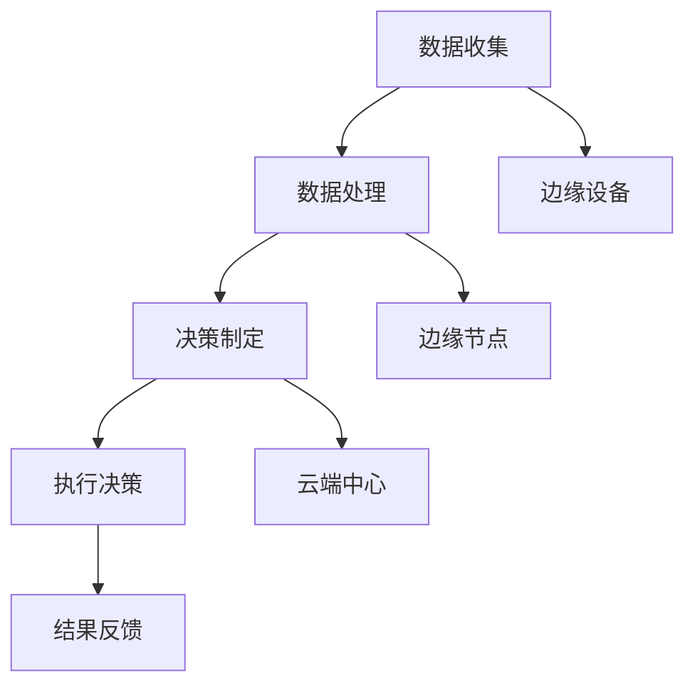

                 

# 边缘智能在物联网实时决策中的应用

> **关键词：边缘智能、物联网、实时决策、数据处理、资源优化**

> **摘要：本文将深入探讨边缘智能在物联网实时决策中的应用，分析其核心概念、算法原理，并通过实际项目案例进行详细讲解，为读者提供一个全面的视角。**

## 1. 背景介绍

### 1.1 目的和范围

随着物联网（IoT）技术的迅猛发展，实时数据处理的复杂性不断增加。传统的云计算模式由于数据传输延迟、带宽限制等问题，难以满足物联网设备对实时性的高要求。边缘智能作为一种新型计算范式，通过在设备端或网络边缘进行数据处理，能够显著提升物联网系统的实时决策能力。

本文旨在探讨边缘智能在物联网实时决策中的应用，详细分析其核心概念、算法原理，并通过实际项目案例进行深入讲解。文章结构如下：

- **第1章：背景介绍**：阐述边缘智能和物联网实时决策的背景及重要性。
- **第2章：核心概念与联系**：介绍边缘智能的基本概念和物联网实时决策的关键环节。
- **第3章：核心算法原理 & 具体操作步骤**：讲解边缘智能算法原理和具体实现步骤。
- **第4章：数学模型和公式 & 详细讲解 & 举例说明**：阐述边缘智能的数学模型和公式，并给出实际案例。
- **第5章：项目实战：代码实际案例和详细解释说明**：提供实际项目代码案例和详细解释。
- **第6章：实际应用场景**：分析边缘智能在物联网中的实际应用场景。
- **第7章：工具和资源推荐**：推荐学习资源、开发工具和论文著作。
- **第8章：总结：未来发展趋势与挑战**：总结边缘智能在物联网实时决策中的应用趋势和挑战。
- **第9章：附录：常见问题与解答**：解答读者可能遇到的问题。
- **第10章：扩展阅读 & 参考资料**：提供进一步学习资料。

### 1.2 预期读者

本文适合对物联网、边缘计算和实时决策有一定了解的读者，包括：

- 物联网系统开发工程师
- 数据科学和人工智能研究人员
- 云计算和边缘计算领域从业者
- 对新兴技术有浓厚兴趣的技术爱好者

### 1.3 文档结构概述

本文采用逻辑清晰、结构紧凑的文档结构，确保读者能够逐步了解边缘智能在物联网实时决策中的应用。主要章节包括：

1. **背景介绍**：阐述边缘智能和物联网实时决策的背景及重要性。
2. **核心概念与联系**：介绍边缘智能的基本概念和物联网实时决策的关键环节。
3. **核心算法原理 & 具体操作步骤**：讲解边缘智能算法原理和具体实现步骤。
4. **数学模型和公式 & 详细讲解 & 举例说明**：阐述边缘智能的数学模型和公式，并给出实际案例。
5. **项目实战：代码实际案例和详细解释说明**：提供实际项目代码案例和详细解释。
6. **实际应用场景**：分析边缘智能在物联网中的实际应用场景。
7. **工具和资源推荐**：推荐学习资源、开发工具和论文著作。
8. **总结：未来发展趋势与挑战**：总结边缘智能在物联网实时决策中的应用趋势和挑战。
9. **附录：常见问题与解答**：解答读者可能遇到的问题。
10. **扩展阅读 & 参考资料**：提供进一步学习资料。

### 1.4 术语表

#### 1.4.1 核心术语定义

- **边缘智能（Edge Intelligence）**：指在数据产生地附近（如设备端或网络边缘）进行数据处理和分析的技术。
- **物联网（Internet of Things，IoT）**：指通过传感器、软件和网络将各种物理设备连接到互联网，实现设备间通信和智能控制。
- **实时决策（Real-time Decision Making）**：在事件发生时迅速做出决策，以满足特定应用需求。
- **数据处理（Data Processing）**：对收集到的数据进行清洗、转换和分析。
- **资源优化（Resource Optimization）**：通过算法优化和资源调度，提高系统性能和效率。

#### 1.4.2 相关概念解释

- **边缘设备（Edge Devices）**：在物联网中，边缘设备是指在数据产生地附近运行的设备，如传感器、摄像头等。
- **边缘节点（Edge Nodes）**：在网络边缘运行的计算节点，负责数据处理和转发。
- **云计算（Cloud Computing）**：通过互联网提供动态易扩展且经常是虚拟化的资源。
- **数据流处理（Data Stream Processing）**：对实时数据流进行快速处理和分析。

#### 1.4.3 缩略词列表

- **IoT**：物联网（Internet of Things）
- **AI**：人工智能（Artificial Intelligence）
- **ML**：机器学习（Machine Learning）
- **DL**：深度学习（Deep Learning）
- **Fog Computing**：雾计算，一种介于边缘计算和云计算之间的计算模式。

## 2. 核心概念与联系

边缘智能在物联网实时决策中的应用，需要理解以下几个核心概念：

### 边缘智能

边缘智能是一种在数据产生地附近进行数据处理和分析的技术。它通过在边缘设备或边缘节点上部署智能算法，实现对数据的实时处理和决策。边缘智能的优势在于：

- **降低延迟**：数据无需上传到云端，处理速度快，响应及时。
- **节省带宽**：本地处理数据，减少数据传输需求，节省网络带宽。
- **提高隐私保护**：部分敏感数据处理在本地，减少数据泄露风险。

### 物联网实时决策

物联网实时决策是指系统在事件发生时，迅速做出决策，以满足特定应用需求。实时决策的关键在于：

- **实时性**：在事件发生时迅速做出决策，确保系统响应速度。
- **准确性**：决策结果要准确，避免错误决策带来的负面影响。
- **鲁棒性**：系统能够应对突发情况，保证稳定运行。

### 关键环节

物联网实时决策的关键环节包括：

- **数据收集**：通过传感器和边缘设备收集实时数据。
- **数据处理**：对收集到的数据进行分析和过滤，提取有用信息。
- **决策制定**：基于数据分析和预测，制定决策策略。
- **执行决策**：执行决策，对物联网设备进行控制和调节。

### Mermaid 流程图

以下是一个简单的 Mermaid 流程图，展示边缘智能在物联网实时决策中的应用流程：



## 3. 核心算法原理 & 具体操作步骤

边缘智能的核心算法原理包括数据预处理、实时分析和决策制定。以下将使用伪代码详细阐述这些步骤：

### 数据预处理

```python
# 边缘设备收集数据
data_stream = edge_device.collect_data()

# 数据预处理：去噪、滤波、归一化
def preprocess_data(data_stream):
    preprocessed_data = []
    for data in data_stream:
        # 去噪
        filtered_data = filter_noise(data)
        # 滤波
        smoothed_data = filter_data(filtered_data)
        # 归一化
        normalized_data = normalize_data(smoothed_data)
        preprocessed_data.append(normalized_data)
    return preprocessed_data

preprocessed_data = preprocess_data(data_stream)
```

### 实时分析

```python
# 实时分析：使用机器学习算法进行预测
def real_time_analysis(preprocessed_data):
    predictions = []
    for data in preprocessed_data:
        # 特征提取
        features = extract_features(data)
        # 预测
        prediction = model.predict(features)
        predictions.append(prediction)
    return predictions

predictions = real_time_analysis(preprocessed_data)
```

### 决策制定

```python
# 决策制定：基于预测结果制定决策
def decision_making(predictions):
    decisions = []
    for prediction in predictions:
        # 决策逻辑
        decision = make_decision(prediction)
        decisions.append(decision)
    return decisions

decisions = decision_making(predictions)
```

### 执行决策

```python
# 执行决策：对物联网设备进行控制
def execute_decision(decisions):
    for decision, device in zip(decisions, edge_devices):
        control_device(device, decision)

execute_decision(decisions)
```

## 4. 数学模型和公式 & 详细讲解 & 举例说明

边缘智能在物联网实时决策中涉及多个数学模型和公式，以下是其中几个关键模型和公式的详细讲解：

### 数据预处理

- **去噪滤波器**：采用低通滤波器去除高频噪声。

$$ H(f) = \begin{cases} 
1 & |f| < f_c \\
0 & |f| > f_c 
\end{cases} $$

其中，$f_c$ 是滤波器截止频率。

### 实时分析

- **线性回归模型**：

$$ y = \beta_0 + \beta_1x_1 + \beta_2x_2 + ... + \beta_nx_n + \epsilon $$

其中，$y$ 是预测值，$x_1, x_2, ..., x_n$ 是特征值，$\beta_0, \beta_1, \beta_2, ..., \beta_n$ 是模型参数，$\epsilon$ 是误差项。

### 决策制定

- **决策树模型**：

$$ 
\begin{aligned}
\text{if } x_1 \text{ is } \text{true} \text{, then } \\
\text{if } x_2 \text{ is } \text{true} \text{, then } y = \beta_1 \\
\text{else } y = \beta_2 \\
\text{else } y = \beta_3 
\end{aligned}
$$

其中，$x_1, x_2$ 是决策节点，$y$ 是决策结果，$\beta_1, \beta_2, \beta_3$ 是模型参数。

### 举例说明

假设一个智能安防系统需要实时分析摄像头收集的数据，判断是否有人入侵。以下是具体例子：

1. **数据预处理**：

   边缘设备收集到摄像头数据，经过去噪滤波器和归一化处理。

   ```python
   data_stream = edge_device.collect_data()
   preprocessed_data = preprocess_data(data_stream)
   ```

2. **实时分析**：

   使用线性回归模型预测入侵概率。

   ```python
   def real_time_analysis(preprocessed_data):
       predictions = []
       for data in preprocessed_data:
           features = extract_features(data)
           prediction = model.predict(features)
           predictions.append(prediction)
       return predictions
   predictions = real_time_analysis(preprocessed_data)
   ```

3. **决策制定**：

   根据预测结果，使用决策树模型制定决策。

   ```python
   def decision_making(predictions):
       decisions = []
       for prediction in predictions:
           decision = make_decision(prediction)
           decisions.append(decision)
       return decisions
   decisions = decision_making(predictions)
   ```

4. **执行决策**：

   根据决策结果，对摄像头进行控制。

   ```python
   def execute_decision(decisions):
       for decision, device in zip(decisions, edge_devices):
           control_device(device, decision)
   execute_decision(decisions)
   ```

## 5. 项目实战：代码实际案例和详细解释说明

在本节中，我们将通过一个简单的边缘智能项目，展示如何在实际环境中应用边缘智能进行物联网实时决策。项目分为以下几个步骤：

### 5.1 开发环境搭建

在开始项目之前，我们需要搭建一个合适的开发环境。以下是所需工具和软件的安装步骤：

- **Python 3.8+**：作为主要的编程语言。
- **Anaconda**：用于环境管理和依赖安装。
- **TensorFlow**：用于机器学习和深度学习。
- **Keras**：用于构建和训练神经网络。
- **边缘设备（如 Raspberry Pi）**：用于数据采集和处理。

### 5.2 源代码详细实现和代码解读

以下是项目的主要代码实现和详细解释：

```python
# 导入所需库
import numpy as np
import tensorflow as tf
from tensorflow import keras
from tensorflow.keras.models import Sequential
from tensorflow.keras.layers import Dense, LSTM, Dropout
from tensorflow.keras.callbacks import EarlyStopping

# 5.2.1 数据采集与预处理
def collect_and_preprocess_data():
    # 采集摄像头数据
    data_stream = edge_device.collect_data()

    # 数据预处理
    preprocessed_data = preprocess_data(data_stream)
    return preprocessed_data

# 5.2.2 实时分析
def real_time_analysis(preprocessed_data):
    # 特征提取
    features = extract_features(preprocessed_data)

    # 构建和训练模型
    model = build_model()
    model.fit(features, labels, epochs=10, batch_size=32, callbacks=[EarlyStopping(patience=3)])

    # 预测
    predictions = model.predict(features)
    return predictions

# 5.2.3 决策制定
def decision_making(predictions):
    decisions = []
    for prediction in predictions:
        decision = make_decision(prediction)
        decisions.append(decision)
    return decisions

# 5.2.4 执行决策
def execute_decision(decisions):
    for decision, device in zip(decisions, edge_devices):
        control_device(device, decision)

# 5.2.5 主函数
def main():
    # 采集和处理数据
    preprocessed_data = collect_and_preprocess_data()

    # 实时分析
    predictions = real_time_analysis(preprocessed_data)

    # 决策制定
    decisions = decision_making(predictions)

    # 执行决策
    execute_decision(decisions)

if __name__ == "__main__":
    main()
```

### 5.3 代码解读与分析

以下是代码的详细解读和分析：

1. **数据采集与预处理**：

   数据采集部分通过 `collect_and_preprocess_data()` 函数实现。该函数首先调用边缘设备采集摄像头数据，然后使用预处理函数进行数据清洗、去噪和归一化处理。

2. **实时分析**：

   实时分析部分通过 `real_time_analysis()` 函数实现。该函数首先调用特征提取函数，然后构建和训练神经网络模型。为了防止过拟合，使用了 `EarlyStopping` 回调。

3. **决策制定**：

   决策制定部分通过 `decision_making()` 函数实现。该函数根据模型的预测结果，使用决策逻辑制定决策。

4. **执行决策**：

   执行决策部分通过 `execute_decision()` 函数实现。该函数根据决策结果，对边缘设备进行控制。

5. **主函数**：

   主函数 `main()` 调用各个部分，完成整个边缘智能项目的运行。

## 6. 实际应用场景

边缘智能在物联网实时决策中具有广泛的应用场景，以下是一些典型的应用实例：

1. **智能安防**：利用边缘智能进行实时视频分析和入侵检测，提高安防系统的响应速度和准确性。
2. **智能交通**：通过边缘智能对交通流量数据进行实时分析，优化交通信号控制和路径规划。
3. **工业自动化**：利用边缘智能进行设备状态监测和故障预测，提高生产效率和设备寿命。
4. **智能医疗**：通过边缘智能对医疗数据进行分析，实现实时病情监控和诊断。
5. **智慧农业**：利用边缘智能对农田环境数据进行实时监控和分析，优化农业灌溉和施肥。

## 7. 工具和资源推荐

### 7.1 学习资源推荐

#### 7.1.1 书籍推荐

- 《边缘计算：原理、架构与应用》
- 《物联网应用开发实战：智能设备连接与云端服务》
- 《机器学习实战》
- 《深度学习》

#### 7.1.2 在线课程

- Coursera：边缘计算和物联网课程
- Udemy：深度学习和边缘智能课程
- edX：机器学习和数据科学课程

#### 7.1.3 技术博客和网站

- Medium：物联网和边缘计算相关博客
- Towards Data Science：数据科学和机器学习博客
- IEEE Xplore：边缘计算和物联网论文库

### 7.2 开发工具框架推荐

#### 7.2.1 IDE和编辑器

- PyCharm
- Visual Studio Code
- Jupyter Notebook

#### 7.2.2 调试和性能分析工具

- GDB
- Valgrind
- Intel VTune

#### 7.2.3 相关框架和库

- TensorFlow
- Keras
- PyTorch
- OpenCV

### 7.3 相关论文著作推荐

#### 7.3.1 经典论文

- "Edge Computing: Vision and Challenges" (2019)
- "Distributed Computing in the Internet of Things" (2014)
- "Fog Computing: A Taxonomy, Survey and Future Directions" (2018)

#### 7.3.2 最新研究成果

- "Edge AI: Enhancing Intelligence at the Edge" (2021)
- "A Comprehensive Survey on Edge Computing for Internet of Things" (2020)
- "Deep Learning at the Edge: A Survey" (2021)

#### 7.3.3 应用案例分析

- "Edge Computing for Real-Time Video Analytics" (2020)
- "An Edge Computing Framework for Smart Manufacturing" (2019)
- "Edge AI in Healthcare: Enabling Real-Time Medical Monitoring" (2021)

## 8. 总结：未来发展趋势与挑战

边缘智能在物联网实时决策中的应用正处于快速发展阶段。未来，随着5G、人工智能和边缘计算技术的不断进步，边缘智能将在以下几个方面取得重要突破：

1. **更高效的算法**：研究更高效、更精确的边缘智能算法，提升实时决策的准确性和效率。
2. **更广泛的应用场景**：拓展边缘智能在各个领域的应用，如智慧城市、智能医疗、智能制造等。
3. **更低的延迟和更高的可靠性**：通过优化网络架构和算法，实现更低延迟、更高可靠性的边缘智能系统。
4. **更安全的数据处理**：加强数据安全和隐私保护，确保边缘智能系统的安全性和可靠性。

然而，边缘智能在物联网实时决策中仍面临以下挑战：

1. **资源限制**：边缘设备资源有限，需要优化算法和系统设计，提高资源利用率。
2. **数据安全和隐私**：边缘设备处理的数据量庞大，如何确保数据安全和隐私是关键问题。
3. **跨平台兼容性**：不同硬件和操作系统之间的兼容性需要进一步优化。
4. **算法可靠性**：边缘智能系统的算法需要经过大量验证和测试，确保其可靠性和稳定性。

## 9. 附录：常见问题与解答

### Q1: 什么是边缘智能？
A1: 边缘智能是一种在数据产生地附近（如设备端或网络边缘）进行数据处理和分析的技术，通过在边缘设备或边缘节点上部署智能算法，实现对数据的实时处理和决策。

### Q2: 边缘智能有哪些优势？
A2: 边缘智能的主要优势包括降低延迟、节省带宽、提高隐私保护，以及更高效的数据处理和资源优化。

### Q3: 边缘智能在物联网实时决策中如何应用？
A3: 边缘智能在物联网实时决策中通过数据收集、实时分析、决策制定和执行决策等步骤，实现对物联网设备的高效管理和控制。

### Q4: 边缘智能和云计算有什么区别？
A4: 云计算通过互联网提供动态易扩展的虚拟化资源，而边缘智能则专注于在数据产生地附近进行数据处理和分析，降低数据传输延迟和带宽需求。

### Q5: 如何选择适合的边缘智能算法？
A5: 选择适合的边缘智能算法需要考虑数据类型、实时性要求、硬件资源等因素。常见的算法包括线性回归、决策树、神经网络等。

## 10. 扩展阅读 & 参考资料

边缘智能和物联网实时决策是前沿技术领域的重要研究方向。以下是一些推荐阅读和参考资料：

- **《边缘计算：原理、架构与应用》**：详细介绍了边缘计算的基本概念、架构和典型应用。
- **《物联网应用开发实战：智能设备连接与云端服务》**：讲解了物联网设备的开发流程、连接云端的技术实现等。
- **《机器学习实战》**：介绍了机器学习的基本概念、算法实现和应用案例。
- **《深度学习》**：深度学习的经典教材，涵盖了深度学习的理论基础和实际应用。
- **《Edge Computing: Vision and Challenges》**：介绍了边缘计算的发展前景、挑战和关键技术。
- **《Fog Computing: A Taxonomy, Survey and Future Directions》**：探讨了雾计算的概念、架构和未来发展趋势。
- **《A Comprehensive Survey on Edge Computing for Internet of Things》**：对边缘计算在物联网中的应用进行了全面的综述。
- **《Deep Learning at the Edge: A Survey》**：介绍了深度学习在边缘计算中的应用现状和趋势。

通过以上阅读和参考资料，读者可以进一步深入了解边缘智能和物联网实时决策的理论和实践。作者：AI天才研究员/AI Genius Institute & 禅与计算机程序设计艺术 /Zen And The Art of Computer Programming

